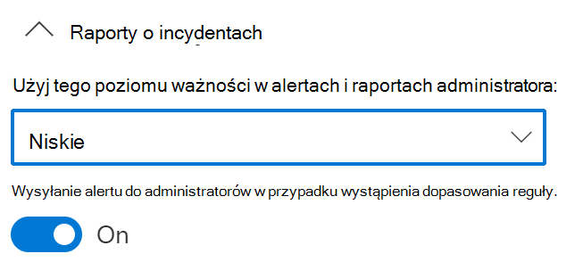

# Korzystanie z ochrony przed utratą danych w punkcie końcowym

W tym artykule otworzymy cztery scenariusze tworzenia i modyfikowania zasad DLP, które wykorzystują urządzenia jako lokalizację.

## Ustawienia DLP

Przed rozpoczęciem należy skonfigurować ustawienia zasad DLP. Ustawienia są stosowane do wszystkich zasad DLP dla urządzeń. Musisz je skonfigurować, jeśli zamierzasz tworzyć zasady wymuszane:

- ograniczenia ruchu wychodzącego w chmurze
- ograniczenia dotyczące aplikacji, których nie obowiązują

Lub

- Jeśli chcesz wykluczyć z monitorowania głośne ścieżki plików

  > [!div class="mx-imgBorder"]
  > 

### Ustawienia parametru DLP Windows 10/11 i systemu macOS

|Ustawienie |Windows 10, 1809 i nowsze, Windows 11  |system macOS Catalina 10.15 lub nowszy (wersja zapoznawcza)  |Uwagi  |
|---------|---------|---------|---------|
|Wykluczenia ścieżek plików     |Obsługiwane         |Obsługiwane         |System macOS zawiera listę zalecanych wykluczeń, która jest domyślnie włączona          |
|Aplikacje niedozwolone     |Obsługiwane         |Obsługiwane         |         |
|Niedozwolone aplikacje Bluetooth aplikacji    |Obsługiwane         |Nie obsługiwane         |         |
|Ograniczenia przeglądarki i domeny dotyczące elementów poufnych      |Obsługiwane         |Obsługiwane         |         |
|Dodatkowe ustawienia dotyczące ochrony przed osią danych (DLP) dla punktu końcowego     |Obsługiwane         |Obsługiwane         |W przypadku urządzeń z systemem macOS są obsługiwane tylko domyślne justowania biznesowe         |
|Zawsze inspekcja działań na plikach dla urządzeń     |Obsługiwane         |Obsługiwane         |         |
|Automatyczne poddaj plikowi kwarantanny z aplikacji niezaszepowiednianych | Obsługiwane | Nie obsługiwane| |
|Klasyfikacja zaawansowana | Obsługiwane | Nie obsługiwane| |
|Uzasadnienie biznesowe w poradach dotyczących zasad | Obsługiwane | Obsługiwane| |

### Zaawansowane skanowanie klasyfikacji i ochrona

Zaawansowane skanowanie klasyfikacji i ochrony umożliwia im bardziej zaawansowane Microsoft 365 klasyfikacji danych w chmurze, może skanować, klasyfikować je i zwracać wyniki na komputer lokalny. Oznacza to, że możesz korzystać z  dokładnych technik klasyfikacji dopasowania danych, nazwanych technik klasyfikacji [jednostek (wersja Preview)](named-entities-learn.md#learn-about-named-entities-preview) w zasadach DLP.

W zaawansowanej klasyfikacji zawartość jest wysyłana z urządzenia lokalnego do usług w chmurze w celu skanowania i klasyfikacji. Jeśli użycie przepustowości jest problemem, możesz ustawić w tym ustawieniu globalnym limit, który jest stosowany na urządzenie, w zależności od tego, ile można używać w okresie 24 godzin. Jeśli ustawisz limit użycia przepustowości i zostanie on przekroczony, ochrona DLP przestanie wysyłać zawartość użytkownika do chmury, a klasyfikacja danych będzie nadal lokalnie na urządzeniu. Gdy skumulowane użycie przepustowości spadnie poniżej kroczącego limitu 24-godzinnego, zostanie wznowiona komunikacja z usługami w chmurze.

Jeśli użycie przepustowości nie jest problemem, nie można ustawić limitu i zezwolić na nieograniczone wykorzystanie przepustowości.

Te Windows obsługują zaawansowane skanowanie klasyfikacji i ochrony:

- Windows 10 20H1/20H2/21H1 (KB 5006738)
- Windows 10 19H1/19H2 (KB 5007189)
- Windows 10 RS5 (kb 5006744)

> [!NOTE]
> Obsługa klasyfikacji zaawansowanej jest dostępna dla Office plików (Word, Excel, PowerPoint) i plików PDF.

> [!NOTE]
> Ocena zasad DLP zawsze odbywa się w chmurze, nawet jeśli zawartość użytkownika nie jest wysyłana.

### Wykluczenia ścieżek plików

Otwórz [Centrum zgodności](https://compliance.microsoft.com) >  **Zapobieganie utraciedanychUzyszania** >  **danychUkluczenia ścieżek plików w** >  programie **DLP**.

Możesz zechcieć wykluczyć określone ścieżki z monitorowania DLP, alertów DLP i wymuszania zasad DLP na twoich urządzeniach, ponieważ są one zbyt głośne lub nie zawierają plików, które Cię interesują. Pliki w tych lokalizacjach nie będą objęte inspekcją, a wszelkie pliki utworzone lub zmodyfikowane w tych lokalizacjach nie będą podlegać wymuszaniom zasad DLP. W ustawieniach DLP można konfigurować wykluczenia ścieżek.

#### Windows 10 urządzenia

Za pomocą tej logiki można utworzyć ścieżki wykluczeń dla Windows 10 urządzeniach:

- Prawidłowa ścieżka pliku, która kończy się na `\`, co oznacza tylko pliki bezpośrednio pod folderem.  Na przykład: `C:\Temp\`

- Prawidłowa ścieżka pliku, która kończy się na `\*`, co oznacza tylko pliki w podfolderach, oprócz plików bezpośrednio pod folderem.  Na przykład: `C:\Temp\*`

- Prawidłowa ścieżka pliku, która kończy się bez `\` `\*`lub , co oznacza, że wszystkie pliki są bezpośrednio pod folderem i wszystkimi podfolderami.  Na przykład: `C:\Temp`

- Ścieżka z symbolami wieloznacznymi między `\` poszczególnymi bokami.  Na przykład: `C:\Users\*\Desktop\`

- Ścieżka z symbolami wieloznacznymi `\` między poszczególnymi stronami i z `(number)` , aby zapewnić dokładną liczbę podfolderów.  Na przykład: `C:\Users\*(1)\Downloads\`

- Ścieżka ze zmiennymi środowiskowym SYSTEM.  Na przykład: `%SystemDrive%\Test\*`

- Połączenie wszystkich powyższych danych.  Na przykład: `%SystemDrive%\Users\*\Documents\*(2)\Sub\`

#### Urządzenia z systemem macOS (wersja zapoznawcza)

Podobnie jak w Windows 10 możesz dodać własne wykluczenia dla urządzeń macOS.

- Definicje ścieżki pliku nie są bez uwzględniania liter, `User` więc są takie same jak `user`w przypadku plików .

- Obsługiwane są wartości symboli wieloznacznych. Definicja ścieżki może zatem zawierać środek `*` ścieżki lub na jej końcu. Na przykład: `/Users/*/Library/Application Support/Microsoft/Teams/*`

#####  Zalecane wykluczenia ścieżek plików (wersja Zapoznawcza)

Ze względów wydajności ochrona przed punktami końcowymi zawiera listę zalecanych wykluczeń ścieżki pliku dla urządzeń z systemem macOS. Te wykluczenia są domyślnie włączone. Możesz je wyłączyć, przełączaąc przełącznik Uwzględnij zalecane wykluczenia ścieżek plików dla komputerów **Mac** . Lista zawiera:

- /Programy/*
- /System/*
- /usr/*
- /Library/*
- /private/*
- /opt/*
- /Użytkownicy/*/Biblioteki/Application Support/Microsoft/Teams/*

### Aplikacje niedozwolone

Zabronione aplikacje to lista tworzyć aplikacje, które nie mają dostępu do pliku chronionego DLP. Jest ona dostępna dla Windows 10 i macOS (wersja zapoznawcza).

Gdy ustawienie Dostępu do zasad **przez** aplikacje niedozwolone jest włączone i aplikacja z listy zabronionej próbuje uzyskać dostęp do pliku chronionego, działanie będzie dozwolone, zablokowane lub zablokowane, ale użytkownicy mogą zastąpić to ograniczenie. Wszystkie działania są sprawdzane i można je przejrzeć w Eksploratorze aktywności.

> [!IMPORTANT]
> Nie dołączaj ścieżki do pliku wykonywalnego, ale tylko nazwy pliku wykonywalnego (na przykład browser.exe).

#### Urządzenia z systemem macOS (wersja zapoznawcza)

Podobnie jak na Windows urządzeniach, teraz będzie można uniemożliwić aplikacjom macOS dostęp do poufnych danych, definiując je na liście Aplikacje niedozwolone. 

> [!NOTE]
> Zwróć uwagę, że aplikacje międzyplatformowe należy wprowadzać przy użyciu ich unikatowych ścieżek odpowiednich do systemu operacyjnego, na który są uruchomione.

Aby znaleźć pełną ścieżkę aplikacji dla komputerów Mac:

1. Na urządzeniu z systemem macOS otwórz **program Monitor aktywności**. Znajdź i kliknij dwukrotnie proces, który chcesz ograniczyć

2. Wybierz **kartę Otwórz pliki i** porty.
  
3. W przypadku aplikacji macOS potrzebna jest pełna nazwa ścieżki, łącznie z nazwą aplikacji.

#### Ochrona poufnych danych przed aplikacjami do synchronizacji z chmurą

Aby uniemożliwić synchronizowanie poufnych elementów z chmurą przez aplikacje do synchronizacji w chmurze, takie jak *onedrive.exe*, dodaj aplikację do synchronizacji chmury do listy aplikacji Niezaszepłane. Jeśli aplikacja do synchronizacji w chmurze zablokowana przez aplikację do synchronizacji w chmurze spróbuje uzyskać dostęp do elementu chronionego przez blokującą zasady DLP, rozwiązanie DLP może generować powtarzające się powiadomienia. Możesz uniknąć tych powtarzających się powiadomień, włączając opcję **Autopoddaj** kwarantannę w obszarze **Aplikacje niedozwolone**.  

##### Automatyczne poddaj kwarantannie (podgląd)

> [!NOTE]
> Automatyczna kwarantanna jest obsługiwana tylko Windows 10 w programie

Jeśli ta funkcja jest włączona, auto kwarantanna jest włączana, gdy aplikacja, która nie została włączona, próbuje uzyskać dostęp do poufnego elementu chronionego przez funkcję DLP. Automatyczna kwarantanna powoduje przeniesienie poufnego elementu do skonfigurowanego folderu administratora i pozostawienie **.txtzastępczego** pliku w miejscu oryginału. Tekst w pliku zastępczym można skonfigurować w taki sposób, aby poinformować użytkowników o miejscu, do którego został przeniesiony element, oraz o innych istotnych informacjach.  

Za pomocą automatycznego kwarantanny możesz zapobiec nieskończonemu łańcuchowi powiadomień DLP dla użytkowników i administratorów — zobacz Scenariusz 4. Unikanie w pętli powiadomień [DLP](#scenario-4-avoid-looping-dlp-notifications-from-cloud-synchronization-apps-with-auto-quarantine-preview) z aplikacji do synchronizacji chmury za pomocą automatycznego kwarantanny (wersja zapoznawcza).

### Niedozwolone aplikacje Bluetooth aplikacji

Uniemożliwiaj innym osobom przesyłanie plików chronionych przez Twoje zasady za pośrednictwem Bluetooth aplikacji.

### Ograniczenia przeglądarki i domeny dotyczące danych poufnych

Ograniczanie plików poufnych, które są zgodne z zasadami, od ich współużytkowania z nieograniczonej domenami usługi w chmurze.

#### Niedozwolone przeglądarki

W przypadku Windows dodajesz przeglądarki określone przez ich wykonywalne nazwy, które będą blokowane do uzyskiwania dostępu do plików, które są zgodne z warunkami wymuszonych zasad DLP, gdzie ograniczenie przekazywania do usług w chmurze jest ustawione na blokowanie lub blokowanie zastępowania. Gdy te przeglądarki będą zablokowane przez te przeglądarki, użytkownicy końcowi zobaczą wyskakujące powiadomienie z prośbą o otwarcie pliku za pośrednictwem Microsoft Edge.

W przypadku urządzeń z systemem macOS należy dodać pełną ścieżkę pliku. Aby znaleźć pełną ścieżkę aplikacji dla komputerów Mac:

1. Na urządzeniu z systemem macOS otwórz **program Monitor aktywności**. Znajdź i kliknij dwukrotnie proces, który chcesz ograniczyć

2. Wybierz **kartę Otwórz pliki i** porty.
  
3. W przypadku aplikacji macOS potrzebna jest pełna nazwa ścieżki, łącznie z nazwą aplikacji.

#### Domeny usługi

> [!NOTE]
> Ustawienie **Domeny usługi dotyczy** tylko plików przekazanych za pomocą programu Microsoft Edge lub Google Chrome z zainstalowanym rozszerzeniem zgodności [firmy Microsoft](dlp-chrome-learn-about.md#learn-about-the-microsoft-compliance-extension).

Możesz kontrolować, czy poufne pliki chronione przez zasady mogą być przekazywane z usługi do określonych domen Microsoft Edge.

Jeśli tryb listy jest **ustawiony na Blokowanie**, użytkownik nie będzie mógł przekazywać do tych domen poufnych elementów. Jeśli akcja przekazywania zostanie zablokowana, ponieważ element jestowy pasowany do zasad DLP, zasady DLP wygenerują ostrzeżenie lub zablokują przekazywanie poufnego elementu.

Jeśli dla trybu listy ustawiono zezwalanie **, użytkownicy** będą mogli przekazywać poufne elementy tylko do tych **** domen, a przekazywanie dostępu do wszystkich innych domen jest niedozwolone.

> [!IMPORTANT]
> Gdy dla trybu ograniczeń usługi jest ustawiona wartość "Zezwalaj", przed wymuszeniami ograniczeń musisz mieć skonfigurowaną co najmniej jedną domenę usługi.

Używanie formatu FQDN domeny usługi bez zakończenia `.` 

Przykład:

 `www.contoso.com` 

Symbole wieloznaczne nie są obsługiwane.

### Dodatkowe ustawienia dotyczące ochrony przed dlp punktu końcowego

#### Uzasadnienie biznesowe w poradach dotyczących zasad

Możesz kontrolować sposób interakcji użytkowników z opcją justowania firmy w powiadomieniach porad dotyczących zasad DLP. Ta opcja jest wyświetlana, gdy użytkownicy wykonują działania chronione przez ustawienie **Blokuj z zastępowaniem** w zasadach DLP. To ustawienie globalne. Możesz wybrać jedną z następujących opcji:

- **Pokaż opcje domyślne i niestandardowe** pole tekstowe: Domyślnie użytkownicy mogą wybrać wbudowane justowanie lub wprowadzić własny tekst.
- **Pokaż tylko opcje domyślne**: Użytkownicy mogą wybrać tylko wbudowane justowanie.
- **Pokaż tylko niestandardowe pole tekstowe**: Użytkownicy mogą wprowadzać tylko własne justowanie. W powiadomieniu z poradami o zasadach użytkownika końcowego zostanie wyświetlone tylko pole tekstowe. 

##### Dostosowywanie opcji w menu rozwijaym

Możesz utworzyć maksymalnie pięć dostosowanych opcji, które będą wyświetlane, gdy użytkownicy będą wchodzić w interakcje z poradą z powiadomieniami o zasadach, wybierając **menu rozwijane Dostosuj opcje**. 

|Opcja |Tekst domyślny  |
|---------|---------|
|opcja 1    | **Jest to część ustanowionego przepływu pracy biznesowej**  lub można wprowadzić tekst niestandardowy        |
|opcja 2  |**Mój kierownik zatwierdził tę akcję** lub możesz wprowadzić tekst niestandardowy         |
|opcja 3   |**Wymagany pilny dostęp; Powiadomię kierownika oddzielnie** lub będzie można wprowadzić tekst niestandardowy          |
|Pokaż opcję wyników fałszywie dodatnich     |**Informacje w tych plikach nie są poufne lub** możesz wprowadzić tekst niestandardowy          |
|opcja 5    |**Inny** tekst lub możesz wprowadzić tekst niestandardowy         |

<!--See [Scenario 5: Configure a policy to use the customized business justification](#scenario-5-configure-a-policy-to-use-the-customized-business-justification)-->

### Zawsze inspekcja działań na plikach dla urządzeń

Domyślnie, gdy urządzenia są włączone, działania dotyczące plików Office, PDF i CSV są automatycznie sprawdzane i dostępne do przeglądu w Eksploratorze aktywności. Wyłącz tę funkcję, jeśli chcesz, aby to działanie było objęte inspekcją tylko wtedy, gdy włączone urządzenia są uwzględnione w aktywnych zasadach.

Aktywność w zakresie plików będzie zawsze podsyłana w przypadku urządzeń włączonych do pracy, niezależnie od tego, czy są zawarte w aktywnych zasadach.

## Wiążenie ustawień DLP

Dzięki zasadom DLP i Edge Chromium przeglądarce internetowej możesz ograniczyć niezamierzone udostępnianie elementów poufnych do aplikacji i usług w chmurze, które nie są niedozwolone. Program Edge Chromium rozumie, kiedy element jest ograniczony przez zasady DLP punktu końcowego i wymusza ograniczenia dostępu.

W przypadku używania funkcji DLP punktu końcowego jako lokalizacji w prawidłowo skonfigurowanych zasadach DLP i przeglądarce programu Microsoft Edge niedozwolone przeglądarki zdefiniowane w tych ustawieniach nie będą mieć dostępu do poufnych elementów, które są zgodne z kontrolkami zasad DLP. Zamiast tego użytkownicy będą przekierowywani do używania aplikacji Microsoft Edge które, wraz ze zrozumieniem nałożonych ograniczeń ochrony przed zasadami DLP, mogą blokować lub ograniczać działania, gdy zostaną spełnione warunki zasad DLP.

Aby użyć tego ograniczenia, musisz skonfigurować trzy ważne elementy:

1. Określ miejsca — usługi, domeny, adresy IP — w przypadku których chcesz zapobiec udostępnianiu poufnych elementów.

2. Dodaj przeglądarki, które nie mają dostępu do określonych elementów poufnych w przypadku wystąpienia dopasowania zasad DLP.

3. Skonfiguruj zasady DLP w celu zdefiniowania rodzajów elementów poufnych, dla których przekazywanie powinno być ograniczone do tych miejsc, włączając usługę **Upload** do usług w chmurze i dostęp z wszelkiej **przeglądarki**.

Możesz nadal dodawać nowe usługi, aplikacje i zasady, aby rozszerzać i rozszerzać ograniczenia w celu zaspokojenia potrzeb biznesowych i ochrony poufnych danych. 

Dzięki tej konfiguracji dane pozostają bezpieczne, a jednocześnie nie trzeba ograniczać niepotrzebnych ograniczeń uniemożliwiających użytkownikom uzyskiwanie dostępu do elementów nie poufnych i udostępnianie ich.

## Scenariusze zasad DLP punktu końcowego

Aby ułatwić Ci zapoznanie się z funkcjami DLP w punktach końcowych i ich działaniami w zasadach ochrony przed zasadami DLP, znajdziesz w nim kilka scenariuszy do obserwowania.

> [!IMPORTANT]
> Te scenariusze ochrony przed dlp punktu końcowego nie są oficjalnymi procedurami tworzenia i dostosowywania zasad DLP. Aby pracować z zasadami ochrony przed zasadami DLP w sytuacjach ogólnych, zapoznaj się z poniższymi tematami:
>
>- [Informacje na temat ochrony przed utratą danych](dlp-learn-about-dlp.md)
>- [Wprowadzenie do domyślnych zasad DLP](get-started-with-the-default-dlp-policy.md)
>- [Tworzenie zasad DLP na podstawie szablonu](create-a-dlp-policy-from-a-template.md)
>- [Tworzenie, testowanie i dostosowywanie zasad DLP](create-test-tune-dlp-policy.md)

### Scenariusz 1. Tworzenie zasad na podstawie szablonu, tylko inspekcja

Te scenariusze wymagają, aby urządzenia były już podłączone i raportowane w Eksploratorze aktywności. Jeśli urządzenia nie zostały jeszcze na nim podłączone, zobacz Wprowadzenie do ochrony przed utratą danych [w punkcie końcowym](endpoint-dlp-getting-started.md).

1. Otwórz stronę [Ochrona przed utratą danych](https://compliance.microsoft.com/datalossprevention?viewid=policies).

2. Wybierz **pozycję Utwórz zasady**.

3. W tym scenariuszu wybierz pozycję **Prywatność**, a następnie Dane umożliwiające identyfikację użytkownika **(PII)** w Stanach Zjednoczonych, a następnie wybierz pozycję **Dalej**.

4. Wyłącz pole **Stan dla** wszystkich lokalizacji z wyjątkiem **urządzeń**. Wybierz przycisk **Dalej**.

5. Zaakceptuj ustawienia domyślne **Przejrzyj i dostosuj ustawienia z wyboru szablonu** , a następnie wybierz przycisk **Dalej**.

6. Zaakceptuj domyślne wartości **akcji ochrony i** wybierz przycisk **Dalej**.

7. Wybierz **pozycję Inspekcja lub ograniczanie działań na Windows urządzeniach** i pozostaw akcje ustawione na Tylko **inspekcja**. Wybierz przycisk **Dalej**.

8. Zaakceptuj ustawienie domyślne **, które chcę przetestować** jako pierwszą wartość, a następnie wybierz pozycję **Pokaż porady dotyczące zasad w trybie testowania**. Wybierz przycisk **Dalej**.

9. Przejrzyj ustawienia i wybierz pozycję **Prześlij**.

10. Nowe zasady DLP zostaną wyświetlone na liście zasad.

11. Sprawdź, czy w Eksploratorze aktywności nie ma danych z monitorowanych punktów końcowych. Ustaw filtr lokalizacji dla urządzeń i dodaj zasady, a następnie filtruj według nazw zasad, aby zobaczyć wpływ tych zasad. zobacz [Wprowadzenie do Eksploratora aktywności](data-classification-activity-explorer.md), jeśli to konieczne.

12. Spróbuj udostępnić test zawierający zawartość, która wyzwoli warunek danych umożliwiających identyfikację użytkownika (PII) w Stanach Zjednoczonych osobie spoza organizacji. Powinno to wyzwolić zasady.

13. Sprawdź w Eksploratorze aktywności zdarzenie.

### Scenariusz 2. Modyfikowanie istniejących zasad i ustawianie alertu

1. Otwórz stronę [Ochrona przed utratą danych](https://compliance.microsoft.com/datalossprevention?viewid=policies).

2. Wybierz zasady **danych umożliwiających identyfikację użytkownika (PII)** utworzone w scenariuszu 1.

3. Wybierz **pozycję Edytuj zasady**.

4. Przejdź do strony **Advanced DLP rules** (Zaawansowane reguły DLP) i edytuj stan **inf** (Niska ilość zawartości wykrytej jako identyfikowalna danych osobowych Stanów Zjednoczonych).

5. Przewiń w dół do sekcji **Raporty o incydentach** i ustaw dla administratorów ustawienie **Wysyłaj alert** , gdy wystąpi dopasowanie reguły do **pozycji Wł**. Alerty e-mail będą automatycznie wysyłane do administratora i wszystkich innych osób, które dodasz do listy adresatów. 

   > [!div class="mx-imgBorder"]
   > 
   
6. Na potrzeby tego scenariusza wybierz pozycję Wyślij alert za każdym razem, **gdy działanie będzie odpowiadać reguły**.

7. Wybierz pozycję **Zapisz**.

8. Zachowaj wszystkie poprzednie ustawienia, wybierając przycisk **Dalej** , a **następnie pozycję Prześlij** zmiany zasad.

9. Spróbuj udostępnić test zawierający zawartość, która wyzwoli warunek danych umożliwiających identyfikację użytkownika (PII) w Stanach Zjednoczonych osobie spoza organizacji. Powinno to wyzwolić zasady.

10. Sprawdź w Eksploratorze aktywności zdarzenie.

### Scenariusz 3. Modyfikowanie istniejących zasad, blokowanie akcji za pomocą zastępowania zezwalania

1. Otwórz stronę [Ochrona przed utratą danych](https://compliance.microsoft.com/datalossprevention?viewid=policies).

2. Wybierz zasady **danych umożliwiających identyfikację użytkownika (PII)** utworzone w scenariuszu 1.

3. Wybierz **pozycję Edytuj zasady**.

4. Przejdź do strony **Advanced DLP rules** (Zaawansowane reguły DLP) i edytuj stan **inf** (Niska ilość zawartości wykrytej jako identyfikowalna danych osobowych Stanów Zjednoczonych).

5. Przewiń w dół do sekcji **Inspekcja lub ograniczanie działań na Windows** urządzeniach i dla każdego działania ustaw odpowiednią akcję **Zablokuj z zastępowaniem**.

   > [!div class="mx-imgBorder"]
   > 
   
6. Wybierz pozycję **Zapisz**.

7. Powtórz kroki od 4 do 7 w przypadku dużej ilości zawartości wykrytej w **U.S. Personally Identifiable Inf**.

8. Zachowaj wszystkie poprzednie ustawienia, wybierając przycisk **Dalej** , a **następnie pozycję Prześlij** zmiany zasad.

9. Spróbuj udostępnić test zawierający zawartość, która wyzwoli warunek danych umożliwiających identyfikację użytkownika (PII) w Stanach Zjednoczonych osobie spoza organizacji. Powinno to wyzwolić zasady.

   Na urządzeniu klienckim pojawi się takie wyskakujące okienko:

   > [!div class="mx-imgBorder"]
   > 

10. Sprawdź w Eksploratorze aktywności zdarzenie.

### Scenariusz 4. Unikanie w pętli powiadomień DLP z aplikacji do synchronizacji chmury z automatycznym kwarantanną (wersja zapoznawcza)

#### Przed rozpoczęciem

W tym scenariuszu synchronizowanie plików z etykietą poufności **Wysoce** poufne OneDrive jest blokowane. Jest to złożony scenariusz z wieloma składnikami i procedurami. Potrzebne są:

- Konto AAD docelowe i komputer Windows 10, który już synchronizuje lokalny folder poczty OneDrive z magazynem OneDrive w chmurze.
- Microsoft Word na komputerze docelowym Windows 10 komputera
- Skonfigurowane i opublikowane etykiety wrażliwości — zobacz [Wprowadzenie do](get-started-with-sensitivity-labels.md#get-started-with-sensitivity-labels) etykiet wrażliwości oraz [Tworzenie i konfigurowanie etykiet wrażliwości oraz ich zasad](create-sensitivity-labels.md#create-and-configure-sensitivity-labels-and-their-policies).

Istnieją trzy procedury.

1. Skonfiguruj ustawienia punktu końcowego DLP do automatycznej kwarantanny.
2. Tworzenie zasad blokowania elementów poufnych, które mają **etykietę Poufność** wysoce poufna.
3. Utwórz dokument programu Word na urządzeniu Windows 10, na które są kierowane zasady, zastosuj etykietę i skopiuj ją do lokalnego folderu poczty OneDrive użytkowników, który jest synchronizowany.  

#### Konfigurowanie aplikacji usługi DLP dla punktu końcowego i ustawień automatycznej kwarantanny

1. Otwórz [ustawienia ochrony przed DLP punktu końcowego](https://compliance.microsoft.com/datalossprevention?viewid=globalsettings)

2. **Rozwiń niezaszepowane aplikacje**.

3. Wybierz **pozycję Dodaj lub** edytuj aplikacje niedozwolone *i* dodaj program OneDrive jako nazwę wyświetlaną oraz plik wykonywalny *onedrive.exe*, aby nie zezwalać onedrive.exe na dostęp do elementów etykiety **Wysoce poufne.**

4. Wybierz **pozycję Automatycznie poddaj kwarantannie i** **zapisz**.

5. W **obszarze Ustawienia auto kwarantanny wybierz** **pozycję Edytuj ustawienia auto kwarantanny**.

6. Włącz **automatyczne kwarantannę dla aplikacji niezaszepłanych**.

7. Wprowadź ścieżkę do folderu na komputerach lokalnych, do którego chcesz przenieść oryginalne poufne pliki. Przykład:
   
    **Element "%homedrive%%homepath%\Microsoft DLP\Quarantine"** dla użytkownika *Isaiah langer* będzie umieszczał przeniesione elementy w folderze o nazwie:  

    *C:\Użytkownicy\IsaiahLanger\Microsoft DLP\Quarantine\OneDrive*

    i dołącz sygnaturę daty i czasu do oryginalnej nazwy pliku.
    
    > [!NOTE]
    > Funkcja automatycznego kwarantanny DLP utworzy podfoldery dla plików dla każdej aplikacji, która nie została odblokowana. Jeśli na liście *nie Notatnik* aplikacji znajduje się zarówno folder *Notatnik*, jak i folder OneDrive, zostanie utworzony podfolder dla folderu **\OneDrive, a** inny podfolder dla folderu **\Notatnik**.

8. Wybierz **pozycję Zamień pliki na plik .txt zawierający** następujący tekst, a następnie wprowadź odpowiedni tekst w pliku zastępczym. Na przykład w przypadku pliku o *nazwie Autokwartyl 1.docx*:
    
    > Plik %%FileName%% zawiera informacje poufne, które twoja organizacja chroni za pomocą zasad ochrony przed utratą danych (DLP) %%PolicyName%% i została przeniesiona do folderu kwarantanny: %%QuarantinePath%%
    
    pozostawi plik tekstowy zawierający ten komunikat:
    
    > Autokwartyl 1.docx zawiera informacje poufne, które twoja organizacja chroni za pomocą zasad ochrony przed utratą danych (DLP), i została przeniesiona do folderu kwarantanny: C:\Użytkownicy\IsaiahLanger\Microsoft DLP\Quarantine\OneDrive\autokwartyl 1_20210728_151541.docx.

9. Wybierz **pozycję Save (Zapisz).**

#### Konfigurowanie zasad w celu blokowania synchronizacji OneDrive plików z etykietą poufności Wysoce poufne

1. Otwórz stronę [Ochrona przed utratą danych](https://compliance.microsoft.com/datalossprevention?viewid=policies).

2. Wybierz **pozycję Utwórz zasady**.

3. W tym scenariuszu wybierz pozycję **Zasady** niestandardowe, a następnie **pozycję Zasady niestandardowe** i pozycję **Dalej**.

4. Wypełnij pola **Nazwa i** **Opis** i wybierz przycisk **Dalej**.

5. Wyłącz pole **Stan dla** wszystkich lokalizacji z wyjątkiem **urządzeń**. Jeśli masz określone konto użytkownika końcowego, z którego chcesz to sprawdzić, wybierz je w zakresie. Wybierz przycisk **Dalej**.

6. Zaakceptuj domyślną opcję **Utwórz lub dostosuj zaawansowane reguły DLP** i wybierz przycisk **Dalej**.

7. Utwórz regułę z tymi wartościami:
    1. **Nazwa** >  *Scenariusz 4. Automatyczne poddaj kwarantannie*.
    1. **Warunki** >  **Zawartość zawiera** >  **Etykiety wrażliwości** >  **Wysoce poufne**.
    1.  **Akcje** >  **Inspekcja lub ograniczanie działań na Windows Dostęp** >  **przez aplikacje** **niedozwoloneBlok.** >  Na potrzeby tego scenariusza wyczyść wszystkie pozostałe działania.
    1. **Powiadomienia użytkownika** >  **Wł**.
    1. **Urządzenia punktu końcowego** > Wybierz pozycję Pokaż użytkownikom powiadomienie z poradą o **zasadach, jeśli działanie nie** zostało jeszcze włączone.
    
8. Wybierz **pozycję Zapisz i** **dalej**.

9. Wybierz **pozycję Włącz od razu**. Wybierz przycisk **Dalej**.

10. Przejrzyj ustawienia i wybierz pozycję **Prześlij**.

    > [!NOTE]
    > Zezwalaj na replikowanie nowych zasad i ich zastosowanie do komputera docelowego Windows 10 godzinę.

11. Nowe zasady DLP zostaną wyświetlone na liście zasad.

#### Testowanie automatycznego kwarantanny na Windows 10 urządzenia

1. Zaloguj się Windows 10 komputera przy użyciu konta użytkownika określonego w kroku 5 konfigurowanie zasad w celu blokowania OneDrive synchronizacji plików z etykietą poufności [Wysoce](#configure-a-policy-to-block-onedrive-synchronization-of-files-with-the-sensitivity-label-highly-confidential) poufne.

2. Utwórz folder, którego zawartość nie będzie synchronizowana z folderem OneDrive. Przykład:

    *C:\folder źródłowy autodeks kwarantanny*

3. Otwórz Microsoft Word i utwórz plik w folderze źródłowym autodeks kwarantanny. Stosowanie **etykiety Wysoce poufne** poufność. zobacz [Stosowanie etykiet wrażliwości do plików i wiadomości e-mail w Office](https://support.microsoft.com/topic/apply-sensitivity-labels-to-your-files-and-email-in-office-2f96e7cd-d5a4-403b-8bd7-4cc636bae0f9).

4. Skopiuj właśnie utworzony plik do folderu OneDrive synchronizacji. Powinien zostać wyświetlony wyskakujące powiadomienie użytkownika z informacją, że akcja nie jest dozwolona i że plik zostanie poddany kwarantannie. Na przykład w przypadku nazwy użytkownika *Izaiah Langer* i dokumentu zatytułowanego autodadeksuj dokument 1.docxzostanie wyświetlony ten komunikat:**

    
    
    Zostanie wyświetlony komunikat:
    
    > Otwieranie autokwadranowego 1.docx za pomocą tej aplikacji nie jest dozwolone. Plik zostanie poddany kwarantannie w folderze "C:\Użytkownicy\IsaiahLanger\Microsoft DLP\OneDrive"

5. Wybierz **pozycję Odrzuć**.

6. Otwórz plik tekstowy uchwytu miejsca. Będzie on nosił nazwę **autodadeksu do kwarantanny 1.docx_ *date_time*.txt**. 

7. Otwórz folder kwarantanny i upewnij się, że znajduje się tam oryginalny plik.
 
8. Sprawdź, czy w Eksploratorze aktywności nie ma danych z monitorowanych punktów końcowych. Ustaw filtr lokalizacji dla urządzeń i dodaj zasady, a następnie filtruj według nazw zasad, aby zobaczyć wpływ tych zasad. zobacz [Wprowadzenie do Eksploratora aktywności](data-classification-activity-explorer.md), jeśli to konieczne.

9. Sprawdź w Eksploratorze aktywności zdarzenie.

## Zobacz też

- [Informacje na temat ochrony przed utratą danych w punkcie końcowym](endpoint-dlp-learn-about.md)
- [Wprowadzenie do ochrony przed utratą danych w punkcie końcowym](endpoint-dlp-getting-started.md)
- [Informacje na temat ochrony przed utratą danych](dlp-learn-about-dlp.md)
- [Tworzenie, testowanie i dostosowywanie zasad DLP](create-test-tune-dlp-policy.md)
- [Wprowadzenie do Eksploratora aktywności](data-classification-activity-explorer.md)
- [Ochrona punktu końcowego w usłudze Microsoft Defender](/windows/security/threat-protection/)
- [Narzędzia i metody dołączania do Windows 10 komputerów](/microsoft-365/compliance/dlp-configure-endpoints)
- [Microsoft 365 subskrypcji](https://www.microsoft.com/microsoft-365/compare-microsoft-365-enterprise-plans?rtc=1)
- [Azure Active Directory (AAD)](/azure/active-directory/devices/concept-azure-ad-join)
- [Pobierz nowy Microsoft Edge na podstawie Chromium](https://support.microsoft.com/help/4501095/download-the-new-microsoft-edge-based-on-chromium)
- [Wprowadzenie do domyślnych zasad DLP](get-started-with-the-default-dlp-policy.md)
- [Tworzenie zasad DLP na podstawie szablonu](create-a-dlp-policy-from-a-template.md)
