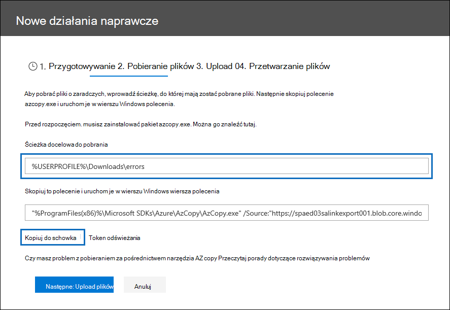
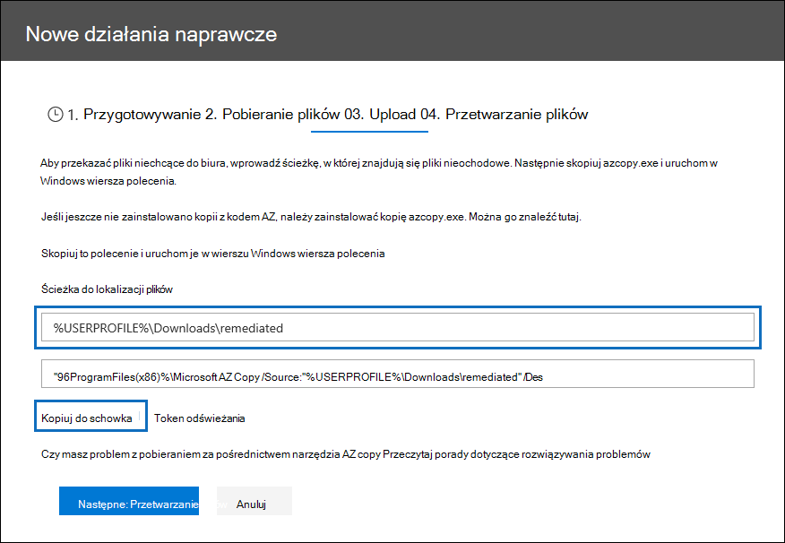
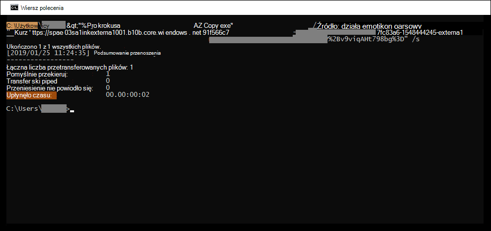

# Rozwiązywanie problemów podczas przetwarzania danych

Działania naprawcze dotyczące błędów umożliwiają administratorom zbierania elektronicznych materiałów dowodowych rozwiązywanie problemów z danymi, które uniemożliwiają Advanced eDiscovery prawidłowego przetwarzania zawartości. Na przykład pliki chronione hasłem nie mogą być przetwarzane, ponieważ są one zablokowane lub zaszyfrowane. Za pomocą środków zaradczych w przypadku błędów administratorzy zbierania elektronicznych materiałów dowodowych mogą pobierać pliki z takimi błędami, usuwać ochronę hasłem, a następnie przekazywać te pliki.

Za pomocą następującego przepływu pracy można rozwiązać błędy w plikach w Advanced eDiscovery przypadku.

## Tworzenie sesji rozwiązywania problemów z błędami w celu rozwiązywania problemów z plikami z błędami przetwarzania

> [!NOTE]
> Jeśli kreator rozwiązywania problemów z błędami zostanie zamknięty w dowolnym momencie poniższej procedury, możesz wrócić do sesji rozwiązywania problemów z kartą Przetwarzanie, wybierając pozycję Działania  naprawcze w menu rozwijanych  Widok.

1. Na karcie **Przetwarzanie** w przypadku Advanced eDiscovery wybierz pozycję Błędy z menu rozwijanego Widok,  a następnie wybierz zestaw recenzji lub całą sprawę z menu rozwijanego Zakres.  W tej sekcji są wyświetlane wszystkie błędy dotyczące danej sprawy lub błędu z określonego zestawu recenzji.

   

2. Wybierz błędy, które chcesz usunąć, klikając przycisk radiowy obok typu błędu lub typu pliku.  W poniższym przykładzie naprawiamy pliki chronione hasłem.

3. Kliknij **pozycję Rozwiązywanie nowych błędów**.

    Przepływ pracy Rozwiązywania problemów z błędami rozpoczyna się od etapu przygotowywania, w którym pliki z błędami są kopiowane do lokalizacji usługi Azure Storage dostarczonych przez firmę Microsoft, aby można było pobrać je na komputer lokalny w celu rozwiązania tych problemów.

    

4. Po zakończeniu przygotowywania kliknij przycisk **Dalej: Pobierz pliki,** aby kontynuować pobieranie.

    

5. Aby pobrać pliki, określ **ścieżkę docelową pobierania**. Jest to ścieżka do folderu nadrzędnego na komputerze lokalnym, w którym zostanie pobrany plik.  Domyślna ścieżka ,%USERPROFILE%\Downloads\errors, wskazuje folder pobranych zalogowanych użytkowników. W razie potrzeby możesz zmienić tę ścieżkę. Jeśli to zrobisz, zalecamy użycie lokalnej ścieżki pliku w celu najlepszej wydajności. Nie używaj zdalnej ścieżki sieciowej. Możesz na przykład użyć ścieżki **C:\Remediation**.

   Ścieżka do folderu nadrzędnego jest automatycznie dodawana do polecenia AzCopy (jako wartość **parametru /Dest** ).

6. Skopiuj wstępnie zdefiniowane polecenie, klikając pozycję **Kopiuj do schowka**. Otwórz wiersz Windows wiersza polecenia, wklej polecenie AzCopy, a następnie naciśnij klawisz **Enter**.

    

    > [!NOTE]
    > Aby pomyślnie użyć polecenia podanego na stronie Pobieranie plików, należy użyć programu AzCopy w wersji 8.1. Aby przekazać pliki w kroku 10, należy również użyć programu AzCopy w wersji 8.1. Aby zainstalować tę wersję produktu AzCopy, zobacz [Przenoszenie danych za pomocą programu AzCopy w wersji 8.1](/previous-versions/azure/storage/storage-use-azcopy) na Windows. Jeśli podane polecenie AzCopy nie powiedzie się, zobacz Rozwiązywanie [problemów z azCopy w programie Advanced eDiscovery](troubleshooting-azcopy.md).

    Wybrane pliki zostaną pobrane do lokalizacji określonej w kroku 5. W folderze nadrzędnym (na przykład **C:\Remediation**) jest automatycznie tworzona następująca struktura podfolderu:

    `<Parent folder>\Subfolder 1\Subfolder 2\<file>`

    - *Nazwa podfolderu 1* ma identyfikator sprawy lub zestaw recenzji, w zależności od zakresu wybranego w kroku 1.

    - *Nazwa podfolderu 2* ma identyfikator pliku pobranego pliku

    - Pobrany plik znajduje się w *podfolderze 2* i nosi też nazwę z identyfikatorem pliku.

    Oto przykład ścieżki folderu i nazwy pliku błędu, które są tworzone po pobraniu elementów do folderu nadrzędnego **C:\Remediation** :

    `C:\Remediation\232f8b7e-089c-4781-88c6-210da0615d32\d1459499146268a096ea20202cd029857d64087706e6d6ca2a224970ae3b8938\d1459499146268a096ea20202cd029857d64087706e6d6ca2a224970ae3b8938.docx`

    W przypadku pobierania wielu plików każdy z nich jest pobierany do podfolderu o nazwie Identyfikator pliku.

    > [!IMPORTANT]
    > Podczas przekazywania plików w krokach 9 i 10 pliki zaradcze muszą mieć tę samą nazwę i znajdować się w tej samej strukturze podfolderu. Podfolder i nazwy plików są używane do skojarzenia pliku usuniętego z oryginalnym plikiem błędu. W przypadku zmiany struktury folderów lub nazw plików zostanie wyświetlony następujący komunikat o błędzie: `Cannot apply Error Remediation to the current Workingset`. Aby zapobiec problemom, zalecamy, aby pliki zaradcze nie zawierały tej samej struktury folderu nadrzędnego i podfolderu.

7. Po pobraniu plików możesz rozwiązać je za pomocą odpowiedniego narzędzia. W przypadku plików chronionych hasłem można użyć kilku narzędzi do pękania haseł. Jeśli znasz hasła do plików, możesz je otworzyć i usunąć ochronę hasłem.

8. Wróć do Advanced eDiscovery i kreatora rozwiązywania problemów, a następnie kliknij przycisk Dalej **: Upload plików**.  Zostanie to przejście do następnej strony, na której możesz teraz przekazywać pliki.

    

9. Określ folder nadrzędny, w którym znajdują się pliki zaradcze, w polu tekstowym Ścieżka **do lokalizacji** plików. Również folder nadrzędny musi mieć tę samą strukturę podfolderu, która została utworzona podczas pobierania plików.

    Ścieżka do folderu nadrzędnego jest automatycznie dodawana do polecenia AzCopy (jako wartość **parametru /Source** ).

10. Skopiuj wstępnie zdefiniowane polecenie, klikając pozycję **Kopiuj do schowka**. Otwórz wiersz Windows wiersza polecenia, wklej polecenie AzCopy, a następnie naciśnij klawisz **Enter**. przekaż pliki.

    

11. Po uruchomieniu polecenia AzCopy kliknij przycisk **Dalej: Pliki procesu**.

    Po zakończeniu przetwarzania możesz przejrzeć zestaw i wyświetlić pliki zaradcze.

## Rozwiązywanie problemów z błędami w plikach kontenerów

W sytuacjach, gdy zawartości pliku kontenera (na przykład pliku .zip) nie można wyodrębnić przez aplikację Advanced eDiscovery, można pobrać kontenery i rozszerzyć zawartość do tego samego folderu, w którym znajduje się oryginalny kontener. Rozwinięte pliki zostaną przypisane do kontenera nadrzędnego, tak jakby pierwotnie były rozwinięte przez Advanced eDiscovery. Ten proces działa zgodnie z powyższym opisem, z wyjątkiem przekazywania pojedynczego pliku jako pliku zastępczego.  Podczas przekazywania plików zaradczych nie dołączaj oryginalnego pliku kontenera.

## Remediating errors by uploading the extracted text

Czasami nie można rozwiązać problemów z plikiem natywnym formatu, który Advanced eDiscovery interpretować. Możesz jednak zastąpić oryginalny plik plikiem tekstowym zawierającym oryginalny tekst pliku natywnego (w procesie nazywanym *nakładaniem tekstu*). W tym celu wykonaj czynności opisane w tym artykule, ale zamiast korygować oryginalny plik w formacie natywnym, należy utworzyć plik tekstowy zawierający wyodrębniony tekst z oryginalnego pliku, a następnie przekazać ten plik tekstowy przy użyciu oryginalnej nazwy pliku dołączonej z sufiksem programu .txt. Na przykład podczas rozwiązywania problemów można pobrać plik o nazwie 335850cc-6602-4af0-acfa-1d14d9128ca2.abc. Otwórz plik w aplikacji natywnej, skopiuj tekst, a następnie wklej go do nowego pliku o nazwie 335850cc-6602-4af0-acfa-1d14d9128ca2.abc.txt. W takim przypadku pamiętaj o usunięciu oryginalnego pliku w formacie natywnym z lokalizacji plików zaradczych na komputerze lokalnym przed przekazaniem zaradczego pliku tekstowego do usługi Advanced eDiscovery.

## Co się dzieje w przypadku rozwiązywania problemów z plikami

Po przesłaniu zaradczych plików oryginalne metadane są zachowywane z wyjątkiem następujących pól:

- ExtractedTextSize
- HasText
- IsErrorRemediate
- LoadId
- ProcessingErrorMessage
- ProcessingStatus
- Tekst
- WordCount
- WorkingsetId

Aby uzyskać definicję wszystkich pól metadanych w Advanced eDiscovery, zobacz [Pola metadanych dokumentu](document-metadata-fields-in-advanced-ediscovery.md).