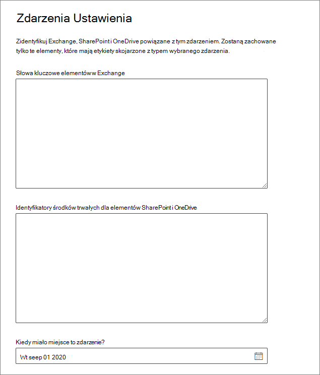

# <a name="start-retention-when-an-event-occurs"></a>Rozpocznij przechowywanie po wystąpieniu zdarzenia

>*[Microsoft 365 wskazówki dotyczące licencjonowania dotyczące zgodności & zabezpieczeń](/office365/servicedescriptions/microsoft-365-service-descriptions/microsoft-365-tenantlevel-services-licensing-guidance/microsoft-365-security-compliance-licensing-guidance).*

[!include[Purview banner](../includes/purview-rebrand-banner.md)]

W przypadku przechowywania zawartości okres przechowywania jest często określany na podstawie wieku zawartości. Na przykład można przechowywać dokumenty przez siedem lat po ich utworzeniu, a następnie usuwać je. Jednak podczas konfigurowania [etykiet przechowywania](retention.md#retention-labels) można również oprzeć okres przechowywania na tym, kiedy wystąpi określony typ zdarzenia. Zdarzenie wyzwala początek okresu przechowywania, a cała zawartość z etykietą przechowywania zastosowaną dla tego typu zdarzenia pobiera akcje przechowywania etykiety wymuszane na nich.
  
Przykłady korzystania z przechowywania opartego na zdarzeniach:
  
- **Pracownicy opuszczający organizację** Załóżmy, że rekordy pracowników muszą być przechowywane przez 10 lat od momentu opuszczenia organizacji przez pracownika. Po upływie 10 lat wszystkie dokumenty związane z zatrudnianiem, wykonywaniem i wypowiedzeniem tego pracownika muszą zostać usunięte. Zdarzenie, które wyzwala 10-letni okres przechowywania, to pracownik opuszczający organizację. 
    
- **Wygaśnięcie kontraktu** Załóżmy, że wszystkie rekordy związane z umowami muszą być przechowywane przez pięć lat od momentu wygaśnięcia umowy. Zdarzenie, które wyzwala pięcioletni okres przechowywania, to wygaśnięcie kontraktu. 
    
- **Okres istnienia produktu** Twoja organizacja może mieć wymagania dotyczące przechowywania związane z ostatnią datą produkcji produktów dla zawartości, takiej jak specyfikacje techniczne. W tym przypadku ostatnia data produkcji jest zdarzeniem wyzwalającym okres przechowywania. 
    
Przechowywanie oparte na zdarzeniach jest zwykle używane w ramach procesu zarządzania rekordami. Oznacza to, że:
  
- Etykiety przechowywania oparte na zdarzeniach również zwykle oznaczają elementy jako rekord jako część rozwiązania do zarządzania rekordami. Aby uzyskać więcej informacji, zobacz [Informacje o zarządzaniu rekordami](records-management.md).

- Dokument, który został zadeklarowany jako rekord, ale którego wyzwalacz zdarzenia jeszcze się nie wydarzył, jest przechowywany przez czas nieokreślony (rekordów nie można trwale usunąć), dopóki zdarzenie nie wyzwoli okresu przechowywania tego dokumentu.
    
- Etykiety przechowywania oparte na zdarzeniach zwykle wyzwalają przegląd dyspozycji na końcu okresu przechowywania, dzięki czemu menedżer rekordów może ręcznie przeglądać i usuwać zawartość. Aby uzyskać więcej informacji, zobacz [Dyspozycja zawartości](disposition.md).
    

Etykieta przechowywania oparta na zdarzeniu ma takie same możliwości jak każda etykieta przechowywania w Microsoft 365. Aby uzyskać więcej informacji, zobacz [Informacje o zasadach przechowywania i etykietach przechowywania](retention.md).

## <a name="understanding-the-relationship-between-event-types-labels-events-and-asset-ids"></a>Opis relacji między typami zdarzeń, etykietami, zdarzeniami i identyfikatorami zasobów

Aby pomyślnie korzystać z przechowywania opartego na zdarzeniach, ważne jest zrozumienie relacji między typami zdarzeń, etykietami przechowywania, zdarzeniami i identyfikatorami zasobów, jak pokazano na diagramach i wyjaśnieniem następującym: 
  

  

  
1. Tworzysz etykiety przechowywania dla różnych typów zawartości, a następnie kojarzysz je z typem zdarzenia. Na przykład etykiety przechowywania dla różnych typów plików i rekordów produktów są skojarzone z typem zdarzenia o nazwie Okres istnienia produktu, ponieważ te rekordy muszą być przechowywane przez 10 lat od momentu zakończenia życia produktu.
    
2. Użytkownicy (zazwyczaj menedżerowie rekordów) stosują te etykiety przechowywania do zawartości i (w przypadku dokumentów w SharePoint i OneDrive) wprowadzają identyfikator zasobu dla każdego elementu. W tym przykładzie identyfikator zasobu jest nazwą produktu lub kodem używanym przez organizację. Następnie do rekordów każdego produktu jest przypisywana etykieta przechowywania, a każdy rekord ma właściwość zawierającą identyfikator zasobu. Diagram reprezentuje **całą zawartość** wszystkich rekordów produktów w organizacji, a każdy element ma identyfikator zasobu produktu, którego rekord jest. 
    
3. Okres istnienia produktu to typ zdarzenia; konkretny produkt, który zbliża się do końca życia, jest wydarzeniem. Gdy wystąpi zdarzenie tego typu zdarzenia — w tym przypadku, gdy produkt osiągnie koniec życia — utworzysz zdarzenie, które określa:
    
   - Identyfikator zasobu (dla dokumentów SharePoint i OneDrive)
    
   - Słowa kluczowe (dla Exchange elementów). W tym przykładzie organizacja używa kodu produktu w komunikatach zawierających rekordy produktów, więc słowo kluczowe dla elementów Exchange jest funkcjonalnie takie samo jak identyfikator zasobu dla SharePoint i OneDrive dokumentów.
    
   - Data wystąpienia zdarzenia. Ta data jest używana jako początek okresu przechowywania. Ta data może być bieżącą, przeszłą lub przyszłą datą.

4. Po utworzeniu zdarzenia ta data zdarzenia jest synchronizowana z całą zawartością, która ma etykietę przechowywania tego typu zdarzenia i zawiera określony identyfikator zasobu lub słowo kluczowe. Podobnie jak każda etykieta przechowywania, ta synchronizacja może potrwać do siedmiu dni. Na poprzednim diagramie wszystkie elementy w kolorze czerwonym mają swój okres przechowywania wyzwolony przez to zdarzenie. Innymi słowy, gdy ten produkt osiągnie koniec życia, to zdarzenie wyzwala okres przechowywania rekordów tego produktu.

Ważne jest, aby zrozumieć, że jeśli nie określisz identyfikatora zasobu lub słów kluczowych dla zdarzenia, **cała zawartość** z etykietą przechowywania tego typu zdarzenia będzie miała swój okres przechowywania wyzwalany przez zdarzenie. Oznacza to, że na poprzednim diagramie cała zawartość zacznie być zachowywana. To może nie być to, co zamierzasz.

Na koniec należy pamiętać, że każda etykieta przechowywania ma własne ustawienia przechowywania. W tym przykładzie wszystkie określają 10 lat, ale zdarzenie może wyzwolić etykiety przechowywania, w których każda etykieta ma inny okres przechowywania.
  
## <a name="how-to-set-up-event-driven-retention"></a>Jak skonfigurować przechowywanie oparte na zdarzeniach

Przepływ pracy wysokiego poziomu na potrzeby przechowywania opartego na zdarzeniach:
  

  
> [!TIP]
> Zobacz [Używanie etykiet przechowywania do zarządzania cyklem życia dokumentów przechowywanych w SharePoint, aby zapoznać](auto-apply-retention-labels-scenario.md) się ze szczegółowym scenariuszem dotyczącym używania właściwości zarządzanych w SharePoint do automatycznego stosowania etykiet przechowywania i implementowania przechowywania opartego na zdarzeniach.

### <a name="step-1-create-a-label-whose-retention-period-is-based-on-an-event"></a>Krok 1. Tworzenie etykiety, której okres przechowywania jest oparty na zdarzeniu

Aby utworzyć i skonfigurować etykietę przechowywania, zobacz instrukcje dotyczące [tworzenia etykiet przechowywania](file-plan-manager.md#create-retention-labels) na potrzeby zarządzania rekordami lub [Jak utworzyć etykiety przechowywania na potrzeby zarządzania cyklem życia danych](create-retention-labels-data-lifecycle-management.md). Jednak specyficzne dla przechowywania opartego na zdarzeniach na stronie **Definiowanie ustawień przechowywania** podczas tworzenia etykiety przechowywania po **rozpoczęciu okresu przechowywania na podstawie** wybierz jeden z domyślnych typów zdarzeń z listy rozwijanej lub utwórz własne, wybierając pozycję **Utwórz nowy typ zdarzenia**:


Typ zdarzenia to po prostu ogólny opis zdarzenia, które chcesz skojarzyć z etykietą przechowywania.

Domyślne typy zdarzeń mają **(typ zdarzenia)** po ich nazwie na liście rozwijanej, aby ułatwić identyfikację, a także można zobaczyć i utworzyć typ zdarzenia na karcie Zarządzanie **rekordamiWykonywanie**  >  > **Zarządzanie typami zdarzeń**.

Przechowywanie oparte na zdarzeniach wymaga ustawień przechowywania, które:
  
- Zachowaj zawartość.
    
- Usuń zawartość automatycznie lub wyzwól przegląd dyspozycji na końcu okresu przechowywania.
  
Przechowywanie oparte na zdarzeniach jest zwykle używane w przypadku zawartości zadeklarowanej jako rekord, więc jest to dobry moment, aby sprawdzić, czy należy również wybrać opcję oznaczania zawartości jako [rekordu](records-management.md#records).

Jeśli używasz istniejącego typu zdarzenia zamiast tworzenia nowego typu zdarzenia, przejdź do kroku 3.

> [!NOTE]
> Po wybraniu typu zdarzenia i zapisaniu etykiety przechowywania nie można zmienić typu zdarzenia.

### <a name="step-2-create-a-new-event-type-for-your-label"></a>Krok 2. Tworzenie nowego typu zdarzenia dla etykiety

Jeśli dla ustawień przechowywania **wybrano pozycję Utwórz nowy typ zdarzenia**, wprowadź nazwę i opis typu zdarzenia. Następnie wybierz pozycję **Dalej**, **Prześlij** i **Gotowe**.

Wróć do strony **Definiowanie ustawień przechowywania** , aby **rozpocząć okres przechowywania na podstawie** listy rozwijanej, aby wybrać utworzony typ zdarzenia.

  
### <a name="step-3-publish-or-auto-apply-the-event-based-retention-labels"></a>Krok 3. Publikowanie lub automatyczne stosowanie etykiet przechowywania opartych na zdarzeniach

Podobnie jak w przypadku każdej etykiety przechowywania, musisz opublikować lub automatycznie zastosować etykietę opartą na zdarzeniach, aby była ręcznie lub automatycznie stosowana do zawartości:
- [Publikowanie etykiet przechowywania i stosowanie ich w aplikacjach](create-apply-retention-labels.md)
- [Automatyczne stosowanie etykiety przechowywania do zawartości](apply-retention-labels-automatically.md)

### <a name="step-4-enter-an-asset-id"></a>Krok 4. Wprowadź identyfikator zasobu

Po zastosowaniu etykiety opartej na zdarzeniach do zawartości można wprowadzić identyfikator zasobu dla każdego elementu. Na przykład twoja organizacja może używać następujących elementów:
  
- Kody produktów, których można użyć do przechowywania zawartości tylko dla określonego produktu.
    
- Project kody, których można użyć do przechowywania zawartości tylko dla określonego projektu.
    
- Identyfikatory pracowników, których można użyć do przechowywania zawartości tylko dla określonej osoby.
    
Identyfikator zasobu to po prostu inna właściwość dokumentu dostępna w SharePoint i OneDrive. Twoja organizacja może już używać innych właściwości i identyfikatorów dokumentów do klasyfikowania zawartości. Jeśli tak, możesz również użyć tych właściwości i wartości podczas tworzenia zdarzenia — zobacz krok 6, który następuje. Ważne jest, aby użyć kombinacji *właściwości:value* we właściwościach dokumentu, aby skojarzyć ten element z typem zdarzenia.
  

  
### <a name="step-5-create-an-event"></a>Krok 5. Tworzenie zdarzenia

Gdy wystąpi określone wystąpienie tego typu zdarzenia, takie jak produkt, do końca życia, przejdź do strony Zarządzanie **rekordamiZarządzanie zdarzeniami**  >  w portalu zgodności usługi Microsoft Purview i wybierz pozycję **+ Utwórz**, aby utworzyć zdarzenie. Zdarzenie jest wyzwalane przez utworzenie go w tym miejscu.


Maksymalnie milion zdarzeń jest obsługiwanych na dzierżawę.

### <a name="step-6-choose-the-same-event-type-used-by-the-label-in-step-2"></a>Krok 6. Wybierz ten sam typ zdarzenia używany przez etykietę w kroku 2

Podczas tworzenia zdarzenia wybierz ten sam typ zdarzenia określony w ustawieniach etykiety przechowywania w kroku 2. Jeśli na przykład wybrano opcję **Okres istnienia produktu** jako typ zdarzenia dla ustawień etykiety, wybierz pozycję **Okres istnienia produktu** podczas tworzenia zdarzenia. Tylko zawartość z etykietami przechowywania zastosowanymi do tego typu zdarzenia będzie miała wyzwolony okres przechowywania.


Alternatywnie, jeśli musisz utworzyć zdarzenie dla wielu etykiet przechowywania, które mają różne typy zdarzeń, wybierz opcję **Wybierz istniejące etykiety** . Następnie wybierz etykiety skonfigurowane dla typów zdarzeń, które chcesz skojarzyć z tym zdarzeniem.

### <a name="step-7-enter-keywords-or-query-for-exchange-asset-id-for-sharepoint-and-onedrive"></a>Krok 7. Wprowadź słowa kluczowe lub zapytanie dotyczące Exchange, identyfikatora zasobu dla SharePoint i OneDrive

Teraz zawężasz zakres zawartości. W przypadku Exchange zawartości należy to zrobić, określając słowa kluczowe lub zapytanie. W przypadku zawartości SharePoint i OneDrive należy to zrobić, określając identyfikatory zasobów.

W przypadku Exchange elementów użyj słów kluczowych lub zapytania używającego języka zapytań słów kluczowych (KQL). Aby uzyskać więcej informacji na temat składni zapytania, zobacz [Dokumentacja składni języka zapytań słów kluczowych (KQL).](/sharepoint/dev/general-development/keyword-query-language-kql-syntax-reference) Aby uzyskać więcej informacji na temat właściwości z możliwością wyszukiwania, których można użyć dla Exchange, zobacz [Zapytania słów kluczowych i warunki wyszukiwania dla wyszukiwania zawartości](keyword-queries-and-search-conditions.md).

W przypadku identyfikatorów zasobów przechowywanie będzie wymuszane tylko dla zawartości z określoną parą *property:value* . Jeśli na przykład używasz właściwości Asset ID, wprowadź `ComplianceAssetID:<value>` w polu identyfikatory zasobów wyświetlane na poniższej ilustracji.

Jeśli identyfikator zasobu nie zostanie wprowadzony, cała zawartość z etykietami tego typu zdarzenia otrzyma tę samą datę przechowywania.

Organizacja mogła zastosować inne właściwości i identyfikatory do dokumentów związanych z tym typem zdarzenia. Jeśli na przykład musisz wykryć rekordy określonego produktu, identyfikator może być kombinacją właściwości niestandardowej ProductID i wartości "XYZ". W tym przypadku należy wprowadzić `ProductID:XYZ` w polu identyfikatory zasobów wyświetlane na poniższej ilustracji.

Na koniec wybierz datę wystąpienia zdarzenia. ta data jest używana jako początek okresu przechowywania. Po utworzeniu zdarzenia ta data zdarzenia jest synchronizowana z całą zawartością z etykietą przechowywania tego typu zdarzenia, identyfikatorem zasobu oraz słowami kluczowymi lub zapytaniami. Podobnie jak w przypadku każdej etykiety przechowywania, synchronizacja może potrwać do siedmiu dni.
  


Po utworzeniu zdarzenia ustawienia przechowywania obowiązują dla zawartości, która jest już oznaczona etykietą i indeksowana. Jeśli etykieta przechowywania zostanie dodana do nowej zawartości po utworzeniu zdarzenia, musisz utworzyć nowe zdarzenie z tymi samymi szczegółami.

Usunięcie zdarzenia nie powoduje anulowania ustawień przechowywania, które są teraz dostępne dla zawartości, która jest już oznaczona etykietą. Obecnie nie można anulować zdarzeń po ich wyzwoleniu.

## <a name="use-content-search-to-find-all-content-with-a-specific-label-or-asset-id"></a>Wyszukiwanie zawartości umożliwia znalezienie całej zawartości z określoną etykietą lub identyfikatorem zasobu

Po przypisaniu etykiet przechowywania do zawartości możesz użyć wyszukiwania zawartości, aby znaleźć całą zawartość sklasyfikowaną przy użyciu określonej etykiety przechowywania lub zawierającą określony identyfikator zasobu:
  
- Aby znaleźć całą zawartość z określoną etykietą przechowywania, wybierz warunek **Etykieta przechowywania** , a następnie wprowadź pełną nazwę etykiety lub część nazwy etykiety i użyj symbolu wieloznacznego. 
    
- Aby znaleźć całą zawartość o określonym identyfikatorze zasobu, wprowadź właściwość **ComplianceAssetID** i wartość przy użyciu formatu `ComplianceAssetID:<value>`. 
    
Aby uzyskać więcej informacji, zobacz [Zapytania dotyczące słów kluczowych i warunki wyszukiwania dla wyszukiwania zawartości](keyword-queries-and-search-conditions.md).

## <a name="automate-events-by-using-powershell"></a>Automatyzowanie zdarzeń przy użyciu programu PowerShell

Skrypt programu PowerShell umożliwia zautomatyzowanie przechowywania opartego na zdarzeniach z aplikacji biznesowych. Polecenia cmdlet programu PowerShell dostępne do przechowywania opartego na zdarzeniach:
  
- [Get-ComplianceRetentionEventType](/powershell/module/exchange/get-complianceretentioneventtype)
    
- [New-ComplianceRetentionEventType](/powershell/module/exchange/new-complianceretentioneventtype)
    
- [Remove-ComplianceRetentionEventType](/powershell/module/exchange/remove-complianceretentioneventtype)
    
- [Set-ComplianceRetentionEventType](/powershell/module/exchange/set-complianceretentioneventtype)
    
- [Get-ComplianceRetentionEvent](/powershell/module/exchange/get-complianceretentionevent)
    
- [New-ComplianceRetentionEvent](/powershell/module/exchange/new-complianceretentionevent)
    

## <a name="automate-events-by-using-a-rest-api"></a>Automatyzowanie zdarzeń przy użyciu interfejsu API REST

Interfejs API REST umożliwia automatyczne tworzenie zdarzeń wyzwalających początek czasu przechowywania.

Interfejs API REST to punkt końcowy usługi, który obsługuje zestawy operacji HTTP (metod), które zapewniają dostęp do zasobów usługi do tworzenia/pobierania/aktualizowania/usuwania. Aby uzyskać więcej informacji, zobacz [Składniki żądania/odpowiedzi interfejsu API REST](/rest/api/gettingstarted/#components-of-a-rest-api-requestresponse). Przy użyciu interfejsu API REST Microsoft 365 zdarzenia można tworzyć i pobierać przy użyciu metod POST i GET.

Istnieją dwie opcje korzystania z interfejsu API REST:

- **Firma Microsoft Power Automate lub podobną aplikację**, aby automatycznie wyzwolić wystąpienie zdarzenia. Microsoft Power Automate jest orkiestratorem do łączenia się z innymi systemami, więc nie trzeba pisać rozwiązania niestandardowego. Aby uzyskać więcej informacji, zobacz [witrynę internetową Power Automate](https://flow.microsoft.com/en-us/).

- **Program PowerShell lub klient HTTP do wywoływania interfejsu API REST** w celu tworzenia zdarzeń przy użyciu programu PowerShell (wersja 6 lub nowsza), który jest częścią rozwiązania niestandardowego.

Przed użyciem interfejsu API REST jako administrator globalny potwierdź adres URL używany do wywołania zdarzenia przechowywania. W tym celu uruchom wywołanie zdarzenia przechowywania GET przy użyciu adresu URL interfejsu API REST:

```http
https://ps.compliance.protection.outlook.com/psws/service.svc/ComplianceRetentionEvent
```

Sprawdź kod odpowiedzi. Jeśli jest to wartość 302, pobierz przekierowany adres URL z właściwości Location nagłówka odpowiedzi i użyj tego adresu URL zamiast `https://ps.compliance.protection.outlook.com/psws/service.svc/ComplianceRetentionEvent` w poniższych instrukcjach.

Zdarzenia, które są tworzone automatycznie, można potwierdzić, wyświetlając je w portalu zgodności usługi Microsoft Purview > **Records** **managementEvents** >  .

### <a name="use-microsoft-power-automate-to-create-the-event"></a>Tworzenie zdarzenia przy użyciu usługi Microsoft Power Automate

Utwórz przepływ, który tworzy zdarzenie przy użyciu interfejsu API REST Microsoft 365:


#### <a name="create-an-event"></a>Tworzenie zdarzenia

Przykładowy kod do wywołania interfejsu API REST:

- **Metoda**: POST
- **Adres URL**: `https://ps.compliance.protection.outlook.com/psws/service.svc/ComplianceRetentionEvent`
- **Nagłówki**: Key = Content-Type, Value = application/atom+xml
- **Treść**:

    ```xml
    <?xml version='1.0' encoding='utf-8' standalone='yes'?>
    
    <entry xmlns:d='http://schemas.microsoft.com/ado/2007/08/dataservices'
    
    xmlns:m='http://schemas.microsoft.com/ado/2007/08/dataservices/metadata'
    
    xmlns='http://www.w3.org/2005/Atom'>
    
    <category scheme='http://schemas.microsoft.com/ado/2007/08/dataservices/scheme' term='Exchange.ComplianceRetentionEvent' />
    
    <updated>9/9/2017 10:50:00 PM</updated>
    
    <content type='application/xml'>
    
    <m:properties>
    
    <d:Name>Employee Termination </d:Name>
    
    <d:EventType>99e0ae64-a4b8-40bb-82ed-645895610f56</d:EventType>
    
    <d:SharePointAssetIdQuery>1234</d:SharePointAssetIdQuery>
    
    <d:EventDateTime>2018-12-01T00:00:00Z </d:EventDateTime>
    
    </m:properties>
    
    </content>
    
    </entry>
    ```

- **Uwierzytelnianie**: Podstawowe
- **Nazwa użytkownika**: "Complianceuser"
- **Hasło**: "Compliancepassword"


##### <a name="available-parameters"></a>Dostępne parametry


|Parametry|Opis|Uwagi|
|--- |--- |--- |
|<d:Name></d:Name>|Podaj unikatową nazwę zdarzenia,|Nie może zawierać spacji końcowych ani następujących znaków: % * \ & < \> \| # ? , : ;|
|<d:EventType></d:EventType>|Wprowadź nazwę typu zdarzenia (lub identyfikator GUID),|Przykład: "Kończenie pracy pracowników". Typ zdarzenia musi być skojarzony z etykietą przechowywania.|
|<d:SharePointAssetIdQuery></d:SharePointAssetIdQuery>|Wprowadź ciąg "ComplianceAssetId:" + identyfikator pracownika|Przykład: "ComplianceAssetId:12345"|
|<d:EventDateTime></d:EventDateTime>|Data i godzina zdarzenia|Format: rrrr-MM-ddTHH:mm:ssZ, przykład: 2018-12-01T00:00:00Z
|

###### <a name="response-codes"></a>Kody odpowiedzi

| Kod odpowiedzi | Opis       |
| ----------------- | --------------------- |
| 302               | Przekierowanie              |
| 201               | Utwórz               |
| 403               | Autoryzacja nie powiodła się  |
| 401               | Uwierzytelnianie nie powiodło się |

##### <a name="get-events-based-on-a-time-range"></a>Pobieranie zdarzeń na podstawie zakresu czasu

- **Metoda**: GET

- **Adres URL**: `https://ps.compliance.protection.outlook.com/psws/service.svc/ComplianceRetentionEvent?BeginDateTime=2019-01-11&EndDateTime=2019-01-16`

- **Nagłówki**: Key = Content-Type, Value = application/atom+xml

- **Uwierzytelnianie**: Podstawowe

- **Nazwa użytkownika**: "Complianceuser"

- **Hasło**: "Compliancepassword"

###### <a name="response-codes"></a>Kody odpowiedzi

| Kod odpowiedzi | Opis                   |
| ----------------- | --------------------------------- |
| 200               | OK, lista zdarzeń w formacie xml atom+ |
| 404               | Nie znaleziono                         |
| 302               | Przekierowanie                          |
| 401               | Autoryzacja nie powiodła się              |
| 403               | Uwierzytelnianie nie powiodło się             |

##### <a name="get-an-event-by-id"></a>Pobieranie zdarzenia według identyfikatora

- **Metoda**: GET

- **Adres URL**: `https://ps.compliance.protection.outlook.com/psws/service.svc/ComplianceRetentionEvent('174e9a86-74ff-4450-8666-7c11f7730f66')`

- **Nagłówki**: Key = Content-Type, Value = application/atom+xml

- **Uwierzytelnianie**: Podstawowe

- **Nazwa użytkownika**: "Complianceuser"

- **Hasło**: "Compliancepassword"

###### <a name="response-codes"></a>Kody odpowiedzi

| Kod odpowiedzi | Opis                                      |
| ----------------- | ---------------------------------------------------- |
| 200               | OK. Treść odpowiedzi zawiera zdarzenie w pliku atom+xml |
| 404               | Nie znaleziono                                            |
| 302               | Przekierowanie                                             |
| 401               | Autoryzacja nie powiodła się                                 |
| 403               | Uwierzytelnianie nie powiodło się                                |

##### <a name="get-an-event-by-name"></a>Pobieranie zdarzenia według nazwy

- **Metoda**: GET

- **Adres URL**: `https://ps.compliance.protection.outlook.com/psws/service.svc/ComplianceRetentionEvent`

- **Nagłówki**: Key = Content-Type, Value = application/atom+xml

- **Uwierzytelnianie**: Podstawowe

- **Nazwa użytkownika**: "Complianceuser"

- **Hasło**: "Compliancepassword"

###### <a name="response-codes"></a>Kody odpowiedzi

| Kod odpowiedzi | Opis                                      |
| ----------------- | ---------------------------------------------------- |
| 200               | OK. Treść odpowiedzi zawiera zdarzenie w pliku atom+xml |
| 404               | Nie znaleziono                                            |
| 302               | Przekierowanie                                             |
| 401               | Autoryzacja nie powiodła się                                 |
| 403               | Uwierzytelnianie nie powiodło się                                |

### <a name="use-powershell-or-any-http-client-to-create-the-event"></a>Tworzenie zdarzenia przy użyciu programu PowerShell lub dowolnego klienta HTTP

Program PowerShell musi mieć wersję 6 lub nowszą.

W sesji programu PowerShell uruchom następujący skrypt:

```powershell
param([string]$baseUri)

$userName = "UserName"

$password = "Password"

$securePassword = ConvertTo-SecureString $password -AsPlainText -Force

$credentials = New-Object System.Management.Automation.PSCredential($userName, $securePassword)

$EventName="EventByRESTPost-$(([Guid]::NewGuid()).ToString('N'))"

Write-Host "Start to create an event with name: $EventName"

$body = "<?xml version='1.0' encoding='utf-8' standalone='yes'?>

<entry xmlns:d='http://schemas.microsoft.com/ado/2007/08/dataservices'

xmlns:m='http://schemas.microsoft.com/ado/2007/08/dataservices/metadata'

xmlns='http://www.w3.org/2005/Atom'>

<category scheme='http://schemas.microsoft.com/ado/2007/08/dataservices/scheme' term='Exchange.ComplianceRetentionEvent' />

<updated>7/14/2017 2:03:36 PM</updated>

<content type='application/xml'>

<m:properties>

<d:Name>$EventName</d:Name>

<d:EventType>e823b782-9a07-4e30-8091-034fc01f9347</d:EventType>

<d:SharePointAssetIdQuery>'ComplianceAssetId:123'</d:SharePointAssetIdQuery>

</m:properties>

</content>

</entry>"

$event = $null

try

{

$event = Invoke-RestMethod -Body $body -Method 'POST' -Uri "$baseUri/ComplianceRetentionEvent" -ContentType "application/atom+xml" -Authentication Basic -Credential $credentials -MaximumRedirection 0

}

catch

{

$response = $_.Exception.Response

if($response.StatusCode -eq "Redirect")

{

$url = $response.Headers.Location

Write-Host "redirected to $url"

$event = Invoke-RestMethod -Body $body -Method 'POST' -Uri $url -ContentType "application/atom+xml" -Authentication Basic -Credential $credentials -MaximumRedirection 0

}

}

$event | fl *
```
