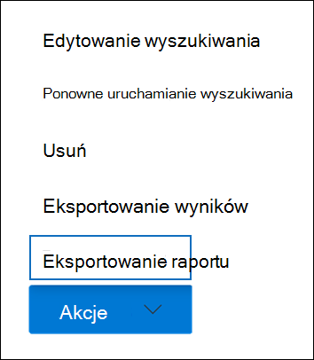

# Eksportowanie raportu przeszukiwania zawartości

Zamiast eksportować pełny zestaw wyników wyszukiwania z przeszukiwania zawartości w Centrum zgodności platformy Microsoft 365 (lub z wyszukiwania skojarzonego z podstawową sprawą zbierania elektronicznych materiałów dowodowych), możesz wyeksportować te same raporty, które są generowane podczas eksportowania rzeczywistych wyników wyszukiwania.
  
Podczas eksportowania raportu pliki raportu są pobierane do folderu na komputerze lokalnym, który ma taką samą nazwę jak wyszukiwanie zawartości, ale jest dołączany do *_ReportsOnly.* Jeśli na przykład wyszukiwanie zawartości nosi nazwę  *ContosoCase0815*, raport zostanie pobrany do folderu o *nazwie ContosoCase0815_ReportsOnly*. Aby uzyskać listę dokumentów, które są zawarte w raporcie, zobacz Co [zawiera raport](#whats-included-in-the-report).

## Przed wyeksportowaniem raportu wyszukiwania

- Aby wyeksportować raport wyszukiwania, musisz mieć przypisaną rolę zarządzania wyszukiwaniem zgodności w Centrum zgodności platformy Microsoft 365. Ta rola jest domyślnie przypisana do wbudowanych grup ról Menedżer zbierania elektronicznych materiałów dowodowych i Zarządzanie organizacją. Aby uzyskać więcej informacji, zobacz [Przypisywanie uprawnień zbierania elektronicznych materiałów dowodowych](assign-ediscovery-permissions.md).

- Podczas eksportowania raportu dane są tymczasowo przechowywane w lokalizacji usługi Azure Storage w chmurze firmy Microsoft, zanim zostaną pobrane na komputer lokalny. Upewnij się, że Twoja organizacja może połączyć się z punktem końcowym na platformie Azure, **\*** którym jest blob.core.windows.net (symbol wieloznaczny identyfikator unikatowy eksportu). Dwa tygodnie po utworzeniu dane wyników wyszukiwania zostaną usunięte z Storage Azure.

- Komputer, na który jest eksportowany raport wyszukiwania, musi spełniać następujące wymagania systemowe:
  
  - Najnowsza wersja Windows (32-bitowa lub 64-bitowa)
  
  - Microsoft .NET Framework 4.7 lub wyższa
  
- Aby uruchomić narzędzie eDiscovery Export Tool, musisz użyć narzędzia Microsoft Edge 1. Eksportowanie wyników wyszukiwania za pomocą programu Internet Explorer 11 nie jest już obsługiwane2.
  
  > [!NOTE]
  > 1 W wyniku niedawnych zmian wprowadzonych w Microsoft Edge obsługa ClickOnce jest już domyślnie włączona. Aby uzyskać instrukcje dotyczące ClickOnce technicznej w programie Edge, zobacz [Korzystanie z narzędzia eDiscovery Export Tool w programie Microsoft Edge](configure-edge-to-export-search-results.md). Ponadto firma Microsoft nie produkcji rozszerzeń ani dodatków innych producentów dla ClickOnce aplikacji. Eksportowanie wyników wyszukiwania przy użyciu nieobsługiwanej przeglądarki z rozszerzeniami lub dodatków innych firm nie jest obsługiwane.
  > 
  > 2 Począwszy od sierpnia 2021 r., aplikacje i usługi Microsoft 365 nie będą już obsługiwać programu Internet Explorer 11 (IE11) i użytkownicy mogą mieć środowisko o obniżonej wydajności lub nie mogą łączyć się z tymi aplikacjami i usługami. Te aplikacje i usługi wy wycofają się w ciągu najbliższych tygodni i miesięcy, aby zapewnić bezproblemowe zakończenie świadczenia pomocy technicznej. Poszczególne aplikacje i usługi są wyefane zgodnie z niezależnymi harmonogramami. Aby uzyskać więcej informacji, zobacz [ten wpis w blogu](https://techcommunity.microsoft.com/t5/microsoft-365-blog/microsoft-365-apps-say-farewell-to-internet-explorer-11-and/ba-p/1591666).

- Jeśli szacowany całkowity rozmiar wyników wyszukiwania przekracza 2 TB, eksportowanie raportów kończy się niepowodzeniem. Aby pomyślnie wyeksportować raporty, spróbuj zawęzić zakres i ponownie uruchomić wyszukiwanie, aby szacowany rozmiar wyników był mniejszy niż 2 TB.

- Jeśli wyniki wyszukiwania są starsze niż 7 dni i przesłasz zadanie raportu eksportu, zostanie wyświetlony komunikat o błędzie z monitem o ponowne uruchomić wyszukiwanie w celu zaktualizowania wyników wyszukiwania. W takim przypadku anuluj eksportowanie, uruchom ponownie wyszukiwanie, a następnie ponownie rozpocznij eksportowanie.

- Eksportowanie raportów wyszukiwania jest wliczane do maksymalnej liczby jednocześnie uruchomionych eksportów oraz maksymalnej liczby eksportów, które może uruchomić pojedynczy użytkownik. Aby uzyskać więcej informacji o limitach eksportu, zobacz [Eksportowanie wyników wyszukiwania zawartości](export-search-results.md#export-limits).
  
## Krok 1. Generowanie raportu do eksportu

Pierwszym krokiem jest przygotowanie raportu do pobrania na komputer i wyeksportowanie go. Podczas eksportowania raportu dokumenty raportu są przekazywane do obszaru usługi Azure Storage w chmurze firmy Microsoft.
  
1. W Centrum zgodności platformy Microsoft 365 wybierz pozycję Wyszukiwanie zawartości, z którego chcesz wyeksportować raport.
  
2. W menu **Akcje** u dołu strony wysuwanego wyszukiwania kliknij polecenie **Eksportuj raport**.

   

   Zostanie **wyświetlona strona wysuwana** Eksportuj raport. Opcje raportu eksportu dostępne w celu wyeksportowania informacji o wyszukiwaniu zależą od tego, czy wyniki wyszukiwania znajdują się w skrzynkach pocztowych, witrynach, czy w ich kombinacji.
  
3. W **obszarze Opcje danych** wyjściowych wybierz jedną z następujących opcji:
  
   

    - **Wszystkie elementy z wyjątkiem tych**, które mają nierozpoznany format, są szyfrowane lub nie zostały zindeksowane z innych powodów. Ta opcja powoduje wyeksportowanie tylko informacji o elementach indeksowanych.
  
    - **Wszystkie elementy, w tym te**, które mają nierozpoznany format, są szyfrowane lub nie zostały zindeksowane z innych powodów. Ta opcja powoduje wyeksportowanie informacji o elementach indeksowanych i nieindeksowanych.
  
    - **Tylko elementy, które mają nierozpoznany format, są szyfrowane lub nie zostały zindeksowane z innych powodów**. Ta opcja powoduje wyeksportowanie tylko informacji o elementach nieindeksowanych.

4. Skonfiguruj opcję **Włącz duplikowanie dla Exchange zawartości**.
  
   - Jeśli wybierzesz tę opcję, w raporcie podsumowania eksportu zostanie uwzględniona liczba zduplikowanych wiadomości (przed ich deplikacjami i po ich odduplikowaniu). Ponadto w pliku wiadomości zostanie uwzględniona tylko jedna manifest.xml wiadomości. Jednak raport wyników eksportu będzie zawierał wiersz dla każdej kopii zduplikowanej wiadomości, dzięki czemu będzie można zidentyfikować skrzynki pocztowe zawierające kopię zduplikowanej wiadomości. Aby uzyskać więcej informacji na temat eksportowanych raportów, zobacz Co [zawiera raport](#whats-included-in-the-report).

   - Jeśli nie zaznaczysz tej opcji, raporty eksportu będą zawierać informacje o wszystkich wiadomościach zwróconych przez wyszukiwanie, w tym duplikatach.

     Aby uzyskać więcej informacji na temat de duplikowania i sposobu identyfikowania zduplikowanych elementów, zobacz [Duplikowanie w wynikach wyszukiwania zbierania elektronicznych materiałów dowodowych](de-duplication-in-ediscovery-search-results.md).

5. Kliknij **pozycję Generuj raport**.

   Raporty wyszukiwania są przygotowane do pobrania, co oznacza, że dokumenty raportów są przekazywane do lokalizacji usługi Azure Storage w chmurze firmy Microsoft. Może to potrwać kilka minut.

Instrukcje pobierania wyeksportowanych raportów wyszukiwania można znaleźć w następnej sekcji.
  
## Krok 2. Pobieranie raportu

Następnym krokiem jest pobranie raportu z usługi Azure Storage na komputer lokalny.

> [!NOTE]
> Wyeksportowany raport wyszukiwania należy pobrać w ciągu 14 dni od wygenerowania raportu w kroku 1.

1. Na **stronie Przeszukiwanie zawartości** w Centrum zgodności platformy Microsoft 365 wybierz **kartę Eksporty**
  
   Może być konieczne kliknięcie **przycisku Odśwież** w celu zaktualizowania listy zadań eksportu tak, aby wyświetlała utworzone zadanie eksportu. Zadania raportu eksportu mają taką samą nazwę jak odpowiadające im wyszukiwanie **z _ReportsOnly** dołączona do nazwy wyszukiwania.
  
2. Wybierz zadanie eksportu utworzone w kroku 1.

3. Na stronie **wysuwanego raportu** Eksportuj w obszarze **Klucz eksportu** kliknij pozycję **Kopiuj do schowka**. Użyj tego klucza w kroku 6, aby pobrać wyniki wyszukiwania.
  
   > [!IMPORTANT]
   > Ponieważ każdy może zainstalować i uruchomić narzędzie eDiscovery Export Tool, a następnie użyć tego klucza do pobrania raportu wyszukiwania, pamiętaj o podjęciu środków ostrożności w celu ochrony tego klucza tak samo, jak w przypadku haseł i innych informacji związanych z zabezpieczeniami.

4. U góry wysuwana strona kliknij pozycję **Pobierz wyniki**.

5. Jeśli zostanie wyświetlony monit o zainstalowanie narzędzia **eDiscovery Export Tool**, kliknij pozycję **Zainstaluj**.

6. W **narzędziu eDiscovery Export Tool** wykonaj następujące czynności:

   

   1. Wklej klucz eksportu skopiowany w kroku 3 w odpowiednim polu.
  
   2. Kliknij **przycisk** Przeglądaj, aby określić lokalizację, do której chcesz pobrać pliki raportów wyszukiwania.

7. Kliknij **przycisk Start** , aby pobrać wyniki wyszukiwania na komputer.
  
    Narzędzie **eDiscovery Export Tool** wyświetla informacje o stanie procesu eksportowania, łącznie z szacowaną liczbą (i rozmiarem) pozostałych elementów do pobrania. Po zakończeniu procesu eksportowania możesz uzyskać dostęp do plików w lokalizacji, w której zostały pobrane.
  
## Co zawiera raport

W przypadku wygenerowania i wyeksportowania raportu o wynikach wyszukiwania zawartości pobierane są następujące dokumenty:
  
- **Podsumowanie eksportu:** Dokument Excel zawierający podsumowanie eksportu. Obejmują one informacje, takie jak liczba przeszukanych źródeł zawartości, liczba wyników wyszukiwania z poszczególnych lokalizacji zawartości, szacowana liczba elementów, rzeczywista liczba elementów do wyeksportowania oraz szacowany i rzeczywisty rozmiar eksportowanych elementów.

   Jeśli podczas eksportowania raportu dołączysz elementy nieindeksowane, liczba elementów nieindeksowanych zostanie uwzględniona w łącznej liczbie szacowanych wyników wyszukiwania oraz łącznej liczbie pobranych wyników wyszukiwania (w przypadku eksportowania wyników wyszukiwania) uwzględnionych w raporcie podsumowania eksportu. Innymi słowy całkowita liczba elementów, które zostaną pobrane, jest równa całkowitej liczbie szacowanych wyników i całkowitej liczbie elementów nieindeksowanych.
  
- **Manifest:** Plik manifestu (w formacie XML), który zawiera informacje o każdym z elementów uwzględnionych w wynikach wyszukiwania. Jeśli włączono opcję de duplikowania, w pliku manifestu nie są uwzględniane zduplikowane wiadomości.

- **Wyniki:** Dokument Excel zawierający wiersz z informacjami o każdym indeksowanych elementach, który zostałby wyeksportowany z wynikami wyszukiwania. W przypadku wiadomości e-mail dziennik wyników zawiera informacje o każdej wiadomości, w tym: 

  - Lokalizacja wiadomości w źródłowej skrzynce pocztowej (w tym to, czy wiadomość znajduje się w podstawowej, czy archiwaowej skrzynce pocztowej).

  - Data wysłania lub odebrania wiadomości.

  - Wiersz Temat wiadomości.

  - Nadawca i adresaci wiadomości.

  W przypadku dokumentów SharePoint i OneDrive dla Firm wyniki zawierają informacje o każdym dokumencie, takie jak:

  - Adres URL dokumentu.

  - Adres URL zbioru witryn, w którym znajduje się dokument.

  - Data ostatniej modyfikacji dokumentu.

  - Nazwa dokumentu (która znajduje się w kolumnie Temat w dzienniku wyników).

  > [!NOTE]
  > Liczba wierszy w raporcie Wyniki  powinna być równa całkowitej liczbie wyników wyszukiwania minus łączna liczba elementów wymienionych w raporcie Elementy **nieindeksowane**.
  
- **Trace.log:** Dziennik śledzenia zawierający szczegółowe informacje dotyczące procesu eksportowania i ułatwiający wykrywanie problemów podczas eksportowania. Jeśli otworzysz bilet pomocy technicznej firmy Microsoft związany z problemem związanym z eksportowaniem raportów wyszukiwania, może pojawić się monit o podanie tego dziennika śledzenia.

- **Elementy nieindeksowane:** Dokument Excel zawierający informacje o wszystkich nieindeksowanych elementach uwzględnionych w wynikach wyszukiwania. Jeśli nie uwzględnisz elementów nieindeksowanych podczas generowania raportu wyników wyszukiwania, ten raport nadal zostanie pobrany, ale będzie pusty.
