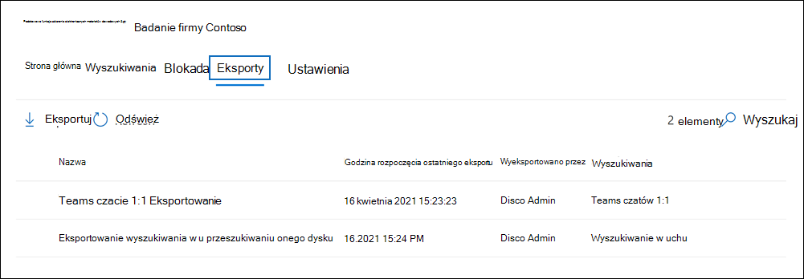

# Eksportowanie zawartości ze sprawy zbierania elektronicznych materiałów dowodowych (standardowa)

Po pomyślnym uruchomieniu wyszukiwania skojarzonego z przypadkiem zbierania elektronicznych materiałów dowodowych (Standard) usługi Microsoft Purview można wyeksportować wyniki wyszukiwania. Podczas eksportowania wyników wyszukiwania elementy skrzynki pocztowej są pobierane w plikach PST lub jako pojedyncze wiadomości. Podczas eksportowania zawartości z witryn SharePoint i OneDrive dla Firm eksportowane są kopie natywnych dokumentów Office i innych dokumentów. Eksportowany jest również plik Results.csv zawierający informacje o każdym wyeksportowanym elemencie oraz plik manifestu (w formacie XML), który zawiera informacje o każdym wyniku wyszukiwania.
  
## Eksportuj wyniki wyszukiwania

1. Przejdź do <a href="https://go.microsoft.com/fwlink/p/?linkid=2077149" target="_blank">portalu zgodności usługi Microsoft Purview</a> i zaloguj się przy użyciu poświadczeń konta użytkownika, do których przypisano odpowiednie uprawnienia zbierania elektronicznych materiałów dowodowych.

2. W okienku nawigacji po lewej stronie portalu zgodności wybierz pozycję **Pokaż wszystko**, a następnie wybierz pozycję **eDiscoveryCore** > .

3. Na stronie **eDiscovery (Standard)** kliknij nazwę przypadku, w ramach którego chcesz utworzyć blokadę.

4. Na stronie **głównej** sprawy kliknij kartę **Wyszukiwania** .

5. W menu **Akcje** w dolnej części strony wysuwanej kliknij pozycję **Eksportuj wyniki**.

   

   Przepływ pracy umożliwiający wyeksportowanie wyników wyszukiwania skojarzonego ze sprawą zbierania elektronicznych materiałów dowodowych (Standardowa) jest taki sam jak eksportowanie wyników wyszukiwania do wyszukiwania na stronie **wyszukiwania zawartości** . Aby uzyskać instrukcje krok po kroku, zobacz [Eksportowanie wyników wyszukiwania zawartości](export-search-results.md).

   > [!NOTE]
   > Podczas eksportowania wyników wyszukiwania można włączyć funkcję de-duplikowania, aby wyeksportować tylko jedną kopię wiadomości e-mail, mimo że w przeszukanych skrzynkach pocztowych mogło zostać znalezionych wiele wystąpień tej samej wiadomości. Aby uzyskać więcej informacji na temat de-duplikowania i sposobu identyfikowania zduplikowanych elementów, zobacz [De-duplication in eDiscovery search results (De-duplikowanie w wynikach wyszukiwania zbierania elektronicznych materiałów dowodowych](de-duplication-in-ediscovery-search-results.md)).

   Po rozpoczęciu eksportowania wyniki wyszukiwania są przygotowywane do pobrania, co oznacza, że są przenoszone do lokalizacji Storage platformy Azure udostępnionej przez firmę Microsoft w chmurze firmy Microsoft.
  
6. Kliknij kartę **Eksporty** w przypadku, aby wyświetlić listę zadań eksportu.
  
   

   Może być konieczne **kliknięcie** przycisku Odśwież, aby zaktualizować listę zadań eksportu, aby wyświetlić utworzone zadanie eksportu. Zadania eksportu mają taką samą nazwę jak odpowiednie wyszukiwanie z **_Export** dołączone do nazwy wyszukiwania.

7. Kliknij utworzone zadanie eksportu, aby wyświetlić informacje o stanie na stronie wysuwanej. Te informacje obejmują procent elementów, które zostały przeniesione do lokalizacji Storage platformy Azure.

8. Po przeniesieniu wszystkich elementów kliknij pozycję **Pobierz wyniki** , aby pobrać wyniki wyszukiwania na komputer lokalny. Aby uzyskać więcej informacji na temat pobierania wyników wyszukiwania, zobacz Krok 2 w [temacie Eksportowanie wyników wyszukiwania zawartości](export-search-results.md#step-2-download-the-search-results)

> [!NOTE]
> Wyeksportowane wyniki wyszukiwania muszą zostać pobrane w ciągu 14 dni od utworzenia zadania eksportu.

### Więcej informacji na temat eksportowania wyszukiwań ze sprawy

- Aby uzyskać więcej informacji na temat plików eksportu dołączonych podczas eksportowania wyników wyszukiwania, zobacz [Eksportowanie raportu wyszukiwania zawartości](export-a-content-search-report.md#whats-included-in-the-report).

- W przypadku ponownego uruchomienia eksportu żadne zmiany w zapytaniach wyszukiwań, które składają się na zadanie eksportu, nie będą miały wpływu na pobrane wyniki wyszukiwania. Po ponownym uruchomieniu eksportu to samo połączone zadanie zapytania wyszukiwania, które zostało uruchomione podczas tworzenia zadania eksportu, zostanie uruchomione ponownie.

- Ponadto po ponownym uruchomieniu eksportu wyniki wyszukiwania skopiowane do lokalizacji Storage platformy Azure zastępują poprzednie wyniki. Poprzednie skopiowane wyniki nie będą dostępne do pobrania.
