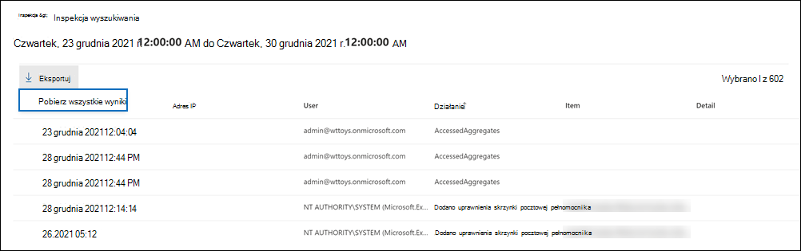

# <a name="export-configure-and-view-audit-log-records"></a>Eksportuj, konfiguruj i wyświetlaj rekordy dziennika inspekcji

[!include[Purview banner](../includes/purview-rebrand-banner.md)]

Po przeszukaniu dziennika inspekcji i pobraniu wyników wyszukiwania do pliku CSV plik zawiera kolumnę o nazwie **AuditData**, która zawiera dodatkowe informacje o każdym zdarzeniu. Dane w tej kolumnie są sformatowane jako obiekt JSON, który zawiera wiele właściwości skonfigurowanych jako pary *property:value* rozdzielone przecinkami. Funkcja przekształcania JSON w Edytor Power Query w Excel umożliwia podzielenie każdej właściwości w obiekcie JSON w kolumnie **AuditData** na wiele kolumn, dzięki czemu każda właściwość ma własną kolumnę. Dzięki temu można sortować i filtrować co najmniej jedną z tych właściwości, co może pomóc w szybkim zlokalizowaniu konkretnych danych inspekcji, których szukasz.

## <a name="step-1-export-audit-log-search-results"></a>Krok 1. Eksportowanie wyników wyszukiwania dziennika inspekcji

Pierwszym krokiem jest przeszukanie dziennika inspekcji, a następnie wyeksportowanie wyników w pliku wartości rozdzielanej przecinkami (CSV) na komputer lokalny.
  
1. Uruchom [wyszukiwanie dziennika inspekcji](search-the-audit-log-in-security-and-compliance.md#search-the-audit-log) i w razie potrzeby popraw kryteria wyszukiwania, dopóki nie otrzymasz odpowiednich wyników.

2. Na stronie wyników wyszukiwania kliknij pozycję **EksportujPobierz** >  **wszystkie wyniki**.

   

   Ta opcja eksportuje wszystkie rekordy inspekcji z przeszukiwania dziennika inspekcji uruchomionego w kroku 1 i dodaje nieprzetworzone dane z dziennika inspekcji do pliku CSV. Przygotowanie pliku pobierania do dużego wyszukiwania zajmuje trochę czasu. Duże pliki zostaną wyświetlone podczas wyszukiwania wszystkich działań lub używania szerokiego zakresu dat.

3. Po zakończeniu procesu eksportowania w górnej części okna zostanie wyświetlony komunikat z monitem o otwarcie pliku CSV i zapisanie go na komputerze lokalnym. Możesz również uzyskać dostęp do pliku CSV w folderze Pliki do pobrania.

   > [!NOTE]
   > Możesz pobrać maksymalnie 50 000 wpisów do pliku CSV z pojedynczego przeszukiwania dziennika inspekcji. Jeśli do pliku CSV zostanie pobranych 50 000 wpisów, można założyć, że istnieje ponad 50 000 zdarzeń spełniających kryteria wyszukiwania. Aby wyeksportować więcej niż ten limit, spróbuj użyć węższego zakresu dat, aby zmniejszyć liczbę rekordów dziennika inspekcji. Może być konieczne uruchomienie wielu wyszukiwań z mniejszymi zakresami dat, aby wyeksportować ponad 50 000 wpisów.

## <a name="step-2-format-the-exported-audit-log-using-the-power-query-editor"></a>Krok 2. Formatowanie wyeksportowanego dziennika inspekcji przy użyciu Edytor Power Query

Następnym krokiem jest użycie funkcji przekształcania JSON w Edytor Power Query w Excel, aby podzielić każdą właściwość w obiekcie JSON w kolumnie **AuditData** na własną kolumnę. Następnie filtrujesz kolumny, aby wyświetlać rekordy na podstawie wartości określonych właściwości. Może to pomóc w szybkim zlokalizowaniu konkretnych danych inspekcji, których szukasz.

1. Otwórz pusty skoroszyt w Excel dla Office 365, Excel 2019 lub Excel 2016.

2. Na karcie **Dane** w grupie wstążki **Pobierz & Przekształcanie danych** kliknij pozycję **Z tekstu/CSV**.

    

3. Otwórz plik CSV pobrany w kroku 1.

4. W wyświetlonym oknie kliknij pozycję **Przekształć dane**.

   

   Plik CSV jest otwierany w **Edytor Power Query**. Istnieją cztery kolumny: **CreationDate**, **UserIds**, **Operations** i **AuditData**. **Kolumna AuditData** jest obiektem JSON zawierającym wiele właściwości. Następnym krokiem jest utworzenie kolumny dla każdej właściwości w obiekcie JSON.

5. Kliknij prawym przyciskiem myszy tytuł w kolumnie **AuditData** , kliknij pozycję **Przekształć**, a następnie kliknij pozycję **JSON**. 

   

6. W prawym górnym rogu kolumny **AuditData** kliknij ikonę rozwijania.

   

   Zostanie wyświetlona częściowa lista właściwości obiektów JSON w kolumnie **AuditData** .

7. Kliknij **pozycję Załaduj więcej** , aby wyświetlić wszystkie właściwości obiektów JSON w kolumnie **AuditData** .

   

   Możesz usunąć zaznaczenie pola wyboru obok dowolnej właściwości, która nie ma być uwzględniana. Wyeliminowanie kolumn, które nie są przydatne w badaniu, jest dobrym sposobem zmniejszenia ilości danych wyświetlanych w dzienniku inspekcji. 

   > [!NOTE]
   > Właściwości JSON wyświetlane na poprzednim zrzucie ekranu (po kliknięciu przycisku **Załaduj więcej**) są oparte na właściwościach znalezionych w kolumnie **AuditData** z pierwszych 1000 wierszy w pliku CSV. Jeśli istnieją różne właściwości JSON w rekordach po pierwszych 1000 wierszach, te właściwości (i odpowiednia kolumna) nie zostaną uwzględnione, gdy **kolumna AuditData zostanie podzielona** na wiele kolumn. Aby temu zapobiec, rozważ ponowne uruchomienie wyszukiwania w dzienniku inspekcji i zawężenie kryteriów wyszukiwania w celu zwrócenia mniejszej liczby rekordów. Innym obejściem jest filtrowanie elementów w kolumnie **Operacje** w celu zmniejszenia liczby wierszy (przed wykonaniem kroku 5 powyżej) przed przekształceniem obiektu JSON w kolumnie **AuditData** .

   > [!TIP]
   > Aby wyświetlić atrybut na liście, takiej jak AuditData.AffectedItems, kliknij ikonę **Rozwiń** w prawym górnym rogu kolumny, z którego chcesz ściągnąć atrybut, a następnie wybierz pozycję **Rozwiń do nowego wiersza**.  W tym miejscu będzie to rekord i możesz kliknąć ikonę **Rozwiń** w prawym górnym rogu kolumny, wyświetlić atrybuty i wybrać tę, którą chcesz wyświetlić lub wyodrębnić.

8. Wykonaj jedną z następujących czynności, aby sformatować tytuł kolumn dodanych dla każdej wybranej właściwości JSON.

    - Usuń zaznaczenie pola wyboru **Użyj oryginalnej nazwy kolumny jako prefiksu** , aby użyć nazwy właściwości JSON jako nazw kolumn; na przykład **RecordType** lub **SourceFileName**.

    - Pozostaw pole wyboru **Użyj oryginalnej nazwy kolumny jako prefiksu** , aby dodać prefiks AuditData do nazw kolumn; Na przykład **AuditData.RecordType** lub **AuditData.SourceFileName**.

9. Kliknij przycisk **OK**.

    **Kolumna AuditData jest podzielona** na wiele kolumn. Każda nowa kolumna odpowiada właściwości w obiekcie AuditData JSON. Każdy wiersz w kolumnie zawiera wartość właściwości. Jeśli właściwość nie zawiera wartości, zostanie wyświetlona wartość *null* . W Excel komórki z wartościami null są puste.
  
10. Na karcie **Narzędzia** główne kliknij pozycję **Zamknij & Załaduj**, aby zamknąć Edytor Power Query i otworzyć przekształcony plik CSV w skoroszycie Excel.

## <a name="use-powershell-to-search-and-export-audit-log-records"></a>Wyszukiwanie i eksportowanie rekordów dziennika inspekcji przy użyciu programu PowerShell

Zamiast używać narzędzia do wyszukiwania dzienników inspekcji w portalu zgodności usługi Microsoft Purview, możesz użyć polecenia cmdlet [Search-UnifiedAuditLog](/powershell/module/exchange/search-unifiedauditlog) w programie Exchange Online programu PowerShell, aby wyeksportować wyniki wyszukiwania dziennika inspekcji do pliku CSV. Następnie możesz wykonać tę samą procedurę opisaną w kroku 2, aby sformatować dziennik inspekcji przy użyciu edytora Power Query. Jedną z zalet korzystania z polecenia cmdlet programu PowerShell jest to, że można wyszukiwać zdarzenia z określonej usługi przy użyciu parametru *RecordType* . Poniżej przedstawiono kilka przykładów użycia programu PowerShell do eksportowania rekordów inspekcji do pliku CSV, dzięki czemu można użyć edytora Power Query do przekształcenia obiektu JSON w kolumnie **AuditData** zgodnie z opisem w kroku 2.

W tym przykładzie uruchom następujące polecenia, aby zwrócić wszystkie rekordy związane z operacjami udostępniania SharePoint.

```powershell
$auditlog = Search-UnifiedAuditLog -StartDate 06/01/2019 -EndDate 06/30/2019 -RecordType SharePointSharingOperation
```

```powershell
$auditlog | Select-Object -Property CreationDate,UserIds,RecordType,AuditData | Export-Csv -Path c:\AuditLogs\PowerShellAuditlog.csv -NoTypeInformation
```

Wyniki wyszukiwania są eksportowane do pliku CSV o nazwie *PowerShellAuditlog* zawierającego cztery kolumny: CreationDate, UserIds, RecordType, AuditData).

Możesz również użyć nazwy lub wartości wyliczenia dla typu rekordu jako wartości parametru *RecordType* . Aby uzyskać listę nazw typów rekordów i odpowiadających im wartości wyliczenia, zobacz tabelę *AuditLogRecordType* w [schemacie interfejsu API działania zarządzania Office 365](/office/office-365-management-api/office-365-management-activity-api-schema#enum-auditlogrecordtype---type-edmint32).

Parametr *RecordType* może zawierać tylko jedną wartość. Aby wyszukać rekordy inspekcji dla innych typów rekordów, należy ponownie uruchomić dwa poprzednie polecenia, aby określić inny typ rekordu i dołączyć te wyniki do oryginalnego pliku CSV. Na przykład należy uruchomić następujące dwa polecenia, aby dodać działania SharePoint plików z tego samego zakresu dat do pliku PowerShellAuditlog.csv.

```powershell
$auditlog = Search-UnifiedAuditLog -StartDate 06/01/2019 -EndDate 06/30/2019 -RecordType SharePointFileOperation
```

```powershell
$auditlog | Select-Object -Property CreationDate,UserIds,RecordType,AuditData | Export-Csv -Append -Path c:\AuditLogs\PowerShellAuditlog.csv -NoTypeInformation
```

## <a name="tips-for-exporting-and-viewing-the-audit-log"></a>Wskazówki do eksportowania i wyświetlania dziennika inspekcji

Poniżej przedstawiono kilka wskazówek i przykładów eksportowania i wyświetlania dziennika inspekcji przed użyciem funkcji przekształcania JSON w celu **podzielenia kolumny AuditData** na wiele kolumn.

- Przefiltruj kolumnę **RecordType** , aby wyświetlić tylko rekordy z określonej usługi lub obszaru funkcjonalnego. Aby na przykład wyświetlić zdarzenia związane z udostępnianiem SharePoint, należy wybrać **wartość 14** (wartość wyliczenia dla rekordów wyzwalanych przez działania udostępniania SharePoint). Aby uzyskać listę usług odpowiadających wartościom wyliczenia wyświetlanym w kolumnie **RecordType** , zobacz [Szczegółowe właściwości w dzienniku inspekcji](detailed-properties-in-the-office-365-audit-log.md).

- Przefiltruj kolumnę **Operacje** , aby wyświetlić rekordy dla określonych działań. Aby uzyskać listę większości operacji, które odpowiadają działaniu z możliwością wyszukiwania w narzędziu do wyszukiwania dzienników inspekcji w portalu zgodności, zobacz sekcję "Działania inspekcji" w temacie [Wyszukaj dziennik inspekcji](search-the-audit-log-in-security-and-compliance.md#audited-activities).
