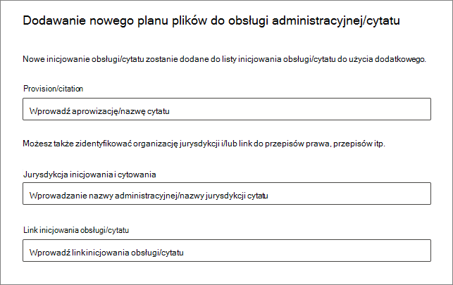
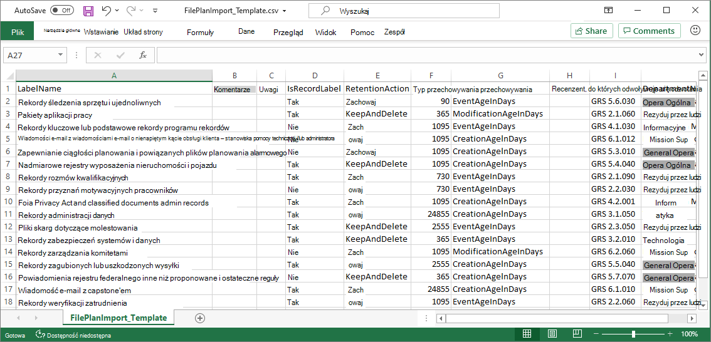

# Tworzenie etykiet przechowywania i zarządzanie nimi przy użyciu planu plików

>*[Wskazówki dotyczące licencjonowania platformy Microsoft 365 dotyczące zgodności & zabezpieczeń](/office365/servicedescriptions/microsoft-365-service-descriptions/microsoft-365-tenantlevel-services-licensing-guidance/microsoft-365-security-compliance-licensing-guidance).*

[!include[Purview banner](../includes/purview-rebrand-banner.md)]

Mimo że można tworzyć etykiety przechowywania i zarządzać nimi z **poziomu zarządzania cyklem życia danych** w portalu zgodności usługi Microsoft Purview, plan plików z **zarządzania rekordami** ma dodatkowe możliwości zarządzania:

- Etykiety przechowywania można tworzyć zbiorczo, importując odpowiednie informacje z arkusza kalkulacyjnego.

- Możesz wyeksportować informacje z istniejących etykiet przechowywania na potrzeby analizy i współpracy w trybie offline.

- Zostanie wyświetlonych więcej informacji o etykietach przechowywania, aby ułatwić wyświetlanie ustawień wszystkich etykiet przechowywania z jednego widoku i między nimi.

- Deskryptory planu plików obsługują dodatkowe i opcjonalne informacje dla każdej etykiety.

Plan plików może być używany dla wszystkich etykiet przechowywania, nawet jeśli nie oznaczają zawartości jako rekordu.

Aby uzyskać informacje o tym, czym są etykiety przechowywania i jak ich używać, zobacz [Informacje o zasadach przechowywania i etykietach przechowywania](retention.md).

## Uzyskiwanie dostępu do planu plików

Aby uzyskać dostęp do planu plików, musisz mieć jedną z następujących ról administratora:
    
- Menedżer przechowywania
- Menedżer przechowywania tylko do wyświetlania

W [portalu zgodności usługi Microsoft Purview](https://compliance.microsoft.com/) przejdź do **obszaru Plan plików** **zarządzania rekordami** >  **rozwiązań** > :

. 

Jeśli **zarządzanie rekordami** nie jest wyświetlane w okienku nawigacji, najpierw przewiń w dół i wybierz pozycję **Pokaż wszystko**.

## Nawigowanie po planie plików

Jeśli etykiety przechowywania zostały już utworzone w ramach **zarządzania cyklem życia danych** w portalu zgodności usługi Microsoft Purview, etykiety te są automatycznie wyświetlane w planie plików. 

Podobnie jeśli teraz utworzysz etykiety przechowywania w planie plików, będą one również dostępne w **ramach zarządzania cyklem życia danych** , jeśli etykiety nie są skonfigurowane do oznaczania zawartości jako rekordu.

Na stronie **Plan pliku** widoczne są wszystkie etykiety ze stanem i ustawieniami, opcjonalne deskryptory planu plików, opcja eksportu umożliwiająca analizowanie lub włączanie przeglądów etykiet w trybie offline oraz opcja importowania umożliwiająca tworzenie etykiet przechowywania. 

### Kolumny ustawień etykiet

Wszystkie kolumny z wyjątkiem **etykiety Nazwa** mogą być wyświetlane lub ukryte, wybierając opcję **Dostosuj kolumny** . Jednak domyślnie kilka pierwszych kolumn wyświetla informacje o stanie etykiety i jej ustawieniach: 

- **Stan** określa, czy etykieta jest uwzględniona w zasadach etykiet lub zasadach automatycznego stosowania (**Aktywne**), czy nie (**nieaktywne**).

- **Na podstawie** określa, jak i kiedy rozpoczyna się okres przechowywania. Prawidłowe wartości:
    - Zdarzenie
    - Po utworzeniu
    - Ostatnia modyfikacja
    - Po oznaczeniu etykietą

- **Czy rekord** określa, czy element jest oznaczony jako rekord po zastosowaniu etykiety. Prawidłowe wartości:
    - Nie
    - Tak
    - Tak (regulacyjne)

- **Jest domyślnie odblokowany** — obecnie wdrażany — określa, czy element oznaczony jako rekord jest odblokowany po zastosowaniu etykiety. Prawidłowe wartości:
    - Nie
    - Tak

- **Ponowne etykietowanie do** — obecnie wdrażane — określa, czy etykieta jest skonfigurowana do stosowania innej etykiety na końcu okresu przechowywania. Prawidłowe wartości:
    - Pusta lub wybrana nazwa etykiety

- **Czas trwania przechowywania** określa okres przechowywania. Prawidłowe wartości:
    - Dni
    - Miesięcy
    - Lat
    - Zawsze
    - Brak

- **Typ dyspozycji** określa, co dzieje się z zawartością na końcu okresu przechowywania. Prawidłowe wartości:
    - Brak akcji
    - Automatyczne usuwanie
    - Wymagany przegląd

### Kolumny deskryptorów planu plików

Plan plików umożliwia uwzględnienie większej ilości informacji w ramach etykiet przechowywania. Te deskryptory planu plików zapewniają więcej opcji w celu zwiększenia możliwości zarządzania i organizacji zawartości, którą należy oznaczyć etykietą.

Domyślnie, począwszy od **identyfikatora odwołania**, kilka następnych kolumn wyświetla te opcjonalne deskryptory planu plików, które można określić podczas tworzenia etykiety przechowywania lub edytowania istniejącej etykiety. 

Aby rozpocząć pracę, istnieją pewne wartości out-of-box dla następujących deskryptorów planu plików: 
- Funkcja/dział biznesowy
- Kategoria
- Typ urzędu
- Aprowizowanie/cytowania 

Przykład deskryptorów planu plików podczas tworzenia lub edytowania etykiety przechowywania:

Po wybraniu opcji **Wybierz** dla każdego z tych opcjonalnych deskryptorów możesz wybrać jedną z wartości w polu lub utworzyć własne, a następnie wybrać je. Przykład: 

## Tworzenie etykiet przechowywania

1. Na stronie **Plan pliku** wybierz pozycję **+ Utwórz etykietę przechowywania etykiety** > 

2. Postępuj zgodnie z monitami dotyczącymi procesu konfiguracji. Zachowaj ostrożność, jaką nazwę wybierzesz, ponieważ nie można jej zmienić po zapisaniu etykiety.
    
    Aby uzyskać więcej informacji na temat ustawień przechowywania, zobacz [Ustawienia przechowywania i usuwania zawartości](retention-settings.md#settings-for-retaining-and-deleting-content).
    
    Aby użyć etykiety przechowywania do deklarowania rekordów, wybierz pozycję **Oznacz elementy jako rekordy** lub **Oznacz elementy jako rekordy regulacyjne**. Aby uzyskać więcej informacji, zobacz [Konfigurowanie etykiet przechowywania do deklarowania rekordów](declare-records.md#configuring-retention-labels-to-declare-records).

3. Po utworzeniu etykiety i wyświetleniu opcji publikowania etykiety zastosuj ją automatycznie lub po prostu zapisz etykietę: wybierz pozycję **Po prostu zapisz etykietę na razie**, a następnie wybierz pozycję **Gotowe**.

4. Powtórz te kroki, aby utworzyć więcej etykiet.

## Edytowanie etykiet przechowywania

Aby edytować istniejącą etykietę przechowywania, wybierz ją na stronie **Plan pliku** , a następnie wybierz opcję **Edytuj etykietę** , aby rozpocząć proces przechowywania edycji, który umożliwia zmianę opisu etykiety i wszystkich kwalifikujących się ustawień.

Niektórych ustawień nie można zmienić po utworzeniu i zapisaniu etykiety, które obejmują:
- Nazwa etykiety przechowywania i ustawienia przechowywania z wyjątkiem okresu przechowywania. Nie można jednak zmienić okresu przechowywania, gdy okres przechowywania zależy od tego, kiedy elementy zostały oznaczone etykietą.
- Opcja oznaczania elementów jako rekordu.

## Usuwanie etykiet przechowywania

Możesz usunąć etykiety przechowywania, które nie są obecnie uwzględnione w żadnych [opublikowanych](create-apply-retention-labels.md) lub [automatycznie stosowanych](apply-retention-labels-automatically.md) zasadach etykiet przechowywania, które nie są skonfigurowane do przechowywania na podstawie zdarzeń lub które oznaczają elementy jako rekordy regulacyjne.

W przypadku etykiet przechowywania, które można usunąć, jeśli zostały one zastosowane do elementów, usunięcie zakończy się niepowodzeniem i zostanie wyświetlony link do Eksploratora zawartości w celu zidentyfikowania elementów oznaczonych etykietą.

Jednak wyświetlenie elementów oznaczonych etykietą Eksploratora zawartości może potrwać do dwóch dni. W tym scenariuszu etykieta przechowywania może zostać usunięta bez wyświetlania linku do Eksploratora zawartości.

## Eksportowanie wszystkich etykiet przechowywania w celu analizowania lub włączania przeglądów w trybie offline

Z planu plików możesz wyeksportować szczegóły wszystkich etykiet przechowywania do pliku .csv, aby ułatwić okresowe przeglądy zgodności z osobami biorącymi udział w zarządzaniu danymi w organizacji.

Aby wyeksportować wszystkie etykiety przechowywania: na stronie **Plan pliku** wybierz pozycję **Eksportuj**:

Zostanie otwarty plik *.csv zawierający wszystkie istniejące etykiety przechowywania. Przykład:

## Importowanie etykiet przechowywania do planu plików

W planie plików można zbiorczo importować nowe etykiety przechowywania przy użyciu pliku .csv o określonym formacie: 

1. Na stronie **Plan pliku** wybierz pozycję **Importuj**: 

2. W okienku **Wypełnij i zaimportuj plan pliku** wybierz pozycję **Pobierz pusty szablon**:

   

3. Po pobraniu szablonu dodaj jeden wiersz dla każdej etykiety i zapisz plik. Zobacz [następną sekcję](#information-about-the-label-properties-for-import) , aby uzyskać informacje opisujące właściwości i prawidłowe wartości dla każdej właściwości.
    
    Przykład wypełnionego szablonu:
    
    

4. Wybierz **pozycję Przekaż plik,** aby przekazać wypełniony szablon.
    
   Plan plików przekazuje plik i weryfikuje wpisy.

5. W zależności od wyników weryfikacji:
    
    - Jeśli weryfikacja nie powiedzie się: zanotuj numer wiersza i nazwę kolumny, aby poprawić w pliku importu. Popraw błędy w pliku i zapisz go, a następnie powtórz krok 4.
    
    - Jeśli weryfikacja zakończy się pomyślnie: **zobaczysz, że pomyślnie zaimportowano plan pliku** , a wpisy zostały pomyślnie przekonwertowane na etykiety przechowywania. Wybierz pozycję **Gotowe** , aby zamknąć okienko i automatycznie odśwież stronę **Plan pliku** , aby wyświetlić nowe etykiety.

Teraz możesz opublikować nowe etykiety przechowywania lub zastosować je automatycznie. Obie te czynności można wykonać na karcie **Zasady etykiet** , wybierając pozycję **Publikuj etykiety** lub **automatycznie zastosuj etykietę**.

### Informacje o właściwościach etykiety do importowania

Poniższe informacje ułatwiają wypełnienie pobranego szablonu w celu zaimportowania nowych etykiet przechowywania. Niektóre wartości mają maksymalną długość importu:

- **LabelName**: maksymalna długość 64 znaków
- **Komentarz** i **uwagi**: maksymalna długość 1024 znaków
- Wszystkie inne wartości: nieograniczona długość
 

|Właściwość|Wpisać|Wymagany|Prawidłowe wartości|
|:-----|:-----|:-----|:-----|
|LabelName|Ciąg|Tak|Ta właściwość określa nazwę etykiety przechowywania i musi być unikatowa w dzierżawie. Obsługiwane znaki do importowania: a-z, A-Z, 0-9, łącznik (-) i znak spacji.|
|Komentowanie|Ciąg|Nie|Ta właściwość służy do dodawania opisu etykiety przechowywania dla administratorów. Ten opis jest wyświetlany tylko administratorom, którzy zarządzają etykietą przechowywania w portalu zgodności usługi Microsoft Purview.|
|Uwagi|Ciąg|Nie|Ta właściwość służy do dodawania opisu etykiety przechowywania dla użytkowników. Ten opis jest wyświetlany, gdy użytkownicy najeżdżą kursorem na etykietę w aplikacjach takich jak Outlook, SharePoint i OneDrive. Jeśli pozostawisz tę właściwość pustą, zostanie wyświetlony domyślny opis, który objaśnia ustawienia przechowywania etykiety. |
|IsRecordLabel|Ciąg|Nie, chyba że **przepis** ma **wartość TRUE**|Ta właściwość określa, czy etykieta oznacza zawartość jako rekord. Prawidłowe wartości to:  **PRAWDA**: Etykieta oznacza element jako rekord i w rezultacie nie można usunąć elementu.  **FALSE**: Etykieta nie oznacza zawartości jako rekordu. Jest to wartość domyślna.     Zależności grupy: Po określeniu tej właściwości należy również określić właściwości RetentionAction, RetentionDuration i RetentionType.|
|RetentionAction|Ciąg|Nie, o ile nie określono **wartości RetentionDuration**, **RetentionType** lub **ReviewerEmail**|Ta właściwość określa akcję, jaką należy wykonać po wygaśnięciu wartości określonej przez właściwość RetentionDuration (jeśli określono). Prawidłowe wartości to:  **Usuń**: Elementy starsze niż wartość określona przez właściwość RetentionDuration są usuwane. **Zachowaj: Zachowaj** elementy przez czas określony przez właściwość RetentionDuration, a następnie nie rób nic po upływie okresu trwania.  **KeepAndDelete**: Zachowaj elementy przez czas określony przez właściwość RetentionDuration, a następnie usuń je po upływie okresu trwania.     Zależności grupy: po określeniu tej właściwości należy również określić właściwości RetentionDuration i RetentionType. |
|PrzechowywanieDuration|Ciąg|Nie, o ile nie określono **parametru RetentionAction** lub **RetentionType**|Ta właściwość określa liczbę dni przechowywania zawartości. Prawidłowe wartości to:  **Nieograniczone**: elementy będą zachowywane przez czas nieokreślony.  **_n_*: dodatnia liczba całkowita w dniach; na przykład **365**. Maksymalna obsługiwana liczba to 24 855, czyli 68 lat. Jeśli potrzebujesz więcej czasu niż to maksimum, zamiast tego użyj opcji Nieograniczone.    Zależności grupy: po określeniu tej właściwości należy również określić właściwości RetentionAction i RetentionType.
|Typ przechowywania|Ciąg|Nie, chyba że określono **parametr RetentionAction** lub **RetentionDuration**|Ta właściwość określa, czy czas przechowywania (jeśli został określony) jest obliczany na podstawie daty utworzenia zawartości, daty zdarzenia, daty etykiety lub daty ostatniej modyfikacji. Prawidłowe wartości to:  **CreationAgeInDays** **EventAgeInDays** **TaggedAgeInDays** **ModyfikacjaAgeInDays**     Zależności grupy: po określeniu tej właściwości należy również określić właściwości RetentionAction i RetentionDuraction.|
|ReviewerEmail|SmtpAddress|Nie|Gdy ta właściwość zostanie określona, przegląd dyspozycji zostanie wyzwolony po upływie czasu przechowywania. Ta właściwość określa adres e-mail recenzenta w dzierżawie dla akcji **przechowywania KeepAndDelete** .     Możesz dołączyć adres e-mail poszczególnych użytkowników, grup dystrybucyjnych lub grup zabezpieczeń w dzierżawie. Określ wiele adresów e-mail, oddzielając je średnikami.     Zależności grupy: Po określeniu tej właściwości należy również określić **właściwości RetentionAction** (musi to być **KeepAndDelete**), **RetentionDuration** i **RetentionType** .|
|Identyfikator odwołania|Ciąg|Nie|Ta właściwość określa wartość wyświetlaną w deskryptorze planu pliku **identyfikatora odwołania** , której można użyć jako unikatowej wartości dla organizacji.| 
|Nazwa działu|Ciąg|Nie|Ta właściwość określa wartość wyświetlaną w deskryptorze planu plików **funkcji/działu** .|
|Kategoria|Ciąg|Nie|Ta właściwość określa wartość wyświetlaną w deskryptorze planu pliku **kategorii** .|
|Podkategorii|Ciąg|Nie|Ta właściwość określa wartość wyświetlaną w deskryptorze planu pliku **podkategory** .|
|AuthorityType|Ciąg|Nie|Ta właściwość określa wartość wyświetlaną w deskryptorze planu pliku **typu Urzędu** .|
|CitationName|Ciąg|Nie|Ta właściwość określa nazwę cytatu wyświetlanego w deskryptorze planu **aprowizowania/cytowania** . Na przykład "Sarbanes-Oxley Act of 2002". |
|CitationUrl|Ciąg|Nie|Ta właściwość określa adres URL wyświetlany w deskryptorze planu **aprowizowania/cytowania** .|
|CitationJurisdiction|Ciąg|Nie|Ta właściwość określa jurysdykcję lub agencję wyświetlaną w deskryptorze planu **aprowizowania/cytowania** . Na przykład "U.S. Securities and Exchange Commission (SEC)".|
|Regulacyjnych|Ciąg|Nie|Ta właściwość określa, czy etykieta oznacza zawartość jako rekord regulacyjny, który jest [bardziej restrykcyjny](records-management.md#compare-restrictions-for-what-actions-are-allowed-or-blocked) niż rekord. Aby można było użyć tej konfiguracji etykiety, należy skonfigurować dzierżawę do [wyświetlania opcji oznaczania zawartości jako rekordu regulacyjnego](declare-records.md#how-to-display-the-option-to-mark-content-as-a-regulatory-record) lub weryfikacja importu zakończy się niepowodzeniem. Prawidłowe wartości to:  **PRAWDA**: Etykieta oznacza element jako rekord regulacyjny. Należy również ustawić właściwość **IsRecordLabel** na wartość TRUE. **FALSE**: Etykieta nie oznacza zawartości jako rekordu regulacyjnego. Jest to wartość domyślna.|
|EventType|Ciąg|Nie, chyba że **parametr RetentionType** to **EventAgeInDays**|Ta właściwość określa typ zdarzenia używany do [przechowywania opartego na zdarzeniach](event-driven-retention.md). Określ istniejący typ zdarzenia wyświetlany w obszarze **Zdarzenia** >  **zarządzania rekordami** > **Zarządzanie typami zdarzeń**. Alternatywnie użyj polecenia cmdlet [Get-ComplianceRetentionEventType](/powershell/module/exchange/get-complianceretentioneventtype) , aby wyświetlić dostępne typy zdarzeń. Chociaż istnieją pewne wbudowane typy zdarzeń, takie jak **aktywność pracowników** i **okres istnienia produktu**, możesz również utworzyć własne typy zdarzeń.     Jeśli określisz własny typ zdarzenia, musi on istnieć przed importowaniem, ponieważ nazwa jest weryfikowana w ramach procesu importowania.|
|IsRecordUnlockedAsDefault|Ciąg|Nie|Ta właściwość określa, czy element oznaczony jako rekord jest [odblokowany](record-versioning.md) po zastosowaniu etykiety. Prawidłowe wartości to:  **PRAWDA**: element oznaczony jako rekord jest odblokowywany po zastosowaniu etykiety. Właściwość **IsRecordLabel** musi być ustawiona na wartość TRUE, a właściwość **Regulatory** nie może być ustawiona na wartość TRUE. **FALSE**: Element nie jest oznaczony jako rekord lub jest oznaczony jako rekord, ale zablokowany po zastosowaniu etykiety. Jest to wartość domyślna.|
|ComplianceTagForNextStage|Ciąg|Nie|Ta właściwość określa nazwę [etykiety zastępczej](retention-settings.md#relabeling-at-the-end-of-the-retention-period) , która ma zostać zastosowana na końcu okresu przechowywania.     Nie określaj tej właściwości, jeśli **właściwość Regulatory** ma wartość **TRUE**.|

Ustawienia etykiet nie są obecnie obsługiwane w przypadku importowania:

- Przegląd dyspozycji wieloetapowej: Mimo że można skonfigurować ustawienia dla pojedynczego etapu przeglądu dyspozycji podczas importowania etykiet przechowywania za pomocą szablonu, nie można określić dodatkowych etapów przeglądu. Zamiast tego skonfiguruj je w portalu zgodności po pomyślnym zaimportowaniu.

## Następne kroki

Teraz, po utworzeniu etykiet przechowywania, można je dodać do elementów, publikując etykiety lub automatycznie stosując je:
- [Publikowanie etykiet przechowywania i stosowanie ich w aplikacjach](create-apply-retention-labels.md)
- [Automatyczne stosowanie etykiety przechowywania do zawartości](apply-retention-labels-automatically.md)
