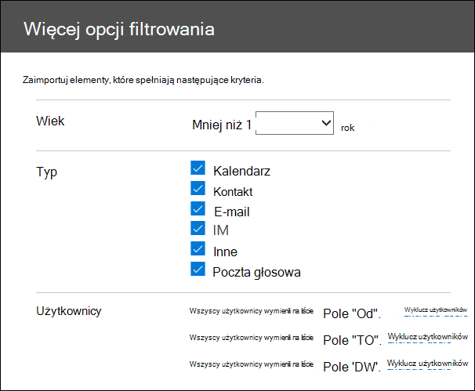

# Filtruj dane podczas importowania plików PST

Użyj nowej funkcji inteligentnego importu w usłudze Import platformy Microsoft 365, aby filtrować elementy w plikach PST, które faktycznie są importowane do docelowych skrzynek pocztowych. Oto jak to działa:
  
- Po utworzeniu i przesłaniu zadania importowania PST pliki PST są przekazywane do obszaru magazynu platformy Azure w chmurze firmy Microsoft.
  
- Platforma Microsoft 365 analizuje dane w plikach PST w bezpieczny i bezpieczny sposób, identyfikując wiek elementów skrzynki pocztowej i różne typy wiadomości zawarte w plikach PST.
  
- Po zakończeniu analizy i przygotowaniu danych do zaimportowania można zaimportować wszystkie dane w plikach PST w takim stanie, w jakim są, lub przyciąć importowane dane, ustawiając filtry kontrolujące importowane dane. Możesz na przykład wybrać następujące opcje:
  
  - Importuj tylko elementy w określonym wieku.
  
  - Zaimportuj wybrane typy komunikatów.
  
  - Wyklucz wiadomości wysyłane lub odbierane przez określone osoby.
  
- Po skonfigurowaniu ustawień filtru platforma Microsoft 365 importuje tylko dane spełniające kryteria filtrowania do docelowych skrzynek pocztowych określonych w zadaniu importowania.
  
Na poniższej ilustracji przedstawiono proces inteligentnego importowania i wyróżniono zadania wykonywane przez użytkownika oraz zadania wykonywane przez Office 365.
  

  
## Tworzenie zadania importowania PST

- W krokach opisanych w tym temacie założono, że utworzono zadanie importu PST w usłudze Office 365 Import przy użyciu przekazywania sieci lub wysyłania dysku. Aby uzyskać instrukcje krok po kroku, zobacz jeden z następujących tematów:
    
  - [Importowanie plików PST do Office 365 przy użyciu przekazywania sieci](use-network-upload-to-import-pst-files.md)
    
  - [Importowanie plików PST do Office 365 przy użyciu wysyłania dysków](use-drive-shipping-to-import-pst-files-to-office-365.md)
    
- Po utworzeniu zadania importu przy użyciu przekazywania sieci stan zadania importowania na stronie Import w Centrum zgodności & zabezpieczeń jest ustawiony na wartość **Analiza w toku**, co oznacza, że platforma Microsoft 365 analizuje dane w przekazanych plikach PST. Kliknij **pozycję Odśwież odświeżanie** , aby zaktualizować stan zadania importowania. 
    
- W przypadku zadań importowania wysyłki dysków dane zostaną przeanalizowane przez platformę Microsoft 365 po odebraniu dysku twardego przez personel centrum danych firmy Microsoft i przekazaniu plików PST do obszaru magazynu platformy Azure dla organizacji.
  
## Filtrowanie danych importowanych do skrzynek pocztowych

Po utworzeniu zadania importowania PST wykonaj następujące kroki, aby przefiltrować dane przed zaimportowaniem ich do Office 365.
  
1. Przejdź do <a href="https://go.microsoft.com/fwlink/p/?linkid=2077149" target="_blank">portal zgodności Microsoft Purview</a> i zaloguj się przy użyciu poświadczeń konta administratora w organizacji.
    
2. W lewym okienku portalu zgodności kliknij pozycję **Importuj zarządzanie cyklem** \> życia danych.
    
    Zadania importu dla organizacji są wyświetlane na karcie **Import.** Wartość **Analiza ukończona** w kolumnie **Stan** wskazuje zadania importu, które zostały przeanalizowane przez platformę Microsoft 365 i są gotowe do zaimportowania.
    
    
  
3. Wybierz zadanie importu, które chcesz ukończyć, a następnie kliknij pozycję **Importuj, aby Office 365**.
  
    Zostanie wyświetlona strona wysuwana z informacjami o plikach PST i innymi informacjami o zadaniu importowania.

4. Kliknij **pozycję Importuj, aby Office 365**.
    
    Zostanie wyświetlona strona **Filtrowanie danych** . Zawiera on szczegółowe informacje o danych w plikach PST zadania importu, w tym informacje o wieku danych. 
    
    
  
5. Na podstawie tego, czy chcesz przyciąć dane zaimportowane do platformy Microsoft 365, w obszarze **Czy chcesz filtrować dane?**, wykonaj jedną z następujących czynności:
  
    a. Kliknij przycisk **Tak, chcę go filtrować przed zaimportowaniem** , aby przyciąć importowane dane, a następnie kliknij przycisk **Dalej**.
  
    Strona **Importuj dane do Office 365 jest** wyświetlana ze szczegółowymi szczegółowymi informacjami o danych z analizy przeprowadzonej przez platformę Microsoft 365. 
  
    
  
    Wykres na tej stronie przedstawia ilość danych, które zostaną zaimportowane. Informacje o każdym typie komunikatu znalezionym w plikach PST są wyświetlane na grafie. Możesz zatrzymać kursor na każdym pasku, aby wyświetlić określone informacje o tym typie komunikatu. Istnieje również lista rozwijana z różnymi wartościami wieku na podstawie analizy plików PST. Po wybraniu wieku na liście rozwijanej graf jest aktualizowany, aby pokazać, ile danych zostanie zaimportowanych dla wybranego wieku. 
  
    b. Aby skonfigurować filtry dodawania w celu zmniejszenia ilości zaimportowanych danych, kliknij pozycję **Więcej opcji filtrowania**.
  
    
  
    Można skonfigurować następujące filtry:
  
      - **Wiek** — wybierz wiek, więc importowane będą tylko elementy nowsze niż określony wiek. Zobacz sekcję [Więcej informacji](#more-information) , aby uzyskać opis sposobu, w jaki platforma Microsoft 365 określa przedziały wiekowe dla filtru **Wiek** . 
  
      - **Typ** — w tej sekcji przedstawiono wszystkie typy komunikatów, które zostały znalezione w plikach PST zadania importu. Możesz usunąć zaznaczenie pola obok typu komunikatu, który chcesz wykluczyć. Nie można wykluczyć typu Inny komunikat. Zobacz sekcję [Więcej informacji](#more-information) , aby uzyskać listę elementów skrzynki pocztowej uwzględnionych w kategorii Inne.
  
      - **Użytkownicy** — można wykluczyć wiadomości wysyłane lub odbierane przez określone osoby. Aby wykluczyć osoby, które pojawiają się w polu Od:, Do: lub w polu DW: komunikatów, kliknij pozycję **Wyklucz użytkowników** obok tego typu adresata. Wpisz adres e-mail (adres SMTP) osoby, kliknij przycisk **Dodaj** aby dodać ich do listy wykluczonych użytkowników dla tego typu adresata, a następnie kliknij przycisk **Zapisz** , aby zapisać listę wykluczonych użytkowników. 
  
        > [!NOTE]
        > Platforma Microsoft 365 nie pokazuje szczegółowych informacji o danych, które wynikają z ustawienia filtru **Osoby** . Jeśli jednak ten filtr zostanie ustawiony tak, aby wykluczał komunikaty wysyłane lub odbierane przez określone osoby, te komunikaty zostaną wykluczone podczas rzeczywistego procesu importowania. 
  
    c. Kliknij **pozycję Zastosuj** na stronie **wylatywania Więcej opcji filtrowania** , aby zapisać ustawienia filtru. 
  
    Szczegółowe informacje o danych na stronie **Importuj dane do Office 365** są aktualizowane na podstawie ustawień filtru, w tym łącznej ilości danych, które zostaną zaimportowane na podstawie ustawień filtru. Zostanie również wyświetlone podsumowanie ustawień filtru. W razie potrzeby możesz kliknąć pozycję **Edytuj** obok filtru, aby zmienić to ustawienie. 
  
    
  
    d. Kliknij **Dalej**.
  
    Zostanie wyświetlona strona stanu z ustawieniami filtru. Ponownie możesz edytować dowolne ustawienia filtru.
  
    e. Kliknij pozycję **Importuj dane** , aby rozpocząć importowanie. Zostanie wyświetlona całkowita ilość danych, które zostaną zaimportowane. 
  
    Lub
  
    a. Kliknij przycisk **Nie, chcę zaimportować wszystko**, aby zaimportować wszystkie dane w plikach PST do Office 365, a następnie kliknij przycisk **Dalej**.
  
    b. Na stronie **Importuj dane do Office 365** kliknij pozycję **Importuj dane**, aby rozpocząć importowanie. Zostanie wyświetlona całkowita ilość danych, które zostaną zaimportowane. 
  
6. Na karcie **Import** kliknij pozycję **Odśwież**  Stan zadania importowania jest wyświetlany w kolumnie **Stan** .
  
7. Kliknij zadanie importowania, aby wyświetlić bardziej szczegółowe informacje, takie jak stan każdego pliku PST i skonfigurowane ustawienia filtru.

## Więcej informacji

- W jaki sposób platforma Microsoft 365 określa przyrosty filtru wieku? Gdy platforma Microsoft 365 analizuje plik PST, sprawdza wysłany lub odebrany sygnaturę czasową każdego elementu (jeśli element ma zarówno wysłany, jak i odebrany znacznik czasu, wybrana jest najstarsza data). Następnie platforma Microsoft 365 analizuje wartość roku dla tego znacznika czasu i porównuje ją z bieżącą datą w celu określenia wieku elementu. Te grupy wiekowe są następnie używane jako wartości z listy rozwijanej filtru **Wiek** . Jeśli na przykład plik PST zawiera komunikaty z lat 2016, 2015 i 2014, wartości w filtrze **Wiek** będą wynosić **1 rok**, **2 lata** i **3 lata**.
  
- Poniższa tabela zawiera listę typów komunikatów uwzględnionych w kategorii **Inne** w filtrze **Typ** na stronie wylatywania **Więcej opcji** (zobacz Krok 5b w poprzedniej procedurze). Obecnie nie można wykluczyć elementów w kategorii "Inne" podczas importowania pst do Office 365. 
  
    |**Identyfikator klasy komunikatów**|**Elementy skrzynki pocztowej korzystające z tej klasy wiadomości**|
    |:-----|:-----|
    |IPM. Działania    |Wpisy dziennika    |
    |IPM. Dokumentu    |Dokumenty i pliki (nie są dołączone do wiadomości e-mail)    |
    |IPM. Plik    |(taka sama jak IPM. Dokument)    |
    |IPM. Note.IMC.Notification    |Raporty wysyłane przez internet mail connect, który jest bramą Exchange Server do Internetu    |
    |IPM. Note.Microsoft.Fax    |Wiadomości faksowe    |
    |IPM. Note.Rules.Oof.Template.Microsoft    |Komunikaty autoreply poza biurem    |
    |IPM. Note.Rules.ReplyTemplate.Microsoft    |Odpowiedzi wysyłane przez regułę skrzynki odbiorczej    |
    |IPM. OLE. Klasa    |Wyjątki dla serii cyklicznej    |
    |IPM. Recall.Report    |Raporty dotyczące odwoływania komunikatów    |
    |IPM. Zdalnego    |Zdalne wiadomości e-mail    |
    |IPM. Raportu    |Raporty o stanie elementu    |
