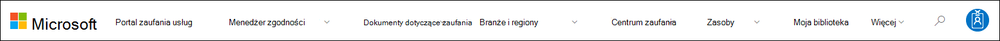

# Rozpoczynanie pracy z Portalem zaufania usług firmy Microsoft

Portal zaufania usług firmy Microsoft udostępnia wiele zawartości, narzędzi i innych zasobów dotyczących zasad bezpieczeństwa, prywatności i zgodności firmy Microsoft.

## Uzyskiwanie dostępu do Portalu zaufania usług

Portal zaufania usług zawiera szczegółowe informacje na temat wdrożenia przez firmę Microsoft kontrolek i procesów chroniących nasze usługi w chmurze i dane klientów w tym portalu. Aby uzyskać dostęp do niektórych zasobów w Portalu zaufania usług, musisz zalogować się jako uwierzytelniony użytkownik przy użyciu konta usług firmy Microsoft w chmurze (konta organizacji firmy Azure Active Directory lub konta Microsoft) i zapoznać się z Umową o ujawnianiu informacji o zgodności firmy Microsoft i zaakceptować ją.

### Obecni klienci

Istniejący klienci mogą uzyskać dostęp do Portalu zaufania usług za <https://aka.ms/STP> pomocą jednej z następujących subskrypcji online (wersji próbnej lub płatnej):

- Microsoft 365
- Dynamics 365
- Azure

 > [!NOTE]
 > Azure Active Directory skojarzone z organizacjami mają dostęp do pełnego zakresu dokumentów i funkcji, takich jak Menedżer zgodności. Konta Microsoft utworzone do użytku osobistego mają ograniczony dostęp do zawartości Portalu zaufania usług.

### Nowi klienci i klienci oceniający usługi online firmy Microsoft

Aby utworzyć nowe konto lub konto wersji próbnej, aby uzyskać dostęp do portalu STP, użyj jednego z poniższych formularzy rejestracji (używanych również w przypadku kont wersji próbnej).

- Zarejestruj się, aby uzyskać nowe [konto Aplikacje Microsoft 365 dla firm próbnego](https://go.microsoft.com/fwlink/p/?LinkID=507653) lub nowe [konto Office 365 Enterprise próbnego](https://go.microsoft.com/fwlink/p/?LinkID=698279)

- Zarejestruj się, aby uzyskać nowe konto wersji [próbnej usługi Dynamics 365](https://go.microsoft.com/fwlink/?LinkId=252780)

- Zarejestruj się, aby uzyskać nowe konto [wersji próbnej platformy Azure](https://go.microsoft.com/fwlink/?LinkId=722737).

Gdy zarejestrujesz się w celu korzystania z bezpłatnej wersji próbnej lub subskrypcji, musisz włączyć Azure Active Directory w celu obsługi dostępu do usługi STP.

## Korzystanie z Portalu zaufania usług

Zawartość i funkcje Portalu zaufania usług są dostępne z menu głównego.

W poniższych sekcjach opisano poszczególne elementy menu głównego.

### Portal zaufania usług

Link **Do Portalu zaufania usług** zawiera stronę główną. Zapewnia ona szybki sposób powrotu do strony głównej.

### Menedżer zgodności

> [!IMPORTANT]
> Menedżer zgodności został przeniesiony z Portalu zaufania usług do <a href="https://go.microsoft.com/fwlink/p/?linkid=2077149" target="_blank">Centrum zgodności platformy Microsoft 365</a>. Wszystkie dane klienta zostały przeniesione do nowej lokalizacji, więc możesz nadal korzystać z Menedżera zgodności bez przerywania pracy. Informacje o konfiguracji i [nowych funkcjach](compliance-manager.md) można znaleźć w dokumentacji Menedżera zgodności.

### Dokumenty dotyczące zaufania

Udostępnia wiele informacji dotyczących wdrożenia zabezpieczeń i projektu, które mają na celu ułatwienie realizacji celów dotyczących zgodności z przepisami przez zrozumienie sposobu, w jaki usługi firmy Microsoft w chmurze zapewniają bezpieczeństwo Twoich danych. Aby przejrzeć zawartość, wybierz jedną z następujących opcji z menu  rozwijanego Ufaj dokumentom.

- **Raporty inspekcji:** Zostanie wyświetlona lista niezależnych raportów inspekcji i ocen dotyczących usług firmy Microsoft w chmurze. Te raporty zawierają informacje na temat zgodności usług firmy Microsoft w chmurze z normami ochrony danych i wymaganiami prawnymi, na przykład:

  - Międzynarodowa Organizacja Normalizacją (ISO)
  - Service Organization Controls (SOC)
  - National Institute of Standards and Technology (NIST)
  - Federal Risk and Authorization Management Program (FedRAMP)
  - Ogólne Rozporządzenie o Ochronie Danych (RODO)

- **Ochrona danych:** Dostępnych jest wiele zasobów, takich jak kontrolki, białe dokumenty, często zadawane pytania, testy penetracyjne, narzędzia do oceny ryzyka i przewodniki dotyczące zgodności.

- **Plany zabezpieczeń i zgodności platformy Azure:** Zasoby, które ułatwiają tworzenie bezpiecznych i zgodnych aplikacji opartych na chmurze. W tym obszarze znajdują się wskazówki dla instytucji rządowych, finansów, opieki zdrowotnej i sprzedaży detalicznej.

### Branże & regionów

Udostępnia informacje dotyczące zgodności specyficzne dla branży i regionu dotyczące usług firmy Microsoft w chmurze.

- **Branże:** Obecnie ta strona udostępnia stronę docelową dla branży usług finansowych. Zawierają informacje, takie jak oferty dotyczące zgodności, często zadawane pytania i historie sukcesów. W przyszłości zostaną wydane zasoby dla większej liczby branż, można jednak znaleźć zasoby dla większej liczby branż, przechodząc do strony Dokumenty dotyczące zaufania **> ochrony** danych w UC.

- **Regiony:** Zapewnia opinie prawne dotyczące zgodności usług firmy Microsoft w chmurze z różnymi przepisami prawnymi w różnych krajach. Do konkretnych krajów należą: Australia, Kanada, Czechy, Dania, Niemcy, Polska, Rumunia, Hiszpania i Zjednoczone Królestwo.

### Centrum zaufania

Linki do Centrum [zaufania firmy Microsoft](https://www.microsoft.com/trust-center), które zawiera więcej informacji na temat zabezpieczeń, zgodności i prywatności w chmurze firmy Microsoft. Zawierają one informacje na temat możliwości usług firmy Microsoft w chmurze, których można użyć do spełniania określonych wymagań RODO, dokumentacji pomocnej dla Twojej odpowiedzialności w związku z RODO oraz Twojej wiedzy na temat środków technicznych i organizacyjnych, jakie firma Microsoft podjęła w celu obsługi RODO.

### Moja biblioteka

Ta nowa funkcja pozwala zapisywać *(lub* przypinać) dokumenty, aby można było szybko uzyskać do nich dostęp na stronie Moja biblioteka. Możesz również skonfigurować powiadomienia, aby firma Microsoft wysyłała Do Ciebie wiadomość e-mail po zaktualizowaniu dokumentów w Mojej bibliotece. Aby uzyskać więcej informacji, zobacz [sekcję Moja biblioteka](#my-library-1) w tym artykule.

### Więcej

Przejdź do **pozycji Więcej > administratorów** , aby uzyskać dostęp do funkcji administracyjnych, które są dostępne tylko dla konta administratora globalnego. Ta opcja jest widoczna tylko po zalogowaniu się jako administrator globalny. Menu rozwijane Administrator zawiera dwie opcje:

- **Ustawienia: Ta** strona umożliwia przypisanie ról użytkowników w Menedżerze zgodności (wersja klasyczna).

- **Prywatność Ustawienia: Ta** strona umożliwia wyeksportowanie raportu zawierającego przypisania czynności do wykonania w Menedżerze zgodności (klasycznej) dla określonego użytkownika. Możesz również ponownie przypisać wszystkie czynności do innego użytkownika i usunąć każdy element akcji przypisany do określonego użytkownika.

### Wyszukiwanie

Kliknij lupę w prawym górnym rogu strony Portal zaufania usług, aby rozwinąć pole, wprowadź wyszukiwane terminy i naciśnij klawisz **Enter**. Zostanie **wyświetlona** strona wyszukiwania z wyświetlonym wyszukiwany terminem w polu wyszukiwania oraz poniższymi wynikami wyszukiwania.

Domyślnie wyszukiwanie zwraca wyniki dokumentu. Wyniki możesz filtrować, używając list rozwijanych, aby uściślić wyświetlaną listę dokumentów. Aby zawęzić listę dokumentów, możesz użyć wielu filtrów. Filtry obejmują określone usługi w chmurze, kategorie rozwiązań dotyczących zgodności lub zabezpieczeń, regiony i branże. Kliknij link z nazwą dokumentu, aby pobrać dokument.

> [!NOTE]
> Raporty i dokumenty w Portalu zaufania usług są dostępne do pobrania przez co najmniej 12 miesięcy od ich publikacji lub do momentu, gdy będzie dostępna nowa wersja dokumentu.

## Moja biblioteka

Funkcja Moja biblioteka umożliwia dodawanie dokumentów i zasobów z Portalu zaufania usług do strony Moja biblioteka. Dzięki temu możesz uzyskać dostęp do dokumentów, które są dla Ciebie istotne, w jednym miejscu.  Aby dodać dokument do mojej biblioteki, kliknij menu **...** po prawej stronie dokumentu, a następnie wybierz pozycję **Zapisz w bibliotece**. Do mojej biblioteki możesz dodać wiele dokumentów, klikając pole wyboru obok jednego lub kilku dokumentów, a następnie klikając pozycję Zapisz  w bibliotece u góry strony.

Ponadto funkcja powiadomień umożliwia skonfigurowanie mojej biblioteki w taki sposób, aby za każdym razem, gdy firma Microsoft aktualizuje dokument dodany do mojej biblioteki, wysyłała do Ciebie wiadomość e-mail. Aby skonfigurować powiadomienia, przejdź do mojej biblioteki i kliknij pozycję Powiadomienia **Ustawienia**. Możesz wybrać częstotliwość powiadomień i określić adres e-mail w organizacji, na który chcesz wysyłać powiadomienia. Powiadomienia e-mail zawierają linki do zaktualizowanych dokumentów oraz krótki opis aktualizacji.

Pamiętaj też, że identyfikujemy wszystkie dokumenty z Twojej Mojej biblioteki, które zostały zaktualizowane w ciągu ostatnich 30 dni, niezależnie od tego, czy włączysz powiadomienia. Krótki opis aktualizacji jest również wyświetlany w etykietce narzędzia.

## Pakiety startowe

Pakiety startowe to zestaw dokumentacji firmy Microsoft na temat usług firmy Microsoft w chmurze dla określonych branż. Obecnie Portal zaufania usług oferuje następujące trzy pakiety startowe dla organizacji usług finansowych. Te pakiety startowe pomagają organizacjom oceniać i oceniać zabezpieczenia, zgodność z przepisami i prywatność w chmurze firmy Microsoft i dostarczają wskazówek pomocnych we wdrażaniu usług firmy Microsoft w chmurze z branżą ściśle uregulowanych usług finansowych.

- **Pakiet startowy oceny:** Dane te są służące do wczesnego oceniania chmury firmy Microsoft dla organizacji usług finansowych.

- **Pakiet startowy assessment:** Po zakończeniu oceny skorzystaj z list kontrolnych i innych wskazówek w tym pakiecie startowym, aby ułatwić organizacji ocenę ryzyka związanego z zabezpieczeniami, zgodnością i prywatnością.

- **Pakiet startowy inspekcji:** Ten pakiet startowy zawiera wskazówki dotyczące używania kontrolek inspekcji i innego narzędzia, które ułatwia wdrożenie usług firmy Microsoft w chmurze w sposób ułatwiający ograniczenie ryzyka organizacji.

Aby uzyskać dostęp do tych pakietów startowych, przejdź > branż portalu zaufania usług **& regionów > rozwiązania branżowe i > usług finansowych**. Możesz otwierać lub pobierać dokumenty z pakietu startowego albo zapisywać je w mojej bibliotece.

## Obsługa lokalizacji

Portal zaufania usług umożliwia wyświetlanie zawartości strony w różnych językach. Aby zmienić język strony, po prostu kliknij ikonę kuli ziemskiej w lewym dolnym rogu strony i wybierz język.

## Opinie

Możemy pomóc w przypadku pytań dotyczących Portalu zaufania usług lub błędów, które występują podczas korzystania z portalu. Możesz również skontaktować się z nami w przypadku pytań i opinii na temat raportów zgodności i zasobów dotyczących zaufania w Portalu zaufania usług, korzystając z linku Opinia u dołu stron w Portalu zaufania usług.

Twoja opinia jest dla nas ważna. Kliknij przycisk Opinia u dołu strony, aby wysłać nam komentarze na temat tego, co lubisz, a czego nie, lub sugestie dotyczące ulepszania naszych produktów lub funkcji produktu.

