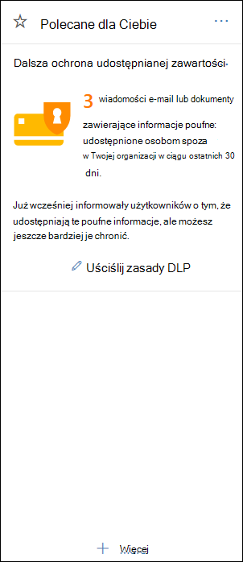

# Wprowadzenie do domyślnych zasad DLP

Zanim utworzysz już pierwszą politykę ochrony przed utratą danych (DLP, Data Loss Prevention), ochrona przed utratą danych pomaga chronić Poufne informacje przy użyciu zasad domyślnych. Te zasady domyślne i ich zalecenia (przedstawione poniżej) ułatwiają zabezpieczanie poufnej zawartości, informując Cię o tym, gdy wiadomości e-mail lub dokumenty zawierające numer karty kredytowej zostały udostępnione osobie spoza Twojej organizacji. Na stronie głównej Centrum  &amp; zgodności zabezpieczeń zobaczysz to zalecenie. 
  
Za pomocą tego widżetu możesz szybko sprawdzić, kiedy i ile informacji poufnych zostało udostępnionych, a następnie uściślić domyślne zasady DLP za pomocą jednego lub dwóch kliknięcia. Domyślne zasady DLP można także edytować w dowolnym momencie, ponieważ można je w pełni dostosować. Zwróć uwagę, że jeśli na początku nie widzisz zalecenia, kliknij pozycję **+Więcej** u dołu sekcji **Polecane dla** Ciebie. 
  

  
## Wyświetlanie raportu i uściślij domyślne zasady DLP

Gdy widżet pokazuje, że użytkownicy udostępniali poufne informacje osobom spoza organizacji, wybierz pozycję **Uściślij zasady DLP** u dołu. 
  
Raport szczegółowy zawiera informacje o tym, kiedy i ile zawartości zawierającej numery kart kredytowych udostępniono w ciągu ostatnich 30 dni. Pamiętaj, że wyświetlanie dopasowania reguł w widżecie może potrwać do 48 godzin.
  
Aby chronić informacje poufne, domyślne zasady DLP:
  
- Wykrywa, czy zawartość w Exchange, SharePoint i w OneDrive zawierająca co najmniej jeden numer karty kredytowej jest udostępniana osobom spoza organizacji.
    
- Wyświetla poradę o zasadach i wysyła do użytkowników wiadomość e-mail z powiadomieniem, gdy próbują udostępnić te informacje poufne osobom spoza organizacji. Aby uzyskać więcej informacji o tych opcjach, zobacz Wysyłanie [powiadomień e-mail i wyświetlanie porad dotyczących zasad DLP](use-notifications-and-policy-tips.md).
    
- Generuje szczegółowe raporty aktywności, aby śledzić na przykład osoby, które udostępniły zawartość osobom spoza organizacji, i kiedy to zrobiły. Aby wyświetlić te informacje, możesz użyć raportów [funkcji DLP](view-the-dlp-reports.md) i danych [dziennika inspekcji](search-the-audit-log-in-security-and-compliance.md) (gdzie **activityDLP** = ).
    
Aby szybko uściślić domyślne zasady DLP, możesz wybrać jedną z tych opcji:
  
- Wyślij do Ciebie wiadomość e-mail z raportem o zdarzeniu, gdy użytkownicy będą udostępniać te poufne informacje osobom spoza organizacji.
    
- Dodaj innych użytkowników do raportu o zdarzeniu poczty e-mail.
    
- Zablokuj dostęp do zawartości zawierającej informacje poufne, ale zezwalaj użytkownikowi na zastępowanie i udostępnianie lub wysyłanie w razie potrzeby.
    
Aby uzyskać więcej informacji na temat raportów zdarzeń lub ograniczeń dostępu, zobacz Informacje [dotyczące ochrony przed utratą danych](data-loss-prevention-policies.md).
  
Jeśli chcesz później zmienić te opcje, możesz w dowolnym momencie edytować domyślne zasady DLP — zobacz następną sekcję.
  

  
## Edytowanie domyślnych zasad DLP

Te zasady mają nazwę **Domyślne zasady DLP i** są wyświetlane w obszarze Ochrona przed **utratą** **danych na stronie** Zasady w Centrum &amp; zgodności zabezpieczeń. 
  
Te zasady można w pełni dostosowywać, tak samo jak wszelkie zasady DLP, które tworzysz samodzielnie od podstaw. Możesz również wyłączyć lub usunąć zasady, aby twoi użytkownicy nie osyłali już porad dotyczących zasad ani powiadomień e-mail.
  

  
## Gdy widżet jest wyświetlany i nie jest wyświetlany

Widżet o nazwie **Dalsza ochrona udostępnianej** zawartości jest wyświetlany w **sekcji Polecane** dla **Ciebie na stronie** głównej Centrum &amp; zgodności zabezpieczeń. 
  
Ten widżet jest wyświetlany tylko w przypadku:
  
- Centrum zgodności zabezpieczeń &amp; ani centrum administracyjne firmy Exchange nie mają żadnych zasad ochrony przed utratą danych. Ten widżet ma ułatwić Ci rozpoczynanie pracy z zasadami DLP, dlatego nie jest wyświetlany, jeśli masz już zasady DLP.
    
- Zawartość zawierająca co najmniej jedną kartę kredytową została udostępniona osobie spoza Twojej organizacji w ciągu ostatnich 30 dni.
    
Pamiętaj, że dostęp do dopasowania reguł może potrwać do 48 godzin, więc po wykryciu poufnych informacji udostępnionych zewnętrznie może upłynie do dwóch dni, aż pojawi się zalecenie.
  
Na koniec, po użyciu widżetu do uściśnięcia domyślnych zasad DLP widżet zniknie ze strony **głównej** . 
  

