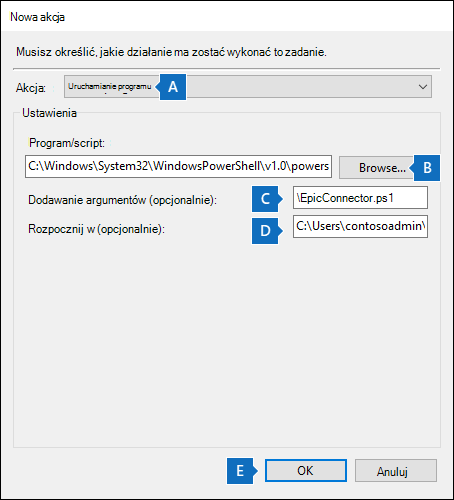
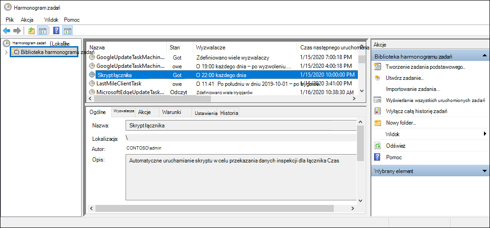

# <a name="set-up-a-connector-to-import-epic-ehr-audit-data-preview"></a>Konfigurowanie łącznika w celu importowania danych inspekcji epiki EHR (wersja zapoznawcza)

Łącznik danych można skonfigurować w portalu zgodności usługi Microsoft Purview w celu zaimportowania rekordów inspekcji aktywności użytkowników w systemie Epic Electronic Healthcare Records (EHR) organizacji. Rekordy inspekcji z systemu Epic EHR obejmują rekordy zdarzeń związanych z uzyskiwaniem dostępu do dokumentacji medycznej pacjenta. Rekordy inspekcji epic EHR mogą być używane przez [rozwiązanie Microsoft 365 zarządzania ryzykiem wewnętrznym](insider-risk-management.md), aby chronić organizację przed nieautoryzowanym dostępem do informacji o pacjentach.

Konfigurowanie łącznika epic składa się z następujących zadań:

- Tworzenie aplikacji w usłudze Azure Active Directory (Azure AD) w celu uzyskania dostępu do punktu końcowego interfejsu API, który akceptuje plik tekstowy rozdzielony kartami zawierający rekordy inspekcji epic EHR.

- Tworzenie pliku tekstowego ze wszystkimi polami wymaganymi zgodnie ze schematem łącznika.

- Tworzenie wystąpienia łącznika Epic w portalu zgodności.

- Uruchamianie skryptu w celu wypchnięcia rekordów inspekcji epiki EHR do punktu końcowego interfejsu API.

- Opcjonalnie zaplanowanie automatycznego uruchamiania skryptu w celu zaimportowania rekordów inspekcji.

## <a name="before-you-set-up-the-connector"></a>Przed skonfigurowaniem łącznika

- Użytkownik, który tworzy łącznik Epik w kroku 3, musi mieć przypisaną rolę administratora łącznika danych. Ta rola jest wymagana do dodawania łączników na stronie **Łączniki danych** w portalu zgodności. Ta rola jest domyślnie dodawana do wielu grup ról. Aby uzyskać listę tych grup ról, zobacz sekcję "Role w centrach zabezpieczeń i zgodności" w obszarze [Uprawnienia w Centrum zgodności & zabezpieczeń](../security/office-365-security/permissions-in-the-security-and-compliance-center.md#roles-in-the-security--compliance-center). Alternatywnie administrator w organizacji może utworzyć niestandardową grupę ról, przypisać rolę administratora łącznika danych, a następnie dodać odpowiednich użytkowników jako członków. Aby uzyskać instrukcje, zobacz sekcję "Tworzenie niestandardowej grupy ról" w obszarze [Uprawnienia w portalu zgodności usługi Microsoft Purview](microsoft-365-compliance-center-permissions.md#create-a-custom-role-group).

- Musisz określić sposób pobierania lub eksportowania danych z systemu Epic EHR w organizacji (codziennie) i utworzyć plik tekstowy opisany w kroku 2. Skrypt uruchamiany w kroku 4 spowoduje wypchnięcie danych w pliku tekstowym do punktu końcowego interfejsu API.

- Przykładowy skrypt uruchamiany w kroku 4 wypycha rekordy inspekcji epic EHR z pliku tekstowego do interfejsu API łącznika, dzięki czemu może być używany przez rozwiązanie do zarządzania ryzykiem wewnętrznym. Ten przykładowy skrypt nie jest obsługiwany w ramach żadnego standardowego programu pomocy technicznej firmy Microsoft ani usługi. Przykładowy skrypt jest dostarczany jako is bez gwarancji jakiegokolwiek rodzaju. Firma Microsoft dodatkowo zrzeka się wszelkich dorozumianych gwarancji, w tym, bez ograniczeń, wszelkich domniemanych gwarancji przydatności handlowej lub przydatności do określonego celu. Całe ryzyko wynikające z użycia lub wydajności przykładowego skryptu i dokumentacji pozostaje z Tobą. W żadnym wypadku firma Microsoft, jej autorzy lub ktokolwiek inny zaangażowany w tworzenie, produkcję lub dostarczanie skryptów nie ponosi odpowiedzialności za jakiekolwiek szkody (w tym, bez ograniczeń, szkody za utratę zysków z działalności gospodarczej, przerwę w działalności, utratę informacji biznesowych lub inną stratę pieniężną) wynikające z korzystania z przykładowych skryptów lub dokumentacji lub niemożności korzystania z nich,  nawet jeśli firma Microsoft została poinformowana o możliwości wystąpienia takich szkód.

## <a name="step-1-create-an-app-in-azure-active-directory"></a>Krok 1. Tworzenie aplikacji w Azure Active Directory

Pierwszym krokiem jest utworzenie i zarejestrowanie nowej aplikacji w usłudze Azure Active Directory (Azure AD). Aplikacja będzie odpowiadać łącznikowi Epic utworzonemu w kroku 3. Utworzenie tej aplikacji umożliwia usłudze Azure AD uwierzytelnianie żądania wypychania dla pliku tekstowego zawierającego rekordy inspekcji epic EHR. Podczas tworzenia tej aplikacji usługi Azure AD zapisz następujące informacje. Te wartości będą używane w kolejnych krokach.

- Identyfikator aplikacji usługi Azure AD (nazywany również *identyfikatorem aplikacji* lub *identyfikatorem klienta*)

- Wpis tajny aplikacji usługi Azure AD (nazywany również *kluczem tajnym klienta*)

- Identyfikator dzierżawy (nazywany również *identyfikatorem katalogu*)

Aby uzyskać instrukcje krok po kroku dotyczące tworzenia aplikacji w usłudze Azure AD, zobacz [Rejestrowanie aplikacji przy użyciu Platforma tożsamości Microsoft](\azure\active-directory\develop\quickstart-register-app).

## <a name="step-2-prepare-a-text-file-with-epic-ehr-audit-records"></a>Krok 2. Przygotowywanie pliku tekstowego z rekordami inspekcji epiki EHR

Następnym krokiem jest utworzenie pliku tekstowego zawierającego informacje o dostępie pracowników do dokumentacji medycznej pacjentów w systemie Epic EHR organizacji. Jak wyjaśniono wcześniej, należy określić sposób generowania tego pliku tekstowego z systemu Epic EHR. Przepływ pracy łącznika Epic wymaga pliku tekstowego z wartościami rozdzielonymi tabulatorami, aby zamapować te dane w pliku tekstowym przy użyciu wymaganego schematu łącznika. Obsługiwany format pliku jest plikiem .txt oddzielonym potokiem lub kartą.

> [!NOTE]
> Maksymalny rozmiar pliku tekstowego zawierającego dane inspekcji wynosi 3 GB. Maksymalna liczba wierszy wynosi 5 milionów. Pamiętaj również, aby uwzględnić tylko odpowiednie dane inspekcji z systemu EHR opieki zdrowotnej.

W poniższej tabeli wymieniono pola wymagane do włączenia scenariuszy zarządzania ryzykiem wewnętrznym. Podzestaw tych pól jest obowiązkowy. Te pola są wyróżnione gwiazdką (*). Jeśli w pliku tekstowym brakuje dowolnego z obowiązkowych pól, plik nie zostanie zweryfikowany, a dane w pliku nie zostaną zaimportowane.

|Pole|Kategoria|
|:----|:----------|
| ACCESS_LOG. *<br/>ACCESS_TIME ACCESS_LOG_METRIC. METRIC_NAME*<br/>ACCESS_LOG. WORKSTATION_ID<br/>ZCMETRIC\_\_ GROUP.NAME<br/>ZCACCESS\_\_ ACTION.NAME |Te pola służą do identyfikowania zdarzeń działań dostępu w systemie Epic EHR.|
| PACJENTA. PAT_MRN_ID<br/>PACJENTA. PAT_FIRST_NAME* <br/>PACJENTA. PAT_MIDDLE_NAME <br/>PACJENTA. PAT_LAST_NAME* <br/>PACJENTA. ADD_LINE_1* <br/>PACJENTA. ADD_LINE_2  <br/>PACJENTA. CITY* <br/>PATIENT.ZIP*  <br/>ZC_STATE.NAME <br/>ZC_COUNTRY.NAME <br/>CLARITY_DEP. DEPARTMENT_NAME              | Te pola służą do identyfikowania informacji o profilu pacjenta.|
| ZC_BTG_REASON.NAME*<br/> PAT_BTG_AUDIT. BTG_EXPLANATION | Te pola służą do identyfikowania dostępu do rekordów z ograniczeniami.|
| EMP. SYSTEM_LOGIN*<br/>CLARITY_EMP. USER_ID <br/> employee_last_name <sup>1</sup> <br/> employee_first_name <sup>1</sup>                | Te pola służą do identyfikowania informacji o profilu pracownika na potrzeby dopasowywania adresów i nazw wymaganych do określenia dostępu do rekordów Rodzina/Sąsiad/Pracownik. |
|||

> [!NOTE]
> Upewnij się, że eksportujesz tylko odpowiednie metryki dziennika z aplikacji Epic. 
> <sup>1</sup> To pole nie jest domyślnie dostępne w aplikacji Epic. Musisz skonfigurować eksport, aby upewnić się, że plik tekstowy zawiera to pole.

## <a name="step-3-create-the-epic-connector"></a>Krok 3. Tworzenie łącznika Epika

Następnym krokiem jest utworzenie łącznika Epic w portalu zgodności. Po uruchomieniu skryptu w kroku 4 plik tekstowy utworzony w kroku 2 zostanie przetworzony i wypchnięty do punktu końcowego interfejsu API skonfigurowanego w kroku 1. W tym kroku skopiuj identyfikator JobId wygenerowany podczas tworzenia łącznika. Użyjesz identyfikatora JobId podczas uruchamiania skryptu.

1. Przejdź do strony <https://compliance.microsoft.com> , a następnie kliknij pozycję **Łączniki danych** w lewym pasku nawigacyjnym.

2. Na stronie **Łączniki danych** w obszarze **Łącznik epicki** kliknij pozycję **Wyświetl**.

3. Na stronie **Łącznik Epik** kliknij pozycję **Dodaj łącznik**.

4. Na stronie **Konfigurowanie połączenia** wykonaj następujące czynności, a następnie kliknij przycisk **Dalej**:

    1. Wpisz lub wklej identyfikator aplikacji usługi Azure AD dla aplikacji platformy Azure utworzonej w kroku 2.

    2. Wpisz nazwę łącznika Epic.

5. Na stronie **Przegląd** przejrzyj ustawienia, a następnie kliknij przycisk **Zakończ** , aby utworzyć łącznik.

   Zostanie wyświetlona strona stanu, która potwierdza, że łącznik został utworzony. Ta strona zawiera dwie ważne rzeczy, które należy wykonać w następnym kroku, aby uruchomić przykładowy skrypt w celu przekazania danych rekordów inspekcji epic EHR.

    Przejrzyj stronę z identyfikatorem zadania i linkiem do usługi GitHub, aby uzyskać przykładowy skrypt

    1. **Identyfikator zadania.** Ten identyfikator zadania będzie potrzebny do uruchomienia skryptu w następnym kroku. Możesz skopiować go z tej strony lub ze strony wysuwanej łącznika.

    2. **Schemat referencyjny.** Zapoznaj się ze schematem, aby dowiedzieć się, które pola z systemu Epic są akceptowane przez łącznik. Pomoże to utworzyć plik ze wszystkimi wymaganymi polami bazy danych Epic.

    3. **Łącze do przykładowego skryptu.** Kliknij **link tutaj**, aby przejść do witryny GitHub, aby uzyskać dostęp do przykładowego skryptu (link otwiera nowe okno). Pozostaw to okno otwarte, aby można było skopiować skrypt w kroku 4. Alternatywnie możesz dodać zakładkę do miejsca docelowego lub skopiować adres URL, aby uzyskać do niego dostęp ponownie po uruchomieniu skryptu. Ten link jest również dostępny na stronie wysuwanego łącznika.

6. Kliknij pozycję **Gotowe**.

   Nowy łącznik jest wyświetlany na liście na **karcie Łączniki** .

7. Kliknij właśnie utworzony łącznik Epik, aby wyświetlić stronę wysuwaną zawierającą właściwości i inne informacje o łączniku.

Jeśli jeszcze tego nie zrobiono, możesz skopiować wartości identyfikatora **aplikacja systemu Azure** i **identyfikatora zadania łącznika**. Będą one potrzebne do uruchomienia skryptu w następnym kroku. Możesz również pobrać skrypt ze strony wysuwanej (lub pobrać go przy użyciu linku w następnym kroku).

Możesz również kliknąć pozycję **Edytuj**, aby zmienić identyfikator aplikacja systemu Azure lub nazwy nagłówków kolumn zdefiniowane na stronie **Mapowanie pliku**.

## <a name="step-4-run-the-sample-script-to-upload-your-epic-ehr-audit-records"></a>Krok 4. Uruchamianie przykładowego skryptu w celu przekazania rekordów inspekcji epiki EHR

Ostatnim krokiem konfigurowania łącznika Epic jest uruchomienie przykładowego skryptu, który przekaże dane rekordów inspekcji epic EHR w pliku tekstowym (utworzonym w kroku 1) do chmury firmy Microsoft. W szczególności skrypt przekazuje dane do łącznika Epic. Po uruchomieniu skryptu łącznik Epic utworzony w kroku 3 importuje dane rekordów inspekcji epic EHR do organizacji Microsoft 365, do której można uzyskać dostęp za pomocą innych narzędzi zgodności, takich jak rozwiązanie do zarządzania ryzykiem wewnętrznym. Po uruchomieniu skryptu rozważ zaplanowanie zadania, aby uruchamiać je automatycznie codziennie, aby najbardziej aktualne dane dotyczące kończania pracy pracowników były przekazywane do chmury firmy Microsoft. Zobacz [(Opcjonalnie) Krok 6. Planowanie automatycznego uruchamiania skryptu](#optional-step-6-schedule-the-script-to-run-automatically).

> [!NOTE]
> Jak wspomniano wcześniej, maksymalny rozmiar pliku tekstowego zawierającego dane inspekcji wynosi 3 GB. Maksymalna liczba wierszy wynosi 5 milionów. Wykonanie skryptu w tym kroku potrwa od około 30 do 40 minut, aby zaimportować dane inspekcji z dużych plików tekstowych. Ponadto skrypt podzieli duże pliki tekstowe na mniejsze bloki z 100 000 wierszy, a następnie zaimportuje te bloki sekwencyjnie.

1. Przejdź do okna, które zostało otwarte w poprzednim kroku, aby uzyskać dostęp do witryny GitHub przy użyciu przykładowego skryptu. Możesz też otworzyć witrynę z zakładki lub użyć skopiowanego adresu URL. Możesz również uzyskać dostęp do skryptu [tutaj](https://github.com/microsoft/m365-compliance-connector-sample-scripts/blob/main/sample_script.ps1).

2. Kliknij przycisk **Nieprzetworzone** , aby wyświetlić skrypt w widoku tekstowym.

3. Skopiuj wszystkie wiersze w przykładowym skryptycie, a następnie zapisz je w pliku tekstowym.

4. W razie potrzeby zmodyfikuj przykładowy skrypt dla organizacji.

5. Zapisz plik tekstowy jako plik skryptu Windows PowerShell przy użyciu sufiksu nazwy `.ps1`pliku , na przykład `EpicConnector.ps1`.

6. Otwórz wiersz polecenia na komputerze lokalnym i przejdź do katalogu, w którym zapisano skrypt.

7. Uruchom następujące polecenie, aby przekazać dane inspekcji epickiej w pliku tekstowym do chmury firmy Microsoft; na przykład:

   ```powershell
   .\EpicConnector.ps1 -tenantId <tenantId> -appId <appId>  -appSecret <appSecret>  -jobId <jobId>  -filePath '<filePath>'
   ```

W poniższej tabeli opisano parametry do użycia z tym skryptem i ich wymagane wartości. Informacje uzyskane w poprzednich krokach są używane w wartościach tych parametrów.

|Parametr  |Opis|
|:----------|:----------|
|tenantId|Jest to identyfikator organizacji Microsoft 365 uzyskany w kroku 1. Identyfikator dzierżawy organizacji można również uzyskać w bloku **Przegląd** w centrum administracyjnym usługi Azure AD. Służy to do identyfikowania organizacji.|
|Appid|Jest to identyfikator aplikacji usługi Azure AD dla aplikacji utworzonej w usłudze Azure AD w kroku 1. Jest ona używana przez usługę Azure AD do uwierzytelniania, gdy skrypt próbuje uzyskać dostęp do organizacji Microsoft 365.|
|appSecret|Jest to wpis tajny aplikacji usługi Azure AD dla aplikacji utworzonej w usłudze Azure AD w kroku 1. Jest to również używane do uwierzytelniania.|
|Jobid|Jest to identyfikator zadania łącznika Epic utworzony w kroku 3. Służy to do kojarzenia rekordów inspekcji Epic EHR przekazywanych do chmury firmy Microsoft z łącznikiem Epic.|
|Filepath|Jest to ścieżka pliku tekstowego (przechowywana w tym samym systemie co skrypt) utworzona w kroku 2. Staraj się unikać spacji w ścieżce pliku; W przeciwnym razie użyj pojedynczych cudzysłowów.|
|||

Oto przykład składni skryptu łącznika Epic przy użyciu rzeczywistych wartości dla każdego parametru:

```powershell
.\EpicConnector.ps1 -tenantId d5723623-11cf-4e2e-b5a5-01d1506273g9 -appId 29ee526e-f9a7-4e98-a682-67f41bfd643e -appSecret MNubVGbcQDkGCnn -jobId b8be4a7d-e338-43eb-a69e-c513cd458eba -filePath 'C:\Users\contosoadmin\Desktop\Data\epic_audit_records.txt'
```

Jeśli przekazywanie zakończy się pomyślnie, skrypt wyświetli **komunikat Upload Pomyślne**.

> [!NOTE]
> Jeśli masz problemy z uruchomieniem poprzedniego polecenia z powodu zasad wykonywania, zobacz [Informacje o zasadach wykonywania](/powershell/module/microsoft.powershell.core/about/about_execution_policies) i [Set-ExecutionPolicy](/powershell/module/microsoft.powershell.security/set-executionpolicy) , aby uzyskać wskazówki dotyczące ustawiania zasad wykonywania.

## <a name="step-5-monitor-the-epic-connector"></a>Krok 5. Monitorowanie łącznika epiku

Po utworzeniu łącznika Epic i wypchnięciu rekordów inspekcji EHR możesz wyświetlić łącznik i przekazać stan w portalu zgodności. Jeśli planujesz regularne uruchamianie skryptu automatycznie, możesz również wyświetlić bieżący stan po ostatnim uruchomieniu skryptu.

1. Przejdź do strony <https://compliance.microsoft.com> i kliknij pozycję **Łączniki danych** w lewym pasku nawigacyjnym.

2. Kliknij kartę **Łączniki,** a następnie wybierz łącznik Epik, aby wyświetlić stronę wysuwaną. Ta strona zawiera właściwości i informacje o łączniku.

3. W obszarze **Ostatni import** kliknij link **Pobierz dziennik** , aby otworzyć (lub zapisać) dziennik stanu łącznika. Ten dziennik zawiera informacje o każdym uruchomieniu skryptu i przekazaniu danych z pliku tekstowego do chmury firmy Microsoft.

    Plik dziennika łącznika epic wyświetla wiersze liczbowe z przekazanego pliku tekstowego

    Pole `RecordsSaved` wskazuje liczbę wierszy w przekazanym pliku tekstowym. Jeśli na przykład plik tekstowy zawiera cztery wiersze, wartość `RecordsSaved` pól wynosi 4, jeśli skrypt pomyślnie przekazał wszystkie wiersze w pliku tekstowym.

Jeśli skrypt nie został uruchomiony w kroku 4, w obszarze **Ostatni import** zostanie wyświetlony link umożliwiający pobranie skryptu. Możesz pobrać skrypt, a następnie wykonać kroki, aby uruchomić skrypt.

## <a name="optional-step-6-schedule-the-script-to-run-automatically"></a>(Opcjonalnie) Krok 6. Planowanie automatycznego uruchamiania skryptu

Aby upewnić się, że najnowsze rekordy inspekcji z systemu Epic EHR są dostępne dla narzędzi takich jak rozwiązanie do zarządzania ryzykiem wewnętrznym, zalecamy zaplanowanie automatycznego uruchamiania skryptu na co dzień. Wymaga to również zaktualizowania danych rekordu inspekcji firmy Epic w tym samym pliku tekstowym zgodnie z podobnym (jeśli nie tym samym) harmonogramem, tak aby zawierała najnowsze informacje o działaniach związanych z dostępem do rekordów pacjentów przez pracowników. Celem jest przekazanie najbardziej aktualnych rekordów inspekcji, aby łącznik Epic mógł udostępnić go rozwiązaniu do zarządzania ryzykiem wewnętrznym. 

Możesz użyć aplikacji Harmonogram zadań w Windows, aby codziennie automatycznie uruchamiać skrypt.

1. Na komputerze lokalnym kliknij przycisk **Windows Start**, a następnie wpisz **Harmonogram zadań**.

2. Kliknij aplikację **Harmonogram zadań** , aby ją otworzyć.

3. W sekcji **Akcje** kliknij pozycję **Utwórz zadanie**.

4. Na karcie **Ogólne** wpisz opisową nazwę zaplanowanego zadania; na przykład **skrypt łącznika Epic**. Możesz również dodać opcjonalny opis.

5. W obszarze **Opcje zabezpieczeń** wykonaj następujące czynności:

    1. Określ, czy skrypt ma być uruchamiany tylko wtedy, gdy użytkownik jest zalogowany na komputerze, czy uruchamiany po zalogowaniu.

    2. Upewnij się, że zaznaczono pole wyboru **Uruchom z najwyższymi uprawnieniami** .

6. Wybierz kartę **Wyzwalacze** , kliknij pozycję **Nowy**, a następnie wykonaj następujące czynności:

    1. W **obszarze Ustawienia** wybierz opcję **Codziennie**, a następnie wybierz datę i godzinę, aby uruchomić skrypt po raz pierwszy. Skrypt będzie uruchamiany codziennie o tej samej określonej godzinie.

    2. W obszarze **Ustawienia zaawansowane** upewnij się, że **zaznaczono** pole wyboru Włączone.

    3. Kliknij przycisk **OK**.

7. Wybierz kartę **Akcje** , kliknij pozycję **Nowy**, a następnie wykonaj następujące czynności:

   

    1. Na liście rozwijanej **Akcja** upewnij się, że **wybrano pozycję Uruchom program** .

    2. W polu **Program/skrypt** kliknij pozycję **Przeglądaj**, a następnie przejdź do następującej lokalizacji i wybierz ją, aby ścieżka była wyświetlana w polu: C:.0.exe.

    3. W polu **Dodawanie argumentów (opcjonalnie)** wklej to samo polecenie skryptu, które zostało uruchomione w kroku 4. Na przykład `.\EpicConnector.ps1 -tenantId "d5723623-11cf-4e2e-b5a5-01d1506273g9" -appId "c12823b7-b55a-4989-faba-02de41bb97c3" -appSecret "MNubVGbcQDkGCnn" -jobId "e081f4f4-3831-48d6-7bb3-fcfab1581458" -filePath "C:\Epic\audit\records.txt"`

    4. W polu **Start in (opcjonalnie) wklej** lokalizację folderu skryptu uruchomionego w kroku 4. Na przykład C:\Epic\audit.

    5. Kliknij **przycisk OK** , aby zapisać ustawienia nowej akcji.

8. W oknie **Tworzenie zadania** kliknij przycisk **OK** , aby zapisać zaplanowane zadanie. Może zostać wyświetlony monit o wprowadzenie poświadczeń konta użytkownika.

   Nowe zadanie zostanie wyświetlone w bibliotece harmonogramu zadań.

   

   Zostanie wyświetlony czas ostatniego uruchomienia skryptu i następnego zaplanowanego uruchomienia. Możesz kliknąć dwukrotnie zadanie, aby je edytować.

   Możesz również sprawdzić, kiedy ostatni raz skrypt był uruchamiany na stronie wysuwanej odpowiedniego łącznika Epic w Centrum zgodności.
