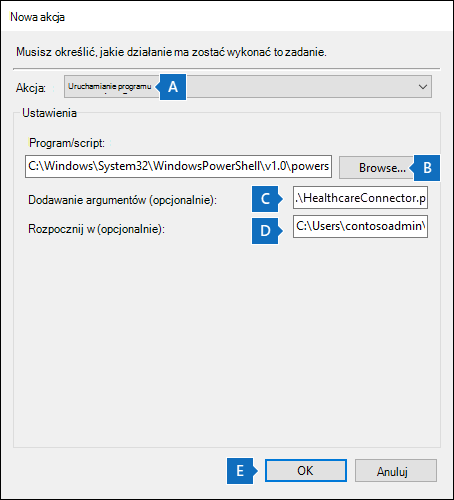

# <a name="set-up-a-connector-to-import-healthcare-ehr-audit-data-preview"></a>Konfigurowanie łącznika do importowania danych inspekcji EHR opieki zdrowotnej (wersja zapoznawcza)

W aplikacji można skonfigurować łącznik danych Centrum zgodności platformy Microsoft 365 importowania danych inspekcji aktywności użytkowników w systemie elektronicznej opieki zdrowotnej (EHR, Electronic Healthcare Records) organizacji. Dane inspekcji z systemu EHR opieki zdrowotnej obejmują dane dotyczące zdarzeń związanych z uzyskiwaniem dostępu do dokumentacji zdrowia pacjenta. Dane inspekcji EHR opieki zdrowotnej mogą być używane przez Microsoft 365 do zarządzania ryzykiem w ramach [](insider-risk-management.md) niejawnego programu testów w celu ochrony organizacji przed nieautoryzowanym dostępem do informacji pacjentów.

Konfigurowanie łącznika opieki zdrowotnej obejmuje następujące zadania:

- Tworzenie aplikacji w usłudze Azure Active Directory (Azure AD) w celu uzyskania dostępu do punktu końcowego interfejsu API, który akceptuje plik tekstowy rozdzielany tabulatorami zawierający dane inspekcji EHR opieki zdrowotnej.

- Tworzenie pliku tekstowego ze wszystkimi wymaganymi polami zgodnie ze zdefiniowanymi w schemacie łącznika.

- Tworzenie wystąpienia łącznika opieki zdrowotnej w Centrum zgodności platformy Microsoft 365.

- Uruchamianie skryptu w celu wypychania danych inspekcji EHR opieki zdrowotnej do punktu końcowego interfejsu API.

- Opcjonalnie możesz zaplanować automatyczne uruchamianie skryptu w celu zaimportowania danych inspekcji.

## <a name="before-you-set-up-the-connector"></a>Przed skonfigurowaniem łącznika

- Użytkownik, który tworzy łącznik opieki zdrowotnej w kroku 3, musi mieć przypisaną rolę Administrator łącznika danych. Ta rola jest wymagana do dodawania łączników na **stronie Łączniki** danych w Centrum zgodności platformy Microsoft 365. Ta rola jest domyślnie dodawana do wielu grup ról. Aby uzyskać listę tych grup ról, zobacz sekcję "Role w centrach zabezpieczeń i zgodności" w sekcji Uprawnienia w Centrum zabezpieczeń & [zgodności](../security/office-365-security/permissions-in-the-security-and-compliance-center.md#roles-in-the-security--compliance-center). Administrator w organizacji może również utworzyć niestandardową grupę ról, przypisać rolę administrator łącznika danych, a następnie dodać odpowiednich użytkowników jako członków. Aby uzyskać instrukcje, zobacz sekcję "Tworzenie niestandardowej grupy ról" w sekcji Uprawnienia [w Centrum zgodności platformy Microsoft 365](microsoft-365-compliance-center-permissions.md#create-a-custom-role-group).

- Należy określić, jak codziennie pobierać i eksportować dane z systemu EHR opieki zdrowotnej organizacji i utworzyć plik tekstowy opisany w kroku 2. Skrypt uruchomiony w kroku 4 wypchnie dane z pliku tekstowego do punktu końcowego interfejsu API.

- Przykładowy skrypt uruchomiony w kroku 4 wypycha dane inspekcji EHR opieki zdrowotnej z pliku tekstowego do interfejsu API łącznika, dzięki czemu może być używany przez rozwiązanie do zarządzania ryzykiem w ramach niejawnego programu testów. Ten przykładowy skrypt nie jest obsługiwany w żadnym standardowym programie lub usłudze pomocy technicznej firmy Microsoft. Przykładowy skrypt jest dostarczany W JAKIM JEST bez jakiejkolwiek gwarancji. Firma Microsoft dodatkowo nie udziela żadnych dorozumianych gwarancji, w tym, ale nie wyłącznie, żadnych dorozumianych gwarancji przydatności handlowej lub przydatności do określonego celu. Całe ryzyko związane z użyciem lub wykonaniem przykładowego skryptu i dokumentacji pozostaje tylko dla użytkownika. Firma Microsoft, jej autorzy ani nikt inny biorący udział w tworzeniu, produkcji lub dostarczaniu skryptów nie będą w żadnym wypadku ponosić odpowiedzialności za jakiekolwiek szkody (w tym, bez ograniczeń, szkody związane z utratą zysków, przerwami w działaniu firmy, utratą informacji biznesowych lub inne straty pieniężne) wynikające z korzystania z przykładowych skryptów lub dokumentacji lub nieumiejętnego korzystania z tych skryptów lub dokumentacji.  nawet jeśli firma Microsoft została powiadomiona o możliwości wystąpienia takich szkód.

## <a name="step-1-create-an-app-in-azure-active-directory"></a>Krok 1. Tworzenie aplikacji w aplikacji Azure Active Directory

Pierwszym krokiem jest utworzenie i zarejestrowanie nowej aplikacji w usłudze Azure Active Directory (Azure AD). Aplikacja będzie odpowiadać łącznikowi opieki zdrowotnej, który utworzysz w kroku 3. Utworzenie tej aplikacji umożliwia usłudze Azure AD uwierzytelnienie żądania wypychanego dla pliku tekstowego zawierającego dane inspekcji EHR opieki zdrowotnej. Podczas tworzenia tej aplikacji Azure AD pamiętaj o zapisaniu poniższych informacji. Te wartości zostaną użyte w kolejnych krokach.

- Identyfikator aplikacji usługi Azure AD (nazywany również *identyfikatorem aplikacji* lub *identyfikatorem klienta*)

- Klucz tajny aplikacji usługi Azure AD (nazywany także *kluczem tajnym klienta*)

- Identyfikator dzierżawy (nazywany również *identyfikatorem katalogu*)

Aby uzyskać instrukcje krok po kroku dotyczące tworzenia aplikacji w usłudze Azure AD, zobacz [Rejestrowanie](\azure\active-directory\develop\quickstart-register-app) aplikacji w Platforma tożsamości Microsoft.

## <a name="step-2-prepare-a-text-file-with-healthcare-ehr-auditing-data"></a>Krok 2. Przygotowanie pliku tekstowego z danymi inspekcji EHR opieki zdrowotnej

Następnym krokiem jest utworzenie pliku tekstowego zawierającego informacje o dostępie pracowników do dokumentacji zdrowia pacjentów w systemie EHR organizacji opieki zdrowotnej. Jak wyjaśniono wcześniej, należy ustalić, jak wygenerować ten plik tekstowy z systemu EHR opieki zdrowotnej. Przepływ pracy łącznika opieki zdrowotnej wymaga pliku tekstowego z wartościami rozdzielanych tabulatorami w celu zamapowanie tych danych w pliku tekstowym na wymagany schemat łącznika. Obsługiwanym formatem pliku jest plik tekstowy rozdzielany przecinkami (.csv), pipetą (psv) lub plikiem tekstowym tabuł (tsv).

> [!NOTE]
> Maksymalny rozmiar pliku tekstowego zawierającego dane inspekcji to 3 GB. Maksymalna liczba wierszy wynosi 5 milionów. Ponadto pamiętaj, aby uwzględnić tylko odpowiednie dane inspekcji z systemu EHR opieki zdrowotnej.

W poniższej tabeli wymieniono pola wymagane do włączenia scenariuszy zarządzania ryzykiem w niejawnym programie testów. Podzestaw tych pól jest obowiązkowy. Te pola są wyróżnione gwiazdką (*). Jeśli w pliku tekstowym brakuje dowolnego z obowiązkowych pól, nie zostanie sprawdzona poprawność pliku i dane w pliku nie zostaną zaimportowane.

|Pole|Kategoria|
|:----|:----------|
| Nazwa czasu *<br/>utworzenia*<br/>Identyfikator stacji roboczej<br/>Sekcja zdarzenia<br/>Kategoria zdarzenia |Te pola służą do identyfikowania zdarzeń aktywności dostępu w systemie EHR opieki zdrowotnej.|
| Identyfikator pacjenta<br/>Imię *pacjentaPatient<br/> Middle Name <br/>Last Name (Nazwisko pacjenta)* <br/>Adres pacjenta, wiersz 1* <br/>Adres pacjenta, wiersz 2<br/>Patient City* <br/>Kod pocztowy pacjenta*  <br/>Stan pacjenta <br/>Kraj pacjenta <br/>Dział pacjenta              | Te pola służą do identyfikowania informacji o profilu pacjenta.|
| Przyczyna ograniczonego dostępu*<br/> Komentarz z ograniczonym dostępem | Te pola służą do identyfikowania dostępu do rekordów z ograniczeniami.|
| Adres e-mail (UPN) lub SamAccountName*<br/>Nazwa użytkownika pracownika <br/> Identyfikator pracownika <br/> Nazwisko pracownika <sup>1</sup> <br/> Imię pracownika <sup>1</sup> | Te pola służą do identyfikowania informacji o profilu pracownika pod adresem i dopasowywaniem nazwisk wymaganych do określenia dostępu do rekordów Rodzina/Sąsiad/Pracownik. |
|||

> [!NOTE] 
> <sup>1</sup> To pole może nie być domyślnie dostępne w systemie EHR opieki zdrowotnej. Musisz skonfigurować eksportowanie, aby mieć pewność, że plik tekstowy zawiera to pole.

## <a name="step-3-create-the-healthcare-connector"></a>Krok 3. Tworzenie łącznika opieki zdrowotnej

Następnym krokiem jest utworzenie łącznika opieki zdrowotnej w Centrum zgodności platformy Microsoft 365. Po uruchomieniu skryptu w kroku 4 plik tekstowy utworzony w kroku 2 zostanie przetworzony i wypychany do punktu końcowego interfejsu API ustawionego w kroku 1. W tym kroku pamiętaj o skopiowaniu dokumentu JobId wygenerowanego podczas tworzenia łącznika. Po uruchomieniu skryptu użyjesz polecenia JobId.

1. Przejdź do, <https://compliance.microsoft.com> a następnie kliknij pozycję **Łączniki danych** w lewym okienku narracji.

2. Na karcie **Omówienie** kliknij pozycję **Opieka zdrowotna (wersja zapoznawcza).**

3. Na stronie **Opieka zdrowotna (wersja zapoznawcza)** kliknij pozycję **Dodaj łącznik**.

4. Zaakceptuj warunki użytkowania usługi.

5. Na stronie **Poświadczenia uwierzytelniania** wykonaj następujące czynności, a następnie kliknij przycisk **Dalej**:

    1. Wpisz lub wklej identyfikator aplikacji usługi Azure AD dla aplikacji Azure utworzonej w kroku 1.

    2. Wpisz nazwę łącznika opieki zdrowotnej.

6. Na stronie **Metoda mapowania plików** wybierz jedną z następujących opcji, a następnie kliknij przycisk **Dalej**.

   - **Upload przykładowy plik**. Jeśli wybierzesz tę opcję, kliknij pozycję **Upload przykładowy plik**, aby przekazać plik przygotowany w kroku 2. Ta opcja umożliwia szybkie wybranie nazw kolumn w pliku tekstowym z listy rozwijanej w celu zamapowania kolumn na schemat wymagany dla łącznika opieki zdrowotnej. 

    Lub

   - **Ręcznie podaj szczegóły mapowania**. Jeśli wybierzesz tę opcję, musisz wpisać nazwy kolumn w pliku tekstowym, aby zamapować kolumny na schemat wymagany dla łącznika opieki zdrowotnej.

7. Na stronie **Szczegóły mapowania plików** wykonaj jedną z następujących czynności w zależności od tego, czy plik przykładowy został przekazany, czy nie w poprzednim kroku:

   - Za pomocą list rozwijanych zamapuj kolumny z pliku przykładowego na każde pole wymagane dla łącznika opieki zdrowotnej.

    Lub

   - Dla każdego pola wpisz nazwę kolumny z pliku przygotowanego w kroku 2, która odpowiada polu łącznika opieki zdrowotnej.

8. Na stronie **Recenzja** przejrzyj ustawienia, a następnie kliknij przycisk **Zakończ,** aby utworzyć łącznik.

   Zostanie wyświetlona strona stanu z potwierdzeniem utworzenia łącznika. Ta strona zawiera dwie ważne czynności, które należy wykonać w następnym kroku, aby uruchomić przykładowy skrypt w celu przekazania danych inspekcji opieki zdrowotnej.

    - **Identyfikator zadania.** Ten identyfikator zadania będzie potrzebny do uruchomienia skryptu w następnym kroku. Możesz skopiować ją z tej strony lub ze strony wysuwu łącznika.

    - **Link do przykładowego skryptu.** Kliknij link **tutaj**, aby przejść do witryny GitHub w celu uzyskania dostępu do przykładowego skryptu (link otworzy nowe okno). Zachowaj to okno otwarte, aby można było skopiować skrypt w kroku 4. Alternatywnie możesz dodać zakładkę do miejsca docelowego lub skopiować adres URL, aby ponownie uzyskać do niego dostęp po uruchomieniu skryptu. Ten link jest również dostępny na wysuwana strona łącznika.

9. Kliknij **przycisk Gotowe**.

   Nowy łącznik zostanie wyświetlony na liście na karcie **Łączniki** .

10. Kliknij właśnie utworzony łącznik opieki zdrowotnej, aby wyświetlić stronę wysuwu zawierającą właściwości i inne informacje o łączniku.

Jeśli jeszcze tego nie zrobiono, możesz skopiować wartości identyfikatorów aplikacji **Azure** i **identyfikatora zadania łącznika**. Będą one potrzebne do uruchomienia skryptu w następnym kroku. Skrypt można również pobrać ze strony wysuwu (lub za pomocą linku w następnym kroku).

Możesz również kliknąć pozycję **Edytuj,** aby zmienić identyfikator aplikacji Azure lub nazwy nagłówków kolumn zdefiniowane na **stronie Mapowanie** plików.

## <a name="step-4-run-the-sample-script-to-upload-your-healthcare-ehr-auditing-data"></a>Krok 4. Uruchom przykładowy skrypt, aby przekazać dane inspekcji opieki zdrowotnej z EHR

Ostatnim krokiem podczas konfigurowania łącznika opieki zdrowotnej jest uruchomienie przykładowego skryptu, który przekaże dane inspekcji opieki zdrowotnej z pliku tekstowego (utworzonego w kroku 1) do chmury firmy Microsoft. W szczególności skrypt przekaże te dane do łącznika opieki zdrowotnej. Po uruchomieniu skryptu łącznik opieki zdrowotnej utworzony w kroku 3 zaimnicjuje dane inspekcji EHR opieki zdrowotnej do Twojej organizacji usługi Microsoft 365, gdzie można uzyskać do niego dostęp za pomocą innych narzędzi do zgodności, takich jak rozwiązanie do zarządzania ryzykiem w ramach niejawnego programu testów. Po uruchomieniu skryptu rozważ zaplanowanie zadania tak, aby było uruchamiane automatycznie codziennie, aby najnowsze dane o zakończeniu pracy pracownika były przekazywane do chmury firmy Microsoft. Zobacz [(Opcjonalnie) Krok 6. Planowanie automatycznego uruchamiania skryptu](#optional-step-6-schedule-the-script-to-run-automatically).

> [!NOTE]
> Jak wspomniano wcześniej, maksymalny rozmiar pliku tekstowego zawierającego dane inspekcji wynosi 3 GB. Maksymalna liczba wierszy wynosi 5 milionów. Uruchomienie skryptu w tym kroku potrwa około 30 do 40 minut w celu zaimportowania danych inspekcji z dużych plików tekstowych. Ponadto skrypt podzieli duże pliki tekstowe na mniejsze bloki po 100 000 wierszy, a następnie zaimportuje te bloki kolejno.

1. Przejdź do okna otwartego z poprzedniego kroku, aby uzyskać dostęp do witryny GitHub za pomocą przykładowego skryptu. Ewentualnie otwórz witrynę z zakładką lub użyj skopiowanego adresu URL. Możesz również uzyskać dostęp do skryptu [tutaj](https://github.com/microsoft/m365-compliance-connector-sample-scripts/blob/main/sample_script.ps1).

2. Kliknij przycisk **Nieprzetworzone** , aby wyświetlić skrypt w widoku tekstu.

3. Skopiuj wszystkie wiersze w przykładowym skrypcie, a następnie zapisz je w pliku tekstowym.

4. W razie potrzeby zmodyfikuj przykładowy skrypt dla organizacji.

5. Zapisz plik tekstowy jako plik Windows PowerShell skryptu, używając sufiksu nazwy `.ps1`pliku , na przykład `HealthcareConnector.ps1`.

6. Otwórz wiersz polecenia na komputerze lokalnym i przejdź do katalogu, w którym został zapisany skrypt.

7. Uruchom następujące polecenie, aby przekazać dane inspekcji opieki zdrowotnej z pliku tekstowego do chmury firmy Microsoft. na przykład:

   ```powershell
   .\HealthcareConnector.ps1 -tenantId <tenantId> -appId <appId>  -appSecret <appSecret>  -jobId <jobId>  -filePath '<filePath>'
   ```

W poniższej tabeli opisano parametry, których należy użyć w tym skrypcie, oraz ich wymagane wartości. Informacje uzyskane w poprzednich krokach są używane w wartościach tych parametrów.

|Parametr  |Opis|
|:----------|:----------|
|tenantId|Jest to identyfikator organizacji, Microsoft 365 uzyskany w kroku 1. Możesz również uzyskać identyfikator dzierżawy organizacji na stronie **Omówienie** w centrum administracyjnym usługi Azure AD. Służy on do identyfikowania Twojej organizacji.|
|appId|Jest to identyfikator aplikacji usługi Azure AD dla aplikacji utworzonej w usłudze Azure AD w kroku 1. Jest to używane przez usługę Azure AD do uwierzytelniania, gdy skrypt próbuje uzyskać dostęp do Twojej Microsoft 365 organizacji.|
|appSecret|Jest to tajny kod aplikacji usługi Azure AD dla aplikacji utworzonej w usłudze Azure AD w kroku 1. Ta metoda jest również używana do uwierzytelniania.|
|jobId|Jest to identyfikator zadania łącznika opieki zdrowotnej utworzony w kroku 3. Służy to do kojarzenia danych inspekcji EHR opieki zdrowotnej, które są przekazywane do chmury firmy Microsoft, z łącznikiem opieki zdrowotnej.|
|filePath|Jest to ścieżka do pliku tekstowego (przechowywanego w tym samym systemie co skrypt) utworzonego w kroku 2. Postaraj się uniknąć spacji w ścieżce pliku. w przeciwnym razie należy użyć cudzysłowów pojedynczych.|
|||

Oto przykład składni skryptu łącznika opieki zdrowotnej z użyciem rzeczywistych wartości dla każdego parametru:

```powershell
.\HealthcareConnector.ps1 -tenantId d5723623-11cf-4e2e-b5a5-01d1506273g9 -appId 29ee526e-f9a7-4e98-a682-67f41bfd643e -appSecret MNubVGbcQDkGCnn -jobId b8be4a7d-e338-43eb-a69e-c513cd458eba -filePath 'C:\Users\contosoadmin\Desktop\Data\healthcare_audit_records.csv'
```

Jeśli przekazywanie się powiedzie, skrypt wyświetli komunikat o **błędzie Upload pomyślny**.

> [!NOTE]
> Jeśli masz problemy z uruchamianiem poprzedniego polecenia z powodu zasad wykonywania, zobacz [](/powershell/module/microsoft.powershell.core/about/about_execution_policies) Informacje o zasadach wykonywania i Ustawianie [zasad](/powershell/module/microsoft.powershell.security/set-executionpolicy) wykonywania, aby uzyskać wskazówki dotyczące ustawiania zasad wykonywania.

## <a name="step-5-monitor-the-healthcare-connector"></a>Krok 5. Monitorowanie łącznika opieki zdrowotnej

Po utworzeniu łącznika opieki zdrowotnej i wypychaniu danych inspekcji EHR możesz wyświetlić łącznik i stan przekazywania w Centrum zgodności platformy Microsoft 365. Jeśli skrypt ma być uruchamiany automatycznie regularnie, można także wyświetlić bieżący stan po ostatnim uruchomieniu skryptu.

1. Przejdź do łączników <https://compliance.microsoft.com> **danych w lewym okienku narracji i** kliknij je.

2. Kliknij **kartę Łączniki** , a następnie wybierz łącznik opieki zdrowotnej, aby wyświetlić stronę wysuwu. Ta strona zawiera właściwości i informacje o łączniku.

3. W **obszarze Ostatni import** **kliknij link Pobierz** dziennik, aby otworzyć (lub zapisać) dziennik stanu łącznika. Ten dziennik zawiera informacje o każdym uruchamianiu skryptu i przekazywaniu danych z pliku tekstowego do chmury firmy Microsoft.

    Pole `RecordsSaved` wskazuje liczbę wierszy w przekazanym pliku tekstowym. Jeśli na przykład plik tekstowy zawiera cztery wiersze, `RecordsSaved` wartość pól wynosi 4, jeśli skrypt pomyślnie przesłał wszystkie wiersze w pliku tekstowym.

Jeśli nie został uruchomiony skrypt w kroku 4, w obszarze Ostatni import jest wyświetlany link do pobierania **skryptu**. Możesz pobrać skrypt, a następnie wykonać te instrukcje, aby go uruchomić.

## <a name="optional-step-6-schedule-the-script-to-run-automatically"></a>(Opcjonalnie) Krok 6. Planowanie automatycznego uruchamiania skryptu

Aby upewnić się, że najnowsze dane inspekcji z systemu EHR opieki zdrowotnej są dostępne dla narzędzi, takich jak rozwiązanie do zarządzania ryzykiem w niejawnym programie testów, zalecamy codzienne uruchamianie skryptu w harmonogramie. Wymaga to również zaktualizowania danych inspekcji EHR w tym samym pliku tekstowym zgodnie z podobnym (jeśli nie tym samym) harmonogramem, tak aby zawierał najnowsze informacje na temat działań pacjentów w zakresie dostępu przez Twoich pracowników. Celem jest przekazanie aktualnych danych inspekcji, aby łącznik opieki zdrowotnej był dostępny dla rozwiązania do zarządzania ryzykiem w ramach niejawnego programu testów.

Za pomocą aplikacji Harmonogram zadań w programie Windows uruchamiać skrypt automatycznie każdego dnia.

1. Na komputerze lokalnym kliknij przycisk Windows **Start**, a następnie wpisz **Harmonogram zadań**.

2. Kliknij aplikację **Harmonogram zadań** , aby ją otworzyć.

3. W sekcji **Akcje** kliknij pozycję **Utwórz zadanie**.

4. Na **karcie** Ogólne wpisz opisową nazwę zaplanowanego zadania. Na przykład skrypt **łącznika opieki zdrowotnej**. Możesz również dodać opcjonalny opis.

5. W **obszarze Opcje zabezpieczeń** wykonaj następujące czynności:

    1. Określ, czy skrypt ma być uruchamiany tylko po zalogowaniu się na komputerze, czy po zalogowaniu się.

    2. Upewnij się, że **jest zaznaczone pole** wyboru Uruchom z najwyższymi uprawnieniami.

6. Wybierz **kartę Wyzwalacze** , kliknij pozycję **Nowy**, a następnie wykonaj następujące czynności:

    1. W **Ustawienia** **kliknij opcję Dzienny**, a następnie wybierz datę i czas do uruchomienia skryptu po raz pierwszy. Skrypt będzie uruchamiany każdego dnia o tej samej określonej godzinie.

    2. Upewnij **się, że** w obszarze Ustawienia zaawansowane jest **zaznaczone** pole wyboru Włączone.

    3. Kliknij **przycisk OK**.

7. Wybierz **kartę Akcje** , kliknij **pozycję Nowy**, a następnie wykonaj następujące czynności:

   

    1. Na liście **rozwijanej** Akcja upewnij się, że jest **wybrana opcja Uruchom** program.

    2. W **polu Program/skrypt** kliknij przycisk **Przeglądaj, przejdź** do następującej lokalizacji i wybierz ją, aby ścieżka była wyświetlana w polu: C:.0.exe.

    3. W **polu Dodaj argumenty (opcjonalnie)** wklej to samo polecenie skryptu, które było uruchomiono w kroku 4. Na przykład `.\HealthcareConnector.ps1 -tenantId "d5723623-11cf-4e2e-b5a5-01d1506273g9" -appId "c12823b7-b55a-4989-faba-02de41bb97c3" -appSecret "MNubVGbcQDkGCnn" -jobId "e081f4f4-3831-48d6-7bb3-fcfab1581458" -filePath "C:\Healthcare\audit\records.txt"`

    4. W polu **Rozpocznij w (opcjonalnie)** wklej lokalizację folderu skryptu, który został uruchomiony w kroku 4. Na przykład C:\Opieka zdrowotna\inspekcja.

    5. Kliknij **przycisk OK** , aby zapisać ustawienia nowej akcji.

8. W **oknie Tworzenie** zadania kliknij przycisk **OK** , aby zapisać zaplanowane zadanie. Może zostać wyświetlony monit o wprowadzenie poświadczeń konta użytkownika.

   Nowe zadanie zostanie wyświetlone w bibliotece harmonogramu zadań.

   

   Zostanie wyświetlony czas ostatniego uruchomienia skryptu i następnego uruchomienia tego skryptu. Możesz kliknąć dwukrotnie zadanie, aby je edytować.

   Możesz także sprawdzić czas ostatniego uruchamiania skryptu na stronie wysuwanych odpowiednich łączników opieki zdrowotnej w Centrum zgodności.
