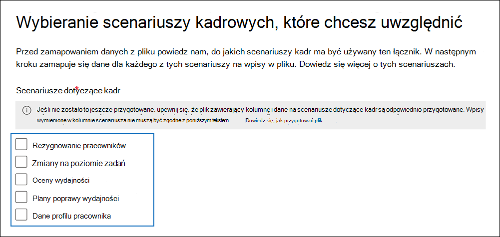
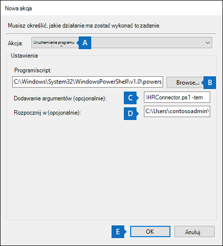

# <a name="set-up-a-connector-to-import-hr-data"></a>Konfigurowanie łącznika w celu importowania danych kadr

[!include[Purview banner](../includes/purview-rebrand-banner.md)]

Łącznik danych można skonfigurować w portalu zgodności usługi Microsoft Purview, aby zaimportować dane dotyczące zasobów ludzkich związane ze zdarzeniami, takimi jak rezygnacja użytkownika lub zmiana poziomu zadania użytkownika. Dane kadrowe mogą być następnie używane przez [rozwiązanie do zarządzania ryzykiem wewnętrznym](insider-risk-management.md) w celu generowania wskaźników ryzyka, które mogą ułatwić tożsamość możliwej złośliwej aktywności lub kradzieży danych przez użytkowników w organizacji.

Konfigurowanie łącznika dla danych kadr, których mogą używać zasady zarządzania ryzykiem wewnętrznym do generowania wskaźników ryzyka, polega na utworzeniu pliku CSV zawierającego dane hr, utworzeniu aplikacji w Azure Active Directory, która jest używana do uwierzytelniania, utworzeniu łącznika danych kadr w portalu zgodności, a następnie uruchomieniu skryptu (zgodnie z harmonogramem), który pozyskuje dane kadr w plikach CSV do chmury firmy Microsoft, aby były dostępne  rozwiązania do zarządzania ryzykiem wewnętrznym.

> [!IMPORTANT]
> Nowa wersja łącznika hr jest teraz dostępna w publicznej wersji zapoznawczej. Aby utworzyć nowy łącznik hr lub zaimportować dane dla [nowego scenariusza profilu pracownika](#csv-file-for-employee-profile-data-preview) dla scenariusza zasad opieki zdrowotnej na potrzeby zarządzania ryzykiem wewnętrznym, przejdź do strony **Łączniki danych** w portalu zgodności, wybierz kartę **Łączniki** , a następnie kliknij **pozycję Dodaj łącznik > HR (wersja zapoznawcza),** aby rozpocząć konfigurowanie. Istniejące łączniki hr będą nadal działać bez żadnych zakłóceń.

## <a name="before-you-begin"></a>Przed rozpoczęciem

- Określanie scenariuszy kadr i danych do zaimportowania do Microsoft 365. Pomoże to określić, ile plików CSV i łączników HR należy utworzyć, oraz jak generować i tworzyć strukturę plików CSV. Importowane dane kadr są określane przez zasady zarządzania ryzykiem wewnętrznym, które chcesz zaimplementować. Aby uzyskać więcej informacji, zobacz Krok 1.

- Określ sposób pobierania lub eksportowania danych z systemu kadr organizacji (i regularnie) i dodaj je do plików CSV utworzonych w kroku 1. Skrypt uruchamiany w kroku 4 przekaże dane hr w plikach CSV do chmury firmy Microsoft.

- Użytkownik, który tworzy łącznik hr w kroku 3, musi mieć przypisaną rolę administratora łącznika danych. Ta rola jest wymagana do dodawania łączników na stronie **Łączniki danych** w portalu zgodności. Ta rola jest domyślnie dodawana do wielu grup ról. Aby uzyskać listę tych grup ról, zobacz sekcję "Role w centrach zabezpieczeń i zgodności" w obszarze [Uprawnienia w Centrum zgodności & zabezpieczeń](../security/office-365-security/permissions-in-the-security-and-compliance-center.md#roles-in-the-security--compliance-center). Alternatywnie administrator w organizacji może utworzyć niestandardową grupę ról, przypisać rolę administratora łącznika danych, a następnie dodać odpowiednich użytkowników jako członków. Aby uzyskać instrukcje, zobacz sekcję "Tworzenie niestandardowej grupy ról" w obszarze [Uprawnienia w portalu zgodności usługi Microsoft Purview](microsoft-365-compliance-center-permissions.md#create-a-custom-role-group).

- Przykładowy skrypt uruchomiony w kroku 4 przekaże dane kadr do chmury firmy Microsoft, aby można było ich używać w rozwiązaniu do zarządzania ryzykiem wewnętrznym. Ten przykładowy skrypt nie jest obsługiwany w ramach żadnego standardowego programu pomocy technicznej firmy Microsoft ani usługi. Przykładowy skrypt jest dostarczany jako is bez gwarancji jakiegokolwiek rodzaju. Firma Microsoft dodatkowo zrzeka się wszelkich dorozumianych gwarancji, w tym, bez ograniczeń, wszelkich domniemanych gwarancji przydatności handlowej lub przydatności do określonego celu. Całe ryzyko wynikające z użycia lub wydajności przykładowego skryptu i dokumentacji pozostaje z Tobą. W żadnym wypadku firma Microsoft, jej autorzy lub ktokolwiek inny zaangażowany w tworzenie, produkcję lub dostarczanie skryptów nie ponosi odpowiedzialności za jakiekolwiek szkody (w tym, bez ograniczeń, szkody za utratę zysków z działalności gospodarczej, przerwę w działalności, utratę informacji biznesowych lub inną stratę pieniężną) wynikające z korzystania z przykładowych skryptów lub dokumentacji lub niemożności korzystania z nich,  nawet jeśli firma Microsoft została poinformowana o możliwości wystąpienia takich szkód.

- Ten łącznik jest dostępny w środowiskach GCC w chmurze Microsoft 365 US Government. Aplikacje i usługi innych firm mogą obejmować przechowywanie, przesyłanie i przetwarzanie danych klientów organizacji w systemach innych firm, które znajdują się poza infrastrukturą Microsoft 365 i dlatego nie są objęte zobowiązaniami dotyczącymi usługi Microsoft Purview i ochrony danych. Firma Microsoft nie przedstawia żadnej reprezentacji, że użycie tego produktu do łączenia się z aplikacjami innych firm oznacza, że te aplikacje innych firm są zgodne z fedrampem. Aby uzyskać instrukcje krok po kroku dotyczące konfigurowania łącznika hr w środowisku GCC, zobacz [Konfigurowanie łącznika w celu importowania danych kadr w us government](import-hr-data-US-government.md).

## <a name="step-1-prepare-a-csv-file-with-your-hr-data"></a>Krok 1. Przygotowywanie pliku CSV z danymi hr

Pierwszym krokiem jest utworzenie pliku CSV zawierającego dane hr, które łącznik zaimportuje do Microsoft 365. Te dane zostaną wykorzystane przez rozwiązanie ryzyka wewnętrznego do generowania potencjalnych wskaźników ryzyka. Dane dla następujących scenariuszy kadr można zaimportować do Microsoft 365:

- Rezygnacja pracownika. Informacje o pracownikach, którzy opuścili organizację.

- Zmienia się poziom zadania. Informacje o zmianach poziomu zadań dla pracowników, takich jak promocje i degradacje.

- Przeglądy wydajności. Informacje o wydajności pracowników.

- Plany poprawy wydajności. Informacje o planach poprawy wydajności dla pracowników.

- Profil pracownika (wersja zapoznawcza). Ogólne informacje o pracowniku.

Typ danych kadr do zaimportowania zależy od zasad zarządzania ryzykiem wewnętrznym i odpowiedniego szablonu zasad, który chcesz zaimplementować. W poniższej tabeli przedstawiono, który typ danych kadr jest wymagany dla każdego szablonu zasad:

|  Szablon zasad |  Typ danych hr |
|:------------------------------|:--------------------------------|
| Kradzież danych przez odchodzących użytkowników | Rezygnacje pracowników|
| Ogólne przecieki danych                             | Nie dotyczy|
| Wycieki danych według użytkowników o priorytecie                   | Nie dotyczy |
| Wycieki danych przez niezadowolonych użytkowników                | Zmiany poziomu zadań, przeglądy wydajności, plany poprawy wydajności|
| Ogólne naruszenia zasad zabezpieczeń             | Nie dotyczy |
| Naruszenia zasad zabezpieczeń przez odchodzących użytkowników  | Rezygnacje pracowników|
| Naruszenia zasad zabezpieczeń przez użytkowników o priorytecie   | Nie dotyczy|
| Naruszenia zasad zabezpieczeń przez niezadowolonych użytkowników| Zmiany poziomu zadań, przeglądy wydajności, plany poprawy wydajności |
| Obraźliwy język w wiadomości e-mail                    | Nie dotyczy |
| Zasady opieki zdrowotnej| Profil pracownika |
|||

Aby uzyskać więcej informacji na temat szablonów zasad dotyczących zarządzania ryzykiem wewnętrznym, zobacz [Zasady zarządzania ryzykiem wewnętrznym](insider-risk-management-policies.md#policy-templates).

W przypadku każdego scenariusza kadr należy podać odpowiednie dane kadrowe w co najmniej jednym pliku CSV. W dalszej części tej sekcji omówiono liczbę plików CSV do użycia na potrzeby implementacji zarządzania ryzykiem wewnętrznym.

Po utworzeniu pliku CSV z wymaganymi danymi hr zapisz go na komputerze lokalnym, na który uruchamiany jest skrypt w kroku 4. Należy również zaimplementować strategię aktualizacji, aby upewnić się, że plik CSV zawsze zawiera najbardziej aktualne informacje, dzięki czemu niezależnie od tego, jak uruchamiasz skrypt, najbardziej aktualne dane kadr zostaną przekazane do chmury firmy Microsoft i dostępne dla rozwiązania do zarządzania ryzykiem wewnętrznym.

> [!IMPORTANT]
> Nazwy kolumn opisane w poniższych sekcjach nie są wymaganymi parametrami, ale tylko przykładami. W plikach CSV można użyć dowolnej nazwy kolumny. Jednak nazwy kolumn używane w pliku CSV *muszą* być mapowane na typ danych podczas tworzenia łącznika hr w kroku 3. Należy również pamiętać, że przykładowe pliki CSV w poniższych sekcjach są wyświetlane w widoku Notatnika. Znacznie łatwiej jest wyświetlać i edytować pliki CSV w Microsoft Excel.

W poniższych sekcjach opisano wymagane dane CSV dla każdego scenariusza kadr.

### <a name="csv-file-for-employee-resignation-data"></a>Plik CSV dla danych rezygnacji pracownika

Oto przykład pliku CSV dla danych rezygnacji pracownika.

```text
EmailAddress,ResignationDate,LastWorkingDate
sarad@contoso.com,2019-04-23T15:18:02.4675041+05:30,2019-04-29T15:18:02.4675041+05:30
pilarp@contoso.com,2019-04-24T09:15:49Z,2019-04-29T15:18:02.7117540
```

W poniższej tabeli opisano każdą kolumnę w pliku CSV dla danych rezygnacji pracownika.

|  Kolumna   |   Opis |
|:------------|:----------------|
|**Emailaddress**| Określa adres e-mail (UPN) zakończonego użytkownika.|
| **RezygnacjaDate** | Określa datę oficjalnego zakończenia zatrudnienia użytkownika w organizacji. Na przykład może to być data, kiedy użytkownik powiadomił o opuszczeniu organizacji. Ta data może być inna niż data ostatniego dnia pracy danej osoby. Użyj następującego formatu daty: `yyyy-mm-ddThh:mm:ss.nnnnnn+|-hh:mm`, który jest [formatem daty i godziny ISO 8601](https://www.iso.org/iso-8601-date-and-time-format.html).|
| **LastWorkingDate** | Określa ostatni dzień pracy dla zakończonego użytkownika. Użyj następującego formatu daty: `yyyy-mm-ddThh:mm:ss.nnnnnn+|-hh:mm`, który jest [formatem daty i godziny ISO 8601](https://www.iso.org/iso-8601-date-and-time-format.html).|
|||

### <a name="csv-file-for-job-level-changes-data"></a>Plik CSV dla danych zmian na poziomie zadania

Oto przykład pliku CSV dla danych zmian na poziomie zadania.

```text
EmailAddress,EffectiveDate,OldLevel,NewLevel
sarad@contoso.com,2019-04-23T15:18:02.4675041+05:30,Level 61 - Sr. Manager,Level 60- Manager
pillar@contoso.com,2019-04-23T15:18:02.4675041+05:30,Level 62 - Director,Level 60- Sr. Manager
```

W poniższej tabeli opisano każdą kolumnę w pliku CSV dla danych zmian na poziomie zadania.

|  Kolumna | Opis |
|:--------- |:------------- |
| **Emailaddress**  | Określa adres e-mail użytkownika (UPN).|
| **EffectiveDate** | Określa datę oficjalnej zmiany poziomu zadania użytkownika. Użyj następującego formatu daty: `yyyy-mm-ddThh:mm:ss.nnnnnn+|-hh:mm`, który jest [formatem daty i godziny ISO 8601](https://www.iso.org/iso-8601-date-and-time-format.html).|
| **Uwagi**| Określa uwagi podane przez ewaluatora dotyczące zmiany poziomu zadania. Możesz wprowadzić limit 200 znaków. Ten parametr jest opcjonalny. Nie musisz dołączać go do pliku CSV.|
| **OldLevel**| Określa poziom zadania użytkownika przed jego zmianą. Jest to parametr wolnego tekstu i może zawierać hierarchiczną taksonomię dla organizacji. Ten parametr jest opcjonalny. Nie musisz dołączać go do pliku CSV.|
| **NewLevel**| Określa poziom zadania użytkownika po jego zmianie. Jest to parametr wolnego tekstu i może zawierać hierarchiczną taksonomię dla organizacji. Ten parametr jest opcjonalny. Nie musisz dołączać go do pliku CSV.|
|||

### <a name="csv-file-for-performance-review-data"></a>Plik CSV na potrzeby danych przeglądu wydajności

Oto przykład pliku CSV dla danych wydajności.

```text
EmailAddress,EffectiveDate,Remarks,Rating
sarad@contoso.com,2019-04-23T15:18:02.4675041+05:30,Met expectations but bad attitude,2-Below expectation
pillar@contoso.com,2019-04-23T15:18:02.4675041+05:30, Multiple conflicts with the team
```

W poniższej tabeli opisano każdą kolumnę w pliku CSV na potrzeby danych przeglądu wydajności.

|  Kolumna | Opis |
|:----------|:--------------|
| **Emailaddress**  | Określa adres e-mail użytkownika (UPN).|
| **EffectiveDate** | Określa datę oficjalnego poinformowania użytkownika o wyniku przeglądu wydajności. Może to być data zakończenia cyklu przeglądu wydajności. Użyj następującego formatu daty: `yyyy-mm-ddThh:mm:ss.nnnnnn+|-hh:mm`, który jest [formatem daty i godziny ISO 8601](https://www.iso.org/iso-8601-date-and-time-format.html).|
| **Uwagi**| Określa wszelkie uwagi, które ewaluator przekazał użytkownikowi na potrzeby przeglądu wydajności. Jest to parametr tekstowy z limitem 200 znaków. Ten parametr jest opcjonalny. Nie musisz dołączać go do pliku CSV.|
| **Oceną**| Określa klasyfikację podaną na potrzeby przeglądu wydajności. Jest to parametr tekstowy i może zawierać dowolny tekst w postaci dowolnej używany przez organizację do rozpoznawania oceny. Na przykład "3 Spełnione oczekiwania" lub "2 Poniżej średniej". Jest to parametr tekstowy z limitem 25 znaków. Ten parametr jest opcjonalny. Nie musisz dołączać go do pliku CSV.|
|||

### <a name="csv-file-for-performance-improvement-plan-data"></a>Plik CSV na potrzeby danych planu poprawy wydajności

Oto przykład pliku CSV dla danych dotyczących danych planu poprawy wydajności.

```text
EmailAddress,EffectiveDate,ImprovementRemarks,PerformanceRating
sarad@contoso.com,2019-04-23T15:18:02.4675041+05:30,Met expectation but bad attitude,2-Below expectation
pillar@contoso.com,2019-04-23T15:18:02.4675041+05:30, Multiple conflicts with the team
```

W poniższej tabeli opisano każdą kolumnę w pliku CSV na potrzeby danych przeglądu wydajności.

|  Kolumna |  Opis |
|:----------|:---------------|
| **Emailaddress**  | Określa adres e-mail użytkownika (UPN).|
| **EffectiveDate** | Określa datę oficjalnego poinformowania użytkownika o planie poprawy wydajności. Należy użyć następującego formatu daty: `yyyy-mm-ddThh:mm:ss.nnnnnn+|-hh:mm`, który jest [formatem daty i godziny ISO 8601](https://www.iso.org/iso-8601-date-and-time-format.html).|
| **Uwagi**| Określa wszelkie uwagi podane przez ewaluatora dotyczące planu poprawy wydajności. Jest to parametr tekstowy z limitem 200 znaków. Jest to parametr opcjonalny. Nie musisz dołączać go do pliku CSV. |
| **Oceną**| Określa klasyfikację lub inne informacje związane z przeglądem wydajności. Jest to parametr tekstowy i może zawierać dowolny tekst w postaci bezpłatnej używany przez organizację do rozpoznawania oceny. Na przykład "3 Spełnione oczekiwania" lub "2 Poniżej średniej". Jest to parametr tekstowy z limitem 25 znaków. Jest to parametr opcjonalny. Nie musisz dołączać go do pliku CSV.|
|||

### <a name="csv-file-for-employee-profile-data-preview"></a>Plik CSV dla danych profilu pracownika (wersja zapoznawcza)

> [!NOTE]
> Możliwość utworzenia łącznika hr dla danych profilu pracownika jest dostępna w publicznej wersji zapoznawczej. Aby utworzyć łącznik hr, który obsługuje dane profilu pracownika, przejdź do strony **Łączniki danych** w portalu zgodności, wybierz kartę **Łączniki**, a następnie kliknij **pozycję Dodaj łącznikHR** >  **(wersja zapoznawcza).** Wykonaj kroki, aby utworzyć łącznik w [kroku 3. Tworzenie łącznika hr](#step-3-create-the-hr-connector).

Oto przykład pliku CSV dla danych dla danych profilu pracownika.

```text
EmailAddress,UserName,EmployeeFirstName,EmployeeLastName,EmployeeAddLine1,EmployeeAddLine2,EmployeeCity,EmployeeState,EmployeeZipCode,EmployeeDept,EmployeeType,EmployeeRole
jackq@contoso.com,jackq,jack,qualtz,50 Oakland Ave,#206,City,Florida,32104,Orthopaedic,Regular,Nurse
```

W poniższej tabeli opisano każdą kolumnę w pliku CSV dla danych profilu pracownika.

|  Kolumna |  Opis |
|:----------|:---------------|
| Emailaddress<sup>*</sup>    | Główna nazwa użytkownika (UPN) lub adres e-mail pracownika.|
| EmployeeFirstName<sup>*</sup>   | Imię pracownika.|
| EmployeeLastName<sup>*</sup>   | Nazwisko pracownika.|
| EmployeeAddressLine1<sup>*</sup>    | Adres ulicy pracownika.|
| EmployeeAddressLine2   | Informacje o adresie pomocniczym, takie jak numer mieszkania, dla pracownika.|
| EmployeeCity | Miasto zamieszkania pracownika.|
| EmployeeState | Stan miejsca zamieszkania pracownika.|
| EmployeeZipCode<sup>*</sup>  | Kod pocztowy miejsca zamieszkania pracownika. |
| EmployeeCountry| Kraj zamieszkania pracownika.|
| EmployeeDepartment | Dział pracowników w organizacji.|
| Employeetype |Typ zatrudnienia dla pracownika, taki jak Zwykły, Zwolniony lub Wykonawca.|
| EmployeeRole |Rola, wyznaczenie lub stanowisko pracowników w organizacji.|
|||

> [!NOTE]
> <sup>*</sup> Ta kolumna jest obowiązkowa. Jeśli brakuje obowiązkowej kolumny, plik CSV nie zostanie zweryfikowany, a inne dane w pliku nie zostaną zaimportowane.

Zalecamy utworzenie łącznika hr, który importuje tylko dane profilu pracownika. W przypadku tego łącznika należy często odświeżać dane profilu pracownika, najlepiej co 15–20 dni. Rekordy profilów pracowników zostaną usunięte, jeśli nie zostaną zaktualizowane w ciągu ostatnich 30 dni.

### <a name="determining-how-many-csv-files-to-use-for-hr-data"></a>Określanie liczby plików CSV do użycia dla danych kadr

W kroku 3 możesz utworzyć oddzielne łączniki dla każdego typu danych HR lub utworzyć pojedynczy łącznik dla wszystkich typów danych. Można użyć oddzielnych plików CSV zawierających dane dla jednego scenariusza hr (jak przykłady plików CSV opisanych w poprzednich sekcjach). Alternatywnie można użyć pojedynczego pliku CSV zawierającego dane dla co najmniej dwóch scenariuszy kadr. Poniżej przedstawiono kilka wskazówek, które pomogą Ci określić, ile plików CSV ma być używanych dla danych kadr.

- Jeśli zasady zarządzania ryzykiem wewnętrznym, które chcesz zaimplementować, wymagają wielu typów danych kadr, rozważ użycie pojedynczego pliku CSV zawierającego wszystkie wymagane typy danych.

- Metoda generowania lub zbierania danych hr może określić liczbę plików CSV. Jeśli na przykład różne typy danych kadr używanych do konfigurowania łącznika hr znajdują się w jednym systemie kadr w organizacji, możesz wyeksportować dane do pojedynczego pliku CSV. Jeśli jednak dane są dystrybuowane w różnych systemach KADR, może być łatwiej eksportować dane do różnych plików CSV. Na przykład dane rezygnacji pracownika mogą znajdować się w innym systemie kadrowym niż dane dotyczące poziomu zadania lub przeglądu wydajności. W takim przypadku może być łatwiej mieć oddzielne pliki CSV, zamiast ręcznie łączyć dane w pojedynczy plik CSV. Dlatego sposób pobierania lub eksportowania danych z systemów KADR może określić, jaka będzie liczba potrzebnych plików CSV.

- Ogólnie rzecz biorąc, liczba łączników HR, które należy utworzyć, zależy od typów danych w pliku CSV. Jeśli na przykład plik CSV zawiera wszystkie typy danych wymagane do obsługi implementacji zarządzania ryzykiem wewnętrznym, potrzebujesz tylko jednego łącznika HR. Jeśli jednak masz dwa oddzielne pliki CSV, z których każdy zawiera jeden typ danych, musisz utworzyć dwa łączniki HR. Wyjątkiem jest to, że jeśli dodasz kolumnę **HRScenario** do pliku CSV (zobacz następną sekcję), możesz skonfigurować pojedynczy łącznik HR, który może przetwarzać różne pliki CSV.

### <a name="configuring-a-single-csv-file-for-multiple-hr-data-types"></a>Konfigurowanie pojedynczego pliku CSV dla wielu typów danych hr

Do pojedynczego pliku CSV można dodać wiele typów danych HR. Jest to przydatne, jeśli wdrażane rozwiązanie do zarządzania ryzykiem wewnętrznym wymaga wielu typów danych KADR lub jeśli typy danych znajdują się w jednym systemie kadr w organizacji. Posiadanie mniejszej liczby plików CSV zawsze umożliwia tworzenie i zarządzanie mniejszą liczbą łączników HR.

Poniżej przedstawiono wymagania dotyczące konfigurowania pliku CSV z wieloma typami danych:

- Musisz dodać wymagane kolumny (i opcjonalnie, jeśli ich używasz) dla każdego typu danych i odpowiednią nazwę kolumny w wierszu nagłówka. Jeśli typ danych nie odpowiada kolumnie, możesz pozostawić wartość pustą.

- Aby użyć pliku CSV z wieloma typami danych kadr, łącznik HR musi wiedzieć, które wiersze w pliku CSV zawierają dane hr. Można to osiągnąć, dodając dodatkową kolumnę **HRScenario** do pliku CSV. Wartości w tej kolumnie identyfikują typ danych hr w każdym wierszu. Na przykład wartości odpowiadające czterem scenariuszom kadr mogą być \`takie jak Rezygnacja\`, \`Zmiana\` poziomu zadania, \`Przegląd\` wydajności, \`Plan\` poprawy wydajności i \`Profil\` pracownika.

- Jeśli masz wiele plików CSV zawierających kolumnę HRScenario**, upewnij się, że każdy plik używa tej samej nazwy kolumny i tych samych wartości, które identyfikują określone scenariusze kadr.

W poniższym przykładzie przedstawiono plik CSV zawierający kolumnę **HRScenario** . Wartości w kolumnie HRScenario identyfikują typ danych w odpowiednim wierszu.

```text
HRScenario,EmailAddress,ResignationDate,LastWorkingDate,EffectiveDate,Remarks,Rating,OldLevel,NewLevel
Resignation,sarad@contoso.com,2019-04-23T15:18:02.4675041+05:30,2019-04-29T15:18:02.4675041+05:30,,,,
Resignation,pilarp@contoso.com,2019-04-24T09:15:49Z,2019-04-29T15:18:02.7117540,,,,
Job level change,sarad@contoso.com,2019-04-23T15:18:02.4675041+05:30,,,,,Level 61 Sr. Manager, Level 60 Manager
Job level change,pillarp@contoso.com,2019-04-23T15:18:02.4675041+05:30,,,,,Level 62 Director,Level 60 Sr Manager
Performance review,sarad@contoso.com,,,2019-04-23T15:18:02.4675041+05:30,Met expectation but bad attitude,2 Below expectations,,
Performance review,pillarp@contoso.com,,,2019-04-23T15:18:02.4675041+05:30, Multiple conflicts with the team,,
Performance improvement plan,sarad@contoso.com,,,2019-04-23T15:18:02.4675041+05:30,Met expectations but bad attitude,2 Below expectations,,
Performance improvement plan,pillarp@contoso.com,,,2019-04-23T15:18:02.4675041+05:30,Multiple conflicts with the team,,
```

> [!NOTE]
> Możesz użyć dowolnej nazwy kolumny identyfikującej typ danych HR, ponieważ będziesz mapować nazwę kolumny w pliku CSV jako kolumnę identyfikującą typ danych HR podczas konfigurowania łącznika w kroku 3. Podczas konfigurowania łącznika zamapujesz również wartości używane dla kolumny typu danych.

### <a name="adding-the-hrscenario-column-to-a-csv-file-that-contains-a-single-data-type"></a>Dodawanie kolumny HRScenario do pliku CSV zawierającego pojedynczy typ danych

Na podstawie systemów kadr organizacji i sposobu eksportowania danych kadr do pliku CSV może być konieczne utworzenie wielu plików CSV zawierających jeden typ danych HR. W takim przypadku nadal można utworzyć jeden łącznik hr do importowania danych z różnych plików CSV. W tym celu wystarczy dodać kolumnę HRScenario do pliku CSV i określić typ danych hr. Następnie można uruchomić skrypt dla każdego pliku CSV, ale użyć tego samego identyfikatora zadania dla łącznika. Zobacz [Krok 4](#step-4-run-the-sample-script-to-upload-your-hr-data).

## <a name="step-2-create-an-app-in-azure-active-directory"></a>Krok 2. Tworzenie aplikacji w Azure Active Directory

Następnym krokiem jest utworzenie i zarejestrowanie nowej aplikacji w usłudze Azure Active Directory (Azure AD). Aplikacja będzie odpowiadać łącznikowi HR utworzonemu w kroku 3. Utworzenie tej aplikacji umożliwi usłudze Azure AD uwierzytelnienie łącznika hr po uruchomieniu i próbie uzyskania dostępu do organizacji. Ta aplikacja będzie również używana do uwierzytelniania skryptu uruchamianego w kroku 4 w celu przekazania danych kadr do chmury firmy Microsoft. Podczas tworzenia tej aplikacji usługi Azure AD zapisz następujące informacje. Te wartości będą używane w krokach 3 i 4.

- Identyfikator aplikacji usługi Azure AD (nazywany również *identyfikatorem aplikacji* lub *identyfikatorem klienta*)

- Wpis tajny aplikacji usługi Azure AD (nazywany również *kluczem tajnym klienta*)

- Identyfikator dzierżawy (nazywany również *identyfikatorem katalogu*)

Aby uzyskać instrukcje krok po kroku dotyczące tworzenia aplikacji w usłudze Azure AD, zobacz [Rejestrowanie aplikacji przy użyciu Platforma tożsamości Microsoft](/azure/active-directory/develop/quickstart-register-app).

## <a name="step-3-create-the-hr-connector"></a>Krok 3. Tworzenie łącznika hr

Następnym krokiem jest utworzenie łącznika hr w portalu zgodności. Po uruchomieniu skryptu w kroku 4 utworzony łącznik hr pozyskuje dane kadr z pliku CSV do organizacji Microsoft 365. Przed utworzeniem łącznika upewnij się, że masz listę scenariuszy kadr i odpowiednie nazwy kolumn CSV dla każdego z nich. Podczas konfigurowania łącznika należy mapować dane wymagane dla każdego scenariusza na rzeczywiste nazwy kolumn w pliku CSV. Alternatywnie możesz przekazać przykładowy plik CSV podczas konfigurowania łącznika, a kreator pomoże zamapować nazwę kolumn na wymagane typy danych.

Po wykonaniu tego kroku skopiuj identyfikator zadania wygenerowany podczas tworzenia łącznika. Identyfikator zadania będzie używany podczas uruchamiania skryptu.

1. Przejdź do portalu zgodności i wybierz pozycję <a href="https://go.microsoft.com/fwlink/p/?linkid=2173865" target="_blank">**Łączniki danych**</a>.

2. Na stronie **Łączniki danych** kliknij pozycję **HR (wersja zapoznawcza)**.

3. Na stronie **HR (wersja zapoznawcza)** kliknij pozycję **Dodaj łącznik**.

4. Na stronie **Konfigurowanie połączenia** wykonaj następujące czynności, a następnie kliknij przycisk **Dalej**:

   1. Wpisz lub wklej identyfikator aplikacji usługi Azure AD dla aplikacji platformy Azure utworzonej w kroku 2.

   2. Wpisz nazwę łącznika HR.

5. Na stronie Scenariusze kadr wybierz co najmniej jeden scenariusz kadr, dla których chcesz zaimportować dane, a następnie kliknij przycisk **Dalej**.

   

6. Na stronie metody mapowania plików wybierz typ pliku, jeśli to konieczne, a następnie wybierz jedną z następujących opcji, a następnie kliknij przycisk **Dalej**.

   - **Upload przykładowego pliku**. Jeśli wybierzesz tę opcję, kliknij **pozycję Upload przykładowego pliku**, aby przekazać plik CSV przygotowany w kroku 1. Ta opcja umożliwia szybkie wybieranie nazw kolumn w pliku CSV z listy rozwijanej w celu zamapowania ich na typy danych dla wcześniej wybranych scenariuszy kadr.

   LUB

   - **Ręcznie podaj szczegóły mapowania**. Jeśli wybierzesz tę opcję, musisz wpisać nazwę kolumn w pliku CSV, aby zamapować je na typy danych dla wcześniej wybranych scenariuszy kadr.

7. Na stronie Szczegóły mapowania plików wykonaj jedną z następujących czynności w zależności od tego, czy przekazano przykładowy plik CSV i czy konfigurujesz łącznik dla pojedynczego scenariusza hr, czy dla wielu scenariuszy. Jeśli przekazano przykładowy plik, nie trzeba wpisywać nazw kolumn. Wybierasz je z listy rozwijanej.

    - Jeśli w poprzednim kroku wybrano pojedynczy scenariusz hr, wpisz nazwy nagłówków kolumn (nazywane również *parametrami*) z pliku CSV utworzonego w kroku 1 w każdym z odpowiednich pól. Wpisane nazwy kolumn nie uwzględniają wielkości liter, ale pamiętaj o uwzględnieniu spacji, jeśli nazwy kolumn w pliku CSV zawierają spacje. Jak wyjaśniono wcześniej, nazwy wpisane w tych polach muszą być zgodne z nazwami parametrów w pliku CSV. Na przykład poniższy zrzut ekranu przedstawia nazwy parametrów z przykładowego pliku CSV dla scenariusza hr rezygnacji pracownika przedstawionego w kroku 1.

    - Jeśli w powyższym kroku wybrano wiele typów danych, musisz wprowadzić nazwę kolumny identyfikatora, która zidentyfikuje typ danych HR w pliku CSV. Po wprowadzeniu nazwy kolumny identyfikatora wpisz wartość identyfikującą ten typ danych HR i wpisz nazwy nagłówków kolumn dla wybranych typów danych z plików CSV utworzonych w kroku 1 w każdym z odpowiednich pól dla każdego wybranego typu danych. Jak wyjaśniono wcześniej, nazwy wpisane w tych polach muszą być zgodne z nazwami kolumn w pliku CSV.

8. Na stronie **Przegląd** przejrzyj ustawienia, a następnie kliknij przycisk **Zakończ** , aby utworzyć łącznik.

   Zostanie wyświetlona strona stanu, która potwierdza, że łącznik został utworzony. Ta strona zawiera dwie ważne rzeczy, które należy wykonać w następnym kroku, aby uruchomić przykładowy skrypt w celu przekazania danych kadr.

   

   1. **Identyfikator zadania.** Ten identyfikator zadania będzie potrzebny do uruchomienia skryptu w następnym kroku. Możesz skopiować go z tej strony lub ze strony wysuwanej łącznika.

   2. **Łącze do przykładowego skryptu.** Kliknij **link tutaj**, aby przejść do witryny GitHub, aby uzyskać dostęp do przykładowego skryptu (link otwiera nowe okno). Pozostaw to okno otwarte, aby można było skopiować skrypt w kroku 4. Alternatywnie możesz dodać zakładkę do miejsca docelowego lub skopiować adres URL, aby uzyskać do niego dostęp ponownie po uruchomieniu skryptu. Ten link jest również dostępny na stronie wysuwanego łącznika.

9. Kliknij pozycję **Gotowe**.

   Nowy łącznik jest wyświetlany na liście na **karcie Łączniki** .

10. Kliknij właśnie utworzony łącznik HR, aby wyświetlić stronę wysuwaną zawierającą właściwości i inne informacje o łączniku.

   

Jeśli jeszcze tego nie zrobiono, możesz skopiować wartości identyfikatora **aplikacja systemu Azure** i **identyfikatora zadania łącznika**. Będą one potrzebne do uruchomienia skryptu w następnym kroku. Możesz również pobrać skrypt ze strony wysuwanej (lub pobrać go przy użyciu linku w następnym kroku).

Możesz również kliknąć pozycję **Edytuj**, aby zmienić identyfikator aplikacja systemu Azure lub nazwy nagłówków kolumn zdefiniowane na stronie **Mapowanie pliku**.

## <a name="step-4-run-the-sample-script-to-upload-your-hr-data"></a>Krok 4. Uruchamianie przykładowego skryptu w celu przekazania danych kadr

Ostatnim krokiem konfigurowania łącznika hr jest uruchomienie przykładowego skryptu, który przekaże dane kadr w pliku CSV (utworzonym w kroku 1) do chmury firmy Microsoft. W szczególności skrypt przekazuje dane do łącznika hr. Po uruchomieniu skryptu łącznik hr utworzony w kroku 3 importuje dane kadrowe do organizacji Microsoft 365, do której mogą uzyskiwać dostęp inne narzędzia zgodności, takie jak rozwiązanie do zarządzania ryzykiem niejawnych testerów. Po uruchomieniu skryptu rozważ zaplanowanie zadania, aby uruchamiać je automatycznie codziennie, aby najbardziej aktualne dane dotyczące kończania pracy pracowników były przekazywane do chmury firmy Microsoft. Zobacz [Planowanie automatycznego uruchamiania skryptu](#optional-step-6-schedule-the-script-to-run-automatically).

1. Przejdź do okna, które zostało otwarte w poprzednim kroku, aby uzyskać dostęp do witryny GitHub przy użyciu przykładowego skryptu. Możesz też otworzyć witrynę z zakładki lub użyć skopiowanego adresu URL. Możesz również uzyskać dostęp do skryptu [tutaj](https://github.com/microsoft/m365-compliance-connector-sample-scripts/blob/main/sample_script.ps1).

2. Kliknij przycisk **Nieprzetworzone** , aby wyświetlić skrypt w widoku tekstowym.

3. Skopiuj wszystkie wiersze w przykładowym skryptycie, a następnie zapisz je w pliku tekstowym.

4. W razie potrzeby zmodyfikuj przykładowy skrypt dla organizacji.

5. Zapisz plik tekstowy jako plik skryptu Windows PowerShell przy użyciu sufiksu nazwy `.ps1`pliku , na przykład `HRConnector.ps1`. Alternatywnie możesz użyć nazwy pliku GitHub dla skryptu, czyli `upload_termination_records.ps1`.

6. Otwórz wiersz polecenia na komputerze lokalnym i przejdź do katalogu, w którym zapisano skrypt.

7. Uruchom następujące polecenie, aby przekazać dane hr w pliku CSV do chmury firmy Microsoft; na przykład:

    ```powershell
    .\HRConnector.ps1 -tenantId <tenantId> -appId <appId>  -appSecret <appSecret>  -jobId <jobId>  -filePath '<filePath>'
    ```

   W poniższej tabeli opisano parametry do użycia z tym skryptem i ich wymagane wartości. Informacje uzyskane w poprzednich krokach są używane w wartościach tych parametrów.

   | Parametr | Opis |
   |:-----|:-----|:-----|
   |`tenantId`|Jest to identyfikator organizacji Microsoft 365 uzyskany w kroku 2. Identyfikator dzierżawy organizacji można również uzyskać w bloku **Przegląd** w centrum administracyjnym usługi Azure AD. Służy to do identyfikowania organizacji.|
   |`appId` |Jest to identyfikator aplikacji usługi Azure AD dla aplikacji utworzonej w usłudze Azure AD w kroku 2. Jest ona używana przez usługę Azure AD do uwierzytelniania, gdy skrypt próbuje uzyskać dostęp do organizacji Microsoft 365. | 
   |`appSecret`|Jest to wpis tajny aplikacji usługi Azure AD dla aplikacji utworzonej w usłudze Azure AD w kroku 2. Jest to również używane do uwierzytelniania.|
   |`jobId`|Jest to identyfikator zadania dla łącznika hr utworzonego w kroku 3. Służy to do kojarzenia danych kadr przekazywanych do chmury firmy Microsoft z łącznikiem HR.|
   |`filePath`|Jest to ścieżka pliku (przechowywana w tym samym systemie co skrypt) utworzona w kroku 1. Staraj się unikać spacji w ścieżce pliku; W przeciwnym razie użyj pojedynczych cudzysłowów.|
   |||

   Oto przykład składni skryptu łącznika hr przy użyciu rzeczywistych wartości dla każdego parametru:

   ```powershell
    .\HRConnector.ps1 -tenantId d5723623-11cf-4e2e-b5a5-01d1506273g9 -appId 29ee526e-f9a7-4e98-a682-67f41bfd643e -appSecret MNubVGbcQDkGCnn -jobId b8be4a7d-e338-43eb-a69e-c513cd458eba -filePath 'C:\Users\contosoadmin\Desktop\Data\employee_termination_data.csv'
    ```

   Jeśli przekazywanie zakończy się pomyślnie, skrypt wyświetli **komunikat Upload Pomyślne**.

   > [!NOTE]
   > Jeśli masz problemy z uruchomieniem poprzedniego polecenia z powodu zasad wykonywania, zobacz [Informacje o zasadach wykonywania](/powershell/module/microsoft.powershell.core/about/about_execution_policies) i [Set-ExecutionPolicy](/powershell/module/microsoft.powershell.security/set-executionpolicy) , aby uzyskać wskazówki dotyczące ustawiania zasad wykonywania.

## <a name="step-5-monitor-the-hr-connector"></a>Krok 5. Monitorowanie łącznika hr

Po utworzeniu łącznika hr i uruchomieniu skryptu w celu przekazania danych kadr można wyświetlić łącznik i przekazać stan w portalu zgodności. Jeśli planujesz regularne uruchamianie skryptu automatycznie, możesz również wyświetlić bieżący stan po ostatnim uruchomieniu skryptu.

1. Przejdź do portalu zgodności i wybierz pozycję <a href="https://go.microsoft.com/fwlink/p/?linkid=2173865" target="_blank">**Łączniki danych**</a>.

2. Kliknij kartę **Łączniki** , a następnie wybierz łącznik HR, aby wyświetlić stronę wysuwaną. Ta strona zawiera właściwości i informacje o łączniku.

   

3. W obszarze **Postęp** kliknij link **Pobierz dziennik** , aby otworzyć (lub zapisać) dziennik stanu łącznika. Ten dziennik zawiera informacje o każdym uruchomieniu skryptu i przekazaniu danych z pliku CSV do chmury firmy Microsoft. 

   

   Pole `RecordsSaved` wskazuje liczbę wierszy w przekazanym pliku CSV. Jeśli na przykład plik CSV zawiera cztery wiersze, wartość `RecordsSaved` pól wynosi 4, jeśli skrypt pomyślnie przekazał wszystkie wiersze w pliku CSV.

Jeśli skrypt nie został uruchomiony w kroku 4, w obszarze **Ostatni import** zostanie wyświetlony link umożliwiający pobranie skryptu. Możesz pobrać skrypt, a następnie wykonać kroki, aby uruchomić skrypt.

## <a name="optional-step-6-schedule-the-script-to-run-automatically"></a>(Opcjonalnie) Krok 6. Planowanie automatycznego uruchamiania skryptu

Aby upewnić się, że najnowsze dane kadrowe organizacji są dostępne dla narzędzi takich jak rozwiązanie do zarządzania ryzykiem wewnętrznym, zalecamy zaplanowanie automatycznego uruchamiania skryptu cyklicznie, na przykład raz dziennie. Wymaga to również zaktualizowania danych kadr w pliku CSV zgodnie z podobnym (jeśli nie tym samym) harmonogramem, tak aby zawierała najnowsze informacje o pracownikach, którzy opuszczają organizację. Celem jest przekazanie najbardziej aktualnych danych kadrowych, aby łącznik HR mógł udostępnić je rozwiązaniu do zarządzania ryzykiem wewnętrznym.

Możesz użyć aplikacji Harmonogram zadań w Windows, aby codziennie automatycznie uruchamiać skrypt.

1. Na komputerze lokalnym kliknij przycisk **Windows Start**, a następnie wpisz **Harmonogram zadań**.

2. Kliknij aplikację **Harmonogram zadań** , aby ją otworzyć.

3. W sekcji **Akcje** kliknij pozycję **Utwórz zadanie**.

4. Na karcie **Ogólne** wpisz opisową nazwę zaplanowanego zadania; Na przykład **skrypt łącznika hr**. Możesz również dodać opcjonalny opis.

5. W obszarze **Opcje zabezpieczeń** wykonaj następujące czynności:

   1. Określ, czy skrypt ma być uruchamiany tylko wtedy, gdy użytkownik jest zalogowany na komputerze, czy uruchamiany po zalogowaniu.

   1. Upewnij się, że zaznaczono pole wyboru **Uruchom z najwyższymi uprawnieniami** .

6. Wybierz kartę **Wyzwalacze** , kliknij pozycję **Nowy**, a następnie wykonaj następujące czynności:

   1. W **obszarze Ustawienia** wybierz opcję **Codziennie**, a następnie wybierz datę i godzinę, aby uruchomić skrypt po raz pierwszy. Skrypt będzie uruchamiany codziennie o tej samej określonej godzinie.

   1. W obszarze **Ustawienia zaawansowane** upewnij się, że **zaznaczono** pole wyboru Włączone.

   1. Kliknij przycisk **OK**.

7. Wybierz kartę **Akcje** , kliknij pozycję **Nowy**, a następnie wykonaj następujące czynności:

   

   1. Na liście rozwijanej **Akcja** upewnij się, że **wybrano pozycję Uruchom program** .

   1. W polu **Program/skrypt** kliknij pozycję **Przeglądaj**, a następnie przejdź do następującej lokalizacji i wybierz ją, aby ścieżka była wyświetlana w polu : `C:\Windows\System32\WindowsPowerShell\v1.0\powershell.exe`.

   1. W polu **Dodawanie argumentów (opcjonalnie)** wklej to samo polecenie skryptu, które zostało uruchomione w kroku 4. Na przykład `.\HRConnector.ps1 -tenantId "d5723623-11cf-4e2e-b5a5-01d1506273g9" -appId "c12823b7-b55a-4989-faba-02de41bb97c3" -appSecret "MNubVGbcQDkGCnn"  -jobId "e081f4f4-3831-48d6-7bb3-fcfab1581458" -filePath "C:\Users\contosoadmin\Desktop\Data\employee_termination_data.csv"`

   1. W polu **Start in (opcjonalnie) wklej** lokalizację folderu skryptu uruchomionego w kroku 4. Na przykład `C:\Users\contosoadmin\Desktop\Scripts`.

   1. Kliknij **przycisk OK** , aby zapisać ustawienia nowej akcji.

8. W oknie **Tworzenie zadania** kliknij przycisk **OK** , aby zapisać zaplanowane zadanie. Może zostać wyświetlony monit o wprowadzenie poświadczeń konta użytkownika.

   Nowe zadanie zostanie wyświetlone w bibliotece harmonogramu zadań.

   

   Zostanie wyświetlony czas ostatniego uruchomienia skryptu i następnego zaplanowanego uruchomienia. Możesz kliknąć dwukrotnie zadanie, aby je edytować.

   Możesz również sprawdzić czas ostatniego uruchomienia skryptu na stronie wysuwanej odpowiedniego łącznika hr w centrum zgodności.

## <a name="existing-hr-connectors"></a>Istniejące łączniki hr

13 grudnia 2021 r. opublikowaliśmy scenariusz danych profilu pracownika dla łączników HR. Jeśli łącznik hr został utworzony przed tą datą, przeprowadzimy migrację istniejących wystąpień lub łączników hr organizacji, aby dane kadr były nadal importowane do chmury firmy Microsoft. Nie musisz nic robić, aby zachować tę funkcjonalność. Możesz nadal korzystać z tych łączników bez zakłóceń.

Jeśli chcesz zaimplementować scenariusz danych profilu pracownika, utworzysz nowy łącznik hr i skonfigurujesz go zgodnie z wymaganiami. Po utworzeniu nowego łącznika HR uruchom skrypt przy użyciu identyfikatora zadania nowego łącznika i plików CSV z [danymi profilu pracownika](#csv-file-for-employee-profile-data-preview) opisanymi wcześniej w tym artykule.
