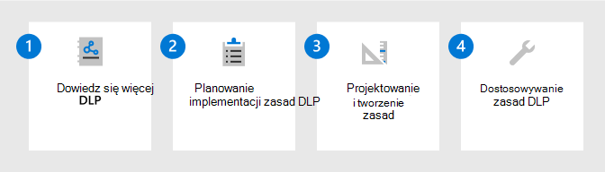

# Wdrażanie rozwiązania do ochrony informacji za pomocą Microsoft Purview

>*[Licencjonowanie na potrzeby zgodności & zabezpieczeń Microsoft 365](/office365/servicedescriptions/microsoft-365-service-descriptions/microsoft-365-tenantlevel-services-licensing-guidance/microsoft-365-security-compliance-licensing-guidance)*

[!include[Purview banner](../includes/purview-rebrand-banner.md)]

Strategia ochrony informacji zależy od potrzeb biznesowych. Wiele organizacji musi przestrzegać przepisów, przepisów i praktyk biznesowych. Ponadto organizacje muszą chronić zastrzeżone informacje, takie jak dane dla określonych projektów.

Microsoft Purview Information Protection (dawniej Microsoft Information Protection) zapewnia strukturę, proces i możliwości, których można użyć do realizacji określonych celów biznesowych. 

## struktura Microsoft Purview Information Protection

Użyj Microsoft Purview Information Protection, aby ułatwić odnajdywanie, klasyfikowanie, ochronę i zarządzanie poufnymi informacjami wszędzie tam, gdzie się znajdują lub podróżują.

Obejrzyj następującą sesję konferencji Ignite, aby zobaczyć, jak te możliwości obsługują się nawzajem i na nich bazują: [Poznaj swoje dane, chroń swoje dane i zapobiegaj utracie danych przy użyciu Microsoft Information Protection](https://myignite.microsoft.com/archives/IG20-OD273).

Aby uzyskać informacje na temat zarządzania danymi, zobacz [Wdrażanie rozwiązania do zarządzania danymi za pomocą Microsoft Purview](data-governance-solution.md).

## Licencjonowanie

Microsoft Purview Information Protection możliwości są dołączone do Microsoft Purview. Wymagania dotyczące licencjonowania mogą się różnić nawet w zależności od opcji konfiguracji. Aby zidentyfikować wymagania i opcje licencjonowania, zobacz [Microsoft 365 wskazówki dotyczące zgodności & zabezpieczeń](/office365/servicedescriptions/microsoft-365-service-descriptions/microsoft-365-tenantlevel-services-licensing-guidance/microsoft-365-security-compliance-licensing-guidance).

## Poznaj swoje dane

Wiedza o tym, gdzie znajdują się dane poufne, jest często największym wyzwaniem dla wielu organizacji. Microsoft Purview Information Protection klasyfikacja danych ułatwia odnajdywanie i dokładne klasyfikowanie stale rosnących ilości danych tworzonych przez organizację. Graficzne reprezentacje ułatwiają uzyskanie wglądu w te dane, dzięki czemu można skonfigurować i monitorować zasady w celu ich ochrony i zarządzania nimi.

|Krok|Opis|Więcej informacji|
|:---|:----------|:---------------|
|1| Opisz kategorie poufnych informacji, które chcesz chronić.    Masz już pojęcie o tym, jakie typy informacji są najbardziej wartościowe dla Organizacji, a jakie typy nie są. Współpracuj z osobami biorącymi udział w projekcie, aby opisać te kategorie, które są punktem wyjścia. | [Dowiedz się więcej o typach informacji poufnych](sensitive-information-type-learn-about.md) 
 [Dowiedz się więcej o klasyfikatorach z możliwością szkolenia](classifier-learn-about.md)|
|2| Odnajdywanie i klasyfikowanie poufnych danych.    Poufne dane w elementach można znaleźć przy użyciu wielu różnych metod, które obejmują domyślne zasady DLP, ręczne etykietowanie przez użytkowników i automatyczne rozpoznawanie wzorców przy użyciu typów informacji poufnych lub uczenia maszynowego. | [Dowiedz się więcej o klasyfikacji danych](data-classification-overview.md) 
 [Wideo: Klasyfikacja danych w centrum zgodności](https://www.microsoft.com/videoplayer/embed/RE4vx8x)|
|3| Wyświetl poufne elementy.     Użyj Eksploratora zawartości i Eksploratora działań, aby dokładniej przeanalizować poufne elementy i akcje, które użytkownicy podejmują w tych elementach.| [Wprowadzenie do eksploratora zawartości](data-classification-content-explorer.md) 
 [Wprowadzenie do eksploratora aktywności](data-classification-activity-explorer.md)|

## Chroń swoje dane

Skorzystaj z informacji, które pozwalają dowiedzieć się, gdzie znajdują się dane poufne, aby ułatwić bardziej efektywną ochronę. Nie trzeba jednak czekać — możesz natychmiast zacząć chronić dane za pomocą kombinacji ręcznego, domyślnego i automatycznego etykietowania. Następnie użyj [Eksploratora zawartości](data-classification-content-explorer.md) i [eksploratora działań](data-classification-activity-explorer.md) z poprzedniej sekcji, aby potwierdzić, jakie elementy są oznaczone etykietami i jak są używane etykiety.

|Krok|Opis|Więcej informacji|
|:---|-----------|:---------------|
| 1|Zdefiniuj [etykiety poufności](sensitivity-labels.md) i zasady, które będą chronić dane organizacji.   Oprócz identyfikowania poufności zawartości etykiety te mogą stosować akcje ochrony, takie jak nagłówki, stopki, znaki wodne i szyfrowanie. | [Wprowadzenie do etykiet poufności](get-started-with-sensitivity-labels.md)    [Tworzenie i konfigurowanie etykiet poufności i ich zasad](create-sensitivity-labels.md)    [Ogranicz dostęp do zawartości przy użyciu etykiet poufności w celu zastosowania szyfrowania](encryption-sensitivity-labels.md) |
| 2|Etykietowanie i ochrona elementów dla Microsoft 365 aplikacji i usług.   Etykiety poufności są obsługiwane w przypadku kontenerów Microsoft 365 Word, Excel, PowerPoint, Outlook i kontenerów obejmujących witryny SharePoint i OneDrive oraz grupy Microsoft 365. Użyj kombinacji metod etykietowania, takich jak ręczne etykietowanie, automatyczne etykietowanie, etykieta domyślna i obowiązkowe etykietowanie.| [Zarządzanie etykietami poufności w aplikacjach Office](sensitivity-labels-office-apps.md)    [Włącz etykiety poufności dla plików pakietu Office w programie SharePoint i usłudze OneDrive](sensitivity-labels-sharepoint-onedrive-files.md)    [Włączanie współtworzyła pliki zaszyfrowane przy użyciu etykiet poufności](sensitivity-labels-coauthoring.md)    [Automatyczne stosowanie etykiety poufności do zawartości](apply-sensitivity-label-automatically.md)    [Używanie etykiet poufności z Microsoft Teams, grupami Microsoft 365 i witrynami SharePoint](sensitivity-labels-teams-groups-sites.md)    [Użyj etykiet poufności, aby ustawić domyślny link do udostępniania witryn i dokumentów w SharePoint i OneDrive](sensitivity-labels-default-sharing-link.md)    [Stosowanie etykiety poufności do modelu w usłudze Microsoft SharePoint Syntex](/microsoft-365/contentunderstanding/apply-a-sensitivity-label-to-a-model)    [Etykiety poufności w Power BI](/power-bi/admin/service-security-sensitivity-label-overview) |
|3|Odnajdywanie, etykietowanie i ochrona poufnych elementów znajdujących się w magazynach danych w chmurze przy użyciu [Microsoft Defender for Cloud Apps](/cloud-app-security/what-is-cloud-app-security) z etykietami poufności.| [Odnajdywanie, klasyfikowanie, etykietowanie i ochrona danych regulowanych i poufnych przechowywanych w chmurze](/cloud-app-security/best-practices#discover-classify-label-and-protect-regulated-and-sensitive-data-stored-in-the-cloud)|
|4|Odnajdywanie, etykietowanie i ochrona poufnych elementów znajdujących się w lokalnych magazynach danych przez wdrożenie [skanera ujednoliconego etykietowania usługi Azure Information Protection](/azure/information-protection/deploy-aip-scanner) z etykietami poufności.| [Konfigurowanie i instalowanie skanera ujednoliconego etykietowania usługi Azure Information Protection](/azure/information-protection/deploy-aip-scanner-configure-install)|
|5|Rozszerzanie etykiet poufności na platformę Azure przy użyciu [Microsoft Purview Data Map](/azure/purview/overview) w celu odnajdywania i etykietowania elementów dla Azure Blob Storage, plików platformy Azure, Azure Data Lake Storage Gen1 i Azure Data Lake Storage Gen12. | [Etykietowanie w Microsoft Purview Data Map](/azure/purview/create-sensitivity-label)|

Jeśli jesteś deweloperem, który chce rozszerzyć etykiety poufności na aplikacje biznesowe lub aplikacje SaaS innych firm, zobacz [konfigurację i konfigurację zestawu SDK Microsoft Information Protection (MIP](/information-protection/develop/setup-configure-mip)). 

### Dodatkowe możliwości ochrony

Microsoft Purview oferuje dodatkowe funkcje ułatwiające ochronę danych. Nie każdy klient potrzebuje tych możliwości, a niektóre mogą zostać zastąpione przez nowsze wersje.

Aby uzyskać pełną listę możliwości ochrony, użyj strony [Ochrona danych za pomocą Microsoft Purview](information-protection.md).

## Zapobieganie utracie danych

Wdróż zasady Ochrona przed utratą danych w Microsoft Purview (DLP), aby regulować i zapobiegać niewłaściwemu udostępnianiu, transferowi lub używaniu poufnych danych w aplikacjach i usługach. Te zasady ułatwiają użytkownikom podejmowanie właściwych decyzji i podejmowanie właściwych akcji podczas korzystania z poufnych danych.

|Krok|Opis|Więcej informacji|
|:---|:----------|:---------------|
|1|Dowiedz się więcej o programie DLP.    Organizacje mają pod kontrolą poufne informacje, takie jak dane finansowe, dane zastrzeżone, numery kart kredytowych, dokumentacja kondycji lub numery ubezpieczenia społecznego. Aby chronić te poufne dane i zmniejszyć ryzyko, potrzebują sposobu, aby uniemożliwić użytkownikom niewłaściwe udostępnianie ich osobom, które nie powinny ich mieć. Ta praktyka jest nazywana zapobieganiem utracie danych (DLP).| [Dowiedz się więcej o ochronie przed utratą danych](dlp-learn-about-dlp.md)|
|2|Planowanie implementacji DLP.    Każda organizacja będzie inaczej planować i implementować zapobieganie utracie danych, ponieważ potrzeby biznesowe, cele, zasoby i sytuacja każdej organizacji są dla nich unikatowe. Istnieją jednak elementy, które są wspólne dla wszystkich pomyślnych implementacji DLP. | [Zaplanuj ochronę przed utratą danych](dlp-overview-plan-for-dlp.md)|
|3|Projektowanie i tworzenie zasad DLP.    Tworzenie zasad ochrony przed utratą danych (DLP) jest szybkie i łatwe, ale uzyskanie zasad umożliwiających uzyskanie zamierzonych wyników może być czasochłonne, jeśli trzeba dużo dostroić. Poświęcenie czasu na zaprojektowanie zasad przed ich zaimplementowaniem spowoduje szybsze uzyskiwanie żądanych wyników i zmniejszenie liczby niezamierzonych problemów niż dostrajanie tylko przez próby i błędy.| [Zaprojektuj zasady DLP](dlp-policy-design.md) 
 [Dokumentacja zasad DLP](dlp-policy-reference.md) 
[Twórz, testuj i dostrajaj zasady DLP](create-test-tune-dlp-policy.md)|
|4|Dostosuj zasady DLP.    Po wdrożeniu zasad DLP zobaczysz, jak dobrze spełnia ona zamierzony cel. Te informacje umożliwiają dostosowanie ustawień zasad w celu zwiększenia wydajności. | [Twórz, testuj i dostrajaj zasady DLP](create-test-tune-dlp-policy.md)|

## Zasoby szkoleniowe

Edukacja moduły dla konsultantów i administratorów:

- [Wprowadzenie do ochrony informacji i zarządzania cyklem życia danych w Microsoft Purview](/learn/modules/m365-compliance-information-governance)
- [Klasyfikowanie danych pod kątem ochrony i ładu](/learn/modules/m365-compliance-information-classify-data)
- [Ochrona informacji w Microsoft Purview](/learn/modules/m365-compliance-information-protect-information)
- [Zapobieganie utracie danych w Microsoft Purview](/learn/modules/m365-compliance-information-prevent-data-loss)

Aby pomóc użytkownikom w trenowaniu stosowania i używania skonfigurowanych dla nich etykiet poufności, zobacz [Dokumentacja użytkownika końcowego dotycząca etykiet poufności](get-started-with-sensitivity-labels.md#end-user-documentation-for-sensitivity-labels).

Podczas wdrażania zasad ochrony przed utratą danych dla Teams mogą okazać się przydatne następujące wskazówki dla użytkowników końcowych jako wprowadzenie do tej technologii z niektórymi potencjalnymi komunikatami, które mogą zobaczyć: [Teams komunikatów dotyczących zapobiegania utracie danych (DLP) i zasad zgodności z komunikacją](https://support.microsoft.com/office/teams-messages-about-data-loss-prevention-dlp-and-communication-compliance-policies-c5631c3f-f61b-4306-a6ac-6603d9fc5ff0).
