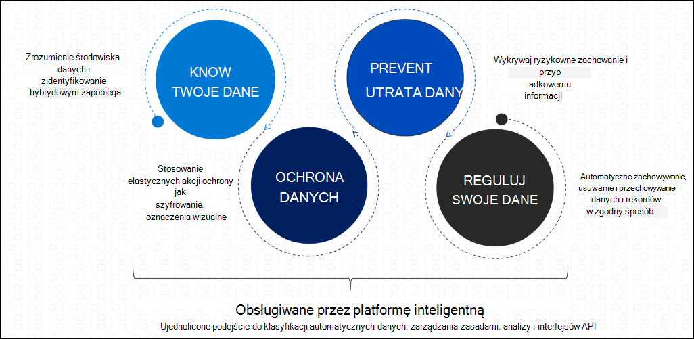

# Microsoft Information Protection w programie Microsoft 365

>*[Licencjonowanie w Microsoft 365 zabezpieczeń & zgodności](/office365/servicedescriptions/microsoft-365-service-descriptions/microsoft-365-tenantlevel-services-licensing-guidance/microsoft-365-security-compliance-licensing-guidance)*

Implementowanie możliwości firmy Microsoft Information Protection (MIP) w celu odnajdowania, klasyfikowania i ochrony informacji poufnych niezależnie od miejsca życia lub podróży.

Funkcje miP są zawarte w funkcji zgodności Microsoft 365 i zapewniają narzędzia do poznania [danych, ochrony](#know-your-data) danych i zapobiegania [utracie danych](#prevent-data-loss).

Aby uzyskać wskazówki wstępne dotyczące wdrażania rozwiązania do obsługi miP w organizacji, zobacz [Wdrażanie Microsoft Information Protection rozwiązania](information-protection-solution.md).

Aby uzyskać informacje dotyczące zarządzania danymi, zobacz [Zarządzanie informacjami firmy Microsoft w programie Microsoft 365](manage-Information-governance.md).

## Poznaj swoje dane

Aby zrozumieć poziom danych i zidentyfikować poufne dane w środowisku hybrydowym, skorzystaj z następujących funkcji:

|Funkcja|Jakie problemy rozwiązuje?|Wprowadzenie|
|:------|:------------|:--------------------|
|[Typy informacji poufnych](sensitive-information-type-learn-about.md)| Identyfikuje poufne dane przy użyciu wbudowanych lub niestandardowych wyrażeń regularnych albo funkcji. Dowód potwierdzający obejmuje słowa kluczowe, poziomy ufności i odległość.| [Dostosowywanie wbudowanego typu informacji poufnych](customize-a-built-in-sensitive-information-type.md)|
|[Klasyfikatorzy przeszkoli](classifier-learn-about.md)| Identyfikuje poufne dane, używając przykładów odpowiednich danych, zamiast identyfikować elementy w pozycji (dopasowywanie wzorców). Możesz używać wbudowanych klasyfikatorów lub szkolenie klasyfikatora z własną zawartością.| [Wprowadzenie do przeszkolnych klasyfikatorów](classifier-get-started-with.md) |
|[Klasyfikacja danych](data-classification-overview.md) | Graficzna identyfikacja elementów w organizacji, które mają etykietę wrażliwości, etykietę przechowywania lub które zostały sklasyfikowane. Możesz również użyć tych informacji, aby uzyskać szczegółowe informacje na temat akcji, które użytkownicy używają do tych elementów. | [Wprowadzenie do Eksploratora zawartości](data-classification-content-explorer.md) 
 [Wprowadzenie do Eksploratora aktywności](data-classification-activity-explorer.md) |

## Ochrona danych

Aby zastosować elastyczne akcje ochrony, które obejmują szyfrowanie, ograniczenia dostępu i oznaczenia wizualne, skorzystaj z następujących funkcji:

|Funkcja|Jakie problemy rozwiązuje?|Wprowadzenie|
|:------|:------------|---------------------|
|[Etykiety wrażliwości](sensitivity-labels.md)| Jedno rozwiązanie w aplikacjach, usługach i urządzeniach, które pozwala oznaczać i chronić dane podczas podróży w organizacji i poza nią.    Przykładowe scenariusze:  - [Zarządzanie etykietami wrażliwości dla Office aplikacji](sensitivity-labels-office-apps.md)  - [Szyfrowanie dokumentów i wiadomości e-mail](encryption-sensitivity-labels.md)  -  [Stosowanie etykiet i wyświetlanie ich w Power BI](/power-bi/admin/service-security-apply-data-sensitivity-labels)    Pełną listę scenariuszy etykiet wrażliwości można znaleźć w dokumentacji Wprowadzenie.|[Wprowadzenie do etykiet wrażliwości](get-started-with-sensitivity-labels.md) |
|[Ujednolicony klient etykiet usługi Azure Information Protection](/azure/information-protection/rms-client/aip-clientv2)| W przypadku Windows komputerów rozszerza etykiety do Eksploratora plików i programu PowerShell o dodatkowe funkcje dla Office w razie potrzeby| [Przewodnik administratora klienta z ujednoliconą etykietą usługi Azure Information Protection](/azure/information-protection/rms-client/clientv2-admin-guide)|
|[Szyfrowanie z podwójnym kluczem](double-key-encryption.md)| W wszystkich okolicznościach tylko Twoja organizacja może kiedykolwiek odszyfrować zawartość chronioną lub ze potrzeby wymogów prawnych, musisz przechowywać klucze szyfrowania w granicach geograficznych. | [Wdrażanie szyfrowania z podwójnym kluczem](double-key-encryption.md#deploy-dke)|
|[Szyfrowanie wiadomości usługi Office 365 (OME)](ome.md)| Szyfruje wiadomości e-mail i dołączone dokumenty, które są wysyłane do dowolnego użytkownika na dowolnym urządzeniu, dzięki czemu tylko autoryzowani adresaci mogą odczytywać informacje wysłane pocztą e-mail.     Przykładowy scenariusz: [Odwoływanie wiadomości e-mail zaszyfrowanych za pomocą zaawansowanego szyfrowania wiadomości](revoke-ome-encrypted-mail.md) | [Konfigurowanie nowych funkcji szyfrowania wiadomości](set-up-new-message-encryption-capabilities.md)|
|[Szyfrowanie usługi przy użyciu klucza klienta](customer-key-overview.md) | Zapewnia ochronę przed wyświetlaniem danych przez nieautoryzowane systemy lub pracowników, a także uzupełnia szyfrowanie dysków funkcją BitLocker w centrach danych firmy Microsoft. | [Konfigurowanie klucza klienta dla Office 365](customer-key-set-up.md)|
|[SharePoint zarządzanie prawami do informacji (IRM)](set-up-irm-in-sp-admin-center.md#irm-enable-sharepoint-document-libraries-and-lists)|Chroni SharePoint i bibliotek, dzięki czemu podczas wye widać, że pobrany plik podczas wyebrania dokumentu jest chroniony, dzięki czemu tylko uprawnione osoby mogą go wyświetlać i używać zgodnie z zasadami, które określisz. | [Set up Information Rights Management (IRM) in SharePoint admin center](set-up-irm-in-sp-admin-center.md)|
[Łącznik zarządzania prawami](/azure/information-protection/deploy-rms-connector) |Ochrona tylko dla istniejących wdrożeń lokalnych, które używają programu Exchange lub SharePoint Server, albo serwerów plików z infrastrukturą Windows Server i klasyfikacją plików (FCI, File Classification Infrastructure). | [Procedura wdrażania łącznika RMS](/azure/information-protection/deploy-rms-connector#steps-to-deploy-the-rms-connector)
|[Ujednolicony skaner etykiet usługi Azure Information Protection](/azure/information-protection/deploy-aip-scanner)| Odnajduje, etykietuje i chroni informacje poufne, które znajdują się w lokalnych magazynach danych. | [Konfigurowanie i instalowanie ujednoliconego skanera etykiet usługi Azure Information Protection](/azure/information-protection/deploy-aip-scanner-configure-install)|
|[Usługa Microsoft Defender dla aplikacji w chmurze](/cloud-app-security/what-is-cloud-app-security)| Odnajduje, etykietuje i chroni informacje poufne przechowywane w magazynach danych w chmurze. | [Odnajdowanie, klasyfikowanie, oznaczanie i ochrona danych chronionych zgodnie z regulacjami regulacyjną i poufnymi przechowywanymi w chmurze](/cloud-app-security/best-practices#discover-classify-label-and-protect-regulated-and-sensitive-data-stored-in-the-cloud)|
|[Azure Purview](/azure/purview/overview) |Identyfikuje poufne dane i stosuje automatyczne etykiety do zawartości w usłudze Azure Purview. Obejmują one pliki w magazynie, takie jak Azure Data Lake i Azure Files, oraz schematyzowane dane, takie jak kolumny w usłudze Azure SQL DB i Cosmos DB. |[Oznaczanie etykietami w usłudze Azure Purview](/azure/purview/create-sensitivity-label) |
|[Microsoft Information Protection SDK](/information-protection/develop/overview#microsoft-information-protection-sdk)|Rozszerza etykiety wrażliwości na usługi i aplikacje innych firm.     Przykładowy scenariusz: [Ustawianie i uzyskiwanie etykiety wrażliwości (C++)](/information-protection/develop/quick-file-set-get-label-cpp) |[Konfigurowanie zestawu SDK Microsoft Information Protection (MIP)](/information-protection/develop/setup-configure-mip)|

## Zapobieganie utracie danych

Aby zapobiec przypadkowemu zasłaniu informacji poufnych, skorzystaj z następujących funkcji:

|Funkcja|Jakie problemy rozwiązuje?|Wprowadzenie|
|:------|:------------|:---------------------|
|[Ochrona przed utratą danych](dlp-learn-about-dlp.md)| Pomaga zapobiec niezamierzonemu udostępnianiu poufnych elementów. | [Wprowadzenie do domyślnych zasad DLP](get-started-with-the-default-dlp-policy.md)|
|[Ochrona punktu końcowego przed utratą danych](endpoint-dlp-learn-about.md)| Rozszerza możliwości funkcji DLP na elementy używane i udostępniane na Windows 10 komputerach. | [Wprowadzenie do ochrony przed utratą danych w punkcie końcowym](endpoint-dlp-getting-started.md)|
|[Rozszerzenie zgodności firmy Microsoft](dlp-chrome-learn-about.md) | Rozszerza funkcje funkcji DLP o przeglądarkę Chrome | [Wprowadzenie do rozszerzenia zgodności firmy Microsoft](dlp-chrome-get-started.md)|
|[Microsoft 365 ochrony przed utratą danych w środowisku lokalnym (wersja Preview)](dlp-on-premises-scanner-learn.md)|Rozszerza monitorowanie funkcji DLP działań w plikach i akcje zabezpieczające związane z tymi plikami do lokalnych udziałów plików i SharePoint folderów i bibliotek dokumentów.|[Wprowadzenie do ochrony przed Microsoft 365 utratą danych w skanerze lokalnym (wersja Preview)](dlp-on-premises-scanner-get-started.md)|
|[Ochrona poufnych informacji w Microsoft Teams wiadomościach na czacie i w kanałach](dlp-microsoft-teams.md) | Rozszerza niektóre funkcje DLP Teams czatów i wiadomości kanałów | [Informacje o domyślnych zasadach ochrony przed utratą danych w aplikacji Microsoft Teams (wersja zapoznawcza)](dlp-teams-default-policy.md)|

## Wymagania dotyczące licencjonowania

Wymagania licencyjne dotyczące programu miP zależą od scenariuszy i funkcji, z których korzystasz, zamiast ustawiać wymagania licencjonowania dla każdej funkcji wymienionej na tej stronie. Aby poznać wymagania licencyjne i opcje dotyczące programu miP, zobacz sekcje dotyczące ochrony informacji w sekcji Ochrona informacji w programie [Microsoft 365](/office365/servicedescriptions/microsoft-365-service-descriptions/microsoft-365-tenantlevel-services-licensing-guidance/microsoft-365-security-compliance-licensing-guidance) dotyczące zgodności z zabezpieczeniami & i powiązany plik [PDF](https://go.microsoft.com/fwlink/?linkid=2139145) do pobrania, aby uzyskać informacje na temat wymagań licencjonowania na poziomie funkcji.