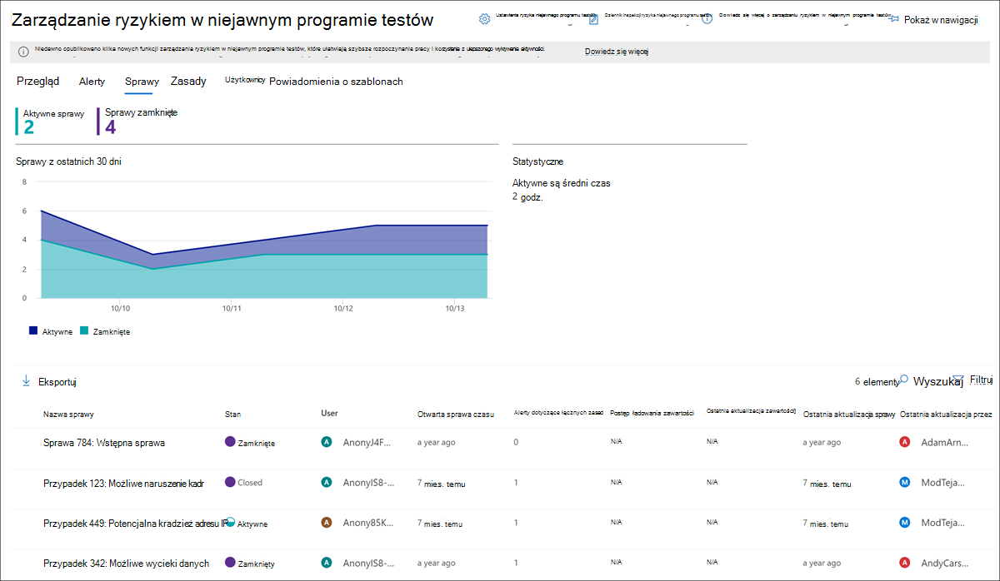
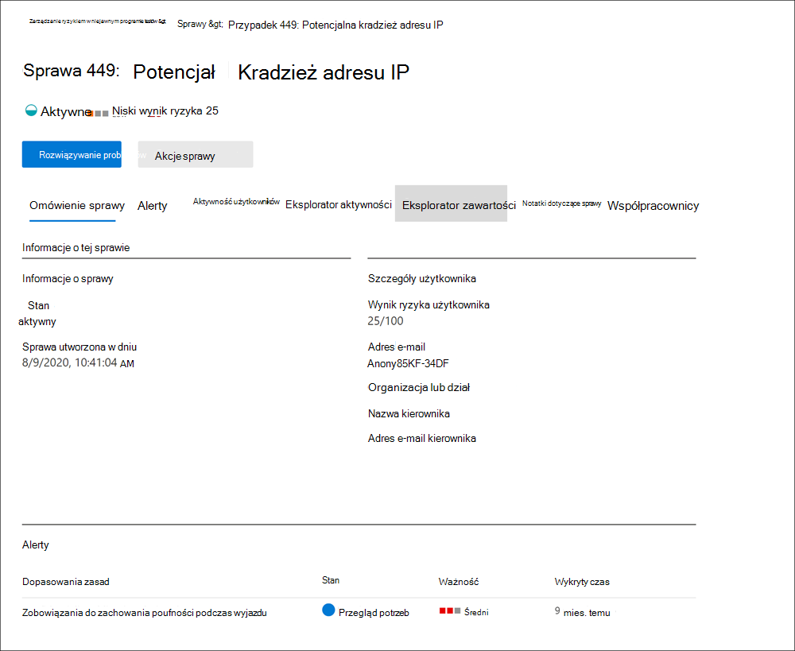

# Przypadki zarządzania ryzykiem w niejawnym programie testów

Przypadki są kluczowych w zarządzaniu ryzykiem w niejawnym programie testów i umożliwiają dogłębne badanie problemów wygenerowanych na podstawie wskaźników ryzyka zdefiniowanych w twoich zasadach oraz działania na ich podstawie. Sprawy są tworzone ręcznie na podstawie alertów w sytuacjach, w których potrzebne jest dalsze działanie w celu rozwiązania problemu związanego ze zgodnością użytkownika. Zakres każdej sprawy jest ograniczony do jednego użytkownika, a do istniejącej lub nowej sprawy można dodać wiele alertów dla użytkownika.

Po zbadaniu szczegółów sprawy możesz podjąć działanie w:

- Wysłanie użytkownikowi powiadomienia
- rozwiązywanie sprawy jako problemu
- udostępnianie sprawy wystąpieniu ServiceNow lub adresatowi wiadomości e-mail
- eskalowanie sprawy w przypadku Advanced eDiscovery dochodzenia

Obejrzyj klip [wideo Analizy i](https://www.youtube.com/watch?v=UONUSmkRC8s) eskalacji ryzyka w niejawnym programie testów, aby uzyskać omówienie tego, w jaki sposób sprawy są analizowane i zarządzane w zarządzaniu ryzykiem w niejawnym programie testów.

## Pulpit nawigacyjny spraw

Pulpit nawigacyjny spraw zarządzania ryzykiem w niejawnym **programie** testów umożliwia wyświetlanie spraw i działanie w związku z nimi. Każdy widżet raportu na pulpicie nawigacyjnym wyświetla informacje z ostatnich 30 dni.

- **Aktywne sprawy**: Łączna liczba aktywnych spraw, które są w toku badania.
- **Sprawy z ostatnich 30 dni**: Całkowita liczba spraw utworzonych, posortowanych według  stanu *Aktywne i Zamknięte*.
- **Statystyka**: średni czas aktywnego spraw wymieniony w godzinach, dniach lub miesiącach.

Oprócz bieżącego stanu następujących atrybutów sprawy kolejka spraw zawiera listę wszystkich aktywnych i zamkniętych spraw dla organizacji:

- **Nazwa sprawy**: nazwa sprawy zdefiniowana po potwierdzeniu alertu i utworzeniu sprawy.  
- **Stan**: Stan sprawy (aktywna lub *zamknięta*).
- **Użytkownik**: użytkownik w przypadku sprawy. Jeśli jest włączona anonimizacja nazw użytkowników, są wyświetlane informacje zanonimizowane.
- **Czas otwarcia sprawy**: czas, który minął od otwarcia sprawy.
- **Alerty dotyczące wszystkich zasad**: liczba uwzględnianych w przypadku dopasowania zasad. Liczba ta może zwiększyć się po dodaniu nowych alertów do sprawy.
- **Ostatnia aktualizacja sprawy**: Czas, który minął od momentu dodania notatki dotyczącej sprawy lub zmiany w stanie sprawy.
- **Ostatnia aktualizacja przez**: Nazwa analityka zarządzających ryzykiem w niejawnym programie testów lub osób, które ostatnio zaktualizowały sprawę.

Użyj **kontrolki wyszukiwania,** aby wyszukać określony tekst w nazwach spraw, a następnie użyj filtru przypadków, aby posortować sprawy według następujących atrybutów:

- Stan
- Godzina otwarcia, daty rozpoczęcia i daty zakończenia
- Ostatnia aktualizacja, data rozpoczęcia i data zakończenia

## Filtrowanie spraw

W zależności od liczby i typu aktywnych zasad zarządzania ryzykiem w niejawnym programie testów w organizacji przeglądanie dużej kolejki spraw może być trudne. Stosowanie filtrów przypadków może ułatwić analitykom i chętom sortowanie spraw według kilku atrybutów. Aby filtrować alerty na **pulpicie nawigacyjnym Sprawy**, wybierz **kontrolkę Filtruj** . Sprawy można filtrować według co najmniej jednego atrybutu:

- **Stan**: Wybierz co najmniej jedną wartość stanu, aby przefiltrować listę przypadków. Dostępne opcje to *Aktywne i* *Zamknięte*.
- **Otwarta sprawa czasu**: wybierz datę rozpoczęcia i zakończenia otwarcia sprawy.
- **Ostatnia aktualizacja**: Wybierz daty rozpoczęcia i zakończenia, gdy sprawa została zaktualizowana.

## Badanie sprawy

Bardziej dogłębne badanie alertów dotyczących zarządzania ryzykiem w ramach niejawnego programu testów jest niezbędne do podejmowania odpowiednich działań naprawczych. Przypadki zarządzania ryzykiem w niejawnym programie testów są centralnym narzędziem do zarządzania, które umożliwia bardziej szczegółowe informacje dotyczące historii aktywności ryzyka użytkownika, alertów, sekwencji zdarzeń ryzyka oraz eksplorowanie zawartości i wiadomości narażona na zagrożenia. Analitycy i scentralizowanie spraw również korzystają ze spraw do scentralizowanego scentralizować opinie i notatki dotyczące recenzji oraz przetwarzać proces rozwiązywania problemów.

Wybranie sprawy spowoduje otwarcie narzędzi do zarządzania sprawami i umożliwi analitykom i schłoństwom szczegółowe informacje dotyczące spraw.

### Omówienie sprawy

Karta **Przegląd przypadków** zawiera podsumowanie szczegółów przypadku dla analityków ryzyka i osób, które je suną. Zawiera następujące informacje w obszarze **Informacje o tej sprawie** .

- **Stan**: bieżący stan sprawy (aktywna lub zamknięta).
- **Data utworzenia sprawy**: data i godzina utworzenia sprawy.
- **Wynik ryzyka użytkownika**: bieżący obliczony poziom ryzyka użytkownika w przypadku sprawy. Ten wynik jest obliczany co 24 godziny i używa wyników alertów dotyczących ryzyka ze wszystkich aktywnych alertów skojarzonych z użytkownikiem.
- **Adres** e-mail: alias e-mail użytkownika w przypadku sprawy.
- **Organizacja lub dział**: organizacja lub dział, do których przypisano użytkownika.
- **Nazwa kierownika**: nazwa menedżera użytkownika.
- **Adres e-mail** kierownika: alias e-mail menedżera użytkownika.

Karta **Omówienie sprawy zawiera** również sekcję **Alerty** , która zawiera następujące informacje na temat alertów o dopasowaniu zasad skojarzonych ze sprawą:

- **Dopasowania zasad**: nazwa zasad zarządzania ryzykiem w niejawnym programie testów skojarzonych z alertami dopasowania dla działań użytkowników.
- **Stan**: stan alertu.
- **Ważność**: ważność alertu.
- **Wykryty czas**: czas, który minął od wygenerowania alertu.

### Alerty

Na **karcie Alerty** są podsumowywane bieżące alerty, które zostały uwzględnione w przypadku tej sprawy. Nowe alerty mogą zostać dodane do istniejącej sprawy i podczas ich przypisywania będą dodawane do **kolejki alertów** . W kolejce są wymienione następujące atrybuty alertu:

- Stan
- Ważność
- Wykryty czas

Wybierz alert z kolejki, aby wyświetlić stronę **szczegółów alertu** .

Użyj kontrolki wyszukiwania, aby wyszukać nazwy alertów dla określonego tekstu, a następnie użyj filtru alertów, aby posortować sprawy według następujących atrybutów:

- Stan
- Ważność
- Wykryto czas, datę rozpoczęcia i datę zakończenia

Filtruj alerty według kilku atrybutów, takich jak:

- **Stan**: Wybierz co najmniej jedną wartość stanu, aby przefiltrować listę alertów. Opcje to *Potwierdzono*, *Odrzucone*, *Wymaga recenzji* i *Rozwiązano*.
- **Ważność**: Wybierz co najmniej jeden poziom zagrożenia zagrożenia, aby przefiltrować listę alertów. Dostępne opcje to *Wysoki*, *Średni* i *Niski*.
- **Wykryty czas**: Wybierz daty rozpoczęcia i zakończenia dla czasu utworzenia alertu.
- **Zasady**. Wybierz jedną lub więcej zasad, aby filtrować alerty wygenerowane przez wybrane zasady.

### Aktywność użytkowników

Karta **Aktywność użytkowników** jest jednym z najbardziej zaawansowanych narzędzi do wewnętrznej analizy ryzyka i analizy spraw w rozwiązaniu do zarządzania ryzykiem w niejawnym programie testów. Ta karta ma strukturę, która umożliwia szybki przegląd sprawy, w tym historycznej osi czasu wszystkich alertów, szczegółów alertów, bieżącego wyniku ryzyka dla użytkownika w przypadku sprawy, sekwencji zdarzeń ryzyka i kontrolek w celu podjęcia skutecznych działań w celu zabezpieczenia ryzyka w tym przypadku.

1. **Filtry czasu**: Domyślnie alerty z ostatnich sześciu miesięcy potwierdzono w przypadku są wyświetlane na wykresie Aktywność użytkowników. Widok wykresu można łatwo filtrować, wybierając *karty 6* miesięcy, *3* miesięcy lub *1* miesiąca na wykresie bąbelkowy.
2. **Aktywność i szczegóły alertów ryzyka**: Działania ryzyka są wyświetlane w wizualny sposób jako kolorowe bąbelki na wykresie Aktywność użytkownika. Bąbelki są tworzone dla różnych kategorii ryzyka, a rozmiar bąbelków jest proporcjonalny do liczby działań ryzyka dla danej kategorii. Wybierz bąbelek, aby wyświetlić szczegółowe informacje dotyczące poszczególnych działań ryzyka. Szczegóły są następujące:
    - **Data** działania ryzyka.
    - Kategoria **działania ryzyka**. Mogą to być *na przykład wiadomości e-mail* z załącznikami wysyłanymi spoza organizacji lub pliki pobrane *z usługi SharePoint online*.
    - **Ocena ryzyka** dla alertu. Ten wynik jest wynikiem liczbowym poziomu zagrożenia zagrożenia.
    - Liczba zdarzeń skojarzonych z alertem. Dostępne są również linki do wszystkich plików i wiadomości e-mail związanych z aktywnością związaną z ryzykiem.
3. **Sekwencja ryzyka (wersja zapoznawcza)**: Chronologiczna kolejność działań ryzykownych jest ważnym aspektem analizy ryzyka i identyfikowania tych powiązanych działań jest ważną częścią oceny ogólnego ryzyka dla organizacji. Powiązane działania alertów są wyświetlane z liniami łączącymi w celu wyróżnienia, że te działania są skojarzone z większym obszarem ryzyka. Ten widok działań może ułatwić schłodne "łączenie kropek" w przypadku działań ryzyka, które mogły być przeglądane jako odizolowane lub zdarzenia typu one -off. Wybierz dowolny bąbelek w sekwencji, aby wyświetlić szczegółowe informacje dotyczące wszystkich skojarzonych działań ryzyka. Szczegóły są następujące:

    - **Nazwa** sekwencji.
    - **Data** lub **zakres dat** sekwencji.
    - **Wynik ryzyka** dla sekwencji. Ten wynik jest wynikiem liczbowy sekwencji połączonych poziomów zagrożenia zagrożenia dla każdego pokrewnego działania w sekwencji.
    - **Liczba zdarzeń skojarzonych z każdym alertem w sekwencji**. Dostępne są również linki do każdego pliku lub wiadomości e-mail skojarzonego z każdym działaniem ryzyka.
    - **Pokazywanie działań w sekwencji**. Wyświetla sekwencję jako linię wyróżnienia na wykresie bąbelkowy i rozszerza szczegóły alertu, aby wyświetlić wszystkie powiązane alerty w sekwencji.

4. **Legenda aktywności ryzyka**: u dołu wykresu aktywności użytkowników legenda kodowana kolorami ułatwia szybkie ustalenie kategorii ryzyka dla każdego alertu.
5. **Chronologia** aktywności ryzyka: zostanie wymieniona pełna chronologia wszystkich alertów ryzyka związanych ze sprawą, łącznie ze wszystkimi szczegółami dostępnymi w odpowiednim bąbelku alertów.
6. **Akcje dotyczące** sprawy: Opcje dotyczące rozwiązywania problemu znajdują się na pasku narzędzi akcji sprawy. Możesz rozwiązać sprawę, wysłać do użytkownika powiadomienie e-mail lub eskalować sprawę dla danych lub badania użytkownika.

### Eksplorator aktywności (wersja zapoznawcza)

> [!IMPORTANT]
> Karta Eksplorator aktywności jest dostępna w obszarze zarządzania sprawą dla użytkowników wyzwalających zdarzenia po tym, jak ta funkcja jest dostępna w Twojej organizacji.

Karta **Eksplorator aktywności** umożliwia analitykom ryzyka i chętnikom przeglądanie szczegółów aktywności skojarzonych z alertami ryzyka. Na przykład w ramach działań zarządzania sprawą słoje i analitycy mogą wymagać przejrzenia wszystkich działań ryzyka związanych ze sprawą, aby uzyskać więcej szczegółowych informacji. Za pomocą **Eksploratora aktywności** recenzentzy mogą szybko przeglądać oś czasu wykrytych ryzykownych działań oraz identyfikować i filtrować wszystkie działania ryzyka skojarzone z alertami.

Aby uzyskać więcej informacji na temat Eksploratora aktywności, zobacz artykuł Alerty o zarządzaniu [ryzykiem w niejawnym programie](insider-risk-management-activities.md#activity-explorer) testów.

### Eksplorator zawartości

Karta **Eksplorator zawartości umożliwia** skojarzoną z zagrożeniami kopię wszystkich pojedynczych plików i wiadomości e-mail skojarzonych z alertami ryzyka. Jeśli na przykład jest tworzony alert, gdy użytkownik pobiera setki plików z usługi SharePoint Online i działanie uruchamia alert zasad, wszystkie pobrane pliki tego alertu są przechwytywane i kopiowane do sprawy zarządzania ryzykiem w niejawnym programie testów z oryginalnych źródeł przechowywania.

Eksplorator zawartości to zaawansowane narzędzie z podstawowymi i zaawansowanymi funkcjami wyszukiwania i filtrowania. Aby dowiedzieć się więcej o oknie Eksplorator zawartości, zobacz Eksplorator zawartości [zarządzania ryzykiem w niejawnym programie testów](insider-risk-management-content-explorer.md).

### Uwagi dotyczące sprawy

Na **karcie Notatki dotyczące** sprawy w takim przypadku analitycy ryzyka i skomentowali sprawę, udostępniali komentarze, opinie i szczegółowe informacje na temat swojej pracy nad sprawą. Notatki są trwałymi dodatkami do sprawy i nie można ich edytować ani usuwać po zapisaniu notatki. Gdy sprawa zostanie utworzona na podstawie alertu, komentarze wprowadzone w oknie dialogowym Potwierdzanie **alertu** i tworzenie przypadku niejawnego programu testów są automatycznie dodawane jako notatka sprawy.

Na pulpicie nawigacyjnym notatek o sprawy są wyświetlane notatki użytkownika, który utworzył notatkę, oraz czas minął od jej zapisania. Aby wyszukać określone słowo kluczowe w polu tekstowym notatki dotyczącej sprawy, użyj przycisku Wyszukaj na pulpicie nawigacyjnym sprawy i wprowadź określone słowo kluczowe.

Aby dodać notatkę do sprawy:

1. W [Centrum zgodności platformy Microsoft 365 przejdź](https://compliance.microsoft.com) do strony Zarządzanie **ryzykiem w niejawnym programie** testów i wybierz **kartę** Sprawy.
2. Zaznacz sprawę, a następnie wybierz **kartę Notatki dotyczące sprawy** .
3. Wybierz **pozycję Dodaj notatkę o przypadku**.
4. W **oknie dialogowym Dodawanie** notatki dotyczącej sprawy wpisz notatkę. Wybierz **pozycję Zapisz** , aby dodać notatkę do sprawy, lub pozycję **Anuluj** zamknięcie bez zapisywania notatki w tej sprawie.

### Współautorzy

Na **karcie Współautorzy** w takim przypadku analitycy ryzyka i osoby chłoną, że mogą dodawać do sprawy innych recenzentów. Domyślnie wszyscy użytkownicy przypisani do analityków  zarządzających ryzykiem w niejawnym programie testów oraz członkowie grupy użytkowników zarządzających ryzykiem w niejawnym programie testów są wymienini jako współautorzy dla każdej aktywnej i zamkniętej sprawy. Tylko użytkownicy z przypisaną **rolą grupy** chętnych do zarządzania ryzykiem w niejawnym programie testów mają uprawnienia do wyświetlania plików i wiadomości w Eksploratorze zawartości.

Tymczasowy dostęp do sprawy można przyznać, dodając użytkownika jako współautora. Współautorzy mają pełną kontrolę nad zarządzaniem sprawą w danej sprawie z wyjątkiem:

- Uprawnienia do potwierdzania lub odrzucania alertów
- Uprawnienia do edytowania współautorów spraw
- Uprawnienia do wyświetlania plików i wiadomości w Eksploratorze zawartości

Aby dodać współautora do sprawy:

1. W [Centrum zgodności platformy Microsoft 365 przejdź](https://compliance.microsoft.com) do strony Zarządzanie **ryzykiem w niejawnym programie** testów i wybierz **kartę** Sprawy.
2. Wybierz sprawę, a następnie wybierz **kartę Współautorzy** .
3. Wybierz **pozycję Dodaj współautora**.
4. W **oknie dialogowym Dodawanie** współautora zacznij wpisywać nazwę użytkownika, którego chcesz dodać, a następnie wybierz użytkownika z listy sugerowanych użytkowników. Ta lista jest generowana na podstawie Azure Active Directory Twojej subskrypcji dzierżawy.
5. Wybierz **pozycję Dodaj** , aby dodać użytkownika jako współautora, lub **wybierz pozycję Anuluj** zamykanie okna dialogowego bez dodawania użytkownika jako współautora.

## Akcje sprawy

Zagrożenia zagrożenia mogą dotyczyć jednej z kilku metod, zależnie od istotności sprawy, historii ryzyka użytkownika i wytycznych organizacji dotyczących ryzyka. W niektórych sytuacjach może być konieczne eskalowanie sprawy do użytkownika lub analizy danych w celu współpracy z innymi obszarami organizacji i bardziej dogłębnego odpowiedzialności za działania związane z ryzykiem. Zarządzanie ryzykiem w ramach niejawnego programu testów jest ściśle zintegrowane z Microsoft 365 rozwiązaniami zgodności, które pomagają w zarządzaniu rozdzielczością w pełni.

### Powiadomienie o wysłaniu wiadomości e-mail

W większości przypadków akcje użytkownika tworzące alerty o ryzyku w niejawnym programie testów są przypadkowe lub przypadkowe. Wysłanie do użytkownika powiadomienia z przypomnieniem pocztą e-mail jest skuteczną metodą dokumentowania przeglądu sprawy i działań oraz stanowi metodę przypominania użytkownikom o zasadach firmy lub nakierowania ich na odświeżone szkolenia. Powiadomienia są generowane na podstawie [szablonów zawiadomień, które tworzysz dla](insider-risk-management-notices.md) swojej infrastruktury zarządzania ryzykiem w niejawnym programie testów.

Należy pamiętać, że wysłanie powiadomienia e-mail do użytkownika ***nie** _ rozwiązuje sprawy jako _Closed*. W niektórych przypadkach może być chcieć pozostawić otwartą sprawę po wysłaniu do użytkownika powiadomienia o konieczności wyszukiwania kolejnych działań ryzyka bez otwierania nowej sprawy. Aby rozstrzygować sprawę po wysłaniu powiadomienia, po wysłaniu powiadomienia  należy wybrać pozycję Rozwiąż sprawę jako krok kolejny po wysłaniu powiadomienia.

Aby wysłać powiadomienie do użytkownika przypisanego do sprawy:

1. W [Centrum zgodności platformy Microsoft 365 przejdź](https://compliance.microsoft.com) do strony Zarządzanie **ryzykiem w niejawnym programie** testów i wybierz **kartę** Sprawy.
2. Zaznacz sprawę, a następnie wybierz przycisk **Wyślij powiadomienie e-mail** na pasku narzędzi akcji sprawy.
3. W **oknie dialogowym Wysyłanie powiadomienia e-mail** wybierz kontrolkę  rozwijaną Wybierz szablon powiadomienia, aby wybrać szablon powiadomienia dla powiadomienia. To zaznaczenie wstępnie wypełnia pozostałe pola w treści powiadomienia.
4. Przejrzyj pola powiadomienia i zaktualizuj je odpowiednio do potrzeb. Wprowadzone tutaj wartości zastąpią wartości w szablonie.
5. Wybierz **pozycję Wyślij**, aby wysłać powiadomienie do użytkownika,  lub pozycję Anuluj zamknij okno dialogowe bez wysyłania powiadomienia do użytkownika. Wszystkie wysłane powiadomienia są dodawane do kolejki notatek o sprawy na **pulpicie nawigacyjnym notatek o sprawy** .

### Eskalowanie do badania

Eskalowanie sprawy w celu analizy użytkowników w sytuacjach, w których jest konieczna dodatkowa recenzja prawnie w przypadku aktywności użytkownika związanej z ryzykiem. Ta eskalacja powoduje otwarcie nowej Advanced eDiscovery przypadku w Twojej Microsoft 365 organizacji. Advanced eDiscovery udostępnia end-to-end przepływu pracy, który umożliwia zachowywanie, zbieranie, przeglądanie, analizowanie i eksportowanie zawartości, która reaguje na wewnętrzne i zewnętrzne badania prawne Twojej organizacji. Umożliwia także zespołowi prawnemu zarządzanie całym przepływem pracy z powiadomieniem o zerowym zrzeka się w celu skomunikowania się z lekarzami zaangażowanymi w sprawę. Przypisanie recenzenta jako opiekuna w przypadku Advanced eDiscovery sprawy utworzonej na podstawie sprawy związanej z zarządzaniem ryzykiem w ramach niejawnego programu testów pomaga Twojemu zespołowi prawnemu podjąć odpowiednie działania i zarządzać zachowywanie zawartości. Aby dowiedzieć się więcej o Advanced eDiscovery spraw, zobacz [Omówienie Advanced eDiscovery w Microsoft 365](overview-ediscovery-20.md).

Aby eskalować sprawę do badania użytkowników:

1. W [Centrum zgodności platformy Microsoft 365 przejdź](https://compliance.microsoft.com) do strony Zarządzanie **ryzykiem w niejawnym programie** testów i wybierz **kartę** Sprawy.
2. Wybierz sprawę, a następnie wybierz przycisk **Eskaluj do badania** na pasku narzędzi akcji sprawy.
3. W **oknie dialogowym Eskalij do badania** wprowadź nazwę nowego badania użytkownika. W razie potrzeby wprowadź uwagi dotyczące sprawy i wybierz pozycję **Eskaluj**.
4. Przejrzyj pola powiadomienia i zaktualizuj je odpowiednio do potrzeb. Wprowadzone tutaj wartości zastąpią wartości w szablonie.
5. Wybierz **pozycję** Potwierdź, aby utworzyć sprawę badania użytkowników, **lub pozycję Anuluj** , aby zamknąć okno dialogowe bez tworzenia nowego przypadku badania użytkownika.

Po eskalacji sprawy związanej z zarządzaniem ryzykiem w niejawnym programie testów do nowego przypadku analizy użytkowników możesz przejrzeć nową sprawę w obszarze **eDiscoveryAdvanced**  >  w centrum Centrum zgodności platformy Microsoft 365.

### Uruchamianie zadań automatycznych Power Automate przepływów dla sprawy

Używając zalecanych Power Automate analizy ryzyka i analitycy mogą szybko podjąć działania w celu:

- Żądanie od kadry lub firmy informacji o użytkowniku w przypadku wystąpienia ryzyka w niejawnym programie testów
- Powiadamianie menedżera, gdy użytkownik ma alert o ryzyku w niejawnym programie testów
- Tworzenie rekordu dla przypadku zarządzania ryzykiem w niejawnym programie testów w serwisie ServiceNow
- Powiadamianie użytkowników o dodaniu ich do zasad ryzyka niejawnego programu testów

Uruchamianie i tworzenie przepływów Power Automate zarządzania ryzykiem w niejawnym programie testów lub zarządzanie nimi:

1. Wybierz **pozycję Automatyzuj** na pasku narzędzi akcji sprawy. 
2. Wybierz przepływ Power Automate przepływu pracy, a następnie wybierz pozycję **Uruchom przepływ**. 
3. Po zakończeniu przepływu wybierz pozycję **Gotowe**.

Aby dowiedzieć się więcej o przepływach Power Automate do zarządzania ryzykiem w niejawnym programie testów, zobacz Wprowadzenie do ustawień zarządzania ryzykiem w niejawnym programie [testów](insider-risk-management-settings.md#power-automate-flows-preview).

### Wyświetlanie lub tworzenie zespołu Microsoft Teams w sprawie

Gdy Microsoft Teams zarządzanie ryzykiem w niejawnym programie testów jest włączone w ustawieniach, zespół Microsoft Teams jest tworzony automatycznie za każdym razem, gdy zostanie potwierdzone alert i zostanie utworzona sprawa. W przypadku zagrożenia, a także analitycy mogą szybko otworzyć Microsoft Teams przejść bezpośrednio do zespołu w przypadku sprawy, wybierając pozycję Wyświetl Microsoft Teams **na** pasku narzędzi akcji sprawy.

W przypadku spraw otwartych przed włączeniem integracji z usługą Microsoft Team wschowa i analitycy mogą utworzyć nowy zespół Microsoft Teams dla sprawy, wybierając pozycję Utwórz zespół Microsoft Teams na pasku narzędzi akcji sprawy.

Gdy zostanie rozpoznana sprawa, powiązany zespół Microsoft Team zostanie automatycznie zarchiwizować (ukryty i przekształcony w tylko do odczytu).

Aby dowiedzieć się więcej na Microsoft Teams do zarządzania ryzykiem w niejawnym programie testów, zobacz Wprowadzenie do ustawień [zarządzania ryzykiem w niejawnym programie testów](insider-risk-management-settings.md#microsoft-teams-preview).

### Rozwiązanie sprawy

Po zakończeniu przeglądania i analizy przez analityków ryzyka i wtłasnych osób można rozwiązać sprawę, aby działała na wszystkich alertach, które są obecnie uwzględnione w tej sprawie. Rozwiązanie problemu powoduje dodanie klasyfikacji rozwiązania, zmianę stanu sprawy na *Zamknięte, a* przyczyny akcji rozwiązywania są automatycznie dodawane do kolejki notatek dotyczących sprawy na pulpicie **nawigacyjnym notatek o sprawy** . Sprawy są rozwiązywane w następujący sposób:

- **Przykład**: Klasyfikacja przypadków, w których alerty o dopasowaniu zasad są oceniane jako niskie ryzyko, inne niż poważne lub fałszywie dodatnie.
- **Potwierdzone naruszenie zasad**: Klasyfikacja przypadków, w których alerty o dopasowaniu zasad są oceniane jako ryzykowne, poważne lub wynikiem złośliwych działań.

Aby rozwiązać problem:

1. W [Centrum zgodności platformy Microsoft 365 przejdź](https://compliance.microsoft.com) do strony Zarządzanie **ryzykiem w niejawnym programie** testów i wybierz **kartę** Sprawy.
2. Zaznacz sprawę, a następnie wybierz przycisk Rozwiąż **sprawę** na pasku narzędzi akcji sprawy.
3. W **oknie dialogowym Rozwiązywanie** problemów wybierz **kontrolkę listy** rozwijanej Rozwiąż jako, aby wybrać klasyfikację rozwiązania dla sprawy. Dostępne opcje to **Naruszenie** lub **Potwierdzenie naruszenia zasad**.
4. W **oknie dialogowym Rozwiązywanie** problemów wprowadź przyczyny klasyfikacji rozwiązania w polu tekstowym Akcja **wykonane** .
5. Wybierz **pozycję Rozwiąż** , aby zamknąć sprawę, lub pozycję **Anuluj** zamknij okno dialogowe bez usuwania sprawy.
