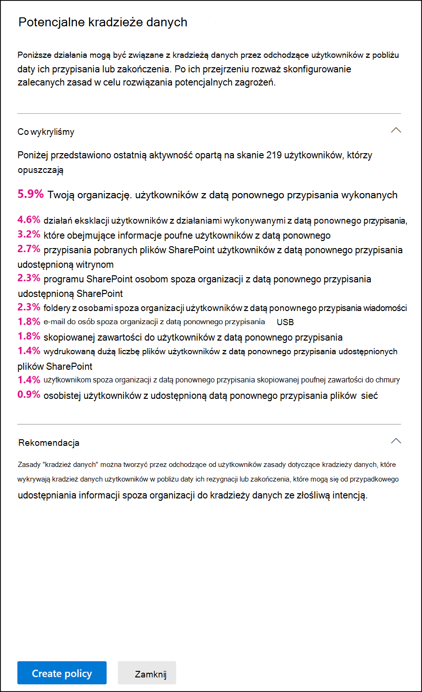

# Wprowadzenie z ustawieniami zarządzania ryzykiem wewnętrznym

[!include[Purview banner](../includes/purview-rebrand-banner.md)]

Ustawienia zarządzania ryzykiem wewnętrznym mają zastosowanie do wszystkich zasad zarządzania ryzykiem wewnętrznym, niezależnie od szablonu wybranego podczas tworzenia zasad. Ustawienia są konfigurowane przy użyciu kontroli **ustawień ryzyka niejawnych testerów** znajdującej się w górnej części wszystkich stron zarządzania ryzykiem wewnętrznym. Te ustawienia kontrolują składniki zasad dla następujących obszarów:

- [Prywatność](#privacy)
- [Wskaźniki](#indicators)
- [Ramy czasowe zasad](#policy-timeframes)
- [Inteligentne wykrywanie](#intelligent-detections)
- [Eksportowanie alertów](#export-alerts)
- [Priorytetowe grupy użytkowników (wersja zapoznawcza)](#priority-user-groups-preview)
- [Priorytetowe zasoby fizyczne (wersja zapoznawcza)](#priority-physical-assets-preview)
- [przepływy Power Automate (wersja zapoznawcza)](#power-automate-flows-preview)
- [Microsoft Teams (wersja zapoznawcza)](#microsoft-teams-preview)
- [Analytics](#analytics)
- [Powiadomienia administratora](#admin-notifications)

Przed rozpoczęciem pracy i utworzeniem zasad zarządzania ryzykiem wewnętrznym ważne jest, aby zrozumieć te ustawienia i wybrać poziomy ustawień najlepiej dla potrzeb dotyczących zgodności w organizacji.

## Prywatność

Ochrona prywatności użytkowników, którzy mają dopasowania zasad, jest ważna i może pomóc w promowaniu obiektywizmu w badaniach danych i przeglądach analiz dla alertów o ryzyku wewnętrznym. W przypadku użytkowników z dopasowaniem zasad ryzyka niejawnego można wybrać jedno z następujących ustawień:

- **Pokaż anonimowe wersje nazw użytkowników**: nazwy użytkowników są anonimizowane, aby uniemożliwić administratorom, badaczom danych i recenzentom wyświetlanie osób skojarzonych z alertami zasad. Na przykład użytkownik "Grace Taylor" będzie wyświetlany z losowym pseudonimem, takim jak "AnonIS8-988" we wszystkich obszarach środowiska zarządzania ryzykiem wewnętrznym. Wybranie tego ustawienia powoduje zanonimizowanie wszystkich użytkowników z bieżącymi i wcześniejszymi dopasowaniami zasad i ma zastosowanie do wszystkich zasad. Informacje o profilu użytkownika w alertie o ryzyku wewnętrznym i szczegółach sprawy nie będą dostępne po wybraniu tej opcji. Jednak nazwy użytkowników są wyświetlane podczas dodawania nowych użytkowników do istniejących zasad lub przypisywania użytkowników do nowych zasad. Jeśli zdecydujesz się wyłączyć to ustawienie, nazwy użytkowników będą wyświetlane dla wszystkich użytkowników, którzy mają bieżące lub wcześniejsze dopasowania zasad.

    >[!IMPORTANT]
    >Aby zachować integralność referencyjną dla użytkowników, którzy mają alerty lub przypadki ryzyka wewnętrznego w Microsoft 365 lub innych systemach, anonimizacja nazw użytkowników nie jest zachowywana w przypadku wyeksportowanych alertów. Wyeksportowane alerty będą wyświetlać nazwy użytkowników dla każdego alertu.

- **Nie pokazuj zanonimizowanych wersji nazw użytkowników**: nazwy użytkowników są wyświetlane dla wszystkich bieżących i przeszłych dopasowań zasad dla alertów i przypadków. Informacje o profilu użytkownika (nazwa, tytuł, alias oraz organizacja lub dział) są wyświetlane dla użytkownika dla wszystkich alertów i przypadków dotyczących zarządzania ryzykiem wewnętrznym.

## Wskaźniki

Szablony zasad ryzyka wewnętrznego definiują typ działań związanych z ryzykiem, które chcesz wykryć i zbadać. Każdy szablon zasad jest oparty na określonych wskaźnikach, które odpowiadają określonym wyzwalaczom i działaniom ryzyka. Wszystkie wskaźniki są domyślnie wyłączone i przed skonfigurowaniem zasad zarządzania ryzykiem wewnętrznym należy wybrać co najmniej jeden wskaźnik zasad.

Alerty są wyzwalane przez zasady, gdy użytkownicy wykonują działania związane ze wskaźnikami zasad, które spełniają wymagany próg. Zarządzanie ryzykiem wewnętrznym używa dwóch typów wskaźników:

- **Wyzwalanie zdarzeń**: zdarzenia, które określają, czy użytkownik jest aktywny w zasadach zarządzania ryzykiem wewnętrznym. Jeśli użytkownik zostanie dodany do zasad zarządzania ryzykiem wewnętrznym nie ma zdarzenia wyzwalającego, działanie użytkownika nie zostanie ocenione przez zasady. Na przykład użytkownik A jest dodawany do zasad utworzonych na podstawie *kradzieży danych przez szablon zasad odchodzących użytkowników*, a zasady i łącznik Microsoft 365 HR są prawidłowo skonfigurowane. Dopóki użytkownik A nie ma daty zakończenia zgłoszonej przez łącznik hr, działania użytkownika A nie są oceniane przez te zasady zarządzania ryzykiem wewnętrznym pod kątem ryzyka. Innym przykładem wyzwalającego zdarzenia jest to, czy użytkownik ma alert zasad DLP *o wysokiej* ważności podczas korzystania z zasad *wycieków danych* .
- **Wskaźniki zasad**: Wskaźniki zawarte w zasadach zarządzania ryzykiem wewnętrznym używanych do określania oceny ryzyka dla użytkownika w zakresie. Te wskaźniki zasad są aktywowane tylko po wystąpieniu zdarzenia wyzwalającego dla użytkownika. Niektóre przykłady wskaźników zasad dotyczą sytuacji, gdy użytkownik kopiuje dane do osobistych usług magazynu w chmurze lub przenośnych urządzeń magazynujących, jeśli konto użytkownika zostanie usunięte z Azure Active Directory lub jeśli użytkownik udostępnia wewnętrzne pliki i foldery nieautoryzowanym stronom zewnętrznym.

Niektóre wskaźniki zasad mogą być również używane do dostosowywania zdarzeń wyzwalania dla określonych szablonów zasad. Po skonfigurowaniu w kreatorze zasad dla ogólnych *wycieków danych* lub *wycieków danych według szablonów użytkowników priorytetowych* wskaźniki te umożliwiają większą elastyczność i dostosowywanie zasad oraz gdy użytkownicy są w zakresie zasad. Ponadto można zdefiniować progi poszczególnych działań dla tych wskaźników wyzwalających, aby uzyskać bardziej szczegółową kontrolę w zasadach.

Wskaźniki zasad są podzielone na następujące obszary. Możesz wybrać wskaźniki, aby aktywować i dostosować limity zdarzeń wskaźnika dla każdego poziomu wskaźnika podczas tworzenia zasad ryzyka niejawnego:

- **wskaźniki Office**: obejmują one wskaźniki zasad dla witryn SharePoint, Microsoft Teams i wiadomości e-mail.
- **Wskaźniki urządzeń**: obejmują one wskaźniki zasad działania, takie jak udostępnianie plików za pośrednictwem sieci lub urządzeń. Wskaźniki obejmują działania obejmujące wszystkie typy plików, z wyłączeniem działania plików wykonywalnych (.exe) i biblioteki linków dynamicznych (.dll). Jeśli wybierzesz *pozycję Wskaźniki urządzenia*, działanie jest przetwarzane dla urządzeń z urządzeniami Windows 10 Build 1809 lub nowszym oraz urządzeniami z systemem macOS (Catalina 10.15 lub nowszym). W przypadku urządzeń z systemem Windows i macOS należy najpierw dołączyć urządzenia do portalu zgodności. Wskaźniki urządzenia obejmują również wykrywanie sygnału przeglądarki, aby ułatwić organizacji wykrywanie i działanie na sygnałach eksfiltracji dla plików nie wykonywalnych wyświetlanych, skopiowanych, udostępnionych lub wydrukowanych w Microsoft Edge i Google Chrome. Aby uzyskać więcej informacji na temat konfigurowania urządzeń Windows na potrzeby integracji z ryzykiem wewnętrznym, zobacz następującą sekcję [Włączanie wskaźników urządzeń i dołączanie urządzeń Windows](insider-risk-management-settings.md#OnboardDevices) w tym artykule. Aby uzyskać więcej informacji na temat konfigurowania urządzeń z systemem macOS do integracji z ryzykiem wewnętrznym, zobacz następującą sekcję Włączanie wskaźników urządzeń i dołączanie urządzeń z systemem macOS w tym artykule. Aby uzyskać więcej informacji na temat wykrywania sygnału w przeglądarce, zobacz [Dowiedz się więcej o wykrywaniu sygnałów w przeglądarce zarządzania ryzykiem wewnętrznym i konfigurowaniu go](insider-risk-management-browser-support.md).
- **Wskaźnik naruszenia zasad zabezpieczeń (wersja zapoznawcza)**: obejmują one wskaźniki z Ochrona punktu końcowego w usłudze Microsoft Defender związane z niezatwierdzone lub złośliwe oprogramowanie instalacji lub pomijanie mechanizmów kontroli zabezpieczeń. Aby otrzymywać alerty w ramach zarządzania ryzykiem wewnętrznym, musisz mieć włączoną aktywną licencję usługi Defender for Endpoint i integrację z ryzykiem wewnętrznym. Aby uzyskać więcej informacji na temat konfigurowania usługi Defender for Endpoint na potrzeby integracji z zarządzaniem ryzykiem wewnętrznym, zobacz [Konfigurowanie zaawansowanych funkcji w Ochrona punktu końcowego w usłudze Microsoft Defender](/windows/security/threat-protection/microsoft-defender-atp/advanced-features\#share-endpoint-alerts-with-microsoft-compliance-center).
- **Wskaźniki dostępu do rekordów kondycji (wersja zapoznawcza)**: obejmują one wskaźniki zasad dostępu do dokumentacji medycznej pacjentów. Na przykład próby uzyskania dostępu do dokumentacji medycznej pacjentów w dziennikach systemu elektronicznej dokumentacji medycznej (EMR) mogą być udostępniane zasadom opieki zdrowotnej w zakresie zarządzania ryzykiem wewnętrznym. Aby otrzymywać tego typu alerty w ramach zarządzania ryzykiem wewnętrznym, musisz mieć skonfigurowany łącznik danych specyficzny dla opieki zdrowotnej i łącznik danych kadr.
- **Wskaźniki dostępu fizycznego (wersja zapoznawcza)**: obejmują one wskaźniki zasad fizycznego dostępu do poufnych zasobów. Na przykład próby uzyskania dostępu do obszaru z ograniczeniami w fizycznych dziennikach systemu nieprawidłowego działania mogą być udostępniane zasadom zarządzania ryzykiem wewnętrznym. Aby otrzymywać tego typu alerty w ramach zarządzania ryzykiem wewnętrznym, musisz mieć włączone priorytetowe zasoby fizyczne w ramach zarządzania ryzykiem wewnętrznym i skonfigurowanego [łącznika danych fizycznych](import-physical-badging-data.md) . Aby dowiedzieć się więcej na temat konfigurowania dostępu fizycznego, zobacz [sekcję Priorytetowego dostępu fizycznego](#priority-physical-assets-preview) w tym artykule.
- **wskaźniki Microsoft Defender for Cloud Apps (wersja zapoznawcza)**: obejmują one wskaźniki zasad z udostępnionych alertów z usługi Defender dla Chmury Apps. Automatyczne wykrywanie anomalii w usłudze Defender dla Chmury Apps natychmiast rozpoczyna wykrywanie i sortowanie wyników, co jest ukierunkowane na liczne anomalie behawioralne dla użytkowników oraz maszyn i urządzeń połączonych z siecią. Aby uwzględnić te działania w alertach zasad zarządzania ryzykiem wewnętrznym, wybierz co najmniej jeden wskaźnik w tej sekcji. Aby dowiedzieć się więcej na temat analizy i wykrywania anomalii w usłudze Defender dla Chmury Apps, zobacz [Get behavioral analytics and anomaly detection (Pobieranie analizy behawioralnej i wykrywania anomalii](/cloud-app-security/anomaly-detection-policy)).
- **Dopalacze oceny ryzyka**: obejmują one podniesienie oceny ryzyka dla aktywności, która jest powyżej zwykłej aktywności użytkownika przez jeden dzień lub dla użytkowników z wcześniejszymi przypadkami rozpoznawanymi jako naruszenie zasad. Włączenie dopalaczy oceny ryzyka zwiększa ocenę ryzyka i prawdopodobieństwo alertów dla tego typu działań. W przypadku działań, które są powyżej zwykłej aktywności użytkownika przez jeden dzień, wyniki są zwiększane, jeśli wykryte działanie odbiega od typowego zachowania użytkownika. W przypadku użytkowników z poprzednimi przypadkami rozpoznawanymi jako naruszenie zasad wyniki są zwiększane, jeśli użytkownik wcześniej rozpoznał więcej niż jeden przypadek jako potwierdzone naruszenie zasad. Dopalacze oceny ryzyka można wybrać tylko wtedy, gdy wybrano co najmniej jeden wskaźnik.

W niektórych przypadkach możesz chcieć ograniczyć wskaźniki zasad ryzyka wewnętrznego stosowane do zasad ryzyka wewnętrznego w organizacji. Wskaźniki zasad dla określonych obszarów można wyłączyć, wyłączając je ze wszystkich zasad ryzyka wewnętrznego. Zdarzenia wyzwalania można modyfikować tylko w przypadku zasad *utworzonych na podstawie ogólnych wycieków danych* lub *wycieków danych za pomocą szablonów użytkowników o priorytecie* . Zasady utworzone na podstawie wszystkich innych szablonów nie mają dostosowywalnych wskaźników wyzwalania ani zdarzeń.

Aby zdefiniować wskaźniki zasad ryzyka wewnętrznego włączone we wszystkich zasadach ryzyka wewnętrznego, przejdź do **pozycji Ustawienia** >  ryzyka **niejawnych testówIndicators** i wybierz co najmniej jeden wskaźnik zasad. Wskaźników wybranych na stronie Ustawienia wskaźników nie można indywidualnie skonfigurować podczas tworzenia lub edytowania zasad ryzyka niejawnego w kreatorze zasad.

> [!NOTE]
> Pojawienie się nowych użytkowników dodanych ręcznie na **pulpicie nawigacyjnym Użytkownicy** może potrwać kilka godzin. Wyświetlenie działań z poprzednich 90 dni dla tych użytkowników może potrwać do 24 godzin. Aby wyświetlić działania dla użytkowników dodanych ręcznie, wybierz użytkownika na **pulpicie nawigacyjnym Użytkownicy** i otwórz kartę **Aktywność użytkownika** w okienku szczegółów.

### Włączanie wskaźników urządzeń i dołączanie urządzeń Windows

Aby umożliwić monitorowanie działań związanych z ryzykiem na urządzeniach Windows i uwzględniać wskaźniki zasad dla tych działań, Windows urządzenia muszą spełniać następujące wymagania i należy wykonać poniższe kroki dołączania.

#### Krok 1. Przygotowywanie punktów końcowych

Upewnij się, że urządzenia Windows 10, które planujesz zgłaszać w ramach zarządzania ryzykiem wewnętrznym, spełniają te wymagania.

1. Musi być uruchomiona Windows 10 kompilacji x64 1809 lub nowszej i musi mieć zainstalowaną [aktualizację Windows 10 (kompilacja systemu operacyjnego 17763.1075)](https://support.microsoft.com/help/4537818/windows-10-update-kb4537818) od 20 lutego 2020 r.
2. Konto użytkownika używane do logowania się na urządzeniu Windows 10 musi być aktywnym kontem Azure Active Directory (AAD). Urządzenie Windows 10 może być [AAD](/azure/active-directory/devices/concept-azure-ad-join), AAD hybrydowe, przyłączone do usługi Active Directory lub AAD zarejestrowane.
3. Zainstaluj przeglądarkę Microsoft Edge na urządzeniu punktu końcowego, aby monitorować akcje dotyczące działania przekazywania w chmurze. Zobacz [Pobieranie nowego Microsoft Edge na podstawie Chromium](https://support.microsoft.com/help/4501095/download-the-new-microsoft-edge-based-on-chromium).

#### Krok 2. Dołączanie urządzeń

Aby można było monitorować działania związane z zarządzaniem ryzykiem wewnętrznym na urządzeniu, należy włączyć monitorowanie i dołączanie punktów końcowych. Obie akcje są podejmowane w portalu zgodności usługi Microsoft Purview.

Jeśli chcesz dołączyć urządzenia, które nie zostały jeszcze dołączone, pobierzesz odpowiedni skrypt i wdrożysz go zgodnie z opisem w poniższych krokach.

Jeśli masz już urządzenia dołączone do [Ochrona punktu końcowego w usłudze Microsoft Defender](/windows/security/threat-protection/), zostaną one już wyświetlone na liście urządzeń zarządzanych. Wykonaj [krok 3. Jeśli masz urządzenia dołączone do Ochrona punktu końcowego w usłudze Microsoft Defender](insider-risk-management-settings.md#OnboardStep3) w następnej sekcji.

W tym scenariuszu wdrażania dołączasz urządzenia, które nie zostały jeszcze dołączone, i po prostu chcesz monitorować działania związane z ryzykiem wewnętrznym na urządzeniach Windows 10.

1. Otwórz [portal zgodności usługi Microsoft Purview](https://compliance.microsoft.com).
2. Otwórz stronę ustawień portalu zgodności i wybierz pozycję **Dołączanie urządzeń**.

   > [!NOTE]
   > Włączenie dołączania urządzenia zwykle trwa około 60 sekund, ale przed rozpoczęciem angażowania się w pomoc techniczną firmy Microsoft poczekaj do 30 minut.

3. Wybierz pozycję **Zarządzanie urządzeniami** , aby otworzyć listę **Urządzenia** . Lista będzie pusta do momentu dołączenia urządzeń.
4. Wybierz pozycję **Dołączanie** , aby rozpocząć proces dołączania.
5. Wybierz sposób wdrażania na tych kolejnych urządzeniach z listy **Metody wdrażania,** a następnie **pobierz pakiet**.
6. Postępuj zgodnie z odpowiednimi procedurami w narzędziach [i metodach dołączania dla maszyn Windows 10](/windows/security/threat-protection/microsoft-defender-atp/configure-endpoints). Ten link prowadzi do strony docelowej, na której można uzyskać dostęp do Ochrona punktu końcowego w usłudze Microsoft Defender procedur zgodnych z pakietem wdrożeniowym wybranym w kroku 5:
    - Dołączanie maszyn Windows 10 przy użyciu zasady grupy
    - Dołączanie maszyn Windows przy użyciu Microsoft Endpoint Configuration Manager
    - Dołączanie maszyn Windows 10 przy użyciu narzędzi mobile Zarządzanie urządzeniami
    - Dołączanie maszyn Windows 10 przy użyciu skryptu lokalnego
    - Dołączanie nietrwałych maszyn infrastruktury pulpitu wirtualnego (VDI).

Po zakończeniu i dołączeniu punktu końcowego powinien być widoczny na liście urządzeń, a punkt końcowy rozpocznie raportowanie dzienników aktywności inspekcji do zarządzania ryzykiem wewnętrznym.

> [!NOTE]
> To środowisko jest objęte wymuszanie licencji. Bez wymaganej licencji dane nie będą widoczne ani dostępne.

#### Krok 3. Jeśli masz urządzenia dołączone do Ochrona punktu końcowego w usłudze Microsoft Defender

Jeśli Ochrona punktu końcowego w usłudze Microsoft Defender jest już wdrożony, a w programie są raporty punktów końcowych, wszystkie te punkty końcowe zostaną wyświetlone na liście urządzeń zarządzanych. Możesz nadal dołączać nowe urządzenia do zarządzania ryzykiem wewnętrznym, aby rozszerzyć zakres, korzystając z sekcji [Krok 2: dołączanie urządzeń](insider-risk-management-settings.md#OnboardStep2) .

1. Otwórz [portal zgodności usługi Microsoft Purview](https://compliance.microsoft.com).
2. Otwórz stronę ustawień portalu zgodności i wybierz pozycję **Włącz monitorowanie urządzenia**.
3. Wybierz pozycję **Zarządzanie urządzeniami** , aby otworzyć listę **Urządzenia** . Powinna zostać wyświetlona lista urządzeń, które już raportują Ochrona punktu końcowego w usłudze Microsoft Defender.
4. Wybierz **pozycję Dołączanie** , jeśli chcesz dołączyć więcej urządzeń.
5. Wybierz sposób wdrażania na tych kolejnych urządzeniach z listy **Metody wdrażania,** a następnie **pobierz pakiet**.
6. Postępuj zgodnie z odpowiednimi procedurami w narzędziach [i metodach dołączania dla maszyn Windows 10](/windows/security/threat-protection/microsoft-defender-atp/configure-endpoints). Ten link prowadzi do strony docelowej, na której można uzyskać dostęp do Ochrona punktu końcowego w usłudze Microsoft Defender procedur zgodnych z pakietem wdrożeniowym wybranym w kroku 5:
    - Dołączanie maszyn Windows 10 przy użyciu zasady grupy
    - Dołączanie maszyn Windows przy użyciu Microsoft Endpoint Configuration Manager
    - Dołączanie maszyn Windows 10 przy użyciu narzędzi mobile Zarządzanie urządzeniami
    - Dołączanie maszyn Windows 10 przy użyciu skryptu lokalnego
    - Dołączanie nietrwałych maszyn infrastruktury pulpitu wirtualnego (VDI).

Po zakończeniu i dołączeniu punktu końcowego powinien być widoczny w tabeli **Urządzenia** , a punkt końcowy rozpocznie raportowanie dzienników aktywności inspekcji do zarządzania ryzykiem wewnętrznym.

> [!NOTE]
>To środowisko jest objęte wymuszanie licencji. Bez wymaganej licencji dane nie będą widoczne ani dostępne.

### Włączanie wskaźników urządzeń i dołączanie urządzeń z systemem macOS

Urządzenia z systemem macOS (Catalina 10.15 lub nowsze) można dołączyć do Microsoft 365 w celu obsługi zasad zarządzania ryzykiem wewnętrznym przy użyciu Intune lub jamf Pro. Aby uzyskać więcej informacji i wskazówek dotyczących konfiguracji, zobacz [Dołączanie urządzeń z systemem macOS do Microsoft 365 omówienie (wersja zapoznawcza)](device-onboarding-macos-overview.md).

### Ustawienia poziomu wskaźnika (wersja zapoznawcza)

Podczas tworzenia zasad w kreatorze zasad można skonfigurować sposób, w jaki dzienna liczba zdarzeń o podwyższonym ryzyku powinna wpływać na ocenę ryzyka dla alertów o ryzyku wewnętrznym. Te ustawienia wskaźnika ułatwiają kontrolowanie, jak liczba wystąpień zdarzeń o podwyższonym ryzyku w organizacji powinna wpływać na wynik ryzyka, a więc na powiązaną ważność alertu dla tych zdarzeń. Jeśli wolisz, możesz również zachować domyślne poziomy progów zdarzeń zalecane przez firmę Microsoft dla wszystkich włączonych wskaźników.

Na przykład decydujesz się włączyć wskaźniki SharePoint w ustawieniach zasad ryzyka wewnętrznego i **ustawić niestandardowe progi** dla zdarzeń SharePoint podczas konfigurowania wskaźników dla nowych zasad *przecieków danych* ryzyka wewnętrznego. W kreatorze zasad ryzyka wewnętrznego należy skonfigurować trzy różne dzienne poziomy zdarzeń dla każdego wskaźnika SharePoint, aby wpłynąć na wynik ryzyka dla alertów skojarzonych z tymi zdarzeniami.

Dla pierwszego dziennego poziomu zdarzeń należy ustawić próg na *poziomie co najmniej 10 zdarzeń dziennie* , aby uzyskać niższy wpływ na wynik ryzyka dla zdarzeń, *20 lub więcej zdarzeń dziennie* dla średniego wpływu na wynik ryzyka dla zdarzeń i *30 lub więcej zdarzeń dziennie* , co ma większy wpływ na wynik ryzyka dla zdarzeń. Te ustawienia oznaczają w praktyce:

- Jeśli istnieje od 1 do 9 zdarzeń SharePoint, które mają miejsce po wyzwoleniu zdarzenia, wyniki ryzyka mają minimalny wpływ i zwykle nie generują alertu.
- Jeśli istnieje od 10 do 19 zdarzeń SharePoint, które mają miejsce po zdarzeniu wyzwalającym, ocena ryzyka jest z natury niższa, a poziomy ważności alertów zwykle są na niskim poziomie.
- Jeśli istnieją zdarzenia SharePoint 20–29, które mają miejsce po wyzwoleniu, ocena ryzyka jest z natury wyższa, a poziomy ważności alertów zwykle są na średnim poziomie.
- Jeśli istnieje co najmniej 30 zdarzeń SharePoint, które mają miejsce po wyzwoleniu, ocena ryzyka jest z natury wyższa, a poziomy ważności alertów zwykle są na wysokim poziomie.

Inną opcją dla progów zasad jest przypisanie zdarzenia wyzwalającego zasady do działania powyżej zwykłej dziennej aktywności użytkowników. Zamiast definiować określone ustawienia progowe, każdy próg jest dynamicznie dostosowywany dla nietypowych działań wykrytych dla użytkowników zasad w zakresie. Jeśli działanie progowe dla nietypowych działań jest obsługiwane dla pojedynczego wskaźnika, możesz wybrać pozycję **Działanie jest powyżej zwykłego działania użytkownika dla danego dnia** w kreatorze zasad dla tego wskaźnika. Jeśli tej opcji nie ma na liście, dla wskaźnika nie jest dostępne wyzwalanie nietypowych działań. Jeśli **dla wskaźnika jest wyświetlana opcja Działanie powyżej zwykłej aktywności użytkownika dla danego dnia**, ale nie można jej wybrać, musisz włączyć tę opcję w **obszarze Ustawienia** >  ryzyka niejawnego.

## Ramy czasowe zasad

Ramy czasowe zasad umożliwiają definiowanie przeszłych i przyszłych okresów przeglądu, które są wyzwalane po dopasowaniu zasad na podstawie zdarzeń i działań dla szablonów zasad zarządzania ryzykiem wewnętrznym. W zależności od wybranego szablonu zasad dostępne są następujące przedziały czasu zasad:

- **Okno aktywacji**: dostępne dla wszystkich szablonów zasad *okno Aktywacja* to zdefiniowana liczba dni aktywowanych **przez okno po** wyzwoleniu zdarzenia. Okno zostanie aktywowane przez 1 do 30 dni po wystąpieniu zdarzenia wyzwalającego dla dowolnego użytkownika przypisanego do zasad. Na przykład skonfigurowano zasady zarządzania ryzykiem wewnętrznym i ustawiono *okno Aktywacja* na 30 dni. Minęło kilka miesięcy od skonfigurowania zasad, a zdarzenie wyzwalające występuje dla jednego z użytkowników uwzględnionych w zasadach. Zdarzenie wyzwalające aktywuje *okno Aktywacja* , a zasady są aktywne dla tego użytkownika przez 30 dni po wystąpieniu wyzwalającego zdarzenia.
- **Wykrywanie poprzednich działań**: dostępne dla wszystkich szablonów zasad *wykrywanie działań w przeszłości* to zdefiniowana liczba dni aktywowanych przez okno **przed** zdarzeniem wyzwalającym. Okno zostanie aktywowane przez 0–90 dni przed wystąpieniem zdarzenia wyzwalającego dla dowolnego użytkownika przypisanego do zasad. Na przykład skonfigurowano zasady zarządzania ryzykiem wewnętrznym i *ustawiono opcję Wykrywanie działań w przeszłości* na 90 dni. Minęło kilka miesięcy od skonfigurowania zasad, a zdarzenie wyzwalające występuje dla jednego z użytkowników uwzględnionych w zasadach. Zdarzenie wyzwalające aktywuje *wykrywanie działania w przeszłości* , a zasady zbierają historyczne działania dla tego użytkownika przez 90 dni przed zdarzeniem wyzwalającym.

## Inteligentne wykrywanie

Inteligentne ustawienia wykrywania pomagają uściślić sposób przetwarzania wykrywania ryzykownych działań w przypadku alertów. W pewnych okolicznościach może być konieczne zdefiniowanie typów plików do zignorowania lub wymuszenie poziomu wykrywania dla codziennych zdarzeń w celu zwiększenia oceny ryzyka dla użytkowników. Te ustawienia umożliwiają kontrolowanie wykluczeń typów plików, zwiększanie oceny ryzyka dla nietypowej aktywności i limity woluminów plików.

### Wykluczenia typu pliku

Aby wykluczyć określone typy plików ze wszystkich pasujących zasad zarządzania ryzykiem wewnętrznym, wprowadź rozszerzenia typów plików rozdzielone przecinkami. Aby na przykład wykluczyć niektóre typy plików muzycznych z dopasowań zasad, możesz wprowadzić *wartość aac,mp3,wav,wma* w polu **Wykluczenia typów plików** . Pliki z tymi rozszerzeniami będą ignorowane przez wszystkie zasady zarządzania ryzykiem wewnętrznym.

### Minimalna liczba zdarzeń dziennie w celu zwiększenia oceny nietypowej aktywności

W tym ustawieniu definiujesz liczbę zdarzeń dziennych wymaganych do zwiększenia oceny ryzyka dla aktywności, która jest uważana za nietypową dla użytkownika. Załóżmy na przykład, że wprowadź wartość 25 dla tego wzmacniacza ryzyka. Jeśli użytkownik pobiera średnio 10 plików w ciągu ostatnich 30 dni, ale zasady wykryje, że pobrał 20 plików w ciągu jednego dnia, wynik dla tego działania nie zostanie zwiększony, mimo że jest to nietypowe dla tego użytkownika, ponieważ liczba pobranych plików tego dnia była mniejsza niż liczba wprowadzona dla tego wzmacniacza ryzyka.

### Wolumin alertu

Działania użytkownika wykryte przez zasady ryzyka wewnętrznego są przypisywane do określonego wskaźnika ryzyka, co z kolei określa ważność alertu (niska, średnia, wysoka). Domyślnie wygenerujemy pewną liczbę alertów o niskiej, średniej i wysokiej ważności, ale możesz zwiększyć lub zmniejszyć wolumin zgodnie z potrzebami. Aby dostosować liczbę alertów dla wszystkich zasad zarządzania ryzykiem wewnętrznym, wybierz jedno z następujących ustawień:

- **Mniej alertów**: zobaczysz wszystkie alerty o wysokiej ważności, mniej alertów o średniej ważności i brak alertów o niskiej ważności. Ten poziom ustawień oznacza, że możesz przegapić kilka prawdziwych wyników dodatnich.
- **Wolumin domyślny**: zobaczysz wszystkie alerty o wysokiej ważności i zrównoważoną liczbę alertów o średniej i niskiej ważności.
- **Więcej alertów**: zobaczysz wszystkie alerty o średniej i wysokiej ważności oraz większość alertów o niskiej ważności. Ten poziom ustawienia może spowodować więcej wyników fałszywie dodatnich.

### Ochrona punktu końcowego w usłudze Microsoft Defender (wersja zapoznawcza)

[Ochrona punktu końcowego w usłudze Microsoft Defender](/windows/security/threat-protection/microsoft-defender-atp/microsoft-defender-advanced-threat-protection) to platforma zabezpieczeń punktów końcowych przedsiębiorstwa, która pomaga sieciom przedsiębiorstw w zapobieganiu zaawansowanym zagrożeniom, wykrywaniu i badaniu ich oraz reagowaniu na nie. Aby mieć lepszy wgląd w naruszenia zabezpieczeń w organizacji, możesz importować i filtrować alerty usługi Defender dla punktu końcowego pod kątem działań używanych w zasadach utworzonych na podstawie szablonów zasad naruszenia zabezpieczeń zarządzania ryzykiem wewnętrznym.

W zależności od typów sygnałów, które Cię interesują, możesz zaimportować alerty do zarządzania ryzykiem wewnętrznym na podstawie stanu klasyfikacji alertów usługi Defender for Endpoint. W ustawieniach globalnych do zaimportowania można zdefiniować co najmniej jeden z następujących stanów klasyfikacji alertów:

- Unknown
- Nowy
- W toku
- Rozwiązane

Alerty z usługi Defender dla punktu końcowego są importowane codziennie. W zależności od wybranego stanu klasyfikacji może zostać wyświetlonych wiele działań użytkownika dla tego samego alertu, co zmiany stanu klasyfikacji w usłudze Defender for Endpoint.

Jeśli na przykład wybierzesz pozycję *Nowy*, *W toku* i *Rozwiązano* dla tego ustawienia, gdy zostanie wygenerowany alert Ochrona punktu końcowego w usłudze Microsoft Defender, a stan to *Nowy*, początkowe działanie alertu zostanie zaimportowane dla użytkownika z ryzykiem wewnętrznym. Gdy stan klasyfikacji punktu końcowego w usłudze Defender for Endpoint zmieni się na *W toku*, drugie działanie dla tego alertu zostanie zaimportowane dla użytkownika z ryzykiem wewnętrznym. Po ustawieniu ostatecznego stanu klasyfikacji usługi Defender for Endpoint *rozpoznanego* trzeciego działania dla tego alertu jest importowany dla użytkownika z ryzykiem wewnętrznym. Ta funkcja umożliwia badaczom śledzenie postępów alertów usługi Defender for Endpoint i wybieranie poziomu widoczności wymaganego przez badanie.

> [!IMPORTANT]
> Musisz skonfigurować Ochrona punktu końcowego w usłudze Microsoft Defender w organizacji i włączyć usługę Defender for Endpoint na potrzeby integracji zarządzania ryzykiem wewnętrznym w usłudze Defender Security Center, aby importować alerty naruszenia zabezpieczeń. Aby uzyskać więcej informacji na temat konfigurowania usługi Defender for Endpoint na potrzeby integracji z zarządzaniem ryzykiem wewnętrznym, zobacz [Konfigurowanie zaawansowanych funkcji w usłudze Defender for Endpoint](/windows/security/threat-protection/microsoft-defender-atp/advanced-features\#share-endpoint-alerts-with-microsoft-compliance-center).

### Domeny

Ustawienia domeny ułatwiają definiowanie poziomów ryzyka dla działań w określonych domenach. Działania te obejmują udostępnianie plików, wysyłanie wiadomości e-mail, pobieranie lub przekazywanie zawartości. Określając domeny w tych ustawieniach, można zwiększyć lub zmniejszyć ocenianie ryzyka dla działań wykonywanych w tych domenach.

Użyj polecenia Dodaj domenę, aby zdefiniować domenę dla każdego ustawienia domeny. Ponadto można użyć symboli wieloznacznych, aby dopasować odmiany domen głównych lub poddomen. Aby na przykład określić sales.wingtiptoys.com i support.wingtiptoys.com, należy użyć symbolu wieloznacznego "*.wingtiptoys.com", aby dopasować te poddomeny (i dowolną inną poddomenę na tym samym poziomie). Aby określić wielopoziomowe poddomeny dla domeny głównej, należy zaznaczyć pole wyboru **Dołącz wielopoziomowe poddomeny** .

Dla każdego z następujących ustawień domeny można wprowadzić maksymalnie 500 domen:

- **Niedozwolone domeny:** Po określeniu nieobsługiwanych domen działania wykonywane z tymi domenami będą miały *wyższe* wyniki ryzyka. Niektóre przykłady to działania polegające na udostępnianiu zawartości komuś (na przykład wysyłaniu wiadomości e-mail do osoby z adresem gmail.com) oraz pobierania zawartości na urządzenie z jednej z tych niedozwolonych domen.
- **Dozwolone domeny:** Niektóre działania związane z dozwolonymi domenami zostaną zignorowane przez zasady i nie będą generować alertów. Te działania obejmują:

    - Wiadomość e-mail wysłana do domen zewnętrznych
    - Pliki, foldery, witryny udostępnione domenom zewnętrznym
    - Pliki przekazane do domen zewnętrznych (przy użyciu przeglądarki Microsoft Edge)

    Określając dozwolone domeny w ustawieniach, to działanie z tymi domenami jest traktowane podobnie do sposobu traktowania wewnętrznej aktywności organizacji. Na przykład domeny dodane tutaj mapują na działania mogą obejmować udostępnianie zawartości osobie spoza organizacji (na przykład wysyłanie wiadomości e-mail do osoby z adresem gmail.com).

- **Domeny innych firm:** Jeśli Twoja organizacja używa domen innych firm do celów biznesowych (takich jak magazyn w chmurze), dołącz je tutaj, aby można było otrzymywać alerty dotyczące aktywności związanej ze wskaźnikiem urządzenia *Pobierz zawartość z witryny innej firmy za pomocą przeglądarki*.

## Eksportowanie alertów

Informacje o alertach dotyczących zarządzania ryzykiem wewnętrznym można eksportować do rozwiązań do zarządzania informacjami o zabezpieczeniach i zdarzeniami (SIEM) oraz zautomatyzowanej reakcji na zabezpieczenia (SOAR) przy użyciu [schematu interfejsu API działania zarządzania Office 365](/office/office-365-management-api/office-365-management-activity-api-schema#security-and-compliance-alerts-schema). Interfejsy API działań zarządzania Office 365 umożliwiają eksportowanie informacji o alertach do innych aplikacji, których organizacja może używać do zarządzania lub agregowania informacji o ryzyku wewnętrznym. Informacje o alertach są eksportowane i dostępne co 60 minut za pośrednictwem interfejsów API działania zarządzania Office 365.

Jeśli Twoja organizacja korzysta z usługi Microsoft Sentinel, możesz również użyć wbudowanego łącznika danych zarządzania ryzykiem wewnętrznym w celu zaimportowania informacji o alertach o ryzyku wewnętrznym do usługi Sentinel. Aby uzyskać więcej informacji, zobacz [Insider Risk Management (IRM) (wersja zapoznawcza)](/azure/sentinel/data-connectors-reference#microsoft-365-insider-risk-management-irm-preview) w artykule dotyczącym usługi Microsoft Sentinel.

>[!IMPORTANT]
>Aby zachować integralność referencyjną dla użytkowników, którzy mają alerty lub przypadki ryzyka wewnętrznego w Microsoft 365 lub innych systemach, anonimizacja nazw użytkowników nie jest zachowywana w przypadku wyeksportowanych alertów. Wyeksportowane alerty będą wyświetlać nazwy użytkowników dla każdego alertu.

Aby użyć interfejsów API do przeglądania informacji o alertach o ryzyku wewnętrznym:

1. Włącz obsługę interfejsu API działań zarządzania Office 365 w **obszarze Zarządzanie** >  ryzykiem niejawnym **Ustawienia** >  **Wyślij alerty**. Domyślnie to ustawienie jest wyłączone dla organizacji Microsoft 365.
2. Filtruj typowe działania inspekcji Office 365 według *pozycji SecurityComplianceAlerts*.
3. *Filtruj pozycję SecurityComplianceAlerts* według kategorii *InsiderRiskManagement*.

Informacje o alertach zawierają informacje ze schematu alertów dotyczących zabezpieczeń i zgodności oraz wspólnego schematu interfejsu API działania zarządzania Office 365.

Następujące pola i wartości są eksportowane dla alertów zarządzania ryzykiem wewnętrznym dla schematu alertów zgodności & zabezpieczeń:

| **Parametr alertu** | **Opis** |
|:------------------|:----------------|
| Typ alertu | Typ alertu to *Niestandardowy*.  |
| AlertId | Identyfikator GUID alertu. Alerty dotyczące zarządzania ryzykiem wewnętrznym można modyfikować. W miarę zmiany stanu alertu generowany jest nowy dziennik o tym samym identyfikatorze AlertID. Tego identyfikatora AlertID można użyć do skorelowania aktualizacji dla alertu. |
| Kategoria | Kategoria alertu to *InsiderRiskManagement*. Ta kategoria może służyć do odróżnienia od tych alertów od innych alertów & zgodności zabezpieczeń. |
| Komentarze | Domyślne komentarze dla alertu. Wartości to *Nowy alert* (rejestrowany po utworzeniu alertu) i *Alert Updated* (rejestrowane w przypadku aktualizacji alertu). Użyj identyfikatora AlertID, aby skorelować aktualizacje alertu. |
| Danych | Dane alertu obejmują unikatowy identyfikator użytkownika, główną nazwę użytkownika oraz datę i godzinę (UTC), gdy użytkownik został wyzwolony do zasad. |
| Name (Nazwa) | Nazwa zasad dla zasad zarządzania ryzykiem wewnętrznym, które wygenerowały alert. |
| PolicyId | Identyfikator GUID zasad zarządzania ryzykiem wewnętrznym, które wyzwoliły alert. |
| Ważności | Ważność alertu. Wartości są *wysokie*, *średnie* lub *niskie*. |
| Źródło | Źródło alertu. Wartość to *Office 365 Zgodność & zabezpieczeń*. |
| Stan | Stan alertu. Wartości są *aktywne* (*Przegląd potrzeb* w ryzyku wewnętrznym), *Badanie* (*potwierdzone* w ryzyku wewnętrznym), *Rozwiązane* (*rozwiązane* w ryzyku wewnętrznym), *Odrzucone* (*odrzucone* w ryzyku wewnętrznym). |
| Wersja | Wersja schematu alertów zabezpieczeń i zgodności. |

Następujące pola i wartości są eksportowane dla alertów zarządzania ryzykiem wewnętrznym dla [wspólnego schematu interfejsu API działania zarządzania Office 365](/office/office-365-management-api/office-365-management-activity-api-schema#common-schema).

- Userid
- Identyfikator
- Typ rekordu
- CreationTime
- Operacja
- Identyfikator organizacji
- Usertype
- UserKey

## Priorytetowe grupy użytkowników (wersja zapoznawcza)

Użytkownicy w organizacji mogą mieć różne poziomy ryzyka w zależności od ich pozycji, poziomu dostępu do informacji poufnych lub historii ryzyka. Priorytetyzowanie analizy i oceniania działań tych użytkowników może pomóc w powiadomieniu o potencjalnych zagrożeniach, które mogą mieć większe konsekwencje dla organizacji. Priorytetowe grupy użytkowników w zarządzaniu ryzykiem wewnętrznym pomagają zdefiniować użytkowników w organizacji, którzy wymagają dokładniejszej kontroli i bardziej wrażliwego oceniania ryzyka. W połączeniu z *naruszeniami zasad zabezpieczeń przez użytkowników o priorytecie* i *wyciekami danych przez szablony zasad użytkowników o priorytecie* użytkownicy dodani do priorytetowej grupy użytkowników mają zwiększone prawdopodobieństwo alertów i alertów o podwyższonym ryzyku wewnętrznym.

Zamiast otwierać się na przegląd przez wszystkich analityków i badaczy, grupy użytkowników o priorytecie mogą również wymagać ograniczenia działań przeglądowych do określonych użytkowników lub grup ról ryzyka wewnętrznego. Możesz przypisać poszczególnych użytkowników i grupy ról, aby przeglądać użytkowników, alerty, przypadki i raporty dla każdej priorytetowej grupy użytkowników. Grupy użytkowników o priorytecie mogą mieć uprawnienia do przeglądania przypisane do wbudowanych grup ról Insider *Risk Management*, *Insider Risk Management Analysts* i *Insider Risk Management Investigators* , co najmniej jednej z tych grup ról lub do niestandardowego wyboru użytkowników.

Na przykład należy chronić przed wyciekami danych w przypadku wysoce poufnego projektu, w którym użytkownicy mają dostęp do informacji poufnych. Możesz utworzyć grupę *użytkowników* *o priorytecie Poufne Project* Użytkownicy dla użytkowników w organizacji, którzy pracują nad tym projektem. Ponadto ta priorytetowa grupa użytkowników nie powinna mieć użytkowników, alertów, przypadków i raportów skojarzonych z grupą widocznych dla wszystkich domyślnych administratorów zarządzania ryzykiem wewnętrznym, analityków i badaczy. W **Ustawienia** utworzysz grupę Użytkownicy o priorytecie *Poufne Project Użytkownicy* i przypiszesz dwóch użytkowników jako recenzenta, który może wyświetlać dane powiązane z grupami. Korzystając z kreatora zasad i szablonu zasad *Wycieki danych według priorytetu użytkowników*, tworzysz nowe zasady i przypisujesz grupę użytkowników o priorytecie *Poufne Project Użytkownicy* do zasad. Działania badane przez zasady dla członków grupy użytkowników o *priorytecie Poufne Project Użytkownicy* są bardziej wrażliwe na ryzyko, a działania tych użytkowników będą bardziej narażone na generowanie alertu i alerty o wyższych poziomach ważności.

### Tworzenie grupy użytkowników o priorytecie

Aby utworzyć nową grupę użytkowników o priorytecie, użyjesz kontrolek ustawień w rozwiązaniu **do zarządzania ryzykiem niejawnym testerów** w portalu zgodności usługi Microsoft Purview. Aby utworzyć grupę użytkowników o priorytecie, musisz być członkiem grupy roli *Insider Risk Management* lub *Insider Risk Management Admin* .

Wykonaj następujące kroki, aby utworzyć grupę użytkowników o priorytecie:

1. W [portalu zgodności usługi Microsoft Purview przejdź do obszaru](https://compliance.microsoft.com) **Zarządzanie ryzykiem wewnętrznym** i wybierz pozycję **Ustawienia ryzyka niejawnych testerów**.
2. Wybierz stronę **Priorytetowe grupy użytkowników (wersja zapoznawcza** ).
3. Na stronie **Priorytetowe grupy użytkowników (wersja zapoznawcza)** wybierz pozycję **Utwórz grupę użytkowników o priorytecie** , aby uruchomić kreatora tworzenia grupy.
4. Na stronie **Nazwa i opis** wypełnij następujące pola:
    - **Nazwa (wymagana)**: wprowadź przyjazną nazwę grupy użytkowników o priorytecie. Po ukończeniu pracy kreatora nie można zmienić nazwy grupy użytkowników o priorytecie.
    - **Opis (opcjonalnie)**: wprowadź opis grupy użytkowników o priorytecie.
5. Wybierz przycisk **Dalej**, aby kontynuować.
6. Na stronie **Wybieranie członków** wybierz pozycję **Wybierz członków** do wyszukania i wybierz, które konta użytkowników z obsługą poczty są uwzględnione w grupie, lub zaznacz pole wyboru **Zaznacz wszystkie** , aby dodać wszystkich użytkowników w organizacji do grupy. Wybierz pozycję **Dodaj** , aby kontynuować, lub **Anuluj** , aby zamknąć bez dodawania użytkowników do grupy.
7. Wybierz przycisk **Dalej**, aby kontynuować.
8. Na stronie **Wybieranie, kto może wyświetlać tę grupę** , musisz określić, kto może przeglądać użytkowników, alerty, przypadki i raporty dla priorytetowej grupy użytkowników. Należy przypisać co najmniej jednego użytkownika lub grupę ról zarządzania ryzykiem wewnętrznym. Wybierz pozycję **Wybierz użytkowników i grupy ról** i wybierz użytkowników lub grupy ról zarządzania ryzykiem wewnętrznym, które chcesz przypisać do grupy użytkowników o priorytecie. Wybierz pozycję **Dodaj** , aby przypisać wybranych użytkowników lub grupy ról do grupy.
9. Wybierz przycisk Dalej, aby kontynuować.
10. Na stronie **Przegląd przejrzyj** ustawienia wybrane dla grupy użytkowników o priorytecie. Wybierz linki **Edytuj** , aby zmienić dowolną z wartości grupy, lub wybierz pozycję **Prześlij** , aby utworzyć i aktywować grupę użytkowników o priorytecie.
11. Na stronie potwierdzenia wybierz pozycję **Gotowe** , aby zamknąć kreatora.

### Aktualizowanie grupy użytkowników o priorytecie

Aby zaktualizować istniejącą grupę użytkowników o priorytecie, użyjesz kontrolek ustawień w rozwiązaniu **do zarządzania ryzykiem niejawnym** w portalu zgodności usługi Microsoft Purview. Aby zaktualizować grupę użytkowników o priorytecie, musisz być członkiem grupy roli *Insider Risk Management* lub *Insider Risk Management Admin* .

Wykonaj następujące kroki, aby edytować grupę użytkowników o priorytecie:

1. W [portalu zgodności usługi Microsoft Purview przejdź do obszaru](https://compliance.microsoft.com) **Zarządzanie ryzykiem wewnętrznym** i wybierz pozycję **Ustawienia ryzyka niejawnych testerów**.
2. Wybierz stronę **Priorytetowe grupy użytkowników (wersja zapoznawcza** ).
3. Wybierz grupę użytkowników o priorytecie, którą chcesz edytować, i wybierz pozycję **Edytuj grupę**.
4. Na stronie **Nazwa i opis** zaktualizuj pole Opis w razie potrzeby. Nie można zaktualizować nazwy grupy użytkowników o priorytecie. Wybierz przycisk **Dalej**, aby kontynuować.
5. Na stronie **Wybieranie członków** dodaj nowych członków do grupy przy użyciu **kontrolki Wybierz członków** . Aby usunąć użytkownika z grupy, wybierz znak "X" obok użytkownika, którego chcesz usunąć. Wybierz przycisk **Dalej**, aby kontynuować.
6. Na stronie **Wybieranie, kto może wyświetlać tę grupę** , dodaj lub usuń użytkowników lub grupy ról, które mogą przeglądać użytkowników, alerty, przypadki i raporty dla priorytetowej grupy użytkowników.
7. Wybierz przycisk **Dalej**, aby kontynuować.
8. Na stronie **Przegląd przejrzyj** ustawienia aktualizacji wybrane dla grupy użytkowników o priorytecie. Wybierz linki **Edytuj** , aby zmienić dowolną z wartości grupy, lub wybierz pozycję **Prześlij** , aby zaktualizować grupę użytkowników o priorytecie.
9. Na stronie potwierdzenia wybierz pozycję **Gotowe** , aby zamknąć kreatora.

### Usuwanie grupy użytkowników o priorytecie

Aby usunąć istniejącą grupę użytkowników o priorytecie, użyjesz kontrolek ustawień w rozwiązaniu **do zarządzania ryzykiem niejawnym** w portalu zgodności usługi Microsoft Purview. Aby usunąć grupę użytkowników o priorytecie, musisz być członkiem grupy roli *Insider Risk Management* lub *Insider Risk Management Admin* .

> [!IMPORTANT]
> Usunięcie grupy użytkowników o priorytecie spowoduje usunięcie jej z wszystkich aktywnych zasad, do których została przypisana. Jeśli usuniesz grupę użytkowników o priorytecie przypisaną do aktywnych zasad, zasady nie będą zawierać żadnych użytkowników w zakresie i będą skutecznie bezczynne i nie będą tworzyć alertów.

Wykonaj następujące kroki, aby usunąć grupę użytkowników o priorytecie:

1. W [portalu zgodności usługi Microsoft Purview przejdź do obszaru](https://compliance.microsoft.com) **Zarządzanie ryzykiem wewnętrznym** i wybierz pozycję **Ustawienia ryzyka niejawnych testerów**.
2. Wybierz stronę **Priorytetowe grupy użytkowników (wersja zapoznawcza** ).
3. Wybierz grupę użytkowników o priorytecie, którą chcesz edytować, a następnie wybierz pozycję **Usuń** z menu pulpitu nawigacyjnego.
4. W oknie dialogowym **Usuwanie** wybierz pozycję **Tak** , aby usunąć grupę użytkowników o priorytecie, lub wybierz pozycję **Anuluj** , aby powrócić do pulpitu nawigacyjnego.

## Priorytetowe zasoby fizyczne (wersja zapoznawcza)

Identyfikowanie dostępu do priorytetowych zasobów fizycznych i korelowanie działania dostępu ze zdarzeniami użytkowników jest ważnym składnikiem infrastruktury zgodności. Te zasoby fizyczne reprezentują priorytetowe lokalizacje w organizacji, takie jak budynki firmowe, centra danych lub serwerownie. Działania związane z ryzykiem wewnętrznym mogą być związane z użytkownikami pracującymi w nietypowych godzinach, próbującymi uzyskać dostęp do tych nieautoryzowanych poufnych lub bezpiecznych obszarów oraz żądaniami dostępu do obszarów wysokiego poziomu bez uzasadnionych potrzeb.

Po włączeniu priorytetowych zasobów fizycznych i [skonfigurowaniu łącznika danych fizycznych](import-physical-badging-data.md) , zarządzanie ryzykiem wewnętrznym integruje sygnały z systemów kontroli fizycznej i dostępu z innymi działaniami związanymi z ryzykiem użytkownika. Badanie wzorców zachowań w systemach dostępu fizycznego i korelowanie tych działań z innymi zdarzeniami ryzyka wewnętrznego, zarządzanie ryzykiem wewnętrznym może pomóc badaczom zgodności i analitykom w podejmowaniu bardziej świadomych decyzji dotyczących reagowania na alerty. Dostęp do priorytetowych zasobów fizycznych jest oceniany i identyfikowany w szczegółowych informacjach inaczej niż dostęp do zasobów innych niż priorytet.

Na przykład organizacja ma system złych zabezpieczeń dla użytkowników, który monitoruje i zatwierdza fizyczny dostęp do normalnych obszarów roboczych i wrażliwych projektów. Masz kilku użytkowników pracujących nad poufnym projektem i ci użytkownicy powrócą do innych obszarów organizacji po zakończeniu projektu. W miarę zbliżania się ukończenia projektu wrażliwego należy upewnić się, że praca nad projektem pozostaje poufna i że dostęp do obszarów projektu jest ściśle kontrolowany.

W programie Microsoft 365 możesz włączyć łącznik fizycznych danych powodujących awarie, aby zaimportować informacje o dostępie z fizycznego systemu, a następnie określić priorytetowe zasoby fizyczne w zarządzaniu ryzykiem wewnętrznym. Importując informacje z systemu powodującego awarie i skorelując informacje o dostępie fizycznym z innymi działaniami dotyczącymi ryzyka zidentyfikowanymi w ramach zarządzania ryzykiem wewnętrznym, zauważasz, że jeden z użytkowników projektu uzyskuje dostęp do biur projektów po normalnych godzinach pracy, a także eksportuje duże ilości danych do osobistej usługi magazynu w chmurze z normalnego obszaru roboczego. To działanie związane z dostępem fizycznym związane z działaniem online może wskazywać na możliwość kradzieży danych, a badacze zgodności i analitycy mogą podjąć odpowiednie działania zgodnie z okolicznościami dla tego użytkownika.

### Konfigurowanie priorytetowych zasobów fizycznych

Aby skonfigurować zasoby fizyczne o priorytecie, skonfigurujesz łącznik fizycznego rozwiązywania problemów i użyjesz kontrolek ustawień w rozwiązaniu **do zarządzania ryzykiem wewnętrznym** w portalu zgodności usługi Microsoft Purview. Aby skonfigurować priorytetowe zasoby fizyczne, musisz być członkiem grupy roli *Insider Risk Management* lub *Insider Risk Management Admin*.

Wykonaj następujące kroki, aby skonfigurować priorytetowe zasoby fizyczne:

1. Wykonaj kroki konfiguracji dotyczące zarządzania ryzykiem wewnętrznym w artykule [Wprowadzenie do zarządzania ryzykiem wewnętrznym](insider-risk-management-configure.md) . W kroku 3 upewnij się, że konfigurujesz łącznik fizycznego rozwiązywania problemów.

    > [!IMPORTANT]
    > Aby zasady zarządzania ryzykiem wewnętrznym używały i korelowały dane sygnału związane z odchodzących i zakończonymi użytkownikami z danymi zdarzeń z platform kontroli fizycznej i dostępu, należy również skonfigurować łącznik Microsoft 365 HR. Jeśli włączysz łącznik fizycznego rozwiązywania problemów bez włączania łącznika Microsoft 365 HR, zasady zarządzania ryzykiem wewnętrznym będą przetwarzać zdarzenia tylko dla działań fizycznego dostępu dla użytkowników w organizacji.

2. W [portalu zgodności usługi Microsoft Purview przejdź do obszaru](https://compliance.microsoft.com) **Zarządzanie ryzykiem niejawnym testerów** i wybierz pozycję **Ustawienia** >  ryzyka niejawnych testerówZasady **fizyczne**.
3. Na **stronie Priorytetowe zasoby fizyczne** możesz ręcznie dodać identyfikatory zasobów fizycznych, które chcesz monitorować pod kątem zdarzeń zasobów importowanych przez łącznik fizycznego usuwania błędów, lub zaimportować plik .csv wszystkich identyfikatorów zasobów fizycznych zaimportowanych przez łącznik fizyczne nieprawidłowe zabezpieczenia: a) Aby ręcznie dodać identyfikatory zasobów fizycznych, wybierz pozycję **Dodaj priorytetowe zasoby fizyczne**,  wprowadź identyfikator zasobu fizycznego, a następnie wybierz pozycję **Dodaj**. Wprowadź inne identyfikatory zasobów fizycznych, a następnie wybierz pozycję **Dodaj priorytetowe zasoby fizyczne** , aby zapisać wszystkie wprowadzone zasoby.
    b) Aby dodać listę identyfikatorów zasobów fizycznych z pliku .csv, wybierz pozycję **Importuj priorytetowe zasoby fizyczne**. W oknie dialogowym eksploratora plików wybierz plik .csv, który chcesz zaimportować, a następnie wybierz pozycję **Otwórz**. Identyfikatory zasobów fizycznych z plików .csv są dodawane do listy.
4. Przejdź do strony **Wskaźniki zasad** w **Ustawienia**.
5. Na stronie **Wskaźniki zasad** przejdź do sekcji **Wskaźniki dostępu fizycznego** i zaznacz pole wyboru **Dostęp fizyczny po zakończeniu lub nieudanym dostępie do poufnych zasobów**.
6. Wybierz pozycję **Zapisz** , aby skonfigurować i zakończyć pracę.

### Usuwanie priorytetowego zasobu fizycznego

Aby usunąć istniejący priorytetowy zasób fizyczny, użyjesz mechanizmów kontroli ustawień w rozwiązaniu do zarządzania ryzykiem niejawnym testerów w portalu zgodności usługi Microsoft Purview. Aby usunąć priorytetowy zasób fizyczny, musisz być członkiem grupy roli Insider Risk Management lub Insider Risk Management Admin.

> [!IMPORTANT]
> Usunięcie priorytetowego zasobu fizycznego powoduje usunięcie go z badania przez wszystkie aktywne zasady, do których został wcześniej dołączony. Alerty generowane przez działania skojarzone z priorytetowym zasobem fizycznym nie są usuwane.

Wykonaj następujące kroki, aby usunąć priorytetowy zasób fizyczny:

1. W [portalu zgodności usługi Microsoft Purview przejdź do obszaru](https://compliance.microsoft.com) **Zarządzanie ryzykiem niejawnym testerów** i wybierz pozycję **Ustawienia** >  ryzyka niejawnych testerówZasady **fizyczne**.
2. Na stronie **Priorytetowe zasoby fizyczne wybierz zasób** , który chcesz usunąć.
3. Wybierz pozycję **Usuń** w menu akcji, aby usunąć zasób.

## przepływy Power Automate (wersja zapoznawcza)

[Microsoft Power Automate](/power-automate/getting-started) to usługa przepływu pracy, która automatyzuje akcje w aplikacjach i usługach. Korzystając z przepływów z szablonów lub utworzonych ręcznie, można zautomatyzować typowe zadania skojarzone z tymi aplikacjami i usługami. Po włączeniu przepływów Power Automate na potrzeby zarządzania ryzykiem wewnętrznym można zautomatyzować ważne zadania dla przypadków i użytkowników. Możesz skonfigurować przepływy Power Automate w celu pobierania informacji o użytkownikach, alertach i sprawach oraz udostępniać te informacje uczestnikom projektu i innym aplikacjom, a także automatyzować akcje w zarządzaniu ryzykiem wewnętrznym, takie jak publikowanie w notatkach o przypadku. Power Automate przepływy mają zastosowanie do przypadków i dowolnego użytkownika w zakresie zasad.

Klienci z subskrypcjami Microsoft 365, które obejmują zarządzanie ryzykiem wewnętrznym, nie potrzebują dodatkowych licencji Power Automate, aby korzystać z zalecanych szablonów Power Automate zarządzania ryzykiem wewnętrznym. Te szablony można dostosować do obsługi organizacji i obejmują podstawowe scenariusze zarządzania ryzykiem wewnętrznym. Jeśli wybierzesz opcję używania funkcji Power Automate w warstwie Premium w tych szablonach, utworzysz szablon niestandardowy przy użyciu łącznika usługi Microsoft Purview lub użyjesz szablonów Power Automate dla innych obszarów zgodności w Microsoft 365, może być potrzebnych więcej Power Automate licencji.

Następujące szablony Power Automate są udostępniane klientom w celu obsługi automatyzacji procesów dla użytkowników i przypadków zarządzania ryzykiem wewnętrznym:

- **Powiadom użytkowników, gdy zostaną dodani do zasad ryzyka dotyczącego informacji poufnych**: ten szablon jest przeznaczony dla organizacji z wewnętrznymi zasadami, prywatnością lub wymaganiami prawnymi, o których użytkownicy muszą być powiadamiani, gdy podlegają zasadom zarządzania ryzykiem wewnętrznym. Po skonfigurowaniu i wybraniu tego przepływu dla użytkownika na stronie **Użytkownicy** użytkownicy i ich menedżerowie otrzymują wiadomość e-mail po dodaniu użytkownika do zasad zarządzania ryzykiem wewnętrznym. Ten szablon obsługuje również aktualizowanie listy SharePoint hostowanej w witrynie SharePoint, aby ułatwić śledzenie szczegółów komunikatów powiadomień, takich jak data/godzina i adresat wiadomości. Jeśli wybrano anonimowość użytkowników w **ustawieniach prywatności**, przepływy utworzone na podstawie tego szablonu nie będą działać zgodnie z oczekiwaniami, aby zachować prywatność użytkowników. Power Automate przepływy korzystające z tego szablonu są dostępne na **pulpicie nawigacyjnym Użytkownicy**.
- **Zażądaj od działu kadr lub firmy informacji o użytkowniku w przypadku ryzyka wewnętrznego**: W przypadku działania w sprawie analitycy ryzyka wewnętrznego i badacze mogą wymagać konsultacji z działem kadr lub innymi zainteresowanymi stronami, aby zrozumieć kontekst działań związanych ze sprawą. Po skonfigurowaniu i wybraniu tego przepływu dla danego przypadku analitycy i badacze wysyłają wiadomość e-mail do działu kadr i osób biorących udział w projekcie biznesowym skonfigurowanych dla tego przepływu. Każdy adresat otrzymuje wiadomość ze wstępnie skonfigurowanymi lub dostosowywalnymi opcjami odpowiedzi. Gdy adresaci wybierają opcję odpowiedzi, odpowiedź jest rejestrowana jako notatka o przypadku i zawiera informacje o adresacie i dacie/godzinie. Jeśli wybrano anonimowość użytkowników w **ustawieniach prywatności**, przepływy utworzone na podstawie tego szablonu nie będą działać zgodnie z oczekiwaniami, aby zachować prywatność użytkowników. Power Automate przepływy korzystające z tego szablonu są dostępne na **pulpicie nawigacyjnym Cases**.
- **Powiadom menedżera, gdy użytkownik ma alert o ryzyku wewnętrznym**: niektóre organizacje mogą potrzebować natychmiastowego powiadomienia o zarządzaniu, gdy użytkownik ma alert dotyczący zarządzania ryzykiem wewnętrznym. Po skonfigurowaniu i wybraniu tego przepływu menedżer przypadku użytkownika otrzymuje wiadomość e-mail z następującymi informacjami o wszystkich alertach dotyczących przypadków:
    - Odpowiednie zasady dotyczące alertu
    - Data/godzina alertu
    - Poziom ważności alertu

    Przepływ automatycznie aktualizuje zgłoszenie z informacją, że wiadomość została wysłana i że przepływ został aktywowany. Jeśli wybrano anonimowość użytkowników w **ustawieniach prywatności**, przepływy utworzone na podstawie tego szablonu nie będą działać zgodnie z oczekiwaniami, aby zachować prywatność użytkowników. Power Automate przepływy korzystające z tego szablonu są dostępne na **pulpicie nawigacyjnym Cases**.
- **Tworzenie rekordu w przypadku ryzyka wewnętrznego w usłudze ServiceNow**: ten szablon jest przeznaczony dla organizacji, które chcą używać rozwiązania ServiceNow do śledzenia przypadków zarządzania ryzykiem wewnętrznym.  Gdy w takim przypadku analitycy ryzyka wewnętrznego i śledczy mogą utworzyć rekord dla sprawy w usłudze ServiceNow. Ten szablon można dostosować w celu wypełnienia wybranych pól w usłudze ServiceNow na podstawie wymagań organizacji. Power Automate przepływy korzystające z tego szablonu są dostępne na **pulpicie nawigacyjnym Cases**. Aby uzyskać więcej informacji na temat dostępnych pól usługi ServiceNow, zobacz artykuł [dotyczący łącznika ServiceNow](/connectors/service-now/) .

### Tworzenie przepływu Power Automate na podstawie szablonu zarządzania ryzykiem wewnętrznym

Aby utworzyć przepływ Power Automate na podstawie zalecanego szablonu zarządzania ryzykiem wewnętrznym, użyjesz kontrolek ustawień w rozwiązaniu **do zarządzania ryzykiem wewnętrznym** w portalu zgodności usługi Microsoft Purview lub opcji **Zarządzanie przepływami Power Automate** z **kontrolki Automate** podczas pracy bezpośrednio na **pulpitach nawigacyjnych Przypadków lub Użytkowników**.

Aby utworzyć przepływ Power Automate w obszarze ustawień, musisz być członkiem grupy roli Insider *Risk Management* lub *Insider Risk Management Admin*. Aby utworzyć przepływ Power Automate z opcją **Zarządzaj przepływami Power Automate**, musisz być członkiem co najmniej jednej grupy ról zarządzania ryzykiem wewnętrznym.

Wykonaj następujące kroki, aby utworzyć przepływ Power Automate na podstawie zalecanego szablonu zarządzania ryzykiem wewnętrznym:

1. W [portalu zgodności usługi Microsoft Purview przejdź do obszaru](https://compliance.microsoft.com) **Zarządzanie ryzykiem wewnętrznym** i wybierz **pozycję Ustawienia ryzyka niejawnych testerów** >  **Power Automate przepływów**. Możesz również uzyskać dostęp ze stron  **Pulpity nawigacyjne Przypadków lub Użytkowników**, wybierając pozycję **AutomateManage** >  **Power Automate przepływów**.
2. Na stronie **przepływów Power Automate** wybierz zalecany szablon z **sekcji Insider risk management (Szablony zarządzania ryzykiem wewnętrznym), które mogą Ci się podobać** na stronie.
3. Przepływ zawiera listę połączeń osadzonych wymaganych dla przepływu i zanotuje, czy są dostępne stany połączenia. W razie potrzeby zaktualizuj wszystkie połączenia, które nie są wyświetlane jako dostępne. Naciśnij przycisk **Kontynuuj**.
4. Domyślnie zalecane przepływy są wstępnie konfigurowane przy użyciu zalecanych pól danych dotyczących ryzyka wewnętrznego i Microsoft 365 usług wymaganych do wykonania przydzielonego zadania dla przepływu. W razie potrzeby dostosuj składniki przepływu przy użyciu kontrolki **Pokaż opcje zaawansowane** i konfigurując dostępne właściwości składnika przepływu.
5. W razie potrzeby dodaj inne kroki do przepływu, wybierając przycisk **Nowy krok** . W większości przypadków nie powinno to być potrzebne w przypadku zalecanych szablonów domyślnych.
6. Wybierz pozycję **Zapisz wersję roboczą** , aby zapisać przepływ do dalszej konfiguracji, lub wybierz pozycję **Zapisz** , aby ukończyć konfigurację przepływu.
7. Wybierz pozycję **Zamknij**, aby powrócić do strony **przepływu Power Automate**. Nowy szablon zostanie wyświetlony jako przepływ na kartach **Moje przepływy** i będzie automatycznie dostępny w kontrolce listy rozwijanej **Automate** podczas pracy z przypadkami zarządzania ryzykiem wewnętrznym dla użytkownika tworzącego przepływ.

> [!IMPORTANT]
> Jeśli inni użytkownicy w organizacji potrzebują dostępu do przepływu, przepływ musi zostać udostępniony.

### Tworzenie niestandardowego przepływu Power Automate na potrzeby zarządzania ryzykiem wewnętrznym

Niektóre procesy i przepływy pracy organizacji mogą wykraczać poza zalecane szablony przepływu zarządzania ryzykiem wewnętrznym i może być konieczne utworzenie niestandardowych przepływów Power Automate dla obszarów zarządzania ryzykiem wewnętrznym. Power Automate przepływy są elastyczne i obsługują rozbudowane dostosowania, ale należy podjąć kroki integracji z funkcjami zarządzania ryzykiem wewnętrznym.

Wykonaj następujące kroki, aby utworzyć niestandardowy szablon Power Automate do zarządzania ryzykiem wewnętrznym:

1. **Sprawdź licencję przepływu Power Automate**: aby utworzyć niestandardowe przepływy Power Automate korzystające z wyzwalaczy zarządzania ryzykiem wewnętrznym, musisz mieć licencję Power Automate. Zalecane szablony przepływu zarządzania ryzykiem wewnętrznym nie wymagają dodatkowych licencji i są uwzględniane w ramach licencji na zarządzanie ryzykiem wewnętrznym.
2. **Tworzenie zautomatyzowanego przepływu**: utwórz przepływ, który wykonuje co najmniej jedno zadanie po wyzwoleniu przez zdarzenie zarządzania ryzykiem wewnętrznym. Aby uzyskać szczegółowe informacje na temat tworzenia zautomatyzowanego przepływu, zobacz [Tworzenie przepływu w Power Automate](/power-automate/get-started-logic-flow).
3. **Wybierz łącznik Usługi Microsoft Purview**: wyszukaj i wybierz łącznik Usługi Microsoft Purview. Ten łącznik umożliwia wyzwalacze i akcje zarządzania ryzykiem wewnętrznym. Aby uzyskać więcej informacji na temat łączników, zobacz artykuł [Omówienie dokumentacji łącznika](/connectors/connector-reference/) .
4. **Wybierz wyzwalacze zarządzania ryzykiem wewnętrznym dla przepływu**: Zarządzanie ryzykiem wewnętrznym ma dwa wyzwalacze dostępne dla niestandardowych przepływów Power Automate:
    - **W przypadku wybranego przypadku zarządzania ryzykiem wewnętrznym**: przepływy z tym wyzwalaczem można wybrać na stronie pulpitu nawigacyjnego Przypadków zarządzania ryzykiem wewnętrznym.
    - **Dla wybranego użytkownika zarządzania ryzykiem wewnętrznym**: przepływy z tym wyzwalaczem można wybrać na stronie pulpitu nawigacyjnego Użytkownicy zarządzania ryzykiem wewnętrznym.
5. Wybierz akcje zarządzania ryzykiem wewnętrznym dla przepływu: możesz wybrać jedną z kilku akcji, które można uwzględnić w przepływie niestandardowym w celu zarządzania ryzykiem wewnętrznym:
    - Uzyskiwanie alertu dotyczącego zarządzania ryzykiem wewnętrznym
    - Uzyskiwanie zgłoszenia do zarządzania ryzykiem wewnętrznym
    - Uzyskiwanie użytkownika zarządzania ryzykiem wewnętrznym
    - Uzyskiwanie alertów dotyczących zarządzania ryzykiem wewnętrznym w danym przypadku
    - Dodawanie noty przypadku dotyczącego zarządzania ryzykiem wewnętrznym

### Udostępnianie przepływu Power Automate

Domyślnie przepływy Power Automate utworzone przez użytkownika są dostępne tylko dla tego użytkownika. Aby inni użytkownicy zarządzania ryzykiem wewnętrznym mieli dostęp i korzystali z przepływu, przepływ musi być współużytkowany przez twórcę przepływu. Aby udostępnić przepływ, użyjesz kontrolek ustawień w **rozwiązaniu do zarządzania ryzykiem niejawnym** w portalu zgodności usługi Microsoft Purview lub opcji **Zarządzaj przepływami Power Automate** z kontrolki Automate podczas pracy bezpośrednio na stronach **pulpitu nawigacyjnego** **Przypadki** lub Użytkownicy. Po udostępnieniu przepływu wszyscy użytkownicy, którym został on udostępniony, mogą uzyskać dostęp do przepływu na liście rozwijanej **Automatyzowanie** kontrolek na **pulpitach nawigacyjnych** **Case** i User.

Aby udostępnić przepływ Power Automate w obszarze ustawień, musisz być członkiem grupy roli Insider *Risk Management* lub *Insider Risk Management Admin*. Aby udostępnić przepływ Power Automate z opcją **Zarządzaj przepływami Power Automate**, musisz być członkiem co najmniej jednej grupy ról zarządzania ryzykiem wewnętrznym.

Wykonaj następujące kroki, aby udostępnić przepływ Power Automate:

1. W [portalu zgodności usługi Microsoft Purview przejdź do obszaru](https://compliance.microsoft.com) **Zarządzanie ryzykiem wewnętrznym** i wybierz **pozycję Ustawienia ryzyka niejawnych testerów** >  **Power Automate przepływów**. Możesz również uzyskać dostęp ze stron  **Pulpity nawigacyjne Przypadków lub Użytkowników**, wybierając pozycję **AutomateManage** >  **Power Automate przepływów**.
2. Na stronie **przepływów Power Automate** wybierz kartę **Moje przepływy** lub **Przepływy zespołu**.
3. Wybierz przepływ do udostępnienia, a następnie wybierz pozycję **Udostępnij** z menu opcji przepływu.
4. Na stronie udostępniania przepływu wprowadź nazwę użytkownika lub grupy, którą chcesz dodać jako właściciela przepływu.
5. W oknie dialogowym **Użyte połączenie** wybierz przycisk **OK** , aby potwierdzić, że dodany użytkownik lub grupa będzie mieć pełny dostęp do przepływu.

### Edytowanie przepływu Power Automate

Aby edytować przepływ, użyjesz kontrolek ustawień w rozwiązaniu **do zarządzania ryzykiem niejawnym** w portalu zgodności usługi Microsoft Purview lub opcji **Zarządzaj przepływami Power Automate** z **kontrolki Automate** podczas pracy bezpośrednio na **pulpitach nawigacyjnych Przypadków lub Użytkowników**.

Aby edytować przepływ Power Automate w obszarze ustawień, musisz być członkiem grupy roli Insider *Risk Management* lub *Insider Risk Management Admin*. Aby edytować przepływ Power Automate za pomocą opcji **Zarządzaj przepływami Power Automate**, musisz być członkiem co najmniej jednej grupy ról zarządzania ryzykiem wewnętrznym.

Wykonaj następujące kroki, aby edytować przepływ Power Automate:

1. W [portalu zgodności usługi Microsoft Purview przejdź do obszaru](https://compliance.microsoft.com) **Zarządzanie ryzykiem wewnętrznym** i wybierz **pozycję Ustawienia ryzyka niejawnych testerów** >  **Power Automate przepływów**. Możesz również uzyskać dostęp ze stron  **Pulpity nawigacyjne Przypadków lub Użytkowników**, wybierając pozycję **AutomateManage** >  **Power Automate przepływów**.
2. Na stronie **przepływów Power Automate** wybierz przepływ do edycji i wybierz pozycję **Edytuj** z menu sterowania przepływem.
3. Wybierz **wielokropek** >  **Ustawienia** aby zmienić ustawienie składnika przepływu lub **wielokropekUsuj** > , aby usunąć składnik przepływu.
4. Wybierz pozycję **Zapisz** , a następnie **zamknij** , aby zakończyć edytowanie przepływu.

### Usuwanie przepływu Power Automate

Aby usunąć przepływ, użyjesz kontrolek ustawień w rozwiązaniu **do zarządzania ryzykiem niejawnym** w portalu zgodności usługi Microsoft Purview lub opcji **Zarządzaj przepływami Power Automate** z **kontrolki Automate** podczas pracy bezpośrednio na **pulpitach nawigacyjnych Przypadków lub Użytkowników**. Po usunięciu przepływu zostanie on usunięty jako opcja dla wszystkich użytkowników.

Aby usunąć przepływ Power Automate w obszarze ustawień, musisz być członkiem grupy roli *Insider Risk Management* lub *Insider Risk Management Admin*. Aby usunąć przepływ Power Automate z opcją **Zarządzaj przepływami Power Automate**, musisz być członkiem co najmniej jednej grupy ról zarządzania ryzykiem wewnętrznym.

Wykonaj następujące kroki, aby usunąć przepływ Power Automate:

1. W [portalu zgodności usługi Microsoft Purview przejdź do obszaru](https://compliance.microsoft.com) **Zarządzanie ryzykiem wewnętrznym** i wybierz **pozycję Ustawienia ryzyka niejawnych testerów** >  **Power Automate przepływów**. Możesz również uzyskać dostęp ze stron  **Pulpity nawigacyjne Przypadków lub Użytkowników**, wybierając pozycję **AutomateManage** >  **Power Automate przepływów**.
2. Na stronie **przepływów Power Automate** wybierz przepływ do usunięcia, a następnie wybierz pozycję **Usuń** z menu sterowania przepływem.
3. W oknie dialogowym potwierdzenia usunięcia wybierz pozycję **Usuń** , aby usunąć przepływ, lub wybierz pozycję **Anuluj** , aby zamknąć akcję usuwania.

## Microsoft Teams (wersja zapoznawcza)

Analitycy zgodności i badacze mogą łatwo używać Microsoft Teams do współpracy w sprawach dotyczących zarządzania ryzykiem wewnętrznym. Mogą one koordynować i komunikować się z innymi uczestnikami projektu w Microsoft Teams:

- Koordynowanie i przeglądanie działań reagowania w przypadku przypadków w prywatnych kanałach Teams
- Bezpieczne udostępnianie i przechowywanie plików i dowodów związanych z poszczególnymi przypadkami
- Śledzenie i przeglądanie działań reagowania analityków i badaczy

Po włączeniu Microsoft Teams do zarządzania ryzykiem wewnętrznym dedykowany zespół Microsoft Teams jest tworzony za każdym razem, gdy alert zostanie potwierdzony i zostanie utworzony przypadek. Domyślnie zespół automatycznie obejmuje wszystkich członków grup ról *Insider Risk Management*, *Insider Risk Management Analysts* i *Insider Risk Management Investigators* (maksymalnie 100 początkowych użytkowników). Dodatkowi współautorzy organizacji mogą zostać dodana do zespołu po jego utworzeniu i w razie potrzeby. W przypadku istniejących przypadków utworzonych przed włączeniem Microsoft Teams analitycy i badacze mogą zdecydować się na utworzenie nowego zespołu Microsoft Teams podczas pracy w przypadku w razie potrzeby.  Po rozwiązaniu skojarzonego przypadku w zarządzaniu ryzykiem wewnętrznym zespół zostanie automatycznie zarchiwizowany (przeniesiony do ukrytego i tylko do odczytu).

Aby uzyskać więcej informacji na temat korzystania z zespołów i kanałów w Microsoft Teams, zobacz [Omówienie zespołów i kanałów w Microsoft Teams](/MicrosoftTeams/teams-channels-overview).

Włączenie Microsoft Teams obsługi przypadków jest szybkie i łatwe do skonfigurowania. Aby włączyć Microsoft Teams do zarządzania ryzykiem wewnętrznym, wykonaj następujące kroki:

1. W [portalu zgodności usługi Microsoft Purview przejdź do obszaru](https://compliance.microsoft.com) **Zarządzanie ryzykiem niejawnym** > **.**
2. Wybierz stronę **Microsoft Teams**.
3. Włącz integrację Microsoft Teams w celu zarządzania ryzykiem wewnętrznym.
4. Wybierz pozycję **Zapisz** , aby skonfigurować i zakończyć pracę.

### Tworzenie zespołu Microsoft Teams dla istniejących przypadków

Jeśli włączysz Microsoft Teams obsługę zarządzania ryzykiem wewnętrznym po istniejących przypadkach, musisz ręcznie utworzyć zespół dla każdego przypadku w razie potrzeby. Po włączeniu Microsoft Teams obsługi w ustawieniach zarządzania ryzykiem wewnętrznym nowe przypadki automatycznie utworzy nowy zespół Microsoft Teams.

Użytkownicy muszą mieć uprawnienia do tworzenia grup Microsoft 365 w organizacji, aby utworzyć zespół Microsoft Teams na podstawie zgłoszenia. Aby uzyskać więcej informacji na temat zarządzania uprawnieniami do Grupy Microsoft 365, zobacz [Zarządzanie tym, kto może tworzyć Grupy Microsoft 365](../solutions/manage-creation-of-groups.md).

Aby utworzyć zespół dla sprawy, użyjesz kontrolki Utwórz zespół firmy Microsoft podczas pracy bezpośrednio w istniejącym przypadku. Wykonaj następujące kroki, aby utworzyć nowy zespół:

1. W [portalu zgodności usługi Microsoft Purview przejdź do obszaru](https://compliance.microsoft.com) **Zarządzanie** >  ryzykiem niejawnym **i wybierz** istniejący przypadek.
2. W menu akcji sprawy wybierz pozycję **Utwórz zespół firmy Microsoft**.
3. W polu **Nazwa zespołu** wprowadź nazwę nowego zespołu Microsoft Teams.
4. Wybierz pozycję **Utwórz zespół firmy Microsoft** , a następnie wybierz pozycję **Zamknij**.

W zależności od liczby użytkowników przypisanych do grup ról zarządzania ryzykiem wewnętrznym dodanie wszystkich badaczy i analityków do zespołu Microsoft Teams w sprawie może potrwać 15 minut.

## Analytics

Analiza ryzyka dotyczącego informacji poufnych umożliwia przeprowadzenie oceny potencjalnych zagrożeń wewnętrznych w organizacji bez konfigurowania żadnych zasad ryzyka związanego z wewnętrznymi informacjami. Ta ocena może pomóc twojej organizacji zidentyfikować potencjalne obszary o wyższym ryzyku użytkowników i pomóc w określeniu typu i zakresu zasad zarządzania ryzykiem wewnętrznym, które możesz rozważyć skonfigurowanie. Skanowania analityczne oferują następujące korzyści dla Organizacji:

- Łatwe do skonfigurowania: Aby rozpocząć pracę ze skanowaniem analitycznym, możesz wybrać pozycję Uruchom skanowanie po wyświetleniu monitu z zalecenia analizy lub przejść do **pozycji Ustawienia** >  ryzyka niejawnego i włączyć analizę.
- Prywatność zgodnie z projektem: wyniki skanowania i szczegółowe informacje są zwracane jako zagregowane i zanonimizowane działania użytkowników, a poszczególne nazwy użytkowników nie są identyfikowane przez recenzentów.
- Omówienie potencjalnych zagrożeń dzięki skonsolidowanym szczegółowym analizom: wyniki skanowania mogą pomóc w szybkim zidentyfikowaniu potencjalnych obszarów ryzyka dla użytkowników i zasad, które najlepiej byłoby pomóc w zminimalizowaniu tych zagrożeń.

Zapoznaj się z [wideo Insider Risk Management Analytics](https://www.youtube.com/watch?v=5c0P5MCXNXk) , aby dowiedzieć się, w jaki sposób analiza może pomóc przyspieszyć identyfikację potencjalnych zagrożeń wewnętrznych i pomóc w szybkim podjęciu działań.

Analiza skanuje zdarzenia działań związanych z ryzykiem z kilku źródeł, aby ułatwić zidentyfikowanie szczegółowych informacji na temat potencjalnych obszarów ryzyka. W zależności od bieżącej konfiguracji analiza szuka kwalifikujących się działań związanych z ryzykiem w następujących obszarach:

- **Microsoft 365 dzienników inspekcji**: uwzględnione we wszystkich skanowaniach jest to podstawowe źródło identyfikowania większości potencjalnie ryzykownych działań.
- **Exchange Online**: Uwzględnione we wszystkich skanowaniach działanie Exchange Online pomaga zidentyfikować działania, w których dane w załącznikach są przesyłane pocztą e-mail do kontaktów zewnętrznych lub usług.
- **Azure Active Directory**: We wszystkich skanowaniach Azure Active Directory historia pomaga zidentyfikować ryzykowne działania skojarzone z użytkownikami z usuniętymi kontami użytkowników.
- **Microsoft 365 łącznika danych hr**: w przypadku skonfigurowania zdarzenia łącznika hr pomagają zidentyfikować ryzykowne działania skojarzone z użytkownikami, którzy mają datę rezygnacji lub zbliżających się dat zakończenia.

Szczegółowe informacje analityczne ze skanowania są oparte na tych samych sygnałach aktywności związanych z ryzykiem używanych przez zasady zarządzania ryzykiem wewnętrznym i raportują wyniki na podstawie działań użytkownika pojedynczego i sekwencji. Jednak ocena ryzyka dla analizy jest oparta na maksymalnie 10-dniowej aktywności, podczas gdy zasady ryzyka wewnętrznego używają codziennej aktywności w celu uzyskiwania szczegółowych informacji. Po pierwszym włączeniu i uruchomieniu analizy w organizacji zostaną wyświetlone wyniki skanowania na jeden dzień. Jeśli pozostawisz włączoną analizę, zobaczysz wyniki każdego codziennego skanowania dodane do raportów szczegółowych informacji dla maksymalnego zakresu działań z poprzednich 10 dni.

### Włączanie analizy i uruchamianie skanowania

Aby włączyć analizę ryzyka związanego z informacjami poufnymi, musisz być członkiem grupy ról Insider *Risk Management*, *Insider Risk Management* lub *Microsoft 365 Global Admin*.
Wykonaj następujące kroki, aby włączyć analizę ryzyka wewnętrznego:

1. W [portalu zgodności usługi Microsoft Purview przejdź do obszaru](https://compliance.microsoft.com) **Zarządzanie ryzykiem wewnętrznym**.
2. Wybierz pozycję **Uruchom skanowanie** na **karcie Skanuj w poszukiwaniu zagrożeń wewnętrznych na** karcie Zarządzanie ryzykiem wewnętrznym na karcie **Omówienie** . Spowoduje to włączenie skanowania analizy dla twojej organizacji. Skanowanie w organizacji można również włączyć, przechodząc do **pozycji Ustawienia** >  ryzyka niejawnych **testerówAnaliza** i włączając opcję **Skanuj aktywność użytkownika dzierżawy w celu zidentyfikowania potencjalnych zagrożeń związanych z poufnymi informacjami**.
3. W okienku **Szczegóły analizy** wybierz pozycję **Uruchom skanowanie** , aby rozpocząć skanowanie w organizacji. Wyniki skanowania analizy mogą potrwać do 48 godzin, zanim szczegółowe informacje będą dostępne jako raporty do przeglądu.

### Wyświetlanie szczegółowych informacji analitycznych i tworzenie nowych zasad

Po zakończeniu pierwszego skanowania analizy dla organizacji członkowie grupy ról *Administrator zarządzania ryzykiem wewnętrznym* automatycznie otrzymają powiadomienie e-mail i będą mogli wyświetlać wstępne szczegółowe informacje i zalecenia dotyczące potencjalnie ryzykownych działań użytkowników. Codzienne skanowanie jest kontynuowane, chyba że wyłączysz analizę dla swojej organizacji. Powiadomienia e-mail do administratorów są dostarczane dla każdej z trzech kategorii w zakresie analizy (wycieki danych, kradzież i eksfiltracja) po pierwszym wystąpieniu działania w organizacji. Powiadomienia e-mail nie są wysyłane do administratorów w celu wykrywania działań obserwowanych w wyniku codziennego skanowania. Jeśli analiza w **zarządzaniu** >  ryzykiem wewnętrznym **Ustawienia** >  **Analityka** jest wyłączona, a następnie ponownie włączona w organizacji, automatyczne powiadomienia e-mail są resetowane, a wiadomości e-mail są wysyłane do członków grupy ról *administratora zarządzania ryzykiem niejawnym* w celu uzyskiwania nowych szczegółowych informacji skanowania.

Aby wyświetlić potencjalne zagrożenia dla organizacji, przejdź do karty **Przegląd** i wybierz pozycję **Wyświetl wyniki** na karcie **Analiza ryzyka testerów** . Jeśli skanowanie twojej organizacji nie zostało ukończone, zostanie wyświetlony komunikat informujący o tym, że skanowanie jest nadal aktywne.

W przypadku ukończonych skanów zobaczysz potencjalne zagrożenia wykryte w organizacji oraz szczegółowe informacje i zalecenia dotyczące rozwiązania tych zagrożeń. Zidentyfikowane zagrożenia i szczegółowe informacje są uwzględniane w raportach pogrupowanych według obszaru, łącznej liczbie użytkowników ze zidentyfikowanymi zagrożeniami, procentie tych użytkowników z potencjalnie ryzykownym działaniem oraz zalecanych zasadach ryzyka wewnętrznego, aby pomóc w zminimalizowaniu tych zagrożeń. Raporty obejmują:

- **Szczegółowe informacje o wyciekach danych**: działania dla wszystkich użytkowników, które mogą obejmować przypadkowe nadmierne dzielenie informacji poza organizacją lub wycieki danych przez użytkowników ze złośliwą intencją.
- **Szczegółowe informacje o kradzieży danych**: działania dla odchodzących użytkowników lub użytkowników z usuniętymi kontami Azure Active Directory, które mogą obejmować ryzykowne udostępnianie informacji spoza organizacji lub kradzież danych przez użytkowników ze złośliwym zamiarem.
- **Najważniejsze szczegółowe informacje o eksfiltracji**: działania wszystkich użytkowników, które mogą obejmować udostępnianie danych spoza organizacji.

Aby wyświetlić więcej informacji na potrzeby szczegółowych informacji, wybierz pozycję **Wyświetl szczegóły** , aby wyświetlić okienko szczegółów dla szczegółowych informacji. Okienko szczegółów zawiera pełne wyniki szczegółowych informacji, rekomendację dotyczącą zasad ryzyka wewnętrznego i przycisk **Utwórz zasady** , aby szybko pomóc w utworzeniu zalecanych zasad. Wybranie pozycji Utwórz zasady spowoduje przejście do kreatora zasad i automatyczne wybranie zalecanego szablonu zasad powiązanego ze szczegółowymi informacjami. Jeśli na przykład szczegółowe informacje analityczne są przeznaczone dla działań *związanych z wyciekiem danych* , szablon zasad *Ogólne wycieki danych* zostanie wstępnie wybrany w kreatorze zasad.

### Wyłączanie analizy

Aby wyłączyć analizę ryzyka związanego z informacjami poufnymi, musisz być członkiem grupy ról administratora oprogramowania *Insider Risk Management*, *Insider Risk Management* lub Microsoft 365 *Global Admin*. Po wyłączeniu analizy raporty analizy pozostaną statyczne i nie zostaną zaktualizowane pod kątem nowych zagrożeń.

Wykonaj następujące kroki, aby wyłączyć analizę ryzyka dotyczącego informacji poufnych:

1. W [portalu zgodności usługi Microsoft Purview przejdź do obszaru](https://compliance.microsoft.com) **Zarządzanie ryzykiem wewnętrznym**.
2. Wybierz pozycję Ustawienia  > **ryzyka niejawneAnaliza** strony.
3. Na stronie **Analiza** wyłącz pozycję **Skanuj aktywność użytkownika dzierżawy, aby zidentyfikować potencjalne zagrożenia związane z poufnymi informacjami**.

## Powiadomienia administratora

Powiadomienia administratora automatycznie wysyłają powiadomienie e-mail do wybranych grup ról zarządzania ryzykiem wewnętrznym. Możesz włączyć powiadomienia i przypisać grupy ról, które będą otrzymywać powiadomienia dla następujących scenariuszy:

- Wyślij wiadomość e-mail z powiadomieniem, gdy zostanie wygenerowany pierwszy alert dla nowych zasad. Zasady są sprawdzane co 24 godziny w przypadku alertów po raz pierwszy, a powiadomienia nie są wysyłane w kolejnych alertach dotyczących zasad.
- Wysyłaj codziennie wiadomość e-mail po wygenerowaniu nowych alertów o wysokiej ważności. Zasady są sprawdzane co 24 godziny pod kątem alertów o wysokiej ważności.
- Wysyłanie cotygodniowej wiadomości e-mail z podsumowaniem zasad, które mają nierozwiązane ostrzeżenia

Jeśli włączono analizę zarządzania ryzykiem wewnętrznym dla organizacji, członkowie grupy roli *Administrator zarządzania ryzykiem wewnętrznym* automatycznie otrzymają powiadomienie e-mail o początkowych analizach szczegółowych informacji dotyczących wycieków danych, kradzieży i działań eksfiltracji.

Jeśli wolisz wyłączyć powiadomienia administratora i analizy, wykonaj następujące kroki:

1. W [portalu zgodności usługi Microsoft Purview przejdź do obszaru](https://compliance.microsoft.com) **Zarządzanie ryzykiem niejawnym** > **.**
2. Wybierz stronę **Powiadomienia administratora** .
3. Wyczyść pole wyboru dla następujących opcji:
    - **Wysyłanie wiadomości e-mail z powiadomieniem po wygenerowaniu pierwszego alertu dla nowych zasad**
    - **Wysyłanie powiadomienia e-mail, gdy nowy wgląd jest dostępny w usłudze Analytics**
    - **Wysyłanie powiadomienia e-mail po wyłączeniu usługi Analytics**

4. Wybierz pozycję **Zapisz** , aby skonfigurować i zakończyć pracę.
