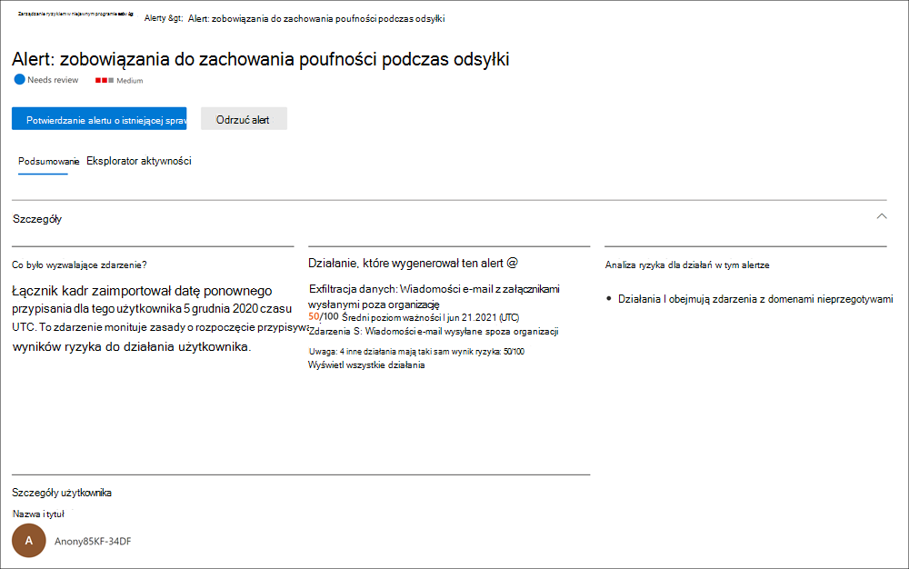

# Dowiedz się więcej o zarządzaniu ryzykiem wewnętrznym

> [!TIP]
> *Czy wiesz, że możesz bezpłatnie wypróbować wersje premium wszystkich dziewięciu rozwiązań Microsoft Purview?* Skorzystaj z 90-dniowej wersji próbnej rozwiązań Purview, aby dowiedzieć się, jak niezawodne możliwości usługi Purview mogą pomóc organizacji spełnić jej potrzeby w zakresie zgodności. Microsoft 365 E3 i Office 365 E3 klienci mogą rozpocząć pracę w [centrum portal zgodności Microsoft Purview prób](https://compliance.microsoft.com/trialHorizontalHub?sku=ComplianceE5&ref=DocsRef). Dowiedz się więcej o [tym, kto może zarejestrować się i zapoznać się z postanowieniami dotyczącymi wersji próbnej](compliance-easy-trials.md).

[!include[Purview banner](../includes/purview-rebrand-banner.md)]

Zarządzanie ryzykiem wewnętrznym w Microsoft Purview to rozwiązanie do zapewniania zgodności, które pomaga zminimalizować ryzyko wewnętrzne, umożliwiając wykrywanie, badanie i działanie na złośliwych i niezamierzonych działaniach w organizacji. Zasady ryzyka dotyczącego informacji poufnych umożliwiają definiowanie typów zagrożeń do identyfikowania i wykrywania w organizacji, w tym działania w sprawach i eskalowanie spraw do usługi Microsoft eDiscovery (Premium) w razie potrzeby. Analitycy ryzyka w organizacji mogą szybko podjąć odpowiednie działania, aby upewnić się, że użytkownicy są zgodni ze standardami zgodności organizacji.

Aby uzyskać więcej informacji i omówienie procesu planowania w celu rozwiązania ryzykownych działań w organizacji, zobacz [Uruchamianie programu do zarządzania ryzykiem wewnętrznym](https://download.microsoft.com/download/b/2/0/b208282a-2482-4986-ba07-15a9b9286df0/pwc-starting-an-insider-risk-management-program-with-pwc-and-microsoft.pdf).

Obejrzyj poniższe filmy wideo, aby dowiedzieć się, jak zarządzanie ryzykiem wewnętrznym może pomóc organizacji w zapobieganiu, wykrywaniu i ograniczaniu ryzyka przy jednoczesnym określaniu priorytetów wartości organizacji, kultury i środowiska użytkownika:
 
 

**Rozwiązanie do zarządzania ryzykiem wewnętrznym & programowanie**:
>[!VIDEO https://www.microsoft.com/videoplayer/embed/RE4j9CN]
 

**Przepływ pracy zarządzania ryzykiem wewnętrznym**:
>[!VIDEO https://www.microsoft.com/videoplayer/embed/RE4OUXB]

Zapoznaj się z [filmem dotyczącym mechaniki firmy Microsoft](https://www.youtube.com/watch?v=Ynkfu8OF0wQ) , w jaki sposób zarządzanie ryzykiem wewnętrznym i zgodność z komunikacją współpracują ze sobą, aby zminimalizować ryzyko związane z danymi ze strony użytkowników w organizacji.

> [!IMPORTANT]
> Zarządzanie ryzykiem wewnętrznym jest obecnie dostępne w dzierżawach hostowanych w regionach geograficznych i krajach obsługiwanych przez zależności usługi platformy Azure. Aby sprawdzić, czy zarządzanie ryzykiem wewnętrznym jest obsługiwane w organizacji, zobacz [Dostępność zależności platformy Azure według kraju/regionu](/troubleshoot/azure/general/dependency-availability-by-country).

## Nowoczesne punkty bólu ryzyka

Zarządzanie ryzykiem w organizacji i minimalizowanie go zaczyna się od zrozumienia typów zagrożeń występujących w nowoczesnym miejscu pracy. Niektóre czynniki ryzyka są spowodowane zdarzeniami zewnętrznymi i czynnikami, które są poza bezpośrednią kontrolą. Inne zagrożenia są spowodowane zdarzeniami wewnętrznymi i działaniami użytkowników, których można zminimalizować i uniknąć. Niektóre przykłady to ryzyko związane z nielegalnym, nieodpowiednim, nieautoryzowanym lub nieetycznym zachowaniem i działaniami użytkowników w organizacji. Te zachowania obejmują szeroki zakres wewnętrznych zagrożeń ze strony użytkowników:

- Wycieki poufnych danych i wyciek danych
- Naruszenia poufności
- Kradzież własności intelektualnej (IP)
- Oszustwa
- Insider trading
- Naruszenia zgodności z przepisami

Użytkownicy w nowoczesnym miejscu pracy mają dostęp do tworzenia i udostępniania danych oraz zarządzania nimi w szerokim spektrum platform i usług. W większości przypadków organizacje mają ograniczone zasoby i narzędzia do identyfikowania i ograniczania ryzyka w całej organizacji, jednocześnie spełniając standardy prywatności użytkowników.

Zarządzanie ryzykiem wewnętrznym korzysta z pełnego zakresu wskaźników usług i innych firm, aby ułatwić szybkie identyfikowanie, klasyfikowanie i działanie na podstawie działań związanych z ryzykiem. Korzystając z dzienników z Microsoft 365 i microsoft Graph, zarządzanie ryzykiem wewnętrznym umożliwia definiowanie określonych zasad w celu identyfikowania wskaźników ryzyka. Te zasady umożliwiają identyfikowanie ryzykownych działań i działanie w celu ograniczenia tych zagrożeń.

Zarządzanie ryzykiem wewnętrznym koncentruje się wokół następujących zasad:

- **Przejrzystość**: równoważenie prywatności użytkowników i ryzyka organizacji za pomocą architektury prywatności według projektu.
- **Konfigurowalne**: konfigurowalne zasady oparte na grupach branżowych, geograficznych i biznesowych.
- **Zintegrowane**: zintegrowany przepływ pracy w rozwiązaniach Microsoft Purview.
- **Możliwość działania**: zapewnia szczegółowe informacje umożliwiające włączanie powiadomień recenzentów, badań danych i badań użytkowników.

## Identyfikowanie potencjalnych zagrożeń za pomocą analizy

Analiza ryzyka dotyczącego informacji poufnych umożliwia przeprowadzenie oceny potencjalnych zagrożeń wewnętrznych w organizacji bez konfigurowania żadnych zasad ryzyka związanego z wewnętrznymi informacjami. Ta ocena może pomóc twojej organizacji zidentyfikować potencjalne obszary o wyższym ryzyku użytkowników i pomóc w określeniu typu i zakresu zasad zarządzania ryzykiem wewnętrznym, które możesz rozważyć skonfigurowanie. Ta ocena może również pomóc w określeniu potrzeb dotyczących dodatkowego licencjonowania lub przyszłej optymalizacji istniejących zasad ryzyka wewnętrznego.

Aby dowiedzieć się więcej na temat analizy ryzyka wewnętrznego, zobacz [Ustawienia zarządzania ryzykiem wewnętrznym: Analiza](insider-risk-management-settings.md#analytics).

## Wprowadzenie z zalecanymi akcjami (wersja zapoznawcza)

Niezależnie od tego, czy konfigurujesz zarządzanie ryzykiem wewnętrznym po raz pierwszy, czy rozpoczynasz tworzenie nowych zasad, nowe [zalecane działania](insider-risk-management-configure.md#recommended-actions-preview) mogą pomóc w jak największym wykorzystanie możliwości zarządzania ryzykiem wewnętrznym. Zalecane akcje obejmują konfigurowanie uprawnień, wybieranie wskaźników zasad, tworzenie zasad i nie tylko.

## Przepływu pracy

Przepływ pracy zarządzania ryzykiem wewnętrznym pomaga identyfikować, badać i podejmować działania w celu rozwiązania problemów związanych z ryzykiem wewnętrznym w organizacji. Dzięki ukierunkowanym szablonom zasad, kompleksowemu sygnalizowaniu aktywności w usłudze Microsoft 365 oraz narzędziom do zarządzania alertami i sprawami możesz użyć szczegółowych informacji umożliwiających podjęcie działań, aby szybko identyfikować ryzykowne zachowanie i działać na ich podstawie.

Identyfikowanie i rozwiązywanie wewnętrznych działań związanych z ryzykiem i problemów ze zgodnością z zarządzaniem ryzykiem wewnętrznym korzysta z następującego przepływu pracy:

### Policies (zasady)

[Zasady zarządzania ryzykiem wewnętrznym](insider-risk-management-policies.md) są tworzone przy użyciu wstępnie zdefiniowanych szablonów i warunków zasad, które definiują, jakie wyzwalające zdarzenia i wskaźniki ryzyka są analizowane w organizacji. Te warunki obejmują sposób, w jaki wskaźniki ryzyka są używane w przypadku alertów, jakie użytkownicy są uwzględniani w zasadach, które usługi mają priorytet oraz okres monitorowania.

Możesz wybrać spośród następujących szablonów zasad, aby szybko rozpocząć pracę z zarządzaniem ryzykiem wewnętrznym:

- [Kradzież danych przez odchodzących użytkowników](insider-risk-management-policies.md#data-theft-by-departing-users)
- [Ogólne przecieki danych](insider-risk-management-policies.md#general-data-leaks)
- [Wycieki danych przez użytkowników o priorytecie (wersja zapoznawcza)](insider-risk-management-policies.md#data-leaks-by-priority-users-preview)
- [Wycieki danych przez niezadowolonych użytkowników (wersja zapoznawcza)](insider-risk-management-policies.md#data-leaks-by-disgruntled-users-preview)
- [Ogólne naruszenia zasad zabezpieczeń (wersja zapoznawcza)](insider-risk-management-policies.md#general-security-policy-violations-preview)
- [Ogólne nieprawidłowe wykorzystanie danych pacjentów (wersja zapoznawcza)](insider-risk-management-policies.md#general-patient-data-misuse-preview)
- [Naruszenia zasad zabezpieczeń przez odchodzących użytkowników (wersja zapoznawcza)](insider-risk-management-policies.md#security-policy-violations-by-departing-users-preview)
- [Naruszenia zasad zabezpieczeń przez użytkowników o priorytecie (wersja zapoznawcza)](insider-risk-management-policies.md#security-policy-violations-by-priority-users-preview)
- [Naruszenia zasad zabezpieczeń przez niezadowolonych użytkowników (wersja zapoznawcza)](insider-risk-management-policies.md#security-policy-violations-by-disgruntled-users-preview)

### Alerty

Alerty są generowane automatycznie przez wskaźniki ryzyka zgodne z warunkami zasad i są wyświetlane na [pulpicie nawigacyjnym alertów](insider-risk-management-activities.md#alert-dashboard). Ten pulpit nawigacyjny umożliwia szybki widok wszystkich alertów wymagających przeglądu, otwierania alertów w czasie i statystyk alertów dla organizacji. Wszystkie alerty zasad są wyświetlane z następującymi informacjami, które ułatwiają szybkie identyfikowanie stanu istniejących alertów i nowych alertów, które wymagają akcji:

- Stan
- Waga
- Wykryto czas
- Przypadku
- Stan sprawy

### Segregowanie

Nowe działania użytkownika wymagające badania automatycznie generują alerty, do których przypisano stan *przeglądu Potrzeb* . Recenzenci mogą szybko identyfikować i przeglądać, oceniać i klasyfikować te alerty.

Alerty są rozwiązywane przez otwarcie nowego przypadku, przypisanie alertu do istniejącego przypadku lub odrzucenie alertu. Dzięki filtrom alertów można łatwo szybko identyfikować alerty według stanu, ważności lub czasu wykrycia. W ramach procesu klasyfikacji recenzenci mogą wyświetlać szczegóły alertów dla działań zidentyfikowanych przez zasady, wyświetlać działania użytkowników skojarzone z dopasowaniem zasad, wyświetlać ważność alertu i przeglądać informacje o profilu użytkownika.

### Zbadaj

Szybko zbadaj wszystkie działania wybranego użytkownika za pomocą [raportów aktywności użytkownika (wersja zapoznawcza).](insider-risk-management-activities.md#user-activity-reports-preview) Raporty te umożliwiają badaczom w organizacji badanie działań dla określonych użytkowników przez określony okres bez konieczności tymczasowego lub jawnego przypisywania ich do zasad zarządzania ryzykiem wewnętrznym. Po zbadaniu działań dla użytkownika badacze mogą odrzucić poszczególne działania jako łagodne, udostępnić lub wysłać link do raportu e-mail z innymi badaczami lub zdecydować się na tymczasowe lub jawne przypisanie użytkownika do zasad zarządzania ryzykiem wewnętrznym.

[Tworzone są przypadki](insider-risk-management-cases.md) alertów, które wymagają dokładniejszego przeglądu i zbadania szczegółów działania i okoliczności związanych z dopasowaniem zasad. **Pulpit nawigacyjny Case** udostępnia cały widok wszystkich aktywnych przypadków, otwartych przypadków w czasie i statystyki przypadków dla organizacji. Recenzenci mogą szybko filtrować przypadki według stanu, daty otwarcia sprawy i daty ostatniej aktualizacji sprawy.

Wybranie sprawy na pulpicie nawigacyjnym sprawy otwiera sprawę do zbadania i przeglądu. Ten krok jest sercem przepływu pracy zarządzania ryzykiem wewnętrznym. W tym obszarze działania związane z ryzykiem, warunki zasad, szczegóły alertów i szczegóły użytkownika są syntetyzowane w zintegrowany widok dla recenzentów. Podstawowe narzędzia do badania w tym obszarze to:

- **Aktywność użytkownika**: aktywność użytkownika jest automatycznie wyświetlana na interaktywnym wykresie, który kreśli działania w czasie i według poziomu ryzyka dla bieżących lub przeszłych działań związanych z ryzykiem. Recenzenci mogą szybko filtrować i wyświetlać całą historię ryzyka dla użytkownika i przechodzić do szczegółów określonych działań.
- **Eksplorator zawartości**: wszystkie pliki danych i wiadomości e-mail skojarzone z działaniami alertów są automatycznie przechwytywane i wyświetlane w Eksploratorze zawartości. Recenzenci mogą filtrować i wyświetlać pliki i komunikaty według źródła danych, typu pliku, tagów, konwersacji i wielu innych atrybutów.
- **Uwagi dotyczące przypadku**: recenzenci mogą podać uwagi dotyczące sprawy w sekcji Noty o przypadku. Ta lista konsoliduje wszystkie notatki w widoku centralnym i uwzględnia informacje przesłane przez recenzenta i datę.

Ponadto nowy [dziennik inspekcji (wersja zapoznawcza)](insider-risk-management-audit-log.md) umożliwia informowanie o akcjach, które zostały podjęte w przypadku funkcji zarządzania ryzykiem wewnętrznym. Ten zasób umożliwia niezależny przegląd akcji wykonywanych przez użytkowników przypisanych do co najmniej jednej grupy ról zarządzania ryzykiem wewnętrznym.

### Akcja

Po zbadaniu spraw recenzenci mogą szybko podjąć działania w celu rozwiązania problemu lub współpracy z innymi uczestnikami projektu ryzyka w organizacji. Jeśli użytkownicy przypadkowo lub nieumyślnie naruszają warunki zasad, do użytkownika można wysłać proste powiadomienie o przypomnieniu z szablonów powiadomień, które można dostosować dla swojej organizacji. Te powiadomienia mogą służyć jako proste przypomnienia lub mogą skierować użytkownika do odświeżenia szkolenia lub wskazówek, które pomogą zapobiec przyszłemu ryzykownemu zachowaniu. Aby uzyskać więcej informacji, zobacz [Szablony powiadomień dotyczących zarządzania ryzykiem wewnętrznym](insider-risk-management-notices.md).

W poważniejszych sytuacjach może być konieczne udostępnienie informacji o przypadku zarządzania ryzykiem wewnętrznym innym recenzentom lub usługom w organizacji. Zarządzanie ryzykiem wewnętrznym jest ściśle zintegrowane z innymi rozwiązaniami Microsoft Purview, które ułatwiają kompleksowe rozwiązywanie ryzyka.

- **eDiscovery (Premium)**: Eskalacja sprawy do zbadania umożliwia przesyłanie danych i zarządzanie sprawą w celu Microsoft Purview zbierania elektronicznych materiałów dowodowych (Premium). Funkcja zbierania elektronicznych materiałów dowodowych (Premium) zapewnia kompleksowy przepływ pracy umożliwiający zachowanie, zbieranie, przeglądanie, analizowanie i eksportowanie zawartości, która odpowiada na wewnętrzne i zewnętrzne badania organizacji. Umożliwia zespołom prawnym zarządzanie całym przepływem pracy powiadomień o blokadzie prawnej. Aby dowiedzieć się więcej na temat przypadków zbierania elektronicznych materiałów dowodowych (Premium), zobacz [Omówienie Microsoft Purview eDiscovery (Premium)](overview-ediscovery-20.md).
- **integracja interfejsów API zarządzania Office 365 (wersja zapoznawcza)**: zarządzanie ryzykiem wewnętrznym obsługuje eksportowanie informacji o alertach do usług zarządzania informacjami o zabezpieczeniach i zdarzeniami (SIEM) za pośrednictwem interfejsów API zarządzania Office 365. Dostęp do informacji o alertach na platformie najlepiej pasuje do procesów ryzyka organizacji, co zapewnia większą elastyczność w sposobie działania na działaniach związanych z ryzykiem. Aby dowiedzieć się więcej na temat eksportowania informacji o alertach za pomocą interfejsów API zarządzania Office 365, zobacz [Eksportowanie alertów](insider-risk-management-settings.md#export-alerts).

> [!NOTE]
> Dziękujemy za opinię i pomoc techniczną w wersji zapoznawczej łącznika usługi ServiceNow. 30 listopada 2020 r. postanowiliśmy zakończyć wersję zapoznawczą łącznika usługi ServiceNow i zakończyć obsługę zarządzania ryzykiem wewnętrznym. Aktywnie oceniamy alternatywne metody, aby zapewnić klientom integrację z usługą ServiceNow w ramach zarządzania ryzykiem wewnętrznym.

## Scenariuszy

Zarządzanie ryzykiem wewnętrznym może pomóc w wykrywaniu, badaniu i podejmowania działań w celu ograniczenia ryzyka wewnętrznego w organizacji w kilku typowych scenariuszach:

### Kradzież danych przez odchodzących użytkowników

Gdy użytkownicy opuszczają organizację, dobrowolnie lub w wyniku rozwiązania umowy, często istnieją uzasadnione obawy, że dane firmowe, dane klientów i użytkowników są zagrożone. Użytkownicy mogą niewinnie zakładać, że dane projektu nie są własnością lub mogą być skłonni do podejmowania danych firmowych w celu uzyskania osobistych korzyści oraz z naruszeniem zasad firmy i standardów prawnych. Zasady zarządzania ryzykiem wewnętrznym, które używają szablonu zasad [kradzieży danych przez odchodzących użytkowników](insider-risk-management-policies.md#policy-templates) , automatycznie wykrywają działania zwykle związane z tego typu kradzieżą. Dzięki tym zasadom automatycznie będziesz otrzymywać alerty dotyczące podejrzanych działań związanych z kradzieżą danych przez odchodzących użytkowników, aby umożliwić podjęcie odpowiednich działań dochodzeniowych. Konfigurowanie [łącznika Microsoft 365 HR](import-hr-data.md) dla organizacji jest wymagane dla tego szablonu zasad.

### Celowy lub niezamierzony wyciek informacji poufnych lub poufnych

W większości przypadków użytkownicy starają się jak najlepiej obsługiwać poufne lub poufne informacje. Jednak czasami użytkownicy mogą popełniać błędy, a informacje są przypadkowo udostępniane poza organizacją lub z naruszeniem zasad ochrony informacji. W innych okolicznościach użytkownicy mogą celowo wyciekać lub udostępniać poufne i poufne informacje ze złośliwym zamiarem i w celu uzyskania potencjalnych korzyści osobistych. Zasady zarządzania ryzykiem wewnętrznym utworzone przy użyciu następujących szablonów zasad wycieków danych automatycznie wykrywają działania zwykle skojarzone z udostępnianiem informacji poufnych lub poufnych:

- [Ogólne przecieki danych](insider-risk-management-policies.md#general-data-leaks)
- [Wycieki danych przez użytkowników o priorytecie (wersja zapoznawcza)](insider-risk-management-policies.md#data-leaks-by-priority-users-preview)
- [Wycieki danych przez niezadowolonych użytkowników (wersja zapoznawcza)](insider-risk-management-policies.md#data-leaks-by-disgruntled-users-preview)

## Zamierzone lub niezamierzone naruszenia zasad zabezpieczeń (wersja zapoznawcza)

Użytkownicy zazwyczaj mają duży stopień kontroli podczas zarządzania swoimi urządzeniami w nowoczesnym miejscu pracy. Ta kontrolka może obejmować uprawnienia do instalowania lub odinstalowywania aplikacji wymaganych do wykonywania swoich obowiązków lub możliwość tymczasowego wyłączania funkcji zabezpieczeń urządzeń. Niezależnie od tego, czy to działanie jest przypadkowe, przypadkowe czy złośliwe, takie zachowanie może stanowić zagrożenie dla twojej organizacji i jest ważne, aby zidentyfikować i podjąć działania w celu zminimalizowania. Aby ułatwić tożsamość tych ryzykownych działań związanych z zabezpieczeniami, następujące szablony zasad zabezpieczeń zarządzania ryzykiem wewnętrznym oceniają wskaźniki ryzyka bezpieczeństwa i używają alertów Ochrona punktu końcowego w usłudze Microsoft Defender w celu zapewnienia szczegółowych informacji dotyczących działań związanych z zabezpieczeniami:

- [Ogólne naruszenia zasad zabezpieczeń (wersja zapoznawcza)](insider-risk-management-policies.md#general-security-policy-violations-preview)
- [Naruszenia zasad zabezpieczeń przez odchodzących użytkowników (wersja zapoznawcza)](insider-risk-management-policies.md#security-policy-violations-by-departing-users-preview)
- [Naruszenia zasad zabezpieczeń przez użytkowników o priorytecie (wersja zapoznawcza)](insider-risk-management-policies.md#security-policy-violations-by-priority-users-preview)
- [Naruszenia zasad zabezpieczeń przez niezadowolonych użytkowników (wersja zapoznawcza)](insider-risk-management-policies.md#security-policy-violations-by-disgruntled-users-preview)

## Zasady dla użytkowników na podstawie pozycji, poziomu dostępu lub historii ryzyka (wersja zapoznawcza)

Użytkownicy w organizacji mogą mieć różne poziomy ryzyka w zależności od ich pozycji, poziomu dostępu do informacji poufnych lub historii ryzyka. Ta struktura może obejmować członków zespołu kierowniczego organizacji, administratorów IT, którzy mają rozległe uprawnienia dostępu do danych i sieci, lub użytkowników z przeszłością ryzykownych działań. W takich okolicznościach dokładniejsza kontrola i bardziej agresywne ocenianie ryzyka są ważne, aby ułatwić wykrycie alertów w celu przeprowadzenia badania i szybkiego działania. Aby ułatwić identyfikowanie ryzykownych działań dla tych typów użytkowników, można utworzyć grupy użytkowników o priorytecie i utworzyć zasady na podstawie następujących szablonów zasad:

- [Naruszenia zasad zabezpieczeń przez użytkowników o priorytecie (wersja zapoznawcza)](insider-risk-management-policies.md#security-policy-violations-by-priority-users-preview)
- [Wycieki danych przez użytkowników o priorytecie (wersja zapoznawcza)](insider-risk-management-policies.md#data-leaks-by-priority-users-preview)

## Opieka zdrowotna (wersja zapoznawcza)

W przypadku organizacji w branży opieki zdrowotnej ostatnie badania wykazały bardzo wysoki wskaźnik naruszeń danych związanych z informacjami poufnymi. Wykrywanie niewłaściwego wykorzystania danych pacjentów i informacji o rejestrze zdrowia jest kluczowym elementem ochrony prywatności pacjentów i przestrzegania przepisów dotyczących zgodności, takich jak ustawa o przenośności i odpowiedzialności ubezpieczeń zdrowotnych (HIPAA) oraz ustawa o technologii informacyjnej o zdrowiu i zdrowiu klinicznym (HITECH). Nieprawidłowe wykorzystanie danych pacjentów może się wahać od uzyskiwania dostępu do uprzywilejowanych rejestrów pacjentów po uzyskiwanie dostępu do rejestrów pacjentów z rodziny lub sąsiadów ze złośliwym zamiarem. Aby ułatwić tożsamość tego typu ryzykownych działań, następujące szablony zasad zarządzania ryzykiem wewnętrznym używają łącznika Microsoft 365 HR i łącznika danych specyficznego dla opieki zdrowotnej, aby rozpocząć ocenianie wskaźników ryzyka związanych z zachowaniami, które mogą wystąpić w systemach elektronicznego rekordu wrzosowiska (EHR):

- [Ogólne nieprawidłowe wykorzystanie danych pacjentów (wersja zapoznawcza)](insider-risk-management-policies.md#general-patient-data-misuse-preview)

## Akcje i zachowania niezadowolonych użytkowników (wersja zapoznawcza)

Zatrudnienie podkreśla, że zdarzenia mogą mieć wpływ na zachowanie użytkowników na kilka sposobów, które odnoszą się do ryzyka związanego z wewnętrznymi informacjami. Te czynniki stresorowe mogą być złym przeglądem wydajności, degradacją pozycji lub umieszczaniem użytkownika w planie przeglądu wydajności. Chociaż większość użytkowników nie reaguje złośliwie na te zdarzenia, stres związany z tymi akcjami może spowodować, że niektórzy użytkownicy podejmą działania, których zwykle nie rozważą w normalnych okolicznościach. Aby ułatwić tożsamość tego typu ryzykownych działań, następujące szablony zasad zarządzania ryzykiem wewnętrznym używają łącznika Microsoft 365 HR i rozpoczynają ocenianie wskaźników ryzyka związanych z zachowaniami, które mogą wystąpić w pobliżu zdarzeń stresorów związanych z zatrudnieniem:

- [Wycieki danych przez niezadowolonych użytkowników (wersja zapoznawcza)](insider-risk-management-policies.md#data-leaks-by-disgruntled-users-preview)
- [Naruszenia zasad zabezpieczeń przez niezadowolonych użytkowników (wersja zapoznawcza)](insider-risk-management-policies.md#security-policy-violations-by-disgruntled-users-preview)

## Chcesz rozpocząć pracę?

- Zobacz [Planowanie zarządzania ryzykiem wewnętrznym](insider-risk-management-plan.md) , aby dowiedzieć się, jak przygotować się do włączenia zasad zarządzania ryzykiem wewnętrznym w organizacji.
- Zobacz [Wprowadzenie z ustawieniami zarządzania ryzykiem wewnętrznym](insider-risk-management-settings.md), aby skonfigurować ustawienia globalne dla zasad ryzyka wewnętrznych.
- Zobacz [Wprowadzenie z zarządzaniem ryzykiem wewnętrznym](insider-risk-management-configure.md), aby skonfigurować wymagania wstępne, utworzyć zasady i rozpocząć otrzymywanie alertów.
