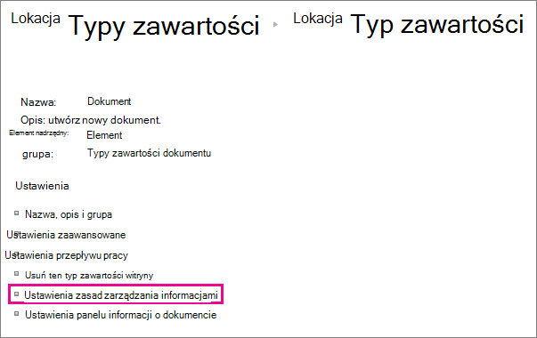

# Wprowadzenie do zasad zarządzania informacjami

Zasady zarządzania informacjami są zestawem reguł dla typu zawartości. Zasady zarządzania informacjami umożliwiają organizacjom kontrolowanie i śledzenie czynności, takich jak czas przechowywania zawartości lub akcje, które użytkownicy mogą podjąć w  przypadku tej zawartości. Zasady zarządzania informacjami mogą ułatwić organizacjom przestrzeganie zgodności z przepisami ustawowymi lub rządowymi, a także wyegzekwować wewnętrzne procesy biznesowe. 
  
Na przykład organizacja, która musi postępować zgodnie z przepisami rządowymi wymagającymi, aby przedstawiała odpowiednie mechanizmy kontroli wyciągów finansowych, może utworzyć jedną lub więcej zasad zarządzania informacjami, które przejmują określone działania w procesie tworzenia i zatwierdzania we wszystkich dokumentach związanych z dokumentami związanymi z dokumentami finansowymi.
  
Aby uzyskać tworzyć i stosować zasady zarządzania informacjami, zobacz Tworzenie [i stosowanie zasad zarządzania informacjami](create-info-mgmt-policies.md).
  
## Funkcje zasad zarządzania informacjami

Istnieją cztery podstawowe kategorie wstępnie zdefiniowanych funkcji zasad, których organizacje mogą używać pojedynczo lub w połączeniu do zarządzania zawartością i procesami. 
  

  
Funkcja zasad inspekcji ułatwia organizacjom analizowanie sposobu, w jaki ich systemy zarządzania zawartością są używane przez rejestrowanie zdarzeń i operacji wykonywanych na dokumentach i elementach list. Funkcję zasad inspekcji można skonfigurować w taki sposób, aby rejestrować zdarzenia, takie jak edytowanie, wyświetlanie, zaewidencjonowanie, wyewidencjonowanie, wyewidencjonowanie lub usunięcie dokumentu bądź zmiana jego uprawnień. Wszystkie informacje inspekcji są przechowywane w jednym dzienniku inspekcji na serwerze i administratorzy witryn mogą na nim uruchamiać raporty. 
  
Funkcja zasad wygasania ułatwia organizacjom usuwanie z witryn treści, które są już aktualne, w spójny i śledzalny sposób. Ułatwia to zarządzanie zarówno kosztem, jak i ryzykiem związanym z zachowaniem aktualnej zawartości. Zasady wygasania można skonfigurować tak, aby określone typy zawartości wygasały w określonym dniu lub w okresie od utworzenia lub ostatniej modyfikacji dokumentu.
  
Organizacje mogą również tworzyć i wdrażać funkcje zasad niestandardowych dostosowanych do określonych potrzeb. Na przykład organizacja produkcyjna może zdefiniować zasady zarządzania informacjami dla wszystkich dokumentów specyfikacji projektu produktu, które zabraniają użytkownikom drukowania kopii tych dokumentów na drukarkach niezabezpieczonych. Aby zdefiniować zasady zarządzania informacjami tego rodzaju, możesz utworzyć i wdrożyć funkcję zasad ograniczeń drukowania, która będzie można dodać do odpowiednich zasad zarządzania informacjami dla typu zawartości specyfikacji projektu produktu.
  
## Lokalizacje do używania zasad zarządzania informacjami

Aby wdrożyć zasady zarządzania informacjami, należy dodać je do listy, biblioteki lub typu zawartości w witrynie. Lokalizacja, w której tworzysz lub dodajesz zasady zarządzania informacjami, wpływa na to, jak ogólnie te zasady są stosowane lub jak ogólnie mogą być używane. Można:
  
 **Tworzenie zasad zbioru witryn, a następnie dodawanie tych zasad do typu zawartości, listy lub biblioteki** Zasady zbioru witryn można utworzyć na liście Zasady w witrynie najwyższego poziomu w zbiorze witryn. Po utworzeniu zasad zbioru witryn można je wyeksportować, aby administratorzy innych zbiorów witryn mogą je zaimportować do swojej listy Zasady. Utworzenie zasad zbioru witryn, które można wyeksportować, umożliwia ujednolicenie zasad zarządzania informacjami w witrynach w organizacji. 
  
Po dodaniu zasad zbioru witryn do typu zawartości witryny i dodawania wystąpienia tego typu zawartości witryny do listy lub biblioteki właściciel tej listy lub biblioteki nie może modyfikować zasad zbioru witryn dla tej listy lub biblioteki. Dodanie zasad zbioru witryn do typu zawartości witryny to dobry sposób na upewnianie się, że zasady zbioru witryn są wymuszane na każdym poziomie hierarchii witryn.
  

  
 **Tworzenie zasad zarządzania informacjami** dla typu zawartości witryny w galerii typów zawartości witryny najwyższego poziomu, a następnie dodawanie tego typu zawartości do jednej lub większej liczby list lub bibliotek Można również utworzyć zasady zarządzania informacjami bezpośrednio dla typu zawartości witryny, a następnie skojarzyć wystąpienie tego typu zawartości z wieloma listami lub bibliotekami. Jeśli utworzysz zasady zarządzania informacjami w ten sposób, zasady będą dziedziczone po tym typie zawartości każdy element zbioru witryn tego typu zawartości lub typ zawartości dziedziczący po tym typie zawartości. Jeśli jednak utworzysz zasady zarządzania informacjami bezpośrednio dla typu zawartości witryny, trudniej jest ponownie użyć tych zasad zarządzania informacjami w innych zbiorach witryn, ponieważ zasad utworzonych w ten sposób nie można wyeksportować. 
  

  

  
Uwaga Aby określić zasady używane w zbiorze witryn, administratorzy zbioru witryn mogą wyłączyć możliwość ustawienia funkcji zasad bezpośrednio w typie zawartości. Gdy to ograniczenie dzieje się, użytkownicy tworzący typy zawartości mogą wybierać zasady z listy Zasady zbioru witryn.
  
 **Tworzenie zasad zarządzania informacjami dla listy lub biblioteki** Jeśli Twoja organizacja musi zastosować określone zasady zarządzania informacjami do bardzo ograniczonego zestawu zawartości, możesz utworzyć zasady zarządzania informacjami, które będą stosowane tylko do poszczególnych list lub bibliotek. Ta metoda tworzenia zasad zarządzania informacjami jest najmniej elastyczna, ponieważ zasady te mają zastosowanie tylko do jednej lokalizacji i nie można ich eksportować ani ponownie używać w innych lokalizacjach. Czasem jednak może być konieczne utworzenie unikatowych zasad zarządzania informacjami o ograniczonej możliwości stosowania w konkretnych sytuacjach. 
  

  
Uwagi 
  
Zasady zarządzania informacjami dla listy lub biblioteki można tworzyć tylko wtedy, gdy ta lista lub biblioteka nie obsługuje wielu typów zawartości. Jeśli lista lub biblioteka obsługuje wiele typów zawartości, należy zdefiniować zasady zarządzania informacjami dla każdego typu zawartości listy skojarzonego z tą listą lub biblioteką. (Wystąpienia typu zawartości witryny skojarzone z określoną listą lub biblioteką są nazywane typami zawartości listy).
  
Aby określić zasady używane w zbiorze witryn, administratorzy zbioru witryn mogą wyłączyć możliwość ustawienia funkcji zasad bezpośrednio na liście lub w bibliotece. Gdy to ograniczenie jest w mocy, użytkownicy, którzy zarządzają listami lub bibliotekami, mogą wybierać zasady z listy Zasady zbioru witryn.
  
[Zasady zarządzania informacjami są zestawem reguł dla typu zawartości. Zasady zarządzania informacjami umożliwiają organizacjom kontrolowanie i śledzenie czynności, takich jak czas przechowywania zawartości lub akcje, które użytkownicy mogą podjąć w  przypadku tej zawartości. Zasady zarządzania informacjami mogą ułatwić organizacjom przestrzeganie zgodności z przepisami ustawowymi lub rządowymi, a także wyegzekwować wewnętrzne procesy biznesowe. Na przykład organizacja, która musi postępować zgodnie z przepisami rządowymi wymagającymi, aby przedstawiała odpowiednie mechanizmy kontroli wyciągów finansowych, może utworzyć jedną lub więcej zasad zarządzania informacjami, które przejmują określone działania w procesie tworzenia i zatwierdzania we wszystkich dokumentach związanych z dokumentami związanymi z dokumentami finansowymi. Aby uzyskać tworzyć i stosować zasady zarządzania informacjami, zobacz Tworzenie i stosowanie zasad zarządzania informacjami.](intro-to-info-mgmt-policies.md#__top)
  

