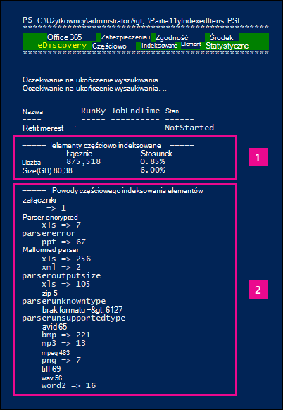

# <a name="investigating-partially-indexed-items-in-ediscovery"></a>Badanie częściowo zaindeksowanych elementów w środowisku zbierania elektronicznych materiałów dowodowych

Wyszukiwanie zbierania elektronicznych materiałów dowodowych uruchamiane z portal zgodności Microsoft Purview automatycznie uwzględnia częściowo indeksowane elementy w szacowanych wynikach wyszukiwania podczas uruchamiania wyszukiwania. Częściowo indeksowane elementy to elementy skrzynki pocztowej programu Exchange i dokumenty w programie SharePoint i witrynach OneDrive dla Firm, które z jakiegoś powodu nie zostały całkowicie zindeksowane do wyszukiwania. Większość wiadomości e-mail i dokumentów witryny jest pomyślnie indeksowana, ponieważ mieszczą się one w [limitach indeksowania dla wiadomości e-mail](limits-for-content-search.md#indexing-limits-for-email-messages). Jednak niektóre elementy mogą przekroczyć te limity indeksowania i zostaną częściowo zindeksowane. Poniżej przedstawiono inne powody, dla których nie można indeksować elementów do wyszukiwania i są zwracane jako częściowo indeksowane elementy podczas uruchamiania wyszukiwania zbierania elektronicznych materiałów dowodowych:
  
- Wiadomości e-mail mają dołączony plik, który nie może być otwarty; Jest to najczęstsza przyczyna częściowo indeksowanych elementów wiadomości e-mail.

- Zbyt wiele plików dołączonych do wiadomości e-mail.

- Plik dołączony do wiadomości e-mail jest zbyt duży.

- Typ pliku jest obsługiwany w przypadku indeksowania, ale wystąpił błąd indeksowania dla określonego pliku.

Mimo że jest ona różna, większość klientów organizacji ma mniej niż 1% zawartości według woluminu i mniej niż 12% zawartości według rozmiaru, który jest częściowo indeksowany. Przyczyną różnicy między woluminem a rozmiarem jest to, że większe pliki mają większe prawdopodobieństwo, że zawierają zawartość, która nie może być całkowicie zindeksowana.
  
## <a name="why-does-the-partially-indexed-item-count-change-for-a-search"></a>Dlaczego liczba częściowo indeksowanych elementów zmienia się dla wyszukiwania?

Po uruchomieniu wyszukiwania zbierania elektronicznych materiałów dowodowych całkowita liczba i rozmiar częściowo indeksowanych elementów w wyszukiwanych lokalizacjach są wyświetlane w statystykach wyników wyszukiwania, które są wyświetlane w szczegółowych statystykach wyszukiwania. Należy pamiętać, że w statystykach wyszukiwania są one  *nazywane elementami niezawłaszczonymi*  . Oto kilka elementów, które będą miały wpływ na liczbę częściowo indeksowanych elementów zwracanych w wynikach wyszukiwania:
  
- Jeśli element jest częściowo indeksowany i jest zgodny z zapytaniem wyszukiwania, jest on uwzględniony zarówno w liczbie (i rozmiarze) elementów wyników wyszukiwania, jak i częściowo indeksowanych elementów. Jednak po wyeksportowaniu wyników tego samego wyszukiwania element jest dołączany tylko do zestawu wyników wyszukiwania; nie jest uwzględniony jako częściowo zaindeksowany element.

- Częściowo indeksowane elementy znajdujące się w witrynach programu SharePoint i OneDrive *nie są* uwzględniane w szacowaniu częściowo indeksowanych elementów wyświetlanych w szczegółowych statystykach wyszukiwania. Jednak częściowo indeksowane elementy można eksportować podczas eksportowania wyników wyszukiwania zbierania elektronicznych materiałów dowodowych. Jeśli na przykład wyszukasz tylko witryny, szacowana liczba częściowo zaindeksowanych elementów będzie równa zero.
  
## <a name="calculating-the-ratio-of-partially-indexed-items-in-your-organization"></a>Obliczanie stosunku częściowo indeksowanych elementów w organizacji

Aby zrozumieć narażenie organizacji na częściowo indeksowane elementy, możesz uruchomić wyszukiwanie całej zawartości we wszystkich skrzynkach pocztowych (przy użyciu pustego zapytania kluczowego). W poniższym przykładzie istnieje 1 629 904 (146,46 GB) w pełni zaindeksowanych elementów i 10 025 (10,27 GB) częściowo indeksowanych elementów.
  

  
Procent częściowo indeksowanych elementów można określić, korzystając z poniższych obliczeń.
  
 **Aby obliczyć stosunek częściowo indeksowanych elementów w organizacji:**

`(Total number of partially indexed items/Total number of items) x 100`

`(10025/1629904) x 100 = 0.62%`

Korzystając z wyników wyszukiwania z poprzedniego przykładu, 0,62% wszystkich elementów skrzynek pocztowych jest częściowo indeksowanych.
  
 **Aby obliczyć procent rozmiaru częściowo indeksowanych elementów w organizacji:**

`(Size of all partially indexed items/Size of all items) x 100`

`(10.27 GB/146.46 GB) x 100 = 7.0%`

W poprzednim przykładzie 7% całkowitego rozmiaru elementów skrzynki pocztowej pochodzi z częściowo indeksowanych elementów. Jak wspomniano wcześniej, większość klientów organizacji ma mniej niż 1% zawartości według woluminu i mniej niż 12% zawartości według rozmiaru, który jest częściowo indeksowany.

## <a name="working-with-partially-indexed-items"></a>Praca z częściowo indeksowanymi elementami

W przypadkach, gdy trzeba zbadać częściowo zaindeksowane elementy, aby sprawdzić, czy nie zawierają one odpowiednich informacji, można [wyeksportować raport wyszukiwania zawartości](export-a-content-search-report.md) zawierający informacje o częściowo indeksowanych elementach. Podczas eksportowania raportu wyszukiwania zawartości należy wybrać jedną z opcji eksportu, która zawiera częściowo indeksowane elementy.
  

  
Podczas eksportowania wyników wyszukiwania zbierania elektronicznych materiałów dowodowych lub raportu wyszukiwania przy użyciu jednej z tych opcji eksport obejmuje raport o nazwie Unindexed Items.csv. Ten raport zawiera większość tych samych informacji co plik ResultsLog.csv; Jednak plik Items.csv Unindexed zawiera również dwa pola związane z częściowo indeksowanymi elementami: **Tagi błędów** i **Właściwości błędu**. Te pola zawierają informacje o błędzie indeksowania dla każdego częściowo zaindeksowanego elementu. Użycie informacji w tych dwóch polach może pomóc w określeniu, czy błąd indeksowania dla konkretnego wpływu na badanie. 

> [!NOTE]
> Plik Items.csv Unindexed zawiera również pola o nazwach **Error Type (Typ błędu** ) i **Error Message (Komunikat o błędzie**). Są to starsze pola zawierające informacje podobne do informacji w polach **Tagi błędów** i **Właściwości błędu** , ale z mniej szczegółowymi informacjami. Możesz bezpiecznie zignorować te starsze pola.
  
## <a name="errors-related-to-partially-indexed-items"></a>Błędy związane z częściowo indeksowanymi elementami

Tagi błędów składają się z dwóch informacji: błędu i typu pliku. Na przykład w tej parze błąd/typ pliku:

```text
 parseroutputsize_xls
```

 `parseroutputsize` to błąd i `xls` jest typem pliku, w przypadku którego wystąpił błąd. W przypadkach, gdy typ pliku nie został rozpoznany lub typ pliku nie został zastosowany do błędu, zostanie wyświetlona wartość `noformat` zamiast typu pliku.
  
Poniżej znajduje się lista błędów indeksowania i opis możliwej przyczyny błędu.
  
| Tag błędu | Opis |
|:-----|:-----|
| `attachmentcount` <br/> |Wiadomość e-mail miała zbyt wiele załączników, a niektóre z tych załączników nie zostały przetworzone.  <br/> |
| `attachmentdepth` <br/> |Podczas pobierania zawartości i analizatora dokumentów znaleziono zbyt wiele poziomów załączników zagnieżdżonych wewnątrz innych załączników. Niektóre z tych załączników nie zostały przetworzone.  <br/> |
| `attachmentrms` <br/> |Dekodowanie załącznika nie powiodło się, ponieważ był chroniony przez usługę RMS.  <br/> |
| `attachmentsize` <br/> |Plik dołączony do wiadomości e-mail był zbyt duży i nie można go przetworzyć.  <br/> |
| `indexingtruncated` <br/> |Podczas pisania przetworzonej wiadomości e-mail do indeksu jedna z właściwości indeksowalnych była zbyt duża i została obcięta. Obcięte właściwości są wymienione w polu Właściwości błędu.  <br/> |
| `invalidunicode` <br/> |Wiadomość e-mail zawierała tekst, którego nie można przetworzyć jako prawidłowego unicode. Indeksowanie dla tego elementu może być niekompletne.  <br/> |
| `parserencrypted` <br/> |Zawartość załącznika lub wiadomości e-mail jest szyfrowana, a platforma Microsoft 365 nie może odkodować zawartości.  <br/> |
| `parsererror` <br/> |Wystąpił nieznany błąd podczas analizowania. Zazwyczaj wynika to z usterki oprogramowania lub awarii usługi.  <br/> |
| `parserinputsize` <br/> |Załącznik był zbyt duży, aby można było obsłużyć analizator, a analizowanie tego załącznika nie nastąpiło lub nie zostało ukończone.  <br/> |
| `parsermalformed` <br/> |Załącznik został źle sformułowany i nie może być obsługiwany przez analizator. Ten wynik może być spowodowany starymi formatami plików, plikami utworzonymi przez niezgodne oprogramowanie lub wirusami udającymi coś innego niż deklarowane.  <br/> |
| `parseroutputsize` <br/> |Dane wyjściowe analizy załącznika były zbyt duże i musiały zostać obcięte.  <br/> |
| `parserunknowntype` <br/> |Załącznik miał typ pliku, którego platforma Microsoft 365 nie mogła wykryć.  <br/> |
| `parserunsupportedtype` <br/> |Załącznik miał typ pliku, który Office 365 mógł wykryć, ale analizowanie tego typu pliku nie jest obsługiwane.  <br/> |
| `propertytoobig` <br/> |Wartość właściwości poczty e-mail w sklepie Exchange Była zbyt duża, aby można było ją pobrać i nie można było przetworzyć wiadomości. Zwykle dotyczy to tylko właściwości treści wiadomości e-mail.  <br/> |
| `retrieverrms` <br/> |Pobieranie zawartości nie może odkodować wiadomości chronionej przez usługę RMS.  <br/> |
| `wordbreakertruncated` <br/> |Podczas indeksowania zidentyfikowano zbyt wiele słów w dokumencie. Przetwarzanie właściwości zostało zatrzymane po osiągnięciu limitu, a właściwość jest obcinana.  <br/> |

Pola błędów opisują pola, na które ma wpływ błąd przetwarzania wymieniony w polu Tagi błędów. Jeśli wyszukujesz właściwość, taką jak  `subject` lub  `participants`, błędy w treści wiadomości nie będą miały wpływu na wyniki wyszukiwania. Może to być przydatne podczas określania dokładnie, które częściowo indeksowane elementy mogą być konieczne do dalszego zbadania.

<!--
## Using a PowerShell script to determine your organization's exposure to partially indexed email items

The following steps show you how to run a PowerShell script that searches for all items in all Exchange mailboxes, and then generates a report about your organization's ratio of partially indexed email items (by count and by size) and displays the number of items (and their file type) for each indexing error that occurs. Use the error tag descriptions in the previous section to identify the indexing error.
  
1. Save the following text to a Windows PowerShell script file by using a filename suffix of .ps1; for example, `PartiallyIndexedItems.ps1`.

   ```powershell
     write-host "**************************************************"
     write-host "     Security & Compliance PowerShell      " -foregroundColor yellow -backgroundcolor darkgreen
     write-host "   eDiscovery Partially Indexed Item Statistics   " -foregroundColor yellow -backgroundcolor darkgreen
     write-host "**************************************************"
     " " 
     # Create a search with Error Tags Refinders enabled
     Remove-ComplianceSearch "RefinerTest" -Confirm:$false -ErrorAction 'SilentlyContinue'
     New-ComplianceSearch -Name "RefinerTest" -ContentMatchQuery "size>0" -RefinerNames ErrorTags -ExchangeLocation ALL
     Start-ComplianceSearch "RefinerTest"
     # Loop while search is in progress
     do{
         Write-host "Waiting for search to complete..."
         Start-Sleep -s 5
         $complianceSearch = Get-ComplianceSearch "RefinerTest"
     }while ($complianceSearch.Status -ne 'Completed')
     $refiners = $complianceSearch.Refiners | ConvertFrom-Json
     $errorTagProperties = $refiners.Entries | Get-Member -MemberType NoteProperty
     $partiallyIndexedRatio = $complianceSearch.UnindexedItems / $complianceSearch.Items
     $partiallyIndexedSizeRatio = $complianceSearch.UnindexedSize / $complianceSearch.Size
     " "
     "===== Partially indexed items ====="
     "         Total          Ratio"
     "Count    {0:N0}{1:P2}" -f $complianceSearch.Items.ToString("N0").PadRight(15, " "), $partiallyIndexedRatio
     "Size(GB) {0:N2}{1:P2}" -f ($complianceSearch.Size / 1GB).ToString("N2").PadRight(15, " "), $partiallyIndexedSizeRatio
     " "
     Write-Host ===== Reasons for partially indexed items =====
     foreach($errorTagProperty in $errorTagProperties)
     {
         $name = $refiners.Entries.($errorTagProperty.Name).Name
         $count = $refiners.Entries.($errorTagProperty.Name).TotalCount
         $frag = $name.Split("{_}")
         $errorTag = $frag[0]
         $fileType = $frag[1]
         if ($errorTag -ne $lastErrorTag)
         {
             $errorTag
         }
         "    " + $fileType + " => " + $count
         $lastErrorTag = $errorTag
     }
   ```

2. [Connect to Security & Compliance PowerShell](/powershell/exchange/exchange-online-powershell).

3. In Security & Compliance PowerShell, go to the folder where you saved the script in step 1, and then run the script; for example:

   ```powershell
   .\PartiallyIndexedItems.ps1
   ```

Here's an example fo the output returned by the script.
  


> [!NOTE]
> Note the following:
>  
> - The total number and size of email items, and your organization's ratio of partially indexed email items (by count and by size).
> 
> - A list error tags and the corresponding file types for which the error occurred.
-->

## <a name="see-also"></a>Zobacz też

[Częściowo zaindeksowane elementy w środowisku zbierania elektronicznych materiałów dowodowych](partially-indexed-items-in-content-search.md)
