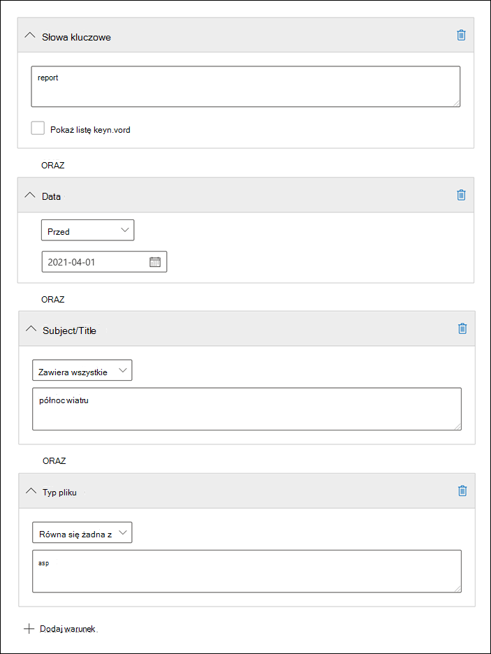

# <a name="keyword-queries-and-search-conditions-for-ediscovery"></a>Zapytania słów kluczowych i warunki wyszukiwania dla zbierania elektronicznych materiałów dowodowych

[!include[Purview banner](../includes/purview-rebrand-banner.md)]

W tym artykule opisano właściwości poczty e-mail i dokumentu, które można wyszukiwać w elementach wiadomości e-mail i Microsoft Teams rozmowach na czacie w Exchange Online oraz dokumenty przechowywane w witrynach SharePoint i OneDrive dla Firm przy użyciu narzędzi wyszukiwania zbierania elektronicznych materiałów dowodowych w portalu zgodności usługi Microsoft Purview. Obejmuje to wyszukiwanie zawartości, zbieranie elektronicznych materiałów dowodowych w usłudze Microsoft Purview (Standard) i zbieranie elektronicznych materiałów dowodowych w usłudze Microsoft Purview (Premium) (wyszukiwanie zbierania elektronicznych materiałów dowodowych w Premium) jest nazywane *kolekcjami*. Aby wyszukać te właściwości, możesz również użyć **\*poleceń cmdlet -ComplianceSearch** w programie PowerShell security & Compliance. W artykule opisano również:

- Używanie operatorów wyszukiwania logicznego, warunków wyszukiwania i innych technik wyszukiwania w celu uściślenia wyników wyszukiwania.
- Wyszukiwanie poufnych typów danych i niestandardowych poufnych typów danych w SharePoint i OneDrive dla Firm.
- Wyszukiwanie zawartości witryny udostępnionej użytkownikom spoza organizacji

Aby uzyskać instrukcje krok po kroku dotyczące tworzenia różnych wyszukiwań zbierania elektronicznych materiałów dowodowych, zobacz:

- [Wyszukiwanie zawartości](content-search.md)
- [Wyszukiwanie zawartości w środowisku eDiscovery (Standard)](search-for-content-in-core-ediscovery.md)
- [Tworzenie kolekcji roboczej w usłudze eDiscovery (Premium)](create-draft-collection.md)

> [!NOTE]
> Wyszukiwanie zbierania elektronicznych materiałów dowodowych w portalu zgodności i odpowiednie **\*polecenia cmdlet -ComplianceSearch** w programie PowerShell security & Compliance używają języka zapytań słów kluczowych (KQL). Aby uzyskać bardziej szczegółowe informacje, zobacz [Dokumentacja składni języka zapytań słów kluczowych](/sharepoint/dev/general-development/keyword-query-language-kql-syntax-reference).

## <a name="searchable-email-properties"></a>Właściwości poczty e-mail z możliwością wyszukiwania

W poniższej tabeli wymieniono właściwości wiadomości e-mail, które można wyszukiwać przy użyciu narzędzi wyszukiwania zbierania elektronicznych materiałów dowodowych w portalu zgodności lub przy użyciu polecenia cmdlet **New-ComplianceSearch** lub **Set-ComplianceSearch** . Tabela zawiera przykład składni  _property:value_ dla każdej właściwości oraz opis wyników wyszukiwania zwróconych przez przykłady. Te pary można wpisać  `property:value` w polu słowa kluczowe na potrzeby wyszukiwania zbierania elektronicznych materiałów dowodowych.

> [!NOTE]
> Podczas wyszukiwania właściwości poczty e-mail nie można wyszukiwać elementów, w których określona właściwość jest pusta lub pusta. Na przykład użycie pary *właściwości:wartość* **podmiotu:""** w celu wyszukania wiadomości e-mail z pustym wierszem tematu zwróci zero wyników. Dotyczy to również wyszukiwania właściwości witryny i kontaktu.

|Właściwość|Opis właściwości|Przykłady|Wyniki wyszukiwania zwrócone przez przykłady|
|---|---|---|---|
|AttachmentNames|Nazwy plików dołączonych do wiadomości e-mail.|`attachmentnames:annualreport.ppt` <p> `attachmentnames:annual*` <br/> `attachmentnames:.pptx`|Komunikaty z dołączonym plikiem o nazwie annualreport.ppt. W drugim przykładzie użycie symbolu wieloznacznego ( * ) zwraca komunikaty ze słowem "annual" w nazwie pliku załącznika. Trzeci przykład zwraca wszystkie załączniki z rozszerzeniem pliku pptx.|
|Udw|Pole Bcc wiadomości e-mail. <sup>1</sup>|`bcc:pilarp@contoso.com` <p> `bcc:pilarp` <p> `bcc:"Pilar Pinilla"`|Wszystkie przykłady zwracają komunikaty z narzędziem Pilar Pinilla zawartym w polu Bcc.<br>([Zobacz Rozszerzanie adresatów](keyword-queries-and-search-conditions.md#recipient-expansion))|
|Kategoria|Kategorie do wyszukania. Kategorie mogą być definiowane przez użytkowników przy użyciu Outlook lub Outlook w sieci Web (wcześniej znanego jako Outlook Web App). Dopuszczalne wartości: <ul><li>Niebieski<li>Zielony<li>Pomarańczowy<li>Fioletowy<li>Czerwony<li>Żółty</li></ul>|`category:"Red Category"`|Wiadomości, do których przypisano czerwoną kategorię w źródłowych skrzynkach pocztowych.|
|Cc|Pole DW wiadomości e-mail. <sup>1</sup>|`cc:pilarp@contoso.com` <p> `cc:"Pilar Pinilla"`|W obu przykładach komunikaty z narzędziem Pilar Pinilla określone w polu DW.<br>([Zobacz Rozszerzanie adresatów](keyword-queries-and-search-conditions.md#recipient-expansion))|
|Identyfikator folderu|Identyfikator folderu (GUID) określonego folderu skrzynki pocztowej. Jeśli używasz tej właściwości, przeszukaj skrzynkę pocztową, w którą znajduje się określony folder. Przeszukiwany będzie tylko określony folder. Nie będą przeszukiwane żadne podfoldery w folderze. Aby wyszukać podfoldery, należy użyć właściwości Folderid dla podfolderu, który chcesz wyszukać. <p> Aby uzyskać więcej informacji na temat wyszukiwania właściwości Folderid i używania skryptu w celu uzyskania identyfikatorów folderów dla określonej skrzynki pocztowej, zobacz [Używanie wyszukiwania zawartości dla kolekcji docelowych](use-content-search-for-targeted-collections.md).|`folderid:4D6DD7F943C29041A65787E30F02AD1F00000000013A0000` <p> `folderid:2370FB455F82FC44BE31397F47B632A70000000001160000 AND participants:garthf@contoso.com`|Pierwszy przykład zwraca wszystkie elementy w określonym folderze skrzynki pocztowej. Drugi przykład zwraca wszystkie elementy w określonym folderze skrzynki pocztowej, które zostały wysłane lub odebrane przez garthf@contoso.com.|
|Od|Nadawca wiadomości e-mail. <sup>1</sup>|`from:pilarp@contoso.com` <p> `from:contoso.com`|Komunikaty wysyłane przez określonego użytkownika lub wysyłane z określonej domeny.<br>([Zobacz Rozszerzanie adresatów](keyword-queries-and-search-conditions.md#recipient-expansion))|
|HasAttachment|Wskazuje, czy wiadomość ma załącznik. Użyj wartości **true** lub **false**.|`from:pilar@contoso.com AND hasattachment:true`|Komunikaty wysyłane przez określonego użytkownika, które mają załączniki.|
|Znaczenie|Znaczenie wiadomości e-mail, którą nadawca może określić podczas wysyłania wiadomości. Domyślnie komunikaty są wysyłane z normalną ważnością, chyba że nadawca ustawi ważność jako **wysoką** lub **niską**.|`importance:high` <p> `importance:medium` <p> `importance:low`|Komunikaty oznaczone jako o wysokim znaczeniu, średnim znaczeniu lub niskim znaczeniu.|
|IsRead|Wskazuje, czy komunikaty zostały przeczytane. Użyj wartości **true** lub **false**.|`isread:true` <p> `isread:false`|Pierwszy przykład zwraca komunikaty z właściwością IsRead ustawioną na **wartość True**. Drugi przykład zwraca komunikaty z właściwością IsRead ustawioną na **wartość False**.|
|ItemClass|Ta właściwość służy do wyszukiwania określonych typów danych innych firm zaimportowanych do Office 365 przez organizację. Użyj następującej składni dla tej właściwości:  `itemclass:ipm.externaldata.<third-party data type>*`|`itemclass:ipm.externaldata.Facebook* AND subject:contoso` <p> `itemclass:ipm.externaldata.Twitter* AND from:"Ann Beebe" AND "Northwind Traders"`|Pierwszy przykład zwraca elementy serwisu Facebook zawierające słowo "contoso" we właściwości Podmiot. Drugi przykład zwraca elementy usługi Twitter, które zostały opublikowane przez Ann Beebe i które zawierają frazę kluczową "Northwind Traders". <p> Aby uzyskać pełną listę wartości używanych dla typów danych innych firm dla właściwości ItemClass, zobacz [Używanie wyszukiwania zawartości do wyszukiwania danych innych firm, które zostały zaimportowane do Office 365](use-content-search-to-search-third-party-data-that-was-imported.md).|
|Rodzaju|Typ wiadomości e-mail do wyszukania. Możliwe wartości: <p>  Kontakty <p>  Dokumenty <p>  Adres e-mail <p>  externaldata <p>  Faksy <p>  im <p>  Arkuszy <p>  Spotkania <p>  microsoftteams (zwraca elementy z czatów, spotkań i połączeń w Microsoft Teams) <p>  Notatki <p>  Posty <p>  rssfeeds <p>  Zadania <p>  Poczta głosowa|`kind:email` <p> `kind:email OR kind:im OR kind:voicemail` <p> `kind:externaldata`|Pierwszy przykład zwraca wiadomości e-mail spełniające kryteria wyszukiwania. Drugi przykład zwraca wiadomości e-mail, konwersacje wiadomości błyskawicznych (w tym Skype dla firm konwersacje i czaty w Microsoft Teams) oraz wiadomości głosowe spełniające kryteria wyszukiwania. Trzeci przykład zwraca elementy, które zostały zaimportowane do skrzynek pocztowych w Microsoft 365 ze źródeł danych innych firm, takich jak Twitter, Facebook i Cisco Jabber, które spełniają kryteria wyszukiwania. Aby uzyskać więcej informacji, zobacz [Archiwizowanie danych innych firm w Office 365](https://www.microsoft.com/?ref=go).|
|Uczestników|Wszystkie pola osób w wiadomości e-mail. Te pola to From, To, Cc i Bcc.1<sup></sup>|`participants:garthf@contoso.com` <p> `participants:contoso.com`|Wiadomości wysyłane przez garthf@contoso.com lub wysyłane do niej. Drugi przykład zwraca wszystkie komunikaty wysyłane przez użytkownika lub wysyłane do użytkownika w domenie contoso.com.<br>([Zobacz Rozszerzanie adresatów](keyword-queries-and-search-conditions.md#recipient-expansion))|
|Otrzymał|Data odebrania wiadomości e-mail przez adresata.|`received:2021-04-15` <p> `received>=2021-01-01 AND received<=2021-03-31`|Komunikaty odebrane 15 kwietnia 2021 r. Drugi przykład zwraca wszystkie komunikaty odebrane między 1 stycznia 2021 r. a 31 marca 2021 r.|
|Adresatów|Wszystkie pola adresatów w wiadomości e-mail. Te pola to To, Cc i Bcc.1<sup></sup>|`recipients:garthf@contoso.com` <p> `recipients:contoso.com`|Komunikaty wysyłane do garthf@contoso.com. Drugi przykład zwraca komunikaty wysyłane do dowolnego adresata w domenie contoso.com.<br>([Zobacz Rozszerzanie adresatów](keyword-queries-and-search-conditions.md#recipient-expansion))|
|Wysłane|Data wysłania wiadomości e-mail przez nadawcę.|`sent:2021-07-01` <p> `sent>=2021-06-01 AND sent<=2021-07-01`|Komunikaty, które zostały wysłane w określonym dniu lub wysłane w określonym zakresie dat.|
|Rozmiar|Rozmiar elementu w bajtach.|`size>26214400` <p> `size:1..1048567`|Komunikaty większe niż 25 MB. Drugi przykład zwraca komunikaty o rozmiarze od 1 do 1 048 567 bajtów (1 MB).|
|Temat|Tekst w wierszu tematu wiadomości e-mail. <p> **Uwaga:** Gdy używasz właściwości Podmiot w zapytaniu, wyszukiwanie zwraca wszystkie komunikaty, w których wiersz tematu zawiera wyszukiwany tekst. Innymi słowy, zapytanie nie zwraca tylko tych komunikatów, które mają dokładne dopasowanie. Jeśli na przykład wyszukasz  `subject:"Quarterly Financials"`element , wyniki będą zawierać komunikaty z tematem "Kwartalne finanse 2018".|`subject:"Quarterly Financials"` <p> `subject:northwind`|Komunikaty zawierające frazę "Kwartalne finanse" w dowolnym miejscu w tekście wiersza tematu. Drugi przykład zwraca wszystkie komunikaty zawierające słowo northwind w wierszu tematu.|
|Do|Pole Do wiadomości e-mail. <sup>1</sup>|`to:annb@contoso.com` <p> `to:annb ` <br/> `to:"Ann Beebe"`|Wszystkie przykłady zwracają komunikaty, w których ann Beebe jest określona w wierszu Do: .|

> [!NOTE]
> <sup>1</sup> Dla wartości właściwości adresata możesz użyć adresu e-mail (nazywanego również *główną nazwą użytkownika* lub nazwą UPN), nazwy wyświetlanej lub aliasu, aby określić użytkownika. Na przykład możesz użyć annb@contoso.com, annb lub "Ann Beebe", aby określić użytkownika Ann Beebe.

### <a name="recipient-expansion"></a>Rozszerzenie adresata

Podczas przeszukiwania dowolnej właściwości adresata (Od, Do, DW, Bcc, Uczestnicy i Adresaci) Microsoft 365 próbuje rozwinąć tożsamość każdego użytkownika, sprawdzając je w Azure Active Directory (Azure AD).  Jeśli użytkownik zostanie znaleziony w Azure AD, zapytanie zostanie rozwinięte w celu uwzględnienia adresu e-mail użytkownika (lub nazwy UPN), aliasu, nazwy wyświetlanej i nazwy LegacyExchangeDN. Na przykład zapytanie, takie jak `participants:ronnie@contoso.com` rozszerza się na `participants:ronnie@contoso.com OR participants:ronnie OR participants:"Ronald Nelson" OR participants:"<LegacyExchangeDN>"`.

Aby zapobiec rozszerzeniu adresata, dodaj symbol wieloznaczny (gwiazdkę) na końcu adresu e-mail i użyj ograniczonej nazwy domeny; Na przykład pamiętaj, `participants:"ronnie@contoso*"` aby otoczyć adres e-mail podwójnym cudzysłowem.

Należy jednak pamiętać, że zapobieganie rozszerzeniu adresatów w zapytaniu wyszukiwania może spowodować, że odpowiednie elementy nie zostaną zwrócone w wynikach wyszukiwania. Wiadomości e-mail w Exchange można zapisywać w różnych formatach tekstowych w polach adresata. Rozszerzenie adresata ma na celu złagodzenie tego faktu przez zwrócenie komunikatów, które mogą zawierać różne formaty tekstu. Dlatego zapobieganie rozszerzaniu adresatów może spowodować, że zapytanie wyszukiwania nie zwróci wszystkich elementów, które mogą być istotne dla twojego badania.

> [!NOTE]
> Jeśli chcesz przejrzeć lub zmniejszyć elementy zwrócone przez zapytanie wyszukiwania z powodu rozszerzenia adresata, rozważ użycie funkcji zbierania elektronicznych materiałów dowodowych (Premium). Możesz wyszukiwać komunikaty (korzystając z rozszerzenia adresatów), dodać je do zestawu przeglądów, a następnie użyć zapytań lub filtrów zestawu przeglądów, aby przejrzeć lub zawęzić wyniki. Aby uzyskać więcej informacji, zobacz [Zbieranie danych dla sprawy](collecting-data-for-ediscovery.md) i [Wykonywanie zapytań o dane w zestawie przeglądów](review-set-search.md).

## <a name="searchable-site-properties"></a>Właściwości witryny z możliwością wyszukiwania

W poniższej tabeli wymieniono niektóre właściwości SharePoint i OneDrive dla Firm, które można przeszukiwać przy użyciu narzędzi wyszukiwania zbierania elektronicznych materiałów dowodowych w portalu zgodności usługi Microsoft Purview lub za pomocą polecenia cmdlet **New-ComplianceSearch** lub **Set-ComplianceSearch**. Tabela zawiera przykład składni  _property:value_ dla każdej właściwości oraz opis wyników wyszukiwania zwróconych przez przykłady.

Aby uzyskać pełną listę właściwości SharePoint, które można przeszukiwać, zobacz [Omówienie właściwości przeszukanych i zarządzanych w SharePoint](/SharePoint/technical-reference/crawled-and-managed-properties-overview). Właściwości oznaczone wartością **Tak** w kolumnie **Queryable** można wyszukiwać.

|Właściwość|Opis właściwości|Przykład|Wyniki wyszukiwania zwrócone przez przykłady|
|---|---|---|---|
|Autor|Pole autora z Office dokumentów, które jest utrwalane w przypadku skopiowania dokumentu. Jeśli na przykład użytkownik utworzy dokument i wyśle go pocztą e-mail do innej osoby, która następnie przekaże go do SharePoint, dokument będzie nadal zachowywać oryginalnego autora. Pamiętaj, aby użyć nazwy wyświetlanej użytkownika dla tej właściwości.|`author:"Garth Fort"`|Wszystkie dokumenty, które zostały utworzone przez Garth Fort.|
|Contenttype|Typ zawartości SharePoint elementu, taki jak Element, Dokument lub Wideo.|`contenttype:document`|Wszystkie dokumenty zostaną zwrócone.|
|Utwórz|Data utworzenia elementu.|`created>=2021-06-01`|Wszystkie elementy utworzone 1 czerwca 2021 r. lub później.|
|Createdby|Osoba, która utworzyła lub przekazała element. Pamiętaj, aby użyć nazwy wyświetlanej użytkownika dla tej właściwości.|`createdby:"Garth Fort"`|Wszystkie elementy utworzone lub przekazane przez fort Garth.|
|DetectedLanguage|Język elementu.|`detectedlanguage:english`|Wszystkie elementy w języku angielskim.|
|DocumentLink|Ścieżka (ADRES URL) określonego folderu w witrynie SharePoint lub OneDrive dla Firm. Jeśli ta właściwość jest używana, należy przeszukać witrynę, w którą znajduje się określony folder. <p> Aby zwrócić elementy znajdujące się w podfolderach folderu określonego dla właściwości documentlink, należy dodać /\* do adresu URL określonego folderu, na przykład `documentlink: "https://contoso.sharepoint.com/Shared Documents/*"` <p> <br/>Aby uzyskać więcej informacji na temat wyszukiwania właściwości documentlink i używania skryptu w celu uzyskania adresów URL linku dokumentu dla folderów w określonej witrynie, zobacz [Używanie wyszukiwania zawartości dla kolekcji docelowych](use-content-search-for-targeted-collections.md).|`documentlink:"https://contoso-my.sharepoint.com/personal/garthf_contoso_com/Documents/Private"` <p> `documentlink:"https://contoso-my.sharepoint.com/personal/garthf_contoso_com/Documents/Shared with Everyone/*" AND filename:confidential`|Pierwszy przykład zwraca wszystkie elementy w określonym folderze OneDrive dla Firm. Drugi przykład zwraca dokumenty w określonym folderze witryny (i we wszystkich podfolderach), które zawierają słowo "poufne" w nazwie pliku.|
|Rozszerzenie pliku|Rozszerzenie pliku; na przykład docx, one, pptx lub xlsx.|`fileextension:xlsx`|Wszystkie pliki Excel (Excel 2007 lub nowsze)|
|Pod nazwą|Nazwa pliku.|`filename:"marketing plan"` <p> `filename:estimate`|Pierwszy przykład zwraca pliki z dokładną frazą "plan marketingowy" w tytule. Drugi przykład zwraca pliki ze słowem "estimate" w nazwie pliku.|
|LastModifiedTime|Data ostatniej zmiany elementu.|`lastmodifiedtime>=2021-05-01` <p> `lastmodifiedtime>=2021-05-01 AND lastmodifiedtime<=2021-06-01`|Pierwszy przykład zwraca elementy, które zostały zmienione 1 maja 2021 r. lub później. Drugi przykład zwraca elementy zmienione między 1 maja 2021 r. a 1 czerwca 2021 r.|
|Modifiedby|Osoba, która ostatnio zmieniła element. Pamiętaj, aby użyć nazwy wyświetlanej użytkownika dla tej właściwości.|`modifiedby:"Garth Fort"`|Wszystkie elementy, które zostały ostatnio zmienione przez Garth Fort.|
|Ścieżka|Ścieżka (ADRES URL) określonej witryny w witrynie SharePoint lub OneDrive dla Firm. <p> Aby zwrócić elementy tylko z określonej witryny, musisz dodać ciąg końcowy `/` na końcu adresu URL, na przykład `path: "https://contoso.sharepoint.com/sites/international/"` <p> Aby zwrócić elementy znajdujące się w folderach w witrynie określonej we właściwości path, należy dodać `/*` elementy na końcu adresu URL, na przykład  `path: "https://contoso.sharepoint.com/Shared Documents/*"` <p> **Uwaga:** `Path` Użycie właściwości do wyszukiwania OneDrive lokalizacjach nie zwróci plików multimedialnych, takich jak pliki .png, tiff lub .wav, w wynikach wyszukiwania. Użyj innej właściwości witryny w zapytaniu wyszukiwania, aby wyszukać pliki multimedialne w folderach OneDrive. <br/>|`path:"https://contoso-my.sharepoint.com/personal/garthf_contoso_com/"` <p> `path:"https://contoso-my.sharepoint.com/personal/garthf_contoso_com/*" AND filename:confidential`|Pierwszy przykład zwraca wszystkie elementy w określonej OneDrive dla Firm lokacji. Drugi przykład zwraca dokumenty w określonej witrynie (i foldery w witrynie), które zawierają słowo "poufne" w nazwie pliku.|
|SharedWithUsersOWSUser|Dokumenty, które zostały udostępnione określonemu użytkownikowi i wyświetlone na stronie **Udostępnione mi** w witrynie OneDrive dla Firm użytkownika. Są to dokumenty, które zostały jawnie udostępnione określonemu użytkownikowi przez inne osoby w organizacji. Podczas eksportowania dokumentów zgodnych z zapytaniem wyszukiwania korzystającym z właściwości SharedWithUsersOWSUser dokumenty są eksportowane z oryginalnej lokalizacji zawartości osoby, która udostępniła dokument określonemu użytkownikowi. Aby uzyskać więcej informacji, zobacz [Wyszukiwanie zawartości witryny udostępnionej w organizacji](#searching-for-site-content-shared-within-your-organization).|`sharedwithusersowsuser:garthf` <p> `sharedwithusersowsuser:"garthf@contoso.com"`|Oba przykłady zwracają wszystkie dokumenty wewnętrzne, które zostały jawnie udostępnione fortowi Garth i które są wyświetlane na stronie **Udostępnione mi** na koncie OneDrive dla Firm Garth Fort.|
|Witryny|Adres URL witryny lub grupy witryn w organizacji.|`site:"https://contoso-my.sharepoint.com"` <p> `site:"https://contoso.sharepoint.com/sites/teams"`|Pierwszy przykład zwraca elementy z witryn OneDrive dla Firm dla wszystkich użytkowników w organizacji. Drugi przykład zwraca elementy ze wszystkich witryn zespołu.|
|Rozmiar|Rozmiar elementu w bajtach.|`size>=1` <p> `size:1..10000`|Pierwszy przykład zwraca elementy większe niż 1 bajt. Drugi przykład zwraca elementy o rozmiarze od 1 do 10 000 bajtów.|
|Tytuł|Tytuł dokumentu. Właściwość Title to metadane określone w Microsoft Office dokumentach. Różni się od nazwy pliku dokumentu.|`title:"communication plan"`|Każdy dokument zawierający frazę "plan komunikacji" we właściwości metadanych tytułu dokumentu Office.|

## <a name="searchable-contact-properties"></a>Właściwości kontaktu z możliwością wyszukiwania

W poniższej tabeli wymieniono właściwości kontaktu, które są indeksowane i których można wyszukiwać przy użyciu narzędzi wyszukiwania zbierania elektronicznych materiałów dowodowych. Są to właściwości, które są dostępne dla użytkowników do skonfigurowania dla kontaktów (nazywanych również kontaktami osobistymi), które znajdują się w osobistej książce adresowej skrzynki pocztowej użytkownika. Aby wyszukać kontakty, możesz wybrać skrzynki pocztowe do wyszukania, a następnie użyć co najmniej jednej właściwości kontaktu w zapytaniu słowa kluczowego.

> [!TIP]
> Aby wyszukać wartości zawierające spacje lub znaki specjalne, użyj podwójnego cudzysłowu (" "), aby zawierać frazę; na przykład `businessaddress:"123 Main Street"`.

|Właściwość|Opis właściwości|
|---|---|
|BusinessAddress|Adres we właściwości **Adres firmy** . Właściwość jest również nazywana adresem **służbowy** na stronie właściwości kontaktu.|
|BusinessPhone|Numer telefonu w dowolnej z właściwości **numerów Telefon biznesowych**.|
|Companyname|Nazwa we właściwości **Firma** .|
|Department|Nazwa we właściwości **Dział** .|
|Displayname|Nazwa wyświetlana kontaktu. Jest to nazwa we właściwości **Imię i nazwisko** kontaktu.|
|Emailaddress|Adres dowolnej właściwości adresu e-mail dla kontaktu. Użytkownicy mogą dodawać wiele adresów e-mail dla kontaktu. Użycie tej właściwości spowoduje zwrócenie kontaktów zgodnych z dowolnymi adresami e-mail kontaktu.|
|FileAs|**Właściwość Plik jako**. Ta właściwość służy do określania sposobu wyświetlania kontaktu na liście kontaktów użytkownika. Na przykład kontakt może być wymieniony jako  *FirstName, LastName*  lub  *LastName, FirstName*.|
|Givenname|Nazwa we właściwości **Imię** .|
|Telefondomowy|Adres w dowolnej właściwości adresu **domowego** .|
|HomePhone|Numer telefonu w dowolnej właściwości numeru telefonu **domowego** .|
|ImAddress|Właściwość adresu wiadomości błyskawicznej, która jest zwykle adresem e-mail używanym do obsługi wiadomości błyskawicznych.|
|Middlename|Nazwa we właściwości **Nazwa środkowa** .|
|Telefon komórkowy|Numer telefonu we właściwości Numer telefonu **komórkowego** .|
|Nick|Nazwa we właściwości **Nick** .|
|OfficeLocation|Wartość we **właściwości lokalizacji Office** lub **Office**.|
|OtherAddress|Wartość właściwości **Inny** adres.|
|Nazwisko|Nazwa we właściwości **Nazwisko** .|
|Tytuł|Tytuł we właściwości **Tytuł zadania** .|

## <a name="searchable-sensitive-data-types"></a>Typy danych poufnych z możliwością wyszukiwania

Narzędzia do wyszukiwania zbierania elektronicznych materiałów dowodowych w portalu zgodności umożliwiają wyszukiwanie poufnych danych, takich jak numery kart kredytowych lub numery ubezpieczenia społecznego, które są przechowywane w dokumentach w witrynach SharePoint i OneDrive dla Firm. Można to zrobić przy użyciu `SensitiveType` właściwości i nazwy (lub identyfikatora) typu informacji poufnych w zapytaniu słowa kluczowego. Na przykład zapytanie `SensitiveType:"Credit Card Number"` zwraca dokumenty zawierające numer karty kredytowej. Zapytanie  `SensitiveType:"U.S. Social Security Number (SSN)"` zwraca dokumenty zawierające amerykański numer ubezpieczenia społecznego.

Aby wyświetlić listę typów informacji poufnych, których można wyszukać, przejdź do pozycji **Klasyfikacje danych** **Typy informacji poufnych** \> w portalu zgodności. Możesz też użyć polecenia cmdlet **Get-DlpSensitiveInformationType** w programie PowerShell Security & Compliance, aby wyświetlić listę typów informacji poufnych.

Aby uzyskać więcej informacji na temat tworzenia zapytań przy użyciu `SensitiveType` właściwości, zobacz [Tworzenie zapytania w celu znalezienia poufnych danych przechowywanych w witrynach](form-a-query-to-find-sensitive-data-stored-on-sites.md).

### <a name="limitations-for-searching-sensitive-data-types"></a>Ograniczenia dotyczące wyszukiwania poufnych typów danych

- Aby wyszukać niestandardowe typy informacji poufnych, musisz określić identyfikator typu informacji poufnych we `SensitiveType` właściwości . Użycie nazwy niestandardowego typu informacji poufnych (jak pokazano w przykładzie dla wbudowanych typów informacji poufnych w poprzedniej sekcji) nie zwróci żadnych wyników. Użyj kolumny **Publisher** na stronie **Typy informacji poufnych** w centrum zgodności (lub właściwości **Publisher** w programie PowerShell), aby odróżnić wbudowane i niestandardowe typy informacji poufnych. Wbudowane typy danych poufnych mają wartość `Microsoft Corporation` właściwości **Publisher**.

  Aby wyświetlić nazwę i identyfikator niestandardowych poufnych typów danych w organizacji, uruchom następujące polecenie w programie PowerShell security & Compliance:

  ```powershell
  Get-DlpSensitiveInformationType | Where-Object {$_.Publisher -ne "Microsoft Corporation"} | FT Name,Id
  ```

  Następnie możesz użyć identyfikatora we `SensitiveType` właściwości wyszukiwania, aby zwrócić dokumenty zawierające niestandardowy typ danych poufnych, na przykład `SensitiveType:7e13277e-6b04-3b68-94ed-1aeb9d47de37`

- Nie można używać typów informacji poufnych i `SensitiveType` właściwości wyszukiwania do wyszukiwania poufnych danych magazynowanych w Exchange Online skrzynkach pocztowych. Obejmuje to wiadomości czatu 1:1, wiadomości czatu grupowego 1:N i konwersacje kanału zespołowego w Microsoft Teams, ponieważ cała ta zawartość jest przechowywana w skrzynkach pocztowych. Można jednak użyć zasad ochrony przed utratą danych (DLP) w celu ochrony poufnych danych poczty e-mail podczas przesyłania. Aby uzyskać więcej informacji, zobacz [Informacje o zapobieganiu utracie danych](dlp-learn-about-dlp.md) oraz [Wyszukiwanie i znajdowanie danych osobowych](/compliance/regulatory/gdpr).

## <a name="search-operators"></a>Operatory wyszukiwania

Operatory wyszukiwania logicznego, takie jak **AND**, **OR** i **NOT**, ułatwiają definiowanie bardziej precyzyjnych wyszukiwań, dołączając lub wykluczając określone słowa w zapytaniu wyszukiwania. Inne techniki, takie jak używanie operatorów właściwości (takich jak `>=` lub `..`), cudzysłowów, nawiasów i symboli wieloznacznych, ułatwiają uściślanie zapytania wyszukiwania. W poniższej tabeli wymieniono operatory, których można użyć do zawężenia lub poszerzenia wyników wyszukiwania.

|Operator|Zastosowanie|Opis|
|---|---|---|
|I|keyword1 AND — słowo kluczowe2|Zwraca elementy zawierające wszystkie określone słowa kluczowe lub  `property:value` wyrażenia. Na przykład  `from:"Ann Beebe" AND subject:northwind` zwraca wszystkie komunikaty wysyłane przez Ann Beebe, które zawierały słowo northwind w wierszu tematu. <sup>2</sup>|
|+|keyword1 + słowo kluczowe2 + słowo kluczowe3|Zwraca elementy zawierające  *elementy*  `keyword2` lub  `keyword3` *,*  które również zawierają  `keyword1`elementy . W związku z tym ten przykład jest odpowiednikiem zapytania  `(keyword2 OR keyword3) AND keyword1`. <p> Zapytanie  `keyword1 + keyword2` (ze spację po symbolu **+** ) nie jest takie samo jak przy użyciu operatora **AND** . To zapytanie będzie równoważne  `"keyword1 + keyword2"` i zwróci elementy z dokładną fazą  `"keyword1 + keyword2"`.|
|LUB|słowo kluczowe1 OR — słowo kluczowe2|Zwraca elementy zawierające co najmniej jedno z określonych słów kluczowych lub  `property:value` wyrażeń. <sup>2</sup>|
|NIE|keyword1 NOT keyword2 <p> NOT from:"Ann Beebe" <p> NIE rodzaj:im|Wyklucza elementy określone przez słowo kluczowe lub  `property:value` wyrażenie. W drugim przykładzie wyklucza komunikaty wysyłane przez Ann Beebe. Trzeci przykład wyklucza wszelkie konwersacje z wiadomościami błyskawicznymi, takie jak Skype dla firm konwersacje zapisane w folderze skrzynki pocztowej Historia konwersacji. <sup>2</sup>|
|-|keyword1 -keyword2|To samo, co operator **NOT** . Dlatego to zapytanie zwraca elementy zawierające elementy, które zawierają  `keyword1` i wykluczają elementy zawierające  `keyword2`elementy .|
|NIEDALEKO LOTNISKA|keyword1 NEAR(n) keyword2|Zwraca elementy ze słowami, które znajdują się blisko siebie, gdzie n jest równe liczbie wyrazów od siebie. Na przykład zwraca dowolny element, `best NEAR(5) worst` w którym wyraz "najgorszy" mieści się w pięciu słowach "best". Jeśli nie określono żadnej liczby, domyślna odległość to osiem wyrazów. <sup>2</sup>|
|:|property:value|Dwukropek (:)  `property:value` w składni określa, że wartość wyszukiwanej właściwości zawiera określoną wartość. Na przykład zwraca dowolną  `recipients:garthf@contoso.com` wiadomość wysłaną do garthf@contoso.com.|
|=|property=value|Tak samo jak operator **:** .|
|\<|wartość właściwości\<|Oznacza, że przeszukiwana właściwość jest mniejsza niż określona wartość. <sup>1</sup>|
|\>|wartość właściwości\>|Oznacza, że przeszukiwana właściwość jest większa niż określona wartość. <sup>1</sup>|
|\<=|property\<=value|Oznacza, że przeszukiwana właściwość jest mniejsza lub równa określonej wartości. <sup>1</sup>|
|\>=|property\>=value|Oznacza, że przeszukiwana właściwość jest większa lub równa określonej wartości. <sup>1</sup>|
|..|property:value1.. value2|Oznacza, że przeszukiwana właściwość jest większa lub równa wartości1 i mniejsza lub równa wartości2. <sup>1</sup>|
|"  "|"wartość godziwa" <p> subject:"Kwartalne dane finansowe"|W zapytaniu słowa kluczowego (w którym wpiszesz `property:value` parę w polu **Słowo kluczowe** ) użyj podwójnego cudzysłowu (" "), aby wyszukać dokładną frazę lub termin. Jeśli jednak używasz warunku [wyszukiwania](#search-conditions) **Temat** lub **Temat/Tytuł**, nie dodaj do wartości podwójnego cudzysłowu, ponieważ znaki cudzysłowu są automatycznie dodawane podczas korzystania z tych warunków wyszukiwania. Jeśli dodasz cudzysłów do wartości, dwie pary podwójnego cudzysłowu zostaną dodane do wartości warunku, a zapytanie wyszukiwania zwróci błąd. |
|\*|Cat\* <p> subject:set\*|Wyszukiwania prefiksów (nazywane również *dopasowywanie prefiksów*), gdzie symbol wieloznaczny ( * ) jest umieszczany na końcu wyrazu w słowach kluczowych lub `property:value` zapytaniach. W wyszukiwaniach prefiksów wyszukiwanie zwraca wyniki z terminami zawierającymi wyraz, po którym następuje zero lub więcej znaków. Na przykład zwraca dokumenty zawierające `title:set*` słowo "set", "setup" i "setting" (oraz inne słowa rozpoczynające się od "set") w tytule dokumentu. <p> **Uwaga:** Można używać tylko wyszukiwań prefiksów; na przykład **cat\**_ lub _* set\**_. Wyszukiwania sufiksów (_*\*cat**), wyszukiwania poprawek (**c\*t**) i wyszukiwania podciągów (**\*cat\***) nie są obsługiwane. <p> Ponadto dodanie kropki ( \. ) do wyszukiwania prefiksu spowoduje zmianę zwracanych wyników. Dzieje się tak, ponieważ kropka jest traktowana jako słowo zatrzymania. Na przykład wyszukiwanie **cat\**_ i wyszukiwanie _* cat.\*** spowoduje zwrócenie różnych wyników. Nie zalecamy używania kropki w wyszukiwaniu prefiksów.|
|(  )|(fair OR free) AND (z:contoso.com) <p> (IPO OR initial) AND (akcje LUB akcje) <p> (kwartalne finanse)|Nawiasy grupują frazy logiczne,  `property:value` elementy i słowa kluczowe. Na przykład  `(quarterly financials)` zwraca elementy zawierające wyrazy kwartalne i finansowe.|

> [!NOTE]
> <sup>1</sup> Użyj tego operatora dla właściwości, które mają wartości daty lub wartości liczbowe.<br/> <sup>2</sup> Operatory wyszukiwania logicznego muszą być wielkimi literami; na przykład **AND**. Jeśli używasz operatora małych liter, takiego jak **i**, będzie on traktowany jako słowo kluczowe w zapytaniu wyszukiwania.

## <a name="search-conditions"></a>Warunki wyszukiwania

Możesz dodać warunki do zapytania wyszukiwania, aby zawęzić wyszukiwanie i zwrócić bardziej wyrafinowany zestaw wyników. Każdy warunek dodaje klauzulę do zapytania wyszukiwania KQL, które jest tworzone i uruchamiane po rozpoczęciu wyszukiwania.

[Warunki dla typowych właściwości](#conditions-for-common-properties)

[Warunki dotyczące właściwości poczty](#conditions-for-mail-properties)

[Warunki dotyczące właściwości dokumentu](#conditions-for-document-properties)

[Operatory używane z warunkami](#operators-used-with-conditions)

[Wytyczne dotyczące używania warunków](#guidelines-for-using-conditions)

[Przykłady używania warunków w zapytaniach wyszukiwania](#examples-of-using-conditions-in-search-queries)

### <a name="conditions-for-common-properties"></a>Warunki dla typowych właściwości

Utwórz warunek przy użyciu typowych właściwości podczas wyszukiwania skrzynek pocztowych i witryn w tym samym wyszukiwaniu. W poniższej tabeli wymieniono dostępne właściwości do użycia podczas dodawania warunku.

|Warunek|Opis|
|---|---|
|Data|W przypadku wiadomości e-mail data odebrania wiadomości przez adresata lub wysłania przez nadawcę. W przypadku dokumentów data ostatniej modyfikacji dokumentu.|
|Nadawca/autor|W przypadku wiadomości e-mail osoba, która wysłała wiadomość. W przypadku dokumentów osoba cytowana w polu autora z Office dokumentów. Możesz wpisać więcej niż jedną nazwę rozdzieloną przecinkami. Co najmniej dwie wartości są logicznie połączone przez operator **OR** .<br>([Zobacz Rozszerzanie adresatów](keyword-queries-and-search-conditions.md#recipient-expansion))|
|Rozmiar (w bajtach)|W przypadku poczty e-mail i dokumentów rozmiar elementu (w bajtach).|
|Temat/tytuł|W przypadku wiadomości e-mail tekst w wierszu tematu wiadomości. W przypadku dokumentów tytuł dokumentu. Jak wyjaśniono wcześniej, właściwość Title jest metadanymi określonymi w dokumentach Microsoft Office. Możesz wpisać nazwę więcej niż jednej wartości podmiotu/tytułu rozdzielonej przecinkami. Co najmniej dwie wartości są logicznie połączone przez operator **OR** . <p> **Uwaga**: Nie dołączaj podwójnych cudzysłowów do wartości dla tego warunku, ponieważ cudzysłów są dodawane automatycznie podczas korzystania z tego warunku wyszukiwania. Jeśli dodasz cudzysłów do wartości, dwie pary podwójnego cudzysłowu zostaną dodane do wartości warunku, a zapytanie wyszukiwania zwróci błąd.|
|Etykieta przechowywania|W przypadku wiadomości e-mail i dokumentów etykiety przechowywania, które mogą być automatycznie lub ręcznie stosowane do wiadomości i dokumentów. Etykiety przechowywania mogą służyć do deklarowania rekordów i ułatwiania zarządzania cyklem życia danych zawartości przez wymuszanie reguł przechowywania i usuwania określonych przez etykietę. Możesz wpisać część nazwy etykiety przechowywania i użyć symbolu wieloznacznego lub wpisać pełną nazwę etykiety. Aby uzyskać więcej informacji na temat etykiet przechowywania, zobacz [Informacje o zasadach przechowywania i etykietach przechowywania](retention.md).|

### <a name="conditions-for-mail-properties"></a>Warunki dotyczące właściwości poczty

Utwórz warunek przy użyciu właściwości poczty podczas wyszukiwania skrzynek pocztowych lub folderów publicznych. W poniższej tabeli wymieniono właściwości wiadomości e-mail, których można użyć dla warunku. Te właściwości są podzbiorem właściwości wiadomości e-mail, które zostały wcześniej opisane. Te opisy są powtarzane dla Twojej wygody.

|Warunek|Opis|
|---|---|
|Rodzaj komunikatu|Typ komunikatu do wyszukania. Jest to ta sama właściwość co właściwość Kind email. Możliwe wartości: <ul><li>Kontakty</li><li>Dokumenty</li><li>Adres e-mail</li><li>externaldata</li><li>Faksu</li><li>im</li><li>Arkuszy</li><li>Spotkania</li><li>microsoftteams</li><li>Notatki</li><li>Posty</li><li>rssfeeds</li><li>Zadania</li><li>Poczta głosowa</li></ul>|
|Uczestników|Wszystkie pola osób w wiadomości e-mail. Te pola to From, To, Cc i Bcc. ([Zobacz Rozszerzanie adresatów](keyword-queries-and-search-conditions.md#recipient-expansion))|
|Wpisać|Właściwość klasy wiadomości dla elementu wiadomości e-mail. Jest to ta sama właściwość co właściwość poczty e-mail ItemClass. Jest to również warunek wielowartościowy. Aby wybrać wiele klas komunikatów, przytrzymaj klawisz **CTRL** , a następnie kliknij co najmniej dwie klasy komunikatów na liście rozwijanej, którą chcesz dodać do warunku. Każda klasa komunikatów wybrana na liście będzie logicznie połączona przez operatora **OR** w odpowiednim zapytaniu wyszukiwania. <p> Aby uzyskać listę klas komunikatów (i odpowiadający im identyfikator klasy komunikatów), które są używane przez Exchange i które można wybrać na liście **klas komunikatów**, zobacz [Typy elementów i klasy komunikatów](/office/vba/outlook/Concepts/Forms/item-types-and-message-classes).|
|Otrzymał|Data odebrania wiadomości e-mail przez adresata. Jest to ta sama właściwość co właściwość Odebrana wiadomość e-mail.|
|Adresatów|Wszystkie pola adresatów w wiadomości e-mail. Te pola to To, Cc i Bcc. ([Zobacz Rozszerzanie adresatów](keyword-queries-and-search-conditions.md#recipient-expansion))|
|Nadawcy|Nadawca wiadomości e-mail.|
|Wysłane|Data wysłania wiadomości e-mail przez nadawcę. Jest to ta sama właściwość co właściwość Wysłane wiadomości e-mail.|
|Temat|Tekst w wierszu tematu wiadomości e-mail. <p> **Uwaga**: Nie dołączaj podwójnych cudzysłowów do wartości dla tego warunku, ponieważ cudzysłów są dodawane automatycznie podczas korzystania z tego warunku wyszukiwania. Jeśli dodasz cudzysłów do wartości, dwie pary podwójnego cudzysłowu zostaną dodane do wartości warunku, a zapytanie wyszukiwania zwróci błąd.|
|Do|Adresat wiadomości e-mail w polu Do.|

### <a name="conditions-for-document-properties"></a>Warunki dotyczące właściwości dokumentu

Utwórz warunek przy użyciu właściwości dokumentu podczas wyszukiwania dokumentów w witrynach SharePoint i OneDrive dla Firm. W poniższej tabeli wymieniono właściwości dokumentu, których można użyć dla warunku. Te właściwości są podzbiorem właściwości witryny, które zostały wcześniej opisane. Te opisy są powtarzane dla Twojej wygody.

|Warunek|Opis|
|---|---|
|Autor|Pole autora z Office dokumentów, które jest utrwalane w przypadku skopiowania dokumentu. Jeśli na przykład użytkownik utworzy dokument i wyśle go pocztą e-mail do innej osoby, która następnie przekaże go do SharePoint, dokument będzie nadal zachowywać oryginalnego autora.|
|Tytuł|Tytuł dokumentu. Właściwość Title to metadane określone w Office dokumentach. Różni się od nazwy pliku dokumentu.|
|Utwórz|Data utworzenia dokumentu.|
|Ostatnia modyfikacja|Data ostatniej zmiany dokumentu.|
|Typ pliku|Rozszerzenie pliku; na przykład docx, one, pptx lub xlsx. Jest to ta sama właściwość co właściwość witryny FileExtension. <p> **Uwaga:** Jeśli w kwerendzie wyszukiwania zostanie dołączony warunek typu Plik przy użyciu dowolnego operatora **Równości** lub **Równości** , nie będzie można użyć wyszukiwania prefiksu (przez uwzględnienie symbolu wieloznacznego ( \* ) na końcu typu pliku), aby zwrócić wszystkie wersje typu pliku. Jeśli to zrobisz, symbol wieloznaczny zostanie zignorowany. Jeśli na przykład uwzględnisz warunek `Equals any of doc*`, zostaną zwrócone tylko pliki z rozszerzeniem `.doc` . Pliki z rozszerzeniem `.docx` nie zostaną zwrócone. Aby zwrócić wszystkie wersje typu pliku, użyto pary *property:value* w zapytaniu słowa kluczowego; na przykład `filetype:doc*`.|

### <a name="operators-used-with-conditions"></a>Operatory używane z warunkami

Po dodaniu warunku można wybrać operator, który jest odpowiedni dla typu właściwości warunku. W poniższej tabeli opisano operatory używane z warunkami i wymieniono odpowiednik używany w zapytaniu wyszukiwania.

|Operator|Odpowiednik zapytania|Opis|
|---|---|---|
|Po|`property>date`|Używane z warunkami daty. Zwraca elementy, które zostały wysłane, odebrane lub zmodyfikowane po określonej dacie.|
|Przed|`property<date`|Używane z warunkami daty. Zwraca elementy, które zostały wysłane, odebrane lub zmodyfikowane przed określoną datą.|
|Między|`date..date`|Użyj z warunkami daty i rozmiaru. W przypadku użycia z warunkiem daty zwraca elementy, które zostały wysłane, odebrane lub zmodyfikowane w określonym zakresie dat. W przypadku użycia z warunkiem rozmiaru zwraca elementy, których rozmiar mieści się w określonym zakresie.|
|Zawiera dowolny z|`(property:value) OR (property:value)`|Używane z warunkami dla właściwości, które określają wartość ciągu. Zwraca elementy zawierające dowolną część co najmniej jednej określonej wartości ciągu.|
|Nie zawiera żadnego z|`-property:value` <p> `NOT property:value`|Używane z warunkami dla właściwości, które określają wartość ciągu. Zwraca elementy, które nie zawierają żadnej części określonej wartości ciągu.|
|Nie równa się żadnemu z|`-property=value` <p> `NOT property=value`|Używane z warunkami dla właściwości, które określają wartość ciągu. Zwraca elementy, które nie zawierają określonego ciągu.|
|Równa|`size=value`|Zwraca elementy, które są równe określonemu rozmiarowi. <sup>1</sup>|
|Równa się dowolnemu z|`(property=value) OR (property=value)`|Używane z warunkami dla właściwości, które określają wartość ciągu. Zwraca elementy zgodne z co najmniej jedną określoną wartością ciągu.|
|Większa|`size>value`|Zwraca elementy, w których określona właściwość jest większa niż określona wartość. <sup>1</sup>|
|Większe lub równe|`size>=value`|Zwraca elementy, w których określona właściwość jest większa lub równa określonej wartości. <sup>1</sup>|
|Mniej|`size<value`|Zwraca elementy, które są większe lub równe określonej wartości. <sup>1</sup>|
|Mniejsze lub równe|`size<=value`|Zwraca elementy, które są większe lub równe określonej wartości. <sup>1</sup>|
|Nie równa się|`size<>value`|Zwraca elementy, które nie są równe określonemu rozmiarowi. <sup>1</sup>|

> [!NOTE]
> <sup>1</sup> Ten operator jest dostępny tylko dla warunków korzystających z właściwości Size.

### <a name="guidelines-for-using-conditions"></a>Wytyczne dotyczące używania warunków

Podczas korzystania z warunków wyszukiwania należy pamiętać o następujących kwestiach.

- Warunek jest logicznie połączony z zapytaniem słowa kluczowego (określonym w polu słowa kluczowego) przez operatora **AND** . Oznacza to, że elementy muszą spełniać zarówno zapytanie słowa kluczowego, jak i warunek, który ma zostać uwzględniony w wynikach. W ten sposób warunki pomagają zawęzić wyniki.

- W przypadku dodania co najmniej dwóch unikatowych warunków do zapytania wyszukiwania (warunków określających różne właściwości) te warunki są logicznie połączone przez operator **AND** . Oznacza to, że zwracane są tylko elementy spełniające wszystkie warunki (oprócz zapytania kluczowego).

- Jeśli dodasz więcej niż jeden warunek dla tej samej właściwości, warunki te są logicznie połączone przez operator **OR** . Oznacza to, że zwracane są elementy spełniające zapytanie słowa kluczowego i dowolny z warunków. Dlatego grupy tych samych warunków są połączone ze sobą przez operatora **OR** , a następnie zestawy unikatowych warunków są połączone przez operator **AND** .

- Jeśli dodasz wiele wartości (rozdzielonych przecinkami lub średnikami) do jednego warunku, te wartości są połączone przez operator **OR** . Oznacza to, że elementy są zwracane, jeśli zawierają dowolną z określonych wartości właściwości w warunku.

- Każdy warunek używający operatora z logiką **Contains** and **Equals** zwróci podobne wyniki wyszukiwania dla prostych wyszukiwań ciągów. Proste wyszukiwanie ciągów to ciąg w warunku, który nie zawiera symbolu wieloznacznego. Na przykład warunek, który używa **wartości Equals dowolny z** zwróci te same elementy jako warunek, który używa **zawiera dowolny z**.

- Zapytanie wyszukiwania utworzone przy użyciu pola słów kluczowych i warunków jest wyświetlane na stronie **Wyszukiwanie** w okienku szczegółów wybranego wyszukiwania. W zapytaniu wszystko po prawej stronie notacji  `(c:c)` wskazuje warunki dodane do zapytania.

- Warunki dodają tylko właściwości do zapytania wyszukiwania; nie dodaj operatorów. Dlatego zapytanie wyświetlane w okienku szczegółów nie wyświetla operatorów po prawej  `(c:c)` stronie notacji. KQL dodaje operatory logiczne (zgodnie z wcześniej wyjaśnione reguły) podczas wykonywania zapytania.

- Kontrolka przeciągania i upuszczania umożliwia ponowne ujednawianie kolejności warunków. Kliknij kontrolkę warunku i przenieś ją w górę lub w dół.

- Jak wyjaśniono wcześniej, niektóre właściwości warunku umożliwiają wpisywanie wielu wartości (oddzielonych średnikami). Każda wartość jest logicznie połączona przez operator **OR** i powoduje wykonanie zapytania `(filetype=docx) OR (filetype=pptx) OR (filetype=xlsx)`. Na poniższej ilustracji przedstawiono przykład warunku z wieloma wartościami.

    

  > [!NOTE]
  > Nie można dodać wielu warunków (klikając pozycję **Dodaj warunek** dla tej samej właściwości. Zamiast tego należy podać wiele wartości warunku (oddzielonych średnikami), jak pokazano w poprzednim przykładzie.

### <a name="examples-of-using-conditions-in-search-queries"></a>Przykłady używania warunków w zapytaniach wyszukiwania

W poniższych przykładach przedstawiono wersję zapytania wyszukiwania opartą na graficznym interfejsie użytkownika z warunkami, składnią zapytania wyszukiwania wyświetlaną w okienku szczegółów wybranego wyszukiwania (który jest również zwracany przez polecenie cmdlet **Get-ComplianceSearch**) oraz logikę odpowiedniego zapytania KQL.

#### <a name="example-1"></a>Przykład 1

Ten przykład zwraca dokumenty w witrynach SharePoint i OneDrive dla Firm, które zawierają numer karty kredytowej i zostały ostatnio zmodyfikowane przed 1 stycznia 2021 r.

**Graficzny interfejs użytkownika**:


**Składnia zapytania wyszukiwania**:

`SensitiveType:"Credit Card Number"(c:c)(lastmodifiedtime<2021-01-01)`

**Logika zapytania wyszukiwania**:

`SensitiveType:"Credit Card Number" AND (lastmodifiedtime<2021-01-01)`

Zwróć uwagę na poprzednim zrzucie ekranu, że interfejs użytkownika wyszukiwania wzmacnia, że zapytanie i warunek słowa kluczowego są połączone przez operatora **AND** .

#### <a name="example-2"></a>Przykład 2

Ten przykład zwraca elementy wiadomości e-mail lub dokumenty zawierające słowo kluczowe "raport", które zostały wysłane lub utworzone przed 1 kwietnia 2021 r. i które zawierają słowo "northwind" w polu tematu wiadomości e-mail lub we właściwości tytułowej dokumentów. Zapytanie wyklucza strony sieci Web spełniające inne kryteria wyszukiwania.

**Graficzny interfejs użytkownika**:



**Składnia zapytania wyszukiwania**:

`report(c:c)(date<2021-04-01)(subjecttitle:"northwind")(-filetype:aspx)`

**Logika zapytania wyszukiwania**:

`report AND (date<2021-04-01) AND (subjecttitle:"northwind") NOT (filetype:aspx)`

#### <a name="example-3"></a>Przykład 3

Ten przykład zwraca wiadomości e-mail lub spotkania kalendarza, które zostały wysłane między 1 grudnia 2019 r. a 30 listopada 2020 r. i które zawierają wyrazy rozpoczynające się od "telefonu" lub "smartfona".

**Graficzny interfejs użytkownika**:


**Składnia zapytania wyszukiwania**:

`phone* OR smartphone*(c:c)(sent=2019-12-01..2020-11-30)(kind="email")(kind="meetings")`

**Logika zapytania wyszukiwania**:

`phone* OR smartphone* AND (sent=2019-12-01..2020-11-30) AND ((kind="email") OR (kind="meetings"))`

## <a name="special-characters"></a>Znaki specjalne

Niektóre znaki specjalne nie są uwzględnione w indeksie wyszukiwania i dlatego nie można ich przeszukiwać. Obejmuje to również znaki specjalne reprezentujące operatory wyszukiwania w zapytaniu wyszukiwania. Oto lista znaków specjalnych, które są zastępowane pustym miejscem w rzeczywistym zapytaniu wyszukiwania lub powodują błąd wyszukiwania.

`+ - = : ! @ # % ^ & ; _ / ? ( ) [ ] { }`

## <a name="searching-for-site-content-shared-with-external-users"></a>Wyszukiwanie zawartości witryny udostępnionej użytkownikom zewnętrznym

Możesz również użyć narzędzi wyszukiwania zbierania elektronicznych materiałów dowodowych w centrum zgodności, aby wyszukiwać dokumenty przechowywane w witrynach SharePoint i OneDrive dla Firm, które zostały udostępnione osobom spoza organizacji. Może to pomóc w zidentyfikowaniu poufnych lub zastrzeżonych informacji udostępnianych poza organizacją. Można to zrobić przy użyciu  `ViewableByExternalUsers` właściwości w zapytaniu słowa kluczowego. Ta właściwość zwraca dokumenty lub witryny, które zostały udostępnione użytkownikom zewnętrznym przy użyciu jednej z następujących metod udostępniania:

- Zaproszenie do udostępniania, które wymaga od użytkowników zalogowania się do organizacji jako uwierzytelniony użytkownik.
- Link anonimowego gościa, który umożliwia wszystkim osobom z tym linkiem dostęp do zasobu bez konieczności uwierzytelniania.

Oto kilka przykładów:

- Zapytanie  `ViewableByExternalUsers:true AND SensitiveType:"Credit Card Number"` zwraca wszystkie elementy, które zostały udostępnione osobom spoza organizacji i zawierają numer karty kredytowej.
- Zapytanie  `ViewableByExternalUsers:true AND ContentType:document AND site:"https://contoso.sharepoint.com/Sites/Teams"` zwraca listę dokumentów we wszystkich witrynach zespołu w organizacji, które zostały udostępnione użytkownikom zewnętrznym.

> [!TIP]
> Zapytanie wyszukiwania, takie jak  `ViewableByExternalUsers:true AND ContentType:document` , może zwrócić wiele plików aspx w wynikach wyszukiwania. Aby wyeliminować te (lub inne typy plików), można użyć  `FileExtension` właściwości , aby wykluczyć określone typy plików, na przykład  `ViewableByExternalUsers:true AND ContentType:document NOT FileExtension:aspx`.

Jaka zawartość jest uznawana za udostępnioną osobom spoza organizacji? Dokumenty w witrynach SharePoint i OneDrive dla Firm organizacji, które są udostępniane przez wysłanie zaproszenia do udostępniania lub udostępnione w lokalizacjach publicznych. Na przykład następujące działania użytkownika powodują wyświetlenie zawartości przez użytkowników zewnętrznych:

- Użytkownik udostępnia plik lub folder osobie spoza organizacji.
- Użytkownik tworzy i wysyła link do udostępnionego pliku osobie spoza organizacji. Ten link umożliwia użytkownikowi zewnętrznemu wyświetlanie (lub edytowanie) pliku.
- Użytkownik wysyła zaproszenie do udostępniania lub link gościa do osoby spoza organizacji, aby wyświetlić (lub edytować) udostępniony plik.

### <a name="issues-using-the-viewablebyexternalusers-property"></a>Problemy z używaniem właściwości ViewableByExternalUsers

`ViewableByExternalUsers` Chociaż właściwość reprezentuje stan, czy dokument lub witryna jest udostępniana użytkownikom zewnętrznym, istnieją pewne zastrzeżenia dotyczące tego, co ta właściwość robi i nie odzwierciedla. W poniższych scenariuszach wartość  `ViewableByExternalUsers` właściwości nie zostanie zaktualizowana, a wyniki zapytania wyszukiwania używającego tej właściwości mogą być niedokładne.

- Zmiany zasad udostępniania, takie jak wyłączenie udostępniania zewnętrznego dla witryny lub organizacji. Właściwość nadal będzie wyświetlać wcześniej udostępnione dokumenty jako dostępne zewnętrznie, mimo że dostęp zewnętrzny mógł zostać odwołany.
- Zmiany członkostwa w grupach, takie jak dodawanie lub usuwanie użytkowników zewnętrznych do Grupy Microsoft 365 lub Microsoft 365 grup zabezpieczeń. Właściwość nie będzie automatycznie aktualizowana dla elementów, do które grupa ma dostęp.
- Wysyłanie zaproszeń do udostępniania użytkownikom zewnętrznym, którzy nie zaakceptowali zaproszenia, a zatem nie ma jeszcze dostępu do zawartości.

W tych scenariuszach właściwość nie będzie odzwierciedlać bieżącego stanu udostępniania,  `ViewableByExternalUsers` dopóki witryna lub biblioteka dokumentów nie zostaną ponownie zszerzone i ponownie wyekskreowane.

## <a name="searching-for-site-content-shared-within-your-organization"></a>Wyszukiwanie zawartości witryny udostępnionej w organizacji

Jak wyjaśniono wcześniej, można użyć  `SharedWithUsersOWSUser` właściwości , aby wyszukać dokumenty, które zostały udostępnione osobom w organizacji. Gdy osoba udostępnia plik (lub folder) innemu użytkownikowi w organizacji, na stronie **Udostępnione mi** na koncie OneDrive dla Firm osoby, której plik został udostępniony, zostanie wyświetlony link do udostępnionego pliku. Aby na przykład wyszukać dokumenty udostępnione Sarze Davis, możesz użyć zapytania  `SharedWithUsersOWSUser:"sarad@contoso.com"`. Jeśli wyeksportujesz wyniki tego wyszukiwania, oryginalne dokumenty (znajdujące się w lokalizacji zawartości osoby, która udostępniła dokumenty Sarze) zostaną pobrane.

Dokumenty muszą być jawnie współużytkowane z określonym użytkownikiem, aby były zwracane w wynikach wyszukiwania podczas korzystania z  `SharedWithUsersOWSUser` właściwości. Jeśli na przykład osoba udostępnia dokument na swoim koncie OneDrive, może udostępnić go dowolnej osobie (w organizacji lub poza nią), udostępnić go tylko osobom w organizacji lub udostępnić go określonej osobie. Oto zrzut ekranu przedstawiający okno **Udostępnianie** w OneDrive, które pokazuje trzy opcje udostępniania.


Tylko dokumenty udostępnione przy użyciu trzeciej opcji (udostępnione **określonym osobom**) zostaną zwrócone przez zapytanie wyszukiwania korzystające z  `SharedWithUsersOWSUser` właściwości .

## <a name="searching-for-skype-for-business-conversations"></a>Wyszukiwanie konwersacji Skype dla firm

Następujące zapytanie słowa kluczowego umożliwia wyszukiwanie zawartości w konwersacjach Skype dla firm:

```powershell
kind:im
```

Poprzednie zapytanie wyszukiwania zwraca również czaty z Microsoft Teams. Aby temu zapobiec, możesz zawęzić wyniki wyszukiwania tak, aby zawierały tylko Skype dla firm konwersacji przy użyciu następującego zapytania kluczowego:

```powershell
kind:im AND subject:conversation
```

Poprzednie zapytanie słowa kluczowego wyklucza czaty w Microsoft Teams, ponieważ Skype dla firm konwersacje są zapisywane jako wiadomości e-mail z wierszem tematu rozpoczynanym od słowa "Konwersacja".

Aby wyszukać Skype dla firm konwersacje, które miały miejsce w określonym zakresie dat, użyj następującego zapytania kluczowego:

```powershell
kind:im AND subject:conversation AND (received=startdate..enddate)
```

## <a name="character-limits-for-searches"></a>Limity znaków dla wyszukiwań

Istnieje limit 4000 znaków dla zapytań wyszukiwania podczas wyszukiwania zawartości w witrynach SharePoint i kontach OneDrive.
Poniżej przedstawiono sposób obliczania łącznej liczby znaków w zapytaniu wyszukiwania:

- Znaki w zapytaniu wyszukiwania słów kluczowych (w tym pola użytkownika i filtru) są liczone względem tego limitu.
- Znaki we dowolnej właściwości lokalizacji (takie jak adresy URL wszystkich przeszukiwanych witryn SharePoint lub OneDrive lokalizacji) są liczone względem tego limitu.
- Znaki we wszystkich filtrach uprawnień wyszukiwania, które są stosowane do użytkownika uruchamiającego liczbę wyszukiwań względem limitu.

Aby uzyskać więcej informacji na temat limitów znaków, zobacz [Limity wyszukiwania zbierania elektronicznych materiałów dowodowych](limits-for-content-search.md#search-limits).

> [!NOTE]
> Limit 4000 znaków dotyczy wyszukiwania zawartości, eDiscovery (Standard) i eDiscovery (Premium).

## <a name="search-tips-and-tricks"></a>Porady i wskazówki dotyczące wyszukiwania

- Wyszukiwania słów kluczowych nie uwzględniają wielkości liter. Na przykład **cat** i **CAT** zwracają te same wyniki.

- Operatory logiczne **AND**, **OR**, **NOT** i **NEAR** muszą być wielkimi literami.

- Odstęp między dwoma słowami kluczowymi lub dwoma  `property:value` wyrażeniami jest taki sam jak w przypadku używania języka **AND**. Na przykład zwraca wszystkie komunikaty  `from:"Sara Davis" subject:reorganization` wysyłane przez Sarę Davis, które zawierają słowo reorganizacja w wierszu tematu.

- Użyj składni zgodnej z formatem `property:value` . Wartości nie uwzględniają wielkości liter i nie mogą mieć miejsca po operatorze. Jeśli jest miejsce, zamierzoną wartością będzie wyszukiwanie pełnotekstowe. Na przykład `to: pilarp` wyszukuje frazę "pilarp" jako słowo kluczowe, a nie komunikaty wysyłane do pilarp.

- Podczas wyszukiwania właściwości adresata, takiej jak Do, Od, DW lub Adresaci, możesz użyć adresu SMTP, aliasu lub nazwy wyświetlanej, aby oznaczyć adresata. Na przykład można użyć pilarp@contoso.com, pilarp lub "Pilar Pinilla".

- Można używać tylko wyszukiwań prefiksów; na przykład **cat\**_ lub _* set\**_. Wyszukiwania sufiksów (_*\*cat**), wyszukiwania poprawek (**c\*t**) i wyszukiwania podciągów (**\*cat\***) nie są obsługiwane.

- Podczas przeszukiwania właściwości użyj podwójnego cudzysłowu (" "), jeśli wartość wyszukiwania składa się z wielu wyrazów. Na przykład `subject:budget Q1` zwraca komunikaty zawierające **budżet** w wierszu tematu i zawierające **Q1** w dowolnym miejscu w wiadomości lub we właściwościach komunikatu. Użycie `subject:"budget Q1"` polecenia zwraca wszystkie komunikaty zawierające **budżet Q1** w dowolnym miejscu w wierszu tematu.

- Aby wykluczyć zawartość oznaczoną określoną wartością właściwości z wyników wyszukiwania, umieść znak minus (-) przed nazwą właściwości. Na przykład `-from:"Sara Davis"` wyklucza wszystkie wiadomości wysyłane przez Sarę Davis.

- Elementy można eksportować na podstawie typu komunikatu. Aby na przykład wyeksportować Skype konwersacje i czaty w Microsoft Teams, użyj składni `kind:im`. Aby zwrócić tylko wiadomości e-mail, należy użyć polecenia `kind:email`. Aby zwrócić czaty, spotkania i wywołania w Microsoft Teams, użyj polecenia `kind:microsoftteams`.

- Jak wcześniej wyjaśniono, podczas wyszukiwania witryn należy dodać końcowe `/` na końcu adresu URL podczas korzystania z `path` właściwości w celu zwrócenia tylko elementów w określonej witrynie. Jeśli nie dołączysz końcowych `/`elementów z witryny o podobnej nazwie ścieżki, zostaną również zwrócone. Jeśli na przykład używasz `path:sites/HelloWorld` elementów z witryn o nazwie `sites/HelloWorld_East` lub `sites/HelloWorld_West` również zostaną zwrócone. Aby zwrócić elementy tylko z witryny HelloWorld, musisz użyć polecenia `path:sites/HelloWorld/`.
