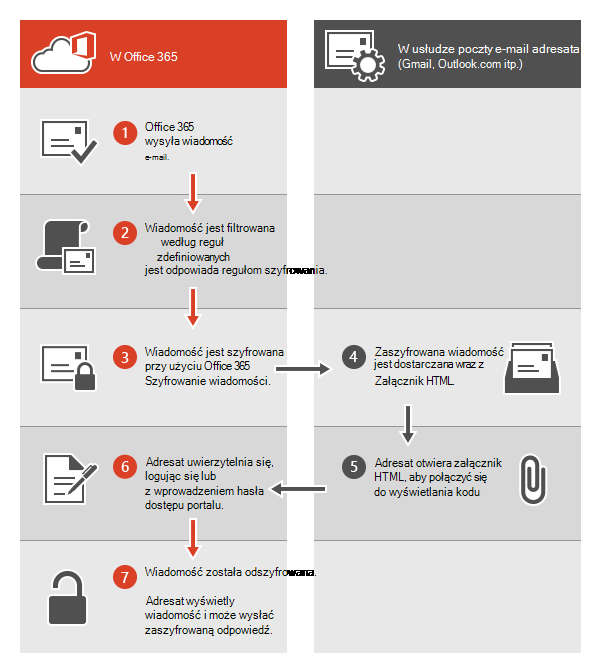
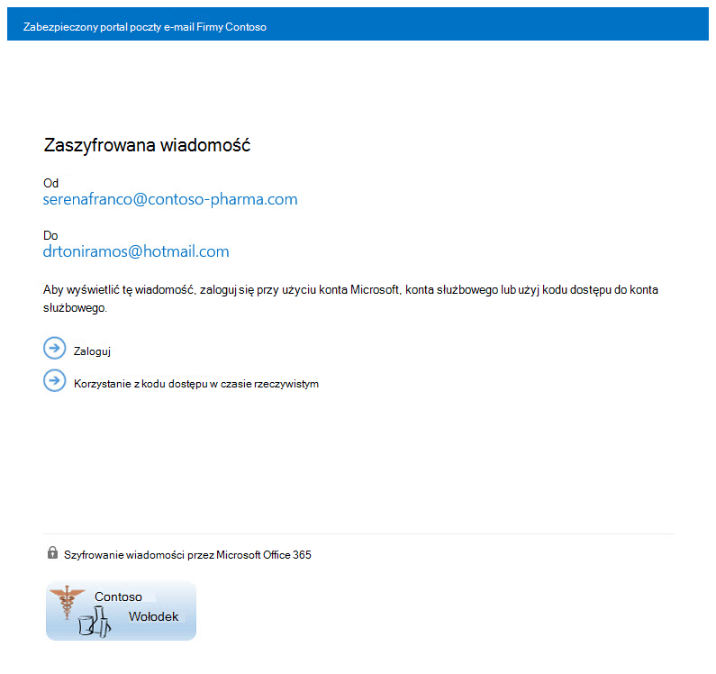

# <a name="legacy-information-for-office-365-message-encryption"></a>Starsze informacje dotyczące szyfrowania wiadomości usługi Office 365

[!include[Purview banner](../includes/purview-rebrand-banner.md)]

Jeśli twoja organizacja nie została jeszcze przeniesiona do usługi Microsoft Purview Message Encryption, ale już wdrożono protokół OME, informacje zawarte w tym artykule dotyczą Twojej organizacji. Firma Microsoft zaleca, aby zaplanować przejście do usługi Microsoft Purview Message Encryption, gdy tylko będzie to uzasadnione dla Twojej organizacji. Aby uzyskać instrukcje, zobacz [Konfigurowanie szyfrowania komunikatów usługi Microsoft Purview](set-up-new-message-encryption-capabilities.md). Jeśli chcesz dowiedzieć się więcej na temat sposobu szyfrowania nowych komunikatów, zobacz [Szyfrowanie komunikatów](ome.md). W pozostałej części tego artykułu opisano zachowanie OME przed wydaniem usługi Microsoft Purview Message Encryption.

Dzięki Office 365 szyfrowaniu wiadomości organizacja może wysyłać i odbierać zaszyfrowane wiadomości e-mail między osobami w organizacji i poza nią. Office 365 szyfrowanie wiadomości współpracuje z Outlook.com, Yahoo, Gmail i innymi usługami poczty e-mail. Szyfrowanie wiadomości e-mail pomaga zapewnić, że tylko zamierzoni adresaci mogą wyświetlać zawartość wiadomości.

Oto kilka przykładów:

- Pracownik banku wysyła do klientów wyciągi z kart kredytowych
- Przedstawiciel firmy ubezpieczeniowej udostępnia klientom szczegółowe informacje o zasadach
- Broker kredytów hipotecznych żąda informacji finansowych od klienta w celu złożenia wniosku o pożyczkę
- Świadczeniodawcy opieki zdrowotnej wysyła informacje o opiece zdrowotnej do pacjentów
- Adwokat wysyła poufne informacje do klienta lub innego adwokata

## <a name="how-office-365-message-encryption-works-without-the-new-capabilities"></a>Jak działa szyfrowanie komunikatów Office 365 bez nowych możliwości

Office 365 Message Encryption to usługa online oparta na Microsoft Azure Rights Management (Azure RMS). Dzięki usłudze Azure RMS administratorzy mogą definiować reguły przepływu poczty w celu określenia warunków szyfrowania. Na przykład reguła może wymagać szyfrowania wszystkich komunikatów skierowanych do określonego adresata.

Gdy ktoś wyśle w Exchange Online wiadomość e-mail zgodną z regułą szyfrowania, wiadomość zostanie wysłana z załącznikiem HTML. Adresat otwiera załącznik HTML i jest zgodny z instrukcjami, aby wyświetlić zaszyfrowaną wiadomość w portalu szyfrowania wiadomości Office 365. Odbiorca może wybrać wyświetlanie wiadomości, logując się przy użyciu konta Microsoft, służbowego lub szkolnego skojarzonego z Office 365 lub używając jednorazowego kodu dostępu. Obie opcje pomagają zagwarantować, że tylko zamierzony adresat może wyświetlić zaszyfrowaną wiadomość. Ten proces bardzo różni się w przypadku szyfrowania komunikatów usługi Microsoft Purview.

Poniższy diagram zawiera podsumowanie fragmentu wiadomości e-mail w procesie szyfrowania i odszyfrowywania.



Aby uzyskać więcej informacji, zobacz [Informacje o usłudze dotyczące starszej wersji Office 365 szyfrowania komunikatów przed wydaniem szyfrowania komunikatów usługi Microsoft Purview](legacy-information-for-message-encryption.md#LegacyServiceInfo).

## <a name="defining-mail-flow-rules-for-office-365-message-encryption-that-dont-use-microsoft-purview-message-encryption"></a>Definiowanie reguł przepływu poczty dla szyfrowania wiadomości Office 365, które nie korzystają z szyfrowania komunikatów usługi Microsoft Purview

Aby włączyć szyfrowanie wiadomości Office 365 bez nowych możliwości, administratorzy Exchange Online i Exchange Online Protection definiują reguły przepływu poczty Exchange. Te reguły określają, w jakich warunkach wiadomości e-mail powinny być szyfrowane, a także warunki usuwania szyfrowania wiadomości. Po ustawieniu akcji szyfrowania dla reguły usługa wykonuje akcję na wszystkich komunikatach zgodnych z warunkami reguły przed wysłaniem komunikatów.

Reguły przepływu poczty są elastyczne, co umożliwia łączenie warunków, dzięki czemu można spełnić określone wymagania dotyczące zabezpieczeń w jednej regule. Można na przykład utworzyć regułę szyfrowania wszystkich komunikatów zawierających określone słowa kluczowe i adresowanych do adresatów zewnętrznych. Office 365 szyfrowanie komunikatów szyfruje również odpowiedzi od adresatów zaszyfrowanych wiadomości e-mail i można utworzyć regułę, która odszyfrowuje te odpowiedzi jako wygodę dla użytkowników poczty e-mail. Dzięki temu użytkownicy w organizacji nie będą musieli logować się do portalu szyfrowania, aby wyświetlić odpowiedzi.

Aby uzyskać więcej informacji na temat tworzenia reguł przepływu poczty Exchange, zobacz [Define Rules for Office 365 Message Encryption (Definiowanie reguł szyfrowania wiadomości Office 365](define-mail-flow-rules-to-encrypt-email.md)).

### <a name="use-the-eac-to-create-a-mail-flow-rule-for-encrypting-email-messages-without-microsoft-purview-message-encryption"></a>Używanie umowy EAC do tworzenia reguły przepływu poczty na potrzeby szyfrowania wiadomości e-mail bez szyfrowania komunikatów usługi Microsoft Purview

1. W przeglądarce internetowej przy użyciu konta służbowego, któremu przyznano uprawnienia administratora globalnego, [zaloguj się do Office 365](https://support.office.com/article/b9582171-fd1f-4284-9846-bdd72bb28426#ID0EAABAAA=Web_browser).

2. Wybierz kafelek **Administrator** .

3. W Centrum administracyjne platformy Microsoft 365 wybierz pozycję **Centra** \> administracyjne <a href="https://go.microsoft.com/fwlink/p/?linkid=2059104" target="_blank">**Exchange**</a>.

4. W usłudze EAC przejdź do pozycji **Reguły** **przepływu poczty** \> i wybierz pozycję **Nowa**  \>**Utwórz nową regułę**. Aby uzyskać więcej informacji na temat korzystania z usługi EAC, zobacz [centrum administracyjne Exchange w Exchange Online](/exchange/exchange-admin-center).

5. W **polu Nazwa** wpisz nazwę reguły, na przykład Szyfruj pocztę dla DrToniRamos@hotmail.com.

6. W **obszarze Zastosuj tę regułę, jeśli** wybierz warunek, i w razie potrzeby wprowadź wartość. Aby na przykład zaszyfrować komunikaty przechodzące do DrToniRamos@hotmail.com:

   1. W **obszarze Zastosuj tę regułę, jeśli** wybierz **adresata**.

   2. Wybierz istniejącą nazwę z listy kontaktów lub wpisz nowy adres e-mail w polu **wyboru nazwy** .

      - Aby wybrać istniejącą nazwę, wybierz ją z listy, a następnie kliknij przycisk **OK**.

      - Aby wprowadzić nową nazwę, wpisz adres e-mail w polu **wyboru nazwy** , a następnie wybierz **pozycję sprawdź nazwy** \> **OK**.

7. Aby dodać więcej warunków, wybierz pozycję **Więcej opcji** , a następnie wybierz pozycję **Dodaj warunek** i wybierz z listy.

   Aby na przykład zastosować regułę tylko wtedy, gdy adresat znajduje się poza organizacją, wybierz pozycję **Dodaj warunek** , a następnie wybierz pozycję **Adresat jest zewnętrzny/wewnętrzny** \> **Poza organizacją** \> **OK**.

8. Aby włączyć szyfrowanie bez korzystania z nowych funkcji OME, w obszarze **Wykonaj następujące** czynności wybierz pozycję **Modyfikuj zabezpieczenia** \> **komunikatów Zastosuj poprzednią wersję protokołu OME**, a następnie wybierz pozycję **Zapisz**.

   Jeśli wystąpi błąd informujący o tym, że licencjonowanie usługi IRM nie jest włączone, nie używasz starszej wersji OME.

9. (Opcjonalnie) Wybierz **pozycję Dodaj akcję** , aby określić inną akcję.

### <a name="use-exchange-online-powershell-to-create-a-mail-flow-rule-for-encrypting-email-messages-without-the-new-ome-capabilities"></a>Używanie Exchange Online programu PowerShell do tworzenia reguły przepływu poczty na potrzeby szyfrowania wiadomości e-mail bez nowych możliwości protokołu OME

1. Połącz się z usługą Exchange Online w programie PowerShell. Aby uzyskać więcej informacji, zobacz [Połączenie do Exchange Online programu PowerShell](/powershell/exchange/connect-to-exchange-online-powershell).

2. Utwórz regułę przy użyciu polecenia cmdlet **New-TransportRule** i ustaw parametr _ApplyOME_ na `$true`wartość .

   Ten przykład wymaga, aby wszystkie wiadomości e-mail wysyłane do DrToniRamos@hotmail.com były szyfrowane.

   ```powershell
   New-TransportRule -Name "Encrypt rule for Dr Toni Ramos" -SentTo "DrToniRamos@hotmail.com" -SentToScope "NotinOrganization" -ApplyOME $true
   ```

   Gdzie

   - Unikatowa nazwa nowej reguły to "Encrypt rule for Dr Toni Ramos".
   - Parametr _SentTo_ określa adresatów wiadomości (identyfikowanych przez nazwę, adres e-mail, nazwę wyróżniającą itp.). W tym przykładzie adresat jest identyfikowany za pomocą adresu e-mail "DrToniRamos@hotmail.com".
   - Parametr _SentToScope_ określa lokalizację adresatów wiadomości. W tym przykładzie skrzynka pocztowa adresata jest w gorącej wiadomości e-mail i nie jest częścią organizacji, więc wartość `NotInOrganization` jest używana.

   Aby uzyskać szczegółowe informacje o składni i parametrach, zobacz [Polecenie New-TransportRule](/powershell/module/exchange/New-TransportRule).

### <a name="remove-encryption-from-email-replies-encrypted-without-microsoft-purview-message-encryption"></a>Usuwanie szyfrowania z odpowiedzi e-mail zaszyfrowanych bez szyfrowania komunikatów usługi Microsoft Purview

Gdy użytkownicy poczty e-mail wysyłają zaszyfrowane wiadomości, adresaci tych wiadomości mogą odpowiadać zaszyfrowanymi odpowiedziami. Możesz utworzyć reguły przepływu poczty, aby automatycznie usuwać szyfrowanie z odpowiedzi, aby użytkownicy poczty e-mail w organizacji nie musieli logować się do portalu szyfrowania, aby je wyświetlić. Aby zdefiniować te reguły, możesz użyć poleceń cmdlet eac lub Exchange Online programu PowerShell. Możesz odszyfrować komunikaty wysyłane z organizacji lub wiadomości, które są odpowiedziami na wiadomości wysyłane z organizacji. Nie można odszyfrować zaszyfrowanych komunikatów pochodzących spoza organizacji.

#### <a name="use-the-eac-to-create-a-rule-for-removing-encryption-from-email-replies-encrypted-without-microsoft-purview-message-encryption"></a>Użyj umowy EAC, aby utworzyć regułę usuwania szyfrowania z odpowiedzi e-mail zaszyfrowanych bez szyfrowania komunikatów usługi Microsoft Purview

1. W przeglądarce internetowej, używając konta służbowego, któremu przyznano uprawnienia administratora, [zaloguj się do Office 365](https://support.office.com/article/b9582171-fd1f-4284-9846-bdd72bb28426#ID0EAABAAA=Web_browser).

2. Wybierz kafelek **Administrator** .

3. W Centrum administracyjne platformy Microsoft 365 wybierz pozycję **Centra** \> administracyjne <a href="https://go.microsoft.com/fwlink/p/?linkid=2059104" target="_blank">**Exchange**</a>.

4. W usłudze EAC przejdź do pozycji **Reguły** **przepływu poczty** \> i wybierz pozycję **Nowa**  \>**Utwórz nową regułę**. Aby uzyskać więcej informacji na temat korzystania z usługi EAC, zobacz [centrum administracyjne Exchange w Exchange Online](/exchange/exchange-admin-center).

5. W **polu Nazwa** wpisz nazwę reguły, na przykład Usuń szyfrowanie z poczty przychodzącej.

6. W **obszarze Zastosuj tę regułę, jeśli** wybierz warunki, w których szyfrowanie powinno zostać usunięte z komunikatów, na przykład **Adresat znajduje się** \> **wewnątrz organizacji**.

7. W **obszarze Wykonaj następujące** czynności wybierz pozycję **Modyfikuj zabezpieczenia** \> **komunikatów Usuń poprzednią wersję protokołu OME**.

8. Wybierz **Zapisz**.

#### <a name="use-exchange-online-powershell-to-create-a-rule-to-remove-encryption-from-email-replies-encrypted-without-the-new-ome-capabilities"></a>Użyj Exchange Online programu PowerShell, aby utworzyć regułę usuwania szyfrowania z odpowiedzi e-mail zaszyfrowanych bez nowych możliwości OME

1. Połącz się z usługą Exchange Online w programie PowerShell. Aby uzyskać więcej informacji, zobacz [Połączenie do Exchange Online programu PowerShell](/powershell/exchange/connect-to-exchange-online-powershell).

2. Utwórz regułę przy użyciu polecenia cmdlet **New-TransportRule** i ustaw parametr _RemoveOME_ na `$true`wartość .

   W tym przykładzie usunięto szyfrowanie ze wszystkich wiadomości e-mail wysłanych do adresatów w organizacji.

   ```powershell
   New-TransportRule -Name "Remove encryption from incoming mail" -SentToScope "InOrganization" -RemoveOME $true
   ```

   Gdzie

   - Unikatowa nazwa nowej reguły to "Usuń szyfrowanie z poczty przychodzącej".
   - Parametr _SentToScope_ określa lokalizację adresatów wiadomości. W tym przykładzie jest używana wartość `InOrganization` , która wskazuje jedną z następujących wartości:
     - Adresat to skrzynka pocztowa, użytkownik poczty, grupa lub folder publiczny z obsługą poczty w organizacji.
     - Adres e-mail adresata znajduje się w akceptowanej domenie skonfigurowanej jako domena autorytatywna lub domena przekazywania wewnętrznego w organizacji, _a_ wiadomość została wysłana lub odebrana za pośrednictwem uwierzytelnionego połączenia.

Aby uzyskać szczegółowe informacje o składni i parametrach, zobacz [Polecenie New-TransportRule](/powershell/module/exchange/New-TransportRule).

## <a name="sending-viewing-and-replying-to-messages-encrypted-without-the-new-capabilities"></a>Wysyłanie, wyświetlanie i odpowiadanie na wiadomości zaszyfrowane bez nowych możliwości

W przypadku szyfrowania wiadomości Office 365 wiadomości e-mail są szyfrowane automatycznie na podstawie reguł zdefiniowanych przez administratora. Wiadomość e-mail zawierająca zaszyfrowaną wiadomość pojawia się w skrzynce odbiorczej odbiorcy z dołączonym plikiem HTML.

Adresaci postępują zgodnie z instrukcjami w wiadomości, aby otworzyć załącznik i uwierzytelnić się przy użyciu konta Microsoft lub służby skojarzonej z Office 365. Jeśli adresaci nie mają żadnego konta, są kierowani do utworzenia konta Microsoft, które umożliwi im zalogowanie się w celu wyświetlenia zaszyfrowanej wiadomości. Alternatywnie adresaci mogą wybrać opcję uzyskania jednorazowego kodu dostępu w celu wyświetlenia wiadomości. Po zalogowaniu się lub użyciu jednorazowego kodu dostępu adresaci mogą wyświetlić odszyfrowaną wiadomość i wysłać zaszyfrowaną odpowiedź.

## <a name="customize-encrypted-messages-with-office-365-message-encryption"></a>Dostosowywanie zaszyfrowanych komunikatów za pomocą szyfrowania komunikatów Office 365

Jako administrator Exchange Online i Exchange Online Protection możesz dostosować zaszyfrowane komunikaty. Możesz na przykład dodać markę i logo swojej firmy, określić wprowadzenie i dodać tekst zastrzeżenia w zaszyfrowanych wiadomościach i w portalu, w którym adresaci wyświetlają zaszyfrowane wiadomości. Za pomocą Exchange Online poleceń cmdlet programu PowerShell można dostosować następujące aspekty środowiska wyświetlania dla adresatów zaszyfrowanych wiadomości e-mail:

- Tekst wprowadzający wiadomości e-mail zawierającej zaszyfrowaną wiadomość
- Tekst zastrzeżenia wiadomości e-mail zawierającej zaszyfrowaną wiadomość
- Tekst portalu, który będzie wyświetlany w portalu wyświetlania wiadomości
- Logo, które pojawi się w wiadomości e-mail i portalu wyświetlania

Możesz również przywrócić domyślny wygląd i działanie w dowolnym momencie.

Poniższy przykład przedstawia niestandardowe logo firmy ContosoPharma w załączniku wiadomości e-mail:

> [!div class="mx-imgBorder"]
> 

### <a name="to-customize-encryption-email-messages-and-the-encryption-portal-with-your-organizations-brand"></a>Aby dostosować szyfrowanie wiadomości e-mail i portalu szyfrowania przy użyciu marki organizacji

1. [Połączenie do Exchange Online programu PowerShell](/powershell/exchange/connect-to-exchange-online-powershell).

2. Użyj polecenia cmdlet Set-OMEConfiguration zgodnie z opisem tutaj: [Set-OMEConfiguration](/powershell/module/exchange/set-omeconfiguration) lub skorzystaj z poniższej tabeli, aby uzyskać wskazówki.

   **Opcje dostosowywania szyfrowania**

   |Aby dostosować tę funkcję środowiska szyfrowania|Użyj tych Exchange Online poleceń programu PowerShell|
   |---|---|
   |Tekst domyślny, który towarzyszy zaszyfrowanym wiadomościom e-mail <p> Tekst domyślny jest wyświetlany powyżej instrukcji wyświetlania zaszyfrowanych komunikatów|`Set-OMEConfiguration -Identity <OMEConfigurationIdParameter> -EmailText "<string of up to 1024 characters>"` <p> **Przykład:** `Set-OMEConfiguration -Identity "OME Configuration" -EmailText "Encrypted message from ContosoPharma secure messaging system"`|
   |Instrukcja zastrzeżenia w wiadomości e-mail zawierającej zaszyfrowaną wiadomość|`Set-OMEConfiguration -Identity <OMEConfigurationIdParameter> DisclaimerText "<your disclaimer statement, string of up to 1024 characters>"` <p> **Przykład:** `Set-OMEConfiguration -Identity "OME Configuration" -DisclaimerText "This message is confidential for the use of the addressee only"`|
   |Tekst wyświetlany w górnej części zaszyfrowanego portalu wyświetlania poczty|`Set-OMEConfiguration -Identity <OMEConfigurationIdParameter> -PortalText "<text for your portal, string of up to 128 characters>"` <p> **Przykład:** `Set-OMEConfiguration -Identity "OME Configuration" -PortalText "ContosoPharma secure email portal"`|
   |Logo|`Set-OMEConfiguration -Identity <OMEConfigurationIdParameter> -Image <Byte[]>` <p> **Przykład:** `Set-OMEConfiguration -Identity "OME configuration" -Image ([System.IO.File]::ReadAllBytes('C:\Temp\contosologo.png'))` <p> Obsługiwane formaty plików: .png, .jpg, .bmp lub .tiff <p> Optymalny rozmiar pliku logo: mniej niż 40 KB <p> Optymalny rozmiar obrazu logo: 170x70 pikseli|

### <a name="to-remove-brand-customizations-from-encryption-email-messages-and-the-encryption-portal"></a>Aby usunąć dostosowania marki z szyfrowania wiadomości e-mail i portalu szyfrowania

1. [Połączenie do Exchange Online programu PowerShell](/powershell/exchange/connect-to-exchange-online-powershell).

2. Użyj polecenia cmdlet Set-OMEConfiguration zgodnie z opisem tutaj: [Set-OMEConfiguration](/powershell/module/exchange/set-omeconfiguration). Aby usunąć dostosowania markowe organizacji z wartości DisclaimerText, EmailText i PortalText, ustaw wartość na pusty ciąg . `""` Dla wszystkich wartości obrazu, takich jak Logo, ustaw wartość na `"$null"`.

   **Opcje dostosowywania szyfrowania**

   |Aby przywrócić tę funkcję środowiska szyfrowania z powrotem do domyślnego tekstu i obrazu|Użyj tych Exchange Online poleceń programu PowerShell|
   |---|---|
   |Tekst domyślny, który towarzyszy zaszyfrowanym wiadomościom e-mail <p> Tekst domyślny jest wyświetlany powyżej instrukcji wyświetlania zaszyfrowanych komunikatów|`Set-OMEConfiguration -Identity <OMEConfigurationIdParameter> -EmailText "<empty string>"` <p> **Przykład:** `Set-OMEConfiguration -Identity "OME Configuration" -EmailText ""`|
   |Instrukcja zastrzeżenia w wiadomości e-mail zawierającej zaszyfrowaną wiadomość <p> |`Set-OMEConfiguration -Identity <OMEConfigurationIdParameter> DisclaimerText "<empty string>"` <p> **Przykład:** `Set-OMEConfiguration -Identity "OME Configuration" -DisclaimerText ""`|
   |Tekst wyświetlany w górnej części zaszyfrowanego portalu wyświetlania poczty|`Set-OMEConfiguration -Identity <OMEConfigurationIdParameter> -PortalText "<empty string>"` <p> **Przykład powrót do wartości domyślnej:** `Set-OMEConfiguration -Identity "OME Configuration" -PortalText ""`|
   |Logo|`Set-OMEConfiguration -Identity <OMEConfigurationIdParameter> -Image <"$null">` <p> **Przykład powrót do wartości domyślnej:** `Set-OMEConfiguration -Identity "OME configuration" -Image $null`|

## <a name="service-information-for-legacy-office-365-message-encryption-prior-to-the-release-of-the-new-ome-capabilities"></a>Informacje o usłudze dotyczące starszej wersji szyfrowania komunikatów Office 365 przed wydaniem nowych funkcji OME
<a name="LegacyServiceInfo"> </a>

Poniższa tabela zawiera szczegółowe informacje techniczne dotyczące usługi szyfrowania komunikatów Office 365 przed wydaniem usługi Microsoft Purview Message Encryption.

|Szczegóły usługi|Opis|
|---|---|
|Wymagania dotyczące urządzeń klienckich|Zaszyfrowane komunikaty można wyświetlać na dowolnym urządzeniu klienckim, o ile załącznik HTML można otworzyć w nowoczesnej przeglądarce, która obsługuje wpis formularza.|
|Algorytm szyfrowania i zgodność ze standardami FIPS (Federal Information Processing Standards)|Office 365 szyfrowanie komunikatów używa tych samych kluczy szyfrowania co Windows azure information Rights Management (IRM) i obsługuje tryb kryptograficzny 2 (klucz 2K dla RSA i klucz 256 bitów dla systemów SHA-1). Aby uzyskać więcej informacji na temat podstawowych trybów kryptograficznych usługi IRM, zobacz [Tryby kryptograficzne usług AD RMS](/previous-versions/windows/it-pro/windows-server-2008-R2-and-2008/hh867439(v=ws.10)).|
|Obsługiwane typy komunikatów|Office 365 szyfrowanie komunikatów jest obsługiwane tylko w przypadku elementów, które mają identyfikator klasy komunikatów programu **IPM. Uwaga**. Aby uzyskać więcej informacji, zobacz [Typy elementów i klasy komunikatów](/office/vba/outlook/Concepts/Forms/item-types-and-message-classes).|
|Limity rozmiaru komunikatów|Office 365 szyfrowanie komunikatów może szyfrować komunikaty o maksymalnie 25 megabajtach. Aby uzyskać więcej informacji na temat limitów rozmiaru komunikatów, zobacz [Exchange Online Limity](/office365/servicedescriptions/exchange-online-service-description/exchange-online-limits).|
|zasady przechowywania wiadomości e-mail Exchange Online|Exchange Online nie przechowuje zaszyfrowanych komunikatów.|
|Obsługa języka szyfrowania komunikatów Office 365|szyfrowanie komunikatów Office 365 obsługuje języki Microsoft 365 w następujący sposób: <p> Przychodzące wiadomości e-mail i dołączone pliki HTML są zlokalizowane na podstawie ustawień języka nadawcy. <p> Portal wyświetlania jest zlokalizowany na podstawie ustawień przeglądarki adresata. <p> Treść (zawartość) zaszyfrowanej wiadomości nie jest zlokalizowana.|
|Informacje o ochronie prywatności dla portalu OME i aplikacji przeglądarki OME|[Zasady zachowania poufności informacji w portalu szyfrowania wiadomości Office 365](https://privacy.microsoft.com/privacystatement) zawierają szczegółowe informacje o tym, co firma Microsoft robi, a czego nie robi z twoimi informacjami prywatnymi.|

## <a name="frequently-asked-questions-about-legacy-ome"></a>Często zadawane pytania dotyczące starszej wersji OME
<a name="LegacyServiceInfo"> </a>

Masz pytania dotyczące szyfrowania komunikatów Office 365? Oto kilka odpowiedzi. Jeśli nie możesz znaleźć potrzebnych informacji, zapoznaj się z [forami microsoft tech Community, aby uzyskać Office 365](https://techcommunity.microsoft.com/t5/Office-365/ct-p/Office365).

 **P. Moi użytkownicy wysyłają zaszyfrowane wiadomości e-mail do adresatów spoza naszej organizacji. Czy istnieje coś, co muszą zrobić adresaci zewnętrzni, aby odczytywać wiadomości e-mail i odpowiadać na nie zaszyfrowane za pomocą Office 365 szyfrowania wiadomości?**

Adresaci spoza organizacji, którzy odbierają Microsoft 365 zaszyfrowanych wiadomości, mogą wyświetlać je na jeden z dwóch sposobów:

- Logując się przy użyciu konta Microsoft lub konta służbowego skojarzonego z Office 365.

- Przy użyciu jednorazowego kodu dostępu.

 **P. Czy Microsoft 365 szyfrowane komunikaty są przechowywane w chmurze, czy na serwerach firmy Microsoft?**

Nie, zaszyfrowane wiadomości są przechowywane w systemie poczty e-mail adresata, a gdy odbiorca otworzy wiadomość, jest ona tymczasowo publikowana do wyświetlania na serwerach firmy Microsoft. Komunikaty nie są tam przechowywane.

 **P. Czy mogę dostosować zaszyfrowane wiadomości e-mail przy użyciu mojej marki?**

Tak. Za pomocą Exchange Online poleceń cmdlet programu PowerShell można dostosować domyślny tekst wyświetlany u góry zaszyfrowanych wiadomości e-mail, tekst zastrzeżenia oraz logo, którego chcesz użyć dla wiadomości e-mail i portalu szyfrowania. Ta funkcja jest teraz dostępna w programie OMEv2. Aby uzyskać szczegółowe informacje, zobacz [Dodawanie znakowania do zaszyfrowanych komunikatów](add-your-organization-brand-to-encrypted-messages.md).

 **P. Czy usługa wymaga licencji dla każdego użytkownika w mojej organizacji?**

Licencja jest wymagana dla każdego użytkownika w organizacji, który wysyła zaszyfrowaną wiadomość e-mail.

 **P. Czy adresaci zewnętrzni wymagają subskrypcji?**

Nie, adresaci zewnętrzni nie wymagają subskrypcji do odczytywania zaszyfrowanych wiadomości ani odpowiadania na nie.

 **P. Czym różni się Office 365 szyfrowanie komunikatów od usług Rights Management Services (RMS)?**

Usługa RMS udostępnia funkcje usługi Information Rights Protection dla wewnętrznych wiadomości e-mail organizacji, udostępniając wbudowane szablony, takie jak: Nie przekazuj dalej i Poufne dla firmy. Office 365 szyfrowanie wiadomości obsługuje szyfrowanie wiadomości e-mail dla wiadomości wysyłanych do adresatów zewnętrznych, a także adresatów wewnętrznych.

 **P. Czym różni się szyfrowanie Office 365 komunikatów od protokołu S/MIME?**

Protokół S/MIME jest zasadniczo technologią szyfrowania po stronie klienta i wymaga skomplikowanej infrastruktury zarządzania certyfikatami i publikowania. Office 365 szyfrowanie komunikatów używa reguł przepływu poczty (nazywanych również regułami transportu) i nie zależy od publikowania certyfikatów.

 **P. Czy mogę odczytywać zaszyfrowane wiadomości za pośrednictwem urządzeń przenośnych?**

Tak, możesz wyświetlać komunikaty na Android i iOS, pobierając aplikacje przeglądarki OME ze sklepu Google Play i sklepu Apple App Store. Otwórz załącznik HTML w aplikacji OME Viewer, a następnie postępuj zgodnie z instrukcjami, aby otworzyć zaszyfrowaną wiadomość. W przypadku innych urządzeń przenośnych możesz otworzyć załącznik HTML, o ile klient poczty obsługuje wpis formularza.

 **P. Czy odpowiedzi i wiadomości przesyłane dalej są szyfrowane?**

Tak. Odpowiedzi są nadal szyfrowane przez cały czas trwania wątku.

 **P. Czy szyfrowanie komunikatów Office 365 zapewnia lokalizację?**

Przychodząca wiadomość e-mail i zawartość HTML są zlokalizowane na podstawie ustawień poczty e-mail nadawcy. Portal wyświetlania jest zlokalizowany na podstawie ustawień przeglądarki adresata. Jednak rzeczywista treść (zawartość) zaszyfrowanej wiadomości nie jest zlokalizowana.

 **P. Jaka metoda szyfrowania jest używana do Office 365 szyfrowania komunikatów?**

Office 365 szyfrowanie komunikatów używa usług Rights Management Services (RMS) jako infrastruktury szyfrowania. Używana metoda szyfrowania zależy od miejsca uzyskania kluczy usługi RMS używanych do szyfrowania i odszyfrowywania komunikatów.

- Jeśli używasz Microsoft Azure usługi RMS do uzyskania kluczy, używany jest tryb kryptograficzny 2. Tryb kryptograficzny 2 to zaktualizowana i ulepszona implementacja kryptograficzna usług AD RMS. Obsługuje ona RSA 2048 na potrzeby podpisu i szyfrowania oraz obsługuje algorytm SHA-256 dla podpisu.

- Jeśli używasz usługi RMS usługi Active Directory (AD) do uzyskania kluczy, używany jest tryb kryptograficzny 1 lub tryb kryptograficzny 2. Używana metoda zależy od lokalnego wdrożenia usług AD RMS. Tryb kryptograficzny 1 to oryginalna implementacja kryptograficzna usług AD RMS. Obsługuje ona usługę RSA 1024 na potrzeby podpisu i szyfrowania oraz obsługuje algorytm SHA-1 dla podpisu. Ten tryb jest nadal obsługiwany przez wszystkie bieżące wersje usługi RMS.

Aby uzyskać więcej informacji, zobacz [Tryby kryptograficzne usług AD RMS](/previous-versions/windows/it-pro/windows-server-2008-R2-and-2008/hh867439(v=ws.10)).

**P. Dlaczego niektóre zaszyfrowane wiadomości mówią, że pochodzą z** Office365@messaging.microsoft.com?

Gdy zaszyfrowana odpowiedź jest wysyłana z portalu szyfrowania lub za pośrednictwem aplikacji OME Viewer, adres e-mail wysyłania jest ustawiony na Office365@messaging.microsoft.com, ponieważ zaszyfrowana wiadomość jest wysyłana za pośrednictwem punktu końcowego firmy Microsoft. Pomaga to zapobiec oznaczaniu zaszyfrowanych wiadomości jako spamu. Wyświetlana nazwa w wiadomości e-mail i adres w portalu szyfrowania nie są zmieniane z powodu tego etykietowania. Ponadto to etykietowanie dotyczy tylko wiadomości wysyłanych za pośrednictwem portalu, a nie za pośrednictwem innego klienta poczty e-mail.

 **P. Jestem subskrybentem Exchange Hosted Encryption (EHE). Gdzie mogę dowiedzieć się więcej na temat uaktualniania do Office 365 szyfrowania komunikatów?**

Wszyscy klienci EHE zostali uaktualnione do Office 365 szyfrowania komunikatów. Aby uzyskać więcej informacji, odwiedź [centrum uaktualniania szyfrowania hostowanego Exchange](../security/office-365-security/exchange-online-protection-overview.md).

 **P. Czy muszę otworzyć adresy URL, adresy IP lub porty w zaporze mojej organizacji, aby obsługiwać szyfrowanie komunikatów Office 365?**

Tak. Musisz dodać adresy URL dla Exchange Online do listy dozwolonych dla organizacji, aby włączyć uwierzytelnianie dla komunikatów zaszyfrowanych za pomocą Office 365 szyfrowania komunikatów. Aby uzyskać listę adresów URL Exchange Online, zobacz [Microsoft 365 adresy URL i zakresy adresów IP](../enterprise/urls-and-ip-address-ranges.md).

 **P. Do ilu adresatów mogę wysłać wiadomość zaszyfrowaną Microsoft 365?**

Limit adresatów wynosi 500 adresatów na wiadomość lub, po połączeniu po rozszerzeniu listy dystrybucyjnej, 11 980 znaków w polu **Do** wiadomości, w zależności od tego, co nastąpi wcześniej.

 **P. Czy można odwołać wiadomość wysłaną do określonego adresata?**

Nie. Nie można odwołać wiadomości do określonej osoby po jej wysłaniu.

 **P. Czy mogę wyświetlić raport z zaszyfrowanymi wiadomościami, które zostały odebrane i przeczytane?**

Nie ma raportu, który pokazuje, czy była wyświetlana zaszyfrowana wiadomość, ale dostępne są Microsoft 365 raporty, które można wykorzystać do określenia liczby wiadomości zgodnych z określoną regułą przepływu poczty (znaną również jako reguła transportu).

 **P. Co firma Microsoft robi z informacjami, które udostępniam za pośrednictwem portalu OME i aplikacji OME Viewer?**

[Zasady zachowania poufności informacji w portalu szyfrowania wiadomości Office 365](https://privacy.microsoft.com/privacystatement) zawierają szczegółowe informacje o tym, co firma Microsoft robi, a czego nie robi z twoimi informacjami prywatnymi.

**P. Co zrobić, jeśli nie otrzymam jednorazowego kodu dostępu po jego zażądaniu?**

Najpierw sprawdź folder wiadomości-śmieci lub spam w kliencie poczty e-mail. Ustawienia DKIM i DMARC dla organizacji mogą spowodować, że te wiadomości e-mail będą filtrowane jako spam.

Następnie sprawdź kwarantannę w Centrum zgodności & zabezpieczeń. Często komunikaty zawierające jednorazowy kod dostępu, zwłaszcza te pierwsze, które otrzymuje organizacja, kończą się kwarantanną.
