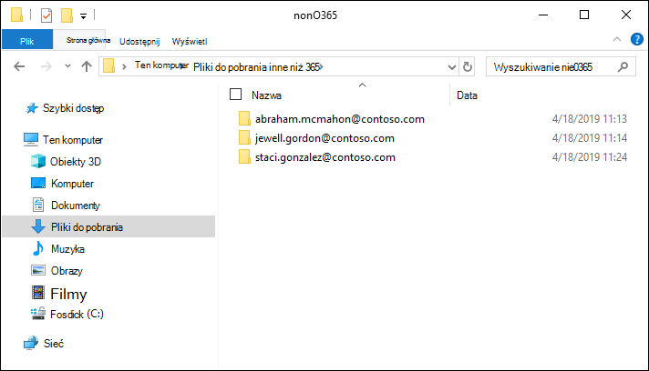
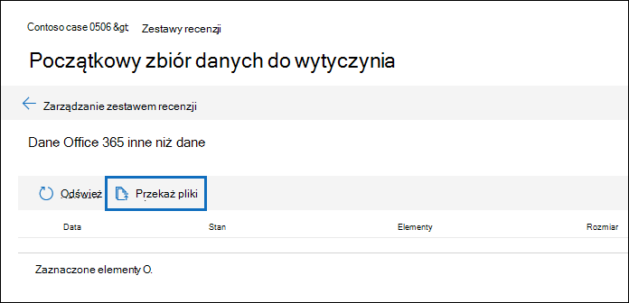

# Ładowanie danych innych niż microsoft 365 do zestawu przeglądów

Nie wszystkie dokumenty, które należy przeanalizować w Zbieranie elektronicznych materiałów dowodowych w Microsoft Purview (Premium) znajdują się na platformie Microsoft 365. Dzięki funkcji importowania danych spoza platformy Microsoft 365 w usłudze eDiscovery (Premium) możesz przekazać dokumenty, które nie znajdują się na platformie Microsoft 365, do zestawu przeglądów. W tym artykule pokazano, jak przenieść dokumenty spoza platformy Microsoft 365 do eDiscovery (Premium) na potrzeby analizy.

## Wymagania dotyczące przekazywania zawartości innej niż Office 365

Korzystanie z funkcji przekazywania spoza platformy Microsoft 365 opisanej w tym artykule wymaga posiadania następujących elementów:

- Wszystkim opiekunom, do których chcesz skojarzyć zawartość inną niż Microsoft 365, musi zostać przypisana odpowiednia licencja. Aby uzyskać więcej informacji, zobacz [Wprowadzenie do eDiscovery (Premium)](get-started-with-advanced-ediscovery.md#step-1-verify-and-assign-appropriate-licenses).

- Istniejący przypadek zbierania elektronicznych materiałów dowodowych (Premium).

- Opiekunowie muszą zostać dodani do sprawy, aby można było przekazać i skojarzyć z nimi dane spoza platformy Microsoft 365.

- Dane spoza platformy Microsoft 365 muszą być typem pliku obsługiwanym przez funkcję zbierania elektronicznych materiałów dowodowych (Premium). Aby uzyskać więcej informacji, zobacz [Obsługiwane typy plików w usłudze eDiscovery (Premium)](supported-filetypes-ediscovery20.md).

- Wszystkie pliki przekazane do zestawu przeglądów muszą znajdować się w folderach, w których każdy folder jest skojarzony z określonym opiekunem. Nazwy tych folderów muszą używać następującego formatu nazewnictwa: *alias@domainname*. Alias@domainname musi być aliasem i domeną platformy Microsoft 365 użytkownika. Możesz zebrać wszystkie foldery alias@domainname w folderze głównym. Folder główny może zawierać tylko foldery alias@domainname. Luźne pliki w folderze głównym nie są obsługiwane.

   Struktura folderów dla danych innych niż Microsoft 365, które chcesz przekazać, będzie podobna do poniższego przykładu:

   - c:\nonO365\abraham.mcmahon@contoso.com
   - c:\nonO365\jewell.gordon@contoso.com
   - c:\nonO365\staci.gonzalez@contoso.com

   Gdzie abraham.mcmahon@contoso.com, jewell.gordon@contoso.com i staci.gonzalez@contoso.com są adresami SMTP opiekunów w tej sprawie.

   

- Konto przypisane do grupy ról menedżera zbierania elektronicznych materiałów dowodowych (i dodane jako administrator zbierania elektronicznych materiałów dowodowych).

- Narzędzie AzCopy w wersji 8.1 zainstalowane na komputerze, który ma dostęp do struktury folderów zawartości innych niż Microsoft 365. Aby zainstalować narzędzie AzCopy, zobacz [Transfer data with the AzCopy v8.1 on Windows (Transferowanie danych za pomocą narzędzia AzCopy w wersji 8.1 w systemie Windows](/previous-versions/azure/storage/storage-use-azcopy)). Pamiętaj, aby zainstalować narzędzie AzCopy w lokalizacji domyślnej, czyli **%ProgramFiles(x86)%\Microsoft SDKs\Azure\AzCopy**. Należy użyć narzędzia AzCopy w wersji 8.1. Inne wersje narzędzia AzCopy mogą nie działać podczas ładowania danych innych niż Microsoft 365 w usłudze eDiscovery (Premium).

## Przekazywanie zawartości innej niż Microsoft 365 do zbierania elektronicznych materiałów dowodowych (Premium)

1. Jako menedżer zbierania elektronicznych materiałów dowodowych lub administrator zbierania elektronicznych materiałów dowodowych otwórz usługę eDiscovery (Premium) i przejdź do sytuacji, w których dane spoza platformy Microsoft 365 zostaną przekazane.  

2. Kliknij **pozycję Przejrzyj zestawy**, a następnie wybierz zestaw przeglądów, do który chcesz przekazać dane spoza platformy Microsoft 365.  Jeśli nie masz zestawu przeglądów, możesz go utworzyć. 
 
3. Otwórz zestaw przeglądów, klikając go lub wybierając go i klikając pozycję **Otwórz zestaw recenzji**.

4. W zestawie przeglądów kliknij pozycję **Zarządzaj zestawem przeglądów** (strzałka w dół tuż po opcji **Akcje**), a następnie kliknij opcję **Dane inne niż Office 365**.

5. Kliknij **pozycję Przekaż pliki** , aby uruchomić kreatora importowania danych.

   

   Pierwszy krok kreatora przygotowuje bezpieczną lokalizację usługi Azure Storage dostarczoną przez firmę Microsoft do przekazania plików.  Po zakończeniu przygotowywania przycisk **Dalej: Przekazywanie plików** staje się aktywny.

   
 
5. Kliknij **przycisk Dalej: Przekaż pliki**.

6. Na stronie **Przekazywanie plików** wykonaj następujące czynności:

   

   a. W polu **Ścieżka do lokalizacji plików** sprawdź lub wpisz lokalizację folderu głównego, w którym przechowywane są dane inne niż microsoft 365, które chcesz przekazać. Na przykład dla lokalizacji przykładowych plików pokazanych w **sekcji Przed rozpoczęciem** wpisz **%USERPROFILE\Downloads\nonO365**. Podanie prawidłowej lokalizacji zapewnia poprawną aktualizację polecenia AzCopy wyświetlanego w polu pod ścieżką.

   b. Kliknij **pozycję Kopiuj do schowka** , aby skopiować polecenie wyświetlane w polu .

7. Uruchom wiersz polecenia systemu Windows, wklej polecenie skopiowane w poprzednim kroku, a następnie naciśnij **klawisz Enter** , aby uruchomić polecenie AzCopy.  Po uruchomieniu polecenia pliki inne niż Microsoft 365 zostaną przekazane do lokalizacji usługi Azure Storage przygotowanej w kroku 4.

   

   > [!NOTE]
   > Jak wspomniano wcześniej, należy użyć narzędzia AzCopy w wersji 8.1, aby pomyślnie użyć polecenia dostarczonego na stronie **Przekazywanie plików** . Jeśli podane polecenie narzędzia AzCopy zakończy się niepowodzeniem, zobacz [Rozwiązywanie problemów z narzędziem AzCopy w sekcji eDiscovery (Premium)](troubleshooting-azcopy.md).

8. Wstecz do portal zgodności Microsoft Purview, a następnie kliknij przycisk **Dalej: Przetwarzanie plików** w kreatorze.  Inicjuje to przetwarzanie, wyodrębnianie tekstu i indeksowanie plików innych niż Microsoft 365, które zostały przekazane do lokalizacji usługi Azure Storage.  

9. Śledź postęp przetwarzania plików na stronie **Przetwarzanie plików** lub na karcie **Zadania** , wyświetlając zadanie o nazwie **Dodawanie danych innych niż Microsoft 365 do zestawu przeglądów**.  Po zakończeniu zadania nowe pliki będą dostępne w zestawie przeglądów.

   

10. Po zakończeniu przetwarzania możesz zamknąć kreatora.
