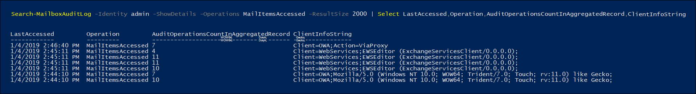

# <a name="use-microsoft-purview-audit-premium-to-investigate-compromised-accounts"></a>Używanie inspekcji usługi Microsoft Purview (Premium) do badania kont, których zabezpieczenia zostały naruszone

[!include[Purview banner](../includes/purview-rebrand-banner.md)]

Konto użytkownika z naruszeniem zabezpieczeń (nazywane również *przejęciem konta*) jest typem ataku, gdy osoba atakująca uzyskuje dostęp do konta użytkownika i działa jako użytkownik. Tego typu ataki czasami powodują więcej szkód, niż osoba atakująca mogła chcieć. Podczas badania naruszonych kont e-mail należy założyć, że naruszono więcej danych poczty, niż może to wskazywać śledzenie rzeczywistej obecności osoby atakującej. W zależności od typu danych w wiadomościach e-mail należy założyć, że poufne informacje zostały naruszone lub zostaną nałożone grzywny prawne, chyba że możesz udowodnić, że poufne informacje nie zostały ujawnione. Na przykład, organizacje regulowane HIPAA twarz znaczne grzywny, jeśli istnieją dowody, że informacje o zdrowiu pacjenta (PHI) zostały ujawnione. W takich przypadkach osoby atakujące prawdopodobnie nie będą zainteresowane phi, ale organizacje nadal muszą zgłaszać naruszenia danych, chyba że mogą udowodnić inaczej.

Aby ułatwić badanie naruszonych kont e-mail, przeprowadzamy teraz inspekcję dostępu do danych poczty za pomocą protokołów poczty i klientów za pomocą akcji *mailItemsAccessed* inspekcji skrzynki pocztowej. Ta nowa, poddana inspekcji akcja pomoże śledczym lepiej zrozumieć naruszenia danych poczty e-mail i ułatwi zidentyfikowanie zakresu naruszeń określonych elementów poczty, które mogą zostać naruszone. Celem korzystania z tej nowej akcji inspekcji jest defensybility kryminalistyki, aby pomóc stwierdzić, że określona część danych poczty nie została naruszona. Jeśli osoba atakująca uzyskała dostęp do określonej wiadomości e-mail, Exchange Online przeprowadza inspekcję zdarzenia, mimo że nic nie wskazuje na to, że element poczty został odczytany.

## <a name="the-mailitemsaccessed-mailbox-auditing-action"></a>Akcja inspekcji skrzynki pocztowej MailItemsAccessed

Nowa akcja MailItemsAccessed jest częścią nowej funkcji [Inspekcja (Premium](advanced-audit.md)). Jest to część [inspekcji Exchange skrzynki pocztowej](/office365/securitycompliance/enable-mailbox-auditing#mailbox-auditing-actions) i jest domyślnie włączona dla użytkowników, którzy mają przypisaną licencję Office 365 lub Microsoft 365 E5 lub dla organizacji z subskrypcją dodatku Zgodność platformy Microsoft 365 E5.

Akcja inspekcji skrzynki pocztowej MailItemsAccessed obejmuje wszystkie protokoły poczty: POP, IMAP, MAPI, EWS, Exchange ActiveSync i REST. Obejmuje ona również oba typy uzyskiwania dostępu do poczty: *synchronizacja* i *powiązanie*.

### <a name="auditing-sync-access"></a>Inspekcja dostępu do synchronizacji

Operacje synchronizacji są rejestrowane tylko wtedy, gdy do skrzynki pocztowej jest uzyskiwana wersja klasyczna klienta Outlook dla Windows lub Mac. Podczas operacji synchronizacji klienci zazwyczaj pobierają duży zestaw elementów poczty z chmury na komputer lokalny. Ilość inspekcji operacji synchronizacji jest ogromna. Dlatego zamiast generować rekord inspekcji dla każdego zsynchronizowanego elementu poczty, generujemy zdarzenie inspekcji folderu poczty zawierającego elementy, które zostały zsynchronizowane, i zakładamy, że *wszystkie* elementy poczty w zsynchronizowanej folderze zostały naruszone. Typ dostępu jest rejestrowany w polu OperationProperties rekordu inspekcji.

Zobacz krok 2 w sekcji [Use MailItemsAccessed audit records for forensic investigations (Używanie rekordów inspekcji MailItemsAccessed na potrzeby badań kryminalistycznych](#use-mailitemsaccessed-audit-records-for-forensic-investigations) ), aby zapoznać się z przykładem wyświetlania typu dostępu do synchronizacji w rekordzie inspekcji.

### <a name="auditing-bind-access"></a>Inspekcja dostępu powiązanego

Operacja powiązania to indywidualny dostęp do wiadomości e-mail. W przypadku dostępu powiązanego identyfikator InternetMessageId poszczególnych komunikatów zostanie zapisany w rekordzie inspekcji. Akcja inspekcji MailItemsAccessed rejestruje operacje powiązania, a następnie agreguje w jeden rekord inspekcji. Wszystkie operacje powiązania wykonywane w 2-minutowym interwale są agregowane w jednym rekordzie inspekcji w polu Foldery we właściwości AuditData. Każdy komunikat, do których uzyskano dostęp, jest identyfikowany przez jego identyfikator InternetMessageId. Liczba operacji powiązania zagregowanych w rekordzie jest wyświetlana w polu OperationCount we właściwości AuditData.

Zobacz krok 4 w sekcji [Use MailItemsAccessed audit records for forensic investigations (Używanie rekordów inspekcji MailItemsAccessed na potrzeby badań kryminalistycznych](#use-mailitemsaccessed-audit-records-for-forensic-investigations) ), aby zapoznać się z przykładem wyświetlania typu dostępu powiązania w rekordzie inspekcji.

### <a name="throttling-of-mailitemsaccessed-audit-records"></a>Ograniczanie przepustowości rekordów inspekcji MailItemsAccessed

Jeśli w czasie krótszym niż 24 godziny zostanie wygenerowanych więcej niż 1000 rekordów inspekcji MailItemsAccessed, Exchange Online przestanie generować rekordy inspekcji dla działania MailItemsAccessed. Gdy skrzynka pocztowa jest ograniczona, działanie MailItemsAccessed nie będzie rejestrowane przez 24 godziny po ograniczaniu skrzynki pocztowej. Jeśli skrzynka pocztowa została ograniczona, istnieje możliwość naruszenia zabezpieczeń skrzynki pocztowej w tym okresie. Rejestrowanie działania MailItemsAccessed zostanie wznowione po upływie 24-godzinnego okresu.

Oto kilka kwestii, o których należy pamiętać na temat ograniczania przepustowości:

- Mniej niż 1% wszystkich skrzynek pocztowych w Exchange Online jest ograniczanych
- W przypadku ograniczania przepustowości skrzynki pocztowej tylko rekordy inspekcji dla działania MailItemsAccessed nie są poddawane inspekcji. Nie ma to wpływu na inne akcje inspekcji skrzynki pocztowej.
- Skrzynki pocztowe są ograniczane tylko w przypadku operacji powiązania. Rekordy inspekcji dla operacji synchronizacji nie są ograniczane.
- Jeśli skrzynka pocztowa jest ograniczona, prawdopodobnie można założyć, że było działanie MailItemsAccessed, które nie zostało zarejestrowane w dziennikach inspekcji.

Zobacz krok 1 w sekcji [Use MailItemsAccessed audit records for forensic investigations (Używanie rekordów inspekcji MailItemsAccessed na potrzeby badań kryminalistycznych](#use-mailitemsaccessed-audit-records-for-forensic-investigations) ), aby zapoznać się z przykładem wyświetlania właściwości IsThrottled w rekordzie inspekcji.

## <a name="use-mailitemsaccessed-audit-records-for-forensic-investigations"></a>Używanie rekordów inspekcji MailItemsAccessed na potrzeby dochodzeń kryminalistycznych

Inspekcja skrzynek pocztowych generuje rekordy inspekcji w celu uzyskania dostępu do wiadomości e-mail, dzięki czemu możesz mieć pewność, że wiadomości e-mail nie zostały naruszone. Z tego powodu w okolicznościach, w których nie jesteśmy pewni, że uzyskano dostęp do niektórych danych, zakładamy, że ma to miejsce przez zarejestrowanie wszystkich działań w zakresie dostępu do poczty.

Używanie rekordów inspekcji MailItemsAccessed do celów kryminalistycznych jest zwykle wykonywane po rozwiązaniu naruszenia zabezpieczeń danych i eksmisji osoby atakującej. Aby rozpocząć badanie, należy zidentyfikować zestaw skrzynek pocztowych, których bezpieczeństwo zostało naruszone, i określić ramy czasowe, w których osoba atakująca miała dostęp do skrzynek pocztowych w organizacji. Następnie możesz użyć poleceń cmdlet **Search-UnifiedAuditLog** lub **Search-MailboxAuditLog** w [programie Exchange Online programu PowerShell](/powershell/exchange/connect-to-exchange-online-powershell) do przeszukiwania rekordów inspekcji, które odpowiadają naruszeniu danych.

Możesz uruchomić jedno z następujących poleceń, aby wyszukać rekordy inspekcji MailItemsAccessed:

**Ujednolicony dziennik inspekcji**:

```powershell
Search-UnifiedAuditLog -StartDate 01/06/2020 -EndDate 01/20/2020 -UserIds <user1,user2> -Operations MailItemsAccessed -ResultSize 1000
```

**Dziennik inspekcji skrzynki pocztowej**:

```powershell
Search-MailboxAuditLog -Identity <user> -StartDate 01/06/2020 -EndDate 01/20/2020 -Operations MailItemsAccessed -ResultSize 1000 -ShowDetails
```

> [!TIP]
> Jedna podstawowa różnica między tymi dwoma poleceniami cmdlet polega na tym, że za pomocą polecenia cmdlet **Search-UnifiedAuditLog** można wyszukiwać rekordy inspekcji pod kątem działań wykonywanych przez co najmniej jednego użytkownika. Dzieje się tak, ponieważ *identyfikatory UserId są* parametrem wielowartościowym. Polecenie cmdlet **Search-MailboxAuditLog** przeszukuje dziennik inspekcji skrzynki pocztowej dla jednego użytkownika.

Poniżej przedstawiono kroki korzystania z rekordów inspekcji MailItemsAccessed w celu zbadania ataku naruszonych użytkowników. Każdy krok przedstawia składnię poleceń dla poleceń cmdlet **Search-UnifiedAuditLog** lub **Search-MailboxAuditLog** .

1. Sprawdź, czy skrzynka pocztowa została ograniczona. Jeśli tak, oznaczałoby to, że niektóre rekordy inspekcji skrzynki pocztowej nie zostałyby zarejestrowane. W przypadku, gdy wszystkie rekordy inspekcji mają wartość "IsThrottled" to "True", należy założyć, że przez 24 godziny po wygenerowaniu tego rekordu żaden dostęp do skrzynki pocztowej nie został skontrolowany i że wszystkie dane poczty zostały naruszone.

   Aby wyszukać rekordy MailItemsAccessed, w których została ograniczona skrzynka pocztowa, uruchom następujące polecenie:

   **Ujednolicony dziennik inspekcji**:

   ```powershell
   Search-UnifiedAuditLog -StartDate 01/06/2020 -EndDate 01/20/2020 -UserIds <user1,user2> -Operations MailItemsAccessed -ResultSize 1000 | Where {$_.AuditData -like '*"IsThrottled","Value":"True"*'} | FL
   ```

   **Dziennik inspekcji skrzynki pocztowej**:

   ```powershell
   Search-MailboxAuditLog -StartDate 01/06/2020 -EndDate 01/20/2020 -Identity <user> -Operations MailItemsAccessed -ResultSize 10000 -ShowDetails | Where {$_.OperationProperties -like "*IsThrottled:True*"} | FL
   ```

2. Sprawdź działania synchronizacji. Jeśli osoba atakująca używa klienta poczty e-mail do pobierania wiadomości w skrzynce pocztowej, może odłączyć komputer od Internetu i uzyskać dostęp do wiadomości lokalnie bez interakcji z serwerem. W takim przypadku inspekcja skrzynek pocztowych nie będzie mogła zostać poddana inspekcji tych działań.

   Aby wyszukać rekordy MailItemsAccessed, w których elementy poczty były dostępne przez operację synchronizacji, uruchom następujące polecenie:

   **Ujednolicony dziennik inspekcji**:

   ```powershell
   Search-UnifiedAuditLog -StartDate 01/06/2020 -EndDate 02/20/2020 -UserIds <user1,user2> -Operations MailItemsAccessed -ResultSize 1000 | Where {$_.AuditData -like '*"MailAccessType","Value":"Sync"*'} | FL
   ```

   **Dziennik inspekcji skrzynki pocztowej**:

   ```powershell
   Search-MailboxAuditLog -StartDate 01/06/2020 -EndDate 01/20/2020 -Identity <user> -Operations MailItemsAccessed -ResultSize 10000 -ShowDetails | Where {$_.OperationProperties -like "*MailAccessType:Sync*"} | FL
   ```

3. Sprawdź działania synchronizacji, aby ustalić, że w dowolnym z nich wystąpiły w tym samym kontekście, w jakim osoba atakująca uzyskuje dostęp do skrzynki pocztowej. Kontekst jest identyfikowany i zróżnicowany przez adres IP komputera klienckiego używanego do uzyskiwania dostępu do skrzynki pocztowej i protokołu poczty. Aby uzyskać więcej informacji, zobacz [sekcję Identyfikowanie kontekstów dostępu różnych rekordów inspekcji](#identifying-the-access-contexts-of-different-audit-records) .

   Użyj właściwości wymienionych poniżej, aby zbadać ten problem. Te właściwości znajdują się we właściwości AuditData lub OperationProperties. Jeśli którakolwiek z synchronizacji ma miejsce w tym samym kontekście co działanie osoby atakującej, załóżmy, że osoba atakująca zsynchronizowała wszystkie elementy poczty ze swoim klientem, co oznacza, że cała skrzynka pocztowa została prawdopodobnie naruszona.

   <br>

   ****

   |Właściwość|Opis|
   |---|---|
   |ClientInfoString|Opisuje protokół, klienta (w tym wersję)|
   |ClientIPAddress|Adres IP maszyny klienckiej.|
   |Sessionid|Identyfikator sesji pomaga odróżnić akcje osoby atakującej od codziennych działań użytkowników na tym samym koncie (przydatne w przypadku kont, których zabezpieczenia zostały naruszone)|
   |Userid|Nazwa UPN użytkownika czytającego komunikat.|
   |

4. Sprawdź, czy nie są wykonywane działania powiązania. Po wykonaniu kroków 2 i 3 możesz mieć pewność, że cały inny dostęp do wiadomości e-mail przez osobę atakującą zostanie przechwycony w rekordach inspekcji MailItemsAccessed, które mają właściwość MailAccessType o wartości "Bind".

   Aby wyszukać rekordy MailItemsAccessed, w których elementy poczty były używane przez operację powiązania, uruchom następujące polecenie.

   **Ujednolicony dziennik inspekcji**:

   ```powershell
   Search-UnifiedAuditLog -StartDate 01/06/2020 -EndDate 01/20/2020 -UserIds <user1,user2> -Operations MailItemsAccessed -ResultSize 1000 | Where {$_.AuditData -like '*"MailAccessType","Value":"Bind"*'} | FL
   ```

   **Dziennik inspekcji skrzynki pocztowej**:

   ```powershell
   Search-MailboxAuditLog -StartDate 01/06/2020 -EndDate 01/20/2020 -Identity <user> -Operations MailItemsAccessed -ResultSize 10000 -ShowDetails | Where {$_.OperationProperties -like "*MailAccessType:Bind*"} | FL
   ```

   Wiadomości e-mail, do których uzyskano dostęp, są identyfikowane za pomocą identyfikatora wiadomości internetowej. Możesz również sprawdzić, czy jakiekolwiek rekordy inspekcji mają taki sam kontekst jak w przypadku innych działań osoby atakującej. Aby uzyskać więcej informacji, zobacz [sekcję Identyfikowanie kontekstów dostępu różnych rekordów inspekcji](#identifying-the-access-contexts-of-different-audit-records) .

   Dane inspekcji można używać na potrzeby operacji powiązania na dwa różne sposoby:

   - Uzyskaj dostęp do wszystkich wiadomości e-mail, do których osoba atakująca uzyskuje dostęp, używając identyfikatora InternetMessageId, aby je znaleźć, a następnie sprawdź, czy którakolwiek z tych wiadomości zawiera informacje poufne.
   - Użyj identyfikatora InternetMessageId, aby przeszukiwać rekordy inspekcji związane z zestawem potencjalnie poufnych wiadomości e-mail. Jest to przydatne, jeśli interesuje Cię tylko kilka komunikatów.

## <a name="filtering-of-duplicate-audit-records"></a>Filtrowanie zduplikowanych rekordów inspekcji

Zduplikowane rekordy inspekcji dla tych samych operacji powiązania, które występują w ciągu godziny od siebie, są filtrowane w celu usunięcia szumu inspekcji. Operacje synchronizacji są również odfiltrowane w odstępach jednej godziny. Wyjątek od tego procesu de-duplikacji występuje, jeśli w przypadku tego samego identyfikatora InternetMessageId wszystkie właściwości opisane w poniższej tabeli są różne. Jeśli jedna z tych właściwości jest inna w przypadku operacji duplikatu, zostanie wygenerowany nowy rekord inspekcji. Ten proces został opisany bardziej szczegółowo w następnej sekcji.

<br>

****

|Właściwość|Opis|
|---|---|
|ClientIPAddress|Adres IP komputera klienckiego.|
|ClientInfoString|Protokół klienta, klient używany do uzyskiwania dostępu do skrzynki pocztowej.|
|Element nadrzędny|Pełna ścieżka folderu elementu poczty, do których uzyskano dostęp.|
|Logon_type|Typ logowania użytkownika, który wykonał akcję. Typy logowania (i odpowiadająca im wartość wyliczenia) to Właściciel (0), Administrator (1) lub Delegat (2).|
|MailAccessType|Niezależnie od tego, czy dostęp jest operacją powiązania, czy operacją synchronizacji.|
|MailboxUPN|Nazwa UPN skrzynki pocztowej, w której znajduje się odczytywana wiadomość.|
|Użytkownik|Nazwa UPN użytkownika czytającego komunikat.|
|Sessionid|Identyfikator sesji pomaga odróżnić akcje osoby atakującej i codzienne działania użytkowników w tej samej skrzynce pocztowej (w przypadku naruszenia zabezpieczeń konta) Aby uzyskać więcej informacji na temat sesji, zobacz [Contextualizing attacker activity within sessions in Exchange Online (Kontekstowanie działania osoby atakującej w ramach sesji w Exchange Online](https://techcommunity.microsoft.com/t5/exchange-team-blog/contextualizing-attacker-activity-within-sessions-in-exchange/ba-p/608801)).|
|

## <a name="identifying-the-access-contexts-of-different-audit-records"></a>Identyfikowanie kontekstów dostępu różnych rekordów inspekcji

Często osoba atakująca może uzyskiwać dostęp do skrzynki pocztowej w tym samym czasie, gdy właściciel skrzynki pocztowej uzyskuje do niej dostęp. Aby odróżnić dostęp osoby atakującej od właściciela skrzynki pocztowej, istnieją właściwości rekordu inspekcji definiujące kontekst dostępu. Jak wyjaśniono wcześniej, gdy wartości dla tych właściwości są różne, nawet jeśli działanie występuje w interwale agregacji, generowane są oddzielne rekordy inspekcji. W poniższym przykładzie istnieją trzy różne rekordy inspekcji. Każdy z nich jest zróżnicowany przez właściwości Identyfikator sesji i ClientIPAddress. Zostaną również zidentyfikowane komunikaty, do których uzyskano dostęp.

<br>

****

|Rekord inspekcji 1|Rekord inspekcji 2|Rekord inspekcji 3|
|---|---|---|
|ClientIPAddress1<br/>**SessionId2**|ClientIPAddress2<br/>**SessionId2**|ClientIPAddress1<br/>**SessionId3**|
|InternetMessageIdA<br/>InternetMessageIdD<br/>InternetMessageIdE<br/>InternetMessageIdF<br/>|InternetMessageIdA<br/>InternetMessageIdC|InternetMessageIdB|
|

Jeśli dowolna z właściwości wymienionych w tabeli w [poprzedniej sekcji](#filtering-of-duplicate-audit-records) jest inna, zostanie wygenerowany oddzielny rekord inspekcji w celu śledzenia nowego kontekstu. Dostępy zostaną posortowane do oddzielnych rekordów inspekcji w zależności od kontekstu, w którym miało miejsce działanie.

Na przykład w rekordach inspekcji pokazanych na poniższym zrzucie ekranu, mimo że uzyskujemy dostęp do poczty z EWSEditor i OWA jednocześnie, działanie dostępu jest sortowane w różnych rekordach inspekcji w zależności od kontekstu, w którym miał miejsce dostęp. W takim przypadku kontekst jest definiowany przez różne wartości właściwości ClientInfoString.



Oto składnia polecenia pokazana na poprzednim zrzucie ekranu:

```powershell
Search-MailboxAuditLog -Identity admin -ShowDetails -Operations MailItemsAccessed -ResultSize 2000 | Select LastAccessed,Operation,AuditOperationsCountInAggregatedRecord,ClientInfoString
```
