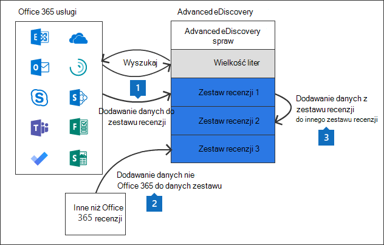

# Zarządzanie zestawami recenzji w programie Advanced eDiscovery

Zestawy recenzji to statyczny zestaw dokumentów, w których można analizować, wyświetlać, wyświetlać, tagować i eksportować dane w przypadku sprawy. Aby uzyskać więcej informacji na temat wykonywania tych zadań, zobacz:

- [Analizowanie danych w zestawie recenzji](analyzing-data-in-review-set.md)

- [Wykonywanie kwerendy dotyczącej danych w zestawie recenzji](review-set-search.md)

- [Wyświetlanie dokumentów w zestawie recenzji](view-documents-in-review-set.md)

- [Oznaczanie dokumentów w zestawie recenzji](tagging-documents.md)

- [Eksportowanie danych sprawy](exporting-data-ediscover20.md)

## Tworzenie zestawu recenzji

Zestawy recenzji można tworzyć na **karcie Zestawy recenzji** , klikając **pozycję + Dodaj zestaw recenzji**.

Na stronie **wysuwana Dodaj zestaw** recenzji wpisz nazwę zestawu recenzji, a następnie kliknij przycisk **Zapisz**. Nowy zestaw recenzji zostanie wyświetlony na liście na **karcie Zestawy** recenzji.

Istnieją trzy różne sposoby dodawania danych do zestawu recenzji w Advanced eDiscovery przypadku.

1. [Dodawanie wyników wyszukiwania do zestawu recenzji](add-data-to-review-set.md)

2. [Ładowanie danych nie Microsoft 365 do zestawu recenzji](load-non-Office-365-data-into-a-review-set.md)

3. [Dodawanie danych do zestawu recenzji z innego zestawu recenzji](add-data-to-review-set-from-another-review-set.md)

> [!NOTE]
> Nie można usuwać elementów z zestawu recenzji ani usuwać zestawów recenzji ze sprawy. Aby usunąć zestaw recenzji (i usunąć znajdujące się w nim dane), należy usunąć Advanced eDiscovery przypadku, gdy znajduje się w nim zestaw recenzji. Aby uzyskać więcej informacji, [zobacz Zamykanie lub usuwanie Advanced eDiscovery przypadku](close-or-delete-case.md).
