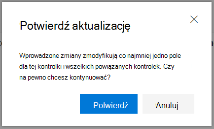
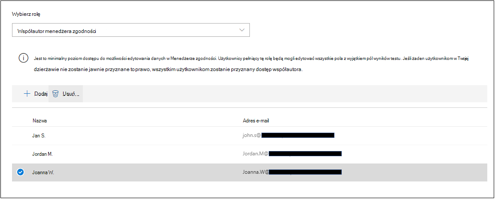
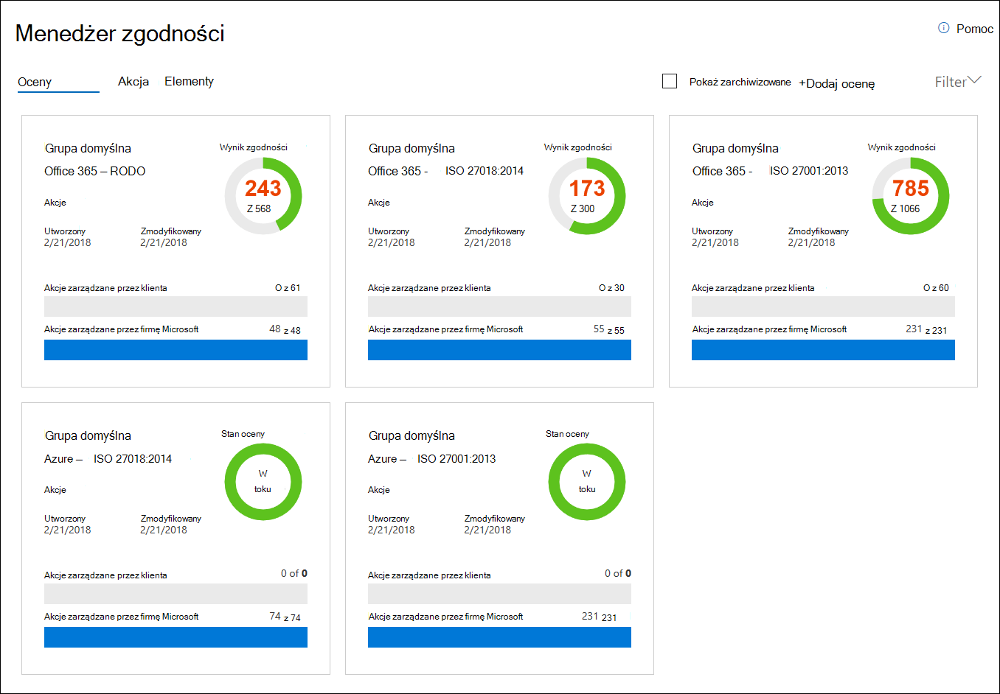
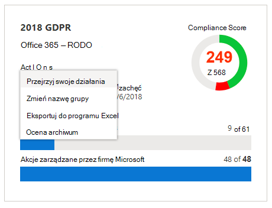
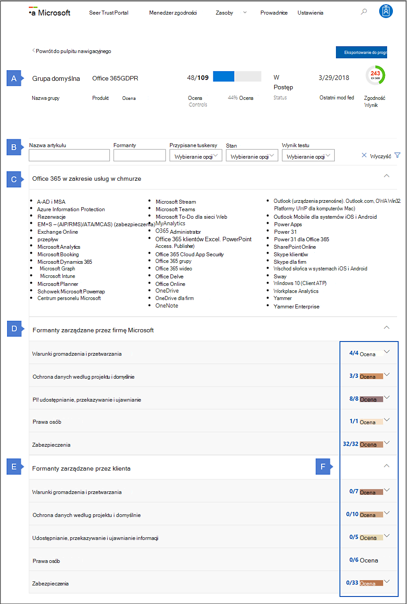
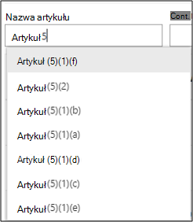
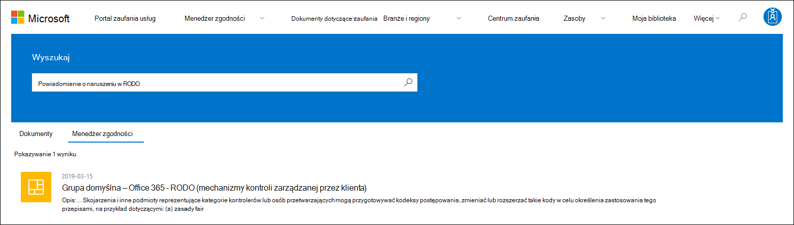
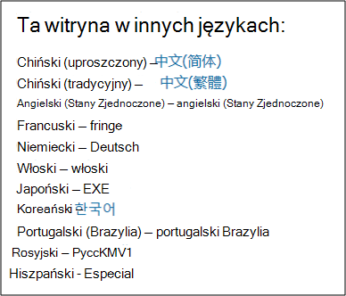

# Menedżer zgodności firmy Microsoft (klasyczny)

> [!IMPORTANT]
> **Menedżer zgodności (klasyczny) wkrótce zostanie usunięty z Portalu zaufania usług firmy Microsoft.** Zalecamy przejście do nowego Menedżera zgodności w centrum [Centrum zgodności platformy Microsoft 365, który](https://compliance.microsoft.com/) zapewnia ulepszone środowisko użytkownika i zaktualizowane mapowanie kontrolek. Klienci, którzy testują w wersji klasycznej, będą musieli tworzyć nowe oceny w nowym Menedżerze zgodności. Żadne istniejące dane, w tym Twoje oceny, kontrolki i inne dane, nie zostaną przeniesione do nowego Menedżera zgodności.

*Menedżer zgodności nie jest dostępny w usługach Office 365 obsługiwanych przez firmę 21Vianet, Office 365 Germany, Office 365 U.S. Government Community High (GCC High) ani Office 365 Department of Defense.*

Menedżer zgodności, narzędzie do oceny ryzyka oparte na przepływie pracy w Portalu zaufania usług [firmy Microsoft,](./get-started-with-service-trust-portal.md) umożliwia śledzenie, przypisywanie i weryfikowanie działań związanych ze zgodnością z przepisami organizacji związanych z usługami firmy Microsoft Professional i usługami firmy Microsoft w chmurze, takimi jak Microsoft Office 365, Microsoft Dynamics 365 i Microsoft Azure .

Menedżer zgodności:

- Stanowi połączenie szczegółowych informacji dostarczonych przez firmę Microsoft z audytorami i kontrolerami w ramach różnych audytów oferowanych przez firmę Microsoft w chmurze pod różnymi standardami (na przykład ISO 27001, ISO 27018 i NIST) i informacjami, które firma Microsoft kompiluje wewnętrznie w celu zapewnienia zgodności z przepisami (takimi jak HIPAA, Ogólne Rozporządzenie o Ochronie Danych Ue lub RODO) z własną samodzielną oceną zgodności organizacji z tymi standardami i przepisami.

- Umożliwia przypisywanie, śledzenie i rejestrowanie działań związanych z zgodnością i ocenami, które mogą pomóc Twojej organizacji przejść przez bariery zespołowe w celu osiągnięcia celów organizacji dotyczących zgodności z przepisami.

- Udostępnia wynik zgodności ułatwiający śledzenie postępów i określanie priorytetów kontrolek inspekcji, które pomogą ograniczyć ryzyko w organizacji.

- Zapewnia bezpieczne repozytorium do przekazywania dowodów i innych artefaktów związanych z działaniami zgodności oraz zarządzania nimi.

- Tworzy w programie Microsoft Excel szczegółowe raporty, które udokumentowały działania związane ze zgodnością wykonywane przez firmę Microsoft i Twoją organizację, które mogą być udostępniane audytorom, kontrolerom i innym uczestnikom projektu związanej ze zgodnością.

> [!IMPORTANT]
> Menedżer zgodności to pulpit nawigacyjny, który zawiera podsumowanie informacji o ochronie i zgodności danych oraz zalecenia dotyczące ulepszania ochrony i zgodności danych. Działania klienta w Menedżerze zgodności są zaleceniami. do każdej organizacji należy ocena skuteczności tych zaleceń w odpowiednim środowisku regulacyjnym przed wdrożeniem. Rekomendacje w Menedżerze zgodności nie należy interpretować jako gwarancji zgodności.

## Co to jest Menedżer zgodności?

Menedżer zgodności to narzędzie do oceny ryzyka oparte na przepływie pracy zaprojektowane w celu zarządzania zgodnością z przepisami w modelu współużytkowania obowiązków w chmurze. Menedżer zgodności udostępnia pulpit nawigacyjny z widokami standardów, przepisów i testów, które zawierają szczegóły implementacji kontroli firmy Microsoft i wyniki testów oraz wskazówki implementacji kontroli klienta i śledzenie śledzenia dla Twojej organizacji do wprowadzenia. Menedżer zgodności udostępnia definicje kontrolek certyfikacji, wskazówki dotyczące wdrażania i testowania kontrolek, oceniania formantów według ryzyka, zarządzania dostępem opartym na rolach i przepływu pracy działań kontroli w miejscu do śledzenia implementacji kontroli, testowania stanu i zarządzania dowodami. Menedżer zgodności optymalizuje obciążenie pracą pod kątem zgodności, umożliwiając klientom logiczne grupowanie testów i stosowanie testów kontroli testów do identycznych lub powiązanych kontrolek, co ogranicza duplikowanie nakładu pracy, który w przeciwnym razie może być wymagany do spełnienia identycznych wymagań kontroli na różnych certyfikatach.

## Testy w Menedżerze zgodności

Podstawowy składnik Menedżera zgodności jest nazywany *oceną*. Ocena jest oceną usługi firmy Microsoft na podstawie standardu certyfikacji lub rozporządzenia o ochronie danych (na przykład ISO 27001:2013 i RODO). Oceny pomagają w rozróżnieniu stanu ochrony danych i zgodności organizacji względem wybranego standardu branżowego dla wybranej usługi firmy Microsoft w chmurze. Oceny są zakończone przez wdrożenie kontrolek zamapowanych na oceniany standard certyfikacji.

Struktura oceny zależy od obowiązków firmy Microsoft i Twojej organizacji w zakresie oceny zagrożeń bezpieczeństwa i zgodności w chmurze oraz implementowania zabezpieczeń ochrony danych określonych przez standard zgodności, standard ochrony danych, przepisy lub prawo.

Ocena składa się z kilku składników, które są:

- **Usługi w zakresie —** każda ocena dotyczy określonego zestawu usługi firmy Microsoft, który znajduje się w sekcji In-Scope usług w chmurze.

- **Kontrolki zarządzane przez firmę Microsoft** — dla każdej usługi w chmurze firma Microsoft wdraża zestaw kontrolek i  zarządza nimi w ramach zgodności firmy Microsoft z różnymi standardami i przepisami. Te kontrolki są zorganizowane w rodziny  *kontrolek*  zgodne ze strukturą na podstawie odpowiednich certyfikacji lub przepisów, do których jest dostosowana ocena. W przypadku każdej kontroli zarządzanej przez firmę Microsoft Menedżer zgodności zawiera szczegółowe informacje na temat sposobu implementacji kontrolki przez firmę Microsoft oraz sposobu i godziny przetestowania i weryfikacji tej implementacji przez niezależnego audytora innej firmy.

  Oto przykład trzech kontrolek zarządzanych przez firmę Microsoft w rodzinie kontroli  zabezpieczeń na podstawie oceny Office 365 i RODO.

  

  1. Określa następujące informacje z certyfikacji lub rozporządzenia, które są mapowanie na kontrolkę zarządzaną przez firmę Microsoft.

     - **Identyfikator kontroli** — numer sekcji lub artykułu z certyfikacji lub przepisów, na które kontrolka jest za mapowania.

     - **Tytuł** — tytuł, który należy do odpowiednich certyfikacji lub przepisów.

     - **Identyfikator artykułu** — to pole jest uwzględniane tylko w przypadku oceny RODO, ponieważ określa odpowiedni numer artykułu RODO.

     - **Opis** — tekst standardu lub przepisów, które są mapowanie na wybraną kontrolkę zarządzaną przez firmę Microsoft.

  1. Wynik zgodności kontrolki, który wskazuje poziom ryzyka (z powodu niezgodności lub awarii kontroli) skojarzonego z każdą kontrolą zarządzaną przez firmę Microsoft. Aby [uzyskać więcej informacji, zobacz Opis wyniku](#understanding-the-compliance-score) zgodności. Należy zauważyć, że Wyniki zgodności są oceniane w zakresie od 1 do 10 i są oznaczane kolorami. Kolor żółty oznacza kontrolki o niskim poziomie ryzyka, pomarańczowy — kontrolki średniego ryzyka, a czerwony — kontrolki wysokiego ryzyka.

  1. Informacje o stanie implementacji kontrolki, dacie przetestowania kontrolki, o tym, kto wykonał test, i wyniku testu.

  1. W przypadku każdej kontrolki możesz kliknąć  przycisk Więcej, aby wyświetlić dodatkowe informacje, w tym szczegółowe informacje na temat implementacji kontrolki przez firmę Microsoft oraz szczegóły dotyczące sposobu przetestowania i walidacji kontrolki przez niezależnego audytora innej firmy.

- **Kontrolki zarządzane przez klienta** — jest to zbiór kontrolek, które są zarządzane przez Twoją organizację. Twoja organizacja jest odpowiedzialna za wdrożenie tych kontroli w ramach procesu zgodności z danym standardem lub przepisami. Mechanizmy kontroli zarządzanej przez klientów są również zorganizowane w rodziny kontrolek na potrzeby odpowiednich certyfikacji lub przepisów. Użyj kontrolek zarządzanych przez klienta, aby zaimplementować zalecane działania sugerowane przez firmę Microsoft w ramach działań dotyczących zgodności. Twoja organizacja może zarządzać procesem implementacji i oceny tej kontroli za pomocą wskazówek preskrypcji i zalecanych akcji klienta w każdej kontrolce zarządzanej przez klienta.

  Kontrolki zarządzane przez klienta w ramach oceny mają również wbudowane funkcje zarządzania przepływami pracy, których można używać do zarządzania postępami twojej organizacji i śledzenia ich prac nad ukończeniem oceny. Na przykład inspektor zgodności w Organizacji może przypisać element akcji administratorowi IT, który jest odpowiedzialny i musi mieć odpowiednie uprawnienia do wykonywania czynności zalecanych dla danej kontrolki. Po zakończeniu tej pracy administrator IT może przekazać dowód na swoje zadania implementacji (na przykład zrzuty ekranu konfiguracji lub ustawień zasad), a następnie przypisać element akcji z powrotem do inspektora zgodności, aby ocenić zebrane dowody, przetestować implementację kontrolki oraz zarejestrować datę implementacji i wyniki testów w Menedżerze zgodności. Aby uzyskać więcej informacji, zobacz [sekcję Zarządzanie procesem oceniania](#managing-the-assessment-process) w tym artykule.

## Uprawnienia i kontrola dostępu oparta na rolach

Menedżer zgodności używa modelu uprawnień kontroli dostępu opartej na rolach. Tylko użytkownicy z przypisaną rolą użytkownika mogą uzyskać dostęp do Menedżera zgodności, a akcje dozwolone przez poszczególnych użytkowników są ograniczone według typu roli.

Zwróć uwagę, że nie ma już domyślnej roli dostępu **gościa** . Każdy użytkownik musi mieć przypisaną rolę, aby móc korzystać z Menedżera zgodności i pracować z niego.

W poniższej tabeli opisano poszczególne uprawnienia Menedżera zgodności i ich uprawnienia użytkownika. W tabeli znajduje się również rola, do których przypisano poszczególne uprawnienia.

|Uprawnienie|Czytnik Menedżera zgodności|Współautor menedżera zgodności|Ocenianie menedżera zgodności|Administrator Menedżera zgodności|Administrator portalu|
|---|:---:|:---:|:---:|:---:|:---:|
|**Odczytywanie danych** — użytkownicy mogą odczytywać dane, ale nie mogą ich edytować.||||||
|**Edytowanie danych** — użytkownicy mogą edytować wszystkie pola z wyjątkiem pól Wynik testu i Data testu.||||||
|**Edytowanie wyników testu —** użytkownicy mogą edytować pola Wynik testu i Data testu.||||||
|**Zarządzanie ocenami** — użytkownicy mogą tworzyć, archiwizować i usuwać oceny.||||||
|**Zarządzanie użytkownikami** — użytkownicy mogą dodawać innych użytkowników w organizacji do ról Czytelnik, Współautor, Ocena i Administrator. Tylko użytkownicy z rolą administratora globalnego w Twojej organizacji mogą dodawać lub usuwać użytkowników z roli administratora portalu.||||||
|

## Opis wyniku zgodności

Na pulpicie nawigacyjnym Menedżer zgodności wyświetla łączny wynik Office 365 oceny w prawym górnym rogu kafelka. Jest to ogólny całkowity wynik oceny zgodności i jest to zsypacja punktów otrzymanych dla każdej oceny kontroli, która została oznaczona jako zaimplementowana i przetestowana w ramach oceny. Dodając ocenę, będziesz widzieć, że ocena zgodności jest już w drodze do ukończenia, ponieważ punkty za kontrolki zarządzane przez firmę Microsoft, które zostały zaimplementowane przez firmę Microsoft i przetestowane przez niezależne inne firmy, są już zastosowane.

Pozostałe punkty pochodzą z udanej oceny kontroli klienta, na podstawie implementacji i testowania kontrolek zarządzanych przez klienta, z których każda ma określoną wartość, która wpływa na ogólną ocenę zgodności.

W każdej ocenach jest wyświetlany wynik zgodności oparty na czynniku ryzyka, ułatwiający ocenę poziomu ryzyka (z powodu niezgodności lub niepowodzenia kontroli) skojarzonego z każdą kontrolą (w tym kontrolek zarządzanych przez firmę Microsoft i zarządzanych przez klienta) w ramach oceny. Każdej kontroli zarządzanej przez klienta przypisywana jest możliwa liczba punktów (nazywana klasyfikacją ważności * w skali od 1 do 10, gdzie więcej punktów przyznawanych jest za kontrolki skojarzone z wyższym współczynnikiem ryzyka, jeśli kontrolka zawiedzie, a formanty o niższym poziomie ryzyka są przyznawane w mniejszej liczbie punktów.

Na przykład wyświetlona poniżej kontrolka oceny zarządzania dostępem użytkowników ma klasyfikację bardzo wysokiego ryzyka i wyświetla przypisaną wartość 10.

Dla porównania, wyświetlona poniżej kontrolka oceny kopii zapasowej informacji ma klasyfikację ryzyka o niższym poziomie ważności i wyświetla przypisaną wartość 3.

Menedżer zgodności przypisuje do każdej kontrolki domyślną klasyfikację ważności. Klasyfikacje ryzyka są obliczane na podstawie następujących kryteriów:

- Określenie, czy kontrolka zapobiega zdarzeniam (najwyższa klasyfikacja), wykrywa zdarzenia, które się wydarzyły, lub poprawia wpływ zdarzenia (najniżej w rankingu). W kontekście klasyfikacji istotności wymagana kontrola, która zapobiega zagrożeń, ma przypisaną największą liczbę punktów; kontrolki wykrywające lub korygujące (niezależnie od tego, czy są one obowiązkowe, czy dyskrecjonalne), mają przypisaną najmniejszą liczbę punktów.

- To, czy kontrolka (po jej wdrożeniu) jest obowiązkowa i nie może być przekazywana przez użytkowników (na przykład użytkownicy muszą resetować swoje hasła i spełniać wymagania dotyczące długości i znaków hasła), czy może zostać przekazywana przez użytkowników (na przykład reguły biznesowe wymagające od użytkowników blokowania ekranów, gdy ich komputery nie są bez nadzoru).

- Mechanizmy kontroli związane z zagrożeniami związanymi z poufnością, integralnością i dostępnością danych, tego, czy zagrożenia te pochodzą z zagrożeń wewnętrznych lub zewnętrznych, oraz tego, czy zagrożenia są złośliwe, czy przypadkowe. Na przykład mechanizmy kontroli zapobiegające naruszeniu sieci przez atakującego zewnętrznego i uzyskiwaniu dostępu do danych umożliwiających identyfikację użytkownika będą miały więcej punktów niż kontrola związana z zapobieganiem przypadkowemu skonfigurowaniu przez pracownika ustawienia routera sieciowego, które powoduje uszkodzenie sieci).

- Czynniki ryzyka związane z czynnikami prawnymi i zewnętrznymi, takimi jak umowy, przepisy i zobowiązania publiczne, w przypadku każdej kontroli.

Wyświetlane wartości wyników zgodności kontrolki są w całości stosowane  do całkowitego wyniku zgodności na podstawie wyniku testu(-a) — kontrolka została zaimplementowana i przejdzie kolejny test testów lub nie; częściowej implementacji nie ma częściowych środków na implementację. Tylko wtedy, gdy kontrolka  ma ustawiony stan implementacji na  **Zaimplementowano** lub Alternatywna implementacja, a wynik testu ma ustawioną wartość **Passed**, przypisane punkty są dodawane do Wyniku całkowitej zgodności.

Co najważniejsze, Ocena zgodności może ułatwić określanie priorytetów, na których mechanizmach kontrolnych należy się skupić na implementacji, przez wskazanie, które kontrolki mogą stanowić większe potencjalne ryzyko w przypadku błędu związanego z kontrolką. Oprócz priorytetu opartego na czynnikach ryzyka, podczas kontroli oceniania są powiązane z innymi mechanizmami kontroli (w ramach tej samej lub w innej ocenie w ramach tego samego grupowania testów), ukończenie jednej kontroli może pomyślnie spowodować znaczne zmniejszenie nakładu pracy na podstawie synchronizacji wyników testów kontroli.

Na przykład na poniższym obrazie widać, że ocena Office 365 — RODO jest obecnie oceniana w 46%, przy co 51 z 111 ocen kontrolnych ukończonych dla oceny łącznej zgodności w wysokości 289 z możliwych 600.

W ramach oceny RODO kontrola 7.5.5 jest powiązana z 5 innymi kontrolkami (7.4.1, 7.4.3, 7.4.4, 7.4.8 i 7.4.9) każda z ocenami średniego do wysokiego ryzyka wynosi 6 lub 8). Korzystając z filtru oceny, wybraliśmy wszystkie te kontrolki, dzięki czemu są one widoczne w widoku oceny. Poniżej widać, że żadna z nich nie została już ocenić.

 Ponieważ te 6 kontrolek są powiązane, wykonanie jednej z nich spowoduje synchronizację tych wyników testów we wszystkich powiązanych kontrolkach w ramach tej oceny (podobnie jak w przypadku wszelkich powiązanych kontrolek w ramach testu, który jest w tej samej grupie testów). Po ukończeniu wdrażania i testowania kontroli 7.5.5 RODO obszar szczegółów kontrolki odświeża się, aby pokazać, że zostały ocenić wszystkie 6 kontrolek, co odpowiada zwiększeniu liczby ocenianych kontrolek do 57 i 51% oceny, a także zmianie całkowitego wyniku kontroli na poziomie +40.

To okno dialogowe aktualizacji potwierdzenia zostanie wyświetlone, jeśli chcesz zmienić Stan implementacji powiązanej kontrolki w sposób, który będzie miał wpływ na inne powiązane kontrolki.

> [!NOTE]
> Obecnie tylko oceny dla usług Office 365 w chmurze zawierają ocenę zgodności. Oceny dla platformy Azure i usługi Dynamics pokazują stan oceny.

## Metodologia wyników zgodności

Wynik zgodności, podobnie jak wynik bezpiecznego wyniku firmy Microsoft, jest podobny do innych systemów oceniania opartych na zachowaniu. aktywność twojej organizacji może zwiększyć jej wynik zgodności, wykonując działania związane z ochroną danych, prywatnością i zabezpieczeniami.

> [!NOTE]
> Ocena zgodności nie wyraża bezwzględnego pomiaru zgodności organizacji z żadnymi określonymi standardami lub przepisami. Wyraża on zakres przyjętej kontroli, który może zmniejszyć ryzyko związane z danymi osobistymi i prywatnością. Żadna usługa nie może zagwarantować, że użytkownik jest zgodny ze standardem lub przepisami, a Ocena zgodności nie powinna być interpretowana jako gwarancję w jakikolwiek sposób.

Oceny w Menedżerze zgodności są oparte na modelu współdzielonych obowiązków dotyczących przetwarzania danych w chmurze. W modelu współdzielonych obowiązków firma Microsoft i każdy z klientów odpowiadają za ochronę danych klienta, gdy te dane są przechowywane w chmurze.

Jak pokazano w poniższej oceny Office 365 RODO, firma Microsoft i klienci są odpowiedzialni za wykonywanie różnych akcji zaprojektowanych w celu spełnienia wymagań standardu lub rozporządzenia, które są oceniane. W celu wymierniania i zrozumienia wymaganych informacji. Menedżer zgodności traktuje wszystkie standardy i przepisy w ramach różnych standardów i przepisów tak, jakby były strukturyami kontroli. W ten sposób działania wykonywane przez firmę Microsoft i klientów w ramach każdej oceny wymagają wdrożenia i weryfikacji różnych kontrolek.

Oto podstawowy przepływ pracy typowej akcji:

1. Menedżer ds. zgodności, ryzyka, prywatności i/lub ochrony danych w organizacji przypisuje zadanie osobie w organizacji w celu wdrożenia kontroli. Ta osoba może być:

   - Właściciel zasad biznesowych

   - Implementer IT

   - Inna osoba w organizacji, która jest odpowiedzialna za wykonanie zadania

2. Ta osoba wykonuje zadania konieczne do wdrożenia kontrolki, przesyła dowód implementacji do Menedżera zgodności i oznacza kontrolki powiązane z akcją jako zaimplementowane. Po ukończeniu tych zadań przypisują oni Akcję do oceniania w celu sprawdzenia poprawności. Oceniając może:

   - Wewnętrzni oceniacy, którzy wykonują sprawdzanie poprawności kontrolek w organizacji

   - Oceniający zewnętrznie osoby oceniające, które sprawdzają, sprawdzają i certyfikują zgodność, takie jak niezależne organizacje trzecie, które sprawdzają usługi firmy Microsoft w chmurze

3. Oceniająco sprawdza kontrolkę, sprawdza dowód i oznacza kontrolki jako oceniane oraz wyniki oceny (np. pomyślnie)

Po ocenie wszystkich kontrolek skojarzonych z formularzem oceniania ocena jest uznawana za ukończoną.

Każda ocena w Menedżerze zgodności zawiera wstępnie załadowane informacje, które zawierają szczegółowe informacje o działaniach podejmowane przez firmę Microsoft w celu spełnienia wymagań kontrolek, za które firma Microsoft jest odpowiedzialna. Te informacje zawierają szczegółowe informacje o tym, jak firma Microsoft wdrożyła każdą kontrolę, jak i kiedy implementacja firmy Microsoft została oceniana i weryfikowana przez audytora innej firmy. Z tego powodu mechanizmy kontroli zarządzanej firmy Microsoft dla każdej oceny są oznaczane jako ocenione, a wynik oceny jest odzwierciedlany przez wynik oceny.

Każda ocena zawiera łączną ocenę zgodności opartą na modelu współdzielonych obowiązków. Wdrożenie i testowanie przez firmę Microsoft kontrolek dla systemu Office 365 stanowi część całkowitej możliwej liczby punktów skojarzonych z oceną RODO. W związku z implementacją i testami poszczególnych akcji klienta wynik oceny zgodności będzie zwiększany o wartość przypisaną do kontrolki.

### Metodologia oceniania na podstawie ryzyka

Menedżer zgodności stosuje metodologię oceniania na podstawie ryzyka o skali od 1 do 10, która przypisuje większą wartość kontrolom, co oznacza większe ryzyko w przypadku niepowodzenia lub niezgodności kontrolki. System oceniania używany na podstawie wyniku zgodności opiera się na kilku kluczowych czynnikach, takich jak:

- Istota kontrolki

- Poziom ryzyka związanego z kontrolą w zależności od rodzajów zagrożeń

- Sterowniki zewnętrzne dla kontrolki

### Istota kontrolki

Istota kontrolki zależy od tego, czy kontrolka jest obowiązkowa, czy dyskrecjonalna, oraz od tego, czy ma ona charakter zapobiegający, deklaracyjny czy korygający.

### Obowiązkowy lub dyskrecjonalny

*Obowiązkowe kontrolki*  to kontrolki, których nie można pominąć celowo ani przypadkowo. Przykładem typowej obowiązkowej kontroli są centralnie zarządzane zasady dotyczące haseł, które ustawiają wymagania dotyczące długości, złożoności i wygasania haseł. Aby uzyskać dostęp do systemu, użytkownicy muszą przestrzegać tych wymagań.

*Mechanizmy kontroli dyskrecjonalnej*  polegają na tym, że użytkownicy rozumieją zasady i działają odpowiednio. Przykładem może być zasada wymagająca od użytkowników zablokowania komputera w przypadku opuszczenia jej przez użytkownika, ponieważ zależy ona od użytkownika.

### Zapobieganie, wykrywaniu lub korygowaniu

*Kontrolki zapobiegające są*  tymi, które zapobiegają określonemu ryzyku. Na przykład ochrona informacji w miejscu przy użyciu szyfrowania jest kontrolą zapobiegawczą atakom, naruszeniem i tym podobnemu. Rozdzielenie obowiązków jest kontrolą zapobiegawną zarządzaniu konfliktem zainteresowań i zabezpieczeniu się przed oszustwami.

*Mechanizmy wykrywania*  to systemy aktywnie monitorują, aby zidentyfikować nieregularne warunki lub zachowania, które stanowią zagrożenie lub których można użyć do wykrycia łamania informacji lub ustalenia, czy wystąpiło naruszenie. Inspekcja dostępu do systemu i inspekcja uprzywilejowanych działań administracyjnych to typy kontroli monitorowania wykrywania. inspekcje zgodności z przepisami są rodzajem kontroli wykrywania służącej do wykrywania problemów z procesami.

*Mechanizmy kontroli korygują*  to osoby, które w sposób minimalny próbują zachować negatywne skutki zdarzenia związanego z zabezpieczeniami, podjąć działania naprawcze w celu zmniejszenia efektu natychmiastowego i, jeśli to możliwe, odwrócić szkody. Reagowanie na incydenty dotyczące prywatności to kontrolka korygujące w celu ograniczenia uszkodzeń i przywracania systemów do stanu operacyjnego w przypadku naruszenia.

Oceniając każdą kontrolkę przy użyciu tych czynników, ustalamy istotę kontrolki i przypisujemy jej wartość w stosunku do ryzyka, które ona reprezentuje.

**Zagrożenie**:

|Kontrolka|Obowiązkowy|Discretionary|
|---|---|----|
|**Preventative**|Wysoki poziom ryzyka|Średnie ryzyko|
|**Detective**|Średnie ryzyko|Niskie ryzyko|
|**Poprawianie**|Średnie ryzyko|Niskie ryzyko|

Zagrożenia dotyczą wszystkiego, co stanowi zagrożenie dla podstawowych, uniwersalnych standardów zabezpieczeń, nazywanych triadem CIA dla danych: poufność, integralność i dostępność:

- Poufność oznacza, że informacje mogą być odczytywane i zrozumiałe tylko przez zaufane, autoryzowane firmy.

- Integralność oznacza, że informacje nie zostały zmodyfikowane ani zniszczyne przez nieupoważnione podmioty.

- Dostępność oznacza, że dostęp do informacji można łatwo uzyskać za pomocą wysokiej jakości usługi.

Błędy dowolnej z tych cech są uznawane za naruszenie systemu jako całości. Zagrożenia mogą pochodzić zarówno ze źródeł wewnętrznych, jak i zewnętrznych, a intencje aktora mogą być przypadkowe lub złośliwe. Te czynniki są szacowane w macierzy zagrożeń, która przypisuje poziom zagrożeń wysoki, umiarkowany lub niski do każdej kombinacji scenariuszy.

|Czynnik|Wewnętrzny|Wewnętrzny|Zewnętrzna|Zewnętrzna|
|---|---|---|---|----|
||*Złośliwy*|*Przypadkowe*|*Złośliwy*|*Przypadkowe*|
|**Poufność**|(H, M lub L)|(H, M lub L)|(H, M lub L)|(H, M lub L)|
|**Integralność**|(H, M lub L)|(H, M lub L)|(H, M lub L)|(H, M lub L)|
|**Dostępność**|(H, M lub L)|(H, M lub L)|(H, M lub L)|(H, M lub L)|
|

**Sterowniki zewnętrzne**:

|Umowy|Przepisy|Zobowiązania publiczne|
|---|---|---|
|(H, M lub L)|(H, M lub L)|(H, M lub L)|

Czynniki zewnętrzne, takie jak obowiązujące przepisy, umowy i zobowiązania publiczne, mogą mieć wpływ na mechanizmy kontroli mające na celu ochronę danych i zapobieganie naruszeniu danych, a każdemu z tych czynników są przypisywane wartości ryzyka bądź wartości Wysokie, Średnie lub Niskie.

Szacowana liczba wystąpień tych wartości ryzyka wysokiego, średniego lub niskiego na 15 możliwych scenariuszach ryzyka reprezentujących czynniki CIA/Threat i Sterowniki prawne/zewnętrzne są łączone w celu zapewnienia oceny ryzyka, która uwzględnia prawdopodobieństwo wystąpienia ryzyka i liczbę wystąpień ryzyka przy danej wartości jako znaczącej i jest uwzględniana podczas obliczania klasyfikacji istotności kontrolki.

Na podstawie klasyfikacji ważności kontrolki przypisywana jest jej wartość wyniku zgodności, liczba z grupy od 1 (niska) do 10 (wysoka), pogrupowana w następujące kategorie ryzyka:

|Poziom ryzyka|Wartość kontrolki|
|---|:---:|
|Niska|1-3|
|Umiarkowane|6|
|High (Wysoki)|8|
|Poważny|10|

Przez określanie priorytetów kontroli oceny o najwyższych wartościach wyników zgodności organizacja będzie skupiać się na elementach najwyższego ryzyka i otrzymywać proporcjonalnie wyższe opinie dodatnie w postaci dodatkowych punktów dodanych do łącznej oceny zgodności dla każdej zakończonej oceny kontroli.

### Podsumowanie metodologii obliczania wyników

Ocena zgodności jest podstawowym elementem sposobu, w jaki Menedżer zgodności ułatwia organizacjom zrozumienie zgodności z przepisami i zarządzanie nimi. Ocena zgodności jest wyrażeniem zgodności firmy z określonym standardem lub przepisami w liczbie, gdzie im wyższa ocena (do maksymalnej liczby punktów przydzielonych na ocenę), tym lepsza jest zgodność z przepisami w firmie. Zrozumienie metodologii oceniania zgodności, w której do kontrolek oceny są przypisywane wartości istotności ryzyka od 1 do 10 (od najwyższej do najwyższej), a także sposób, w jaki oceny ukończonej kontroli dodają do łącznej oceny zgodności, ma kluczowe znaczenie dla organizacji w zakresie ustalania priorytetów ich działań.

## Grupowanie ocen

Podczas tworzenia nowego oceniania jest wyświetlany monit o utworzenie grupy w celu przypisania oceny do istniejącej grupy lub przypisania jej do istniejącej grupy. Grupy umożliwiają logiczne organizowanie ocen oraz udostępnianie typowych informacji i zadań przepływu pracy między ocenami, które mają takie same lub powiązane kontrolki zarządzane przez klienta.

Na przykład możesz grupować oceny według lat, zespołów, działów lub instytucji w organizacji albo grupować je według lat. Oto kilka przykładów grup i zawartych w nich ocen.

- Oceny RODO — 2018

  - Office 365 + RODO

  - Azure + RODO

  - Dynamics + RODO

- Azure Assessments — 2018

  - Azure + RODO

  - Azure + ISO 27001:2013

  - Azure + ISO 27018:2014

- Oceny zabezpieczeń danych i prywatności

  - Office 365 + ISO 27001:2013

  - Office 365 + ISO 27018:2014

  - Azure + ISO 27001:2013

  - Azure + ISO 27018:2014

> [!TIP]
> Przed dodaniem nowych ocen zalecamy określenie strategii grupowania dla organizacji.

Są to wymagania dotyczące grupowania ocen:

- Nazwy grup (nazywane również identyfikatorami *grup) muszą być unikatowe w organizacji.

- Grupy mogą zawierać oceny dla tego samego certyfikatu/przepisów, ale każda grupa może zawierać tylko jedną ocenę określonej pary usług/certyfikacji w chmurze. Na przykład grupa nie może zawierać dwóch oceniań do Office 365 i RODO. Podobnie grupa może zawierać wiele ocen dla tej samej usługi w chmurze, o ile odpowiadające im certyfikaty/przepisy dla każdej z nich są inne.

Po dodaniu oceny do grupowania oceniania nie można zmienić grupowania. Możesz zmienić nazwę grupy oceniania, co zmieni nazwę grupowania oceniania dla wszystkich ocen skojarzonych z tą grupą. Można utworzyć ocenę i nową grupę oceniania oraz skopiować informacje z istniejącej oceny, co w praktyce powoduje zduplikowanie tej oceny w innej grupie oceniania. Archiwizowanie oceny przerywa relację między tym ocenianiem a grupą oceniania. Dodatkowe aktualizacje innych powiązanych ocen nie są już odzwierciedlane w zarchiwizowanej ocenie.

Jak wyjaśniono wcześniej, jedną z najważniejszych zalet korzystania z grup jest to, że gdy dwie różne testy w tej samej grupie współużytkują tę samą kontrolę zarządzaną przez klienta (i dlatego akcje klienta będą takie same w przypadku każdej kontrolki), to ukończenie szczegółów implementacji, informacji o testach i stanu kontrolki w jednej testowej zostanie zsynchronizowane z tę samą kontrolą w innej ocenie w grupie. Innymi słowy, jeśli testy mają tę samą kontrolę i te testy znajdują się w tej samej grupie, wystarczy zarządzać procesem oceniania dla kontrolki w jednej takiej grupie. Wyniki dla tej kontrolki zostaną automatycznie zsynchronizowane z innymi testami. Na przykład iso 27001 i ISO 27018 mają kontrolkę związaną z zasadami haseł. Jeśli stan testu dla kontrolki jest ustawiony na "Pomyślnie" w jednej testowej, kontrolka zostanie zaktualizowana (i oznaczona jako "Przekazana") w drugiej testach, o ile obie testy są częścią tej samej grupy testów.

Rozważmy na przykład dwie powiązane mechanizmy kontroli oceniania, które mają na celu szyfrowanie danych w sieciach publicznych, kontrolę 6.10.1.2 w ramach oceny Office 365 — ocena RODO i kontrolę SC-13 w programie Office 365 — ocena NIST 800-53. Są to powiązane mechanizmy kontroli nad ocenami w dwóch różnych ocenach w grupie domyślnej. Początkowo żadna ocena nie zakończyła żadnych ocen kontroli klienta, jak jest wyświetlana na pulpicie nawigacyjnym menedżera zgodności, który pokazuje te dwie oceny.

Klikając kontrolkę **Office 365** — RODO i używając kontrolek filtrowania w celu wyświetlenia kontrolki RODO 6.10.1.2, widzimy, że kontrolka NIST 800-53 SC-13 jest wymieniona jako powiązana kontrolka.

Tutaj pokazujemy ukończenie wdrażania i testowania kontroli RODO 6.10.1.2.

Przechodząc do powiązanej kontrolki w testie grupym, widzimy, że program NIST 800-53 SC-13 został również oznaczony jako ukończony z taką samą datą i godziną bez konieczności wdrażania ani testowania.

Wracam do pulpitu nawigacyjnego widać, że każda ocena ma ukończoną jedną ocenę kontrolną i że łączny wynik w zakresie zgodności każdej oceny został zwiększony o 8 (wartość wyniku zgodności tej kontrolki udostępnionej).

## Funkcje administracyjne

Istnieją określone funkcje administracyjne, które są dostępne tylko dla konta administratora dzierżawy i będą widoczne tylko po zalogowaniu się jako administrator globalny.

> [!NOTE]
> Uprawnienie Dostęp do dokumentów ograniczonych na liście rozwijanej umożliwia administratorom uzyskiwanie użytkownikom dostępu do dokumentów z ograniczeniami, które firma Microsoft udostępnia w Portalu zaufania usług. Funkcja Dokumenty z ograniczeniami nie jest dostępna, ale zostanie wkrótce w wkrótce dostępna.

### Przypisywanie ról Menedżera zgodności użytkownikom

Każda rola Menedżera zgodności ma nieco inne uprawnienia. Możesz wyświetlić uprawnienia przypisane do poszczególnych ról, zobaczyć, w jakich rolach pełnią poszczególne role, oraz dodać lub usunąć użytkowników z tej roli za pośrednictwem Portalu zaufania usług, wybierając pozycję **Administrator w menu** Administrator, a następnie wybierając pozycję **Ustawienia.**

Aby dodać lub usunąć użytkowników z ról Menedżera zgodności.

1. Przejdź do witryny [https://servicetrust.microsoft.com](https://servicetrust.microsoft.com).

2. Zaloguj się przy użyciu Azure Active Directory administratora globalnego.

3. Na górnym pasku menu Portalu zaufania usług kliknij pozycję **Administrator**, a następnie wybierz **pozycję Ustawienia**.

4. Na **liście rozwijanej Wybierz** rolę kliknij rolę, którą chcesz zarządzać.

5. Użytkownicy dodani do poszczególnych ról są wymienini na **stronie Wybieranie** roli.

6. Aby dodać użytkowników do tej roli, kliknij pozycję **Dodaj**. W **oknie dialogowym** Dodawanie użytkowników kliknij pole użytkownika. Możesz przewinąć listę dostępnych użytkowników lub rozpocząć wpisywanie nazwy użytkownika, aby przefiltrować listę według wyszukiwany termin. Kliknij użytkownika, aby dodać to konto do listy **Dodaj** użytkowników w celu zapewnienia obsługi administracyjnej tej roli. Jeśli chcesz dodać wielu użytkowników jednocześnie, zacznij wpisywać nazwę użytkownika w celu filtrowania listy, a następnie kliknij użytkownika, który chcesz dodać do listy. Kliknij **pozycję Zapisz** , aby aprowizować wybraną rolę tym użytkownikom.

   

7. Aby usunąć użytkowników z tej roli, zaznacz użytkowników i kliknij pozycję **Usuń**.

   

## Ustawienia prywatności użytkownika

Niektóre przepisy wymagają, aby organizacja mogła usuwać dane historii użytkowników. Aby włączyć tę funkcję, Menedżer zgodności **udostępnia** funkcje zachowania Ustawienia prywatności użytkowników, które umożliwiają administratorom:

- [Wyszukiwanie użytkownika](#search-for-a-user)

- [Eksportowanie raportu historii danych konta](#export-a-report-of-account-data-history)

- [Ponowne przypisanie czynności do akcji](#reassign-action-items)

- [Usuwanie historii danych użytkownika](#delete-user-data-history)

### Wyszukiwanie użytkownika

Aby wyszukać konto użytkownika:

1. Wprowadź adres e-mail użytkownika, wpisując alias (informacje z lewej strony symbolu @) i wybierając nazwę domeny, klikając listę sufiksów domeny po prawej stronie. Jeśli jest to dzierżawa z wieloma zarejestrowanymi domenami, możesz sprawdzić dwukrotnie sufiks nazwy domeny adresu e-mail, aby upewnić się, że jest poprawny.

2. Po prawidłowym wprowadzeniu nazwy użytkownika kliknij pozycję **Wyszukaj**.

3. Jeśli konto użytkownika nie zostanie znalezione, na stronie zostanie wyświetlony komunikat o błędzie "Nie można odnaleźć użytkownika". Sprawdź informacje o adresie e-mail użytkownika, w razie potrzeby popraw je i kliknij przycisk **Wyszukaj** , aby spróbować ponownie.

4. Jeśli konto użytkownika zostanie znalezione, tekst przycisku zmieni się z przycisku Wyszukaj na **Wyczyść, co** oznacza, że zwrócone konto użytkownika jest kontekstem operacyjnym dla dodatkowych funkcji, które zostaną wyświetlone poniżej, że uruchomienie tych funkcji będzie stosowane do tego konta użytkownika.

5. Aby wyczyścić wyniki wyszukiwania i wyszukać innego użytkownika, kliknij pozycję **Wyczyść**.

### Eksportowanie raportu historii danych konta

Po zidentyfikowaniu konta użytkownika możesz chcieć wygenerować raport zależności połączonych z tym kontem. Te informacje umożliwiają ponowne przypisanie elementów otwartej akcji lub zapewnienie dostępu do przekazanych wcześniej dowodów.

 Aby wygenerować i wyeksportować raport:

1. Kliknij **pozycję Eksportuj** , aby wygenerować i pobrać raport czynności kontrolnych Menedżera zgodności obecnie przypisanych do zwróconego konta użytkownika oraz listę dokumentów przekazanych przez tego użytkownika. Jeśli nie ma przypisanych akcji ani przekazanych dokumentów, zostanie wyświetlony komunikat o błędzie "Brak danych dla tego użytkownika".

2. Raport zostanie pobrany w tle aktywnego okna przeglądarki— jeśli nie widzisz wyskakującego okienka pobierania, które chcesz sprawdzić w historii pobierania przeglądarki.

3. Otwórz dokument, aby przejrzeć dane raportu.

> [!NOTE]
> Nie jest to raport historyczny, w którym są zachowywane i wyświetlane zmiany stanu historii zadań czynności do wykonania. Wygenerowany raport jest migawką czynności kontrolnych przypisanych w momencie jego uruchamiania (sygnatura daty i czasu wpisana w raporcie). Na przykład kolejne ponowne przypisanie elementów akcji spowoduje, że dane raportu migawkowego będą inne, jeśli ten raport zostanie ponownie wygenerowany dla tego samego użytkownika.

### Ponowne przypisanie czynności do akcji

Ta funkcja umożliwia organizacji usuwanie aktywnych lub zaległych zależności na koncie użytkownika przez ponowne przypisanie wszystkich elementów własności elementów akcji (w tym aktywnych i ukończonych czynności do czynności) z zwróconego konta użytkownika do nowego wybranego poniżej użytkownika. Ta akcja nie powoduje zmiany historii przekazywania dokumentów dla zwróconego konta użytkownika.

 Aby ponownie przypisać czynności do innego użytkownika:

1. Kliknij pole wprowadzania, aby wyszukać i wybrać innego użytkownika w organizacji, do którego mają zostać przypisane elementy akcji zwróconego użytkownika.

2. Wybierz **pozycję** Zamień, aby ponownie przypisać do nowo wybranego użytkownika wszystkie czynności do kontroli od zwróconego użytkownika.

3. Zostanie wyświetlone okno dialogowe potwierdzenia z informacją "Spowoduje to ponowne przypisanie wszystkich elementów akcji sterowania od bieżącego użytkownika do wybranego użytkownika. Tej akcji nie można cofnąć. Czy na pewno chcesz kontynuować?"

4. Aby kontynuować, kliknij **przycisk OK**, a w przeciwnym razie kliknij przycisk **Anuluj**.

> [!NOTE]
> Wszystkie elementy akcji (zarówno aktywne, jak i ukończone) zostaną przypisane do nowo wybranego użytkownika. Nie ma to jednak wpływu na historię przekazywania dokumentów. We wszystkich dokumentach przekazanych przez wcześniej przypisanego użytkownika będzie nadal pokazywana data i godzina oraz nazwa poprzednio przypisanego użytkownika.

Aby usunąć wcześniej przypisanego użytkownika, należy zmienić historię przekazywania dokumentu, należy ją wykonać ręcznie. W takim przypadku administrator musi:

1. Otwórz wcześniej pobrany raport Eksportuj.

2. Zidentyfikuj i przejdź do odpowiedniego elementu akcji kontrolki.

3. Kliknij **pozycję Zarządzaj dokumentami** , aby przejść do repozytorium dowodów dla tej kontrolki.

4. Pobierz dokument.

5. Usuń dokument z repozytorium dowodów.

6. Ponownie przekaż dokument. Dokument będzie teraz miał nową datę i czas przekazania oraz nazwę użytkownika Przekazany przez.

### Usuwanie historii danych użytkownika

To ustawienie określa elementy akcji jako "nieprzypisane" dla wszystkich czynności przypisanych do zwróconego użytkownika. Ta wartość jest również ustawiana przez wartość "usunięto użytkownika" dla wszystkich dokumentów przekazanych przez zwróconego użytkownika

 Aby usunąć element akcji konta użytkownika i historię przekazywania dokumentów:

1. Kliknij przycisk **Usuń**.

    Zostanie wyświetlone okno dialogowe potwierdzenia z informacją "Spowoduje to usunięcie wszystkich przypisań elementów akcji sterowania i historii przekazywania dokumentu dla wybranego użytkownika. Tej akcji nie można cofnąć. Czy na pewno chcesz kontynuować?"

2. Aby kontynuować, kliknij **przycisk OK**, a w przeciwnym razie kliknij przycisk **Anuluj**.

## Korzystanie z Menedżera zgodności

Menedżer zgodności udostępnia narzędzia do przypisywania, śledzenia i nagrywania działań związanych z zgodnością i ocenami oraz do pomagania Twojej organizacji przejść przez bariery zespołowe w celu osiągnięcia celów organizacji dotyczących zgodności.

## Uzyskiwanie dostępu do Menedżera zgodności

Dostęp do Menedżera zgodności można uzyskać z Portalu zaufania usług. Każda osoba mająca konto Microsoft lub konto Azure Active Directory organizacji może uzyskać dostęp do Menedżera zgodności.

1. Przejdź do witryny [https://servicetrust.microsoft.com](https://servicetrust.microsoft.com/).

2. Zaloguj się przy użyciu Azure Active Directory użytkownika usługi Azure AD.

3. W Portalu zaufania usług kliknij pozycję **Menedżer zgodności**.

4. Po wyświetlaniu Umowy o nieu ujawnianiu informacji przeczytaj ją, a następnie **kliknij przycisk Zgadzam** się, aby kontynuować. Wystarczy to zrobić tylko raz, a pulpit nawigacyjny Menedżera zgodności zostanie wyświetlony.

   Aby rozpocząć, dodaliśmy domyślnie następujące testy:

   

5. Kliknij ikonę  **Pomoc** w krótkim przewodniku po Menedżerze zgodności.

## Wyświetlanie elementów akcji

Menedżer zgodności zapewnia wygodny widok wszystkich przypisanych czynności do oceny kontroli, co pozwala na szybkie i łatwe działanie w związku z nimi. Możesz wyświetlić wszystkie czynności do akcji lub wybrać czynności do akcji odpowiadające określonemu certyfikatowi, klikając kartę skojarzoną z tą oceną. Na przykład na poniższym obrazie wybrano kartę RODO pokazującą kontrolki związane z ocenami RODO.

Aby wyświetlić czynności do działań:

1. Przejdź do pulpitu nawigacyjnego Menedżera zgodności

2. Kliknij link **Czynności do** akcji, a strona zostanie odświeżona w celu pokazania czynności do czynności, które zostały Ci przypisane.

   Domyślnie są wyświetlane wszystkie elementy akcji. Jeśli masz działania w ramach wielu certyfikacji, nazwy certyfikatów będą wyświetlane na kartach w górnej części kontrolki oceny. Aby wyświetlić czynności do określonej certyfikacji, kliknij kartę.

## Dodawanie oceny

Aby dodać ocenę do Menedżera zgodności:

1. Na pulpicie nawigacyjnym Menedżera zgodności kliknij pozycję  **Dodaj ocenę**.

2. W **oknie** Dodawanie oceny możesz utworzyć nową grupę, aby dodać ocenę, lub możesz dodać ją do istniejącej grupy (wbudowana grupa nosi nazwę "Grupa początkowa"). W zależności od wybranej opcji wpisz nazwę nowej grupy lub wybierz istniejącą grupę z listy rozwijanej. Aby uzyskać więcej informacji, zobacz [Grupowanie ocen](#grouping-assessments).

   Jeśli utworzysz grupę, możesz również skopiować informacje z istniejącej grupy do nowej oceny. Oznacza to, że wszelkie informacje dodane do pól Szczegóły implementacji oraz Plan testowania i Odpowiedź zarządzania kontrolek zarządzanych przez klienta z testów w grupie, z których kopiujesz, są kopiowane do tych samych (lub powiązanych) kontrolek zarządzanych przez klienta w nowej ocenie. Jeśli dodajesz nową ocenę do istniejącej grupy, typowe informacje z oceny w tej grupie zostaną skopiowane do nowej oceny. Aby uzyskać więcej informacji, [zobacz Kopiowanie informacji z istniejących ocen](#copying-information-from-existing-assessments).

3. Kliknij **przycisk** Dalej i wykonaj następujące czynności:

   1. Wybierz usługę w chmurze firmy Microsoft, aby ocenić zgodność z **listy** rozwijanej Wybierz produkt.

   1. Wybierz certyfikat, pod który chcesz ocenić wybraną usługę w chmurze, z listy rozwijanej **Wybierz** certyfikację.

4. Kliknij **pozycję Dodaj do pulpitu nawigacyjnego** , aby utworzyć ocenę. Ocena zostanie dodana do pulpitu nawigacyjnego Menedżera zgodności jako nowy kafelek na końcu listy istniejących kafelków.

   **Kafelek Ocena** na pulpicie nawigacyjnym Menedżer zgodności wyświetla grupowanie oceny, nazwę oceny (automatycznie utworzoną jako połączenie nazwy usługi i wybranego certyfikatu), datę utworzenia i datę ostatniej modyfikacji, Czyli sumę wszystkich przypisanych wartości ryzyka kontroli, które zostały zaimplementowane.  testowane i przekazywane) oraz wzdłuż dolnej krawędzi wskaźników postępu, które pokazują liczbę kontrolek, które zostały poddane ocenie.

5. Kliknij nazwę oceny, aby ją otworzyć, i wyświetl szczegóły oceny.

6. Kliknij menu **Akcje,** aby wyświetlić przypisane czynności do działań, zmienić nazwę grupy oceniania, wyeksportować raport z oceną lub zarchiwizować ocenę.

   

## Kopiowanie informacji z istniejących ocen

Jak wyjaśniono wcześniej, podczas tworzenia grupy oceniania masz możliwość skopiowania informacji z oceny w istniejącej grupie do nowej grupy Ocena w nowej grupie. Umożliwia to zastosowanie testów i testów, które zostały wykonane, do tych samych kontrolek zarządzanych przez klienta w nowej testowaniu. Jeśli na przykład w organizacji masz grupę na wszystkie testy związane z RODO, możesz skopiować typowe informacje z istniejących prac nad ocenami po dodaniu nowej oceny do grupy.

Możesz skopiować następujące informacje od klienta do nowej oceny:

- Użytkownicy oceniania. Użytkownik oceny to użytkownik, do którym jest przypisana kontrolka.

- Stan, data testu i wyniki testu.

- Szczegóły implementacji i informacje o planie testowania.

Podobnie są synchronizowane informacje z udostępnionych kontrolek zarządzanych przez klienta w tej samej grupie oceniania. Ponadto informacje w powiązanych formantach zarządzanych przez klienta w ramach tej samej oceny również są synchronizowane.

## Wyświetlanie ocen

1. Zlokalizuj kafelek Ocena odpowiadający ocenie, którą chcesz wyświetlić, a następnie kliknij nazwę oceny, aby ją otworzyć i wyświetlić kontrolki firmy Microsoft i zarządzane przez klienta skojarzone z ocenami, wraz z listą usług w chmurze, które są w ramach oceny. Oto przykład oceny Office 365 i RODO.

   

2. W tej sekcji przedstawiono informacje podsumowujące w ramach oceny, w tym nazwę grupowania oceniania, produkt, nazwę oceny, liczbę kontrolek oceny

3. W tej sekcji przedstawiono kontrolki filtru oceny. Aby uzyskać bardziej szczegółowe objaśnienie sposobu używania kontrolek filtru oceny, zobacz sekcję [Zarządzanie procesem oceniania](#managing-the-assessment-process) .

4. W tej sekcji przedstawiono poszczególne usługi w chmurze, których dotyczy ocena.

5. Ta sekcja zawiera kontrolki zarządzane przez firmę Microsoft. Powiązane kontrolki są zorganizowane według rodziny kontrolek. Kliknij rodzinę kontrolek, aby ją rozwinąć i wyświetlić poszczególne kontrolki.

6. Ta sekcja zawiera kontrolki zarządzane przez klienta, które są również zorganizowane według rodziny kontrolek. Kliknij rodzinę kontrolek, aby ją rozwinąć i wyświetlić poszczególne kontrolki.

7. Zawiera łączną liczbę kontrolek w rodzinie kontrolek oraz liczbę kontrolek, które zostały już ocenione. Kluczową możliwością Menedżera zgodności jest śledzenie postępów organizacji w ocenie kontroli zarządzanych przez klienta. Aby uzyskać więcej informacji, zobacz [Opis sekcji Ocena zgodności](#understanding-the-compliance-score) .

## Zarządzanie procesem oceny

Twórca oceny jest początkowo jedynym użytkownikiem oceny. W przypadku każdej kontroli zarządzanej przez klienta możesz przypisać element akcji osobie w organizacji, aby ta osoba stała się użytkownikiem oceniania, który może wykonywać zalecane akcje klienta oraz zbierać i przekazywać informacje. Po przypisaniu elementu akcji możesz wysłać do tej osoby wiadomość e-mail zawierającą szczegółowe informacje, takie jak zalecane działania klienta i priorytet Czynności do akcji. Powiadomienie e-mail zawiera link do pulpitu nawigacyjnego **Czynności** do czynności, który zawiera listę wszystkich czynności do czynności przypisanych do tej osoby.

Poniżej znajduje się lista zadań, które można wykonywać przy użyciu funkcji przepływu pracy Menedżera zgodności.

1. **Za pomocą opcji filtrowania** możesz znaleźć określone mechanizmy kontroli **zgodności — Menedżer** zgodności udostępnia opcje filtru, które zapewniają wysoce szczegółowe kryteria wyboru dla wyświetlania kontrolek oceny, pomagając precyzyjnie określić określone obszary Twoich działań dotyczących zgodności.

   Kliknij ikonę lejka w prawej części strony, aby wyświetlić lub ukryć **kontrolki opcji** filtru. Te kontrolki umożliwiają określenie kryteriów filtrowania, a poniżej zostaną wyświetlone tylko kontrolki oceniania, które spełniają te kryteria. 

   - **Artykuły** — umożliwia filtrowanie nazwy artykułu i zwracanie kontrolek oceny skojarzonych z tym artykułem. Na przykład wpisanie ciągu "Artykuł (5)" zwraca listę zaznaczeń artykułów, których nazwa zawiera ten ciąg, na przykład artykuł (5)(1)(a), Artykuł (5)(1)(b), Artykuł (5)(1)(1)(c) itd. Wybranie opcji Artykuł (5)(1)(c) spowoduje zwrócenie kontrolek skojarzonych z artykułem (5)(1)(c). Jest to pole wielokrotnego wyboru, które używa operatora OR z wieloma wartościami — na przykład w przypadku wybrania opcji Artykuł (5)(1)(a) i dodania artykułu (5)(1)(c) filtr zwróci kontrolki skojarzone z artykułem (5)(1)(a) lub Artykułem (5)(1)(c).

     

   - **Kontrolki** — zwraca listę kontrolek, których nazwy pasują do filtru, na przykład wpisanie ciągu 7,3 zwraca listę elementów, takich jak 7.3.1, 7.3.4, 7.3.5 itd. Jest to pole wielokrotne, które używa operatora OR z wieloma wartościami — na przykład po wybraniu wartości 7.3.1 i dodaniu wartości 7.3.4 filtr zwraca kontrolki skojarzone z wartością 7.3.1 lub 7.3.4.

     

   - **Przypisani użytkownicy** — zwraca listę kontrolek przypisanych do wybranego użytkownika.

   - **Stan** — zwraca listę kontrolek o wybranym stanie.

   - **Wynik testu** — zwraca listę kontrolek z wybranym wynikiem testu.

   Gdy zastosujemy warunki filtru, widok odpowiednich kontrolek zmieni się na zgodny z warunkami filtru. Rozwiń sekcje rodzinne kontrolek, aby wyświetlić szczegóły kontrolki poniżej.

   

2. Jeśli po wybraniu odpowiednich filtrów nie zostaną wyświetlone żadne wyniki, oznacza to, że nie ma kontrolek odpowiadających określonym warunkom filtru. Jeśli na przykład wybierzesz określonego przypisanego  użytkownika **, a następnie** wybierzesz nazwę kontrolki, która odpowiada kontrolce przypisanej do tego użytkownika, na poniższej stronie nie zostaną wyświetlone żadne oceny.

3. **Przypisywanie** elementu akcji do użytkownika — Możesz przypisać Element akcji do osoby w celu wdrożenia wymagań certyfikacji/przepisów lub przetestowania, weryfikacji i dokumentacji wymagań implementacji Twojej organizacji. Po przypisaniu elementu akcji możesz wysłać do tej osoby wiadomość e-mail zawierającą szczegółowe informacje, takie jak zalecane działania klienta i priorytet Czynności do akcji. Możesz również ponownie nieprzypisać lub ponownie przypisać czynności do innej osoby.

4. **Zarządzanie dokumentami** — kontrolki zarządzane przez klientów mają również miejsce do zarządzania dokumentami związanymi z wykonywaniem zadań implementacji oraz do wykonywania zadań testowania i sprawdzania poprawności. Każda osoba mająca uprawnienia do edytowania danych w Menedżerze zgodności może przekazywać dokumenty, klikając pozycję **Zarządzaj dokumentami**. Po przesłaniu dokumentu możesz kliknąć pozycję Zarządzaj dokumentami, **aby wyświetlić i** pobrać pliki.

5. Podaj szczegóły implementacji i **testowania — każda** kontrola zarządzana przez klienta ma pole edytowalne, w którym użytkownicy mogą dodać szczegóły implementacji, które udokumentują kroki wykonane przez Twoją organizację w celu spełnienia wymagań certyfikacji/rozporządzenia oraz w celu weryfikacji i udokumentować, w jaki sposób Twoja organizacja spełnia te wymagania.

6. **Ustaw stan** — ustaw stan dla każdego elementu w ramach procesu oceniania. Dostępne wartości stanu są **zaimplementowane**, **Implementacja alternatywna**, **Planowane** i **Nie ma w zakresie**.

7. **Wprowadź datę** testu i wynik testu — Osoba pełniąca rolę Menedżera zgodności może sprawdzić, czy wykonano odpowiednie testowanie, przejrzeć szczegóły implementacji, plan testowania, wyniki testów i wszelkie przekazane dowody, a następnie ustawić datę testu i wynik testu. Dostępne wartości wyników testu są **przekazywane**, **ryzyko** niskiej i niskiej wydajności, ryzyko awarii **i średniego** ryzyka oraz ryzyko typu **Failed-High.**

## Zarządzanie czynnościami do akcji

Osoby biorące udział w procesie oceny w Organizacji mogą za pomocą Menedżera zgodności przeglądać mechanizmy kontroli zarządzanej przez klienta na podstawie wszystkich funkcji oceny, w przypadku których są użytkownikami. Gdy użytkownik się pojawi w Menedżerze zgodności i otworzy pulpit  nawigacyjny Czynności do czynności, zostanie wyświetlona lista czynności do jego przypisania. W zależności od roli Menedżera zgodności przypisanej do użytkownika może on dostarczać szczegóły implementacji lub testowania, aktualizować stan lub przypisywać czynności do wykonania.

Ponieważ kontrolki certyfikacji są na ogół implementowane przez jedną osobę i testowane przez inną osobę, element akcji kontrolki można wstępnie przypisać do jednej osoby do wdrożenia, a po jej ukończeniu ta osoba może ponownie przypisać element akcji kontrolki do następnej osoby w celu testowania kontrolek i przekazywania dowodów. To przypisanie/ponowne przypisanie akcji kontrolnych może być wykonywane przez wszystkich użytkowników, którzy mają rolę Menedżera zgodności o wystarczających uprawnieniach, co umożliwia centralne zarządzanie przypisaniami kontrolek lub decentralizowany routing elementów akcji kontroli, od implementera do testera odpowiednio do potrzeb.

Aby przypisać element akcji:

1. Na pulpicie nawigacyjnym Menedżera zgodności znajdź kafelek oceny, z którą chcesz pracować, i kliknij nazwę oceny, aby przejść do strony szczegółów oceny.

2. Możesz kliknąć pozycję **Filtruj** i użyć kontrolek filtru, aby znaleźć konkretną kontrolę, którą chcesz przypisać, lub

3. Przewiń w dół do sekcji Customer-Managed sterowania, rozwiń rodzinę kontrolek i przewijaj listę kontrolek, aż znajdziesz kontrolkę oceniania do przypisania.

4. W kolumnie **Przypisany użytkownik** kliknij pozycję **Przypisz**.

5. W oknie dialogowym Przypisywanie elementu akcji kliknij pole **Przypisz** do, aby wypełnić listę użytkowników, do których można przypisać akcję. Możesz przewinąć listę, aby znaleźć użytkownika docelowego, lub rozpocząć wpisywanie tekstu w polu w celu wyszukania nazwy użytkownika.

6. Kliknij użytkownika, aby przypisać mu ten element akcji.

7. Jeśli chcesz wysłać do użytkownika powiadomienie e-mail, upewnij się, że jest zaznaczone pole  wyboru Wyślij powiadomienie e-mail.

8. Wpisz notatki, które mają być wyświetlane dla tego użytkownika, i kliknij przycisk **Przypisz**.

   Użytkownik otrzyma powiadomienie o przypisaniu do czynności do wykonania i wszelkich podanych przez Ciebie notatek.

Notatki skojarzone z elementem akcji są zachowywane w sekcji notatek, dostępne po następnym przypisaniu tego elementu. Te notatki nie są tylko do odczytu, mogą być edytowane, zamieniane lub usuwane przez osobę przypisujące element akcji.

## Eksportowanie informacji z oceny

Możesz wyeksportować ocenę do pliku Excel, który może być przeglądany przez uczestników projektu zgodności w Twojej organizacji i zapewniany audytorom i kontrolerom. Ten raport z ocenami jest migawką oceny od daty i czasu utworzenia raportu i zawiera szczegóły zarówno kontrolek zarządzanych przez firmę Microsoft, jak i kontrolek zarządzanych przez klienta na potrzeby tej oceny, takich jak stan implementacji kontroli, data testu kontroli i wyniki testowania, a także linki do przekazanych dokumentów dowodowych. Zaleca się wyeksportowanie raportu z oceny przed zarchiwizowaniem oceny, ponieważ w zarchiwizowanej ocenie nie są zachowywane linki do przekazanych dokumentów.

Aby wyeksportować raport z oceny:

- Na pulpicie nawigacyjnym Menedżera **zgodności kliknij pozycję** Akcje na kafelku oceny, którą chcesz wyeksportować, a następnie wybierz pozycję **Eksportuj do Excel**

  Lub

- Jeśli wyświetlasz stronę Szczegóły oceny, kliknij przycisk **Eksportuj** do Excel, który znajduje się w prawym górnym rogu strony nad wynikiem zgodności oceny.

Raport z oceny zostanie pobrany w sesji przeglądarki. Jeśli nie widzisz wyskakującego okienka z tym związanego, możesz sprawdzić folder pobierania w przeglądarce.

## Archiwizowanie oceny

Po ukończeniu oceny, która nie jest już potrzebna w celu zachowania zgodności z przepisami, możesz ją zarchiwizować. Zarchiwizowane testy są usuwane z pulpitu nawigacyjnego assessments.

> [!NOTE]
> Podczas archiwizowania oceny nie można jej "niezaarchiwizować" ani przywrócić do stanu odczytu i zapisu w toku. Należy pamiętać, że w zarchiwizowanej ocenie nie są zachowywane linki do przekazanych dokumentów dowodowych, dlatego zdecydowanie zalecane jest wykonanie operacji eksportowania oceny przed jej zarchiwizowanie, ponieważ wyeksportowany raport z ocenami będzie zawierać linki do dokumentów dowodowych, umożliwiając kontynuowanie uzyskiwania do nich dostępu.

Aby zarchiwizować ocenę:

1. Na kafelku pulpitu nawigacyjnego żądanej oceny kliknij pozycję **Akcje**.

2. Wybierz pozycję **Ocena archiwum**.

   Zostanie **wyświetlone okno dialogowe** Archiwizuj oceny z prośbą o potwierdzenie, że chcesz zarchiwizować testy.

3. Aby kontynuować archiwizowanie, **kliknij pozycję** Archiwizuj lub pozycję **Anuluj**.

Aby wyświetlić zarchiwizowane testy:

1. Na pulpicie nawigacyjnym Menedżera zgodności zaznacz pole **wyboru Pokaż zarchiwizowane** .

   Zarchiwizowane testy zostaną wyświetlone w nowo widocznej sekcji poniżej pozostałych aktywnych formularzy oceniania pod pasekem " **Zarchiwizowane testy"**.

2. Kliknij nazwę oceny, którą chcesz wyświetlić.

Podczas wyświetlania zarchiwizowanej oceny nie będzie aktywna żadna z normalnie edytowalnych kontrolek (czyli implementacja, wyniki  testów), a przycisk Dokumenty zarządzane będzie nieobecny.

## Korzystanie z wyszukiwania

Kliknij lupę w prawym górnym rogu strony, aby rozwinąć pole Dane wejściowe wyszukiwania, wprowadź wyszukiwane terminy i naciśnij klawisz Enter. Zostanie wyświetlana kontrolka wyszukiwania z terminem wyszukiwania w polu wprowadzania w okienku wyszukiwania, a wyniki wyszukiwania zostaną wyświetlone poniżej.

Domyślnie funkcja wyszukiwania zwraca wyniki dokumentu i za pomocą list rozwijanych Filtruj według można uściślić wyświetlaną listę dokumentów w celu dodania lub usunięcia wyników wyszukiwania z widoku. Możesz użyć wielu atrybutów filtrów jednocześnie, aby zawęzić zakres zwróconych dokumentów do określonych usług w chmurze, kategorii rozwiązań dotyczących zgodności lub zabezpieczeń, regionów świata, czy branż. Kliknij link z nazwą dokumentu, aby pobrać dokument.

Kliknij link Menedżer zgodności, aby wyświetlić wyniki wyszukiwania kontrolek oceny Menedżera zgodności. Wymienione wyniki wyszukiwania pokazują datę utworzenia testu, nazwę grupowania testów, obowiązującą usługę w chmurze oraz to, czy kontrolki są zarządzane przez firmę Microsoft, czy przez klienta.

> [!NOTE]
> Dokumenty i raporty w Portalu zaufania usług są dostępne do pobrania przez co najmniej 12 miesięcy od ich publikacji lub do momentu, gdy stanie się dostępna nowa wersja dokumentu.

## Obsługa lokalizacji

Portal zaufania usług umożliwia wyświetlanie zawartości strony w różnych językach. Aby zmienić język strony, po prostu kliknij ikonę kuli ziemskiej w lewym dolnym rogu strony i wybierz język.

## Dziennik zmian dla kontrolek Customer-Managed danych

Menedżer zgodności został zaprojektowany, aby był regularnie aktualizowany w celu zachowania prędkości ze zmianami w zakresie wymogów prawnych, a także zmianami w naszych usługach w chmurze. Te aktualizacje obejmują zmiany dotyczące Customer-Managed sterowania. Dziennik zmian pomaga zrozumieć wpływ tych zmian, w tym szczegółowe informacje na temat dodawanej lub zmienianego zawartości oraz wskazówki dotyczące wpływu zmian na istniejące testy. Ogólnie rzecz biorąc, istnieją dwa typy zmian:

- **Istotna** zmiana to istotna zmiana w działaniu klienta, taka jak dodanie lub usunięcie kontrolki lub określonych numerowanych kroków albo zmiana wskazówek dotyczących obowiązków, zaleceń lub dowodów. W przypadku głównych zmian zalecamy, aby ponownie ocenić implementację i(lub) ocenę kontrolki, na która ma wpływ ta zmiana.

- **Nieznaczna** zmiana jest nieznaczną zmianą w działaniach klienta, taką jak naprawa literówek lub problemów z formatowaniem albo aktualizowanie lub poprawianie hiperlinków. Drobne zmiany zasadniczo nie wymagają ponownego oceny kontrolki. zalecamy jednak zapoznanie się ze zaktualizowaną akcją klienta.

### Kontrola zarządzana przez klienta — dziennik zmian z lipca 2018 r.

|Identyfikator kontrolki|Ocena|Typ zmiany|Opis zmiany|Zalecane działania dla klientów|
|---|---|---|---|---|---|---|---|---|
|45 c.F.R.  164.308(a)(7)(ii)(A)|Office 365: HIPAA|Główny|Dodano kontrolkę HITECH do oceny HIPAA na Office 365 |Przejrzyj dodaną kontrolę i zalecane działania klientów|
|45 c.F.R.  164.312(a)(6)(ii)|Office 365: HIPAA|Główny|Dodano kontrolkę HITECH do oceny HIPAA na Office 365|Przejrzyj dodaną kontrolę i zalecane działania klientów|
45 c.F.R.  164.312(c)(1)| Office 365: HIPAA|Główny| Dodano kontrolkę HITECH do oceny HIPAA na Office 365 |Przejrzyj dodaną kontrolę i zalecane działania klientów|
45 c.F.R.   164.316(b)(2)(iii)| Office 365: HIPAA|Główny|Dodano kontrolkę HITECH do oceny HIPAA na Office 365|Przejrzyj dodaną kontrolę i zalecane działania klientów|
|

### Formanty zarządzane przez klienta — dziennik zmian z kwietnia 2018 r.

|RODO|HIPAA|ISO 27001|ISO 27018|NIST 800-53|NIST 800-171|Typ zmiany|Opis zmiany|Zalecane działania dla klientów|
|---|---|---|---|---|---|---|---|---|
|6.13.2|||C.16.1.1|||Główny|Poprzednio numerowane jako 6.12.1.1. 
 Dodano szczegółowe informacje do zaleceń.|Ponownie oceniaj kontrolę: Przejrzyj zaktualizowane wskazówki w działaniach klienta i wykonaj zalecane czynności dotyczące wdrażania i oceniania kontroli.|
||||||3.1.6|Główny|Dodano instrukcje, które obejmują włączanie inspekcji i przeszukiwania dzienników inspekcji.|Przejrzyj zaktualizowane zalecenia w działaniach klientów.|
|6.8.2|||A.10.2|||Główny|Poprzednio numerowana jako 6.7.2.9. 
 Zaktualizowane wskazówki z dodatkowymi zaleceniami i czynnościami do działań.|Ponownie oceniaj kontrolę: Przejrzyj zaktualizowane wskazówki w działaniach klienta i wykonaj zalecane czynności dotyczące wdrażania i oceniania kontroli.|
|6.6.4|45 c.F.R.  164.312(a)(2)(i) 
 45 c.F.R.  164.312(d)|A.9.4.2||IA-2|3.5.1|Główny|Poprzednio numerowana jako 6.5.2.3. 
 Zaktualizowane wskazówki z dodatkowymi zaleceniami i czynnościami do działań.|Ponownie oceniaj kontrolę: Przejrzyj zaktualizowane wskazówki w działaniach klienta i wykonaj zalecane czynności dotyczące wdrażania i oceniania kontroli.|
|6.13.1|45 c.F.R.  164.308(a)(1)(i)|A.16.1|C.16.1|IR-4(a)|3.6.1|Główny|Poprzednio numerowane jako 6.12.1. 
 Zaktualizowane wskazówki z dodatkowymi zaleceniami i czynnościami do działań.|Ponownie oceniaj kontrolę: Przejrzyj zaktualizowane wskazówki w działaniach klienta i wykonaj zalecane czynności dotyczące wdrażania i oceniania kontroli.|
|6.7||||||Główny|Poprzednio numerowane jako 6.6.1.1.
 Zaktualizowane wskazówki z dodatkowymi zaleceniami i czynnościami do działań.|Ponownie oceniaj kontrolę: Przejrzyj zaktualizowane wskazówki w działaniach klienta i wykonaj zalecane czynności dotyczące wdrażania i oceniania kontroli.|
|6.6.5|||A.10.8|IA-3|3.5.2|Główny|Poprzednio numerowana jako 6.5.4.2. 
 Zaktualizowane wskazówki z dodatkowymi zaleceniami i czynnościami do działań.|Ponownie oceniaj kontrolę: Przejrzyj zaktualizowane wskazówki w działaniach klienta i wykonaj zalecane czynności dotyczące wdrażania i oceniania kontroli.|
|6.15.1||||||Główny|Poprzednio numerowana jako 6.14.1.3. 
 Zaktualizowane wskazówki z dodatkowymi zaleceniami i czynnościami do działań.|Ponownie oceniaj kontrolę: Przejrzyj zaktualizowane wskazówki w działaniach klienta i wykonaj zalecane czynności dotyczące wdrażania i oceniania kontroli.|
|||||AC-2(h)(2)||Niepełnoletni|Dodano link do linku Włącz blok inspekcji.|Nie trzeba nic akcję.|
|||||AC-2(7)(b)||Niepełnoletni|Dodano link do linku Włącz blok inspekcji.|Nie trzeba nic akcję.|
|||||AC-2(h)(1)||Niepełnoletni|Dodano link do linku Włącz blok inspekcji.|Nie trzeba nic akcję.|
||45 c.F.R.  164.308(a)(5)(ii)(C)|||AC-2(g)||Niepełnoletni|Dodano link do linku Włącz blok inspekcji.|Nie trzeba nic akcję.|
|||||AC-2(12)||Niepełnoletni|Dodano link do linku Włącz blok inspekcji.|Nie trzeba nic akcję.|
||45 c.F.R.  164.312(b)|A.12.4.3||AU-2(d)||Niepełnoletni|Dodano link do linku Włącz blok inspekcji.|Nie trzeba nic akcję.|
|||||AC-2(4)||Niepełnoletni|Dodano link do linku Włącz blok inspekcji.|Nie trzeba nic akcję.|
||||||3.1.7|Niepełnoletni|Dodano link do linku Włącz blok inspekcji.|Nie trzeba nic akcję.|
|||A.16.1.7|C.12.4.2, część 2|||Niepełnoletni|Dodano link do linku Włącz blok inspekcji.|Nie trzeba nic akcję.|
|||||AC-2(h)(3)||Niepełnoletni|Dodano link do linku Włącz blok inspekcji.|Nie trzeba nic akcję.|
|||A.12.4.2||||Niepełnoletni|Dodano link do linku Włącz blok inspekcji.|Nie trzeba nic akcję.|
|||A.7.2.8||||Niepełnoletni|Dodano linki do bladego przeszukiwania zawartości i portalu DSR.|Nie trzeba nic akcję.|
||45 c.F.R.  164.308(a)(3)(ii)(C)|||||Niepełnoletni|Dodano linki do linków Umożliwiających inspekcję oraz Office 365 tematów pomocy dla roli administratora.|Nie trzeba nic akcję.|
|5.2.1||||||Niepełnoletni|Poprzednio numerowana jako 5.2.2. 
 Objaśnione obowiązki klienta w ramach wskazówek.|Przejrzyj zaktualizowane zalecenia w działaniach klientów.|
|6.11.1|45 c.F.R.  164.312(e)(2)(ii)|A.10.1.1   A.10.1.2   A.18.1.5|C.10.1.1|SC-13|3.13.11|Niepełnoletni|Poprzednio numerowana jako 6.10.1.2. 
 Usunięto literówkę.|Nie trzeba nic akcję.|
|7.5.1||||||Niepełnoletni|Poprzednio numerowane jako A.7.4.1. 
 Usunięto literówkę.|Nie trzeba nic akcję.|
|||A.8.2.3|||3.1.3|Niepełnoletni|Usunięto niepotrzebne zdania.|Nie trzeba nic akcję.|
||45 c.F.R.  164.308(a)(4)(i)|A.6.1.2||AC-5(a)|3.1.2    3.1.4|Niepełnoletni|Zaktualizowane wskazówki z dodatkowymi zaleceniami i czynnościami do działań.|Przejrzyj zaktualizowane zalecenia w działaniach klientów.|
||45 c.F.R.  164.308(a)(7)(ii)(E)|||RA-2(a)||Niepełnoletni|Zaktualizowano link do tematu pomocy usługi importowania w celu użycia łącza FWLink.|Nie trzeba nic akcję.|
|

### Rodo Assessment Control Id Change Reference ( Odwołanie do zmiany w dzienniku zmian) z lutego 2018 r.

|Identyfikator poprzedniej kontrolki (wersja zapoznawcza z listopada 2017 r.)|Nowy identyfikator kontrolki (Wydanie z lutego 2018 r.)|
|---|---|
|5.2.2|5.2.1|
|5.2.3|5.2.2|
|5.2.4|5.2.3|
|6.1.1.1|6.2|
|6.10.1.2|6.11.1|
|6.10.2.5|6.11.2|
|6.11.1.2|6.12|
|6.12.1|6.13.1|
|6.12.1.1|6.13.2|
|6.12.1.5|6.13.3|
|6.14.1.3|6.15.1|
|6.14.2.1|6.15.2|
|6.14.2.3|6.15.3|
|6.2.1.1|6.3|
|6.3.2.2|6.4|
|6.4.3.1|6.5.2|
|6.4.3.2|6.8.1|
|6.4.3.3|6.5.3|
|6.5.2|6.6.1|
|6.5.2.1|6.6.2|
|6.5.2.2|6.6.3|
|6.5.2.3|6.6.4|
|6.5.4.2|6.6.5|
|6.6.1.1|6.7|
|6.7.2.7|6.8.1|
|6.7.2.9|6.8.2|
|6.8.1.4|6.9.1|
|6.8.4.1|6.9.3|
|6.8.4.2|6.9.4|
|6.9.2.1|6.10.1|
|6.9.2.3|6.10.2|
|A.7.1.1|7.2.1|
|A.7.1.2|7.2.2|
|A.7.1.3|7.2.3|
|A.7.1.4|7.2.4|
|A.7.1.5|7.2.5|
|A.7.1.6|7.2.6|
|A.7.1.7|7.2.7|
|A.7.2.1|7.3.1|
|A.7.2.10|7.3.9|
|A.7.2.11|7.3.10|
|A.7.2.2|7.3.2|
|A.7.2.3|7.3.3|
|A.7.2.4|7.3.4|
|A.7.2.5|7.3.5|
|A.7.2.6|7.3.6|
|A.7.2.7|7.3.7|
|A.7.2.8|7.3.8|
|A.7.3.1|7.4.1|
|A.7.3.10|7.4.10|
|A.7.3.2|7.4.2|
|A.7.3.3|7.4.3|
|A.7.3.4|7.4.4|
|A.7.3.5|7.4.5|
|A.7.3.6|7.4.6|
|A.7.3.7|7.4.7|
|A.7.3.8|7.4.8|
|A.7.3.9|7.4.9|
|A.7.4.1|7.5.1|
|A.7.4.2|7.5.2|
|A.7.4.3|7.5.3|
|A.7.4.4|7.5.4|
|A.7.4.5|7.5.5|
|B.8.1.1|8.2.1|
|B.8.1.2|8.2.2|
|B.8.1.3|8.2.3|
|B.8.1.4|8.2.4|
|B.8.1.5|8.2.5|
|B.8.1.6|8.2.6|
|B.8.2.1|8.3.1|
|B.8.3.1|8.4.1|
|B.8.3.2|8.4.2|
|B.8.3.3|8.4.3|
|B.8.4.1|8.5.1|
|B.8.4.2|8.5.2|
|B.8.4.3|8.5.4|
|B.8.4.4|8.5.5|
|B.8.4.5|8.5.3|
|B.8.4.6|8.5.6|
|B.8.4.7|8.5.7|
|B.8.4.8|8.5.8|
|