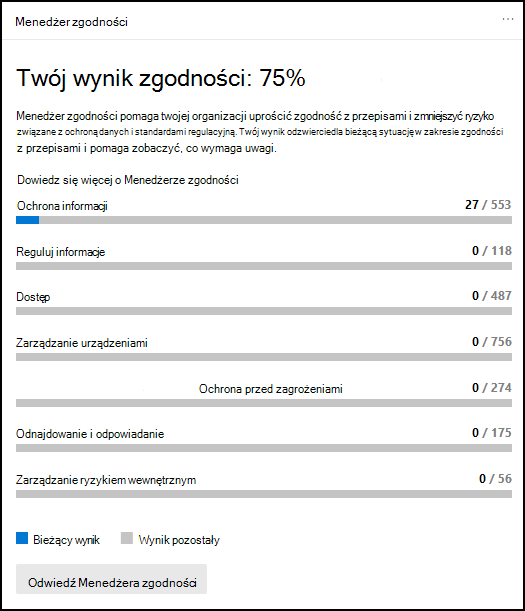
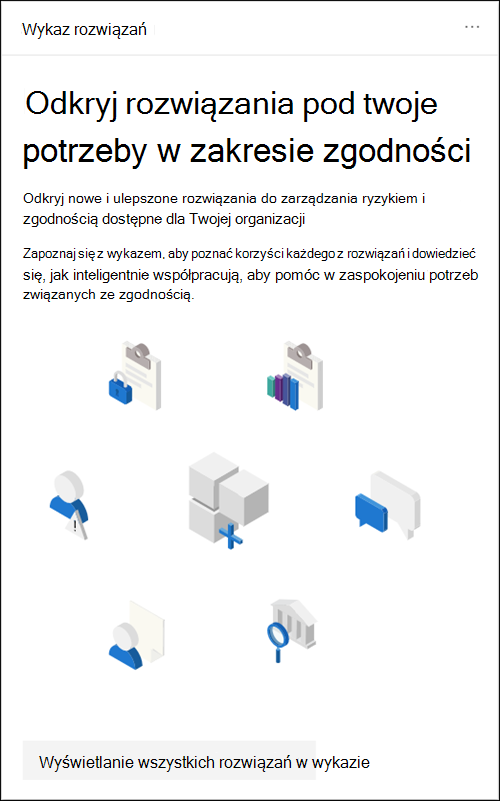
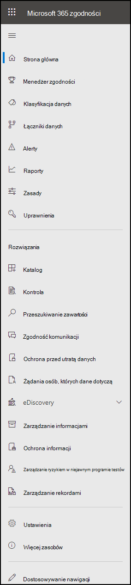

# Centrum zgodności platformy Microsoft 365

Jeśli chcesz, aby Twoja organizacja spełniała twoje zasady zgodności, zainteresuje Cię <a href="https://go.microsoft.com/fwlink/p/?linkid=2077149" target="_blank">Centrum zgodności platformy Microsoft 365.</a> Centrum Centrum zgodności platformy Microsoft 365 zapewnia łatwy dostęp do danych i narzędzi potrzebnych do zarządzania potrzebami organizacji w zakresie zgodności z przepisami.

Ten artykuł zawiera informacje na temat [Centrum zgodności platformy Microsoft 365, sposobu](#how-do-i-get-the-compliance-center) jej [uzyskania, często](#frequently-asked-questions) zadawanych pytań i [następnych kroków](#next-steps).

## Witamy w Microsoft 365 zgodności

Gdy po raz pierwszy Centrum zgodności platformy Microsoft 365 do komputera, zostanie ci powitana następująca wiadomość powitania:

Transparent powitalny zawiera kilka wskazówek na temat rozpoczynania pracy, z kolejnymi krokami oraz zaproszenie do nas do nas.

## Sekcja Karta

Po pierwszym odwiedzeniu witryny Centrum zgodności platformy Microsoft 365 sekcja karty na stronie głównej pozwala od razu sprawdzić, jak Twoja organizacja radzi sobie ze zgodnością z danymi, jakie rozwiązania są dostępne dla Twojej organizacji, oraz podsumowanie aktywnych alertów.

W tym miejscu możesz:

- Przejrzyj **kartę Menedżer zgodności firmy Microsoft** , co prowadzi do rozwiązania [Menedżera](compliance-manager.md) zgodności. Menedżer zgodności upraszcza sposób zarządzania zgodnością. Oblicza on wynik oparty na czynniku ryzyka, który umożliwia mierzenie postępów w realizacji zalecanych akcji, co pomaga ograniczyć ryzyko związane z ochroną danych i normami regulacyjną. Udostępnia również funkcje przepływów pracy i wbudowane mapowanie kontrolek, które ułatwiają wydajne przeprowadzanie działań udoskonalania.

    

- Zapoznaj się z **nową kartą** wykazu rozwiązań, która zawiera  linki do kolekcji zintegrowanych rozwiązań, które ułatwiają zarządzanie scenariuszami zgodności. Funkcje i narzędzia rozwiązania mogą obejmować kombinację zasad, alertów, raportów i nie tylko.

    

- Przejrzyj **kartę Aktywne alerty**, która zawiera podsumowanie najbardziej aktywnych alertów oraz link, za pomocą którego możesz wyświetlać bardziej szczegółowe informacje, takie jak Ważność, Stan, Kategoria i nie tylko.

    

Możesz także użyć funkcji Dodaj  karty, aby dodać dodatkowe karty, takie jak karta przedstawiająca zgodność aplikacji w chmurze Twojej organizacji, lub inna, wyświetlając dane o użytkownikach z udostępnionych plikami, z linkami do usługi [Defender for Cloud Apps](/cloud-app-security/) lub innych narzędzi, za pomocą których możesz eksplorować dane.

## Łatwa nawigacja do większej liczby funkcji i możliwości dotyczących zgodności

Oprócz linków na kartach na stronie głównej po lewej stronie ekranu będzie również dostępne okienko nawigacji, które zapewnia łatwy dostęp do alertów[, raportów](../security/office-365-security/alerts.md)[, zasad](reports-in-security-and-compliance.md)[, rozwiązań](alert-policies.md) zgodności i nie tylko. Aby dodać lub usunąć opcje niestandardowego okienka nawigacji, użyj kontrolki **dostosuj nawigację** w okienku nawigacji. Zostanie otwarte okno **Dostosowywanie ustawień okienka** nawigacji, aby można było skonfigurować elementy wyświetlane w okienku nawigacji.

 

****

|Nawigacja|Komentarze|
|---|---|
||Wybierz **pozycję Narzędzia** główne, aby wrócić Centrum zgodności platformy Microsoft 365 głównej. 
 Odwiedź **Menedżera zgodności,** aby sprawdzić wynik zgodności i [rozpocząć zarządzanie zgodnością](compliance-manager.md) w swojej organizacji. 
 Wybierz **sekcję Klasyfikacja danych** , [aby uzyskać dostęp](classifier-learn-about.md) do przeszkolnych klasyfikatorów [, definicji](sensitive-information-type-entity-definitions.md) encji typu informacji poufnych, zawartości i [eksploratorów](data-classification-activity-explorer.md) aktywności. 
 Wybierz **pozycję Łączniki danych**[, aby skonfigurować](archiving-third-party-data.md) łączniki w celu importowania i archiwizowania danych w Microsoft 365 subskrypcji. 
 Przejdź do **alertów, aby** wyświetlić i rozwiązać [alerty](alert-policies.md) 
Odwiedź **stronę Raporty**, aby wyświetlić dane dotyczące użycia i przechowywania [etykiet, dopasowania](sensitivity-labels.md) i zastąpienia zasad [DLP](view-the-dlp-reports.md)[, plików](/cloud-app-security/file-filters) [udostępnionych,](/cloud-app-security/discovered-apps) używania aplikacji innych firm i nie tylko. 
 Przejdź do **zasad,** aby skonfigurować zasady zarządzania danymi, zarządzania urządzeniami i odbierania [alertów](../security/office-365-security/alerts.md). Możesz również uzyskać dostęp do zasad [ochrony](dlp-learn-about-dlp.md) przed zasadami ochrony danych [i przechowywania](retention.md) . 
 Wybierz **pozycję** Uprawnienia, aby zarządzać osobami w organizacji, które mają dostęp do Centrum zgodności platformy Microsoft 365, aby wyświetlać zawartość i wykonywać zadania. 
 Skorzystaj z linków w sekcji **Rozwiązania,** aby uzyskać dostęp do rozwiązań zgodności Twojej organizacji. Obejmują one: 
 [Katalog](microsoft-365-solution-catalog.md)   Poznaj, dowiedz się więcej i zacznij korzystać z inteligentnych rozwiązań do zarządzania ryzykiem i zgodnością, które są dostępne dla Twojej organizacji. 
 [Inspekcja](search-the-audit-log-in-security-and-compliance.md)   Dziennik inspekcji jest pomocą w celu zbadania typowych problemów dotyczących pomocy technicznej i zgodności. 
 [Przeszukiwanie zawartości](search-for-content.md)   Wyszukiwanie zawartości umożliwia szybkie znajdowanie wiadomości e-mail w skrzynkach pocztowych programu Exchange, dokumentach w witrynach SharePoint i lokalizacjach sieci OneDrive oraz konwersacjach za pomocą wiadomości błyskawicznych w aplikacjach Microsoft Teams i Skype dla firm. 
 [Zgodność komunikacji](communication-compliance.md)   Zminimalizuj ryzyko związane z komunikacją, automatycznie przechwytując nieodpowiednie wiadomości, badając możliwe naruszenia zasad i podejmowanie działań naprawczych. 
 [Informacje na temat ochrony przed utratą danych](dlp-learn-about-dlp.md)   Wykrywanie poufnej zawartości używanej i udostępnianej w całej organizacji, w chmurze i na urządzeniach oraz zapobiega przypadkowej utracie danych. 
 [Żądania osób, których dane dotyczą](/compliance/regulatory/gdpr-manage-gdpr-data-subject-requests-with-the-dsr-case-tool)   Znajdź i wyeksportuj dane osobowe użytkownika, aby ułatwić odpowiadanie na wnioski osób, których dane dotyczą, o ogólne rozporządzenie o ochronie danych (RODO). 
 [zbierania elektronicznych materiałów dowodowych](overview-ediscovery-20.md)   Rozwiń tę sekcję, aby korzystać z podstawowych funkcji i Advanced eDiscovery do zachowywania, zbierania, przeglądania, analizowania i eksportowania zawartości, która odpowiada wewnętrznym i zewnętrznym analizom Twojej organizacji. 
 [Zarządzanie informacjami](manage-information-governance.md)   Zarządzaj cyklem życia zawartości za pomocą funkcji importowania, przechowywania i klasyfikowania danych krytycznych dla firmy, co pozwala zachować to, czego potrzebujesz, i usunąć to, czego nie potrzebujesz. 
 [Ochrona informacji](information-protection.md)   Odnajdowanie, klasyfikowanie i ochrona poufnej i krytycznej zawartości biznesowej na przestrzeni całego cyklu życia organizacji. 
 [Zarządzanie ryzykiem w niejawnym programie testów](insider-risk-management.md)   Wykrywaj ryzykowne działania w całej organizacji, aby ułatwić szybkie identyfikowanie, badanie i działanie w związku z zagrożeniami i zagrożeniami w niejawnym programie testów. 
 [Zarządzanie rekordami](records-management.md)   Automatyzowanie i upraszczanie harmonogramu przechowywania rekordów dotyczących wymogów prawnych, prawnych i biznesowych w organizacji.|
|

## Jak uzyskać centrum zgodności?

- Jeśli nie masz jeszcze nowej Centrum zgodności platformy Microsoft 365, wkrótce ją otrzymasz. Ta Centrum zgodności platformy Microsoft 365 jest teraz na ogół dostępna dla Microsoft 365 klientów korzystających z Microsoft 365 SKU.
- Aby odwiedzić witrynę Centrum zgodności platformy Microsoft 365, jako administrator globalny, administrator zgodności lub administrator danych zgodności, przejdź do [https://compliance.microsoft.com](https://compliance.microsoft.com) witryny i zaloguj się.

## Często zadawane pytania

**Dlaczego nie widzę jeszcze nowej Centrum zgodności platformy Microsoft 365?**

Najpierw upewnij się, że masz odpowiednie licencje i uprawnienia. Następnie zaloguj się na stronie <a href="https://go.microsoft.com/fwlink/p/?linkid=2077149" target="_blank">Centrum zgodności platformy Microsoft 365</a>. Jeśli nie widzisz jeszcze nowego centrum zgodności, wkrótce go zobaczysz.

## Następne kroki

- **Odwiedź witrynę Microsoft Compliance Manager,** aby wyświetlić wynik zgodności i rozpocząć zarządzanie zgodnością dla organizacji. Aby dowiedzieć się więcej, zobacz [Menedżer zgodności](compliance-manager.md).

- **Skonfiguruj zasady zarządzania ryzykiem w niejawnym** programie testów, aby zminimalizować ryzyko wewnętrzne i umożliwić wykrywanie, badanie i podjąć działania w przypadku ryzykownych działań w organizacji. Zobacz [Zarządzanie ryzykiem w niejawnym programie testów](insider-risk-management.md).

- **Przejrzyj zasady organizacji dotyczące ochrony przed utratą** danych i w razie potrzeby wprowadzaj wymagane zmiany. Aby dowiedzieć się więcej, zobacz [Informacje na temat ochrony przed utratą danych](dlp-learn-about-dlp.md).

- **Zapoznaj się z programem Microsoft Defender dla** aplikacji w chmurze i skonfiguruj go. Zobacz [Szybki start: wprowadzenie do programu Microsoft Defender dla aplikacji w chmurze](/cloud-app-security/getting-started-with-cloud-app-security).

- **Dowiedz się więcej na temat zasad zgodności komunikacji i utwórz je,** aby szybko identyfikować i rekultywować naruszenia firmowego kodeksu postępowania. Zobacz [Zgodność komunikacji w Microsoft 365](communication-compliance.md).

- **Odwiedzaj Centrum zgodności platformy Microsoft 365 i** sprawdzaj, czy są przeglądane wszelkie związane z tym alerty i potencjalne zagrożenia. Przejdź do i [https://compliance.microsoft.com](https://compliance.microsoft.com) zaloguj się.
