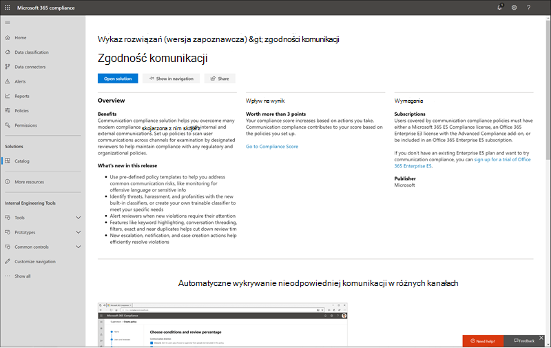
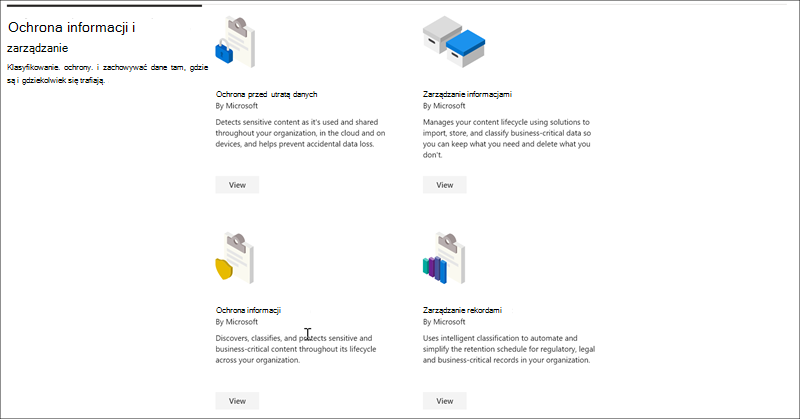
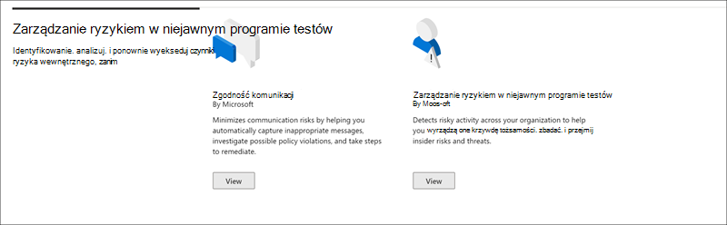
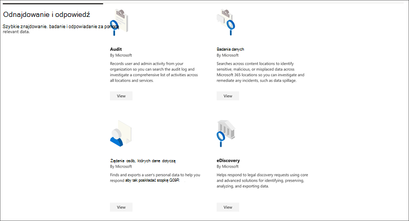

# Katalog rozwiązań platformy Microsoft Purview

Szukasz sposobu na szybkie rozpoczęcie pracy z zadaniami zgodności w usłudze Microsoft Purview? Zapoznaj się z [katalogiem rozwiązań usługi Microsoft Purview](https://compliance.microsoft.com/solutioncatalog) , aby odnajdywać, uczyć się i szybko rozpoczynać pracę z rozwiązaniami dotyczącymi ryzyka i zgodności.

Rozwiązania dotyczące ryzyka i zgodności w usłudze Microsoft Purview to kolekcje zintegrowanych funkcji, których można użyć, aby ułatwić zarządzanie kompleksowymi scenariuszami zgodności. Możliwości i narzędzia rozwiązania mogą obejmować kombinację zasad, alertów, raportów i nie tylko.

Przeczytaj ten artykuł, aby zapoznać się z wykazem rozwiązań w portal zgodności Microsoft Purview, [sposobem uzyskiwania dostępu](#how-do-i-access) i [kolejnymi krokami](#next-steps).

## Organizacja katalogu

Katalog rozwiązań jest podzielony na sekcje zawierające karty informacyjne dla każdego rozwiązania do oceny ryzyka i zgodności dostępnego w ramach subskrypcji platformy Microsoft 365. Każda sekcja zawiera karty dla rozwiązań pogrupowanych według obszaru ryzyka i zgodności.

Po wybraniu pozycji **Wyświetl** dla karty rozwiązania zostaną wyświetlone szczegółowe informacje o rozwiązaniu i sposobie rozpoczęcia pracy. Te informacje obejmują omówienie, wymagania dotyczące wstępnej konfiguracji, zasoby szkoleniowe, kontrolki, które umożliwiają przypięcie karty do okienka nawigacji, oraz opcję udostępniania rozwiązania jako linku, wiadomości e-mail lub wiadomości usługi Microsoft Teams.

## Sekcja zarządzania & ochrony informacji

Sekcja **Zarządzanie & ochrony informacji** pokazuje, jak można używać rozwiązań usługi Microsoft Purview do ochrony danych w organizacji i zarządzania nimi.

W tym miejscu zobaczysz karty dla następujących rozwiązań:

- [Zarządzanie aplikacjami](/defender-cloud-apps/app-governance-manage-app-governance): pomaga zrozumieć wszystkie aplikacje, które łączą się z organizacją i zarządzają ich działaniami interfejsu API.
- [Zarządzanie cyklem życia danych: zarządza cyklem](/microsoft-365/compliance/manage-data-governance) życia zawartości przy użyciu rozwiązań do importowania, przechowywania i klasyfikowania danych krytycznych dla działania firmy, dzięki czemu możesz zachować potrzebne dane i usunąć to, czego nie chcesz.
- [Ochrona przed utratą danych](/microsoft-365/compliance/dlp-learn-about-dlp): wykrywa poufne treści, które są używane i udostępniane w całej organizacji, w chmurze i na urządzeniach, oraz pomaga zapobiegać przypadkowej utracie danych.
- [Ochrona informacji](/microsoft-365/compliance/information-protection): odnajduje, klasyfikuje i chroni zawartość poufną i krytyczną dla działania firmy w całym cyklu życia w całej organizacji.
- [Zarządzanie rekordami](/microsoft-365/compliance/records-management): używa inteligentnej klasyfikacji, aby zautomatyzować i uprościć harmonogram przechowywania rekordów regulacyjnych, prawnych i krytycznych dla działania firmy w organizacji.

## Sekcja Dotycząca prywatności

W sekcji **Prywatność** pokazano, jak twoja organizacja może utworzyć bardziej odporne na prywatność miejsce pracy.

W tym miejscu zobaczysz karty dla następujących rozwiązań:

- [Zarządzanie prywatnością](/privacy/priva/priva-overview): generuje praktyczne szczegółowe informacje na temat danych osobowych przedsiębiorstwa, aby ułatwić wykrywanie problemów i zmniejszanie ryzyka. Udostępnia łatwe w użyciu szablony zasad, które umożliwiają pracownikom ochronę danych, oraz funkcje automatyzacji w celu usprawnienia procesu żądania praw podmiotu.

## Sekcja Zarządzania ryzykiem wewnętrznym

W sekcji **Zarządzanie ryzykiem wewnętrznym** widać, jak organizacja może identyfikować, analizować i podejmować działania w zakresie ryzyka wewnętrznego, zanim spowodują one szkodę.

W tym miejscu zobaczysz karty dla następujących rozwiązań:

- [Zgodność z komunikacją](/microsoft-365/compliance/communication-compliance): minimalizuje ryzyko związane z komunikacją, pomagając automatycznie przechwytywać nieodpowiednie komunikaty, badać możliwe naruszenia zasad i podejmować kroki w celu zminimalizowania szkód.
- [Bariery informacyjne](/microsoft-365/compliance/information-barriers): umożliwia ograniczenie dwukierunkowej komunikacji i współpracy między grupami i użytkownikami w usługach Microsoft Teams, SharePoint Online i OneDrive dla Firm.
- [Zarządzanie ryzykiem wewnętrznym](/microsoft-365/compliance/insider-risk-management): wykrywanie ryzykownych działań w całej organizacji, które ułatwiają szybkie identyfikowanie, badanie i podjęcie działań dotyczących ryzyka i zagrożeń związanych z wewnętrznymi działaniami.

## Sekcja odpowiedzi & odnajdywania

Sekcja **odpowiedzi &** odnajdywania pokazuje, jak organizacja może szybko znajdować, badać i reagować na problemy ze zgodnością z odpowiednimi danymi.

W tym miejscu zobaczysz karty dla następujących rozwiązań:

- [Inspekcja](/microsoft-365/compliance/search-the-audit-log-in-security-and-compliance): rejestruje aktywność użytkowników i administratorów w organizacji, aby można było przeszukiwać dziennik inspekcji i badać kompleksową listę działań we wszystkich lokalizacjach i usługach.
- [Żądania podmiotów danych](/compliance/regulatory/gdpr-manage-gdpr-data-subject-requests-with-the-dsr-case-tool): wyszukuje i eksportuje dane osobowe użytkownika, aby ułatwić reagowanie na żądania podmiotów danych dotyczące RODO.
- [Zbierania elektronicznych materiałów dowodowych](/microsoft-365/compliance/manage-legal-investigations)
    - [eDiscovery (Standard)](/microsoft-365/compliance/get-started-core-ediscovery): wyszukuje lokalizacje zawartości w celu identyfikowania, zachowywania i eksportowania danych w odpowiedzi na prawne żądania odnajdywania i przypadki zbierania elektronicznych materiałów dowodowych.
    - [eDiscovery (Premium)](/microsoft-365/compliance/overview-ediscovery-20): opiera się na możliwościach zbierania elektronicznych materiałów dowodowych, zapewniając inteligentną analizę i uczenie maszynowe, które ułatwiają dalszą analizę danych istotnych dla żądań odnajdywania.

## Jak mogę dostęp?

Aby odwiedzić katalog rozwiązań Usługi Microsoft Purview, przejdź do [portalu zgodności](https://compliance.microsoft.com) i zaloguj się jako administrator globalny, administrator zgodności lub administrator danych zgodności. Wybierz pozycję **Wykaz** w okienku nawigacji po lewej stronie ekranu, aby otworzyć stronę główną wykazu.

## Następne kroki

- **Odwiedź stronę Microsoft Purview Compliance Manager**, która pomaga zrozumieć stan zgodności organizacji z kluczowymi standardami i przepisami. Zapewnia zalecane działania, które można podjąć w celu wzmocnienia ogólnej kondycji zgodności, oraz zapewnia możliwości przepływu pracy, które ułatwiają wydajne wykonywanie tych akcji. Aby dowiedzieć się więcej, zobacz [Menedżer zgodności](/microsoft-365/compliance/compliance-manager).

- **Skonfiguruj zasady zarządzania ryzykiem wewnętrznym** , aby zminimalizować ryzyko wewnętrzne i umożliwić wykrywanie, badanie i podjęcie działań w przypadku ryzykownych działań w organizacji. Zobacz [Informacje o zarządzaniu ryzykiem wewnętrznym](/microsoft-365/compliance/insider-risk-management).
- **Dowiedz się więcej o zasadach zgodności komunikacji i utwórz** je, aby szybko identyfikować i korygować naruszenia zasad kodeksu postępowania firmy. Zobacz [Zgodność z komunikacją](/microsoft-365/compliance/communication-compliance).
- **Microsoft Purview Information Protection** dowiedz się, w jaki sposób rozwiązania Usługi Microsoft Purview pomagają odnajdywać, klasyfikować i chronić poufne informacje wszędzie tam, gdzie się znajdują lub podróżują.
    - **Zapoznaj się z Microsoft Defender for Cloud Apps i skonfiguruj go**. Zobacz [Szybki start: rozpoczynanie pracy z Microsoft Defender for Cloud Apps](/cloud-app-security/getting-started-with-cloud-app-security).
    - **Wprowadzenie do klasyfikatorów**. Klasyfikowanie zawartości, a następnie etykietowanie jej tak, aby można było ją odpowiednio chronić i obsługiwać, jest miejscem początkowym dla dziedziny ochrony informacji. Zobacz [Dowiedz się więcej o klasyfikatorach z możliwością trenowania (wersja zapoznawcza).](/microsoft-365/compliance/classifier-learn-about).
- **Często odwiedzaj katalog rozwiązań usługi Microsoft Purview** i zapoznaj się z nowymi rozwiązaniami, które pomogą Ci w spełnieniu wymagań dotyczących zgodności. Zaloguj się w [portalu zgodności](https://compliance.microsoft.com) , a następnie wybierz pozycję **Wykaz** w okienku nawigacji po lewej stronie.
