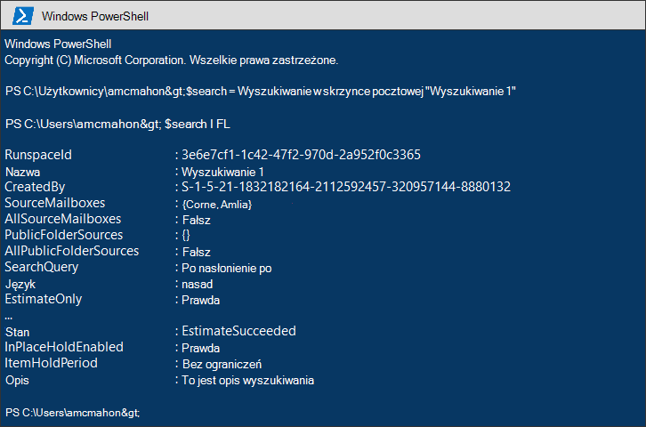
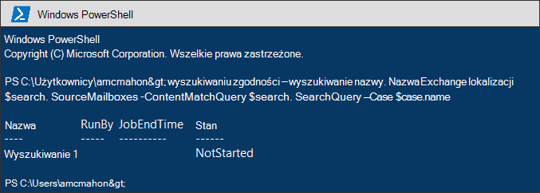
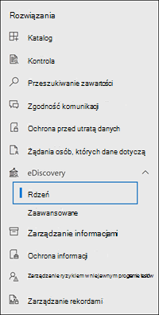

# <a name="migrate-legacy-ediscovery-searches-and-holds-to-the-compliance-portal"></a>Migrowanie starszych wyszukiwań zbierania elektronicznych materiałów dowodowych i archiwizacji do portalu zgodności

[!include[Purview banner](../includes/purview-rebrand-banner.md)]

Portal zgodności usługi Microsoft Purview zapewnia ulepszone środowisko użycia zbierania elektronicznych elektronicznych materiałów dowodowych, w tym: wyższą niezawodność, lepszą wydajność i wiele funkcji dostosowanych do przepływów pracy zbierania elektronicznych materiałów dowodowych, w tym przypadki organizowania zawartości według materii, zestawy przeglądów w celu przeglądania zawartości i analizy, aby pomóc w usuwaniu danych w celu przeglądu, takiego jak zduplikowane grupowanie, wątki wiadomości e-mail, analiza motywów i kodowanie predykcyjne.

Aby ułatwić klientom korzystanie z nowych i ulepszonych funkcji, ten artykuł zawiera podstawowe wskazówki dotyczące migracji In-Place wyszukiwania zbierania elektronicznych materiałów dowodowych i archiwizacji z <a href="https://go.microsoft.com/fwlink/p/?linkid=2059104" target="_blank">centrum administracyjnego Exchange</a> do portalu zgodności.

> [!NOTE]
> Ponieważ istnieje wiele różnych scenariuszy, ten artykuł zawiera ogólne wskazówki dotyczące przenoszenia wyszukiwań i archiwizacji do przypadku zbierania elektronicznych materiałów dowodowych (Standard) w portalu zgodności. Przypadki zbierania elektronicznych materiałów dowodowych nie zawsze są wymagane, ale dodają dodatkową warstwę zabezpieczeń, umożliwiając przypisanie uprawnień do kontrolowania, kto ma dostęp do przypadków zbierania elektronicznych materiałów dowodowych w organizacji.

## <a name="before-you-begin"></a>Przed rozpoczęciem

- Musisz zainstalować moduł Exchange Online V2. Aby uzyskać instrukcje, zobacz [Instalowanie i obsługa modułu EXO w wersji 2](/powershell/exchange/exchange-online-powershell-v2#install-and-maintain-the-exo-v2-module).

- Aby uruchomić polecenia programu PowerShell opisane w tym artykule, musisz być członkiem grupy ról menedżera zbierania elektronicznych materiałów dowodowych w portalu zgodności. Musisz również być członkiem grupy ról Zarządzanie odnajdywaniem w <a href="https://go.microsoft.com/fwlink/p/?linkid=2059104" target="_blank">centrum administracyjnym Exchange</a>.

- Ten artykuł zawiera wskazówki dotyczące tworzenia blokady zbierania elektronicznych materiałów dowodowych. Zasady przechowywania zostaną zastosowane do skrzynek pocztowych w procesie asynchronicznym. Podczas tworzenia blokady zbierania elektronicznych materiałów dowodowych należy utworzyć zarówno caseHoldPolicy, jak i CaseHoldRule, w przeciwnym razie blokada nie zostanie utworzona, a lokalizacje zawartości nie zostaną wstrzymane.

## <a name="step-1-connect-to-exchange-online-powershell-and-security--compliance-powershell"></a>Krok 1. Połączenie do Exchange Online programu PowerShell i programu PowerShell & zgodności z zabezpieczeniami

Pierwszym krokiem jest nawiązanie połączenia z programem Exchange Online programu PowerShell i programu PowerShell & Zgodności zabezpieczeń w tym samym oknie programu PowerShell. Możesz skopiować następujące polecenia, wkleić je do okna programu PowerShell, a następnie uruchomić je. Zostanie wyświetlony monit o podanie poświadczeń.

```powershell
Connect-IPPSSession
Connect-ExchangeOnline -UseRPSSession
```

Szczegółowe instrukcje można znaleźć [w temacie Połączenie to Security & Compliance PowerShell](/powershell/exchange/connect-to-scc-powershell) and [Połączenie to Exchange Online PowerShell](/powershell/exchange/connect-to-exchange-online-powershell) .For detailed instructions (Połączenie to Security & Compliance PowerShell i Połączenie to Exchange Online PowerShell).

## <a name="step-2-get-a-list-of-in-place-ediscovery-searches-by-using-get-mailboxsearch"></a>Krok 2. Pobieranie listy In-Place wyszukiwania zbierania elektronicznych materiałów dowodowych przy użyciu Get-MailboxSearch

Po nawiązaniu połączenia możesz uzyskać listę In-Place wyszukiwania zbierania elektronicznych materiałów dowodowych, uruchamiając polecenie cmdlet **Get-MailboxSearch** . Skopiuj i wklej następujące polecenie w oknie programu PowerShell, a następnie uruchom je.

```powershell
Get-MailboxSearch
```

Lista wyszukiwań zostanie wyświetlona z ich nazwami i stanem dowolnego In-Place Blokady.

Dane wyjściowe polecenia cmdlet będą podobne do następujących:


## <a name="step-3-get-information-about-the-in-place-ediscovery-searches-and-in-place-holds-you-want-to-migrate"></a>Krok 3. Uzyskiwanie informacji o In-Place wyszukiwaniach zbierania elektronicznych materiałów dowodowych i archiwach In-Place, które chcesz migrować

Ponownie użyjesz polecenia cmdlet **Get-MailboxSearch** , ale tym razem pobierzesz właściwości wyszukiwania. Te właściwości można przechowywać w zmiennej do późniejszego użycia. Poniższy przykład przechowuje wyniki polecenia cmdlet **Get-MailboxSearch** w zmiennej, a następnie wyświetla właściwości wyszukiwania.

```powershell
$search = Get-MailboxSearch -Identity "Search 1"
```

```powershell
$search | Format-List
```

Dane wyjściowe tych dwóch poleceń będą podobne do następujących:



> [!NOTE]
> Czas trwania blokady In-Place w tym przykładzie jest nieokreślony (*ItemHoldPeriod: Nieograniczony*). Jest to typowe w przypadku scenariuszy zbierania elektronicznych materiałów dowodowych i badań prawnych. Jeśli czas trwania blokady jest inny niż nieokreślony, przyczyna jest prawdopodobna, ponieważ blokada jest używana do przechowywania zawartości w scenariuszu przechowywania. Zamiast używać poleceń cmdlet zbierania elektronicznych materiałów dowodowych w programie PowerShell & zgodności zabezpieczeń w scenariuszach przechowywania, zalecamy zachowanie zawartości za pomocą polecenia [New-RetentionCompliancePolicy](/powershell/module/exchange/new-retentioncompliancepolicy) i [New-RetentionComplianceRule](/powershell/module/exchange/new-retentioncompliancerule) . Wynik użycia tych poleceń cmdlet będzie podobny do użycia poleceń **New-CaseHoldPolicy** i **New-CaseHoldRule**, ale będzie można określić okres przechowywania i akcję przechowywania, na przykład usunięcie zawartości po upływie okresu przechowywania. Ponadto użycie poleceń cmdlet przechowywania nie wymaga skojarzenia blokad przechowywania z przypadkiem zbierania elektronicznych materiałów dowodowych.

## <a name="step-4-create-a-case-in-the-microsoft-purview-compliance-portal"></a>Krok 4. Tworzenie sprawy w portalu zgodności usługi Microsoft Purview

Aby utworzyć blokadę zbierania elektronicznych materiałów dowodowych, należy utworzyć przypadek zbierania elektronicznych materiałów dowodowych w celu skojarzenia blokady z. Poniższy przykład tworzy przypadek zbierania elektronicznych materiałów dowodowych przy użyciu wybranej nazwy. Właściwości nowego przypadku będą przechowywane w zmiennej do późniejszego użycia. Te właściwości można wyświetlić, `$case | FL` uruchamiając polecenie po utworzeniu sprawy.

```powershell
$case = New-ComplianceCase -Name "[Case name of your choice]"
```


## <a name="step-5-create-the-ediscovery-hold"></a>Krok 5. Tworzenie blokady zbierania elektronicznych materiałów dowodowych

Po utworzeniu sprawy możesz utworzyć blokadę i skojarzyć ją ze sprawą utworzoną w poprzednim kroku. Należy pamiętać, że należy utworzyć zarówno zasady przechowywania spraw, jak i regułę blokady sprawy. Jeśli reguła blokady sprawy nie zostanie utworzona po utworzeniu zasad przechowywania sprawy, blokada zbierania elektronicznych materiałów dowodowych nie zostanie utworzona i żadna zawartość nie zostanie wstrzymana.

Uruchom następujące polecenia, aby ponownie utworzyć blokadę zbierania elektronicznych materiałów dowodowych, którą chcesz zmigrować. W tych przykładach są używane właściwości z In-Place Hold z kroku 3, które chcesz przeprowadzić migrację. Pierwsze polecenie tworzy nowe zasady przechowywania przypadku i zapisuje właściwości w zmiennej. Drugie polecenie tworzy odpowiednią regułę przechowywania przypadku.

```powershell
$policy = New-CaseHoldPolicy -Name $search.Name -Case $case.Identity -ExchangeLocation $search.SourceMailboxes
```

```powershell
New-CaseHoldRule -Name $search.Name -Policy $policy.Identity
```


## <a name="step-6-verify-the-ediscovery-hold"></a>Krok 6. Weryfikowanie blokady zbierania elektronicznych materiałów dowodowych

Aby upewnić się, że nie ma problemów z tworzeniem blokady, warto sprawdzić, czy stan dystrybucji blokady zakończył się pomyślnie. Dystrybucja oznacza, że blokada została zastosowana do wszystkich lokalizacji zawartości określonych w parametrze *ExchangeLocation* w poprzednim kroku. W tym celu można uruchomić polecenie cmdlet **Get-CaseHoldPolicy** . Ponieważ właściwości zapisane w *zmiennej $policy* utworzonej w poprzednim kroku nie są automatycznie aktualizowane w zmiennej, należy ponownie uruchomić polecenie cmdlet, aby sprawdzić, czy dystrybucja zakończyła się pomyślnie. Pomyślne rozpowszechnianie zasad przechowywania spraw może potrwać od 5 minut do 24 godzin.

Uruchom następujące polecenie, aby sprawdzić, czy blokada zbierania elektronicznych materiałów dowodowych została pomyślnie rozproszona.

```powershell
Get-CaseHoldPolicy -Identity $policy.Identity | Select name, DistributionStatus
```

Wartość **success** właściwości *DistributionStatus* wskazuje, że blokada została pomyślnie umieszczona w lokalizacjach zawartości. Jeśli dystrybucja nie została jeszcze ukończona, zostanie wyświetlona wartość **Oczekujące** .


## <a name="step-7-create-the-search"></a>Krok 7. Tworzenie wyszukiwania

Ostatnim krokiem jest ponowne utworzenie wyszukiwania zidentyfikowanego w kroku 3 i skojarzenie go ze sprawą. Po utworzeniu wyszukiwania można uruchomić je przy użyciu polecenia cmdlet **Start-ComplianceSearch** lub uruchomić je później.

```powershell
New-ComplianceSearch -Name $search.Name -ExchangeLocation $search.SourceMailboxes -ContentMatchQuery $search.SearchQuery -Case $case.name
```



## <a name="step-8-verify-the-case-hold-and-search-in-the-compliance-portal"></a>Krok 8. Weryfikowanie sprawy, archiwizowanie i wyszukiwanie w portalu zgodności

Aby upewnić się, że wszystko jest poprawnie skonfigurowane, przejdź do portalu zgodności pod adresem [https://compliance.microsoft.com](https://compliance.microsoft.com)i kliknij pozycję **eDiscovery > Core**.



Przypadek utworzony w kroku 3 znajduje się na stronie **eDiscovery (Standard** ). Otwórz sprawę, a następnie zwróć uwagę na blokadę utworzoną w kroku 4 na liście na karcie **Przytrzymaj** . Możesz wybrać blokadę, aby wyświetlić szczegóły na stronie wysuwanej, w tym liczbę skrzynek pocztowych, do których zastosowano blokadę, oraz stan dystrybucji.


Wyszukiwanie utworzone w kroku 7 jest wyświetlane na karcie **Wyszukiwania** w przypadku.


Jeśli zmigrujesz In-Place wyszukiwanie zbierania elektronicznych materiałów dowodowych, ale nie skojarzysz go ze sprawą zbierania elektronicznych materiałów dowodowych, zostanie on wyświetlony na stronie wyszukiwania zawartości w portalu zgodności.

## <a name="more-information"></a>Więcej informacji

- Aby uzyskać więcej informacji na temat In-Place eDiscovery & Holds w <a href="https://go.microsoft.com/fwlink/p/?linkid=2059104" target="_blank">centrum administracyjnym Exchange</a>, zobacz:

  - [Miejscowe zbieranie elektronicznych materiałów dowodowych](/exchange/security-and-compliance/in-place-ediscovery/in-place-ediscovery)

  - [Blokada miejscowa i blokada postępowania sądowego](/exchange/security-and-compliance/in-place-and-litigation-holds)

- Aby uzyskać więcej informacji na temat poleceń cmdlet programu PowerShell używanych w tym artykule, zobacz:

  - [Get-MailboxSearch](/powershell/module/exchange/get-mailboxsearch)

  - [New-ComplianceCase](/powershell/module/exchange/new-compliancecase)

  - [New-CaseHoldPolicy](/powershell/module/exchange/new-caseholdpolicy)

  - [New-CaseHoldRule](/powershell/module/exchange/new-caseholdrule)

  - [Get-CaseHoldPolicy](/powershell/module/exchange/get-caseholdpolicy)

  - [New-ComplianceSearch](/powershell/module/exchange/new-compliancesearch)

  - [Start-ComplianceSearch](/powershell/module/exchange/start-compliancesearch)

- Aby uzyskać więcej informacji na temat portalu zgodności, zobacz [Omówienie portalu zgodności usługi Microsoft Purview](microsoft-365-compliance-center.md).