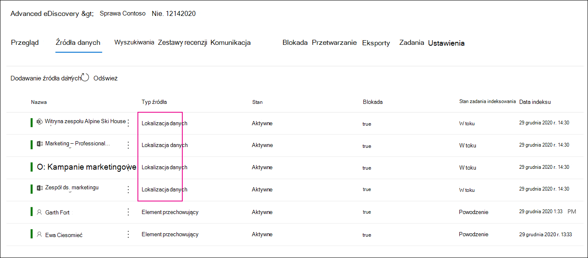

# Dodawanie źródeł danych bez nadzoru do sprawy zbierania elektronicznych materiałów dowodowych (Premium)

W przypadku zbierania elektronicznych materiałów dowodowych w usłudze Microsoft Purview (Premium) nie zawsze spełnia ono potrzeby skojarzenia źródła danych Microsoft 365 z opiekunem w tej sprawie. Jednak nadal może być konieczne skojarzenie tych danych ze sprawą, aby można było je przeszukiwać, dodawać do zestawu przeglądów oraz analizować i przeglądać. Funkcja zbierania elektronicznych materiałów dowodowych (Premium) jest nazywana *źródłami danych bez nadzoru* i umożliwia dodawanie danych do sprawy bez konieczności kojarzenia ich z opiekunem. Stosuje również tę samą funkcję zbierania elektronicznych materiałów dowodowych (Premium) do danych nienadzorowania, które są dostępne dla danych skojarzonych z opiekunem. Dwie z najbardziej przydatnych rzeczy, które można zastosować do danych nienadzorujących, to wstrzymanie ich i przetworzenie przy użyciu [indeksowania zaawansowanego](indexing-custodian-data.md).

## Dodawanie źródła danych bez nadzoru

Wykonaj następujące kroki, aby dodać źródła danych bez nadzoru i zarządzać nimi w przypadku zbierania elektronicznych materiałów dowodowych (Premium).

1. Na stronie głównej **eDiscovery (Premium)** kliknij przypadek, do których chcesz dodać dane.

2. Kliknij kartę **Źródła danych**, a następnie kliknij pozycję **Dodaj źródło** >  **danychDodaj lokalizacje danych**.

3. Na stronie wysuwanej **Nowe lokalizacje danych nienadzorowania** wybierz źródła danych, które chcesz dodać do sprawy. Możesz dodać wiele skrzynek pocztowych i witryn, rozszerzając sekcje **SharePoint** lub **Exchange**, a następnie klikając pozycję **Edytuj**.

   

   - **SharePoint** — kliknij pozycję **Edytuj**, aby dodać witryny. Wybierz witrynę na liście lub możesz wyszukać witrynę, wpisując adres URL witryny na pasku wyszukiwania. Wybierz witryny, które chcesz dodać jako źródła danych nieobjętych ochroną, a następnie kliknij pozycję **Dodaj**.

   - **Exchange** — kliknij pozycję **Edytuj**, aby dodać skrzynki pocztowe. Wpisz nazwę lub alias (co najmniej trzy znaki) w polu wyszukiwania dla skrzynek pocztowych lub grup dystrybucyjnych. Wybierz skrzynki pocztowe, które chcesz dodać jako źródła danych nienadzorujące, a następnie kliknij przycisk **Dodaj**.

   > [!NOTE]
   > Możesz użyć sekcji **SharePoint** i **Exchange**, aby dodać witryny i skrzynki pocztowe skojarzone z zespołem lub grupą Yammer jako źródła danych bez nadzoru. Musisz oddzielnie dodać skrzynkę pocztową i witrynę skojarzoną z zespołem lub grupą Yammer.   Ponadto dodawanie adresu URL witryny głównej (np`https://contoso-my.sharepoint.com/personal/`. lub `https://contoso-my.sharepoint.com/`) jako źródła danych SharePoint nie jest obsługiwane. Musisz dodać określone witryny.

4. Po dodaniu źródeł danych bez nadzoru masz możliwość wstrzymania tych lokalizacji. Zaznacz lub usuń zaznaczenie pola wyboru **Wstrzymaj** obok źródła danych, aby umieścić go w stanie wstrzymania.

5. Kliknij pozycję **Dodaj** w dolnej części strony wysuwanej **Nowe lokalizacje danych bez nadzoru** , aby dodać źródła danych do sprawy.

   Każde dodane źródło danych bez nadzoru znajduje się na stronie **Źródła danych** . Źródła danych nieobjętych ochroną są identyfikowane przez wartość **lokalizacji danych** w kolumnie **Typ źródła** .

   

Po dodaniu źródeł danych bez nadzoru do sprawy zostanie utworzone zadanie o nazwie *Ponowne indeksowanie danych nienadzorujących* i wyświetlone na karcie **Zadania** sprawy. Po utworzeniu zadania zostanie zainicjowany proces indeksowania zaawansowanego, a źródła danych zostaną ponownie wyeksplorowane.

## Zarządzanie blokadą dla źródeł danych bez nadzoru

Po umieszczeniu blokady w źródle danych bez nadzoru zasady blokady zawierające źródła danych nienadzorujące sprawy zostaną utworzone automatycznie. Po zatrzymaniu innych źródeł danych, które nie są chronione, zostaną one dodane do tych zasad blokady.

1. Otwórz przypadek zbierania elektronicznych materiałów dowodowych (Premium) i wybierz kartę **Przytrzymaj**.

2. Kliknij **pozycję NCDSHold-\<GUID\>**, gdzie wartość identyfikatora GUID jest unikatowa dla przypadku.

   Na stronie wysuwanej są wyświetlane informacje i statystyki dotyczące wstrzymanych źródeł danych nieobjętych ochroną.

   

3. Kliknij **pozycję Edytuj blokadę** , aby wyświetlić źródła danych, które nie są chronione, i wykonaj następujące zadania zarządzania:

   - Na stronie **Lokalizacje** możesz zwolnić źródło danych bez nadzoru, usuwając je z blokady. Zwolnienie źródła danych nie powoduje usunięcia ze sprawy źródła danych bez nadzoru. Usuwa tylko blokadę umieszczoną w źródle danych.

   - Na stronie **Zapytanie** możesz edytować blokadę, aby utworzyć blokadę opartą na zapytaniach, która jest stosowana do wszystkich źródeł danych nienadzorujących danych tha w tym przypadku.
