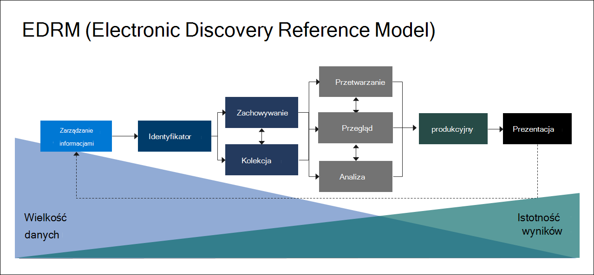

# Omówienie zbierania elektronicznych materiałów dowodowych w usłudze Microsoft Purview (Premium)

[!include[Purview banner](../includes/purview-rebrand-banner.md)]

Rozwiązanie Microsoft Purview eDiscovery (Premium) bazuje na istniejących możliwościach zbierania elektronicznych materiałów dowodowych i analiz firmy Microsoft. Funkcja zbierania elektronicznych materiałów dowodowych (Premium) zapewnia kompleksowy przepływ pracy umożliwiający zachowanie, zbieranie, analizowanie, przeglądanie i eksportowanie zawartości, która odpowiada na wewnętrzne i zewnętrzne badania organizacji. Umożliwia również zespołom prawnym zarządzanie całym przepływem pracy powiadomień o blokadzie prawnej w celu komunikowania się z opiekunami zaangażowanymi w sprawę.

## Możliwości zbierania elektronicznych materiałów dowodowych (Premium)

Zbieranie elektronicznych materiałów dowodowych (Premium) może pomóc twojej organizacji w reagowaniu na sprawy prawne lub wewnętrzne dochodzenia, odkrywając dane, w których się znajdują. Przepływami pracy zbierania elektronicznych materiałów dowodowych można bezproblemowo zarządzać, identyfikując osoby zainteresowane i ich źródła danych, bezproblemowo stosuj blokady w celu zachowania danych, a następnie zarządzaj procesem komunikacji z legalną blokadą. Zbierając dane ze źródła, możesz przeszukać platformę Microsoft 365 na żywo, aby szybko znaleźć to, czego potrzebujesz. Inteligentne funkcje uczenia maszynowego, takie jak głębokie indeksowanie, wątkowość wiadomości e-mail i wykrywanie zbliżeń duplikatów, pomagają również ograniczyć duże ilości danych do odpowiedniego zestawu danych.

W poniższych sekcjach opisano, w jaki sposób te funkcje zbierania elektronicznych materiałów dowodowych (Premium) mogą pomóc Twojej organizacji.

### Odnajdywanie i zbieranie danych w miejscu

Tradycyjnie organizacje korzystające z wielu rozwiązań zbierania elektronicznych materiałów dowodowych innych firm wymagają kopiowania dużych ilości danych z Microsoft 365 do przetwarzania i konieczności hostowania zduplikowanych danych. Ta konieczność wydłuża czas znajdowania odpowiednich danych oraz ryzyko, koszt i złożoność zarządzania wieloma rozwiązaniami.

Funkcja zbierania elektronicznych materiałów dowodowych (Premium) w Microsoft 365 umożliwia odnajdywanie danych w źródle i pozostawanie w granicach Microsoft 365 zabezpieczeń i zgodności.  Dzięki zbieraniu danych w miejscu z systemu na żywo zbieranie elektronicznych materiałów dowodowych (Premium) zmniejsza tarcie powrotu do źródła i zmniejsza niepotrzebną pracę polegającą na konieczności znajdowania brakujących treści, co często ma miejsce w przypadku opóźnień w dziennikach w tradycyjnych rozwiązaniach zbierania elektronicznych materiałów dowodowych.

Funkcje natywnego wyszukiwania i zbierania danych w Teams, Yammer, SharePoint Online, OneDrive dla Firm i Exchange Online dodatkowo zwiększają możliwości odnajdywania danych. Na przykład eDiscovery (Premium):

- Rekonstruuje Teams konwersacje (zamiast zwracać pojedyncze wiadomości z konwersacji).

- Zbiera zawartość opartą na chmurze udostępnioną użytkownikom za pomocą linków lub nowoczesnych załączników w wiadomościach e-mail i czatach Teams.

- Ma wbudowaną obsługę setek typów plików innych niż Microsoft 365.

- Zbiera dane ze źródeł innych firm (takich jak Bloomberg, Facebook, Slack i Zoom Meetings), które są importowane i archiwizowane w Microsoft 365 za pomocą [łączników danych](archiving-third-party-data.md).

### Zarządzanie przepływem pracy zbierania elektronicznych materiałów dowodowych na jednej platformie

Funkcja zbierania elektronicznych materiałów dowodowych (Premium) może pomóc w zmniejszeniu liczby rozwiązań zbierania elektronicznych materiałów dowodowych, na których należy polegać. Zapewnia ona usprawniony, kompleksowy przepływ pracy, który odbywa się w ramach Microsoft 365. Zbieranie elektronicznych materiałów dowodowych (Premium) pomaga w ograniczeniu tarć związanych z identyfikowaniem i zbieraniem potencjalnych źródeł odpowiednich informacji przez automatyczne mapowanie unikatowych i udostępnionych źródeł danych na osobę zainteresowaną (znaną jako *opiekun*) oraz przez dostarczanie raportów i analiz na temat potencjalnie istotnych danych przed zebraniem ich do analizy i przeglądu.

Ponadto interfejsy API Graph firmy Microsoft mogą pomóc w zautomatyzowaniu przepływu pracy zbierania elektronicznych materiałów dowodowych i rozszerzeniu eDiscovery (Premium) dla rozwiązań niestandardowych.

### Inteligentnie usuwaj dane

Inteligentne możliwości uczenia maszynowego w zakresie zbierania elektronicznych materiałów dowodowych (Premium) pomagają zmniejszyć ilość danych do przejrzenia. Te inteligentne możliwości pomagają ograniczyć i zlikwidować duże ilości danych do odpowiedniego zestawu. Na przykład wbudowane zapytanie zestawu przeglądów pomaga filtrować tylko unikatową zawartość, identyfikując zbliżona do duplikatów. Ta funkcja może znacznie zmniejszyć ilość danych do przejrzenia.

Dodatkowe możliwości uczenia maszynowego mogą dodatkowo udoskonalić i zidentyfikować odpowiednie dane przy użyciu tagów inteligentnych i narzędzi do przeglądu wspomaganych technologią, takich jak moduły istotności.

## Wyrównanie zbierania elektronicznych materiałów dowodowych (Premium) do modelu referencyjnego odnajdywania elektronicznego

Wbudowany przepływ pracy zbierania elektronicznych materiałów dowodowych (Premium) w Microsoft 365 jest zgodny z procesem zbierania elektronicznych materiałów dowodowych opisanym przez model referencyjny odnajdywania elektronicznego (EDRM).

(Obraz oparty na modelu EDRM na edrm.net)

Na wysokim poziomie poniżej przedstawiono sposób, w jaki funkcja zbierania elektronicznych materiałów dowodowych (Premium) obsługuje przepływ pracy EDRM:

- **Identyfikacji.** Po zidentyfikowaniu potencjalnych osób zainteresowanych dochodzeniem można dodać je jako opiekunów (nazywanych również *opiekunami danych*, ponieważ mogą one posiadać informacje istotne dla dochodzenia) do sprawy zbierania elektronicznych materiałów dowodowych (Premium). Po dodaniu użytkowników jako opiekunów można łatwo zachować, zebrać i przejrzeć dokumenty opiekuna.

- **Zachowania.** Aby zachować i chronić dane istotne dla dochodzenia, zbieranie elektronicznych materiałów dowodowych (Premium) umożliwia wstrzymanie prawnych źródeł danych skojarzonych z opiekunami w danym przypadku. Możesz również wstrzymać dane nienadzorowanie. Funkcja zbierania elektronicznych materiałów dowodowych (Premium) ma również wbudowany przepływ pracy komunikacji, dzięki czemu można wysyłać powiadomienia o blokadzie prawnej do opiekunów i śledzić ich potwierdzenia.

- **Kolekcji.** Po zidentyfikowaniu (i zachowaniu) źródeł danych istotnych dla badania można użyć wbudowanego narzędzia wyszukiwania w usłudze eDiscovery (Premium) w poszukiwaniu i zbieraniu danych na żywo ze źródeł danych będących osobami nadzorującymi (i źródeł danych bez nadzoru, jeśli ma to zastosowanie), które mogą być istotne dla sprawy.

- **Przetwarzania.** Po zebraniu wszystkich danych istotnych dla sprawy następnym krokiem jest przetworzenie ich w celu dalszego przeglądu i analizy. W obszarze eDiscovery (Premium) dane w miejscu zidentyfikowane w fazie zbierania są kopiowane do lokalizacji Storage platformy Azure (nazywanej *zestawem przeglądów*), co zapewnia statyczny widok danych sprawy. 

- **Który napisze recenzję.** Po dodaniu danych do zestawu przeglądów można wyświetlać określone dokumenty i uruchamiać dodatkowe zapytania, aby ograniczyć dane do tego, co jest najbardziej istotne w tym przypadku. Ponadto można adnotować i oznaczać określone dokumenty.

- **Analizę.** Funkcja zbierania elektronicznych materiałów dowodowych (Premium) udostępnia zintegrowane narzędzie analityczne, które pomaga w dalszym usuwaniu danych z zestawu przeglądów, który nie ma znaczenia dla badania. Oprócz zmniejszenia ilości odpowiednich danych usługa Advance eDiscovery pomaga również zaoszczędzić koszty przeglądu prawnego, umożliwiając organizowanie zawartości w celu ułatwienia i zwiększenia wydajności procesu przeglądu.

- **Produkcja** i **prezentacja.** Gdy wszystko będzie gotowe, możesz wyeksportować dokumenty z zestawu przeglądów do przeglądu prawnego. Dokumenty można eksportować w formacie natywnym lub w formacie określonym przez EDRM, aby można je było zaimportować do aplikacji przeglądowych innych firm.

## Subskrypcje i licencjonowanie

Licencjonowanie zbierania elektronicznych materiałów dowodowych (Premium) wymaga odpowiedniej subskrypcji organizacji i licencjonowania dla poszczególnych użytkowników.

- **Subskrypcja organizacji:** Aby uzyskać dostęp do zbierania elektronicznych materiałów dowodowych (Premium) w portalu zgodności usługi Microsoft Purview, organizacja musi mieć jedną z następujących funkcji:

  - subskrypcję platformy Microsoft 365 E5 lub pakietu Office 365 E5;
  
  - subskrypcję platformy Microsoft 365 E3 z dodatkiem E5 Compliance;

  - Microsoft 365 E3 subskrypcji z dodatkiem E5 eDiscovery and Audit

  - subskrypcja Microsoft 365 Education A5 lub Office 365 Education A5

   Jeśli nie masz istniejącego planu Microsoft 365 E5 i chcesz spróbować zbierania elektronicznych materiałów dowodowych (Premium), możesz [dodać Microsoft 365](/office365/admin/try-or-buy-microsoft-365) do istniejącej subskrypcji lub [utworzyć konto próbne](https://www.microsoft.com/microsoft-365/enterprise) Microsoft 365 E5.

- **Licencjonowanie na użytkownika:** Aby dodać użytkownika jako opiekuna w przypadku zbierania elektronicznych materiałów dowodowych z wyprzedzeniem, użytkownikowi musi zostać przypisana jedna z następujących licencji, w zależności od subskrypcji organizacji:

  - Microsoft 365: Użytkownikom należy przypisać jedną z następujących czynności:
  
    - Microsoft 365 E5 licencji, licencji dodatku E5 Compliance lub dodatku E5 eDiscovery and Audit

    - Microsoft 365 użytkownicy linii frontu muszą mieć przypisany dodatek F5 Compliance lub F5 Security & Compliance

    - Microsoft 365 Education użytkownicy muszą mieć przypisaną licencję A5

  - Office 365: użytkownicy muszą mieć przypisaną licencję Office 365 E5 lub Office 365 Education A5.

Aby uzyskać informacje na temat licencjonowania, pobierz i zobacz sekcję "eDiscovery and auditing" (Wykrywanie elektroniczne i inspekcja) w [tabeli porównania Microsoft 365](https://go.microsoft.com/fwlink/?linkid=2139145).

Aby uzyskać informacje na temat przypisywania licencji, zobacz [Przypisywanie licencji do użytkowników](/microsoft-365/admin/manage/assign-licenses-to-users).

> [!NOTE]
> Użytkownicy potrzebują tylko licencji E5 lub A5 (lub odpowiedniej licencji dodatku), która ma zostać dodana jako opiekunowie do sprawy zbierania elektronicznych materiałów dowodowych (Premium). Administratorzy IT, menedżerowie zbierania elektronicznych materiałów dowodowych, prawnicy, paralegals lub śledczy, którzy używają eDiscovery (Premium) do zarządzania sprawami i przeglądania danych sprawy nie potrzebują licencji E5, A5 lub dodatku.

## Wprowadzenie zbierania elektronicznych materiałów dowodowych (Premium)

Istnieją dwa szybkie i łatwe kroki, aby rozpocząć pracę zbierania elektronicznych materiałów dowodowych (Premium).

|Kroki  |Opis  |
|:---------|:---------|
|[Konfigurowanie zbierania elektronicznych materiałów dowodowych (Premium)](get-started-with-advanced-ediscovery.md)| Po zweryfikowaniu wymagań dotyczących subskrypcji i licencjonowania możesz przypisać uprawnienia i skonfigurować ustawienia dla całej organizacji, aby rozpocząć pracę zbierania elektronicznych materiałów dowodowych (Premium).|
|[Tworzenie spraw i zarządzanie nimi](create-and-manage-advanced-ediscoveryv2-case.md) | Tworzenie spraw do zarządzania przepływem pracy zbierania elektronicznych materiałów dowodowych (Premium) dla wszystkich prawnych i innych typów dochodzeń w organizacji.|
|||

## Architektura zbierania elektronicznych materiałów dowodowych (Premium)

Oto diagram architektury zbierania elektronicznych materiałów dowodowych (Premium), który przedstawia kompleksowy przepływ pracy w środowisku z pojedynczym obszarem geograficznym i w środowisku z wieloma lokalizacjami geograficznymi oraz kompleksowy przepływ danych zgodny z modułem [EDRM](#ediscovery-premium-alignment-with-the-electronic-discovery-reference-model).

[Wyświetl jako obraz](../media/solutions-architecture-center/m365-advanced-ediscovery-architecture.png)

[Pobieranie jako pliku PDF](https://download.microsoft.com/download/d/1/c/d1ce536d-9bcf-4d31-b75b-fcf0dc560665/m365-advanced-ediscovery-architecture.pdf)

[Pobierz jako plik Visio](https://download.microsoft.com/download/d/1/c/d1ce536d-9bcf-4d31-b75b-fcf0dc560665/m365-advanced-ediscovery-architecture.vsdx)

## Szkolenia

Szkolenie administratorów IT, menedżerów zbierania elektronicznych materiałów dowodowych i zespołów ds. badania zgodności w podstawach zbierania elektronicznych materiałów dowodowych (Premium) może pomóc organizacji szybciej rozpocząć pracę przy użyciu Microsoft 365 narzędzi zbierania elektronicznych materiałów dowodowych. Microsoft 365 udostępnia następujący zasób, który ułatwia tym użytkownikom w organizacji rozpoczęcie pracy zbierania elektronicznych materiałów dowodowych: [Opis możliwości zbierania elektronicznych materiałów dowodowych i inspekcji Microsoft 365](/learn/modules/describe-ediscovery-capabilities-of-microsoft-365).
