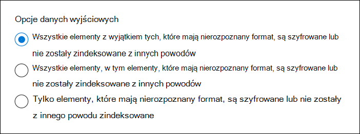

# <a name="partially-indexed-items-in-ediscovery"></a>Częściowo zaindeksowane elementy w środowisku zbierania elektronicznych materiałów dowodowych

[!include[Purview banner](../includes/purview-rebrand-banner.md)]

Wyszukiwanie zbierania elektronicznych materiałów dowodowych Microsoft Purview uruchamiane z portal zgodności Microsoft Purview automatycznie uwzględnia częściowo indeksowane elementy w szacowanych wynikach wyszukiwania podczas uruchamiania wyszukiwania. Częściowo indeksowane elementy są Exchange elementów skrzynki pocztowej i dokumentów w witrynach SharePoint i OneDrive dla Firm, które z jakiegoś powodu nie zostały całkowicie zindeksowane do wyszukiwania. W Exchange częściowo indeksowany element zwykle zawiera plik (typu pliku, który nie może być indeksowany), który jest dołączony do wiadomości e-mail. Oto kilka innych powodów, dla których nie można indeksować elementów do wyszukiwania i są zwracane jako częściowo indeksowane elementy podczas uruchamiania wyszukiwania zbierania elektronicznych materiałów dowodowych:
  
- Typ pliku jest nierozpoznany lub nieobsługiwany do indeksowania.

- Komunikaty mają dołączony plik, który nie może być otwarty; Jest to najczęstsza przyczyna częściowo indeksowanych elementów wiadomości e-mail.

- Typ pliku jest obsługiwany w przypadku indeksowania, ale wystąpił błąd indeksowania dla określonego pliku.

- Zbyt wiele plików dołączonych do wiadomości e-mail.

- Plik dołączony do wiadomości e-mail jest zbyt duży.

- Plik jest szyfrowany przy użyciu technologii innych niż Microsoft.

- Plik jest chroniony hasłem.

> [!NOTE]
> Większość organizacji ma mniej niż 1% zawartości według woluminu i mniej niż 12% według rozmiaru, który jest częściowo indeksowany. Przyczyną różnicy między woluminem a rozmiarem jest to, że większe pliki mają większe prawdopodobieństwo, że zawierają zawartość, która nie może być całkowicie zindeksowana.
  
W przypadku badań prawnych organizacja może być zobowiązana do przeglądania częściowo indeksowanych elementów. Można również określić, czy podczas eksportowania wyników wyszukiwania na komputer lokalny mają być uwzględniane częściowo indeksowane elementy, czy też podczas przygotowywania wyników do analizy przy użyciu eDiscovery (Premium). Aby uzyskać więcej informacji, zobacz [Badanie częściowo zaindeksowanych elementów w środowisku zbierania elektronicznych materiałów dowodowych](investigating-partially-indexed-items-in-ediscovery.md).
  
## <a name="file-types-not-indexed-for-search"></a>Typy plików nie są indeksowane do wyszukiwania

Niektóre typy plików, takie jak pliki Bitmap lub MP3, nie zawierają zawartości, która może być indeksowana. W związku z tym serwery indeksowania wyszukiwania w Exchange i SharePoint nie wykonują indeksowania pełnotekstowego dla tych typów plików. Te typy plików są uważane za nieobsługiwany typ plików. Istnieją również typy plików, dla których indeksowanie pełnotekstowe zostało wyłączone domyślnie lub przez administratora. Nieobsługiwanych i wyłączonych typów plików są oznaczone jako elementy bez certyfikatu w wyszukiwaniach zawartości. Zgodnie z wcześniejszymi instrukcjami częściowo indeksowane elementy mogą być uwzględniane w zestawie wyników wyszukiwania podczas uruchamiania wyszukiwania, eksportowania wyników wyszukiwania na komputer lokalny lub przygotowywania wyników wyszukiwania do zbierania elektronicznych materiałów dowodowych (Premium).
  
Aby uzyskać listę obsługiwanych i wyłączonych formatów plików, zobacz następujące tematy:
  
-  - **formaty Exchange** [File indeksowane przez Exchange Search](/exchange/file-formats-indexed-by-exchange-search-exchange-2013-help)

-  -  Exchange [Get-SearchDocumentFormat](/powershell/module/exchange/get-searchdocumentformat)

-  -  SharePoint [Default przeszukane rozszerzenia nazw plików i przeanalizowane typy plików w SharePoint](/SharePoint/technical-reference/default-crawled-file-name-extensions-and-parsed-file-types)
  
## <a name="messages-and-documents-with-partially-indexed-file-types-can-be-returned-in-search-results"></a>Komunikaty i dokumenty z częściowo indeksowanymi typami plików mogą być zwracane w wynikach wyszukiwania

Nie każda wiadomość e-mail z częściowo zaindeksowanym załącznikiem pliku lub każdym częściowo zaindeksowanym dokumentem SharePoint jest zwracana automatycznie jako częściowo indeksowany element. Dzieje się tak dlatego, że inne właściwości wiadomości lub dokumentu, takie jak właściwość **Podmiot** w wiadomościach e-mail i właściwości **Tytuł** lub **Autor** dokumentów, są indeksowane i dostępne do przeszukiwania. Na przykład wyszukiwanie słowa kluczowego "financial" zwróci elementy z częściowo indeksowanym załącznikiem pliku, jeśli słowo kluczowe pojawi się w temacie wiadomości e-mail lub w nazwie pliku lub tytule dokumentu. Jeśli jednak słowo kluczowe pojawi się tylko w treści pliku, komunikat lub dokument zostaną zwrócone jako częściowo zaindeksowany element.
  
Podobnie komunikaty z częściowo indeksowanymi załącznikami plików i dokumentami częściowo indeksowanego typu pliku są uwzględniane w wynikach wyszukiwania, gdy inne właściwości wiadomości lub dokumentu, które są indeksowane i możliwe do przeszukiwania, są zgodne z kryteriami wyszukiwania. Właściwości wiadomości indeksowane do wyszukiwania obejmują daty wysłania i odebrania, nadawcę i adresata, nazwę pliku załącznika oraz tekst w treści wiadomości. Właściwości dokumentu indeksowane do wyszukiwania obejmują daty utworzone i zmodyfikowane. Dlatego nawet jeśli załącznik wiadomości może być częściowo indeksowanym elementem, komunikat zostanie uwzględniony w regularnych wynikach wyszukiwania, jeśli wartość innych właściwości wiadomości lub dokumentu jest zgodna z kryteriami wyszukiwania.
  
Aby uzyskać listę właściwości poczty e-mail i dokumentu, których można wyszukiwać przy użyciu narzędzi zbierania elektronicznych materiałów dowodowych w portalu zgodności, zobacz [Zapytania słów kluczowych i warunki wyszukiwania dla zbierania elektronicznych materiałów dowodowych](keyword-queries-and-search-conditions.md).
  
> [!NOTE]
> Jeśli element skrzynki pocztowej zostanie przeniesiony z folderu indeksowanego do folderu, który nie jest indeksowany, flaga zostanie ustawiona na unindex elementu i element zostanie usunięty z indeksu i nie będzie można przeszukiwać. Później, jeśli ten sam element zostanie przeniesiony z powrotem do indeksowanego folderu, flaga nie zostanie zresetowana. Oznacza to, że element pozostanie bez zmian i nie będzie można go przeszukiwać.

## <a name="partially-indexed-items-included-in-the-search-results"></a>Częściowo zaindeksowane elementy uwzględnione w wynikach wyszukiwania

Twoja organizacja może być wymagana do identyfikowania i przeprowadzania dodatkowej analizy częściowo indeksowanych elementów w celu określenia, czym są, co zawierają i czy są one istotne dla określonego badania. Jak wyjaśniono wcześniej, częściowo indeksowane elementy w wyszukiwanych lokalizacjach zawartości są automatycznie dołączane do szacowanych wyników wyszukiwania. Istnieje możliwość uwzględnienia tych częściowo zaindeksowanych elementów podczas eksportowania wyników wyszukiwania lub przygotowania wyników wyszukiwania do zbierania elektronicznych materiałów dowodowych (Premium).
  
Należy pamiętać o częściowo zaindeksowanych elementach:
  
- Po uruchomieniu wyszukiwania zbierania elektronicznych materiałów dowodowych całkowita liczba i rozmiar częściowo zindeksowanych elementów Exchange (zwracanych przez zapytanie wyszukiwania) są wyświetlane w statystykach wyszukiwania na stronie wysuwanej i oznaczone jako **elementy niewyeksplorowane**. Statystyki dotyczące częściowo indeksowanych elementów wyświetlanych na stronie wysuwanej nie obejmują częściowo indeksowanych elementów w witrynach SharePoint ani kontach OneDrive.

- Jeśli wyszukiwanie, z których eksportujesz wyniki, było wyszukiwaniem określonych lokalizacji zawartości lub wszystkich lokalizacji zawartości w organizacji, wyeksportowane zostaną tylko niezadeksowane elementy z lokalizacji zawartości zawierające elementy zgodne z kryteriami wyszukiwania. Innymi słowy, jeśli w skrzynce pocztowej lub witrynie nie zostaną znalezione żadne wyniki wyszukiwania, żadne niezainicjowane elementy w tej skrzynce pocztowej lub witrynie nie zostaną wyeksportowane. Przyczyną tego jest to, że eksportowanie częściowo indeksowanych elementów z wielu lokalizacji w organizacji może zwiększyć prawdopodobieństwo błędów eksportu i zwiększyć czas potrzebny na wyeksportowanie i pobranie wyników wyszukiwania.

    Aby wyeksportować częściowo indeksowane elementy ze wszystkich lokalizacji zawartości do wyszukiwania, skonfiguruj wyszukiwanie tak, aby zwracało wszystkie elementy (usuwając wszystkie słowa kluczowe z zapytania wyszukiwania), a następnie eksportować tylko częściowo indeksowane elementy podczas eksportowania wyników wyszukiwania (klikając pozycję **Tylko elementy, które mają nierozpoznany format, są szyfrowane lub nie zostały zindeksowane z innych powodów** w obszarze **Opcje wyjściowe**).

- Jeśli w wynikach wyszukiwania zostaną uwzględnione wszystkie elementy skrzynki pocztowej lub jeśli zapytanie wyszukiwania nie określi żadnych słów kluczowych lub określi tylko zakres dat, częściowo zaindeksowane elementy mogą nie zostać skopiowane do pliku PST zawierającego częściowo indeksowane elementy. Dzieje się tak, ponieważ wszystkie elementy, w tym wszystkie częściowo indeksowane elementy, zostaną automatycznie uwzględnione w regularnych wynikach wyszukiwania.

- Częściowo zaindeksowane elementy nie są dostępne do wyświetlenia podglądu. Musisz wyeksportować wyniki wyszukiwania, aby wyświetlić częściowo zaindeksowane elementy zwrócone przez wyszukiwanie.

   Ponadto podczas eksportowania wyników wyszukiwania i dołączania częściowo indeksowanych elementów w eksporcie częściowo indeksowane elementy z SharePoint elementów są eksportowane do folderu o nazwie **Uncrawlable**. Podczas eksportowania częściowo indeksowanych elementów Exchange są one eksportowane inaczej w zależności od tego, czy częściowo indeksowane elementy pasują do zapytania wyszukiwania i konfiguracji ustawień eksportu. 

- W poniższej tabeli przedstawiono zachowanie eksportu indeksowanych i częściowo indeksowanych elementów oraz to, czy każdy z nich jest uwzględniony dla różnych ustawień konfiguracji eksportu.

  |**Eksportowanie konfiguracji**|**Indeksowane elementy zgodne z zapytaniem wyszukiwania**|**Częściowo zaindeksowane elementy zgodne z zapytaniem wyszukiwania**|**Częściowo zaindeksowane elementy, które nie są zgodne z zapytaniem wyszukiwania**|
  |:-----|:-----|:-----|:-----|
  |Eksportowanie tylko indeksowanych elementów  <br/> |Eksportowane<br/> |Wyeksportowane (dołączone do indeksowanych elementów, które są eksportowane)<br/>  |Nie wyeksportowano <br/>|
  |Eksportowanie tylko częściowo indeksowanych elementów  <br/> |Nie wyeksportowano  <br/> |Wyeksportowane (jako elementy częściowo indeksowane)<br/> |Wyeksportowane (jako elementy częściowo indeksowane)|
  |Eksportowanie indeksowanych i częściowo indeksowanych elementów  <br/> |Eksportowane<br/> |Wyeksportowane (dołączone do indeksowanych elementów, które są eksportowane)<br/>  |Wyeksportowane (jako elementy częściowo indeksowane)<br/>|
  ||||
  
## <a name="workaround-for-using-a-date-range-to-exclude-partially-indexed-items"></a>Obejście dotyczące używania zakresu dat do wykluczania częściowo indeksowanych elementów

W obszarze Wyszukiwanie zawartości i Microsoft Purview eDiscovery (Standard) nie można użyć zakresu dat w celu wykluczenia częściowo indeksowanych elementów z zwracanych przez zapytanie wyszukiwania. Innymi słowy, częściowo indeksowane elementy, które wykraczają poza zakres dat, są nadal uwzględniane jako częściowo indeksowane elementy w statystykach wyszukiwania i podczas eksportowania częściowo indeksowanych elementów. W obszarze eDiscovery (Premium) można wykluczyć częściowo indeksowane elementy przy użyciu zakresu dat w zapytaniu wyszukiwania.

Jako obejście tego ograniczenia zalecamy wykonanie poniższej procedury.

1. Utwórz i uruchom wyszukiwanie przy użyciu zapytania wyszukiwania, które spełnia twoje wymagania i zwraca żądane wyniki.

2. Wyeksportuj wyniki wyszukiwania z kroku 1, ale nie uwzględniaj częściowo indeksowanych elementów w eksporcie. W tym celu należy wybrać opcję **Wszystkie elementy, z wyłączeniem tych, które mają nierozpoznany format, są zaszyfrowane lub nie zostały zindeksowane z innych powodów** . <sup>1</sup>

   

3. Utwórz i uruchom drugie wyszukiwanie, które używa tego samego zapytania wyszukiwania (i wyszukuje te same lokalizacje), które zostały użyte w kroku 1. Dołącz następującą klauzulę do oryginalnego zapytania przy użyciu operatora **AND** :

   ```text
   <original query> AND ((IndexingErrorCode>0 OR IndexingErrorCode<0) AND sent:date1..date2)
   ```

   Dodanie tej klauzuli spowoduje zwrócenie częściowo zaindeksowanych elementów zgodnych z oryginalnym zapytaniem wyszukiwania, które mieszczą się w określonym zakresie dat. <sup>2.</sup>

4. Wyeksportuj wyniki wyszukiwania z kroku 3 i tym razem uwzględnij częściowo zaindeksowane elementy w eksporcie. W tym celu należy wybrać opcję **Wszystkie elementy, w tym te, które mają nierozpoznany format, są zaszyfrowane lub nie zostały zindeksowane z innych powodów** .

   > [!NOTE]
   > <sup>1</sup> Dane wyjściowe kroku 2 skutkują eksportowaniem tylko indeksowanych elementów.<br/>
   > <sup>2</sup> Warunek używany w kroku 3 identyfikuje tylko elementy z błędami indeksowania, które mieszczą się w określonym zakresie dat. Nie zwraca żadnych elementów, które są w pełni indeksowane. Oznacza to, że elementy wyeksportowane w kroku 4 obejmują tylko elementy niewyeksportowane, które mieszczą się w zakresie dat. Eksport nie zawiera indeksowanych elementów. W związku z tym połączone dane wyjściowe kroków 2 i 4 zawierają wszystkie indeksowane i niezaindeksowane elementy, które mieszczą się w określonym zakresie dat.

Użyj drugiego wyszukiwania utworzonego w kroku 3 i odpowiedniego eksportu, aby wyświetlić i zrozumieć częściowo zaindeksowane elementy zgodne z oryginalnym zapytaniem wyszukiwania. Eksportowanie z drugiego wyszukiwania obejmuje również wszystkie częściowo indeksowane elementy, które zostały wyeksportowane, dzięki czemu można je przejrzeć w razie potrzeby.

> [!TIP]
> W poprzedniej procedurze można wyeksportować rzeczywiste wyniki wyszukiwania lub tylko wyeksportować raport.

## <a name="indexing-limits-for-messages"></a>Limity indeksowania komunikatów

W poniższej tabeli opisano limity indeksowania, które mogą spowodować zwrócenie wiadomości e-mail jako częściowo indeksowanego elementu w wyszukiwaniu zbierania elektronicznych materiałów dowodowych w Microsoft 365.
  
Aby uzyskać listę limitów indeksowania dla dokumentów SharePoint, zobacz [Limity wyszukiwania dla SharePoint Online](/sharepoint/search-limits).
  
|**Limit indeksowania**|**Wartość maksymalna**|**Opis**|
|:-----|:-----|:-----|
|Maksymalny rozmiar załącznika (z wyłączeniem plików Excel)  <br/> |150 MB  <br/> |Maksymalny rozmiar załącznika wiadomości e-mail, który będzie analizowany pod kątem indeksowania. Wszelkie załączniki, które są większe niż ten limit, nie zostaną przeanalizowane pod kątem indeksowania, a komunikat z załącznikiem zostanie oznaczony jako częściowo zindeksowany.  <br/><br/> **Uwaga:** Analizowanie to proces, w którym usługa indeksowania wyodrębnia tekst z załącznika, usuwa niepotrzebne znaki, takie jak interpunkcja i spacje, a następnie dzieli tekst na słowa (w procesie nazywanym tokenizacją), które są następnie przechowywane w indeksie.           |
|Maksymalny rozmiar plików Excel  <br/> |4 MB  <br/> |Maksymalny rozmiar pliku Excel znajdujący się w witrynie lub dołączony do wiadomości e-mail, która zostanie przeanalizowana pod kątem indeksowania. Żaden plik Excel, który jest większy niż ten limit, nie zostanie przeanalizowany, a plik lub wiadomość e-mail z załącznikiem pliku zostaną oznaczone jako niewyeksponowane.  <br/> |
|Maksymalna liczba załączników  <br/> |250  <br/> |Maksymalna liczba plików dołączonych do wiadomości e-mail, które zostaną przeanalizowane pod kątem indeksowania. Jeśli komunikat zawiera więcej niż 250 załączników, pierwsze 250 załączników jest analizowanych i indeksowanych, a komunikat jest oznaczony jako częściowo zindeksowany, ponieważ zawiera dodatkowe załączniki, które nie zostały przeanalizowane.  <br/> |
|Maksymalna głębokość załącznika  <br/> |30  <br/> |Maksymalna liczba zagnieżdżonych załączników, które są analizowane. Jeśli na przykład do wiadomości e-mail jest dołączona inna wiadomość, a dołączona wiadomość zawiera dołączony dokument programu Word, dokument programu Word i dołączona wiadomość zostaną zindeksowane. To zachowanie będzie kontynuowane dla maksymalnie 30 zagnieżdżonych załączników.  <br/> |
|Maksymalna liczba dołączonych obrazów  <br/> |0  <br/> |Obraz dołączony do wiadomości e-mail jest pomijany przez analizator i nie jest indeksowany.  <br/> |
|Maksymalny czas analizowania elementu  <br/> |30 sekund  <br/> |Na analizowanie elementu na potrzeby indeksowania jest poświęcana maksymalnie 30 sekund. Jeśli czas analizowania przekracza 30 sekund, element jest oznaczony jako częściowo zaindeksowany.  <br/> |
|Maksymalne dane wyjściowe analizatora  <br/> |2 miliony znaków  <br/> |Maksymalna ilość danych wyjściowych tekstu z indeksowanego analizatora. Jeśli na przykład analizator wyodrębnił 8 milionów znaków z dokumentu, indeksowane są tylko pierwsze 2 miliony znaków.  <br/> |
|Maksymalna liczba tokenów adnotacji  <br/> |2 miliony  <br/> |Gdy wiadomość e-mail jest indeksowana, każde słowo jest adnotowane za pomocą różnych instrukcji przetwarzania, które określają sposób indeksowania tego słowa. Każdy zestaw instrukcji przetwarzania jest nazywany tokenem adnotacji. Aby utrzymać jakość usług w Office 365, istnieje limit 2 milionów tokenów adnotacji dla wiadomości e-mail.  <br/> |
|Maksymalny rozmiar treści w indeksie  <br/> |67 milionów znaków  <br/> |Całkowita liczba znaków w treści wiadomości e-mail i wszystkich jej załączników. Gdy wiadomość e-mail jest indeksowana, cały tekst w treści wiadomości i we wszystkich załącznikach jest połączony w jeden ciąg. Maksymalny rozmiar indeksowanego ciągu to 67 milionów znaków.  <br/> |
|Maksymalna liczba unikatowych tokenów w treści  <br/> |1 milion  <br/> |Jak wyjaśniono wcześniej, tokeny są wynikiem wyodrębniania tekstu z zawartości, usuwania interpunkcji i spacji, a następnie dzielenia go na wyrazy (nazywane tokenami), które są przechowywane w indeksie. Na przykład fraza  `"cat, mouse, bird, dog, dog"` zawiera 5 tokenów. Ale tylko 4 z nich to unikatowe tokeny. Istnieje limit 1 miliona unikatowych tokenów na wiadomość e-mail, co pomaga zapobiec zbyt dużemu rozmiarowi indeksu z losowymi tokenami.  <br/> |
||||

## <a name="more-information-about-partially-indexed-items"></a>Więcej informacji o częściowo indeksowanych elementach

- Jak wspomniano wcześniej, ponieważ właściwości komunikatu i dokumentu oraz ich metadane są indeksowane, wyszukiwanie słów kluczowych może zwracać wyniki, jeśli słowo kluczowe pojawi się w indeksowanych metadanych. Jednak to samo wyszukiwanie słów kluczowych może nie zwrócić tego samego elementu, jeśli słowo kluczowe pojawia się tylko w zawartości elementu o nieobsługiwanym typie pliku. W takim przypadku element zostanie zwrócony jako częściowo zaindeksowany element.

- Jeśli częściowo zaindeksowany element zostanie uwzględniony w wynikach wyszukiwania, ponieważ jest zgodny z kryteriami zapytania wyszukiwania, nie zostanie uwzględniony jako częściowo zaindeksowany element w szacowanych statystykach wyszukiwania. Ponadto nie będzie on uwzględniany w częściowo indeksowanych elementach podczas eksportowania wyników wyszukiwania.

- Mimo że typ pliku jest obsługiwany w przypadku indeksowania i jest indeksowany, mogą wystąpić błędy indeksowania lub wyszukiwania, które spowodują zwrócenie pliku jako częściowo indeksowanego elementu. Na przykład wyszukiwanie dużego pliku Excel może zakończyć się częściowym powodzeniem (ponieważ pierwsze 4 MB jest indeksowane), ale nie powiedzie się, ponieważ przekroczono limit rozmiaru pliku. W takim przypadku jest możliwe, że ten sam plik jest zwracany z wynikami wyszukiwania i jako częściowo zaindeksowany element.

- Pliki zaszyfrowane za pomocą [technologii szyfrowania firmy Microsoft](encryption.md) i dołączone do wiadomości e-mail zgodnej z kryteriami wyszukiwania mogą być przeglądane i będą odszyfrowywane po wyeksportowaniu. Obecnie pliki szyfrowane za pomocą technologii szyfrowania firmy Microsoft (i przechowywane w SharePoint lub OneDrive dla Firm) są częściowo indeksowane. 

   > [!NOTE]
   > Pliki zaszyfrowane przy użyciu etykiet poufności nie zostaną odszyfrowane.

- Wiadomości e-mail zaszyfrowane za pomocą protokołu S/MIME są częściowo indeksowane. Obejmuje to zaszyfrowane komunikaty z załącznikami plików lub bez tych załączników.

- Wiadomości e-mail chronione przy użyciu usługi Azure Rights Management są indeksowane i zostaną uwzględnione w wynikach wyszukiwania, jeśli pasują do zapytania wyszukiwania. Wiadomości e-mail chronione prawami są odszyfrowywane i można je wyświetlić i wyeksportować. Ta funkcja wymaga przypisania roli odszyfrowywania usługi RMS, która jest domyślnie przypisana do grupy ról menedżera zbierania elektronicznych materiałów dowodowych.

- Jeśli utworzysz blokadę opartą na zapytaniach skojarzoną ze sprawą zbierania elektronicznych materiałów dowodowych, wszystkie częściowo indeksowane elementy zostaną wstrzymane. Obejmuje to częściowo indeksowane elementy, które nie spełniają kryteriów zapytania wyszukiwania dla blokady. Aby uzyskać więcej informacji na temat tworzenia blokad zbierania elektronicznych materiałów dowodowych opartych na zapytaniach, zobacz [Tworzenie blokady zbierania elektronicznych materiałów](create-ediscovery-holds.md) dowodowych.

## <a name="see-also"></a>Zobacz też

[Badanie częściowo zaindeksowanych elementów w środowisku zbierania elektronicznych materiałów dowodowych](investigating-partially-indexed-items-in-ediscovery.md)
