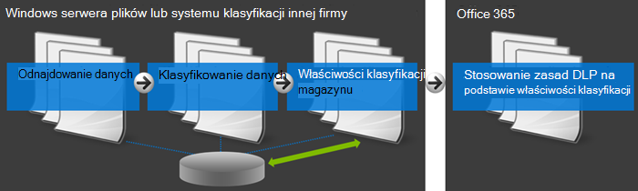

# <a name="create-a-dlp-policy-to-protect-documents-with-fci-or-other-properties"></a>Tworzenie zasad DLP w celu ochrony dokumentów za pomocą fci lub innych właściwości

Microsoft 365 ochrony przed utratą danych (DLP, data loss prevention) mogą używać właściwości klasyfikacji lub właściwości elementów do identyfikowania poufnych elementów. Możesz na przykład użyć:

- Windows infrastruktury klasyfikacji plików serwera (FCI)
- SharePoint właściwości dokumentu
- Właściwości dokumentu systemowego innej firmy



Na przykład organizacja może używać funkcji FCI programu Windows Server do identyfikowania elementów danych osobowych, takich jak numery PESEL, a następnie klasyfikować dokument, ustawiając właściwość Informacji umożliwiających identyfikację  użytkownika na **wysoki,** umiarkowany **, niski****, publiczny** lub  nieudostępniany na podstawie typu i liczby wystąpień danych osobowych znalezionych w dokumencie.

W programie Microsoft 365 można utworzyć zasady DLP identyfikujące dokumenty, dla których ta właściwość jest ustawiona na określone wartości, takie jak Wysoki i  **Średni, a** następnie akcji, takiej jak blokowanie dostępu do tych plików. Te same zasady mogą mieć inną regułę, która wymaga innej akcji, jeśli właściwość jest ustawiona na Wartość **niska, na** przykład wysłanie powiadomienia e-mail. Dzięki temu ochrona przed zabezpieczeniami DLP jest zintegrowana z usługą Windows Server FCI i pomaga chronić dokumenty Office przekazane lub udostępnione do usługi Microsoft 365 z serwerów plików opartych na Windows Server.

Zasady DLP po prostu wyszukuje określoną parę nazwa/wartość właściwości. Można używać dowolnej właściwości dokumentu, o ile ma ona odpowiadającą jej właściwość zarządzaną do SharePoint wyszukiwania. Na przykład zbiór SharePoint może używać typu zawartości o nazwie **Raport** podróży z wymaganym polem o nazwie **Klient**. Ilekroć osoba tworzy raport z podróży, musi wprowadzić nazwę klienta. Tej pary nazwa/wartość właściwości można także używać w zasadach DLP, na przykład jeśli chcesz, aby reguła blokowała dostęp do dokumentu dla gości, gdy pole Klient zawiera  nazwę **Contoso**.

Jeśli chcesz zastosować zasady DLP do zawartości z określonymi etykietami Microsoft 365, nie należy postępować zgodnie z instrukcjami w tym miejscu. Zamiast tego dowiedz się, jak [używać etykiety przechowywania jako warunku w zasadach DLP](data-loss-prevention-policies.md#using-a-retention-label-as-a-condition-in-a-dlp-policy).

## <a name="before-you-create-the-dlp-policy"></a>Przed utworzeniem zasad DLP

Aby można było używać właściwości Windows Server FCI lub innej właściwości w zasadach DLP, należy utworzyć właściwość zarządzaną w centrum <a href="https://go.microsoft.com/fwlink/?linkid=2185219" target="_blank">SharePoint administracyjnego</a>. Oto dlaczego.

W SharePoint w trybie online OneDrive dla Firm indeks wyszukiwania jest wbudowany przez przeszukiwanie zawartości witryn. Przeszukiwarka wybiera zawartość i metadane z dokumentów w formie właściwości przeszukanych. Schemat wyszukiwania pomaga przeszukiwarce zdecydować, jaką zawartość i które metadane wybrać. Przykładami metadanych są autor i tytuł dokumentu. Jednak aby pobrać zawartość i metadane z dokumentów do indeksu wyszukiwania, trzeba zamapować właściwości przeszukane na właściwości zarządzane. W indeksie są przechowywane tylko właściwości zarządzane. Na przykład właściwość przeszukana związana z autorem jest mapowana na właściwość zarządzaną związaną z autorem.

> [!NOTE]
> Pamiętaj, aby używać nazwy właściwości zarządzanej, a nie nazwy właściwości przeszukaowej podczas tworzenia reguł DLP przy użyciu `ContentPropertyContainsWords` warunku.

Jest to szczególnie ważne, ponieważ ta wyszukiwarka używa przeszukiwarki do identyfikowania i klasyfikowania informacji poufnych w witrynach, a następnie do przechowywania tych informacji poufnych w bezpiecznej części indeksu wyszukiwania. Gdy dokument jest przesyłany do Office 365, SharePoint automatycznie tworzy właściwości przeszukane na podstawie właściwości dokumentu. Jednak aby w zasadach DLP użyć właściwości FCI lub innej, ta właściwość przeszukana musi zostać zamapowana na właściwość zarządzaną, aby zawartość tej właściwości był przechowywana w indeksie.

Aby uzyskać więcej informacji na temat wyszukiwania i właściwości zarządzanych, zobacz [Zarządzanie schematem wyszukiwania w u SharePoint Online](/sharepoint/manage-search-schema).

### <a name="step-1-upload-a-document-with-the-needed-property-to-office-365"></a>Krok 1. Upload dokument z potrzebną właściwością do Office 365

Najpierw musisz przekazać dokument z właściwością, do której chcesz się odwołać w zasadach DLP. Microsoft 365 wykryje właściwość i automatycznie utworzy na jej stronie właściwość przeszukaną. W następnym kroku utworzysz właściwość zarządzaną, a następnie zamapujesz tę właściwość zarządzaną na tę właściwość przeszukaną.

### <a name="step-2-create-a-managed-property"></a>Krok 2. Tworzenie właściwości zarządzanej

1. Zaloguj się do <a href="https://go.microsoft.com/fwlink/p/?linkid=2024339" target="_blank">Centrum administracyjnego usługi Microsoft 365</a>.

2. W lewym okienku nawigacji wybierz pozycję **Centra administracyjne** \> **SharePoint**. Jesteś teraz w centrum <a href="https://go.microsoft.com/fwlink/?linkid=2185219" target="_blank">administracyjnym SharePoint</a>.

3. W lewym okienku nawigacji wybierz pozycję **wyszukaj** \> na stronie **administracji wyszukiwania** Zarządzaj \> **schematem wyszukiwania**.

   

4. Na stronie **Właściwości zarządzane** Nowa \> **właściwość zarządzana**.

   

5. Wprowadź nazwę i opis właściwości. Ta nazwa będzie wyświetlana w twoich zasadach ochrony przed zasadami ochrony przed reklamami.

6. W **polu Typ** wybierz pozycję **Tekst**.

7. W **obszarze Główne cechy** wybierz pozycję **Z zapytaniem** **i można go od użytkownika od użytkownika wybrać**.

8. W **obszarze Mapowania na właściwości przeszukane** \> **Dodaj mapowanie**.

9. W **oknie dialogowym** \> Wybieranie właściwości przeszukanych znajdź i wybierz właściwość przeszukaną odpowiadającą właściwości Windows Server FCI lub innej właściwości, która będzie przez Ciebie stosować w twoich zasadach DLP \> **.**

   

10. U dołu **strony ok.**\>

## <a name="create-a-dlp-policy-that-uses-an-fci-property-or-other-property"></a>Tworzenie zasad DLP, które wykorzystuje właściwość FCI lub inną właściwość

W tym przykładzie organizacja używa funkcji FCI na serwerach plików opartych na programie Windows Server, a w szczególności używa właściwości klasyfikacji FCI o nazwie **Dane** umożliwiające identyfikację użytkownika z możliwymi wartościami: **Wysoki,** Umiarkowany **, Niski****, Publiczny** i Nieudostępniany. Teraz chcą używać istniejącej klasyfikacji FCI w zasadach DLP w Office 365.

Najpierw należy wykonać czynności opisane powyżej w celu utworzenia właściwości zarządzanej w aplikacji SharePoint Online, która jest mapowana na właściwość przeszukaną utworzoną automatycznie na podstawie właściwości FCI.

Następnie utworzyli zasady DLP z dwiema regułami, które używają warunku **Właściwości dokumentu zawierające dowolną z tych wartości**:

- **Treści PII FCI — wysoki, umiarkowany** Pierwsza reguła ogranicza dostęp do dokumentu, jeśli właściwość klasyfikacji FCI danych osobowych  jest równa Wysoki lub Umiarkowany,  a dokument jest udostępniany osobom spoza organizacji.

- **Treść PII FCI — niska** Druga reguła wysyła powiadomienie do właściciela dokumentu, jeśli właściwość klasyfikacji FCI danych osobowych  jest równa Niskie, a  dokument jest udostępniany osobom spoza organizacji.

### <a name="create-the-dlp-policy-by-using-powershell"></a>Tworzenie zasad DLP przy użyciu programu PowerShell

Warunek **Właściwości dokumentu zawierają dowolną z tych** wartości nie &amp; są tymczasowo dostępne w interfejsie użytkownika Centrum zgodności zabezpieczeń, ale nadal można używać tego warunku przy użyciu programu PowerShell. Przy użyciu tych pól  `New\Set\Get-DlpCompliancePolicy` cmdlet można pracować z zasadami DLP,  `New\Set\Get-DlpComplianceRule` a przy użyciu tych pól cmdlet  `ContentPropertyContainsWords` z parametrem dodać warunek Właściwości dokumentu zawierają dowolną **z tych wartości**.

Aby uzyskać więcej informacji o tych poleceniach cmdlet, zobacz [Polecenia &amp; cmdlet Centrum zgodności zabezpieczeń](/powershell/exchange/exchange-online-powershell).

1. [Połączenie zabezpieczeń &amp; Centrum zgodności przy użyciu zdalnej obsługi programu PowerShell](/powershell/exchange/connect-to-scc-powershell)

2. Utwórz zasady przy użyciu .`New-DlpCompliancePolicy`

Ten program PowerShell tworzy zasady DLP stosowane do wszystkich lokalizacji.

   ```powershell
   New-DlpCompliancePolicy -Name FCI_PII_policy -ExchangeLocation All -SharePointLocation All -OneDriveLocation All -Mode Enable
   ```

3. Utwórz dwie reguły opisane powyżej `New-DlpComplianceRule`przy użyciu , gdzie jedna reguła dotyczy wartości Niskie,  a druga dla wartości **Wysoki** **i Umiarkowany**.

   Oto przykład programu PowerShell, który tworzy te dwie reguły. Pary nazwa właściwości/wartość są ujęte w cudzysłów, a nazwa właściwości może określać wiele wartości rozdzielonych przecinkami bez spacji, na przykład  `"<Property1>:<Value1>,<Value2>","<Property2>:<Value3>,<Value4>"....`

   ```powershell
   New-DlpComplianceRule -Name FCI_PII_content-High,Moderate -Policy FCI_PII_policy -AccessScope NotInOrganization -BlockAccess $true -ContentPropertyContainsWords "Personally Identifiable Information:High,Moderate" -Disabled $falseNew-DlpComplianceRule -Name FCI_PII_content-Low -Policy FCI_PII_policy -AccessScope NotInOrganization -BlockAccess $false -ContentPropertyContainsWords "Personally Identifiable Information:Low" -Disabled $false -NotifyUser Owner
   ```

   Windows FcI serwera zawiera wiele wbudowanych właściwości, w tym informacje umożliwiające identyfikację **użytkownika użyte w** tym przykładzie. Możliwe wartości poszczególnych właściwości mogą być różne dla każdej organizacji. Użyte **tutaj** wartości Wysoki, **Umiarkowany** i Niski to tylko przykład. W swojej organizacji możesz wyświetlić właściwości klasyfikacji Windows FCI serwera z ich możliwymi wartościami w menedżerze zasobów serwera pliku na Windows serwerze opartym na serwerze. Aby uzyskać więcej informacji, [zobacz Tworzenie właściwości klasyfikacji](/previous-versions/windows/it-pro/windows-server-2008-R2-and-2008/dd759215(v=ws.11)).

Po zakończeniu zasady powinny mieć dwie nowe reguły, które używają właściwości Dokument **zawierają dowolny z tych warunków** wartości. Ten warunek nie będzie wyświetlany w interfejsie użytkownika, chociaż zostaną wyświetlone inne warunki, akcje i ustawienia.

Jedna reguła blokuje dostęp do zawartości, w której właściwość informacji umożliwiających **identyfikację** użytkownika jest **równa wartości Wysoki** lub **Umiarkowany**. Druga reguła wysyła powiadomienie o zawartości, w której właściwość Informacji umożliwiających **identyfikację** użytkownika jest równa **niskiej** wartości.


## <a name="after-you-create-the-dlp-policy"></a>Po utworzeniu zasad DLP

Wykonanie czynności poprzednich sekcji spowoduje utworzenie zasad DLP, które będą szybko wykrywać zawartość przy użyciu tej właściwości, ale tylko w przypadku, gdy ta zawartość zostanie nowo przesłana (tak, aby zawartość zindeksowana) lub jeśli ta zawartość jest stara, ale po prostu edytowana (w celu ponownego indeksowania zawartości).

Aby we wszystkich miejscach wykrywać zawartość, warto ręcznie zażądać ponownego indeksowania biblioteki, witryny lub zbioru witryn, aby zasady DLP wiedziały o całej zawartości tej właściwości. W SharePoint Online zawartość jest automatycznie przeszukiwana według zdefiniowanego harmonogramu przeszukiwania. Przeszukiwarka wybiera zawartość, która uległa zmianie od ostatniego przeszukiwania, i aktualizuje indeks. Jeśli chcesz, aby zasady DLP chroniły zawartość przed następnym planowanym przeszukiwaniem, możesz wykonać te czynności.

> [!CAUTION]
> Ponowne indeksowanie witryny może spowodować olbrzymie obciążenie systemu wyszukiwania. Nie zaindeksuj ponownie witryny, chyba że jest to naprawdę konieczne w Twoim scenariuszu.

Aby uzyskać więcej informacji, [zobacz Ręczne żądanie](/sharepoint/crawl-site-content) przeszukiwania i ponownego indeksowania witryny, biblioteki lub listy.

### <a name="reindex-a-site-optional"></a>Ponowne indeksowanie witryny (opcjonalnie)

1. W witrynie wybierz **pozycję Ustawienia (** ikona koła zębatego w prawym górnym rogu) Site \> **Ustawienia**.

2. W **obszarze Wyszukiwanie** wybierz pozycję **Wyszukaj i dostępność w trybie offline** \> **Ponowne indeksowanie witryny**.

## <a name="more-information"></a>Więcej informacji

- [Informacje na temat ochrony przed utratą danych](dlp-learn-about-dlp.md)

- [Tworzenie zasad DLP na podstawie szablonu](create-a-dlp-policy-from-a-template.md)

- [Wysyłanie powiadomień i wyświetlanie porad dotyczących zasad DLP](use-notifications-and-policy-tips.md)

- [Szablony zasad DLP](what-the-dlp-policy-templates-include.md)

- [Definicje jednostki typu informacji poufnych](sensitive-information-type-entity-definitions.md)