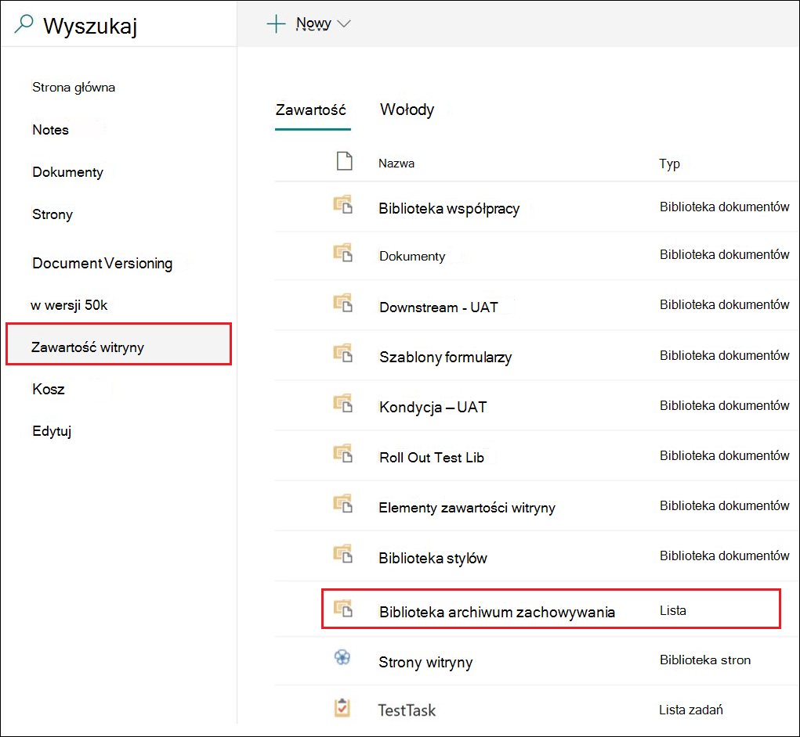
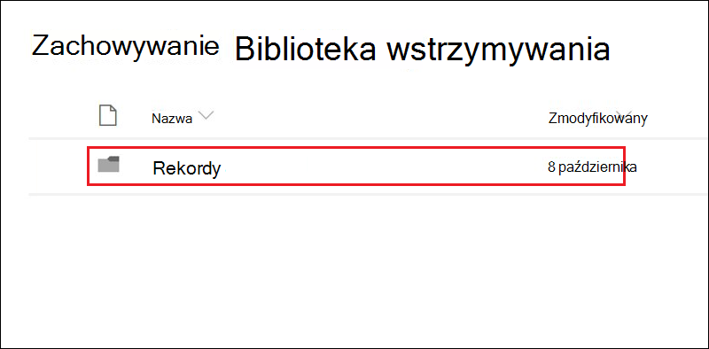

# Używanie przechowywania wersji rekordów do aktualizowania rekordów przechowywanych w SharePoint lub OneDrive

>*[Microsoft 365 licencjonowania w zakresie zabezpieczeń & zgodności](/office365/servicedescriptions/microsoft-365-service-descriptions/microsoft-365-tenantlevel-services-licensing-guidance/microsoft-365-security-compliance-licensing-guidance).*

> [!NOTE]
> Ze względu na to, że rekordy prawne blokują edytowanie, dla rekordów prawnych nie jest dostępne rejestrowanie wersji rekordów.
>
> Możesz również zapobiec nagrywaniu wersji dla dzierżawy, nawet jeśli nie korzystasz z rekordów prawnych: Przejdź do węzła Zarządzanie  rekordami w ustawieniach zarządzania rekordami Centrum zgodności platformy Microsoft 365 > Uzyskaj etykiety konfiguracji wersji rekordu **, a** >  >  następnie wyłącz ustawienie Włącz tworzenie wersji **rekordu**.

Możliwość oznaczania dokumentu jako rekordu i  ograniczania akcji, które można wykonać w rekordzie, jest podstawowym celem każdego rozwiązania do zarządzania rekordami. Współpraca może jednak być również potrzebna, aby inne osoby mogły tworzyć kolejne wersje.

Na przykład możesz oznaczyć umowę sprzedaży jako rekord, ale musisz zaktualizować umowę nowymi warunkami i oznaczyć najnowszą wersję jako nowy rekord, zachowując poprzednią wersję rekordu. W przypadku takich typów scenariuszy można SharePoint i OneDrive wersji *rekordu*. OneNote notesów nie obsługują zapisu wersji.

Aby użyć funkcji oznaczania wersji rekordów, najpierw oznacz dokument etykietą i [oznacz go jako rekord](declare-records.md). W tym momencie obok etykiety przechowywania jest wyświetlana właściwość dokumentu o nazwie Stan rekordu, a początkowy stan rekordu **to Zablokowane**.

Teraz można wykonać następujące czynności:

- **Ciągłe edytowanie i zachowywanie poszczególnych wersji dokumentu jako rekordów przez odblokowanie i zablokowanie właściwości Stan rekordu.** Tylko wtedy **, gdy właściwość Stan rekordu** jest ustawiona na **Wartość** zablokowana to nowa wersja zachowanego rekordu. Ten przełącznik blokowania i odblokowywania zmniejsza ryzyko zachowania niepotrzebnych wersji i kopii dokumentu.

- **Rekordy muszą być automatycznie przechowywane w repozytorium rekordów w miejscu, które znajduje się w zbiorze witryn.** Każdy zbiór witryn w programie SharePoint i OneDrive zachowuje zawartość swojej biblioteki Hold hold. Wersje rekordów są przechowywane w folderze Rekordy w tej bibliotece.

- **Zachowywanie zawsze zawsze zielonego dokumentu zawierającego wszystkie wersje.** Domyślnie każdy dokument SharePoint dokument OneDrive ma historię wersji dostępną w menu elementu. W tej historii wersji możesz łatwo sprawdzić, które wersje są rekordami, i wyświetlić te dokumenty.

> [!TIP]
> W przypadku korzystania z przechowywania wersji rekordu z etykietą przechowywania z akcją usuwania rozważ skonfigurowanie ustawienia przechowywania Rozpocznij okres przechowywania na podstawie **:** na podstawie wartości Gdy elementy zostały **oznaczone etykietą**. Po ustawieniu tej etykiety początek okresu przechowywania jest resetowany dla każdej nowej wersji rekordu, dzięki temu starsze wersje zostaną usunięte przed nowszą wersją.

Przechowywanie wersji rekordu jest automatycznie dostępne dla każdego dokumentu, w który zastosowano etykietę przechowywania, która oznacza element jako rekord i jest publikowana [w witrynie](create-apply-retention-labels.md). Gdy użytkownik wyświetly właściwości dokumentu za pomocą okienka szczegółów, może przełączyć stan rekordu  z **Zablokowane na** **Odblokowany**. Ta akcja powoduje utworzenie rekordu w folderze Rekordy w bibliotece Zachowywanie, w którym znajduje się on przez resztę okresu przechowywania.

Gdy dokument jest odblokowany, każdy użytkownik ze standardowymi uprawnieniami do edycji może edytować plik. Jednak użytkownicy nie mogą usunąć pliku, ponieważ nadal jest to rekord. Po zakończeniu edytowania użytkownik może przełączać stan rekordu z Odblokowany na **Zablokowany, co** uniemożliwia dodatkowe edycje w tym stanie. 
  

:::image type="content" alt-text="Właściwość stanu rekordu w dokumencie oznaczonym jako rekord." source="../media/recordversioning8.png" lightbox="../media/recordversioning8.png":::

## Blokowanie i odblokowywanie rekordu

Po zastosowaniu etykiety przechowywania, która oznacza zawartość jako rekord, do dokumentu każdy użytkownik z uprawnieniami Współtworzenia lub węższy poziom uprawnień może odblokować rekord lub zablokować odblokowany rekord.
  

:::image type="content" alt-text="Stan rekordu pokazuje, że dokument rekordu jest odblokowany." source="../media/recordversioning9.png" lightbox="../media/recordversioning9.png":::

Po odblokowaniu rekordu przez użytkownika występują następujące akcje:

1. Jeśli bieżący zbiór witryn nie ma biblioteki Zachowywanie, zostanie utworzona.

2. Jeśli biblioteka Hold hold (Przechowywanie) nie zawiera folderu Records (Rekordy), zostanie utworzona.

3. Kopia **do działania** kopiuje najnowszą wersję dokumentu do folderu Rekordy. Akcja **Kopiuj do** obejmuje tylko najnowszą wersję, a nie wcześniejsze wersje. Ten skopiowany dokument jest teraz wersją dokumentu w formacie rekordu, a jego nazwa pliku ma format: \[Wersja identyfikatora GUID tytułu\#\]

4. Kopia utworzona w folderze Rekordy zostanie dodana do historii wersji oryginalnego dokumentu, a w tej wersji w polu komentarzy będzie widać wyraz **Record (** Rekord).

5. Oryginalny dokument jest nową wersją, która można edytować, ale nie można jej usuwać. Kolumna biblioteki dokumentów **Element jest rekordem** i nadal zawiera wartość **Tak** , ponieważ dokument nadal jest rekordem, nawet jeśli można go teraz edytować.

Po zablokowaniu rekordu przez użytkownika nie będzie można edytować oryginalnego dokumentu. Jednak jest to akcja odblokowywania rekordu, który kopiuje wersję do folderu Rekordy w bibliotece Wstrzymanie zachowywania.

## Rejestrowanie wersji

Za każdym razem, gdy użytkownik odblokuje rekord, najnowsza wersja jest kopiowana do biblioteki Hold (Przechowywanie), a ta wersja zawiera wartość Record **(** Rekord) w polu **Comments** (Komentarze) w historii wersji.
  

:::image type="content" alt-text="Record shown in the Preservation Hold library." source="../media/recordversioning10.png" lightbox="../media/recordversioning10.png":::

Aby wyświetlić historię wersji, wybierz dokument w bibliotece dokumentów, a następnie kliknij pozycję **Historia wersji** w menu elementu.

## Miejsce przechowywania rekordów

Rekordy są przechowywane w folderze Rekordy w bibliotece Hold hold (Przechowywanie) w witrynie najwyższego poziomu w zbiorze witryn. W lewym okienku nawigacji w witrynie najwyższego poziomu wybierz pozycję **Biblioteka z zachowaniem zawartości** \> **witryny**.
  

  

Aby uzyskać więcej informacji na temat działania biblioteki Holduj zachowywanie, zobacz Jak działa przechowywanie w SharePoint [i](retention-policies-sharepoint.md#how-retention-works-for-sharepoint-and-onedrive) OneDrive.

## Wyszukiwanie zdarzeń versioningu rekordów w dzienniku inspekcji

Akcje blokowania i odblokowywania rekordów są rejestrowane w dzienniku inspekcji. Z **opcji Działania na plikach i na** stronie zaznacz pole **wyboru Zmieniono stan rekordu na** zablokowany i **Stan rekordu zmieniono w celu odblokowania**.

Aby uzyskać więcej informacji na temat wyszukiwania tych zdarzeń, zobacz [Przeszukiwanie dziennika inspekcji](search-the-audit-log-in-security-and-compliance.md#file-and-page-activities).

## Następne kroki

Aby uzyskać informacje na temat innych scenariuszy obsługiwanych przez zarządzanie rekordami, zobacz [Typowe scenariusze zarządzania rekordami](get-started-with-records-management.md#common-scenarios).
