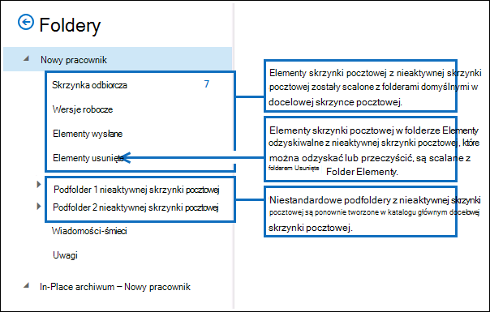

# <a name="restore-an-inactive-mailbox"></a>Przywróć nieaktywną skrzynkę pocztową

[!include[Purview banner](../includes/purview-rebrand-banner.md)]

Nieaktywna skrzynka pocztowa (która jest typem nietrwałej skrzynki pocztowej) jest używana do przechowywania poczty e-mail byłego pracownika po opuszczeniu organizacji. Jeśli inny pracownik przejmuje obowiązki związane z pracą odchodzących pracowników lub jeśli ten pracownik wróci do organizacji, istnieją dwa sposoby udostępniania zawartości nieaktywnej skrzynki pocztowej użytkownikowi:

- **Przywracanie nieaktywnej skrzynki pocztowej** Jeśli inny pracownik przejmuje obowiązki związane z pracą zmarłego pracownika lub jeśli inny użytkownik potrzebuje dostępu do zawartości nieaktywnej skrzynki pocztowej, możesz przywrócić (lub scalić) zawartość nieaktywnej skrzynki pocztowej do istniejącej skrzynki pocztowej. Możesz również przywrócić archiwum z nieaktywnej skrzynki pocztowej. Po jej przywróceniu nieaktywna skrzynka pocztowa jest zachowywana i jest zachowywana jako nieaktywna skrzynka pocztowa. W tym artykule opisano procedury przywracania nieaktywnej skrzynki pocztowej.

- **Odzyskiwanie nieaktywnej skrzynki pocztowej** Jeśli zmarły pracownik wróci do organizacji lub nowy pracownik zostanie zatrudniony do podjęcia obowiązków związanych z pracą zmarłego pracownika, możesz odzyskać zawartość nieaktywnej skrzynki pocztowej. Ta metoda konwertuje nieaktywną skrzynkę pocztową na nową skrzynkę pocztową zawierającą zawartość nieaktywnej skrzynki pocztowej. Po jej odzyskaniu nieaktywna skrzynka pocztowa już nie istnieje. Aby zapoznać się z procedurami krok po kroku, zobacz [Odzyskiwanie nieaktywnej skrzynki pocztowej w Office 365](recover-an-inactive-mailbox.md).

Zobacz sekcję [Więcej informacji](#more-information) w tym artykule, aby uzyskać więcej informacji na temat różnic między przywracaniem i odzyskiwaniem nieaktywnej skrzynki pocztowej.

> [!NOTE]
> Nie można odzyskać ani przywrócić nieaktywnej skrzynki pocztowej skonfigurowanej przy użyciu automatycznie rozwijającego się archiwum. Jeśli musisz odzyskać dane z nieaktywnej skrzynki pocztowej z automatycznie rozszerzającym się archiwum, użyj wyszukiwania zawartości, aby wyeksportować dane ze skrzynki pocztowej, a następnie zaimportować je do innej skrzynki pocztowej. Aby uzyskać instrukcje, zobacz następujące artykuły:
>
> - [Wyszukiwanie zawartości](content-search.md)
> - [Eksportowanie wyników wyszukiwania zawartości](export-search-results.md)

## <a name="requirements-to-restore-an-inactive-mailbox"></a>Wymagania dotyczące przywracania nieaktywnej skrzynki pocztowej

- Aby przywrócić nieaktywną skrzynkę pocztową, należy użyć Exchange Online programu PowerShell. Nie można użyć centrum administracyjnego Exchange (EAC) ani portal zgodności Microsoft Purview dla tej procedury. Aby uzyskać instrukcje krok po kroku dotyczące używania Exchange Online programu PowerShell, zobacz [Połączenie do Exchange Online programu PowerShell](/powershell/exchange/connect-to-exchange-online-powershell).

- Uruchom następujące polecenie w programie Exchange Online programu PowerShell, aby uzyskać informacje o tożsamości dla nieaktywnych skrzynek pocztowych w organizacji.

  ```powershell
  Get-Mailbox -InactiveMailboxOnly | Format-List Name,DistinguishedName,ExchangeGuid,PrimarySmtpAddress
  ```

  Użyj informacji zwróconych przez to polecenie, aby zidentyfikować i przywrócić określoną nieaktywną skrzynkę pocztową.

- Aby uzyskać więcej informacji na temat nieaktywnych skrzynek pocztowych, zobacz [Nieaktywne skrzynki pocztowe w Office 365](inactive-mailboxes-in-office-365.md).

## <a name="restore-inactive-mailboxes"></a>Przywracanie nieaktywnych skrzynek pocztowych

Użyj polecenia cmdlet **New-MailboxRestoreRequest** z parametrami  _SourceMailbox_ i  _TargetMailbox_ , aby przywrócić zawartość nieaktywnej skrzynki pocztowej do istniejącej skrzynki pocztowej. Aby uzyskać więcej informacji na temat korzystania z tego polecenia cmdlet, zobacz [New-MailboxRestoreRequest](/powershell/module/exchange/new-mailboxrestorerequest).

Przed przywróceniem nieaktywnej skrzynki pocztowej należy dodać nazwę LegacyExchangeDN nieaktywnej skrzynki pocztowej do docelowej skrzynki pocztowej jako adres proxy X500 docelowej skrzynki pocztowej. Należy to zrobić, ponieważ polecenie cmdlet **New-MailboxRestoreRequest** sprawdza, czy wartość właściwości **LegacyExchangeDN w źródłowych** i docelowych skrzynkach pocztowych jest taka sama. Po przywróceniu nieaktywnej skrzynki pocztowej możesz opcjonalnie usunąć nazwę LegacyExchangeDN nieaktywnej skrzynki pocztowej ze źródłowej skrzynki pocztowej. Przed usunięciem nazwy LegacyExchangeDN poczekaj na ukończenie żądania przywrócenia skrzynki pocztowej.

Wykonaj następujące kroki, aby przywrócić nieaktywną skrzynkę pocztową do istniejącej skrzynki pocztowej:

1. Utwórz zmienną zawierającą właściwości nieaktywnej skrzynki pocztowej.

   ```powershell
   $inactiveMailbox = Get-Mailbox -InactiveMailboxOnly -Identity <identity of inactive mailbox>
   ```

   > [!IMPORTANT]
   > W poprzednim poleceniu użyj wartości właściwości **DistinguishedName** lub **ExchangeGUID** , aby zidentyfikować nieaktywną skrzynkę pocztową. Te właściwości są unikatowe dla każdej skrzynki pocztowej w organizacji, podczas gdy istnieje możliwość, że aktywna i nieaktywna skrzynka pocztowa może mieć ten sam podstawowy adres SMTP.

2. Wyświetl nazwę LegacyExchangeDN nieaktywnej skrzynki pocztowej, aby można było dodać ją jako adres proxy do docelowej skrzynki pocztowej w następnym kroku.

   ```powershell
   $inactiveMailbox.LegacyExchangeDN
   ```

3. Dodaj nazwę LegacyExchangeDN nieaktywnej skrzynki pocztowej jako adres proxy X500 do docelowej skrzynki pocztowej.

   ```powershell
   Set-Mailbox <identity of target mailbox> -EmailAddresses @{Add="X500:<LegacyExchangeDN of inactive mailbox>"}
   ```

4. Przywróć zawartość nieaktywnej skrzynki pocztowej do istniejącej skrzynki pocztowej. Zawartość nieaktywnej skrzynki pocztowej (źródłowej skrzynki pocztowej) zostanie scalona z odpowiednimi folderami w istniejącej skrzynce pocztowej (docelowej skrzynce pocztowej).

   ```powershell
   New-MailboxRestoreRequest -SourceMailbox $inactiveMailbox.DistinguishedName -TargetMailbox <identity of target mailbox> 
   ```

   Alternatywnie możesz określić folder najwyższego poziomu w docelowej skrzynce pocztowej, w którym ma zostać przywrócona zawartość z nieaktywnej skrzynki pocztowej. Jeśli określona struktura folderu docelowego lub folderu docelowego jeszcze nie istnieje w docelowej skrzynce pocztowej, zostanie utworzona podczas procesu przywracania.

   Ten przykład kopiuje elementy skrzynki pocztowej i podfoldery z nieaktywnej skrzynki pocztowej do folderu o nazwie "Nieaktywna skrzynka pocztowa" w strukturze folderów najwyższego poziomu docelowej skrzynki pocztowej.

   ```powershell
   New-MailboxRestoreRequest -SourceMailbox $InactiveMailbox.DistinguishedName -TargetMailbox <identity of target mailbox> -TargetRootFolder "Inactive Mailbox"
   ```

5. Po zakończeniu żądania przywracania możesz opcjonalnie usunąć nazwę LegacyExchangeDN nieaktywnej skrzynki pocztowej z docelowej skrzynki pocztowej. Pozostawienie nazwy LegacyExchangeDN z nieaktywnej skrzynki pocztowej nie wpłynie na docelową skrzynkę pocztową.

   ```powershell
   Set-Mailbox <identity of target mailbox> -EmailAddresses @{Remove="X500:<LegacyExchangeDN of inactive mailbox>"}
   ```

## <a name="restore-the-archive-from-an-inactive-mailbox"></a>Przywracanie archiwum z nieaktywnej skrzynki pocztowej

Jeśli nieaktywna skrzynka pocztowa ma archiwum skrzynki pocztowej, można również przywrócić ją do archiwum skrzynki pocztowej istniejącej skrzynki pocztowej. Aby przywrócić archiwum z nieaktywnej skrzynki pocztowej, należy dodać _przełączniki SourceIsArchive_ i _TargetIsArchive_ do polecenia używanego do przywracania nieaktywnej skrzynki pocztowej.

1. Utwórz zmienną zawierającą właściwości nieaktywnej skrzynki pocztowej.

   ```powershell
   $inactiveMailbox = Get-Mailbox -InactiveMailboxOnly -Identity <identity of inactive mailbox>
   ```

   > [!NOTE]
   > W poprzednim poleceniu użyj wartości właściwości **DistinguishedName** lub **ExchangeGUID** , aby zidentyfikować nieaktywną skrzynkę pocztową. Te właściwości są unikatowe dla każdej skrzynki pocztowej w organizacji, podczas gdy istnieje możliwość, że aktywna i nieaktywna skrzynka pocztowa może mieć ten sam podstawowy adres SMTP.

2. Wyświetl nazwę LegacyExchangeDN nieaktywnej skrzynki pocztowej, aby można było dodać ją jako adres proxy do docelowej skrzynki pocztowej w następnym kroku.

   ```powershell
   $inactiveMailbox.LegacyExchangeDN
   ```

3. Dodaj nazwę LegacyExchangeDN nieaktywnej skrzynki pocztowej jako adres proxy X500 do docelowej skrzynki pocztowej.

   ```powershell
   Set-Mailbox <identity of target mailbox> -EmailAddresses @{Add="X500:<LegacyExchangeDN of inactive mailbox>"}
   ```

4. Przywróć zawartość archiwum z nieaktywnej skrzynki pocztowej (archiwum źródłowego) do archiwum istniejącej skrzynki pocztowej (archiwum docelowe). W tym przykładzie zawartość z archiwum źródłowego jest kopiowana do folderu o nazwie "Archiwum nieaktywnej skrzynki pocztowej" w archiwum docelowej skrzynki pocztowej.

   ```powershell
   New-MailboxRestoreRequest -SourceMailbox $InactiveMailbox.DistinguishedName -SourceIsArchive -TargetMailbox <identity of target mailbox> -TargetIsArchive -TargetRootFolder "Inactive Mailbox Archive"
   ```

5. Po zakończeniu żądania przywracania możesz opcjonalnie usunąć nazwę LegacyExchangeDN nieaktywnej skrzynki pocztowej z docelowej skrzynki pocztowej. Pozostawienie nazwy LegacyExchangeDN z nieaktywnej skrzynki pocztowej nie wpłynie na docelową skrzynkę pocztową.

   ```powershell
   Set-Mailbox <identity of target mailbox> -EmailAddresses @{Remove="X500:<LegacyExchangeDN of inactive mailbox>"}
   ```

## <a name="more-information"></a>Więcej informacji

- **Jaka jest główna różnica między odzyskiwaniem i przywracaniem nieaktywnej skrzynki pocztowej?** Po odzyskaniu nieaktywnej skrzynki pocztowej skrzynka pocztowa jest konwertowana na nową skrzynkę pocztową. Zawartość i struktura folderów nieaktywnej skrzynki pocztowej są zachowywane, a skrzynka pocztowa jest połączona z nowym kontem użytkownika. Po jej odzyskaniu nieaktywna skrzynka pocztowa już nie istnieje, a wszelkie zmiany wprowadzone w zawartości w nowej skrzynce pocztowej będą miały wpływ na zawartość, która została pierwotnie wstrzymana w nieaktywnej skrzynce pocztowej. Z drugiej strony podczas przywracania nieaktywnej skrzynki pocztowej zawartość jest kopiowana tylko do innej skrzynki pocztowej. Nieaktywna skrzynka pocztowa jest zachowywana i pozostaje nieaktywną skrzynką pocztową. Wszelkie zmiany wprowadzone w zawartości w docelowej skrzynce pocztowej nie będą miały wpływu na oryginalną zawartość przechowywaną w nieaktywnej skrzynce pocztowej. Nieaktywną skrzynkę pocztową można nadal przeszukiwać za pomocą [narzędzia wyszukiwania zawartości](content-search.md), jej zawartość można przywrócić do innej skrzynki pocztowej lub odzyskać lub usunąć ją w późniejszym terminie.

- **Jak znaleźć nieaktywne skrzynki pocztowe?** Aby uzyskać listę nieaktywnych skrzynek pocztowych w organizacji i wyświetlić informacje przydatne do przywrócenia nieaktywnej skrzynki pocztowej, możesz uruchomić to polecenie.

  ```powershell
  Get-Mailbox -InactiveMailboxOnly | Format-List Name,PrimarySMTPAddress,DistinguishedName,ExchangeGUID,LegacyExchangeDN,ArchiveStatus
  ```

- **Użyj zasad przechowywania Microsoft 365 lub blokady postępowania sądowego lub do zachowania nieaktywnej zawartości skrzynki pocztowej.** Jeśli chcesz zachować stan nieaktywnej skrzynki pocztowej po jej przywróceniu, możesz zastosować [zasady przechowywania Microsoft 365](retention.md) do docelowej skrzynki pocztowej lub umieścić docelową skrzynkę pocztową w [blokadzie postępowania sądowego](create-a-litigation-hold.md) przed przywróceniem nieaktywnej skrzynki pocztowej. Uniemożliwi to trwałe usunięcie wszystkich elementów z nieaktywnej skrzynki pocztowej po ich przywróceniu do docelowej skrzynki pocztowej.

- **Przed przywróceniem nieaktywnej skrzynki pocztowej włącz przechowywanie w docelowej skrzynce pocztowej.** Ponieważ elementy skrzynki pocztowej z nieaktywnej skrzynki pocztowej mogą być stare, warto rozważyć włączenie przechowywania w docelowej skrzynce pocztowej przed przywróceniem nieaktywnej skrzynki pocztowej. Po wstrzymaniu skrzynki pocztowej zasady przechowywania przypisane do niej nie zostaną przetworzone, dopóki blokada przechowywania nie zostanie usunięta lub do czasu wygaśnięcia okresu przechowywania. Daje to właścicielowi docelowej skrzynki pocztowej czas na zarządzanie starymi wiadomościami z nieaktywnej skrzynki pocztowej. W przeciwnym razie zasady przechowywania mogą usuwać stare elementy (lub przenosić elementy do skrzynki pocztowej archiwum, jeśli jest włączona), które wygasły na podstawie ustawień przechowywania skonfigurowanych dla docelowej skrzynki pocztowej. Aby uzyskać więcej informacji, zobacz [Umieszczanie skrzynki pocztowej w blokadzie przechowywania w Exchange Online](/exchange/security-and-compliance/messaging-records-management/mailbox-retention-hold).

- **Za pomocą polecenia cmdlet New-MailboxRestoreRequest można użyć innych parametrów, aby zaimplementować różne scenariusze przywracania dla nieaktywnych skrzynek pocztowych.** Na przykład możesz uruchomić to polecenie, aby przywrócić archiwum z nieaktywnej skrzynki pocztowej do podstawowej skrzynki pocztowej docelowej skrzynki pocztowej.

  ```powershell
  New-MailboxRestoreRequest -SourceMailbox <inactive mailbox> -SourceIsArchive -TargetMailbox <target mailbox> -TargetRootFolder "Inactive Mailbox Archive"
  ```

  Możesz również przywrócić nieaktywną podstawową skrzynkę pocztową do archiwum docelowej skrzynki pocztowej, uruchamiając to polecenie.

  ```powershell
  New-MailboxRestoreRequest -SourceMailbox <inactive mailbox> -TargetMailbox <target mailbox> -TargetIsArchive -TargetRootFolder "Inactive Mailbox"
  ```

- **Do czego służy parametr TargetRootFolder?** Jak wyjaśniono wcześniej, można użyć parametru **TargetRootFolder** , aby określić folder w górnej części struktury folderów (nazywany również katalogiem głównym) w docelowej skrzynce pocztowej, w której ma zostać przywrócona zawartość nieaktywnej skrzynki pocztowej. Jeśli nie używasz tego parametru, elementy skrzynki pocztowej z nieaktywnej skrzynki pocztowej są scalane z odpowiednimi folderami domyślnymi docelowej skrzynki pocztowej, a foldery niestandardowe są ponownie tworzone w katalogu głównym docelowej skrzynki pocztowej. Poniższe ilustracje wyróżniają te różnice między nieużyciem i użyciem parametru **TargetRootFolder** .

  **Hierarchia folderów w docelowej skrzynce pocztowej, gdy parametr TargetRootFolder nie jest używany**

  

  **Hierarchia folderów w docelowej skrzynce pocztowej, gdy jest używany parametr TargetRootFolder**

  
