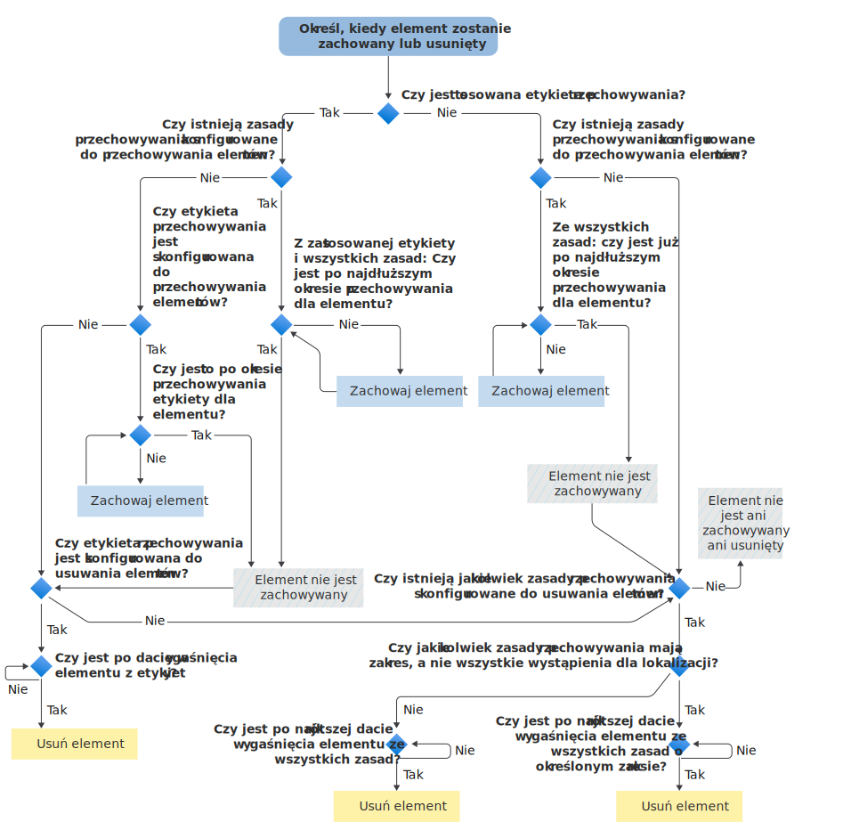

# Schemat blokowy określający, kiedy element zostanie zachowany lub trwale usunięty

>*[Wskazówki dotyczące licencjonowania platformy Microsoft 365 dotyczące zgodności & zabezpieczeń](/office365/servicedescriptions/microsoft-365-service-descriptions/microsoft-365-tenantlevel-services-licensing-guidance/microsoft-365-security-compliance-licensing-guidance).*

Użyj poniższego schematu blokowego, aby zastosować [zasady przechowywania](retention.md#the-principles-of-retention-or-what-takes-precedence) do elementu, aby określić, czy system będzie go zachować, czy trwale usunąć go w wyniku etykiety przechowywania lub zasad przechowywania.

Ten przepływ logiki jest używany dla elementu w przypadku zastosowania jednego z następujących warunków:

- Zastosowano więcej niż jedną zasadę przechowywania
- Istnieje etykieta przechowywania i co najmniej jedna zasady przechowywania

Gdy element podlega blokadzie zbierania elektronicznych materiałów dowodowych (lub starszym technologiom archiwum sporów sądowych lub In-Place blokady), zawsze będzie przechowywany przed podjęciem decyzji o zasadach przechowywania i etykiecie przechowywania.

Jeśli którykolwiek z terminów używanych w tym schemacie blokowym nie jest ci znany, zobacz [Informacje o zasadach przechowywania i etykietach przechowywania](retention.md).

   

> [!NOTE]
> Ważne jest rozróżnienie między najdłuższym okresem przechowywania elementu a najdłuższym określonym okresem w zasadach przechowywania lub etykiecie. Podobnie między najkrótszą datą wygaśnięcia elementu a najkrótszym określonym okresem w zasadach przechowywania.
> 
> Aby uzyskać więcej informacji, zobacz objaśnienie po grafice w sekcji [zasady przechowywania](retention.md#the-principles-of-retention-or-what-takes-precedence) .
