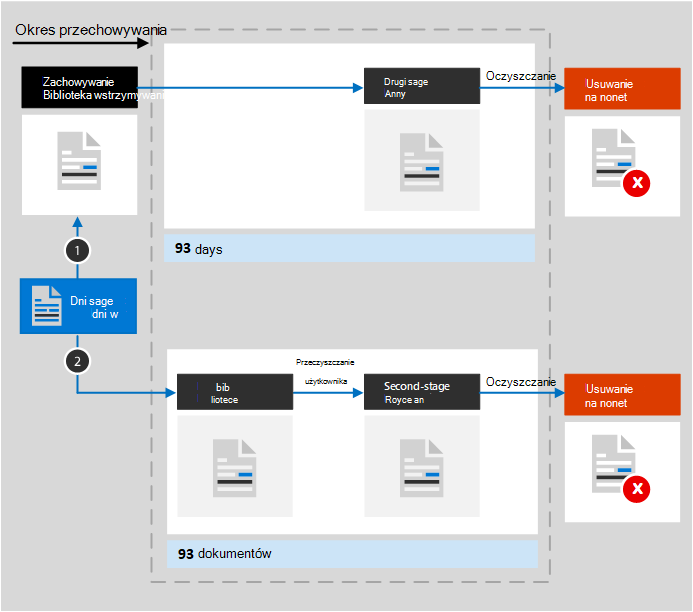

# Dowiedz się więcej na temat przechowywania SharePoint i OneDrive

>*[Microsoft 365 wskazówki dotyczące licencjonowania dotyczące zgodności & zabezpieczeń](/office365/servicedescriptions/microsoft-365-service-descriptions/microsoft-365-tenantlevel-services-licensing-guidance/microsoft-365-security-compliance-licensing-guidance).*

[!include[Purview banner](../includes/purview-rebrand-banner.md)]

Informacje zawarte w tym artykule [uzupełniają informacje na temat przechowywania](retention.md), ponieważ zawierają informacje specyficzne dla SharePoint i OneDrive.

W przypadku innych obciążeń zobacz:

- [Dowiedz się więcej na temat przechowywania Microsoft Teams](retention-policies-teams.md)
- [Dowiedz się więcej na temat przechowywania Yammer](retention-policies-yammer.md)
- [Dowiedz się więcej na temat przechowywania Exchange](retention-policies-exchange.md)

## Co jest dołączone do przechowywania i usuwania

Wszystkie pliki przechowywane w witrynach SharePoint lub OneDrive można przechowywać, stosując zasady przechowywania lub etykietę przechowywania. 

Można usunąć następujące pliki:

- W przypadku korzystania z zasad przechowywania: wszystkie pliki w bibliotekach dokumentów, które obejmują wszystkie automatycznie utworzone SharePoint biblioteki dokumentów, takie jak **zasoby witryny**.
    
- Gdy używasz etykiet przechowywania: wszystkie pliki we wszystkich bibliotekach dokumentów i wszystkie pliki na poziomie głównym, które nie znajdują się w folderze.
    
> [!TIP]
> Jeśli używasz [zapytania z zasadami automatycznego stosowania etykiety przechowywania](apply-retention-labels-automatically.md#auto-apply-labels-to-content-with-keywords-or-searchable-properties), możesz wykluczyć określone biblioteki dokumentów, używając następującego wpisu: `NOT(DocumentLink:"<URL to document library>")`

Elementy listy nie są obsługiwane przez zasady przechowywania, ale są obsługiwane przez etykiety przechowywania z wyjątkiem elementów na listach systemowych. Są to ukryte listy używane przez SharePoint do zarządzania systemem i obejmują katalog stron wzorcowych, wykaz rozwiązań i źródła danych. Gdy etykiety przechowywania są stosowane do obsługiwanych elementów listy, zawsze będą zachowywane zgodnie z ustawieniami przechowywania, ale nie zostaną usunięte, jeśli są ukryte przed wyszukiwaniem.

Po zastosowaniu etykiety przechowywania do obsługiwanego elementu listy zawierającego załącznik dokumentu:
- W przypadku standardowej etykiety przechowywania (nie deklaruje elementu jako rekordu):
    - Załącznik dokumentu nie dziedziczy automatycznie ustawień przechowywania etykiety, ale może być etykietą niezależnie.
- Dla etykiety przechowywania, która deklaruje element jako rekord: 
    - Załącznik dokumentu automatycznie dziedziczy ustawienia przechowywania z etykiety, jeśli dokument nie jest jeszcze oznaczony etykietą.

Ustawienia przechowywania z zasad przechowywania i etykiet przechowywania nie mają zastosowania do organizowania struktur, które obejmują biblioteki, listy i foldery.

W przypadku zasad przechowywania i zasad automatycznego stosowania etykiet: SharePoint lokacje muszą być indeksowane w celu zastosowania ustawień przechowywania. Jeśli jednak elementy w bibliotekach dokumentów SharePoint są skonfigurowane tak, aby nie były wyświetlane w wynikach wyszukiwania, ta konfiguracja nie wyklucza plików z ustawień przechowywania.

## Jak działa przechowywanie SharePoint i OneDrive

Aby przechowywać zawartość, która musi zostać zachowana, SharePoint i OneDrive utworzyć bibliotekę archiwum zachowywania, jeśli nie istnieje dla tej witryny. Biblioteka Archiwum zachowywania nie jest przeznaczona do interaktywnego użycia, ale zamiast tego automatycznie przechowuje pliki, gdy jest to potrzebne ze względu na zgodność. Działa w następujący sposób:

Gdy użytkownik zmienia lub usuwa element, który podlega przechowywaniu, sprawdza, czy zawartość została zmieniona od czasu zastosowania ustawień przechowywania. Jeśli jest to pierwsza zmiana od czasu zastosowania ustawień przechowywania, zawartość jest kopiowana do biblioteki archiwum zachowywania, co umożliwia użytkownikowi zmianę lub usunięcie oryginalnej zawartości.

Zadanie czasomierza jest okresowo uruchamiane w bibliotece archiwum konserwacji. W przypadku zawartości, która znajduje się w bibliotece archiwum zachowywania przez ponad 30 dni, to zadanie porównuje zawartość ze wszystkimi zapytaniami używanymi przez ustawienia przechowywania dla tej zawartości. Zawartość starsza niż skonfigurowany okres przechowywania jest następnie usuwana z biblioteki archiwum zachowywania i z oryginalnej lokalizacji, jeśli nadal istnieje. To zadanie czasomierza jest uruchamiane co siedem dni, co oznacza, że wraz z minimalnymi 30 dniami usunięcie zawartości z biblioteki archiwum konserwacji może potrwać do 37 dni.

To zachowanie w przypadku kopiowania plików do biblioteki archiwizacji zachowania ma zastosowanie do zawartości, która istnieje po zastosowaniu ustawień przechowywania. Ponadto w przypadku zasad przechowywania każda nowa zawartość, która została utworzona lub dodana do witryny po jej uwzględnieniu w zasadach, zostanie zachowana w bibliotece archiwum zachowywania. Jednak nowa zawartość nie jest kopiowana do biblioteki archiwum zachowywania przy pierwszej edycji, tylko wtedy, gdy zostanie usunięta. Aby zachować wszystkie wersje pliku, należy włączyć [przechowywanie wersji](#how-retention-works-with-document-versions) dla oryginalnej witryny.
  
Użytkownicy widzą komunikat o błędzie, jeśli spróbują usunąć bibliotekę, listę, folder lub witrynę, która podlega przechowywaniu. Mogą usunąć folder, jeśli po raz pierwszy przenieśą lub usuną wszystkie pliki w folderze, które podlegają przechowywaniu.

Użytkownicy widzą również komunikat o błędzie, jeśli spróbują usunąć element oznaczony etykietą w dowolnej z następujących okoliczności. Element nie jest kopiowany do biblioteki Archiwum zachowywania, ale pozostaje w oryginalnej lokalizacji:

- Ustawienie zarządzania rekordami, które umożliwia użytkownikom usuwanie elementów oznaczonych etykietą, jest wyłączone.
    
    Aby sprawdzić lub zmienić to ustawienie, przejdź do rozwiązania do **zarządzania rekordami** w ustawieniach **zarządzania rekordami** >  portal zgodności Microsoft Purview > **Zarządzanie rekordamiWystawienia zarządzaniaRetention** >  **etykietyUsuń** >  elementów. Istnieją oddzielne ustawienia dla SharePoint i OneDrive.
    
    Alternatywnie, jeśli nie masz dostępu do rozwiązania do **zarządzania rekordami** , możesz użyć opcji *AllowFilesWithKeepLabelToBeDeletedSPO* i *AllowFilesWithKeepLabelToBeDeletedODB* z [get-PnPTenant](https://pnp.github.io/powershell/cmdlets/Get-PnPTenant.html) i [Set-PnPTenant](https://pnp.github.io/powershell/cmdlets/Set-PnPTenant.html).

- Etykieta przechowywania oznacza elementy jako rekord i jest [zablokowana](record-versioning.md).
    
    Tylko po odblokowaniu rekordu kopia ostatniej wersji jest przechowywana w bibliotece archiwum zachowywania.

- Etykieta przechowywania oznacza elementy jako [rekord regulacyjny](records-management.md#compare-restrictions-for-what-actions-are-allowed-or-blocked), co zawsze uniemożliwia edytowanie lub usuwanie elementu.

Po przypisaniu ustawień przechowywania do zawartości na koncie OneDrive lub w witrynie SharePoint ścieżki, które pobiera zawartość, zależą od tego, czy ustawienia przechowywania mają być zachowywane i usuwane, tylko do zachowania, czy usuwania.

Gdy ustawienia przechowywania mają zostać zachowane i usunięte:

  
1. **Jeśli zawartość zostanie zmodyfikowana lub usunięta** w okresie przechowywania, kopia oryginalnej zawartości, jaka istniała po przypisaniu ustawień przechowywania, zostanie utworzona w bibliotece archiwum zachowywania. W tym miejscu zadanie czasomierza identyfikuje elementy, których okres przechowywania wygasł. Te elementy są przenoszone do kosza drugiego etapu, gdzie są trwale usuwane z końcem 93 dni. Kosz drugiego etapu nie jest widoczny dla użytkowników końcowych (jest to tylko kosz pierwszego etapu), ale administratorzy zbioru witryn mogą wyświetlać i przywracać zawartość z tego miejsca.

    > [!NOTE]
    > Aby zapobiec przypadkowej utracie danych, nie będziemy już trwale usuwać zawartości z biblioteki archiwum zachowywania. Zamiast tego trwale usuwamy zawartość tylko z Kosza, więc cała zawartość z biblioteki Archiwum konserwacji przechodzi teraz przez kosz drugiego etapu.
    
2. **Jeśli zawartość nie zostanie zmodyfikowana lub usunięta** w okresie przechowywania, zadanie czasomierza przeniesie tę zawartość do kosza pierwszego etapu na koniec okresu przechowywania. Jeśli użytkownik usunie zawartość z tego miejsca lub opróżni ten Kosz (znany również jako przeczyszczanie), dokument zostanie przeniesiony do kosza drugiego etapu. 93-dniowy okres przechowywania obejmuje zarówno kosze pierwszego, jak i drugiego etapu. Pod koniec 93 dni dokument jest trwale usuwany z dowolnego miejsca, w koszu pierwszego lub drugiego etapu. Kosz nie jest indeksowany i dlatego jest niedostępny do wyszukiwania. W związku z tym wyszukiwanie zbierania elektronicznych materiałów dowodowych nie może znaleźć żadnej zawartości Kosza, na której ma zostać wstrzymana.

> [!NOTE]
> Ze względu na [pierwszą zasadę przechowywania](retention.md#the-principles-of-retention-or-what-takes-precedence) trwałe usunięcie jest zawsze zawieszone, jeśli ten sam element musi zostać zachowany z powodu innych zasad przechowywania lub etykiety przechowywania lub jest objęty blokadą zbierania elektronicznych materiałów dowodowych ze względów prawnych lub śledczych.

Jeśli ustawienia przechowywania są tylko do zachowania lub tylko do usuwania, ścieżki zawartości są odmianami zachowywania i usuwania:

### Ścieżki zawartości dla ustawień przechowywania tylko do zachowania

1. **Jeśli zawartość jest modyfikowana lub usuwana** w okresie przechowywania: kopia oryginalnego dokumentu jest tworzona w bibliotece archiwizacji zachowania i przechowywana do końca okresu przechowywania, gdy kopia w bibliotece archiwizacji zachowywania zostanie przeniesiona do kosza drugiego etapu i zostanie trwale usunięta po 93 dniach.

2. **Jeśli zawartość nie została zmodyfikowana lub usunięta** w okresie przechowywania: nic się nie dzieje przed i po okresie przechowywania; dokument pozostaje w oryginalnej lokalizacji.

### Ścieżki zawartości dla ustawień przechowywania tylko do usuwania

1. **Jeśli zawartość zostanie usunięta** w skonfigurowanym okresie: dokument zostanie przeniesiony do kosza pierwszego etapu. Jeśli użytkownik usunie dokument z tego miejsca lub opróżni ten Kosz, dokument zostanie przeniesiony do Kosza drugiego etapu. 93-dniowy okres przechowywania obejmuje zarówno kosze pierwszego, jak i drugiego etapu. Pod koniec 93 dni dokument jest trwale usuwany z dowolnego miejsca, w koszu pierwszego lub drugiego etapu. Jeśli zawartość zostanie zmodyfikowana w skonfigurowanym okresie, będzie ona podążać tą samą ścieżką usuwania po skonfigurowanym okresie.

2. **Jeśli zawartość nie zostanie usunięta** w skonfigurowanym okresie: po zakończeniu skonfigurowanego okresu w zasadach przechowywania dokument zostanie przeniesiony do Kosza pierwszego etapu. Jeśli użytkownik usunie dokument z tego miejsca lub opróżni ten Kosz (znany również jako przeczyszczanie), dokument zostanie przeniesiony do kosza drugiego etapu. 93-dniowy okres przechowywania obejmuje zarówno kosze pierwszego, jak i drugiego etapu. Pod koniec 93 dni dokument jest trwale usuwany z dowolnego miejsca, w koszu pierwszego lub drugiego etapu. Kosz nie jest indeksowany i dlatego jest niedostępny do wyszukiwania. W związku z tym wyszukiwanie zbierania elektronicznych materiałów dowodowych nie może znaleźć żadnej zawartości Kosza, na której ma zostać wstrzymana.

## Jak przechowywanie działa z załącznikami w chmurze

Załączniki w chmurze to osadzone linki do plików udostępnianych przez użytkowników, które mogą być zachowywane i usuwane, gdy użytkownicy udostępniają je w Outlook wiadomościach e-mail i wiadomościach Teams. Po [automatycznym zastosowaniu etykiety przechowywania do załączników w chmurze](apply-retention-labels-automatically.md#auto-apply-labels-to-cloud-attachments) etykieta przechowywania jest stosowana do kopii udostępnionego pliku, który jest przechowywany w bibliotece archiwum zachowywania.

W tym scenariuszu zalecamy skonfigurowanie ustawienia etykiety w celu rozpoczęcia okresu przechowywania na podstawie tego, kiedy element jest oznaczony etykietą. Jeśli skonfigurujesz okres przechowywania na podstawie czasu utworzenia lub ostatniej modyfikacji elementu, ta data zostanie pobrana z oryginalnego pliku w momencie udostępniania. Jeśli zostanie skonfigurowany początek przechowywania po ostatniej modyfikacji, to ustawienie nie będzie miało wpływu na tę kopię w bibliotece archiwum konserwacji.

Jeśli jednak oryginalny plik zostanie zmodyfikowany, a następnie ponownie udostępniony, nowa kopia pliku jako nowej wersji zostanie zapisana i oznaczona etykietą w bibliotece archiwum konserwacji.

Jeśli oryginalny plik zostanie ponownie udostępniony, ale nie zostanie zmodyfikowany, zaktualizowana zostanie oznaczona data kopii w bibliotece archiwum konserwacji. Ta akcja resetuje początek okresu przechowywania i dlatego zalecamy skonfigurowanie rozpoczęcia okresu przechowywania na podstawie tego, kiedy element jest oznaczony etykietą.

Ponieważ etykieta przechowywania nie jest stosowana do oryginalnego pliku, plik z etykietą nigdy nie jest modyfikowany ani usuwany przez użytkownika. Plik z etykietą pozostaje w bibliotece archiwum zachowywania, dopóki zadanie czasomierza nie wykaż, że jego okres przechowywania wygasł. Jeśli ustawienia przechowywania są skonfigurowane do usuwania elementów, plik jest następnie przenoszony do kosza drugiego etapu, gdzie jest trwale usuwany z końcem 93 dni:

Kopia przechowywana w bibliotece archiwum zachowywania jest zwykle tworzona w ciągu godziny od udostępnionego załącznika w chmurze.

## Jak przechowywanie działa z zawartością OneNote

W przypadku zastosowania zasad przechowywania do lokalizacji zawierającej OneNote zawartości lub etykietę przechowywania do folderu OneNote w tle różne strony i sekcje OneNote to pojedyncze pliki dziedziczące ustawienia przechowywania. Oznacza to, że każda sekcja na stronie zostanie indywidualnie zachowana i usunięta zgodnie z określonymi ustawieniami przechowywania.

Na tylko strony i sekcje mają wpływ określone ustawienia przechowywania. Na przykład mimo że dla każdego notesu jest **widoczna data modyfikacji**, ta data nie jest używana przez Microsoft 365 przechowywania.

## Jak przechowywanie działa z wersjami dokumentów

Przechowywanie wersji jest funkcją wszystkich list dokumentów i bibliotek w SharePoint i OneDrive. Domyślnie przechowywanie wersji zachowuje co najmniej 500 wersji głównych, chociaż można zwiększyć ten limit. Aby uzyskać więcej informacji, zobacz [Włączanie i konfigurowanie przechowywania wersji dla listy lub biblioteki](https://support.office.com/article/1555d642-23ee-446a-990a-bcab618c7a37) oraz [Jak działa przechowywanie wersji na listach i bibliotekach](https://support.microsoft.com/office/how-versioning-works-in-lists-and-libraries-0f6cd105-974f-44a4-aadb-43ac5bdfd247).
  
Jeśli dokument z wersjami podlega ustawieniu przechowywania w celu zachowania tej zawartości, wersje skopiowane do biblioteki Archiwum zachowania istnieją jako osobny element. Jeśli ustawienia przechowywania są skonfigurowane do usunięcia na końcu okresu przechowywania:

- Jeśli okres przechowywania zależy od momentu utworzenia zawartości, każda wersja ma taką samą datę wygaśnięcia jak oryginalny dokument. Oryginalny dokument i jego wersje wygasają w tym samym czasie.

- Jeśli okres przechowywania zależy od czasu ostatniej modyfikacji zawartości, każda wersja ma własną datę wygaśnięcia na podstawie czasu modyfikacji oryginalnego dokumentu w celu utworzenia tej wersji. Oryginalny dokument i jego wersje wygasają niezależnie od siebie.

Gdy akcja przechowywania ma na celu usunięcie dokumentu, wszystkie wersje, które nie znajdują się w bibliotece archiwum zachowywania, są usuwane w tym samym czasie zgodnie z bieżącą wersją.

W przypadku elementów, które podlegają zasadom przechowywania (lub blokadzie zbierania elektronicznych materiałów dowodowych), limity przechowywania wersji biblioteki dokumentów są ignorowane do czasu osiągnięcia okresu przechowywania dokumentu (lub zwolnienia blokady zbierania elektronicznych materiałów dowodowych). W tym scenariuszu stare wersje nie są automatycznie czyszczone, a użytkownicy nie mogą usuwać wersji.

Tak nie jest w przypadku etykiet przechowywania, gdy zawartość nie podlega zasadom przechowywania (lub blokadzie zbierania elektronicznych materiałów dowodowych). Zamiast tego limity wersji są przestrzegane, dzięki czemu starsze wersje są automatycznie usuwane w celu uwzględnienia nowych wersji, ale użytkownicy nadal nie mogą usuwać wersji.

## Gdy użytkownik opuszcza organizację

**SharePoint**:

Gdy użytkownik opuszcza organizację, nie ma to wpływu na zawartość utworzoną przez tego użytkownika, ponieważ SharePoint jest uważana za środowisko współpracy, w przeciwieństwie do skrzynki pocztowej użytkownika lub konta OneDrive.

**OneDrive**:

Jeśli użytkownik opuści organizację, wszystkie pliki, które podlegają zasadom przechowywania lub mają etykietę przechowywania, pozostaną objęte ustawieniami przechowywania przez czas trwania okresu przechowywania określonego w zasadach lub etykiecie. W tym czasie cały dostęp do udostępniania nadal działa, a zawartość jest nadal odnajdywalna przez wyszukiwanie zawartości i elektroniczne wykrywanie. 

Gdy okres przechowywania wygaśnie, a ustawienia przechowywania obejmowały akcję usuwania, zawartość jest przenoszona do Kosza zbioru witryn i nie jest dostępna dla nikogo oprócz administratora.

## Wskazówki dotyczące konfiguracji

Jeśli dopiero zaczynasz konfigurować przechowywanie w Microsoft 365, zobacz [Wprowadzenie z zarządzaniem cyklem życia danych](get-started-with-data-lifecycle-management.md).

Jeśli wszystko jest gotowe do skonfigurowania zasad przechowywania lub etykiety przechowywania dla Exchange, zobacz następujące instrukcje:
- [Tworzenie i konfigurowanie zasad przechowywania](create-retention-policies.md)
- [Publikowanie etykiet przechowywania i stosowanie ich w aplikacjach](create-apply-retention-labels.md)
- [Automatyczne stosowanie etykiety przechowywania do zawartości](apply-retention-labels-automatically.md)
