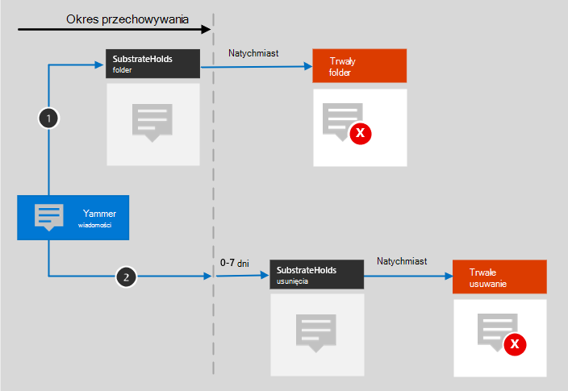

# Dowiedz się więcej na temat przechowywania Yammer

>*[Microsoft 365 wskazówki dotyczące licencjonowania dotyczące zgodności & zabezpieczeń](/office365/servicedescriptions/microsoft-365-service-descriptions/microsoft-365-tenantlevel-services-licensing-guidance/microsoft-365-security-compliance-licensing-guidance).*

[!include[Purview banner](../includes/purview-rebrand-banner.md)]

Informacje zawarte w tym artykule [uzupełniają informacje na temat przechowywania](retention.md), ponieważ zawierają informacje specyficzne dla Yammer.

W przypadku innych obciążeń zobacz:

- [Dowiedz się więcej na temat przechowywania SharePoint i OneDrive](retention-policies-sharepoint.md)
- [Dowiedz się więcej na temat przechowywania Microsoft Teams](retention-policies-teams.md)
- [Dowiedz się więcej na temat przechowywania Exchange](retention-policies-exchange.md)

## Co jest dołączone do przechowywania i usuwania

Yammer komunikaty użytkowników i komunikaty społeczności mogą być usuwane przy użyciu zasad przechowywania dla Yammer, a oprócz tekstu w tych wiadomościach następujące elementy mogą być przechowywane ze względów zgodności: linki hipertekstu i linki do innych komunikatów Yammer.

> [!NOTE]
> Jak wyjaśniono w poniższej sekcji, komunikaty użytkowników zawierają wiadomości prywatne dla poszczególnych użytkowników oraz wszelkie komunikaty społeczności skojarzone z tym użytkownikiem.

Komunikaty użytkowników zawierają wszystkie nazwy osób w konwersacji, a wiadomości społeczności zawierają nazwę społeczności i tytuł wiadomości (jeśli zostały podane).

Reakcje innych osób w postaci emotikonów nie są zachowywane podczas korzystania z zasad przechowywania dla Yammer.

Pliki używane z Yammer nie są uwzględniane w zasadach przechowywania dla Yammer. Te elementy mają własne zasady przechowywania.

## Jak przechowywanie działa z Yammer

Ta sekcja służy do zrozumienia, w jaki sposób wymagania dotyczące zgodności są spełniane przez magazyn zaplecza i procesy, i powinny być weryfikowane przez narzędzia zbierania elektronicznych materiałów dowodowych, a nie przez komunikaty, które są obecnie widoczne w aplikacji Yammer.

Zasady przechowywania umożliwiają przechowywanie danych z komunikatów społeczności i komunikatów użytkowników w Yammer i usuwanie tych komunikatów. W tle Exchange skrzynki pocztowe są używane do przechowywania danych skopiowanych z tych wiadomości. Dane z Yammer wiadomości użytkowników są przechowywane w ukrytym folderze w skrzynce pocztowej każdego użytkownika dołączonego do wiadomości użytkownika, a podobny ukryty folder w skrzynce pocztowej grupy jest używany dla wiadomości społeczności.

Kopie wiadomości społeczności mogą być również przechowywane w ukrytym folderze skrzynek pocztowych użytkownika, gdy @ wspomnieć użytkowników lub powiadomić użytkownika o odpowiedzi. Mimo że te komunikaty pochodzą z wiadomości społeczności, zasady przechowywania dla Yammer komunikatów użytkowników często zawierają kopie komunikatów społeczności. W związku z tym komunikaty użytkowników nie są ograniczone do wiadomości prywatnych.

Te ukryte foldery nie są przeznaczone do bezpośredniego dostępu do użytkowników lub administratorów, ale zamiast tego przechowują dane, które administratorzy zgodności mogą wyszukiwać za pomocą narzędzi zbierania elektronicznych materiałów dowodowych.

Mimo że są one przechowywane w Exchange, komunikaty Yammer są uwzględniane tylko w zasadach przechowywania skonfigurowanych dla **Yammer komunikatów społeczności** lub **Yammer lokalizacji komunikatów użytkowników**.

> [!NOTE]
> Jeśli użytkownik jest uwzględniony w aktywnych zasadach przechowywania, które przechowują dane Yammer i usuwasz skrzynkę pocztową użytkownika uwzględnionego w tych zasadach, aby zachować dane Yammer, skrzynka pocztowa zostanie przekonwertowana na [nieaktywną skrzynkę pocztową](inactive-mailboxes-in-office-365.md). Jeśli nie musisz zachowywać tych danych Yammer dla użytkownika, przed usunięciem skrzynki pocztowej wyklucz konto użytkownika z zasad przechowywania.

Po skonfigurowaniu zasad przechowywania dla komunikatów Yammer zadanie czasomierza z usługi Exchange okresowo ocenia elementy w ukrytym folderze, w którym są przechowywane te komunikaty Yammer. Uruchomienie zadania czasomierza trwa do siedmiu dni. Po wygaśnięciu okresu przechowywania tych elementów są one przenoszone do folderu SubstrateHolds — ukrytego folderu, który znajduje się w każdej skrzynce pocztowej użytkownika lub grupy w celu przechowywania elementów "nietrwale usuniętych", zanim zostaną trwale usunięte.

> [!IMPORTANT]
> Ze względu na [pierwszą zasadę przechowywania](retention.md#the-principles-of-retention-or-what-takes-precedence) i ponieważ Yammer wiadomości są przechowywane w Exchange Online skrzynkach pocztowych, trwałe usunięcie z folderu SubstrateHolds jest zawsze zawieszone, jeśli na skrzynkę pocztową mają wpływ inne zasady przechowywania Yammer dla tej samej lokalizacji, blokada postępowania sądowego, wstrzymanie opóźnienia lub jeśli do skrzynki pocztowej zastosowano blokadę zbierania elektronicznych materiałów dowodowych ze względów prawnych lub śledczych.
>
> Chociaż skrzynka pocztowa jest uwzględniona w odpowiednim blokadzie, Yammer wiadomości, które zostały usunięte, nie będą już widoczne w Yammer, ale będą nadal wykrywalne przy użyciu zbierania elektronicznych materiałów dowodowych.

Po skonfigurowaniu zasad przechowywania dla komunikatów Yammer ścieżki, które pobiera zawartość, zależą od tego, czy zasady przechowywania mają zostać zachowane, a następnie usunięte, tylko do zachowania lub usunięcia.

Gdy zasady przechowywania mają zostać zachowane, a następnie usunięte:

Dla dwóch ścieżek na diagramie:

1. **Jeśli komunikat Yammer jest edytowany lub usuwany** przez użytkownika w okresie przechowywania, oryginalny komunikat jest natychmiast kopiowany (jeśli jest edytowany) lub przenoszony (jeśli został usunięty) do folderu SubstrateHolds. Komunikat jest tam przechowywany do czasu wygaśnięcia okresu przechowywania, a następnie komunikat zostanie natychmiast trwale usunięty.

2. **Jeśli komunikat Yammer nie zostanie usunięty** i dla bieżących komunikatów po edycji komunikat zostanie przeniesiony do folderu SubstrateHolds po upływie okresu przechowywania. Ta akcja trwa do siedmiu dni od daty wygaśnięcia. Gdy komunikat znajduje się w folderze SubstrateHolds, zostanie on natychmiast trwale usunięty. 

> [!NOTE]
> Komunikaty w folderze SubstrateHolds można wyszukiwać za pomocą narzędzi zbierania elektronicznych materiałów dowodowych. Dopóki komunikaty nie zostaną trwale usunięte z folderu SubstrateHolds, nadal można je przeszukiwać za pomocą narzędzi zbierania elektronicznych materiałów dowodowych.

Gdy okres przechowywania wygaśnie i przeniesie komunikat do folderu SubstrateHolds, operacja usuwania jest przekazywana do usługi Yammer, która następnie przekazuje tę samą operację do Yammer aplikacji klienckiej. Opóźnienia w tej komunikacji lub buforowaniu mogą wyjaśnić, dlaczego przez krótki czas użytkownicy nadal widzą te komunikaty w swojej aplikacji Yammer.

W tym scenariuszu, w którym usługa Yammer otrzymuje polecenie delete z powodu zasad przechowywania, odpowiedni komunikat w aplikacji Yammer zostanie usunięty dla wszystkich użytkowników w konwersacji. Niektórzy z tych użytkowników mogą pochodzić z innej organizacji, mają zasady przechowywania z dłuższym okresem przechowywania lub nie są do nich przypisane żadne zasady przechowywania. W przypadku tych użytkowników kopie wiadomości są nadal przechowywane w ich skrzynkach pocztowych i pozostają możliwe do wyszukiwania pod kątem zbierania elektronicznych materiałów dowodowych, dopóki wiadomości nie zostaną trwale usunięte przez inne zasady przechowywania.

> [!IMPORTANT]
> Komunikaty widoczne w aplikacji Yammer nie są dokładnym odzwierciedleniem tego, czy są zachowywane, czy trwale usuwane w celu spełnienia wymagań dotyczących zgodności.

Jeśli zasady przechowywania są tylko do zachowania lub tylko do usuwania, ścieżki zawartości są odmianami zachowywania i usuwania.

### Ścieżki zawartości dla zasad przechowywania tylko do zachowania

1. **Jeśli komunikat Yammer zostanie edytowany lub usunięty**: kopia oryginalnej wiadomości zostanie natychmiast utworzona w folderze SubstrateHolds i zachowana do czasu wygaśnięcia okresu przechowywania. Następnie komunikat zostanie natychmiast trwale usunięty z folderu SubstrateHolds.

2. **Jeśli komunikat Yammer nie zostanie zmodyfikowany lub usunięty**, a dla bieżących komunikatów po edycji w okresie przechowywania: Nic się nie dzieje przed i po okresie przechowywania; komunikat pozostaje w oryginalnej lokalizacji.

### Ścieżki zawartości dla zasad przechowywania tylko do usuwania

1. **Jeśli komunikat Yammer nie zostanie usunięty** w okresie przechowywania: po zakończeniu okresu przechowywania komunikat zostanie przeniesiony do folderu SubstrateHolds. Ta akcja trwa do siedmiu dni od daty wygaśnięcia. Następnie komunikat zostanie natychmiast trwale usunięty z folderu SubstrateHolds.

2. **Jeśli komunikat Yammer zostanie usunięty przez użytkownika w** tym okresie, element zostanie natychmiast przeniesiony do folderu SubstrateHolds, w którym zostanie natychmiast trwale usunięty.

#### Przykładowe przepływy i chronometraż zasad przechowywania

Skorzystaj z poniższych przykładów, aby zobaczyć, jak procesy i chronometraż wyjaśnione w poprzednich sekcjach mają zastosowanie do zasad przechowywania, które mają następujące konfiguracje:

- [Przykład 1: Zachowaj tylko przez 7 lat](#example-1-retain-only-for-7-years)
- [Przykład 2: Zachowaj przez 30 dni, a następnie usuń](#example-2-retain-for-30-days-and-then-delete)
- [Przykład 3: Usuwanie tylko po 1 dniu](#example-3-delete-only-after-1-day)

Dla wszystkich przykładów, które odwołują się do trwałego usunięcia, ze względu na [zasady przechowywania](retention.md#the-principles-of-retention-or-what-takes-precedence), ta akcja jest zawieszona, jeśli komunikat podlega innym zasadom przechowywania w celu zachowania elementu lub podlega blokadzie zbierania elektronicznych materiałów dowodowych.

##### Przykład 1: Zachowaj tylko przez 7 lat

W dniu 1 użytkownik publikuje nową wiadomość Yammer.

W dniu 5 użytkownik edytuje ten komunikat.

W dniu 30 użytkownik usuwa bieżący komunikat.

Wyniki przechowywania:

- W przypadku oryginalnej wiadomości:
    - W dniu 5 komunikat jest kopiowany do folderu SubstrateHolds, w którym nadal można go przeszukiwać za pomocą narzędzi zbierania elektronicznych materiałów dowodowych przez co najmniej 7 lat od dnia 1 (okres przechowywania).

- Dla bieżącego (edytowanego) komunikatu:
    - W dniu 30 komunikat przechodzi do folderu SubstrateHolds, w którym nadal można go przeszukiwać za pomocą narzędzi zbierania elektronicznych materiałów dowodowych przez co najmniej 7 lat od dnia 1 (okres przechowywania).

Jeśli użytkownik usunął bieżący komunikat po określonym okresie przechowywania, zamiast w okresie przechowywania, komunikat nadal będzie przenoszony do folderu SubstrateHolds. Jednak teraz okres przechowywania wygasł, komunikat zostanie trwale usunięty po upływie co najmniej 1 dnia, a następnie zazwyczaj w ciągu 1–7 dni.

##### Przykład 2: Zachowaj przez 30 dni, a następnie usuń

W dniu 1 użytkownik publikuje nową wiadomość Yammer.

W dniu 10 użytkownik edytuje ten komunikat.

Użytkownik nie wprowadza dalszych zmian i nie usuwa komunikatu.

Wyniki przechowywania:

- W przypadku oryginalnej wiadomości:
    - W dniu 10 komunikat jest kopiowany do folderu SubstrateHolds, gdzie nadal można go przeszukiwać za pomocą narzędzi zbierania elektronicznych materiałów dowodowych.
    - Po zakończeniu okresu przechowywania (30 dni od dnia 1) komunikat jest trwale usuwany zazwyczaj w ciągu 1–7 dni od co najmniej 1 dnia, a następnie nie zostanie zwrócony z wyszukiwaniem zbierania elektronicznych materiałów dowodowych.

- Dla bieżącego (edytowanego) komunikatu:
    - Po zakończeniu okresu przechowywania (30 dni od dnia 1) komunikat przechodzi do folderu SubstrateHolds zazwyczaj w ciągu 1–7 dni, gdzie nadal można go przeszukiwać za pomocą narzędzi zbierania elektronicznych materiałów dowodowych.
    - Komunikat jest następnie trwale usuwany zwykle w ciągu 1–7 dni od co najmniej 1 dnia, a następnie nie będzie zwracany z wyszukiwaniem zbierania elektronicznych materiałów dowodowych.

##### Przykład 3: Usuwanie tylko po 1 dniu

> [!NOTE]
> Ze względu na krótki jednodniowy czas trwania tej konfiguracji i procesów przechowywania, które działają w okresie od 1 do 7 dni, w tej sekcji przedstawiono przykładowe chronometraży, które mieszczą się w typowych zakresach czasu.

W dniu 1 użytkownik publikuje nową wiadomość Yammer.

Przykładowy wynik przechowywania, jeśli użytkownik nie edytuje ani nie usunie komunikatu:

- Dzień 5 (zazwyczaj 1–7 dni po rozpoczęciu okresu przechowywania w dniu 2):
    - Komunikat jest przenoszony do folderu SubstrateHolds i pozostaje tam przez co najmniej 1 dzień, w którym nadal można go przeszukiwać za pomocą narzędzi zbierania elektronicznych materiałów dowodowych.

- Dzień 9 (zazwyczaj 1–7 dni po co najmniej 1 dniu w folderze SubstrateHolds):
    - Wiadomość zostanie trwale usunięta, a następnie nie zostanie zwrócona z wyszukiwaniem zbierania elektronicznych materiałów dowodowych.

Jak pokazano w tym przykładzie, mimo że można skonfigurować zasady przechowywania w celu usuwania komunikatów po zaledwie jednym dniu, usługa przechodzi wiele procesów w celu zapewnienia zgodnego usunięcia. W związku z tym akcja usuwania po upływie 1 dnia może potrwać 16 dni, zanim wiadomość zostanie trwale usunięta, aby nie była już zwracana w wyszukiwaniach zbierania elektronicznych materiałów dowodowych.

## Komunikaty i użytkownicy zewnętrzni

Domyślnie zasady przechowywania dla Yammer komunikatów użytkowników mają zastosowanie do wszystkich użytkowników w organizacji, ale nie do użytkowników zewnętrznych. Zasady przechowywania można zastosować do użytkowników zewnętrznych, jeśli używasz opcji **Edytuj** dla dołączonych użytkowników i określasz ich konto.

Obecnie użytkownicy-goście usługi Azure B2B nie są obsługiwana.

## Gdy użytkownik opuszcza organizację 

Jeśli użytkownik opuści organizację, a jego konto Microsoft 365 zostanie usunięte, jego Yammer wiadomości użytkowników, które podlegają przechowywaniu, są przechowywane w nieaktywnej skrzynce pocztowej. Te wiadomości pozostają objęte wszelkimi zasadami przechowywania, które zostały umieszczone na użytkowniku, zanim jego skrzynka pocztowa została nieaktywna, a zawartość jest dostępna dla wyszukiwania zbierania elektronicznych materiałów dowodowych. Aby uzyskać więcej informacji, zobacz [Dowiedz się więcej o nieaktywnych skrzynkach pocztowych](inactive-mailboxes-in-office-365.md).

Jeśli użytkownik przechowywał pliki w Yammer, zobacz [równoważną sekcję](retention-policies-sharepoint.md#when-a-user-leaves-the-organization) SharePoint i OneDrive.

## Ograniczenia

Należy pamiętać o następującym ograniczeniu, jeśli używasz przechowywania do Yammer komunikatów społeczności i komunikatów użytkowników:

- Po wybraniu pozycji **Edytuj** dla **Yammer lokalizacji wiadomości użytkowników** mogą być widoczni goście i użytkownicy bez skrzynki pocztowej. Zasady przechowywania nie są przeznaczone dla tych użytkowników, więc nie wybieraj ich.

## Wskazówki dotyczące konfiguracji

Jeśli dopiero zaczynasz konfigurować przechowywanie w Microsoft 365, zobacz [Wprowadzenie z zarządzaniem cyklem życia danych](get-started-with-data-lifecycle-management.md).

Jeśli wszystko jest gotowe do skonfigurowania zasad przechowywania dla Yammer, zobacz [Tworzenie i konfigurowanie zasad przechowywania](create-retention-policies.md).
