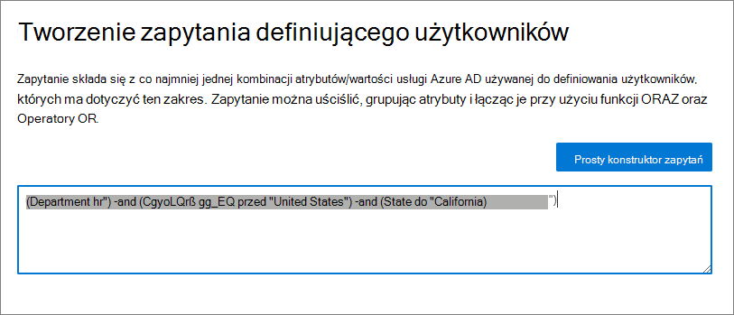
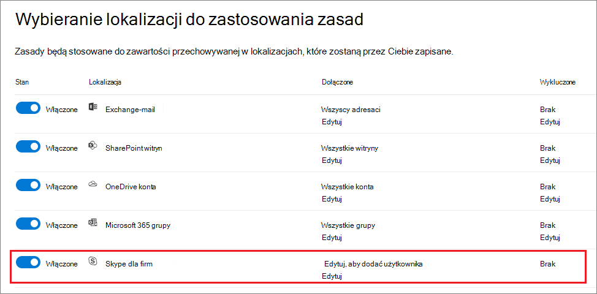

# <a name="common-settings-for-retention-policies-and-retention-label-policies"></a>Typowe ustawienia zasad przechowywania i zasad etykiet przechowywania

[!include[Purview banner](../includes/purview-rebrand-banner.md)]

>*[Microsoft 365 wskazówki dotyczące licencjonowania dotyczące zgodności & zabezpieczeń](https://aka.ms/ComplianceSD).*

Wiele ustawień przechowywania jest typowych zarówno dla zasad przechowywania, jak i zasad etykiet przechowywania. Poniższe informacje ułatwiają skonfigurowanie tych ustawień w celu proaktywnego przechowywania zawartości, usuwania zawartości lub obu tych ustawień — zachowywania i usuwania zawartości.

Aby zapoznać się ze scenariuszami, które obsługują te zasady przechowywania, zobacz:

- [Tworzenie i konfigurowanie zasad przechowywania](create-retention-policies.md).
- [Publikowanie etykiet przechowywania i stosowanie ich w aplikacjach](create-apply-retention-labels.md)
- [Automatyczne stosowanie etykiety przechowywania do zawartości](apply-retention-labels-automatically.md)

Ustawienia specyficzne dla każdego scenariusza zostały wyjaśnione w odpowiedniej dokumentacji.

Aby uzyskać omówienie informacji o zasadach przechowywania i sposobie działania przechowywania w Microsoft 365, zobacz [Informacje o zasadach przechowywania i etykietach przechowywania](retention.md).

## <a name="scopes---adaptive-and-static"></a>Zakresy — adaptacyjne i statyczne

Jeśli nie znasz zakresów adaptacyjnych i statycznych oraz chcesz wybrać, którego z nich należy użyć podczas konfigurowania zasad przechowywania, zobacz [Adaptacyjne lub statyczne zakresy zasad przechowywania](retention.md#adaptive-or-static-policy-scopes-for-retention). 

Gdy zdecydujesz, czy chcesz korzystać z zakresu adaptacyjnego, czy statycznego, skorzystaj z następujących informacji, które pomogą Ci go skonfigurować:
- [Informacje o konfiguracji zakresów adaptacyjnych](#configuration-information-for-adaptive-scopes)
- [Informacje o konfiguracji zakresów statycznych](#configuration-information-for-static-scopes)

> [!TIP]
> Jeśli masz zasady korzystające z zakresów statycznych i chcesz je przekonwertować na zakresy adaptacyjne, pozostaw istniejące zasady w miejscu podczas tworzenia nowych zasad korzystających z zakresów adaptacyjnych z tymi samymi ustawieniami przechowywania. Sprawdź, czy te nowe zasady są przeznaczone dla prawidłowych użytkowników, witryn i grup przed wyłączeniem lub usunięciem starych zasad z zakresami statycznymi.

### <a name="configuration-information-for-adaptive-scopes"></a>Informacje o konfiguracji zakresów adaptacyjnych

Po wybraniu zakresów adaptacyjnych zostanie wyświetlony monit o wybranie żądanego typu zakresu adaptacyjnego. Istnieją trzy różne typy zakresów adaptacyjnych, a każdy z nich obsługuje różne atrybuty lub właściwości:

| Typ zakresu adaptacyjnego | Obsługiwane atrybuty lub właściwości obejmują |
|:-----|:-----|
|**Użytkownicy** — dotyczy:  <br/> - Exchange e-mail <br/> — konta OneDrive <br/> - czaty Teams <br/> - Teams wiadomości z kanału prywatnego <br/> — Yammer komunikaty użytkowników| Imię <br/> Nazwisko <br/>Nazwa wyświetlana <br/> Stanowisko <br/> Department <br/> Pakiet Office <br/>Ulica <br/> Miasto <br/>Stan lub prowincja <br/>Kod pocztowy <br/> Kraj lub region <br/> Adresy e-mail <br/> Alias <br/> Exchange atrybutów niestandardowych: CustomAttribute1 — CustomAttribute15|
|**SharePoint witryn** — dotyczy:  <br/> - witryny SharePoint <br/> — konta OneDrive |Adres URL witryny <br/>Nazwa witryny <br/> SharePoint właściwości niestandardowe: RefinableString00 — RefinableString99 |
|**Grupy Microsoft 365** — dotyczy:  <br/> - Grupy Microsoft 365 <br/> — Teams komunikatów kanałów (standardowych i udostępnionych) <br/> - Yammer komunikaty społeczności |Name (Nazwa) <br/> Nazwa wyświetlana <br/> Opis <br/> Adresy e-mail <br/> Alias <br/> Exchange atrybutów niestandardowych: CustomAttribute1 — CustomAttribute15 |

Nazwy właściwości lokacji są oparte na właściwościach zarządzanych SharePoint lokacji. Aby uzyskać informacje na temat atrybutów niestandardowych, zobacz [Używanie właściwości witryny SharePoint niestandardowych do stosowania Microsoft 365 przechowywania przy użyciu zakresów zasad adaptacyjnych](https://techcommunity.microsoft.com/t5/security-compliance-and-identity/using-custom-sharepoint-site-properties-to-apply-microsoft-365/ba-p/3133970).

Nazwy atrybutów dla użytkowników i grup są oparte na [filtrowalnych właściwościach adresatów mapujących](/powershell/exchange/recipientfilter-properties#filterable-recipient-properties) atrybuty Azure AD. Przykład:

- **Alias** mapuje na adres LDAP **mailNickname**, który jest wyświetlany jako **Adres e-mail** w centrum administracyjnym Azure AD.
- **Adresy e-mail** są mapowe na **serwer proxy nazwy LDAPAddresses**, który jest wyświetlany jako **adres proxy** w centrum administracyjnym Azure AD.

Atrybuty i właściwości wymienione w tabeli można łatwo określić podczas konfigurowania zakresu adaptacyjnego przy użyciu prostego konstruktora zapytań. Dodatkowe atrybuty i właściwości są obsługiwane przez zaawansowanego konstruktora zapytań, zgodnie z opisem w poniższej sekcji.

> [!TIP]
> Aby uzyskać więcej informacji na temat korzystania z zaawansowanego konstruktora zapytań, zobacz następujące seminaria internetowe: 
> - [Tworzenie zaawansowanych zapytań dla użytkowników i grup przy użyciu zakresów zasad adaptacyjnych](https://mipc.eventbuilder.com/event/52683/occurrence/49452/recording?rauth=853.3181650.1f2b6e8b4a05b4441f19b890dfeadcec24c4325e90ac492b7a58eb3045c546ea)
> - [Tworzenie zaawansowanych zapytań dla witryn SharePoint z zakresami zasad adaptacyjnych](https://aka.ms/AdaptivePolicyScopes-AdvancedSharePoint)

Pojedyncze zasady przechowywania mogą mieć co najmniej jeden zakres adaptacyjny.

#### <a name="to-configure-an-adaptive-scope"></a>Aby skonfigurować zakres adaptacyjny

Przed skonfigurowaniem zakresu adaptacyjnego użyj poprzedniej sekcji, aby zidentyfikować typ zakresu do utworzenia oraz jakie atrybuty i wartości będą używane. Aby potwierdzić te informacje, może być konieczna współpraca z innymi administratorami. 

W przypadku SharePoint lokacji może być wymagana dodatkowa konfiguracja SharePoint, jeśli planujesz używać [niestandardowych właściwości lokacji](https://techcommunity.microsoft.com/t5/security-compliance-and-identity/using-custom-sharepoint-site-properties-to-apply-microsoft-365/ba-p/3133970).

1. W [portalu zgodności usługi Microsoft Purview](https://compliance.microsoft.com/) przejdź do jednej z następujących lokalizacji:
    
    - Jeśli używasz rozwiązania do zarządzania rekordami:
        - **Rozwiązania** >  **Zarządzanie rekordami** >  **Karta Zakresy adaptacyjne** > + **Tworzenie zakresu**
        
    - Jeśli używasz rozwiązania do zarządzania cyklem życia danych:
       - **Rozwiązania** >  **Zarządzanie cyklem** >  życia danych **Karta Zakresy adaptacyjne** > + **Tworzenie zakresu**
    
    Nie widzisz rozwiązania od razu w okienku nawigacji? Najpierw wybierz pozycję **Pokaż wszystko**. 

2. Postępuj zgodnie z monitami w konfiguracji, aby najpierw wybrać typ zakresu, a następnie wybierz atrybuty lub właściwości, których chcesz użyć do skompilowania członkostwa dynamicznego, i wpisz atrybut lub wartości właściwości.
    
    Na przykład, aby skonfigurować zakres adaptacyjny, który będzie używany do identyfikowania użytkowników w Europie, najpierw wybierz pozycję **Użytkownicy** jako typ zakresu, a następnie wybierz atrybut **Country lub region** i wpisz w **Europie**:
    
    
    
    Raz dziennie to zapytanie będzie uruchamiane względem Azure AD i zidentyfikuje wszystkich użytkowników, dla których określono wartość **Europa** na koncie atrybutu **Kraj lub region**.
    
    > [!IMPORTANT]
    > Ponieważ zapytanie nie jest uruchamiane natychmiast, nie ma walidacji, która została wpisana poprawnie w wartości.
    
    Wybierz pozycję **Dodaj atrybut** (dla użytkowników i grup) lub **Dodaj właściwość** (dla lokacji), aby użyć dowolnej kombinacji atrybutów lub właściwości obsługiwanych dla ich typu zakresu wraz z operatorami logicznymi do tworzenia zapytań. Obsługiwane operatory są **równe**, **nie są równe**, **zaczynają się od** i **nie zaczynają się od** i można grupować wybrane atrybuty lub właściwości. Przykład:
    
    
    
    Alternatywnie możesz wybrać pozycję **Zaawansowany konstruktor zapytań** , aby określić własne zapytania:
    
    - W przypadku zakresów **Użytkownik** i **grupa Microsoft 365** użyj [składni filtrowania OPATH](/powershell/exchange/recipient-filters). Aby na przykład utworzyć zakres użytkownika definiujący jego członkostwo według działu, kraju i stanu:
    
        
        
        Jedną z zalet korzystania z zaawansowanego konstruktora zapytań dla tych zakresów jest szerszy wybór operatorów zapytań:
        - **i**
        - **Lub**
        - **Nie**
        - **eq** (równa się)
        - **ne** (nie równa się)
        - **lt** (mniej niż)
        - **gt** (większe niż)
        - **like** (porównanie ciągów)
        - **notlike** (porównanie ciągów)
    
    - W **przypadku SharePoint** zakresów witryn użyj języka zapytań słów kluczowych (KQL). Możesz już znać używanie KQL do wyszukiwania SharePoint przy użyciu indeksowanych właściwości witryny. Aby ułatwić określenie tych KQL zapytań, zobacz [Dokumentacja składni języka zapytań słów kluczowych (KQL).](/sharepoint/dev/general-development/keyword-query-language-kql-syntax-reference)
        
        Na przykład, ponieważ zakresy witryn SharePoint automatycznie obejmują wszystkie SharePoint typy lokacji, które obejmują Microsoft 365 połączone z grupą i OneDrive lokacje, można użyć indeksowanych właściwości lokacji **SiteTemplate** w celu uwzględnienia lub wykluczenia określonych typów lokacji. Szablony, które można określić:
        - `SITEPAGEPUBLISHING` dla nowoczesnych witryn komunikacyjnych
        - `GROUP`dla Microsoft 365 witryn połączonych z grupą
        - `TEAMCHANNEL`dla Microsoft Teams witryn kanałów prywatnych
        - `STS`dla klasycznej witryny zespołu SharePoint
        - `SPSPERS`dla witryn OneDrive
        
        Aby utworzyć zakres adaptacyjny obejmujący tylko nowoczesne witryny komunikacyjne i wykluczający Microsoft 365 witryn połączonych z goupami i OneDrive, określ następujące zapytanie KQL:
        ````console
        SiteTemplate=SITEPAGEPUBLISHING
        ````
    
    Te [zaawansowane zapytania można zweryfikować](#validating-advanced-queries) niezależnie od konfiguracji zakresu.
    
    > [!TIP]
    > Jeśli chcesz wykluczyć nieaktywne skrzynki pocztowe, musisz użyć zaawansowanego konstruktora zapytań. Lub odwrotnie, docelowe tylko nieaktywne skrzynki pocztowe. W tej konfiguracji użyj właściwości OPATH *IsInactiveMailbox*:
    > 
    > - Aby wykluczyć nieaktywne skrzynki pocztowe, upewnij się, że zapytanie zawiera: `(IsInactiveMailbox -eq "False")`
    > - Aby kierować tylko nieaktywne skrzynki pocztowe, określ: `(IsInactiveMailbox -eq "True")`

3. Utwórz dowolną liczbę zakresów adaptacyjnych. Podczas tworzenia zasad przechowywania można wybrać co najmniej jeden zakres adaptacyjny.

> [!NOTE]
> Pełne wypełnienie zapytań może potrwać do pięciu dni, a zmiany nie będą natychmiastowe. Uwzględnij to opóźnienie, czekając kilka dni przed dodaniem nowo utworzonego zakresu do zasad przechowywania.

Aby potwierdzić bieżące zmiany członkostwa i członkostwa dla zakresu adaptacyjnego:

1. Kliknij dwukrotnie (lub wybierz i naciśnij klawisz Enter) zakres na stronie **Zakresy adaptacyjne**

2. W okienku **Szczegóły** wysuwanego wybierz pozycję **Szczegóły zakresu**. 
    
    Przejrzyj informacje identyfikujące wszystkich użytkowników, witryny lub grupy znajdujące się obecnie w tym zakresie, jeśli zostały one automatycznie dodane lub usunięte, oraz datę i godzinę zmiany członkostwa.

> [!TIP]
> Użyj opcji [wyszukiwania zasad](retention.md#policy-lookup), aby ułatwić identyfikację zasad, które są obecnie przypisane do określonych użytkowników, witryn i grup Microsoft 365.

#### <a name="validating-advanced-queries"></a>Weryfikowanie zaawansowanych zapytań

Zaawansowane zapytania można ręcznie weryfikować przy użyciu programu PowerShell i wyszukiwania SharePoint:
- Użyj programu PowerShell dla typów zakresów **Użytkownicy** i **Grupy Microsoft 365**
- Użyj SharePoint wyszukiwania typu zakresu **SharePoint witryn**

Aby uruchomić zapytanie przy użyciu programu PowerShell:

1. [Połączenie Exchange Online programu PowerShell](/powershell/exchange/connect-to-exchange-online-powershell) przy użyciu konta z [odpowiednimi uprawnieniami administratora Exchange Online](/powershell/exchange/find-exchange-cmdlet-permissions#use-powershell-to-find-the-permissions-required-to-run-a-cmdlet).

2. Użyj polecenia [Get-Recipient](/powershell/module/exchange/get-recipient), [Get-Mailbox](/powershell/module/exchange/get-mailbox) lub [Get-User](/powershell/module/exchange/get-user) z parametrem *-Filter* i [zapytaniem OPATH](/powershell/exchange/filter-properties) dla zakresu adaptacyjnego ujętego w nawiasy klamrowe (`{`,`}`). Jeśli wartości atrybutów są ciągami, umieść te wartości w cudzysłowie podwójnym lub pojedynczym.

    Możesz określić, czy do weryfikacji ma być używana funkcja Get-Mailbox, Get-Recipient, czy Get-User, identyfikując, które polecenie cmdlet jest obsługiwane przez [właściwość OPATH](/powershell/exchange/filter-properties) wybraną dla zapytania.

    > [!IMPORTANT]
    > Get-Mailbox nie obsługuje typu adresata *usługi MailUser* , dlatego Get-Recipient lub Get-User muszą być używane do weryfikowania zapytań obejmujących lokalne skrzynki pocztowe w środowisku hybrydowym.

    Aby zweryfikować zakres **użytkownika** , użyj odpowiedniego polecenia:
    - `Get-Mailbox` with *-RecipientTypeDetails UserMailbox,SharedMailbox,RoomMailbox,EquipmentMailbox*
    - `Get-Recipient` with *-RecipientTypeDetails UserMailbox,MailUser,SharedMailbox,RoomMailbox,EquipmentMailbox*
    
    Aby zweryfikować zakres **grupy Microsoft 365**, użyj:
    - `Get-Mailbox` z *-GroupMailbox* lub `Get-Recipient` *-RecipientTypeDetails GroupMailbox*

    Aby na przykład zweryfikować zakres **użytkownika** , można użyć następujących elementów:
    
    ````PowerShell
    Get-Recipient -RecipientTypeDetails UserMailbox,MailUser -Filter {Department -eq "Marketing"} -ResultSize Unlimited
    ````
    
    Aby zweryfikować zakres **grupy Microsoft 365**, można użyć:
    
    ```PowerShell
    Get-Mailbox -RecipientTypeDetails GroupMailbox -Filter {CustomAttribute15 -eq "Marketing"} -ResultSize Unlimited
    ```
    
    > [!TIP]
    > Jeśli używasz tych poleceń do weryfikowania zakresu użytkownika, jeśli liczba zwróconych adresatów jest wyższa niż oczekiwano, może to być spowodowane tym, że obejmuje użytkowników, którzy nie mają ważnej licencji na zakresy adaptacyjne. Ci użytkownicy nie będą mieć zastosowanych ustawień przechowywania.
    > 
    > Na przykład w środowisku hybrydowym możesz mieć nielicencjonowane zsynchronizowane konta użytkowników bez Exchange skrzynki pocztowej lokalnie lub w Exchange Online. Tych użytkowników można zidentyfikować, uruchamiając następujące polecenie: `Get-User -RecipientTypeDetails User`

3. Sprawdź, czy dane wyjściowe są zgodne z oczekiwanymi użytkownikami lub grupami dla zakresu adaptacyjnego. Jeśli tak się nie stanie, sprawdź zapytanie i wartości u odpowiedniego administratora pod kątem Azure AD lub Exchange.
 
Aby uruchomić zapytanie przy użyciu wyszukiwania SharePoint:

1. Korzystając z konta administratora globalnego lub konta z rolą administratora SharePoint, przejdź do strony `https://<your_tenant>.sharepoint.com/search`.

2. Użyj paska wyszukiwania, aby określić zapytanie KQL.

3. Sprawdź, czy wyniki wyszukiwania są zgodne z oczekiwanymi adresami URL witryny dla zakresu adaptacyjnego. Jeśli tego nie zrobią, sprawdź zapytanie i adresy URL u odpowiedniego administratora, aby uzyskać SharePoint.

### <a name="configuration-information-for-static-scopes"></a>Informacje o konfiguracji zakresów statycznych

Jeśli zdecydujesz się na użycie zakresów statycznych, musisz zdecydować, czy zastosować zasady do wszystkich wystąpień dla wybranej lokalizacji (całej lokalizacji), czy uwzględnić lub wykluczyć określone wystąpienia (określone dołączenia lub wykluczenia).

#### <a name="a-policy-that-applies-to-entire-locations"></a>Zasady, które mają zastosowanie do całych lokalizacji

Z wyjątkiem Skype dla firm domyślne jest to, że wszystkie wystąpienia dla wybranych lokalizacji są automatycznie uwzględniane w zasadach bez konieczności określania ich jako dołączonych.

Na przykład **Wszyscy adresaci** Exchange lokalizacji **poczty e-mail**. W przypadku tego ustawienia domyślnego wszystkie istniejące skrzynki pocztowe użytkowników zostaną uwzględnione w zasadach, a wszystkie nowe skrzynki pocztowe utworzone po zastosowaniu zasad zostaną automatycznie dziedziczone.

#### <a name="a-policy-with-specific-inclusions-or-exclusions"></a>Zasady z określonymi dołączeniami lub wykluczeniami

Należy pamiętać, że jeśli używasz opcjonalnej konfiguracji do określania zakresu ustawień przechowywania dla określonych użytkowników, określonych grup Microsoft 365 lub określonych witryn, istnieją pewne limity dla poszczególnych zasad, o których należy pamiętać. Aby uzyskać więcej informacji, zobacz [Limity zasad przechowywania i zasad etykiet przechowywania](retention-limits.md). 

Aby użyć opcjonalnej konfiguracji do określania zakresu ustawień przechowywania, upewnij się, że **stan** tej lokalizacji to **Włączone**, a następnie użyj linków, aby dołączyć lub wykluczyć określonych użytkowników, Microsoft 365 grupy lub witryny.

> [!WARNING]
> Jeśli skonfigurujesz wystąpienia do uwzględnienia, a następnie usuniesz ostatnie, konfiguracja powróci do pozycji **Wszystkie** dla lokalizacji.  Przed zapisaniem zasad upewnij się, że jest to konfiguracja, którą zamierzasz zapisać.
>
> Jeśli na przykład określisz jedną SharePoint lokację do uwzględnienia w zasadach przechowywania skonfigurowanych do usuwania danych, a następnie usuniesz pojedynczą lokację, domyślnie wszystkie SharePoint lokacje będą podlegać zasadom przechowywania, które trwale usuwają dane. Dotyczy to również adresatów Exchange, kont OneDrive, Teams użytkowników czatu itd.
>
> W tym scenariuszu wyłącz lokalizację, jeśli nie chcesz, aby ustawienie **Wszystkie** dla lokalizacji podlegało zasadom przechowywania. Alternatywnie określ wykluczanie wystąpień, które mają być wykluczone z zasad.

## <a name="locations"></a>Lokalizacje

Lokalizacje w zasadach przechowywania identyfikują określone usługi Microsoft 365 obsługujące ustawienia przechowywania, takie jak Exchange poczty e-mail i witryn SharePoint. Poniższa sekcja zawiera informacje o lokalizacjach ze szczegółami konfiguracji i możliwymi wyjątkami, o których należy pamiętać po wybraniu ich dla zasad.

### <a name="configuration-information-for-exchange-email-and-exchange-public-folders"></a>Informacje o konfiguracji Exchange wiadomości e-mail i Exchange folderów publicznych

Zarówno lokalizacja **Exchange poczty e-mail**, jak i **lokalizacja folderów publicznych Exchange** wymagają, aby skrzynki pocztowe miały co najmniej 10 MB danych, zanim zostaną zastosowane ustawienia przechowywania.

Lokalizacja **Exchange poczty e-mail** obsługuje przechowywanie poczty e-mail, kalendarza i innych elementów skrzynki pocztowej przez zastosowanie ustawień przechowywania na poziomie skrzynki pocztowej. Obsługiwane są również udostępnione skrzynki pocztowe i skrzynki pocztowe zasobów dla sprzętu i pomieszczeń.

Kontakty e-mail i skrzynki pocztowe grup Microsoft 365 nie są obsługiwane w przypadku Exchange wiadomości e-mail. W przypadku skrzynek pocztowych Microsoft 365 grup wybierz zamiast tego **lokalizację Grupy Microsoft 365**. Chociaż lokalizacja Exchange początkowo zezwala na wybór skrzynki pocztowej grupy dla zakresu statycznego, podczas próby zapisania zasad przechowywania występuje błąd, że "RemoteGroupMailbox" nie jest prawidłowym wyborem dla tej lokalizacji.

W zależności od konfiguracji zasad [nieaktywne skrzynki pocztowe](inactive-mailboxes-in-office-365.md) mogą być dołączone lub nie:

- Zakresy zasad statycznych obejmują nieaktywne skrzynki pocztowe w przypadku korzystania z domyślnej konfiguracji **Wszyscy adresaci** , ale nie są obsługiwane w [przypadku określonych wklęsłych lub wykluczeń](#a-policy-with-specific-inclusions-or-exclusions). Jeśli jednak uwzględnisz lub wykluczysz adresata, który ma aktywną skrzynkę pocztową w momencie zastosowania zasad, a skrzynka pocztowa później stanie się nieaktywna, ustawienia przechowywania będą nadal stosowane lub wykluczane.

- Domyślnie zakresy zasad adaptacyjnych obejmują nieaktywne skrzynki pocztowe, gdy spełniają zapytanie zakresu. Można je wykluczyć za pomocą zaawansowanego konstruktora zapytań i właściwości OPATH *IsInactiveMailbox*:
    
    ```console
    (IsInactiveMailbox -eq "False")
    ```

Jeśli używasz zakresu zasad statycznych i wybierasz adresatów do uwzględnienia lub wykluczenia, możesz wybrać grupy dystrybucyjne i grupy zabezpieczeń z obsługą poczty e-mail jako efektywny sposób wybierania wielu adresatów zamiast wybierać ich jeden po drugim. W przypadku korzystania z tej opcji w tle te grupy są automatycznie rozwijane w czasie konfiguracji, aby wybrać skrzynki pocztowe użytkowników w grupie. Jeśli członkostwo w tych grupach zmieni się później, istniejące zasady przechowywania nie zostaną automatycznie zaktualizowane, w przeciwieństwie do zakresów zasad adaptacyjnych.

Aby uzyskać szczegółowe informacje o tym, które elementy skrzynki pocztowej są uwzględniane i wykluczane podczas konfigurowania ustawień przechowywania dla Exchange, zobacz [Co zawiera przechowywanie i usuwanie](retention-policies-exchange.md#whats-included-for-retention-and-deletion).

Lokalizacja **folderów publicznych Exchange** stosuje ustawienia przechowywania do wszystkich folderów publicznych i nie może być stosowana na poziomie folderu lub skrzynki pocztowej.

#### <a name="exceptions-for-auto-apply-policies-configured-for-sensitive-information-types"></a>Wyjątki dla zasad automatycznego stosowania skonfigurowanych dla typów informacji poufnych

Po skonfigurowaniu zasad automatycznego stosowania korzystających z typów informacji poufnych i wybraniu **Exchange lokalizacji poczty e-mail**:

- Microsoft 365 są uwzględniane skrzynki pocztowe grupy.

- Wszystkie skrzynki pocztowe są automatycznie dołączane, nawet jeśli skonfigurowano zakres adaptacyjny do identyfikowania określonych skrzynek pocztowych. Jeśli wybrano zakres zasad statycznych, nie będzie można określić adresatów do uwzględnienia lub wykluczenia.

### <a name="configuration-information-for-sharepoint-sites-and-onedrive-accounts"></a>Informacje o konfiguracji dla witryn SharePoint i kont OneDrive

Po wybraniu lokalizacji **lokacji SharePoint** zasady przechowywania mogą przechowywać i usuwać dokumenty w witrynach komunikacji SharePoint, witrynach zespołu, które nie są połączone przez grupy Microsoft 365 i lokacje klasyczne. Jeśli nie używasz [zakresów zasad adaptacyjnych, witryny zespołu](#exceptions-for-adaptive-policy-scopes) połączone przez grupy Microsoft 365 nie są obsługiwane za pomocą tej opcji, a zamiast tego użyj lokalizacji **Grupy Microsoft 365**, która ma zastosowanie do zawartości w skrzynce pocztowej, witrynie i plikach grupy.

> [!TIP]
> Aby potwierdzić, czy lokacja jest połączona z grupą, możesz użyć [filtru w centrum administracyjnym SharePoint](/sharepoint/customize-admin-center-site-list) lub [SharePoint programu PowerShell](/powershell/module/sharepoint-online/get-sposite#example-10). W przypadku zakresów statycznych te witryny są obsługiwane w **Grupy Microsoft 365** lokalizacji.

Aby uzyskać szczegółowe informacje na temat elementów uwzględnionych i wykluczonych podczas konfigurowania ustawień przechowywania dla SharePoint i OneDrive, zobacz [Co jest dołączone do przechowywania i usuwania](retention-policies-sharepoint.md#whats-included-for-retention-and-deletion).

Po określeniu lokalizacji dla SharePoint witryn lub kont OneDrive nie potrzebujesz uprawnień dostępu do witryn. W przypadku zakresów statycznych w momencie określania adresu URL na stronie **Edytowanie lokalizacji** nie jest wykonywana żadna weryfikacja. Jednak SharePoint lokacje, które określisz, są sprawdzane, czy istnieją na ostatniej stronie konfiguracji. Jeśli to sprawdzanie zakończy się niepowodzeniem, zostanie wyświetlony komunikat, że weryfikacja adresu URL nie powiodła się, a zasady przechowywania nie mogą zostać utworzone, dopóki sprawdzanie poprawności nie zostanie zakończone pomyślnie. Jeśli zostanie wyświetlony ten komunikat, wróć do procesu konfiguracji, aby zmienić adres URL lub usunąć witrynę z zasad przechowywania.

Aby określić poszczególne konta OneDrive, zobacz [Pobieranie listy wszystkich adresów URL OneDrive użytkowników w organizacji](/onedrive/list-onedrive-urls).

> [!NOTE]
> Po określeniu indywidualnych kont OneDrive należy pamiętać, że jeśli konta OneDrive nie zostaną [wstępnie aprowizowane](/onedrive/pre-provision-accounts), adres URL nie zostanie utworzony, dopóki użytkownik nie otrzyma pierwszego dostępu do OneDrive.
>
> Ponadto adres URL OneDrive zostanie [automatycznie zmieniony](/onedrive/upn-changes) w przypadku zmiany nazwy UPN użytkownika. Na przykład zdarzenie zmieniające nazwę, takie jak małżeństwo, lub zmiana nazwy domeny w celu obsługi zmiany nazwy organizacji lub restrukturyzacji firmy. W przypadku zmiany nazwy UPN należy zaktualizować adresy URL OneDrive określone dla ustawień przechowywania.
>
> Ze względu na wyzwania związane z niezawodnym określaniem adresów URL dla poszczególnych użytkowników, które mają być uwzględniane lub wykluczane dla zakresów statycznych, [zakresy adaptacyjne](retention.md#adaptive-or-static-policy-scopes-for-retention) z typem **zakresu użytkownika** są lepiej dostosowane do tego celu.

#### <a name="exceptions-for-adaptive-policy-scopes"></a>Wyjątki dla zakresów zasad adaptacyjnych

Po skonfigurowaniu zasad przechowywania korzystających z zakresów zasad adaptacyjnych i wybraniu lokalizacji **SharePoint lokacji**:

- OneDrive lokacje i witryny połączone z grupami Microsoft 365 są dołączone do witryn komunikacji SharePoint, witryn zespołów, które nie są połączone przez grupy Microsoft 365 i witryn klasycznych.

### <a name="configuration-information-for-microsoft-365-groups"></a>Informacje o konfiguracji Grupy Microsoft 365

Aby zachować lub usunąć zawartość grupy Microsoft 365 (dawniej Office 365), użyj lokalizacji **Grupy Microsoft 365**. W przypadku zasad przechowywania ta lokalizacja obejmuje skrzynkę pocztową grupy i witrynę SharePoint teams. W przypadku etykiet przechowywania ta lokalizacja obejmuje tylko witrynę SharePoint teams.

Skrzynki pocztowe przeznaczone dla tej lokalizacji zasad wymagają co najmniej 10 MB danych, zanim zostaną zastosowane do nich ustawienia przechowywania.

> [!NOTE]
> Mimo że grupa Microsoft 365 ma Exchange skrzynkę pocztową, zasady przechowywania **dla lokalizacji Exchange wiadomości e-mail** nie będą zawierać zawartości w skrzynkach pocztowych Microsoft 365 grup.

Jeśli używasz zakresów statycznych: chociaż **lokalizacja Exchange poczty e-mail** dla zakresu statycznego początkowo umożliwia określenie skrzynki pocztowej grupy, która ma zostać uwzględniona lub wykluczona, podczas próby zapisania zasad przechowywania zostanie wyświetlony błąd informujący, że opcja "RemoteGroupMailbox" nie jest prawidłowym wyborem dla lokalizacji Exchange.

Domyślnie zasady przechowywania stosowane do grupy Microsoft 365 obejmują skrzynkę pocztową grupy i witrynę SharePoint teams. Pliki przechowywane w witrynie zespołów SharePoint są objęte tą lokalizacją, ale nie Teams czatów ani Teams komunikatów kanału, które mają własne lokalizacje zasad przechowywania.

Aby zmienić ustawienie domyślne, ponieważ zasady przechowywania mają być stosowane tylko do skrzynek pocztowych Microsoft 365 lub tylko do połączonych witryn SharePoint teams, użyj polecenia cmdlet [Set-RetentionCompliancePolicy](/powershell/module/exchange/set-retentioncompliancepolicy) programu PowerShell i parametru *Aplikacje* z jedną z następujących wartości:

- `Group:Exchange`tylko dla Microsoft 365 skrzynek pocztowych połączonych z grupą.
- `Group:SharePoint`tylko dla SharePoint witryn połączonych z grupą.

Aby powrócić do wartości domyślnej zarówno skrzynki pocztowej, jak i witryny SharePoint dla wybranych grup Microsoft 365, określ `Group:Exchange,SharePoint`wartość .

#### <a name="exceptions-for-auto-apply-policies-configured-for-sensitive-information-types"></a>Wyjątki dla zasad automatycznego stosowania skonfigurowanych dla typów informacji poufnych

Podczas konfigurowania zasad automatycznego stosowania korzystających z typów informacji poufnych i wybrania lokalizacji **Grupy Microsoft 365**:

- Microsoft 365 skrzynki pocztowe grup nie są uwzględniane. Aby uwzględnić te skrzynki pocztowe w zasadach, wybierz **Exchange lokalizacji poczty e-mail**.

#### <a name="what-happens-if-a-microsoft-365-group-is-deleted-after-a-policy-is-applied"></a>Co się stanie, jeśli grupa Microsoft 365 zostanie usunięta po zastosowaniu zasad

Gdy zasady przechowywania (zakres zasad statycznych lub adaptacyjne) są stosowane do grupy Microsoft 365, a następnie ta grupa jest usuwana z Azure Active Directory:

- Lokacja SharePoint połączona z grupą jest zachowywana i nadal jest zarządzana przez zasady przechowywania z **lokalizacją Grupy Microsoft 365**. Witryna jest nadal dostępna dla osób, które miały do niej dostęp przed usunięciem grupy, a wszelkie nowe uprawnienia muszą być teraz zarządzane za pośrednictwem SharePoint.
    
    W tym momencie nie można wykluczyć witryny z Grupy Microsoft 365 lokalizacji, ponieważ nie można określić usuniętej grupy. Jeśli musisz zwolnić zasady przechowywania z tej witryny, skontaktuj się z pomoc techniczna firmy Microsoft. Na przykład [otwórz wniosek o pomoc techniczną w centrum Administracja Microsoft 365](/microsoft-365/admin/get-help-support#online-support).

- Skrzynka pocztowa usuniętej grupy staje się nieaktywna i podobnie jak SharePoint lokacja, pozostaje objęta ustawieniami przechowywania. Aby uzyskać więcej informacji, zobacz [Nieaktywne skrzynki pocztowe w Exchange Online](inactive-mailboxes-in-office-365.md).

### <a name="configuration-information-for-skype-for-business"></a>Informacje o konfiguracji dla Skype dla firm

> [!NOTE]
> Skype dla firm została [wycofana 31 lipca 2021](https://techcommunity.microsoft.com/t5/microsoft-teams-blog/skype-for-business-online-to-be-retired-in-2021/ba-p/777833) r. i zachęcamy klientów do migracji do Microsoft Teams. Jednak zasady przechowywania dla Skype dla firm nadal są obsługiwane dla istniejących klientów.

W przeciwieństwie do Exchange poczty e-mail nie można przełączać stanu Skype lokalizacji w celu automatycznego uwzględnienia wszystkich użytkowników, ale po włączeniu tej lokalizacji należy ręcznie wybrać użytkowników, których konwersacje chcesz zachować:



Po wybraniu tej opcji **Edytuj** w okienku **Skype dla firm** możesz szybko dołączyć wszystkich użytkowników, wybierając ukryte pole przed kolumną **Nazwa**. Jednak ważne jest, aby zrozumieć, że każdy użytkownik liczy się jako określone włączenie do zasad. Jeśli więc uwzględnisz 1000 użytkowników, wybierając to pole, będzie to takie samo, jak w przypadku ręcznego wybrania 1000 użytkowników do uwzględnienia, co jest maksymalną obsługą Skype dla firm.

Należy pamiętać, że **historia konwersacji**, folder w Outlook, jest funkcją, która nie ma nic wspólnego z archiwizowaniem Skype. **Historia konwersacji** może zostać wyłączona przez użytkownika końcowego, ale archiwizowanie Skype odbywa się przez zapisanie kopii konwersacji Skype w ukrytym folderze, który jest niedostępny dla użytkownika, ale dostępny dla eDiscovery.

## <a name="settings-for-retaining-and-deleting-content"></a>Ustawienia do przechowywania i usuwania zawartości

Wybierając ustawienia przechowywania i usuwania zawartości, zasady przechowywania będą miały jedną z następujących konfiguracji przez określony czas:

- Zachowaj tylko
    
    W przypadku tej konfiguracji wybierz następujące opcje:
    
    - W przypadku zasad przechowywania: na stronie **Zdecyduj, czy chcesz zachować zawartość, usunąć ją lub obie** strony, wybierz pozycję **Zachowaj elementy dla określonego okresu**, określ okres przechowywania, a następnie dla pozycji **Na końcu okresu przechowywania** wybierz pozycję **Nie rób nic** , aby usunąć ustawienia przechowywania.  Aby zachować bez daty zakończenia, wybierz pozycję **Zachowaj elementy na zawsze** na tej stronie.
    
    - W przypadku etykiet przechowywania: na **stronie Definiowanie ustawień etykiet** wybierz pozycję **Zachowaj elementy na czas nieokreślony lub dla określonego okresu**, a następnie:
        - Aby ustawienia przechowywania nie obowiązywały już dla zawartości oznaczonej po określonym czasie: na stronie **Definiowanie okresu przechowywania** w polu **Zachowaj elementy** określ okres. Następnie na stronie **Wybierz, co się stanie po okresie przechowywania** wybierz pozycję **Dezaktywuj ustawienia przechowywania**. Etykieta pozostaje w zawartości, ale bez ograniczeń, tak jakby była to [etykieta, która po prostu klasyfikuje](retention.md#classifying-content-without-applying-any-actions).
        - Aby zachować bez daty zakończenia: na stronie **Definiowanie okresu przechowywania** dla pozycji **Zachowaj elementy** wybierz pozycję **Okres nieokreślony**. Etykieta pozostaje w zawartości z [istniejącymi ograniczeniami](records-management.md#compare-restrictions-for-what-actions-are-allowed-or-blocked ).

- Zachowaj, a następnie usuń

    W przypadku tej konfiguracji wybierz następujące opcje:
    
    - W przypadku zasad przechowywania: na stronie **Zdecyduj, czy chcesz zachować zawartość, usuń ją lub obie** strony, wybierz pozycję **Zachowaj elementy dla określonego okresu**, określ okres przechowywania, a następnie na **koniec okresu przechowywania** wybierz pozycję **Usuń elementy automatycznie**.
    
    - W przypadku etykiet przechowywania: na stronie **Definiowanie ustawień etykiet** wybierz pozycję **Zachowaj elementy na czas nieokreślony lub dla określonego okresu**, określ okres przechowywania, a następnie wybierz pozycję **Wybierz, co dzieje się po okresie przechowywania**, wybierz **pozycję Usuń elementy automatycznie** lub **Rozpocznij przegląd dyspozycji**. Aby uzyskać informacje o przeglądach dyspozycji, zobacz [Przegląd dyspozycji](disposition.md#disposition-reviews).

- Tylko usuwanie

    W przypadku tej konfiguracji wybierz następujące opcje:
    
    - W przypadku zasad przechowywania: na stronie **Zdecyduj, czy chcesz zachować zawartość, czy obie** strony, wybierz pozycję **Usuń tylko elementy po osiągnięciu określonego wieku** i określ okres.
    
    - W przypadku etykiet przechowywania: na stronie **Definiowanie ustawień etykiet** wybierz pozycję **Wymuszaj akcje po określonym okresie** i określ okres, który nadal jest określany jako okres przechowywania. Opcja **Wybierz, co się stanie po tym okresie** , zostanie automatycznie ustawiona na opcję **Usuń elementy automatycznie**.

### <a name="retaining-content-for-a-specific-period-of-time"></a>Zachowywanie zawartości przez określony okres czasu

Podczas konfigurowania etykiety przechowywania lub zasad przechowywania zawartości można zachować elementy przez określoną liczbę dni, miesięcy (zakłada 30 dni dla miesiąca) lub lat. Możesz też zachować elementy na zawsze. Okres przechowywania nie jest obliczany na podstawie czasu przypisania zasad, ale zgodnie z początkiem określonego okresu przechowywania.

Na początku okresu przechowywania można wybrać, kiedy zawartość została utworzona lub obsługiwana tylko dla plików i SharePoint, OneDrive i Grupy Microsoft 365, kiedy zawartość została ostatnio zmodyfikowana. W przypadku etykiet przechowywania można rozpocząć okres przechowywania od zawartości, która została oznaczona etykietą, oraz w przypadku wystąpienia zdarzenia.

Przykłady:

- SharePoint: Jeśli chcesz zachować elementy w zbiorze witryn przez siedem lat po ostatniej modyfikacji tej zawartości, a dokument w tym zbiorze witryn nie został zmodyfikowany w ciągu sześciu lat, dokument zostanie zachowany tylko przez kolejny rok, jeśli nie zostanie zmodyfikowany. Jeśli dokument zostanie ponownie edytowany, wiek dokumentu jest obliczany na podstawie nowej daty ostatniej modyfikacji i będzie przechowywany przez kolejne siedem lat.

- Exchange: Jeśli chcesz przechowywać elementy w skrzynce pocztowej przez siedem lat, a wiadomość została wysłana sześć lat temu, wiadomość zostanie zachowana tylko przez jeden rok. W przypadku Exchange elementów wiek zależy od daty odebrania przychodzącej wiadomości e-mail lub daty wysłania wychodzącej wiadomości e-mail. Zachowywanie elementów na podstawie ostatniej modyfikacji ma zastosowanie tylko do zawartości witryny w OneDrive i SharePoint.

Po zakończeniu okresu przechowywania możesz wybrać, czy zawartość ma zostać trwale usunięta. Na przykład w przypadku zasad przechowywania:


Przed skonfigurowaniem przechowywania najpierw zapoznaj się z limitami pojemności i magazynu dla odpowiednich obciążeń:

- W przypadku SharePoint i OneDrive zachowane elementy są przechowywane w bibliotece archiwum zachowywania witryny, która jest uwzględniona w limitach przydziału magazynu lokacji. Aby uzyskać więcej informacji, zobacz [Zarządzanie limitami magazynu lokacji](/sharepoint/manage-site-collection-storage-limits) z dokumentacji SharePoint.

- Aby uzyskać Exchange, Teams i Yammer, w których przechowywane wiadomości są przechowywane w skrzynkach pocztowych, zobacz [Exchange Online limity](/office365/servicedescriptions/exchange-online-service-description/exchange-online-limits) i włącz [automatyczne rozszerzanie archiwizacji](autoexpanding-archiving.md).
    
    W skrajnych przypadkach, gdy duża ilość wiadomości e-mail jest usuwana w krótkim czasie przez użytkowników lub automatycznie z ustawień zasad, może być również konieczne skonfigurowanie Exchange w celu częstszego przenoszenia elementów z folderu Elementy do odzyskania w podstawowej skrzynce pocztowej użytkownika do folderu Elementy możliwe do odzyskania w ich archiwum skrzynki pocztowej. Aby uzyskać instrukcje krok po kroku, zobacz [Zwiększanie limitu przydziału elementów możliwych do odzyskania dla skrzynek pocztowych wstrzymanych](increase-the-recoverable-quota-for-mailboxes-on-hold.md).

### <a name="deleting-content-thats-older-than-a-specific-age"></a>Usuwanie zawartości starszej niż określony wiek

Ustawienia przechowywania mogą zachowywać, a następnie usuwać elementy lub usuwać stare elementy bez ich przechowywania.

W obu przypadkach, jeśli ustawienia przechowywania usuwają elementy, ważne jest, aby zrozumieć, że określony okres nie jest obliczany od momentu przypisania zasad, ale zgodnie z początkiem określonego okresu przechowywania. Na przykład od momentu utworzenia, zmodyfikowania lub etykiety elementu.

Z tego powodu najpierw należy wziąć pod uwagę wiek istniejącej zawartości i wpływ ustawień na tę zawartość. Rozważ przekazanie wybranych ustawień użytkownikom i działowi pomocy technicznej przed zastosowaniem ustawień do zawartości, co daje im czas na ocenę możliwego wpływu.

### <a name="a-policy-that-applies-to-entire-locations"></a>Zasady, które mają zastosowanie do całych lokalizacji

Po wybraniu lokalizacji, z wyjątkiem Skype dla firm, ustawieniem domyślnym jest **Wszystkie**, gdy stan lokalizacji jest **włączony**.

Jeśli zasady przechowywania mają zastosowanie do dowolnej kombinacji całych lokalizacji, nie ma limitu liczby adresatów, witryn, kont, grup itp., które mogą zawierać zasady.

Jeśli na przykład zasady obejmują wszystkie Exchange wiadomości e-mail i wszystkie witryny SharePoint, wszystkie witryny i adresaci zostaną uwzględnieni bez względu na liczbę. A w przypadku Exchange każda nowa skrzynka pocztowa utworzona po zastosowaniu zasad automatycznie dziedziczy zasady.

### <a name="a-policy-with-specific-inclusions-or-exclusions"></a>Zasady z określonymi dołączeniami lub wykluczeniami

Należy pamiętać, że jeśli używasz opcjonalnej konfiguracji do określania zakresu ustawień przechowywania dla określonych użytkowników, określonych grup Microsoft 365 lub określonych witryn, istnieją pewne limity dla poszczególnych zasad, o których należy pamiętać. Aby uzyskać więcej informacji, zobacz [Limity zasad przechowywania i zasad etykiet przechowywania](retention-limits.md). 

Aby użyć opcjonalnej konfiguracji do określania zakresu ustawień przechowywania, upewnij się, że **stan** tej lokalizacji to **Włączone**, a następnie użyj linków, aby dołączyć lub wykluczyć określonych użytkowników, Microsoft 365 grupy lub witryny.

> [!WARNING]
> Jeśli skonfigurujesz opcję obejmuje, a następnie usuniesz ostatnią, konfiguracja powróci do pozycji **Wszystkie** dla lokalizacji.  Przed zapisaniem zasad upewnij się, że jest to konfiguracja, którą zamierzasz zapisać.
>
> Jeśli na przykład określisz jedną SharePoint lokację do uwzględnienia w zasadach przechowywania skonfigurowanych do usuwania danych, a następnie usuniesz pojedynczą lokację, domyślnie wszystkie SharePoint lokacje będą podlegać zasadom przechowywania, które trwale usuwają dane. Dotyczy to również adresatów Exchange, kont OneDrive, Teams użytkowników czatu itp.
>
> W tym scenariuszu wyłącz lokalizację, jeśli nie chcesz, aby ustawienie **Wszystkie** dla lokalizacji podlegało zasadom przechowywania. Alternatywnie określ wykluczenia, które mają być wykluczone z zasad.

## <a name="updating-policies-for-retention"></a>Aktualizowanie zasad przechowywania

Niektórych ustawień nie można zmienić po utworzeniu i zapisaniu zasad przechowywania, które obejmują:
- Nazwa zasad i ustawienia przechowywania z wyjątkiem okresu przechowywania i czasu rozpoczęcia okresu przechowywania.

Jeśli edytujesz zasady przechowywania, a elementy są już objęte oryginalnymi ustawieniami w zasadach przechowywania, zaktualizowane ustawienia zostaną automatycznie zastosowane do tych elementów oprócz nowo zidentyfikowanych elementów.

Zazwyczaj ta aktualizacja jest dość szybka, ale może potrwać kilka dni. Po zakończeniu replikacji zasad w Microsoft 365 lokalizacjach stan zasad przechowywania w portalu zgodności usługi Microsoft Purview zmieni się z **Włączone (Oczekujące)** **na Włączone (Powodzenie)**.

## <a name="locking-the-policy-to-prevent-changes"></a>Blokowanie zasad w celu zapobiegania zmianom

Jeśli musisz upewnić się, że nikt nie może wyłączyć zasad, usunąć zasad lub uczynić je mniej restrykcyjnym, zobacz [Używanie blokady zachowania, aby ograniczyć zmiany zasad przechowywania i zasad etykiet przechowywania](retention-preservation-lock.md).
