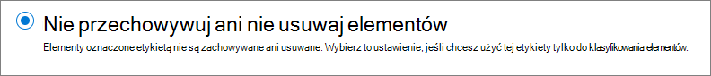
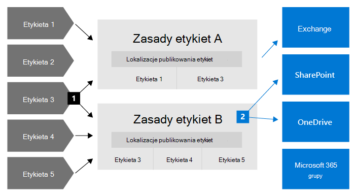

# Informacje o zasadach przechowywania i etykietach przechowywania

>*[Microsoft 365 licencjonowania w zakresie zabezpieczeń & zgodności](/office365/servicedescriptions/microsoft-365-service-descriptions/microsoft-365-tenantlevel-services-licensing-guidance/microsoft-365-security-compliance-licensing-guidance).*

> [!NOTE]
> Jeśli widzisz komunikaty dotyczące zasad przechowywania w programie Teams lub masz pytania dotyczące etykiet przechowywania w aplikacjach, skontaktuj się ze swoim działem IT, aby uzyskać informacje o tym, jak zostały skonfigurowane dla Ciebie. W międzyczasie pomocne mogą się okazać następujące artykuły:
> -  [Teams dotyczące zasad przechowywania](https://support.microsoft.com/office/teams-messages-about-retention-policies-c151fa2f-1558-4cf9-8e51-854e925b483b)
> - [Stosowanie etykiet przechowywania do plików w SharePoint lub OneDrive](https://support.microsoft.com/office/apply-retention-labels-to-files-in-sharepoint-or-onedrive-11a6835b-ec9f-40db-8aca-6f5ef18132df)
>
> Informacje na tej stronie są dla administratorów informatycznych, którzy mogą tworzyć zasady przechowywania i etykiety przechowywania ze względu na zgodność z przepisami.

W większości organizacji ilość i złożoność danych codziennie się zwiększa — wiadomości e-mail, dokumenty, wiadomości błyskawiczne i nie tylko. Skuteczne zarządzanie tymi informacjami lub zarządzanie nimi jest ważne, ponieważ wymaga:

- Będziesz **działać** proaktywnie z przepisami branżowymi i zasadami wewnętrznymi, które wymagają przechowywania zawartości przez minimalny czas — na przykład program Sarbanes-Oxley Act może wymagać przechowywania określonych typów zawartości przez siedem lat.

- **Zmniejsz swoje ryzyko w przypadku sporu** sądowego lub naruszenia zabezpieczeń, trwale usuwając starą zawartość, która nie jest już potrzebna.

- **Pomóż organizacji w efektywnej** dzielenie się wiedzą i zapewniaj większą elastyczność, zapewniając użytkownikom dostęp tylko do bieżącej i istotnej dla nich zawartości.

Skonfigurowane ustawienia przechowywania pomagają w osiągnięciu tych celów. Aby zarządzać zawartością, zazwyczaj są wymagane dwie akcje:

| Akcja| Cel |
|:-----|:-----|
|Zachowywanie zawartości | Zapobieganie trwałemu usunięciu i pozostawanie dostępne do zbierania elektronicznych materiałów dowodowych |
|Usuwanie zawartości | Trwałe usuwanie zawartości z organizacji|

Za pomocą tych dwóch akcji przechowywania możesz skonfigurować ustawienia przechowywania dla następujących wyników:

- Zachowaj tylko: Zachowaj zawartość na zawsze lub przez określony czas.
- Tylko do usuwania: Trwałe usuwanie zawartości po upływie określonego czasu.
- Zachowywanie i usuwanie: Zachowaj zawartość przez określony czas, a następnie usuń ją trwale.

Te ustawienia przechowywania działają z zawartością w miejscu, co pozwala zaoszczędzić dodatkowe koszty związane z tworzeniem i konfigurowaniem dodatkowego miejsca do magazynowania, gdy trzeba zachować zawartość ze względu na zgodność z przepisami. Ponadto nie trzeba wdrażać niestandardowych procesów w celu kopiowania i synchronizowania tych danych.

Skorzystaj z poniższych sekcji, aby dowiedzieć się więcej o tym, jak działają zasady przechowywania i etykiety przechowywania, kiedy ich używać i jak się uzupełniają. Jeśli jednak możesz rozpocząć i wdrożyć ustawienia przechowywania w przypadku niektórych typowych scenariuszy, zobacz Wprowadzenie [do zarządzania informacjami](get-started-with-information-governance.md).

## Jak działają ustawienia przechowywania z zawartością w miejscu

Jeśli do zawartości przypisano ustawienia przechowywania, pozostaje ona w pierwotnej lokalizacji. W większości przypadków osoby te kontynuują pracę nad dokumentami lub pocztą, jakby nic się nie zmieniło. Jednak w przypadku edytowania lub usuwania zawartości zawartej w zasadach przechowywania kopia zawartości jest automatycznie zachowywana.
  
- Dla SharePoint i OneDrive: Kopia jest zachowywana w bibliotece **Hold hold**.

- W Exchange skrzynki pocztowe: Kopia jest zachowywana w folderze **Elementy do odzyskania**. 

- W Teams i wiadomościach Yammer: Kopia jest zachowywana w ukrytym folderze o nazwie **1200** a także jako podfolder w folderze Elementy Exchange elementy **do odzyskania**.

> [!NOTE]
> Ponieważ biblioteka Hold (Przechowywanie) jest uwzględniona w przydomowym magazynie witryny, może być konieczne zwiększenie ilości miejsca do magazynowania w przypadku używania ustawień przechowywania dla witryn SharePoint i Microsoft 365 grupy.
> 
Te bezpieczne lokalizacje i zachowana zawartość nie są widoczne dla większości osób. W większości przypadków osoby nie muszą nawet wiedzieć, że ich zawartość podlega ustawień przechowywania.

Aby uzyskać bardziej szczegółowe informacje na temat działania ustawień przechowywania dla różnych obciążeń, zobacz następujące artykuły:

- [Dowiedz się więcej na temat przechowywania SharePoint i OneDrive](retention-policies-sharepoint.md)
- [Dowiedz się więcej na temat przechowywania Microsoft Teams](retention-policies-teams.md)
- [Informacje na temat przechowywania danych dla Yammer](retention-policies-yammer.md)
- [Dowiedz się więcej na temat przechowywania Exchange](retention-policies-exchange.md)

## Zasady przechowywania i etykiety przechowywania

Aby przypisać ustawienia przechowywania do zawartości, skorzystaj z **zasad przechowywania** i **etykiet przechowywania z zasadami etykiet**. Możesz użyć tylko jednej z tych metod lub je połączyć.

Przy użyciu zasad przechowywania przypisz te same ustawienia przechowywania dla zawartości na poziomie witryny lub skrzynki pocztowej, a przy użyciu etykiety przechowywania przypisz ustawienia przechowywania na poziomie elementu (folder, dokument, wiadomość e-mail).

Jeśli na przykład wszystkie dokumenty w witrynie firmy SharePoint powinny być przechowywane przez 5 lat, bardziej skuteczne jest stosowanie zasad przechowywania niż stosowanie tej samej etykiety przechowywania do wszystkich dokumentów w tej witrynie. Jeśli jednak niektóre dokumenty w tej witrynie powinny być przechowywane przez 5 lat, a inne przez 10 lat, zasady przechowywania nie będą mogły tego zrobić. Jeśli chcesz określić ustawienia przechowywania na poziomie elementu, użyj etykiet przechowywania. 

W przeciwieństwie do zasad przechowywania ustawienia przechowywania z etykiet przechowywania są przenoszone z zawartością, jeśli są przenoszone do innej lokalizacji w Microsoft 365 dzierżawie. Ponadto etykiety przechowywania mają następujące funkcje, których zasady przechowywania nie obsługują: 
 
- Opcje rozpoczęcia okresu przechowywania, od daty o etykiecie lub na podstawie zdarzenia, oprócz wieku zawartości lub ostatniej modyfikacji.

- Używaj [klasyfikatorów przeszkolnych do](classifier-learn-about.md) identyfikowania zawartości do oznaczania.

- Stosowanie etykiety domyślnej dla SharePoint dokumentów.

- Obsługa [przeglądania zawartości](./disposition.md)  w celu przejrzenia zawartości przed jej trwałym usunięciem.

- Oznacz zawartość jako rekord [jako część](records-management.md#records)   ustawień etykiety i zawsze usuń zawartość po usunięciu jej po zakończeniu okresu przechowywania.

### Zasady przechowywania

Zasady przechowywania można stosować do następujących lokalizacji:
- Exchange-mail
- SharePoint witryny
- OneDrive konta
- Microsoft 365 grupy
- Skype dla firm
- Exchange folderów publicznych
- Teams wiadomości na kanale
- Teams czatów
- Teams wiadomości z kanału prywatnego
- Yammer wiadomości od społeczności
- Yammer wiadomości od użytkowników

> [!NOTE]
> Teams wiadomości w kanałach obejmują teraz [kanały](/MicrosoftTeams/shared-channels) udostępnione (obecnie w wersji zapoznawczej), a także standardowe kanały.

Bardzo wydajnym zastosowaniem jednej zasady jest stosowanie jednej zasady do wielu lokalizacji lub do określonych lokalizacji bądź użytkowników.

Po rozpoczęciu okresu przechowywania można określić, kiedy zawartość została utworzona lub obsługiwana tylko w przypadku plików oraz lokalizacji grup usługi SharePoint, OneDrive i Microsoft 365, kiedy zawartość została ostatnio zmodyfikowana.

Elementy dziedziczą ustawienia przechowywania po kontenerze określonym w zasadach przechowywania. Jeśli zostaną one przeniesione poza ten kontener, gdy zasady zostaną skonfigurowane w taki sposób, aby zachowywać zawartość, kopia tego elementu zostanie zachowana w lokalizacji zabezpieczonej przez obciążenie pracą. Jednak ustawienia przechowywania nie są dostarczane z zawartością w nowej lokalizacji. Jeśli jest to wymagane, zamiast zasad przechowywania używaj etykiet przechowywania.

### Etykiety przechowywania

Etykiet przechowywania należy używać dla różnych typów zawartości, które wymagają różnych ustawień przechowywania. Przykład:
  
- Formularze podatkowe, które muszą być przechowywane przez minimalny okres. 
    
- Materiały prasowe, które muszą zostać trwale usunięte, gdy osiągną określony wiek. 
    
- Badania konkurencyjności, które należy zachować przez określony okres, a następnie trwale usunąć. 
    
- Wizy służbowe, które należy oznaczać jako rekord, aby nie można było ich edytować ani usuwać. 
    
We wszystkich tych przypadkach etykiety przechowywania umożliwiają stosowanie ustawień przechowywania w celu kontroli zarządzania na poziomie elementów (dokumentu lub wiadomości e-mail).
  
Etykiety przechowywania:
  
- **Umożliwia osobom w Twojej organizacji** ręczne stosowanie etykiety przechowywania do zawartości w Outlook, Outlook w sieci Web, OneDrive, SharePoint i Microsoft 365 grupy. Użytkownicy często wiedzą, z jakiego typu zawartością pracują, aby można było ją klasyfikować i stosować odpowiednie ustawienia przechowywania. 
    
- **Etykiety przechowywania można stosować** automatycznie do zawartości, jeśli są one spełnione określone warunki, obejmują załączniki w chmurze udostępniane w wiadomościach e-mail Teams wiadomościach e-mail lub w przypadku, gdy zawartość zawiera: 
    - Określone typy informacji poufnych.
    - Określone słowa kluczowe zgodne z tworzyć zapytania.
    - Wzorce dopasowania dla klasyfikatora przeszkoliwnego.

- **Okres przechowywania rozpoczyna się od oznaczania** zawartości dla dokumentów w witrynach sieci SharePoint i kontach OneDrive i elementach poczty e-mail.

- **Okres przechowywania rozpoczyna się w momencie wystąpienia zdarzenia**, takiego jak opuszczenie organizacji przez pracowników, lub gdy wygasają umowy.

- **Zastosuj domyślną etykietę** przechowywania do biblioteki dokumentów, folderu lub dokumentu ustawionego w programie SharePoint, tak aby wszystkie dokumenty przechowywane w tej lokalizacji dziedziczyły domyślną etykietę przechowywania.

- **Oznaczanie elementów jako rekordów** w ramach strategii [zarządzania rekordami](records-management.md) . Jeśli zawartość oznaczona etykietą pozostaje Microsoft 365, obowiązują dodatkowe ograniczenia dotyczące zawartości, które mogą być potrzebne ze względu na przepisy prawne. Aby uzyskać więcej informacji, zobacz [Porównanie ograniczeń dotyczących akcji, które są dozwolone lub blokowane](records-management.md#compare-restrictions-for-what-actions-are-allowed-or-blocked).

Etykiety przechowywania, w przeciwieństwie [do etykiet wrażliwości](sensitivity-labels.md), nie są zachowywane, jeśli zawartość jest przenoszony poza Microsoft 365.

#### Klasyfikowanie zawartości bez stosowania żadnych akcji

Mimo że głównym celem etykiet przechowywania jest przechowywanie lub usuwanie zawartości, etykiet przechowywania można również używać bez włączania jakichkolwiek czynności przechowywania i innych. W takim przypadku można użyć etykiety przechowywania po prostu jako etykiety tekstowej bez wymuszania żadnych akcji.
  
Na przykład można utworzyć i zastosować etykietę przechowywania o nazwie "Przeglądanie później" bez akcji, a następnie użyć tej etykiety w celu późniejszego znalezienia tej zawartości.
  

#### Używanie etykiety przechowywania jako warunku zasad DLP

Etykietę przechowywania można określić jako warunek w zasadach ochrony przed utratą danych (DLP) dla dokumentów w aplikacji SharePoint. Na przykład skonfiguruj zasady DLP, aby zapobiec udostępnianiu dokumentów poza organizacją, jeśli do nich zastosowano określoną etykietę przechowywania.

Aby uzyskać więcej informacji, [zobacz Używanie etykiety przechowywania jako warunku w zasadach DLP](data-loss-prevention-policies.md#using-a-retention-label-as-a-condition-in-a-dlp-policy).

#### Stosowanie etykiet i zasad przechowywania

Gdy publikujesz etykiety przechowywania, są one uwzględniane w zasadach  etykiet przechowywania, które udostępniają je administratorom i użytkownikom do stosowania do zawartości. Jak pokazano na poniższym diagramie:

1. Pojedyncza etykieta przechowywania może zostać uwzględniona w wielu zasadach przechowywania etykiet.

2. Zasady etykiet przechowywania określają lokalizacje publikowania etykiet przechowywania. Tę samą lokalizację można dodać do wielu zasad etykiet przechowywania.

Możesz również utworzyć co najmniej jedną zasady **automatycznego stosowania etykiet przechowywania** z jedną etykietą przechowywania. W przypadku tych zasad etykieta przechowywania jest automatycznie stosowana po zastosowaniu warunków określonych w zasadach.

#### Zasady i lokalizacje etykiet przechowywania

Etykiety przechowywania można publikować w różnych miejscach, w zależności od tego, do czego wpływa etykieta przechowywania.
  
| Jeśli etykieta przechowywania to... | Następnie zasady dotyczące etykiet mogą być stosowane do... |
|:-----|:-----|
|Opublikowano dla administratorów i użytkowników końcowych  |Exchange, SharePoint, OneDrive, Microsoft 365 Grupy  |
|Automatyczne zastosowanie na podstawie typów informacji poufnych lub przeszkolnych klasyfikatorów  |Exchange, SharePoint, OneDrive  |
|Automatyczne zastosowanie na podstawie słów kluczowych lub kwerendy  |Exchange, SharePoint, OneDrive, Microsoft 365 Grupy  |
|Automatyczne zastosowanie do załączników w chmurze  |SharePoint, OneDrive, Microsoft 365 Grupy  |

Exchange foldery publiczne, Skype, Teams i Yammer nie obsługują etykiet przechowywania. Aby zachować i usunąć zawartość z tych lokalizacji, należy użyć zasad przechowywania.

#### Tylko jedna etykieta przechowywania na raz

Do wiadomości e-mail lub dokumentu może być zastosowana tylko jedna etykieta przechowywania na raz. Etykieta przechowywania może zostać [zastosowana](create-apply-retention-labels.md#manually-apply-retention-labels) ręcznie przez użytkownika końcowego lub administratora albo automatycznie przy użyciu dowolnej z następujących metod:

- [Zasady automatycznego stosowania etykiet](apply-retention-labels-automatically.md)
- [Model zrozumienia dokumentu dla SharePoint Syntex](../contentunderstanding/apply-a-retention-label-to-a-model.md)
- [Etykieta domyślna SharePoint](create-apply-retention-labels.md#applying-a-default-retention-label-to-all-content-in-a-sharepoint-library-folder-or-document-set) lub [Outlook](create-apply-retention-labels.md#applying-a-default-retention-label-to-an-outlook-folder)
- [Outlook reguł](create-apply-retention-labels.md#automatically-applying-a-retention-label-to-email-by-using-rules)

W przypadku standardowych etykiet przechowywania (nie należy oznaczać elementów jako rekordów [ani rekordów prawnych](records-management.md#records)):

- Administratorzy i użytkownicy końcowi mogą ręcznie zmienić lub usunąć istniejącą etykietę przechowywania, która jest stosowana do zawartości. 

- Jeśli do zawartości zastosowano już etykietę przechowywania, istniejąca etykieta nie zostanie automatycznie usunięta lub zastąpiona inną etykietą przechowywania z jednym możliwym wyjątkiem: istniejąca etykieta została zastosowana jako etykieta domyślna. W przypadku użycia etykiety domyślnej istnieją pewne scenariusze, w których można ją zamienić na inną etykietę domyślną lub automatycznie usunąć. 
    
    Aby uzyskać więcej informacji na temat zachowania etykiety w przypadku jej zastosowania przy użyciu etykiety domyślnej:
    - Etykieta domyślna SharePoint: Zachowanie etykiety w przypadku [użycia etykiety domyślnej dla etykiety SharePoint](create-apply-retention-labels.md#label-behavior-when-you-use-a-default-label-for-sharepoint)
    - Etykieta domyślna Outlook: [Stosowanie domyślnej etykiety przechowywania do Outlook folderu](create-apply-retention-labels.md#applying-a-default-retention-label-to-an-outlook-folder)

- Jeśli istnieje wiele zasad automatycznego stosowania etykiet, które mogą zastosować etykietę przechowywania, a zawartość spełnia warunki wielu zasad, etykieta przechowywania dla najstarszych zasad automatycznego stosowania etykiet (według daty utworzenia) jest stosowana.

W przypadku oznaczania elementów etykiet przechowywania jako rekordu lub rekordu prawnego etykiety te nigdy nie są automatycznie zmieniane. Tylko administratorzy kontenera mogą ręcznie zmieniać lub usuwać etykiety przechowywania oznaczane elementami jako rekordy, ale nie rekordy prawne. Aby uzyskać więcej informacji, zobacz [Porównanie ograniczeń dotyczących akcji, które są dozwolone lub blokowane](records-management.md#compare-restrictions-for-what-actions-are-allowed-or-blocked).

#### Monitorowanie etykiet przechowywania

Z centrum Centrum zgodności platformy Microsoft 365 wybierz pozycję Klasyfikacja danych  i stronę Omówienie,  aby monitorować sposób, w jaki etykiety przechowywania są używane w dzierżawie, oraz zidentyfikować miejsce, w którym znajdują się elementy oznaczone etykietami. Aby uzyskać więcej informacji, w tym ważne wymagania wstępne, zobacz [Informacje o klasyfikacji danych](data-classification-overview.md).

Następnie możesz przejść do szczegółów za pomocą [Eksploratora zawartości](data-classification-content-explorer.md) i [Eksploratora aktywności](data-classification-activity-explorer.md).

> [!TIP]
>Rozważ użycie niektórych innych szczegółowych informacji dotyczących klasyfikacji danych, takich jak klasyfikatory przeszkolne i typy informacji poufnych, aby ułatwić zidentyfikowanie zawartości, która może być potrzebna do zachowania lub usunięcia bądź zarządzania jako rekordami.

#### Korzystanie z wyszukiwania zawartości w celu znalezienia całej zawartości z określoną etykietą przechowywania

Po zastosowaniu etykiet przechowywania do zawartości przez użytkowników lub automatycznie zastosowanej zawartości możesz użyć funkcji wyszukiwania zawartości w celu znalezienia wszystkich elementów, do których zastosowano określoną etykietę przechowywania.

Podczas tworzenia wyszukiwania zawartości wybierz warunek Etykieta  przechowywania, a następnie wprowadź pełną nazwę etykiety przechowywania lub jej część i użyj symbolu wieloznacznego. Aby uzyskać więcej informacji, zobacz [Zapytania słów kluczowych i warunki wyszukiwania dotyczące wyszukiwania zawartości](keyword-queries-and-search-conditions.md).
  

## Porównanie funkcji zasad przechowywania i etykiet przechowywania

Skorzystaj z poniższej tabeli, aby ustalić, czy należy używać zasad przechowywania, czy etykiety przechowywania, w zależności od możliwości.

|Funkcja|Zasady przechowywania |Etykieta przechowywania|
|:-----|:-----|:-----|:-----|
|Ustawienia przechowywania, które mogą zachowywać, a następnie usuwać, zachowywać tylko lub usuwać |Tak |Tak |
|Obsługiwane obciążenia pracą:  — Exchange  — SharePoint  — OneDrive  — Microsoft 365 grupy  — Skype dla firm  — Teams - Yammer|  Tak   Tak   Tak   Tak   Tak   Tak   Tak |   Tak, z wyjątkiem folderów publicznych   Tak   Tak   Tak   Nie   Nie   Nie |
|Przechowywanie stosowane automatycznie | Tak | Tak |
|Przechowywanie zastosowane na podstawie warunków   - typy informacji poufnych, zapytania KQL i słowa kluczowe, przeszkolni klasyfikatorzy, załączniki w chmurze| Nie | Tak |
|Przechowywanie zastosowane ręcznie | Nie | Tak |
|Interakcja użytkownika końcowego | Nie | Tak |
|Zachowywane, jeśli zawartość jest przenoszony | Nie | Tak, w ramach Microsoft 365 dzierżawy |
|Deklarowanie elementu jako rekordu| Nie | Tak |
|Rozpoczynanie okresu przechowywania na podstawie zdarzenia lub etykiety | Nie | Tak |
|Przegląd rozsyłania | Nie| Tak |
|Dowód rozsyłania na maksymalnie 7 lat | Nie |Tak, jeśli używasz recenzji rozsyłania lub gdy element jest oznaczony rekordem|
|Inspekcja działań administratora| Tak | Tak|
|Inspekcja akcji przechowywania| Nie | Tak \* |
|Identyfikowanie elementów podlegających zasadom przechowywania:   - Wyszukiwanie zawartości   - Strona Klasyfikacja danych, Eksplorator zawartości, Eksplorator aktywności |   Nie   Nie |   Tak   Tak|

**Przypis dolny:**

\*W przypadku etykiet przechowywania, które nieokreślają zawartości jako rekordu lub rekordu prawnego, zdarzenia inspekcji są ograniczone do sytuacji, gdy element w programie SharePoint lub OneDrive ma etykietę, która została zastosowana, zmieniona lub usunięta. Aby uzyskać szczegółowe informacje dotyczące inspekcji etykiet przechowywania, zobacz sekcję [Akcje przechowywania inspekcji](#auditing-retention-actions) na tej stronie.

### Łączenie zasad przechowywania i etykiet przechowywania

Nie musisz wybierać, czy używasz tylko zasad przechowywania, czy tylko etykiet przechowywania. Obie metody mogą być używane razem, a w zasadzie jako uzupełnienie siebie nawzajem w celu bardziej kompleksowego rozwiązania.

Poniższe przykłady to tylko niektóre ze sposobów łączenia zasad przechowywania i etykiet przechowywania dla tej samej lokalizacji.

Aby uzyskać więcej informacji na temat sposobu współpracy zasad przechowywania i etykiet przechowywania oraz określania ich połączonych wyników, zobacz sekcję na tej stronie, w której opisano zasady przechowywania i co ma [pierwszeństwo.](#the-principles-of-retention-or-what-takes-precedence)

**Przykład zastępowania automatycznego usuwania przez użytkowników**

Scenariusz: Domyślnie zawartość kont e-mail OneDrive jest automatycznie usuwana po pięciu latach, ale użytkownicy muszą mieć możliwość zastąpienia tego ustawienia w przypadku określonych dokumentów.

1. Tworzysz i konfigurujesz zasady przechowywania, które automatycznie usuwają zawartość pięć lat po ostatniej modyfikacji, i stosujesz je do wszystkich OneDrive kont.

2. Tworzysz i konfigurujesz etykietę przechowywania, która zachowuje zawartość na zawsze, i dodajesz tę etykietę do zasad etykiet publikowanych na wszystkich OneDrive kontach. Użytkownikom wyjaśniono, jak ręcznie zastosować tę etykietę do określonych dokumentów, które powinny być wykluczone z automatycznego usuwania, jeśli nie zostaną zmodyfikowane po pięciu latach.

**Przykład zachowywania elementów przez dłuższy czas**

Scenariusz: Domyślnie elementy SharePoint są automatycznie zachowywane i usuwane po pięciu latach, ale dokumenty w określonych bibliotekach muszą być przechowywane przez dziesięć lat.

1. Tworzysz i konfigurujesz zasady przechowywania, które automatycznie zachowują, a następnie usuwają zawartość po pięciu latach i stosują je do wszystkich wystąpień grup SharePoint i Microsoft 365 grupy.

2. Tworzysz i konfigurujesz etykietę przechowywania, która automatycznie przechowuje zawartość przez dziesięć lat. Tę etykietę należy opublikować SharePoint administratorom witryn, aby zastosować ją jako etykietę domyślną do dziedziczenia przez wszystkie elementy w określonych bibliotekach dokumentów.

**Przykład usuwania elementów w krótszym okresie**

Scenariusz: Domyślnie wiadomości e-mail nie są zachowywane, ale są automatycznie usuwane po dziesięciu latach. Jednak wiadomości e-mail związane z określonym projektem, który ma wstępną nazwę kodu, muszą zostać automatycznie usunięte po upływie jednego roku.

1. Tworzysz i konfigurujesz zasady przechowywania, które automatycznie usuwają zawartość po dziesięciu latach, i stosujesz je do wszystkich Exchange adresatów.

2. Tworzysz i konfigurujesz etykietę przechowywania, która automatycznie usuwa zawartość po upływie jednego roku. Opcje dotyczące stosowania tej etykiety do odpowiednich wiadomości e-mail są następujące:
    - Tworzysz zasady automatycznego oznaczania zawartości identyfikującej zawartość, używając jako słowa kluczowego nazwy kodu projektu, i stosujesz je do wszystkich Exchange adresatów
    - Publikujesz etykietę i poinstruujesz użytkowników zaangażowanych w projekt, jak utworzyć regułę automatyczną w programie Outlook która będzie stosowana ta etykieta
    - Opublikuj etykietę i poinstruuj użytkowników, aby utworzyli folder w programie Outlook na wszystkie wiadomości e-mail związane z projektem, a następnie zastosują opublikowaną etykietę do tego folderu, a następnie utworzyli regułę programu Outlook w celu przenoszenia wszystkich wiadomości e-mail związanych z projektem do tego folderu.

## Ile trzeba czekać na zastosowanie ustawień przechowywania

W przypadku przesyłania zasad przechowywania dla obciążeń i zasad etykiet w celu automatycznego stosowania etykiety przechowywania możesz zezwolić do maksymalnie 7 dni na zastosowanie ustawień przechowywania do zawartości:

- [Jak długo trwa okres, w jakim mają obowiązywać zasady przechowywania](create-retention-policies.md#how-long-it-takes-for-retention-policies-to-take-effect)
- [Jak długo trwa okres przechowywania etykiet przechowywania](apply-retention-labels-automatically.md#how-long-it-takes-for-retention-labels-to-take-effect)

Podobnie możesz od 7 dni, aby etykiety przechowywania były widoczne w aplikacjach po opublikowaniu etykiet:

- [Gdy etykiety przechowywania stają się dostępne do zastosowania](create-apply-retention-labels.md#when-retention-labels-become-available-to-apply)

Często zasady zajdą w życie, a etykiety będą widoczne szybciej niż 7 dni. Jednak mając wiele potencjalnych zmiennych, które mogą mieć wpływ na ten proces, najlepiej zaplanować maksymalnie 7 dni.

## Adaptacyjne lub statyczne zakresy zasad przechowywania

Podczas tworzenia zasad przechowywania lub zasad etykiet przechowywania musisz wybrać adaptacyjny lub statyczny, aby zdefiniować zakres zasad.

- W **adaptacyjnym zakresie** jest używane określone zapytanie, więc członkostwo nie jest statyczne, ale dynamiczne, uruchamiając je codziennie na atrybutach lub właściwościach określanych dla wybranych lokalizacji. W ramach jednej zasady możesz używać wielu adaptacyjnych zakresów.
    
    Przykład: Wiadomości e-mail i OneDrive dla kadry kierowniczej wymagają dłuższego okresu przechowywania niż standardowi użytkownicy. Tworzysz zasady przechowywania z adaptacyjnym zakresem, który używa tytułu zadania atrybutu usługi Azure AD "Kierownictwo", a następnie wybierz lokalizacje kont e-mail Exchange i OneDrive dla zasad. Nie trzeba określać adresów e-mail ani adresów URL OneDrive URL dla tych użytkowników, ponieważ adaptacyjny zakres automatycznie pobiera te wartości. W przypadku nowych kadry kierowniczej nie ma potrzeby ponownego konfigurowania zasad przechowywania, ponieważ ci nowi użytkownicy z odpowiednimi wartościami dla poczty e-mail OneDrive są automatycznie odbierani.

- Zakres **statyczny** nie używa zapytań i jest ograniczony w konfiguracji, ponieważ może dotyczyć wszystkich wystąpień określonej lokalizacji lub stosować dołączenie i wykluczenia dla określonych wystąpień dla tej lokalizacji. Te trzy opcje są niekiedy określane mianem odpowiednio "całej organizacji", "zawiera" i "wykluczeń".
    
    Przykład: Wiadomości e-mail i OneDrive dla kadry kierowniczej wymagają dłuższego okresu przechowywania niż standardowi użytkownicy. Zasady przechowywania tworzy się ze statycznym zakresem, który wybiera dla tych Exchange e-mail OneDrive e-mail i kont poczty e-mail. W przypadku Exchange poczty e-mail możesz zidentyfikować grupę zawierającą tylko kadrę kierowniczej, więc określisz tę grupę dla zasad przechowywania, a członkostwo w grupach w odpowiednich adresach e-mail zostanie pobrane po utworzeniu zasad. W przypadku OneDrive kont musisz zidentyfikować, a następnie określić poszczególne adresy URL OneDrive dla każdego kierownika. W przypadku nowych kadry kierowniczej musisz ponownie skonfigurować zasady przechowywania, aby dodać nowe adresy e-mail i OneDrive URL. Musisz również zaktualizować adresy OneDrive URL w przypadku zmiany jego upn. kierownictwa.
    
    OneDrive URL są szczególnie trudne do niezawodnego określenia, ponieważ domyślnie te adresy URL nie są tworzone, dopóki użytkownik nie OneDrive dostępu do swojego OneDrive po raz pierwszy. A jeśli głównej nazwy użytkownika zmieni się, o której być może nie wiesz, adres URL OneDrive automatycznie zmienia się.

Zalety korzystania z adaptacyjnych zakresów:

- Brak ograniczeń liczby [elementów według zasad](retention-limits.md#maximum-number-of-items-per-policy). Mimo że zasady adaptacyjne nadal podlegają maksymalnej  liczbie zasad na ograniczenia dzierżawy, bardziej elastyczna konfiguracja prawdopodobnie spowoduje znacznie mniej zasad.

- Bardziej zaawansowane możliwości określania docelowych wymagań przechowywania. Możesz na przykład przypisać różne ustawienia przechowywania do użytkowników zgodnie z ich lokalizacją geograficzną, używając istniejących atrybutów usługi Azure AD bez konieczności tworzenia i utrzymywania grup na potrzeby tego celu.

- Członkostwo oparte na zapytaniach zapewnia odporność na zmiany biznesowe, które mogą nie być niezawodnie odzwierciedlane w członkostwie w grupach lub procesach zewnętrznych opartych na komunikacji między działami.

- Pojedyncze zasady przechowywania mogą obejmować lokalizacje dla plików Microsoft Teams i Yammer, natomiast w przypadku użycia zakresu statycznego te lokalizacje wymagają własnych zasad przechowywania.
    
- Konkretne ustawienia przechowywania można zastosować tylko do nieaktywnych skrzynek pocztowych. Ta konfiguracja nie jest możliwa w zakresie statycznym, ponieważ w momencie przypisywania zasad zakresy statyczne nie obsługują określonego dołączania adresatów nieaktywnych skrzynek pocztowych.

Zalety korzystania z zakresów statycznych:

- Uproszczona konfiguracja, jeśli chcesz, aby wszystkie wystąpienia zostały automatycznie wybrane dla obciążenia pracą.
    
    W przypadku "uwzględnia" i "wykluczania" ta konfiguracja na początku może być prostsza, jeśli liczba wystąpień, które należy określić, jest niewielka i nie zmienia się. Jeśli jednak liczba tych wystąpień zacznie się zwiększać i w Twojej organizacji często wystąpią zmiany wymagające ponownego skonfigurowania zasad, adaptacyjne zakresy mogą być prostsze w konfiguracji i znacznie łatwiejsze w konserwacji.

- **Foldery Skype dla firm** i **Exchange** nie obsługują adaptacyjnych zakresów. W przypadku tych lokalizacji należy użyć zakresu statycznego. 

Aby uzyskać informacje o konfiguracji, [zobacz Konfigurowanie adaptacyjnych zakresów](retention-settings.md#configuration-information-for-adaptive-scopes).

Aby obejrzeć zarejestrowane seminarium w sieci Web (wymaga rejestracji), odwiedź [stronę Deep Dive on Adaptive Scopes (Zakresy adaptacyjne](https://mipc.eventbuilder.com/event/45703)).

> [!IMPORTANT]
> Obecnie adaptacyjne zakresy nie obsługują blokady zachowywania w celu ograniczenia zmian zasad [przechowywania i zasad etykiet przechowywania](#use-preservation-lock-to-restrict-changes-to-policies).

## Odnośnik zasad

Możesz skonfigurować wiele zasad przechowywania dla Microsoft 365, a także wiele zasad etykiet przechowywania publikowanych lub automatycznie stosowania. Aby znaleźć zasady przechowywania przypisane określonym użytkownikom, witrynom i grupom użytkowników, Microsoft 365, użyj funkcji Wyszukiwanie zasad z rozwiązania  do zarządzania informacjami w  p Centrum zgodności platformy Microsoft 365:

Musisz podać dokładny adres e-mail użytkownika, dokładny adres URL witryny lub dokładny adres e-mail Microsoft 365 grupy.

Opcja witryn obejmuje konta OneDrive konta. Aby uzyskać informacje o tym, jak określić adres URL konta OneDrive użytkownika, zobacz Uzyskiwanie listy wszystkich adresów [URL OneDrive URL w organizacji](/onedrive/list-onedrive-urls).

## Zasady przechowywania lub to, co ma pierwszeństwo?

W przeciwieństwie do etykiet przechowywania, do tej samej zawartości można zastosować więcej niż jedną zasady przechowywania. Każda zasada przechowywania może skutkować działaniem zatrzymania lub usunięcia. Ponadto ten element może również podlegać tym czynnościom z etykiety przechowywania.

W tym scenariuszu, gdy elementy mogą podlegać wielu ustawień przechowywania, które mogą ze sobą kolidować, co ma pierwszeństwo, aby ustalić wynik?

Wynikiem nie jest zachowanie pojedynczych zasad przechowywania ani pojedynczych etykiet przechowywania, ale czas przechowywania elementu (jeśli ma to zastosowanie) i czas usunięcia elementu (jeśli ma zastosowanie). Te dwie akcje są obliczane niezależnie od siebie, od wszystkich ustawień przechowywania zastosowanych do elementu.

Na przykład element może podlegać jednej zasad przechowywania, która jest skonfigurowana dla akcji tylko do usunięcia, oraz innych zasad przechowywania skonfigurowanych do zachowywania, a następnie usuwania. W efekcie ten element ma tylko jedną akcję przechowywania, ale dwie akcje usunięcia. Akcje przechowywania i usuwania mogą być ze sobą w konflikcie i obie akcje usunięcia mogą mieć datę konfliktów. Zasady przechowywania wyjaśniają wynik.

Na wysokim poziomie możesz mieć pewność, że przechowywanie zawsze ma pierwszeństwo przed trwałym usuwaniem i najdłuższy okres przechowywania zostanie zapewniony. Te dwie proste reguły zawsze decydują o tym, jak długo element będzie zachowywany.

Istnieje jeszcze kilka czynników, które określają, kiedy element zostanie trwale usunięty, a to między innymi akcja usuwania z etykiety przechowywania zawsze ma pierwszeństwo przed akcją usuwania z zasad przechowywania.

Skorzystaj z poniższego przepływu, aby zrozumieć wyniki przechowywania i usuwania dla jednego elementu, w którym każdy poziom działa jako wiążący konflikty, od góry do dołu. Jeśli wynik jest ustalany na podstawie pierwszego poziomu, ponieważ nie występują żadne dalsze konflikty, nie trzeba przejść do następnego poziomu itp.

> [!IMPORTANT]
> Jeśli używasz etykiet przechowywania: Przed zastosowaniem zasad w celu określenia wyników wielu ustawień przechowywania dla tego samego elementu upewnij się, że wiesz, które etykiety [przechowywania zostały zastosowane](#only-one-retention-label-at-a-time).

Przed bardziej szczegółowym wyjaśnieniem każdej zasady należy zrozumieć różnicę między okresem przechowywania dla elementu a okresem przechowywania określonym w zasadach przechowywania lub etykietach przechowywania. Dzieje się tak, ponieważ chociaż domyślną konfiguracją jest rozpoczęcie okresu przechowywania podczas tworzenia elementu, dzięki czemu koniec okresu przechowywania dla tego elementu jest stały, pliki również obsługują konfigurację, aby rozpocząć okres przechowywania od ostatniej modyfikacji pliku. W przypadku tej konfiguracji alternatywnej po każdej modyfikacji pliku jest resetowany początek okresu przechowywania, który rozszerza okres przechowywania dla elementu. Etykiety przechowywania obsługują również rozpoczynanie okresu przechowywania po etykietach i na początku zdarzenia.

Aby zastosować zasady działania do serii pytań Tak i Nie, możesz również użyć schematu [blokowego przechowywania](retention-flowchart.md).

Objaśnienie czterech różnych zasad:
  
1. **Przechowywanie jest zdobywane przez usuwanie.** Zawartość nie zostanie trwale usunięta, jeśli ma również ustawienia przechowywania, aby ją zachować. Ta zasada gwarantuje zachowanie zawartości ze względu na zgodność z przepisami, ale proces usuwania może być nadal inicjowany (inicjowany przez użytkownika lub inicjowany przez system), a w konsekwencji może spowodować usunięcie zawartości z głównego widoku użytkownika. Trwałe usunięcie zostanie jednak zawieszone. Aby uzyskać więcej informacji na temat sposobu i miejsca zachowywania zawartości, użyj poniższych linków dla każdego obciążenia pracą:
    
    - [Jak działa przechowywanie w SharePoint i OneDrive](retention-policies-sharepoint.md#how-retention-works-for-sharepoint-and-onedrive)
    - [Jak działa przechowywanie na Microsoft Teams](retention-policies-teams.md#how-retention-works-with-microsoft-teams)
    - [Jak działa przechowywanie na Yammer](retention-policies-yammer.md#how-retention-works-with-yammer)
    - [Jak działa przechowywanie w Exchange](retention-policies-exchange.md#how-retention-works-for-exchange)
    
    Przykład pierwszej **zasady: Wiadomość** e-mail podlega zasadom przechowywania dla usługi Exchange, które są skonfigurowane w taki sposób, aby usuwać elementy trzy lata po ich utworzeniu, a także zastosowano etykietę przechowywania, która jest skonfigurowana tak, aby zachowywać elementy pięć lat po ich utworzeniu.
    
    Wiadomość e-mail jest zachowywana przez pięć lat, ponieważ ta akcja przechowywania ma pierwszeństwo przed usuwaniem. Wiadomość e-mail jest trwale usuwana pod koniec pięciu lat ze względu na akcję usuwania, która została zawieszona w trakcie działania przechowywania.

2. **Najdłuższa wygrana w okresie przechowywania.** Jeśli zawartość podlega wielu ustawień przechowywania, w których zawartość jest zachowywana przez różne okresy, zawartość jest zachowywana do końca najdłuższego okresu przechowywania dla elementu.
    
    > [!NOTE]
    > Zasady przechowywania lub etykiety zdobywają okres przechowywania, który wynosi 5 lat, zgodnie z zasadami przechowywania lub etykietami w ciągu 7 lat przechowywania, ponieważ okres 5 lat jest konfigurowany tak, aby rozpoczynał się na podstawie daty ostatniej modyfikacji pliku, a okres 7 lat został skonfigurowany tak, aby rozpoczynał się od jego utworzenia.
    
    **Przykład drugiej zasady**: Dokumenty w witrynie SharePoint marketingowej podlegają dwóch zasadom przechowywania. Pierwsze zasady przechowywania są konfigurowane tak, aby wszystkie SharePoint zachowywały elementy przez pięć lat od ich utworzenia. Drugie zasady przechowywania są konfigurowane dla określonych witryn SharePoint w celu zachowywania elementów przez dziesięć lat od ich utworzenia.
    
    Dokumenty w tej SharePoint Marketing są przechowywane przez dziesięć lat, ponieważ jest to najdłuższy okres przechowywania dla elementu.

3. **Jawna wygrana przez niejawne usuwanie.** W przypadku rozwiązywania konfliktów podczas przechowywania pozostaną tylko konflikty usunięcia: 
    
    1. Etykieta przechowywania (jednak została zastosowana) zapewnia jawne przechowywanie w porównaniu z zasadami przechowywania, ponieważ ustawienia przechowywania są stosowane do pojedynczego elementu, a nie niejawnie przypisywanego z kontenera. Oznacza to, że akcja usunięcia z etykiety przechowywania zawsze ma pierwszeństwo przed akcją usunięcia z dowolnych zasad przechowywania.
        
        Przykład trzeciej zasady (etykiety **):** Dokument podlega dwóch zasadom przechowywania, których działanie usunięcia wynosi odpowiednio pięć lat i dziesięć lat, oraz etykieta przechowywania, której działanie usunięcia wynosi siedem lat.
        
        Po upływie siedmiu lat dokument jest trwale usuwany, ponieważ akcja usunięcia z etykiety przechowywania ma pierwszeństwo.
    
    2. Jeśli masz tylko zasady przechowywania: Jeśli zasady przechowywania dla lokalizacji mają adaptacyjny zakres lub zakres statyczny, który obejmuje określone wystąpienia (na przykład określonych użytkowników poczty e-mail programu Exchange), zasady przechowywania mają pierwszeństwo przed statycznym zakresem skonfigurowanym dla wszystkich wystąpień dla tej samej lokalizacji.
        
        Zakres statyczny skonfigurowany dla wszystkich wystąpień lokalizacji jest czasami nazywany "zasadami dla całej organizacji". Na przykład Exchange **e-mail** i domyślne ustawienie Wszyscy **adresaci**. Możesz też **SharePoint witryny** i domyślne ustawienie wszystkie **witryny**. Jeśli zasady przechowywania nie są dla całej organizacji, ale zostały skonfigurowane z adaptacyjnym zakresem lub zakresem statycznym, który obejmuje określone wystąpienia, mają one jednakowe pierwszeństwo na tym poziomie.
        
        **Przykład 1. ta trzecia zasada (zasady): Wiadomość e-mail** podlega dwóch zasadom przechowywania. Pierwsze zasady przechowywania są niesscopeowane i usuwają elementy po dziesięciu latach. Drugie zasady przechowywania są objęte zakresem określonych skrzynek pocztowych i usuwają elementy po pięciu latach.
        
        Wiadomość e-mail zostanie trwale usunięta po pięciu latach, ponieważ akcja usuwania z zasad przechowywania o ograniczonych zakresach ma pierwszeństwo przed zasadami przechowywania dla całej organizacji.
        
        **Przykład 2. Ta trzecia zasada (zasady)**: Dokument na koncie użytkownika OneDrive podlega dwóch zasadom przechowywania. Pierwsze zasady przechowywania są objęte zakresem obejmuje konto OneDrive użytkownika i mają akcję usunięcia po 10 latach. Drugie zasady przechowywania są objęte zakresem tak, że obejmują konto OneDrive użytkownika i mają akcję usunięcia po upływie siedmiu lat.
        
        Na tym poziomie nie można ustalić, kiedy ten dokument zostanie trwale usunięty, ponieważ oba zasady przechowywania są zakresowane tak, aby obejmowały określone wystąpienia.

4. **Najkrótszy okres usuwania jest zdobywany.** Ma zastosowanie do określania, kiedy elementy będą usuwane z zasad przechowywania, a wyników nie można rozwiązać z poprzedniego poziomu: Zawartość jest trwale usuwana z końcem najkrótszego okresu przechowywania dla elementu.
    
    > [!NOTE]
    > Zasady przechowywania, których okres przechowywania wynosi 7 lat, są zachowywane przez okres 5 lat, ponieważ pierwsze zasady są skonfigurowane tak, aby rozpoczynały okres przechowywania na podstawie daty utworzenia pliku, a drugie zasady przechowywania od czasu ostatniej modyfikacji pliku.
    
    **Przykład czwartej zasady**: Dokument na koncie OneDrive podlega dwóch zasadom przechowywania. Pierwsze zasady przechowywania są objęte zakresem obejmuje konto OneDrive użytkownika i mają 10 lat od utworzenia pliku akcję usunięcia. Drugie zasady przechowywania są objęte zakresem tak, że obejmują konto OneDrive użytkownika i mają akcję usunięcia sprzed siedmiu lat od utworzenia pliku.
    
    Ten dokument zostanie trwale usunięty po upływie siedmiu lat, ponieważ jest to najmniejszy okres przechowywania dla elementu z tych dwóch zakresowych zasad przechowywania.

Elementy podlegające zbierania elektronicznych materiałów dowodowych również podlegają pierwszej zasadzie przechowywania; Nie można ich trwale usuwać za pomocą żadnych zasad przechowywania ani etykiet przechowywania. Po zwolnieniu tej zasady przechowywania są nadal stosowane do nich. Może to na przykład podlegać okresowi przechowywania lub akcjom usunięcia.

### Zasady przechowywania, które łączą działania w celu zachowania i usunięcia

Poniższe przykłady są bardziej złożone, aby ilustrować zasady przechowywania, gdy łączone są różne akcje zachowywania i usuwania. Aby ułatwić stosowanie przykładów, wszystkie zasady przechowywania i etykiety używają domyślnego ustawienia początku okresu przechowywania podczas tworzenia elementu, więc koniec okresu przechowywania jest taki sam dla tego elementu.

1. Do elementu zastosowano następujące ustawienia przechowywania:
    
    - Zasady przechowywania dla usuwania tylko po pięciu latach
    - Zasady przechowywania, które zachowują przez trzy lata, a następnie usuwają
    - Etykieta przechowywania, która zachowuje tylko przez siedem lat
    
    **Wynik**: Element jest zachowywany przez siedem lat, ponieważ przechowywanie ma pierwszeństwo przed usuwaniem, a siedem lat to najdłuższy okres przechowywania dla elementu. Po zakończeniu tego okresu przechowywania element jest trwale usuwany ze względu na akcję usuwania z zasad przechowywania.
    
    Mimo że dwie zasady przechowywania mają różne daty dla akcji usuwania, najwcześniejsza data, kiedy element można trwale usunąć, znajduje się na końcu najdłuższego okresu przechowywania, który jest dłuższy niż obie daty usunięcia. 

2.  Do elementu zastosowano następujące ustawienia przechowywania:
    
    - Zasady przechowywania w całej organizacji, które usuwają się tylko po dziesięciu latach
    - Zasady przechowywania określone dla określonych wystąpień, które zachowują przez pięć lat, a następnie są usuwane
    - Etykieta przechowywania, która zachowuje przez trzy lata, a następnie usuwa
    
    **Wynik**: Element jest zachowywany przez pięć lat, ponieważ jest to najdłuższy okres przechowywania dla tego elementu. Po zakończeniu tego okresu przechowywania element jest trwale usuwany ze względu na akcję usunięcia sprzed trzech lat od etykiety przechowywania. Usuwanie z etykiet przechowywania ma pierwszeństwo przed usuwaniem ze wszystkich zasad przechowywania. W tym przykładzie wszystkie konflikty są rozwiązywane na trzecim poziomie.

## Ograniczanie zmian zasad za pomocą blokady zachowywania

Niektóre organizacje mogą wymagać przestrzegania reguł określonych przez instytucje prawne, takie jak Komisja Papierów Wartościowych i Exchange (SEC) reguła 17a-4, która wymaga, aby po włączeniu zasad przechowywania nie można było ich wyłączyć ani mniej restrykcyjnych. 

Blokada zachowywania gwarantuje, że Twoja organizacja może spełniać takie wymagania prawne, ponieważ blokuje zasady przechowywania lub zasady etykiet przechowywania, aby nikt — w tym administrator — nie mógł wyłączyć tych zasad, usunąć je lub sprawić, że będą one mniej restrykcyjne.
  
Możesz zastosować blokadę zachowywania po utworzeniu zasad przechowywania lub zasad etykiet przechowywania. Aby uzyskać więcej informacji i instrukcji, zobacz [Używanie blokady zachowywania](retention-preservation-lock.md) w celu ograniczenia zmian zasad przechowywania i zasad etykiet przechowywania.

## Zwalnianie zasad przechowywania

Jeśli zasady przechowywania nie mają blokady zachowywania, można je usunąć w dowolnym momencie, co w praktyce spowoduje wyłączenie ustawień przechowywania zasad przechowywania, a etykiet przechowywania nie można już stosować z zasad etykiet przechowywania. Wszelkie wcześniej zastosowane etykiety przechowywania pozostają ze skonfigurowanymi ustawieniami przechowywania i dla tych etykiet nadal można aktualizować okres przechowywania, jeśli nie jest on oparty na etykietach.

Możesz również zachować zasady, ale zmienić stan lokalizacji na wyłączone lub wyłączyć te zasady. Innym rozwiązaniem jest ponowne skonfigurowanie zasad, aby nie zawierały już konkretnych użytkowników, witryn, grup itp. 

Informacje dodatkowe dla określonych lokalizacji:

- **SharePoint witryn i OneDrive kontach:**
    
    Po wydaniu zasad przechowywania dla witryn SharePoint i kont OneDrive zawartość podlegająca zasadom będzie nadal zachowywana przez 30 dni, aby zapobiec przypadkowej utracie danych. Usunięte pliki są zachowywane w tym 30-dniowym okresie prolongaty (pliki są w dalszym ciągu dodawane do biblioteki holdu zachowywania), ale zadanie czasomierza, które okresowo oczyszcza bibliotekę holdu zachowywania, jest zawieszone dla tych plików, więc można je w razie potrzeby przywrócić.
    
    Wyjątkiem od tego 30-dniowego okresu prolongaty jest zaktualizowanie zasad w celu wykluczenia jednej lub większej liczby witryn dla systemu SharePoint lub kont dla programu OneDrive. W tym przypadku zadanie czasomierza usuwa pliki dla tych lokalizacji w bibliotece holdów zachowywania bez opóźnienia co najmniej 30 dni.
    
    Aby uzyskać więcej informacji o bibliotece Hold (Przechowywanie), zobacz Jak działa przechowywanie w SharePoint [i OneDrive](retention-policies-sharepoint.md#how-retention-works-for-sharepoint-and-onedrive).
    
    Ze względu na działanie w okresie prolongaty ponowne włączenie zasad lub zmiana stanu lokalizacji z powrotem na okres 30 dni zostanie wznowiona bez trwałej utraty danych.

- **Exchange e-mail i Microsoft 365 grupy**
    
    Po wydaniu zasad przechowywania dla skrzynek pocztowych, które są [nieaktywne](inactive-mailboxes-in-office-365.md) w momencie ich wydania:
    
    - Jeśli zasady przechowywania zostały jawnie zastosowane do skrzynki pocztowej, ustawienia przechowywania nie będą już stosowane. Bez stosowania ustawień przechowywania nieaktywna skrzynka pocztowa staje się kwalifikowana do automatycznego usuwania w zwykły sposób.
        
        Jawne zasady przechowywania wymagają adaptacyjnego zakresu zasad lub statycznego zakresu zasad z konfiguracją dołączania, która określona została aktywna skrzynka pocztowa w momencie stosowania zasad, a później stała się nieaktywna
    
    - Jeśli zasady przechowywania są niejawnie stosowane do skrzynki pocztowej i skonfigurowana akcja przechowywania jest zachowywana, zasady przechowywania są nadal stosowane, a nieaktywna skrzynka pocztowa nigdy nie kwalifikuje się do automatycznego usuwania. Gdy akcja zachowywania nie ma już zastosowanie, ponieważ okres przechowywania wygasł, administrator usługi Exchange może teraz ręcznie usunąć [nieaktywną skrzynkę pocztową](delete-an-inactive-mailbox.md)
        
        Niejawne zasady przechowywania wymagają statycznego zakresu zasad z konfiguracją Wszyscy adresaci **(dla** Exchange e-mail) lub Wszyscy **grupy (Microsoft 365** grupy).
    
    Aby uzyskać więcej informacji o nieaktywnych skrzynkach pocztowych, do których zastosowano zasady przechowywania, zobacz Nieaktywne skrzynki pocztowe [Microsoft 365 przechowywania](inactive-mailboxes-in-office-365.md#inactive-mailboxes-and-microsoft-365-retention).

## Inspekcja konfiguracji i akcji przechowywania

Gdy [inspekcja jest włączona](turn-audit-log-search-on-or-off.md), zdarzenia inspekcji dotyczące przechowywania są obsługiwane zarówno w konfiguracji administracyjnej (zasady przechowywania i etykiety przechowywania), jak i w akcjach przechowywania (tylko etykiety przechowywania).

### Konfiguracja przechowywania inspekcji

Konfiguracja administratorów zasad przechowywania i etykiet przechowywania jest rejestrowana jako zdarzenia inspekcji w przypadku tworzenia, ponownego konfigurowania lub usunięcia zasad przechowywania lub etykiety przechowywania.

Aby uzyskać pełną listę zdarzeń inspekcji, zobacz Działania zasad przechowywania i [etykiet przechowywania](search-the-audit-log-in-security-and-compliance.md#retention-policy-and-retention-label-activities).

### Akcje przechowywania inspekcji

Akcje przechowywania rejestrowane jako zdarzenia inspekcji są dostępne tylko dla etykiet przechowywania, a nie dla zasad przechowywania:

- Po zastosowaniu, zmianie lub usunięciu etykiety przechowywania dla elementu w aplikacji SharePoint lub OneDrive:
    - W **przycisku Działania na plikach** i na stronie wybierz **pozycję Zmieniono etykietę przechowywania dla pliku** 

- Jeśli element w skoroszycie SharePoint jest oznaczony jako rekord i jest odblokowany lub zablokowany przez użytkownika:
    - Z **opcji Działania na plikach i na** stronie zaznacz pole wyboru **Zmieniono stan rekordu na odblokowany** i **Zmieniono stan rekordu na zablokowany**

- W przypadku stosowania etykiety przechowywania oznaczania zawartości jako rekordu lub rekordu prawnego do elementu Exchange:
    - Z **Exchange skrzynki pocztowej** wybierz pozycję **Wiadomość oznaczona jako rekord**

- Jeśli element oznaczony etykietą w SharePoint, OneDrive lub Exchange jest oznaczony jako rekord lub rekord prawa, a następnie jest trwale usuwany:
    - Z **folderu Działania na plikach i** na stronie wybierz pozycję **Usunięty plik oznaczony jako rekord**

- Gdy recenzent rozsyłania przyjmuje akcję dla elementu, który został osiągnięty po zakończeniu okresu przechowywania:
    -  Z **listy Działania przeglądania usuwania** wybierz **pozycję Zatwierdzone** usuwanie, **Wydłużony** okres przechowywania, **Element z etykietą ponownie** lub **Dodano recenzentów**

## Polecenia cmdlet programu PowerShell dotyczące zasad przechowywania i etykiet przechowywania

Aby używać poleceń cmdlet przechowywania, musisz najpierw połączyć się z programem [PowerShell Office 365 Security & Compliance Center](/powershell/exchange/connect-to-scc-powershell). Następnie użyj dowolnego z następujących cmdlet:

- [Get-ComplianceTag](/powershell/module/exchange/get-compliancetag)

- [New-ComplianceTag](/powershell/module/exchange/new-compliancetag)

- [Remove-ComplianceTag](/powershell/module/exchange/remove-compliancetag)

- [Set-ComplianceTag](/powershell/module/exchange/set-compliancetag)

- [Enable-ComplianceTagStorage](/powershell/module/exchange/enable-compliancetagstorage)

- [Get-ComplianceTagStorage](/powershell/module/exchange/get-compliancetagstorage)

- [Get-RecordReviewNotificationTemplateConfig](/powershell/module/exchange/get-recordreviewnotificationtemplateconfig)

- [Get-RetentionCompliancePolicy](/powershell/module/exchange/get-retentioncompliancepolicy)

- [New-RetentionCompliancePolicy](/powershell/module/exchange/new-retentioncompliancepolicy)

- [Remove-RetentionCompliancePolicy](/powershell/module/exchange/remove-retentioncompliancepolicy)

- [Set-RecordReviewNotificationTemplateConfig](/powershell/module/exchange/set-recordreviewnotificationtemplateconfig)

- [Set-RetentionCompliancePolicy](/powershell/module/exchange/set-retentioncompliancepolicy)

- [Get-RetentionComplianceRule](/powershell/module/exchange/get-retentioncompliancerule)

- [New-RetentionComplianceRule](/powershell/module/exchange/new-retentioncompliancerule)

- [Remove-RetentionComplianceRule](/powershell/module/exchange/remove-retentioncompliancerule)

- [Set-RetentionComplianceRule](/powershell/module/exchange/set-retentioncompliancerule)

## Kiedy używać zasad przechowywania i etykiet przechowywania lub zbierania elektronicznych materiałów dowodowych

Mimo że ustawienia przechowywania i blokady, które tworzysz przy użyciu sprawy [zbierania](create-ediscovery-holds.md) elektronicznych materiałów dowodowych, mogą zapobiegać trwałemu usunięciu danych, są one zaprojektowane na różne scenariusze. Aby ułatwić zrozumienie różnic i podjęcie decyzji, których należy użyć, skorzystaj z następujących wskazówek:

- Ustawienia przechowywania określone w zasadach przechowywania i etykietach przechowywania są zaprojektowane na potrzeby długookresowej strategii zarządzania informacjami w celu przechowywania lub usuwania danych na potrzeby wymagań dotyczących zgodności. Zazwyczaj zakres jest szeroki, a głównym celem jest lokalizacja i zawartość, a nie pojedynczy użytkownicy. Można konfigurować początek i koniec okresu przechowywania z opcją automatycznego usuwania zawartości bez dodatkowej interwencji administratora.

- Blokady dla zbierania elektronicznych materiałów dowodowych (podstawowe sprawy zbierania elektronicznych materiałów dowodowych lub sprawy Advanced eDiscovery) są zaprojektowane na ograniczony czas w celu zachowania danych do dochodzenia prawnego. Zakres jest specyficzny dla zawartości należącej do konkretnych użytkowników. Rozpoczęcia i zakończenia okresu zachowywania nie można konfigurować, ale zależy od poszczególnych działań administratora, bez możliwości automatycznego usuwania zawartości po zwolnieniu przechowywania.

Podsumowanie, które porównuje przechowywanie z blokadymi:

|Kwestie do rozważenia|Przechowywanie |Zbierania elektronicznych materiałów dowodowych|
|:-----|:-----|:-----|:-----|
|Potrzeby biznesowe: |Zgodność |Legal |
|Zakres czasu: |Długoterminowe |Krótkie terminy |
|Koncentracja: |Szerokie, oparte na zawartości |Określone, oparte na użytkownikach |
|Możliwość konfigurowania daty rozpoczęcia i zakończenia: |Tak |Nie |
|Usuwanie zawartości: |Tak (opcjonalnie) |Nie |
|Koszty administracyjne: |Niska |High (Wysoki) |

Jeśli zawartość podlega zarówno ustawień przechowywania, jak i zbierania elektronicznych materiałów dowodowych, zachowywanie zawartości dotyczącej zbierania elektronicznych materiałów dowodowych zawsze ma pierwszeństwo. W ten sposób [zasady przechowywania](#the-principles-of-retention-or-what-takes-precedence) rozszerzają się na blokady zbierania elektronicznych materiałów dowodowych, ponieważ chronią dane do momentu ręcznego zwolnienia przez administratora blokady. Jednak mimo tego pierwszeństwa nie należy stosować zbierania elektronicznych materiałów dowodowych do długoterminowego zarządzania informacjami. Jeśli martwi Cię automatyczne usuwanie danych, możesz skonfigurować ustawienia przechowywania, aby zachować elementy na zawsze, lub użyć recenzji usuwania [z etykietami](disposition.md#disposition-reviews) przechowywania.

Jeśli używasz starszych narzędzi zbierania elektronicznych materiałów dowodowych w celu zachowania danych, zobacz następujące zasoby:

- Exchange: 
    - [Zawieszenie w miejscu i zawieszenie w  postępowaniem sądowym](/exchange/security-and-compliance/in-place-and-litigation-holds)
    - [Jak określić typ hold'a umieszczonego w skrzynce Exchange Online pocztowej](./identify-a-hold-on-an-exchange-online-mailbox.md)

- SharePoint i OneDrive: 
    - [Dodawanie zawartości do sprawy i dodawanie źródeł zawartości do hold w Centrum zbierania elektronicznych materiałów dowodowych](/SharePoint/governance/add-content-to-a-case-and-place-sources-on-hold-in-the-ediscovery-center)

- [Wycofanie starszych narzędzi zbierania elektronicznych materiałów dowodowych](legacy-ediscovery-retirement.md)

## Używanie zasad przechowywania i etykiet przechowywania zamiast starszych funkcji

Jeśli chcesz aktywnie zachowywać lub usuwać zawartość w aplikacji Microsoft 365 na potrzeby zarządzania informacjami, zalecamy używanie zasad przechowywania i etykiet przechowywania zamiast poniższych starszych funkcji.

Jeśli obecnie korzystasz z tych starszych funkcji, będą one nadal działać obok siebie Microsoft 365 przechowywania i etykiet przechowywania. Jednak zalecamy korzystanie z zasad przechowywania i etykiet przechowywania programu Microsoft 365 w celu skorzystania z jednego rozwiązania do zarządzania zarówno przechowywaniem, jak i usuwaniem zawartości w wielu obciążeniach pracą w Microsoft 365.

**Starsze funkcje z Exchange Online:**

- [Tagi przechowywania i zasady przechowywania](/exchange/security-and-compliance/messaging-records-management/retention-tags-and-policies), nazywane także zarządzaniem [rekordami wiadomości (MRM, Messaging Records Management)](/exchange/security-and-compliance/messaging-records-management/messaging-records-management) (tylko usuwanie)
    
    Jeśli jednak korzystasz z następujących funkcji MRM, pamiętaj, że nie są one obecnie obsługiwane przez Microsoft 365 przechowywania:
    
    - Zasady archiwizacji [archiwalnych](enable-archive-mailboxes.md) skrzynek pocztowych na automatyczne przenoszenie do skrzynki pocztowej tego użytkownika wiadomości e-mail z podstawowej skrzynki pocztowej użytkownika po określonym czasie. Zasady archiwizacji (z dowolnymi ustawieniami) mogą być używane w połączeniu z Microsoft 365 przechowywania, które dotyczą podstawowej i archiwaowej skrzynki pocztowej użytkownika.
    
    - Zasady przechowywania stosowane przez administratora do określonych folderów w skrzynce pocztowej. Zasady Microsoft 365 przechowywania dotyczą wszystkich folderów w skrzynce pocztowej. Jednak administrator może skonfigurować różne ustawienia przechowywania za pomocą etykiet przechowywania, które użytkownik może stosować do folderów w Outlook jako [domyślną etykietę przechowywania](create-apply-retention-labels.md#applying-a-default-retention-label-to-an-outlook-folder).

- [Zawieszenie w postępowaniem sądowym](create-a-litigation-hold.md) (tylko przechowywanie)
    
   Mimo że blokady w związku z postępowaniem sądowym są nadal obsługiwane, zalecamy korzystanie Microsoft 365 przechowywania lub zbierania elektronicznych materiałów [dowodowych, jeśli to konieczne](#when-to-use-retention-policies-and-retention-labels-or-ediscovery-holds). 

**Starsze funkcje z SharePoint i OneDrive:**

- [Zasady usuwania dokumentów](https://support.office.com/article/Create-a-document-deletion-policy-in-SharePoint-Server-2016-4fe26e19-4849-4eb9-a044-840ab47458ff) (tylko usuwanie)
    
- [Konfigurowanie zarządzania rekordami w miejscu](https://support.office.com/article/7707a878-780c-4be6-9cb0-9718ecde050a) (tylko przechowywanie) 
    
- [Stosowanie zasad zamykania i usuwania witryny](https://support.microsoft.com/en-us/office/use-policies-for-site-closure-and-deletion-a8280d82-27fd-48c5-9adf-8a5431208ba5) (tylko usuwanie)
    
- [Zasady zarządzania informacjami](intro-to-info-mgmt-policies.md) (tylko usuwanie)
     
Jeśli skonfigurowano witryny sieci SharePoint dla zasad typu zawartości lub zasad zarządzania informacjami w celu przechowywania zawartości listy lub biblioteki, zasady te są ignorowane, gdy zasady przechowywania są w mocy. 

## Informacje pokrewne

- [Limity usługi SharePoint Online](/office365/servicedescriptions/sharepoint-online-service-description/sharepoint-online-limits)
- [Limity i specyfikacje dotyczące Microsoft Teams](/microsoftteams/limits-specifications-teams) 
- [Zasoby pomocne w spełniania wymagań prawnych dotyczących zarządzania informacjami i zarządzania rekordami](retention-regulatory-requirements.md)

## Wskazówki dotyczące konfiguracji

Zobacz [Wprowadzenie do zarządzania informacjami](get-started-with-information-governance.md). Ten artykuł zawiera informacje o subskrypcjach, uprawnieniach i linkach do wskazówek dotyczących szczegółowej konfiguracji dotyczących scenariuszy przechowywania.
