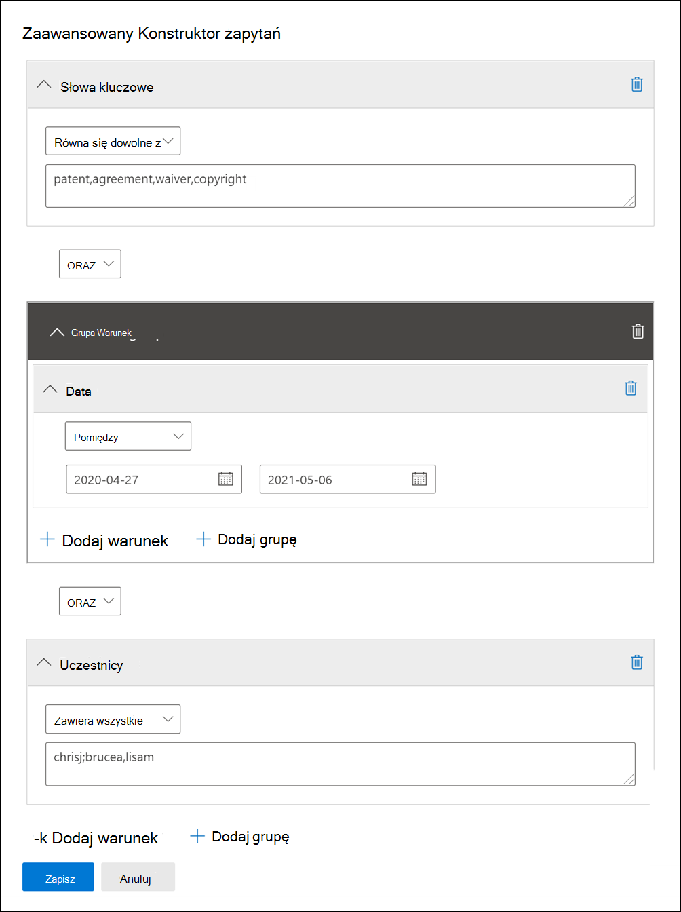

# Wykonuj zapytania i filtruj zawartość w zestawie do przeglądu

W większości przypadków warto zagłębić się w zawartość w zestawie przeglądów i zorganizować ją w celu ułatwienia bardziej wydajnego przeglądu. Używanie filtrów i zapytań w zestawie przeglądów pomaga skupić się na podzbiorze dokumentów spełniających kryteria przeglądu.

## Filtry domyślne

W zestawie przeglądów istnieje pięć domyślnych filtrów, które są wstępnie załadowane w zestawie przeglądów:

- Słowa kluczowe
- Data
- Nadawca/autor
- Temat/tytuł
- Tagi

Kliknij każdy filtr, aby go rozwinąć i przypisać wartość. Kliknij poza filtrem, aby automatycznie zastosować filtr do zestawu przeglądów. Poniższy zrzut ekranu przedstawia filtr Daty skonfigurowany do wyświetlania dokumentów w zakresie dat.

## Dodawanie lub usuwanie filtrów

Aby dodać lub usunąć filtry wyświetlane dla zestawu przeglądów, wybierz pozycję **Filtry** , aby otworzyć panel filtru, który jest wyświetlany na stronie wysuwanej. 

Dostępne filtry są zorganizowane w czterech sekcjach:

- **Wyszukiwanie**: filtry, które zapewniają różne możliwości wyszukiwania.

- **Analiza & kodowanie predykcyjne**: filtry właściwości wygenerowanych i dodanych do dokumentów podczas **uruchamiania zadania analitycznego & wiadomości e-mail lub używania** modeli kodowania predykcyjnego.

- **Identyfikatory: filtruje** wszystkie właściwości identyfikatorów dokumentów.

- **Właściwości elementu**: filtry właściwości dokumentu. 

Rozwiń każdą sekcję i wybierz lub usuń zaznaczenie filtrów, aby dodać lub usunąć je w zestawie filtrów. Po dodaniu filtru jest on wyświetlany w zestawie filtrów. 

> [!NOTE]
> Gdy rozwiniesz sekcję w panelu filtru, zauważysz, że wybrane są domyślne typy filtrów. Można je zachować lub usunąć zaznaczenie i usunąć je z zestawu filtrów. 

## Typy filtrów

Każde pole z możliwością wyszukiwania w zestawie przeglądów ma odpowiedni filtr, którego można użyć do filtrowania elementów na podstawie określonego pola.

Istnieje wiele typów filtrów:

- **Freetext**: filtr tekstu wolnego jest stosowany do pól tekstowych, takich jak "Temat". Możesz wyświetlić listę wielu wyszukiwanych terminów, oddzielając je przecinkami.

- **Data**: Filtr daty jest używany dla pól daty, takich jak "Data ostatniej modyfikacji".

- **Opcje wyszukiwania**: filtr opcji wyszukiwania zawiera listę możliwych wartości (każda wartość jest wyświetlana z polem wyboru, które można wybrać) dla określonych pól w przeglądzie. Ten filtr jest używany dla pól, takich jak "Nadawca", gdzie w zestawie przeglądów istnieje skończona liczba możliwych wartości.

- **Słowo kluczowe**: warunek słowa kluczowego to określone wystąpienie warunku wolnego tekstu, którego można użyć do wyszukiwania terminów. W tym typie filtru można również użyć języka zapytań przypominającego język KQL. Aby uzyskać więcej informacji, zobacz sekcje Język zapytań i Zaawansowany konstruktor zapytań w tym artykule.

## Uwzględnianie i wykluczanie relacji filtru

Możesz zmienić relację dołączania i wykluczania dla określonego filtru. Na przykład w filtrze Tag można wykluczyć elementy oznaczone określonym tagiem, wybierając pozycję **Równa się żadnemu z elementów** w filtrze listy rozwijanej. 

## Zapisywanie filtrów jako zapytań

Po spełnieniu filtrów możesz zapisać kombinację filtrów jako zapytanie filtru. Dzięki temu można zastosować filtr w przyszłych sesjach przeglądu.

Aby zapisać filtr, wybierz pozycję **Zapisz zapytanie i nadaj** mu nazwę. Ty lub inni recenzenci możesz uruchamiać wcześniej zapisane zapytania filtru, wybierając listę rozwijaną **Zapisane zapytania filtru** i wybierając zapytanie filtru do zastosowania w celu przejrzenia zestawu dokumentów. 

Aby usunąć zapytanie filtru, otwórz panel filtru i wybierz ikonę kosza obok zapytania.

## Język zapytań

Oprócz używania filtrów możesz również użyć języka zapytań podobnego do języka KQL w filtrze Słowa kluczowe, aby utworzyć zapytanie wyszukiwania zestawu przeglądów. Język zapytań dla zapytań zestawu przeglądów obsługuje standardowe operatory logiczne, takie jak **AND**, **OR**, **NOT** i **NEAR**. Obsługuje również symbol wieloznaczny (?) z jednym znakiem i wieloznacznym symbolem wieloznacznym (*).

## Zaawansowany konstruktor zapytań

Możesz również tworzyć bardziej zaawansowane zapytania w celu wyszukiwania dokumentów w zestawie przeglądów.

1. Otwórz panel filtru, wybierz pozycję **Filtry** i rozwiń sekcję **Wyszukaj** .

  

2. Wybierz filtr **KQL** i kliknij pozycję **Otwórz konstruktora zapytań**.

   W tym panelu można tworzyć złożone zapytania KQL przy użyciu konstruktora zapytań. Możesz dodać warunki lub dodać grupy warunków składające się z wielu warunków, które są logicznie połączone przez relacje **AND** lub **OR** .

   

## Filtrowanie częściowo indeksowanych elementów

Jeśli wybrano opcję dodania częściowo zaindeksowanych elementów z dodatkowych źródeł danych po zatwierdzeniu kolekcji roboczej do zestawu przeglądów. Prawdopodobnie chcesz zidentyfikować i wyświetlić te elementy, aby określić, czy element może być istotny dla badania i czy należy skorygować błąd, który spowodował częściowe zaindeksowanie elementu.

Obecnie w zestawie przeglądów nie ma opcji filtru umożliwiającej wyświetlanie częściowo zaindeksowanych elementów. Ale pracujemy nad tym. Do tego czasu można filtrować i wyświetlać częściowo indeksowane elementy dodane do zestawu przeglądów.

1. Utwórz kolekcję i zatwierdź ją w nowym zestawie przeglądów *bez* dodawania częściowo indeksowanych elementów z dodatkowych źródeł danych.

2. Utwórz nową kolekcję, kopiując kolekcję z kroku 1.

3. Zatwierdź nową kolekcję w tym samym zestawie przeglądów. Tym razem jednak dodaj częściowo zaindeksowane elementy z dodatkowych źródeł danych. Ponieważ elementy z kolekcji utworzonej w kroku 1 zostały już dodane do zestawu przeglądów, tylko częściowo zaindeksowane elementy z drugiej kolekcji są dodawane do zestawu przeglądów.

4. Po dodaniu obu kolekcji do zestawu przeglądów przejdź do zestawu przeglądów i wybierz pozycję **Zarządzaj zestawami** > **obciążenia**.

5. Skopiuj lub **zanotuj identyfikator obciążenia** dla drugiej kolekcji (utworzonej w kroku 2). Nazwa kolekcji jest identyfikowana w kolumnie **Informacje o źródle** .

6. Wróć do zestawu przeglądów, kliknij pozycję **Filtruj**, rozwiń **sekcję Identyfikatory** , a następnie zaznacz pole wyboru **Identyfikator obciążenia** .

7. Rozwiń filtr **Load Id (Załaduj identyfikator** ), a następnie zaznacz pole wyboru identyfikatora obciążenia odpowiadającego drugiej kolekcji, aby wyświetlić częściowo zaindeksowane elementy.
