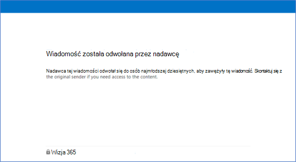

# <a name="revoke-email-encrypted-by-advanced-message-encryption"></a>Odwoływanie wiadomości e-mail zaszyfrowanych za pomocą zaawansowanego szyfrowania wiadomości

Odwołanie wiadomości e-mail jest oferowane w ramach zaawansowanego szyfrowania komunikatów usługi Microsoft Purview. Zaawansowane szyfrowanie komunikatów w usłudze Microsoft Purview jest zawarte w [Microsoft 365 Enterprise E5](https://www.microsoft.com/microsoft-365/enterprise/home), Office 365 E5, Microsoft 365 E5 (cennik pracowników organizacji non-profit), Office 365 Enterprise E5 (cennik personelu organizacji non-profit) i Office 365 Education A5. Aby użyć funkcji odwołania i wygaśnięcia zaawansowanego szyfrowania komunikatów, włącz opcję **Szyfrowanie Premium w Office 365** w licencji E5.

Jeśli Twoja organizacja ma subskrypcję, która nie obejmuje zaawansowanego szyfrowania komunikatów w usłudze Microsoft Purview, możesz ją kupić za pomocą dodatku Zgodność platformy Microsoft 365 E5 SKU dla Microsoft 365 E3, Microsoft 365 E3 (cennik personelu organizacji non-profit) lub dodatek Office 365 Advanced Compliance jednostki SKU dla Microsoft 365 E3, Microsoft 365 E3 (cennik pracowników organizacji non-profit) lub jednostek SKU Office 365.

Ten artykuł jest częścią większej serii artykułów na temat [Office 365 szyfrowania komunikatów](ome.md).

Jeśli wiadomość została zaszyfrowana przy użyciu zaawansowanego szyfrowania komunikatów usługi Microsoft Purview i jesteś administratorem platformy Microsoft 365 lub jesteś nadawcą wiadomości, możesz odwołać tę wiadomość pod pewnymi warunkami. Administratorzy odwołują komunikaty przy użyciu programu PowerShell. Jako nadawca odwołasz wiadomość wysłaną bezpośrednio z Outlook w sieci Web. W tym artykule opisano okoliczności, w których możliwe jest odwołanie i jak to zrobić.

> [!NOTE]
> Aby zagwarantować, że możliwość śledzenia i odwoływania komunikatów OME jest dostępna, należy dodać niestandardowy szablon znakowania. Zobacz [Dodawanie marki organizacji do zaszyfrowanych komunikatów](add-your-organization-brand-to-encrypted-messages.md)
  
## <a name="encrypted-emails-that-you-can-revoke"></a>Zaszyfrowane wiadomości e-mail, które można odwołać

Administratorzy i nadawcy wiadomości mogą odwołać zaszyfrowane wiadomości e-mail, jeśli adresat otrzymał wiadomość e-mail opartą na linkach. Jeśli odbiorca otrzymał natywne środowisko wbudowane w obsługiwanym kliencie programu Outlook, nie można odwołać komunikatu.

To, czy odbiorca otrzymuje środowisko oparte na linkach, czy środowisko wbudowane, zależy od typu tożsamości adresata: Office 365 i adresaci konta Microsoft (na przykład outlook.com użytkownicy) uzyskują wbudowane środowisko w obsługiwanych klientach programu Outlook. Wszystkie inne typy adresatów, takie jak adresaci Gmail i Yahoo, otrzymują środowisko oparte na linkach.

Administratorzy i nadawcy wiadomości mogą odwoływać wiadomości szyfrowane przy użyciu szyfrowania stosowanego bezpośrednio z Outlook w sieci Web. Na przykład komunikaty szyfrowane za pomocą opcji Szyfruj tylko.

:::image type="content" source="../media/adhocencryptionrevoke.png" alt-text="Zrzut ekranu przedstawiający opcję Szyfruj tylko w Outlook w sieci Web.":::

## <a name="recipient-experience-for-revoked-encrypted-emails"></a>Środowisko adresatów odwołanych zaszyfrowanych wiadomości e-mail

Po odwołaniu wiadomości e-mail adresat otrzymuje błąd podczas uzyskiwania dostępu do zaszyfrowanej wiadomości e-mail za pośrednictwem portalu szyfrowania wiadomości Office 365: "Wiadomość została odwołana przez nadawcę".



## <a name="how-to-revoke-an-encrypted-message-that-you-sent"></a>Jak odwołać wysłaną zaszyfrowaną wiadomość

Możesz odwołać wiadomość e-mail wysłaną do jednego adresata korzystającego z konta społecznościowego, takiego jak gmail.com lub yahoo.com. Innymi słowy, możesz odwołać wiadomość e-mail wysłaną do jednego adresata, który otrzymał środowisko oparte na linkach.

Nie można odwołać wiadomości e-mail wysłanej do adresata korzystającego z konta służbowego z Office 365, platformy Microsoft 365 lub użytkownika korzystającego z konta Microsoft, na przykład konta outlook.com. 

Aby odwołać wysłaną zaszyfrowaną wiadomość, wykonaj te kroki

1. W Outlook w sieci Web w folderze **Wysłane** przejdź do komunikatu, który chcesz odwołać.

   Jeśli poczta jest odwoływalna, w górnej części wiadomości zostanie wyświetlony link "Usuń dostęp zewnętrzny".

    :::image type="content" source="../media/infoprotect-email-encryption/adhocencryptionrevokesentmsg.png" alt-text="Zrzut ekranu przedstawiający zaszyfrowaną pocztę, którą chcesz odwołać w Outlook w sieci Web.":::

2. Kliknij pozycję **Usuń dostęp zewnętrzny** , aby odwołać komunikat.

   Komunikat pokazuje, że jego stan został odwołany.

   :::image type="content" source="../media/adhocencryptionrevokedmsg.png" alt-text="Zrzut ekranu przedstawiający odwołaną zaszyfrowaną wiadomość w Outlook w sieci Web.":::

## <a name="how-to-revoke-an-encrypted-message-as-an-administrator"></a>Jak odwołać zaszyfrowaną wiadomość jako administrator

Administratorzy platformy Microsoft 365 wykonaj następujące ogólne kroki, aby odwołać kwalifikującą się zaszyfrowaną wiadomość e-mail:

- Pobierz identyfikator wiadomości e-mail.
- Sprawdź, czy możesz odwołać komunikat.
- Odwołaj wiadomość e-mail.

### <a name="step-1-obtain-the-message-id-of-the-email"></a>Krok nr 1. Uzyskiwanie identyfikatora wiadomości e-mail

Zanim będzie można odwołać zaszyfrowaną pocztę, zbierz identyfikator wiadomości. Identyfikator MessageId jest zwykle w formacie:

`<xxxxxxxxxxxxxxxxxxxxxxx@xxxxxx.xxxx.prod.outlook.com>`  

Istnieje wiele sposobów znajdowania identyfikatora wiadomości e-mail, którą chcesz odwołać. W tej sekcji opisano kilka opcji, ale można użyć dowolnej metody, która udostępnia identyfikator.

#### <a name="to-identify-the-message-id-of-the-email-you-want-to-revoke-by-using-message-trace-in-the-security-amp-compliance-center"></a>Aby zidentyfikować identyfikator wiadomości e-mail, którą chcesz odwołać, użyj śledzenia komunikatów w Centrum zgodności zabezpieczeń &amp;

1. Wyszukaj wiadomość e-mail według nadawcy lub odbiorcy przy użyciu [nowego śledzenia wiadomości w Centrum zgodności & zabezpieczeń](https://blogs.technet.microsoft.com/exchange/2018/05/02/new-message-trace-in-office-365-security-compliance-center/).

2. Po zlokalizowaniu wiadomości e-mail wybierz ją, aby wyświetlić okienko **Szczegóły śledzenia wiadomości** . Rozwiń węzeł **Więcej informacji,** aby zlokalizować identyfikator komunikatu.

#### <a name="to-identify-the-message-id-of-the-email-you-want-to-revoke-by-using-message-encryption-reports-in-the-security-amp-compliance-center"></a>Aby zidentyfikować identyfikator wiadomości e-mail, którą chcesz odwołać przy użyciu raportów szyfrowania komunikatów w Centrum zgodności zabezpieczeń &amp;

1. W Centrum zgodności zabezpieczeń &amp; przejdź do **raportu szyfrowania komunikatów**. Aby uzyskać informacje na temat tego raportu, zobacz [Wyświetlanie raportów zabezpieczeń poczty e-mail w Centrum zgodności zabezpieczeń&amp;](../security/office-365-security/view-email-security-reports.md).

2. Wybierz tabelę **Wyświetl szczegóły** i zidentyfikuj komunikat, który chcesz odwołać.

3. Kliknij dwukrotnie komunikat, aby wyświetlić szczegóły zawierające identyfikator komunikatu.

### <a name="step-2-verify-that-the-mail-is-revocable"></a>Krok nr 2. Sprawdź, czy poczta jest odwoływalna

Aby sprawdzić, czy można odwołać komunikat, sprawdź, czy pole Stan odwołania jest widoczne w raporcie Szyfrowanie w tabeli **Szczegóły** w Centrum zgodności zabezpieczeń &amp; .

Aby sprawdzić, czy można odwołać określoną wiadomość e-mail przy użyciu Windows PowerShell, wykonaj te kroki.

1. Korzystając z konta służbowego z uprawnieniami administratora globalnego w organizacji, rozpocznij sesję Windows PowerShell i połącz się z Exchange Online. Aby uzyskać instrukcje, zobacz [Connect to Exchange Online PowerShell (Nawiązywanie połączenia z programem PowerShell](/powershell/exchange/connect-to-exchange-online-powershell)).

2. Uruchom polecenie cmdlet Get-OMEMessageStatus w następujący sposób:

     ```powershell
     Get-OMEMessageStatus -MessageId "<message id>" | ft -a  Subject, IsRevocable
     ```

   To polecenie zwraca temat komunikatu i określa, czy komunikat jest odwoływalny. Na przykład:

     ```console
     Subject        IsRevocable
     -------        -----------
     "Test message" True
     ```

### <a name="step-3-revoke-the-mail"></a>Krok nr 3. Odwoływanie wiadomości e-mail

Gdy znasz identyfikator wiadomości e-mail, którą chcesz odwołać, i sprawdzisz, czy wiadomość jest odwoływalna, możesz odwołać wiadomość e-mail za pomocą Centrum zgodności zabezpieczeń &amp; lub Windows PowerShell.

Aby odwołać komunikat przy użyciu Centrum zgodności zabezpieczeń &amp;

1. Korzystając z konta służbowego z uprawnieniami administratora globalnego w organizacji, połącz się z Centrum zgodności & zabezpieczeń.

2. W **raporcie Szyfrowanie** w tabeli **Szczegóły** komunikatu wybierz pozycję **Odwołaj komunikat**.

Aby odwołać wiadomość e-mail przy użyciu Windows PowerShell, użyj polecenia cmdlet Set-OMEMessageRevocation.

1. Korzystając z konta służbowego z uprawnieniami administratora globalnego w organizacji, [połącz się z programem Exchange Online programu PowerShell](/powershell/exchange/connect-to-exchange-online-powershell).

2. Uruchom polecenie cmdlet Set-OMEMessageRevocation w następujący sposób:

    ```powershell
    Set-OMEMessageRevocation -Revoke $true -MessageId "<messageId>"
    ```

3. Aby sprawdzić, czy wiadomość e-mail została odwołana, uruchom polecenie cmdlet Get-OMEMessageStatus w następujący sposób:

    ```powershell
    Get-OMEMessageStatus -MessageId "<messageId>" | ft -a  Subject, Revoked
    ```

    Jeśli odwołanie zakończyło się pomyślnie, polecenie cmdlet zwraca następujący wynik:  

     ```console
     Revoked: True
     ```

## <a name="more-information-about-microsoft-purview-advanced-message-encryption"></a>Więcej informacji na temat zaawansowanego szyfrowania komunikatów w usłudze Microsoft Purview

- [Zaawansowane szyfrowanie komunikatów w usłudze Microsoft Purview](ome-advanced-message-encryption.md)

- [Zaawansowane szyfrowanie komunikatów usługi Microsoft Purview — wygaśnięcie poczty e-mail](ome-advanced-expiration.md)

- [Opis zasad komunikatów i usługi zgodności](/office365/servicedescriptions/exchange-online-service-description/message-policy-and-compliance)
