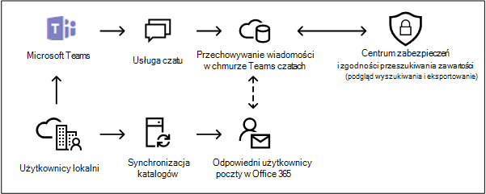

# <a name="search-for-teams-chat-data-for-on-premises-users"></a>Wyszukaj dane czatu aplikacji Teams dla użytkowników lokalnych

[!include[Purview banner](../includes/purview-rebrand-banner.md)]

Jeśli Twoja organizacja ma Exchange wdrożenie hybrydowe (lub organizacja synchronizuje lokalną organizację Exchange z Office 365) i włączyła Microsoft Teams, użytkownicy lokalni mogą używać aplikacji Teams czatu do obsługi wiadomości błyskawicznych. W przypadku użytkownika opartego na chmurze Teams dane czatu (*nazywane również czatami 1x1 lub 1xN*) są zapisywane w podstawowej skrzynce pocztowej opartej na chmurze. Gdy użytkownik lokalny korzysta z aplikacji czatu Teams, wiadomości czatu nie mogą być przechowywane w podstawowej skrzynce pocztowej, która znajduje się lokalnie. Aby obejść to ograniczenie, firma Microsoft wydała nową funkcję, w której utworzono chmurowy obszar magazynowania, dzięki czemu używasz narzędzi zbierania elektronicznych materiałów dowodowych do wyszukiwania i eksportowania Teams danych czatu dla użytkowników lokalnych.
  
Poniżej przedstawiono wymagania i ograniczenia dotyczące włączania magazynu w chmurze dla użytkowników lokalnych:
  
- Konta użytkowników w lokalnej usłudze katalogowej (np. Active Directory) muszą być synchronizowane z usługą Azure Active Directory, usługą katalogową w Microsoft 365. Oznacza to, że konto użytkownika poczty jest tworzone w Microsoft 365 i jest skojarzone z użytkownikiem, którego podstawowa skrzynka pocztowa znajduje się w organizacji lokalnej.

- Użytkownikowi, którego podstawowa skrzynka pocztowa znajduje się w organizacji lokalnej, musi mieć przypisaną licencję Microsoft Teams i co najmniej licencję Exchange Online plan 1.

- Jeśli twoja organizacja nie ma wdrożenia hybrydowego Exchange, musisz zsynchronizować schemat Exchange lokalnego w celu Azure Active Directory. Jeśli tego nie zrobisz, możesz ryzykować utworzenie zduplikowanych chmurowych skrzynek pocztowych w Exchange Online dla użytkowników, którzy mają skrzynkę pocztową w lokalnej organizacji Exchange.

- W obszarze magazynu opartym na chmurze są przechowywane tylko dane rozmów Teams skojarzone z użytkownikiem lokalnym. Użytkownik lokalny nie może w żaden sposób uzyskać dostępu do tego obszaru magazynowania.

> [!NOTE]
> Teams konwersacje kanału są zawsze przechowywane w chmurowej skrzynce pocztowej skojarzonej z zespołem, co oznacza, że możesz wyszukiwać konwersacje na kanale. Aby uzyskać więcej informacji na temat wyszukiwania konwersacji w kanale Teams, zobacz [Wyszukiwanie Microsoft Teams i Grupy Microsoft 365](content-search-reference.md#searching-microsoft-teams-and-microsoft-365-groups).
  
## <a name="how-it-works"></a>Jak to działa

Jeśli użytkownik z obsługą Microsoft Teams ma lokalną skrzynkę pocztową, a jego konto/tożsamość użytkownika zostały zsynchronizowane z chmurą, firma Microsoft tworzy magazyn oparty na chmurze, aby skojarzyć dane rozmów 1xN użytkownika lokalnego Teams. Teams dane czatu dla użytkowników lokalnych są indeksowane do wyszukiwania. Umożliwia to wyszukiwanie zawartości (i wyszukiwania skojarzone z przypadkami zbierania elektronicznych materiałów dowodowych w usłudze Microsoft Purview (Standard) i Microsoft Purview (Premium) w celu wyszukiwania, podglądu i eksportowania Teams danych czatu dla użytkowników lokalnych. Możesz również użyć poleceń **\*cmdlet ComplianceSearch** w programie PowerShell Security & Compliance Center, aby wyszukać Teams danych czatu dla użytkowników lokalnych.
  
Na poniższej ilustracji przedstawiono przepływ pracy, w jaki sposób Teams dane czatu dla użytkowników lokalnych są dostępne do wyszukiwania, wyświetlania podglądu i eksportowania.
  

  
Oprócz tej możliwości można również używać narzędzi zbierania elektronicznych materiałów dowodowych do wyszukiwania, podglądu i eksportowania zawartości Teams w witrynie SharePoint opartej na chmurze oraz skrzynki pocztowej Exchange skojarzonej z każdym zespołem firmy Microsoft i 1xN Teams danych czatu w skrzynce pocztowej Exchange Online dla użytkowników w chmurze.

## <a name="searching-for-teams-chat-content-for-on-premises-users"></a>Wyszukiwanie zawartości czatu Teams dla użytkowników lokalnych

Poniżej przedstawiono sposób wyszukiwania zawartości w portalu zgodności usługi Microsoft Purview w celu wyszukiwania Teams danych czatu dla użytkowników lokalnych. Możesz również użyć narzędzia wyszukiwania w usłudze eDiscovery (Standard), aby wyszukać dane czatu dla użytkowników lokalnych.
  
1. W portalu zgodności przejdź do **pozycji Wyszukiwanie zawartości**.

2. Na karcie **Wyszukiwania** kliknij pozycję **Nowe wyszukiwanie** i nadaj nowemu wyszukiwaniu nazwę.

3. Na stronie **Lokalizacje** ustaw przełącznik **w pozycji Włączone** dla Exchange skrzynek pocztowych.

4. Aby wyszukać zawartość Teams dla określonych użytkowników (w tym użytkowników lokalnych), wybierz pozycję **Wybierz użytkownika, grupy lub zespoły** i wybierz określonych użytkowników do uwzględnienia w wyszukiwaniu. Jeśli nie wyświetlisz listy określonych użytkowników, wyszukiwanie będzie obejmować wszystkich użytkowników, w tym użytkowników lokalnych.

5. Upewnij się, że zaznaczono pole wyboru **Dodaj zawartość aplikacji dla użytkowników lokalnych** . Dzięki temu magazyn baz danych w chmurze dla użytkowników lokalnych zostanie przeszukany.

    

6. Na stronie **Definiowanie warunków wyszukiwania** utwórz zapytanie słowa kluczowego i w razie potrzeby dodaj warunki do zapytania wyszukiwania. Aby wyszukać tylko dane czatów zespołowych, możesz dodać następujące zapytanie w polu **Słowa kluczowe** :

    ```text
    kind:im AND kind:microsoftteams
    ```

6. Prześlij i uruchom wyszukiwanie. Wszystkie wyniki wyszukiwania dla użytkowników lokalnych można wyświetlić w wersji zapoznawczej, podobnie jak w przypadku innych wyników wyszukiwania. Możesz również wyeksportować wyniki wyszukiwania (w tym wszystkie Teams dane czatu) do pliku PST. Więcej informacji można znaleźć w następujących artykułach:

    - [Tworzenie wyszukiwania](content-search.md)

    - [Podgląd wyników wyszukiwania](preview-ediscovery-search-results.md)

    - [Eksportuj wyniki wyszukiwania](export-search-results.md)

## <a name="using-powershell-to-search-for-teams-chat-data-for-on-premises-users"></a>Wyszukiwanie Teams danych czatu dla użytkowników lokalnych przy użyciu programu PowerShell

Polecenia cmdlet **New-ComplianceSearch** w programie PowerShell Centrum zgodności & zabezpieczeń umożliwiają wyszukiwanie Teams danych czatu dla użytkowników lokalnych. Jak wyjaśniono wcześniej, nie trzeba przesyłać wniosku o pomoc techniczną, aby użyć programu PowerShell do wyszukiwania Teams danych czatu dla użytkowników lokalnych.
  
1. [Połączenie do programu PowerShell Centrum zgodności & zabezpieczeń](/powershell/exchange/connect-to-scc-powershell).

2. Uruchom następujące polecenie programu PowerShell, aby utworzyć wyszukiwanie zawartości, które wyszukuje Teams danych czatu dla użytkowników lokalnych.

    ```powershell
    New-ComplianceSearch <name of new search> -ContentMatchQuery <search query> -ExchangeLocation <on-premises user> -IncludeUserAppContent $true -AllowNotFoundExchangeLocationsEnabled $true  
    ```

    Parametr *IncludeUserAppContent*  służy do określania magazynu opartego na chmurze dla użytkownika lub użytkowników określonych przez parametr  *ExchangeLocation*  . *Obiekt AllowNotFoundExchangeLocationsEnabled* umożliwia przeszukiwanie magazynu opartego na chmurze dla użytkowników lokalnych. Jeśli używasz `$true` wartości dla tego parametru, wyszukiwanie nie próbuje zweryfikować istnienia skrzynki pocztowej przed jej uruchomieniem. Jest to wymagane do wyszukiwania magazynu w chmurze dla użytkowników lokalnych, ponieważ ten magazyn oparty na chmurze nie jest rozpoznawany jako zwykła skrzynka pocztowa oparta na chmurze.

    Poniższy przykład wyszukuje Teams czatów zawierających słowo kluczowe "redstone" w magazynie opartym na chmurze dla Sary Davis, która jest użytkownikiem lokalnym w organizacji firmy Contoso.
  
    ```powershell
    New-ComplianceSearch "Redstone_Search" -ContentMatchQuery "redstone AND (kind:im AND kind:microsoftteams)" -ExchangeLocation sarad@contoso.com -IncludeUserAppContent $true -AllowNotFoundExchangeLocationsEnabled $true  
    ```

   Po utworzeniu wyszukiwania należy użyć polecenia cmdlet **Start-ComplianceSearch** do uruchomienia wyszukiwania.
  
Aby uzyskać więcej informacji na temat korzystania z tych poleceń cmdlet, zobacz:
  
- [New-ComplianceSearch](/powershell/module/exchange/new-compliancesearch)

- [Start-ComplianceSearch](/powershell/module/exchange/start-compliancesearch)

## <a name="known-issues"></a>Znane problemy

- Obecnie można wyszukiwać, wyświetlać podgląd i eksportować Teams danych czatu dla użytkowników lokalnych. Możesz również umieścić Teams dane czatu dla użytkownika lokalnego w blokadzie skojarzonej ze sprawą dotyczącą platformy Core lub eDiscovery (Premium) i zastosować zasady przechowywania dla Teams czatów lub komunikatów kanału dla użytkowników lokalnych. Jednak w tej chwili nie można zastosować zasad przechowywania dla innych lokalizacji zawartości (takich jak skrzynki pocztowe Exchange i witryny SharePoint) dla użytkowników lokalnych.

## <a name="frequently-asked-questions"></a>Często zadawane pytania

**Czy muszę przesłać wniosek o pomoc techniczną, aby wyszukać wiadomości czatu dla użytkowników lokalnych?**

L.p. Ta funkcja jest domyślnie włączona dla wszystkich organizacji. W pewnym momencie trzeba było skontaktować się z pomoc techniczna firmy Microsoft ale tak już nie jest.
  
 **Czy narzędzia zbierania elektronicznych materiałów dowodowych mogą znaleźć starsze Teams danych czatu dla użytkowników lokalnych przed włączeniem tej funkcji domyślnie dla wszystkich organizacji?**
  
31 stycznia 2018 r. firma Microsoft rozpoczęła przechowywanie danych czatu Teams dla użytkowników lokalnych. Jeśli więc tożsamość lokalnego użytkownika Teams została zsynchronizowana między Tobą lokalna usługa Active Directory i Azure Active Directory w Microsoft 365 od tej daty, Teams dane czatu są przechowywane w chmurze i można je przeszukiwać przy użyciu Narzędzia zbierania elektronicznych materiałów dowodowych.

 **Czy użytkownicy lokalni potrzebują licencji na przechowywanie Teams danych czatu w chmurze?**
  
Tak. Aby przechowywać Teams dane rozmów dla użytkownika lokalnego w magazynie w chmurze, użytkownikowi musi zostać przypisana licencja Microsoft Teams i licencja planu Exchange Online w Office 365 (lub Microsoft 365).

**Gdzie znajduje się magazyn oparty na chmurze dla użytkowników lokalnych?**
  
Teams dane rozmów są przechowywane w preferowanej lokalizacji danych (PDL) dla użytkownika lokalnego. Biblioteka PDL jest honorowana zarówno w środowiskach Single-Geo, jak i Multi-Geo. Aby uzyskać więcej informacji, zobacz [Microsoft 365 Multi-Geo](../enterprise/microsoft-365-multi-geo.md).

**Czy istnieje ryzyko utraty Teams danych czatu, jeśli lokalna skrzynka pocztowa użytkownika zostanie zmigrowana do chmury?**
  
L.p. Podczas migracji podstawowej skrzynki pocztowej użytkownika lokalnego do chmury Teams dane rozmów dla tego użytkownika zostaną zmigrowane do nowej podstawowej skrzynki pocztowej opartej na chmurze.
  
 **Czy mogę zastosować zasady przechowywania lub przechowywania zbierania elektronicznych materiałów dowodowych do użytkowników lokalnych?**
  
Tak. Zasady zbierania elektronicznych materiałów dowodowych lub przechowywania można stosować w przypadku Teams czatów i komunikatów kanałów użytkowników lokalnych. Jednak aby zachować lub zachować zawartość Teams dla użytkowników lokalnych, użytkownikowi lokalnemu należy przypisać licencję Exchange Online plan 2.
