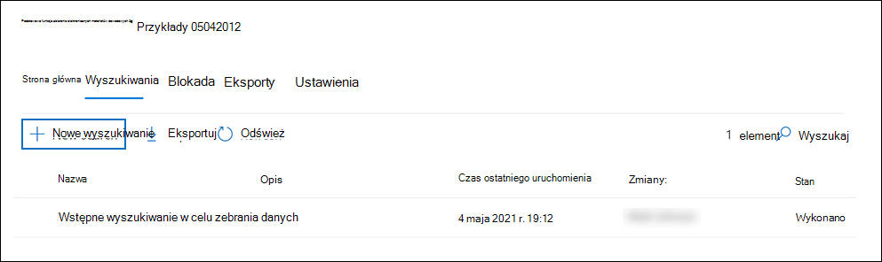

# Wyszukiwanie zawartości w przypadku zbierania elektronicznych materiałów dowodowych (standardowa)

Po utworzeniu sprawy zbierania elektronicznych materiałów dowodowych w usłudze Microsoft Purview (w warstwie Standardowa) i umieszczeniu osób interesujących się sprawą można utworzyć i uruchomić co najmniej jedno wyszukiwanie zawartości istotnej dla sprawy. Wyszukiwania skojarzone ze sprawą zbierania elektronicznych materiałów dowodowych (Standardowa) nie są wyświetlane na stronie **wyszukiwania zawartości** w portalu zgodności usługi Microsoft Purview. Te wyszukiwania są wyświetlane na stronie **Wyszukiwania** w przypadku podstawowego zbierania elektronicznych materiałów dowodowych, z które są skojarzone wyszukiwania. Oznacza to również, że do wyszukiwań skojarzonych ze sprawą mogą uzyskiwać dostęp tylko członkowie sprawy.

Aby utworzyć wyszukiwanie zbierania elektronicznych materiałów dowodowych (w warstwie Standardowa):
  
1. Przejdź do strony <https://compliance.microsoft.com> i zaloguj się przy użyciu poświadczeń dla konta użytkownika, do których przypisano odpowiednie uprawnienia zbierania elektronicznych materiałów dowodowych i jest członkiem sprawy.

2. W okienku nawigacji po lewej stronie portalu zgodności kliknij pozycję **Pokaż wszystko**, a następnie kliknij pozycję **eDiscovery > Core**.

3. Na stronie **eDiscovery (Standard)** wybierz przypadek, w przypadku, który chcesz utworzyć skojarzone wyszukiwanie, a następnie kliknij pozycję **Otwórz przypadek**.

4. Na stronie **głównej** sprawy kliknij kartę **Wyszukiwania** , a następnie kliknij pozycję **Nowe wyszukiwanie**.

   

5. W Kreatorze **wyszukiwania Nowy** wpisz nazwę wyszukiwania i opcjonalny opis, który pomaga zidentyfikować wyszukiwanie. Nazwa wyszukiwania musi być unikatowa w organizacji.

6. Na stronie **Lokalizacje** wybierz lokalizacje zawartości, które chcesz wyszukać. Możesz przeszukiwać skrzynki pocztowe, witryny i foldery publiczne.

    
  
   1. **Exchange skrzynki pocztowe**: ustaw przełącznik **na Włączone**, a następnie kliknij pozycję **Wybierz użytkowników, grupy lub zespoły,** aby określić skrzynki pocztowe, które mają zostać wstrzymane. Użyj pola wyszukiwania, aby znaleźć skrzynki pocztowe użytkowników i grupy dystrybucyjne (aby zatrzymać skrzynki pocztowe członków grupy), aby zostać wstrzymane. Możesz również wyszukać skrzynkę pocztową skojarzoną z zespołem firmy Microsoft (w poszukiwaniu wiadomości kanału), grupę Office 365 i grupę Yammer. Aby uzyskać więcej informacji na temat danych aplikacji przechowywanych w skrzynkach pocztowych, zobacz [Zawartość przechowywana w skrzynkach pocztowych na potrzeby zbierania elektronicznych materiałów dowodowych](what-is-stored-in-exo-mailbox.md).

   2. **SharePoint witryn**: ustaw przełącznik **na Wł**., a następnie kliknij pozycję **Wybierz witryny**, aby określić, SharePoint witryny i konta OneDrive, które mają zostać wstrzymane. Wpisz adres URL każdej witryny, która ma zostać wstrzymana. Możesz również dodać adres URL witryny SharePoint dla zespołu firmy Microsoft, grupy Office 365 lub grupy Yammer.
  
   3. **Exchange folderów publicznych**: ustaw przełącznik **na Wł**., aby wstrzymać wszystkie foldery publiczne w organizacji Exchange Online. Nie można wybrać określonych folderów publicznych do wstrzymania. Pozostaw przełącznik wyłączony, jeśli nie chcesz wstrzymać folderów publicznych.
  
   4. Zaznacz to pole wyboru, aby wyszukać zawartość Teams dla użytkowników lokalnych. Jeśli na przykład przeszukasz wszystkie Exchange skrzynki pocztowe w organizacji i to pole wyboru zostanie zaznaczone, magazyn oparty na chmurze używany do przechowywania Teams danych czatu dla użytkowników lokalnych zostanie uwzględniony w zakresie wyszukiwania. Aby uzyskać więcej informacji, zobacz [Wyszukiwanie Teams danych czatu dla użytkowników lokalnych](search-cloud-based-mailboxes-for-on-premises-users.md).

7. Na stronie **Definiowanie warunków wyszukiwania** wpisz zapytanie słowa kluczowego i w razie potrzeby dodaj warunki do zapytania wyszukiwania.

   

   1. Określ słowa kluczowe, właściwości komunikatu, takie jak daty wysłania i odebrania, lub właściwości dokumentu, takie jak nazwy plików lub data ostatniej zmiany dokumentu. Możesz użyć bardziej złożonych zapytań, które używają operatora logicznego, takiego jak **AND**, **OR**, **NOT** i **NEAR**. Jeśli pole słowa kluczowego pozostanie puste, cała zawartość znajdująca się w określonych lokalizacjach zawartości zostanie uwzględniona w wynikach wyszukiwania. Aby uzyskać więcej informacji, zobacz [Zapytania dotyczące słów kluczowych i warunki wyszukiwania dla zbierania elektronicznych materiałów dowodowych](keyword-queries-and-search-conditions.md).

   2. Alternatywnie możesz kliknąć pole wyboru **Pokaż listę słów kluczowych** i wpisać słowo kluczowe w każdym wierszu. Jeśli to zrobisz, słowa kluczowe w każdym wierszu są połączone przez operator logiczny (**c:s**), który jest podobny do operatora **OR** w utworzonym zapytaniu wyszukiwania.

      Dlaczego warto używać listy słów kluczowych? Możesz uzyskać statystyki pokazujące, ile elementów pasuje do każdego słowa kluczowego. Może to pomóc w szybkim określeniu, które słowa kluczowe są najbardziej (i najmniej) skuteczne. Możesz również użyć frazy kluczowej (otoczonej nawiasami) w wierszu. Aby uzyskać więcej informacji na temat listy słów kluczowych i statystyk wyszukiwania, zobacz [Pobieranie statystyk słów kluczowych dla wyszukiwań](view-keyword-statistics-for-content-search.md#get-keyword-statistics-for-searches).

      > [!NOTE]
      > Aby zmniejszyć problemy spowodowane przez duże listy słów kluczowych, możesz ograniczyć do maksymalnie 20 wierszy na liście słów kluczowych.

   3. Możesz dodać warunki wyszukiwania, aby zawęzić wyszukiwanie i zwrócić bardziej wyrafinowany zestaw wyników. Każdy warunek dodaje klauzulę do zapytania wyszukiwania, które jest tworzone i uruchamiane po rozpoczęciu wyszukiwania. Warunek jest logicznie połączony z zapytaniem słowa kluczowego (określonym w polu słowa kluczowego) przez operator logiczny (**c:c**), który jest podobny pod względem funkcjonalności do operatora **AND** . Oznacza to, że elementy muszą spełniać zarówno zapytanie słowa kluczowego, jak i co najmniej jeden warunk, który ma zostać uwzględniony w wynikach. W ten sposób warunki pomagają zawęzić wyniki. Aby uzyskać listę i opis warunków, których można użyć w zapytaniu wyszukiwania, zobacz [Warunki wyszukiwania](keyword-queries-and-search-conditions.md#search-conditions).

8. Przejrzyj ustawienia wyszukiwania (i edytuj je w razie potrzeby), a następnie prześlij wyszukiwanie, aby je uruchomić.

Po zakończeniu wyszukiwania możesz wyświetlić podgląd wyników wyszukiwania. W razie potrzeby kliknij pozycję **Odśwież** na stronie **Wyszukiwania** , aby wyświetlić utworzone wyszukiwanie.

## Więcej informacji na temat wyszukiwania lokalizacji zawartości

- Po kliknięciu pozycji **Wybierz użytkowników, grupy lub zespoły w** celu określenia skrzynek pocztowych do wyszukania wyświetlany selektor skrzynki pocztowej jest pusty. Jest to z założenia w celu zwiększenia wydajności. Aby dodać adresatów do tej listy, kliknij pozycję **Wybierz użytkowników, grupy lub zespoły**, wpisz nazwę (co najmniej trzy znaki) w polu wyszukiwania, zaznacz pole wyboru obok nazwy, a następnie kliknij pozycję **Wybierz**.

- Do listy skrzynek pocztowych do wyszukiwania można dodawać nieaktywne skrzynki pocztowe, Microsoft Teams, grupy Yammer, grupy Office 365 i grupy dystrybucyjne. Dynamiczne grupy dystrybucji nie są obsługiwane. Jeśli dodasz Microsoft Teams, Yammer grupy lub grupy Office 365, zostanie przeszukana skrzynka pocztowa grupy lub zespołu. Skrzynki pocztowe członków grupy nie będą przeszukiwane.

- Aby dodać witryny do wyszukiwania, włącz przełącznik, a następnie kliknij pozycję **Wybierz witryny**. Wpisz adres URL każdej witryny, którą chcesz wyszukać. Możesz również dodać adres URL witryny SharePoint dla zespołu firmy Microsoft, grupy Yammer lub grupy Office 365.
