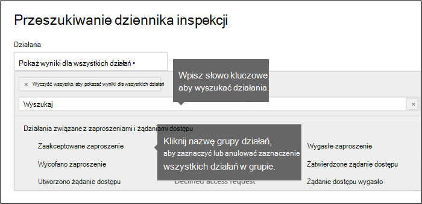
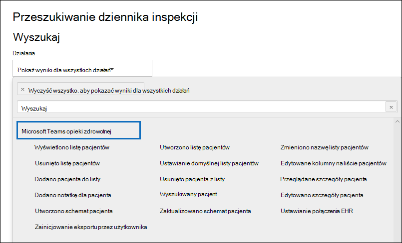

# <a name="search-the-audit-log-in-the-compliance-center"></a>Przeszukiwanie dziennika inspekcji w centrum zgodności

Chcesz sprawdzić, czy użytkownik przeglądał określony dokument lub czyszczył określony element ze skrzynki pocztowej? Jeśli tak, możesz użyć narzędzia do przeszukiwania dziennika inspekcji w programie Centrum zgodności platformy Microsoft 365 przeszukiwać ujednolicony dziennik inspekcji w celu wyświetlania aktywności użytkowników i administratorów w organizacji. Tysiące operacji wykonywanych przez użytkowników i administratorów w dziesiątkach Microsoft 365 usług i rozwiązań są rejestrowane, rejestrowane i przechowywane w ujednoliconym dzienniku inspekcji organizacji. Użytkownicy w organizacji mogą używać narzędzia do przeszukiwania dziennika inspekcji do wyszukiwania, wyświetlania i eksportowania (do pliku CSV) rekordów inspekcji dla tych operacji.

## <a name="microsoft-365-services-that-support-auditing"></a>Microsoft 365, które obsługują inspekcję

Dlaczego ujednolicony dziennik inspekcji? W dzienniku inspekcji można wyszukiwać działania wykonywane w różnych Microsoft 365 usługach. W poniższej tabeli wymieniono usługi Microsoft 365 funkcje (w kolejności alfabetycznej) obsługiwane przez ujednolicony dziennik inspekcji.

| Microsoft 365 usługi lub funkcji | Typy rekordów|
|:---------|:---------|
| Azure Active Directory|AzureActiveDirectory, AzureActiveDirectoryAccountLogon, AzureActiveDirectoryStsLogon |
| Azure Information Protection|AipDiscover, AipSensitivityLabelAction, AipProtectionAction, AipFileDeleted, AipHeartBeat |
| Zgodność komunikacji|ComplianceSuperVisionExchange|
| Eksplorator zawartości|LabelContentExplorer|
| Ochrona przed utratą danych (DLP)|ComplianceDLPSharePoint, ComplianceDLPExchange, DLPEndpoint|
| Dynamics 365|CRM|
| zbierania elektronicznych materiałów dowodowych|Odnajdowanie, AeD|
| Dokładne dopasowanie danych|MipExactDataMatch|
| Exchange Online|ExchangeAdmin, ExchangeItem, ExchangeItemAggregated |
| Formularze|MicrosoftForms|
| Bariery informacyjne|InformationBarrierPolicyApplication|
| Microsoft 365 Defender|AirInvestigation, AirManualInvestigation, AirAdminActionInvestigation, MS365DCustomDetection|
| Microsoft Teams|MicrosoftTeams|
| MyAnalytics|MyAnalyticsSettings|
| OneDrive dla Firm|OneDrive|
| Power Apps|PowerAppsApp, PowerAppsPlan|
| Power Automate|MicrosoftFlow|
| Power BI|PowerBIAudit|
| Kwarantanna|Kwarantanna|
| Zasady przechowywania i etykiety przechowywania|MIPLabel, MipAutoLabelExchangeItem, MipAutoLabelSharePointItem, MipAutoLabelSharePointPolicyLocation|
| Typy informacji poufnych|DlpSensitiveInformationType|
| Etykiety wrażliwości|MIPLabel, SensitivityLabelAction, SensitivityLabeledFileAction, SensitivityLabelPolicyMatch|
| SharePoint Online|SharePoint, SharePointFileOperation, SharePointSharingOperation, SharePointListOperation, SharePointCommentOperation |
| Stream|MicrosoftStream|
| Ochrona przed zagrożeniami|ThreatIntelligence, ThreatIntelligenceUrl, ThreatFinder, ThreatIntelligenceAtpContent|
| Workplace Analytics|WorkplaceAnalytics|
| Yammer|Yammer|
|||

Aby uzyskać więcej informacji o operacjach, które są pod inspekcji w każdej z usług wymienionych w poprzedniej tabeli, zobacz [](#audited-activities) sekcję Przejdę do sekcji Przejdę w tym artykule.

W poprzedniej tabeli określono również wartość typu rekordu używaną do przeszukiwania dziennika inspekcji w poszukiwaniu działań w odpowiedniej usłudze przy użyciu polecenia cmdlet **Search-UnifiedAuditLog** w programie Exchange Online PowerShell lub za pomocą skryptu programu PowerShell. Niektóre usługi mają wiele typów rekordów dla różnych typów działań w ramach tej samej usługi. Aby uzyskać pełniejszą listę typów rekordów inspekcji, zobacz Office 365 [interfejsu API działań zarządzania](/office/office-365-management-api/office-365-management-activity-api-schema#auditlogrecordtype).

 Aby uzyskać więcej informacji na temat przeszukiwania dziennika inspekcji za pomocą programu PowerShell, zobacz:

- [Search-UnifiedAuditLog](/powershell/module/exchange/search-unifiedauditlog)

- [Przeszukiwanie dziennika inspekcji za pomocą skryptu programu PowerShell](audit-log-search-script.md)

## <a name="before-you-search-the-audit-log"></a>Przed przeszukiwaniem dziennika inspekcji

Przed rozpoczęciem przeszukiwania dziennika inspekcji zapoznaj się z następującymi elementami.

- Przeszukiwanie dziennika inspekcji jest domyślnie włączone dla Microsoft 365 i Office 365 przedsiębiorstw. Aby sprawdzić, czy jest włączone przeszukiwanie dziennika inspekcji, możesz uruchomić następujące polecenie w programie Exchange Online PowerShell:

  ```powershell
  Get-AdminAuditLogConfig | FL UnifiedAuditLogIngestionEnabled
  ```

  Wartość właściwości `True` *UnifiedAuditLogIngestionEnabled* wskazuje, że jest włączone przeszukiwanie dziennika inspekcji. Aby uzyskać więcej informacji, zobacz [Włączanie lub wyłączanie wyszukiwania w dzienniku inspekcji](turn-audit-log-search-on-or-off.md).

- Do przeszukiwania dziennika inspekcji View-Only musi być przypisana rola Dzienniki inspekcji Exchange Online Dzienniki inspekcji. Domyślnie te role są przypisane do grup ról Zarządzanie zgodnością i Zarządzanie organizacją na stronie Uprawnienia Exchange administracyjnego. Administratorzy globalni w Office 365 i Microsoft 365 są automatycznie dodawana jako członkowie grupy ról Zarządzanie organizacją w programie Exchange Online. Aby dać użytkownikowi możliwość przeszukiwania dziennika inspekcji z minimalnym poziomem uprawnień, możesz utworzyć niestandardową grupę ról w programie Exchange Online, dodać rolę Dzienniki inspekcji lub Dzienniki inspekcji usługi View-Only, a następnie dodać użytkownika jako członka nowej grupy ról. Aby uzyskać więcej informacji, zobacz [Zarządzanie grupami ról w Exchange Online](/Exchange/permissions-exo/role-groups).

  > [!IMPORTANT]
  > Jeśli przypiszesz użytkownikowi rolę dziennika View-Only inspekcji lub Dzienniki inspekcji na stronie Uprawnienia Centrum zgodności platformy Microsoft 365,  ten użytkownik nie będzie mógł przeszukiwać dziennika inspekcji. Musisz przypisać uprawnienia w programie Exchange Online. Jest to spowodowane tym, że polecenie cmdlet służące do przeszukiwania dziennika inspekcji jest poleceniem cmdlet Exchange Online cmdlet.

- Gdy użytkownik lub administrator wykonuje rejestrowane działania, w dzienniku inspekcji organizacji jest generowany i przechowywany rekord inspekcji. Czas, przez jaki rekord inspekcji jest zachowywany (który można przeszukiwać w dzienniku inspekcji), zależy od subskrypcji usługi Office 365 lub Microsoft 365 Enterprise, a w szczególności od typu licencji przypisanej określonym użytkownikom.

  - W przypadku użytkowników, którzy mają przypisaną licencję Office 365 E5 lub Microsoft 365 E5 (lub użytkowników z licencją Zgodność platformy Microsoft 365 E5 lub Microsoft 365 E5 zbierania elektronicznych materiałów dowodowych i licencją dodatkową Inspekcja), rekordy inspekcji dla Azure Active Directory, Exchange i SharePoint są domyślnie przechowywane przez jeden rok. Organizacje mogą również tworzyć zasady przechowywania dziennika inspekcji, aby przechowywać rekordy inspekcji dotyczące działań w innych usługach przez maksymalnie rok. Aby uzyskać więcej informacji, zobacz [Zarządzanie zasadami przechowywania dziennika inspekcji](audit-log-retention-policies.md).

    > [!NOTE]
    > Jeśli Twoja organizacja uczestniczyła w prywatnym programie podglądu na okres jednego roku przechowywania rekordów inspekcji, czas przechowywania rekordów inspekcji wygenerowanych przed ogólną datą wydania dostępności nie zostanie zresetowany.

  - W przypadku użytkowników, którzy mają przypisaną inną licencję (inną niż E5) Office 365 lub licencję Microsoft 365, rekordy inspekcji są przechowywane przez 90 dni. Aby uzyskać listę subskrypcji usługi Office 365 i Microsoft 365, które obsługują ujednolicone rejestrowanie inspekcji, zobacz opis usługi [Centrum zabezpieczeń i zgodności](/office365/servicedescriptions/office-365-platform-service-description/office-365-securitycompliance-center).

    > [!NOTE]
    > Nawet jeśli inspekcja skrzynek pocztowych jest domyślnie włączona, możesz zauważyć, że w przypadku niektórych użytkowników nie znaleziono zdarzeń inspekcji skrzynki pocztowej dla niektórych użytkowników podczas przeszukiwania dziennika inspekcji w programie Centrum zgodności platformy Microsoft 365 lub za pomocą interfejsu API działań zarządzania Office 365. Aby uzyskać więcej informacji, zobacz [Więcej informacji na temat rejestrowania inspekcji skrzynki pocztowej](enable-mailbox-auditing.md#more-information).

- Jeśli chcesz wyłączyć wyszukiwanie dziennika inspekcji w organizacji, możesz uruchomić następujące polecenie w zdalnym programie PowerShell połączonym z Twoją Exchange Online organizacji:

  ```powershell
  Set-AdminAuditLogConfig -UnifiedAuditLogIngestionEnabled $false
  ```

    Aby ponownie włączyć przeszukiwanie inspekcji, w programie Exchange Online PowerShell uruchom następujące polecenie:

  ```powershell
  Set-AdminAuditLogConfig -UnifiedAuditLogIngestionEnabled $true
  ```

  Aby uzyskać więcej informacji, [zobacz Wyłączanie przeszukiwania dziennika inspekcji](turn-audit-log-search-on-or-off.md).

- Jak wspomniano wcześniej, polecenie cmdlet służące do przeszukiwania dziennika inspekcji jest poleceniem cmdlet Exchange Online, czyli **poleceniem Search-UnifiedAuditLog**. To oznacza, że możesz przeszukiwać dziennik inspekcji za pomocą tego polecenia cmdlet zamiast narzędzia wyszukiwania na stronie Inspekcja w Centrum zgodności platformy Microsoft 365. To polecenie cmdlet należy uruchomić w programie Exchange Online PowerShell. Aby uzyskać więcej informacji, [zobacz Search-UnifiedAuditLog](/powershell/module/exchange/search-unifiedauditlog).

  Aby uzyskać informacje na temat eksportowania wyników wyszukiwania zwróconych przez polecenie cmdlet **Search-UnifiedAuditLog** do pliku CSV, zobacz sekcję "Wskazówki eksportowania i wyświetlania dziennika inspekcji" w temacie Eksportowanie [,](export-view-audit-log-records.md#tips-for-exporting-and-viewing-the-audit-log) konfigurowanie i wyświetlanie rekordów dziennika inspekcji.

- Jeśli chcesz programowo pobrać dane z dziennika inspekcji, zalecamy użycie interfejsu API działań zarządzania Office 365 zamiast skryptu programu PowerShell. Interfejs API Office 365 zarządzania to usługa sieci Web REST, która umożliwia opracowywanie rozwiązań do monitorowania operacji, zabezpieczeń i zgodności dla organizacji. Aby uzyskać więcej informacji, [zobacz Office 365 interfejsu API działań zarządzania](/office/office-365-management-api/office-365-management-activity-api-reference).

- Azure Active Directory (Azure AD) to usługa katalogowa dla Microsoft 365. Ujednolicony dziennik inspekcji zawiera działania użytkowników, grup, aplikacji, domen i katalogów wykonywane w centrum administracyjne platformy Microsoft 365 lub <a href="https://go.microsoft.com/fwlink/p/?linkid=2024339" target="_blank"></a> w Portalu zarządzania Azure. Aby uzyskać pełną listę zdarzeń usługi Azure AD, zobacz Azure Active Directory [zdarzeń raportu inspekcji](/azure/active-directory/reports-monitoring/concept-audit-logs).

- Zwracanie odpowiedniego rekordu dziennika inspekcji w wynikach przeszukiwania dziennika inspekcji może potrwać od 30 minut do 24 godzin od wystąpienia zdarzenia. W poniższej tabeli przedstawiono czas, który należy potrwać dla różnych usług w programie Microsoft 365.

  |Microsoft 365 usługi lub funkcji|30 minut|24 godziny|
  |---|:---:|:---:|
  |Defender for Microsoft 365 and Threat Intelligence|||
  |Azure Active Directory (zdarzenia logowania użytkownika)|||
  |Azure Active Directory (zdarzenia administratora)|||
  |Ochrona przed utratą danych|||
  |Dynamics 365 CRM|||
  |zbierania elektronicznych materiałów dowodowych|||
  |Exchange Online|||
  |Microsoft Power Automate|||
  |Microsoft Stream|||
  |Microsoft Teams|||
  |Power Apps|||
  |Power BI|||
  |Centrum zgodności platformy Microsoft 365|||
  |Etykiety wrażliwości|||
  |SharePoint Online i OneDrive dla Firm|||
  |Workplace Analytics|||
  |Yammer|||
  |Microsoft Forms|||
  ||||

- Rejestrowanie inspekcji Power BI jest domyślnie włączone. Aby wyszukiwać Power BI w dzienniku inspekcji, musisz włączyć inspekcję w Power BI administratora. Aby uzyskać instrukcje, zobacz sekcję "Dzienniki inspekcji" w Power BI [portalu administracyjnym](/power-bi/service-admin-portal#audit-logs).

## <a name="search-the-audit-log"></a>Przeszukiwanie dziennika inspekcji

Oto proces przeszukiwania dziennika inspekcji w programie Microsoft 365.

[Krok 1. Uruchamianie wyszukiwania w dzienniku inspekcji](#step-1-run-an-audit-log-search)

[Krok 2. Wyświetlanie wyników wyszukiwania](#step-2-view-the-search-results)

[Krok 3. Eksportowanie wyników wyszukiwania do pliku](#step-3-export-the-search-results-to-a-file)

### <a name="step-1-run-an-audit-log-search"></a>Krok 1. Uruchamianie wyszukiwania w dzienniku inspekcji

1. Przejdź do i <https://compliance.microsoft.com> zaloguj się.

    > [!TIP]
    > Użyj prywatnej sesji przeglądania (nie zwykłej sesji), aby uzyskać dostęp do Centrum zgodności platformy Microsoft 365, ponieważ zapobiegnie to użyciu poświadczeń, za pomocą których zalogowano się w tej chwili. Naciśnij **klawisze CTRL+SHIFT+N**, aby otworzyć sesję przeglądania InPrivate w programie Microsoft Edge lub prywatną sesję przeglądania w przeglądarce Google Chrome (okno incognito).

2. W lewym okienku okna Centrum zgodności platformy Microsoft 365 pozycję **Inspekcja**.

    Zostanie **wyświetlona** strona Inspekcja.

    

    > [!NOTE]
    > Jeśli jest **wyświetlany link Rozpocznij rejestrowanie** aktywności użytkowników i administratorów, kliknij go, aby włączyć inspekcję. Jeśli nie widzisz tego linku, inspekcja jest włączona w organizacji.

3. Na karcie **Wyszukiwanie** skonfiguruj następujące kryteria wyszukiwania:

   1. **Data rozpoczęcia** **i Data zakończenia**: domyślnie wybrane są ostatnie siedem dni. Wybierz zakres dat i godzin, aby wyświetlić zdarzenia, które wystąpiły w tym okresie. Data i godzina są prezentowane w godzinach lokalnych. Maksymalny zakres dat, który można określić, to 90 dni. Jeśli wybrany zakres dat jest większy niż 90 dni, zostanie wyświetlony komunikat o błędzie.

    > [!TIP]
    > Jeśli używasz maksymalnego, 90-dniowego przedziału, wybierz aktualną datę w **dacie rozpoczęcia**. W przeciwnym razie zostanie wyświetlony komunikat o błędzie z informacją, że data rozpoczęcia jest wcześniejsza niż data zakończenia. Jeśli włączona inspekcja została włączona w ciągu ostatnich 90 dni, zakres dat nie może rozpoczynać się przed datą, od kiedy inspekcja została włączona.

   2. **Działania**: Kliknij listę rozwijaną, aby wyświetlić działania, które można wyszukać. Działania użytkowników i administratorów są zorganizowane w grupy powiązanych działań. Możesz wybrać określone działania lub kliknąć nazwę grupy działań, aby zaznaczyć wszystkie działania w grupie. Możesz także kliknąć zaznaczone działanie, aby wyczyścić zaznaczenie. Po uruchomieniu wyszukiwania są wyświetlane tylko wpisy dziennika inspekcji dotyczące wybranych działań. Zaznaczenie **opcji Pokaż wyniki dla wszystkich działań** powoduje wyświetlenie wyników dla wszystkich działań wykonanych przez wybranego użytkownika lub wybraną grupę użytkowników.<br/><br/>W dzienniku inspekcji jest rejestrowanych ponad 100 działań użytkowników i administratorów. Kliknij **kartę Działania inspekcji** w temacie tego artykułu, aby wyświetlić opisy wszystkich działań w poszczególnych usługach.

   3. **Użytkownicy**: Kliknij w tym polu, a następnie wybierz jednego lub więcej użytkowników, dla których chcesz wyświetlić wyniki wyszukiwania. Na liście wyników zostaną wyświetlone wpisy dziennika inspekcji dotyczące wybranych działań wykonanych przez użytkowników wybranych w tym polu. Jeśli pozostawisz to pole puste, zostaną zwrócone wpisy dotyczące wszystkich użytkowników (i kont usług) w organizacji.

   4. **Plik, folder lub witryna**: Wpisz część lub całą nazwę pliku lub folderu, aby wyszukać działania związane z plikiem folderu, w którym znajduje się określone słowo kluczowe. Możesz również określić adres URL pliku lub folderu. Jeśli używasz adresu URL, upewnij się, że wpisz pełną ścieżkę adresu URL lub jeśli wpiszemy część adresu URL, nie dołączaj znaków specjalnych ani spacji (jednak użycie symboli wieloznacznych (\*) jest obsługiwane.<br/><br/>Jeśli pozostawisz to pole puste, zostaną zwrócone wpisy dotyczące wszystkich plików i folderów w organizacji.

    > [!TIP]
    >
    > - Jeśli szukasz wszystkich działań związanych z witryną **, dodaj** symbol wieloznaczny (\*) po adresie URL, aby zwrócić wszystkie wpisy dla tej witryny, `"https://contoso-my.sharepoint.com/personal*"`na przykład .
    >
    > - Jeśli szukasz wszystkich działań związanych z plikiem **, dodaj** symbol wieloznaczny (\*) przed nazwą pliku, aby zwrócić wszystkie wpisy dla tego pliku, `"*Customer_Profitability_Sample.csv"`na przykład .

4. Kliknij **przycisk** Wyszukaj, aby uruchomić wyszukiwanie z użyciem kryteriów wyszukiwania.

   Wyniki wyszukiwania zostaną załadowane i po chwili wyświetlone na nowej stronie. Po zakończeniu wyszukiwania zostanie wyświetlona liczba znalezionych wyników. Zostanie wyświetlonych maksymalnie 50 000 zdarzeń w przyrostach co 150 zdarzeń. Jeśli kryteria wyszukiwania spełnia więcej niż 50 000 zdarzeń, zostanie wyświetlonych tylko 50 000 nieposortowanych zdarzeń.

   

#### <a name="tips-for-searching-the-audit-log"></a>Wskazówki przeszukiwania dziennika inspekcji

- Klikając nazwę działania, możesz wybrać określone działania do wyszukania. Możesz również wyszukać wszystkie działania w grupie (na przykład działania dotyczące pliku i **folderu), klikając** nazwę grupy. Jeśli zaznaczono działanie, możesz je kliknąć, aby anulować zaznaczenie. Za pomocą pola wyszukiwania można również wyświetlić działania zawierające wpisane słowo kluczowe.

  

- Aby wyświetlić zdarzenia z **dziennika inspekcji** administratora Exchange, należy zaznaczyć pozycję Pokaż wyniki dla wszystkich działań na liście Działania. Zdarzenia z tego dziennika inspekcji wyświetlają nazwę polecenia cmdlet (na przykład **Set-Mailbox**) w kolumnie Działanie  w wynikach. Aby uzyskać więcej informacji, kliknij kartę **Działania zweryfikowane** w tym temacie, a następnie kliknij pozycję Exchange **działań administratora**.

  Podobnie istnieją pewne działania inspekcji, dla których nie ma odpowiedniego elementu na **liście Działania** . Jeśli znasz nazwę operacji dla tych działań, możesz wyszukać wszystkie działania, a następnie przefiltrować operacje po wyeksportowaniu wyników wyszukiwania do pliku CSV.

- Kliknij **pozycję Wyczyść** , aby wyczyścić bieżące kryteria wyszukiwania. Zakres dat zostanie wracany do domyślnego zakresu ostatnich siedmiu dni. Możesz również kliknąć pozycję **Wyczyść wszystko, aby wyświetlić wyniki dla wszystkich działań w** celu anulowania wszystkich zaznaczonych działań.

- Jeśli znaleziono 50 000 wyników, prawdopodobnie można przyjąć, że istnieje ponad 50 000 zdarzeń, które spełniają kryteria wyszukiwania. Możesz uściślić kryteria wyszukiwania i ponownie uruchomić wyszukiwanie, aby zwrócić mniej wyników,  \> lub wyeksportować wszystkie wyniki wyszukiwania, wybierając pozycję Eksportuj wyniki Pobierz **wszystkie wyniki**.

### <a name="step-2-view-the-search-results"></a>Krok 2. Wyświetlanie wyników wyszukiwania

Wyniki przeszukiwania dziennika inspekcji są wyświetlane w obszarze **Wyniki** na stronie **Przeszukiwanie dziennika inspekcji** . Jak wspomniano wcześniej, wyświetlanych jest maksymalnie 50 000 (najnowszych) zdarzeń w przyrostach co 150 zdarzeń. Użyj paska przewijania lub naciśnij klawisze **Shift + End** , aby wyświetlić 150 kolejnych zdarzeń.

Wyniki zawierają następujące informacje na temat poszczególnych zdarzeń zwróconych przez wyszukiwanie:

- **Data**: data i godzina wystąpienia zdarzenia (w godzinie lokalnej).

- **Adres IP**: adres IP urządzenia używanego w czasie rejestrowanego działania. Adres IP jest wyświetlany w formacie adresu IPv4 lub IPv6.

   > [!NOTE]
  > W przypadku niektórych usług wartością wyświetlaną w tym polu może być adres IP zaufanej aplikacji (na przykład aplikacji Office w sieci Web) dzwoniących do usługi w imieniu użytkownika, a nie adres IP urządzenia używanego przez osobę, która wykonała dane działanie. Ponadto w przypadku działań administratora (lub działań wykonywanych przez konto systemowe) związanych ze zdarzeniami Azure Active Directory adres IP nie jest rejestrowany, a wartość wyświetlana w tym polu to `null`.

- **Użytkownik**: Użytkownik (lub konto usługi), który wykonał akcję, która wyzwoliła zdarzenie.

- **Działanie**: Działanie wykonane przez użytkownika. Ta wartość odpowiada czynnościom zaznaczonym na **liście rozwijanej** Działania. W przypadku zdarzenia z dziennika inspekcji Exchange wartość w tej kolumnie jest poleceniem cmdlet Exchange cmdlet.

- **Element**: obiekt utworzony lub zmodyfikowany w wyniku odpowiedniego działania. Może to być na przykład plik, który został przeglądany lub zmodyfikowany, albo zaktualizowane konto użytkownika. Nie wszystkie działania mają wartość w tej kolumnie.

- **Szczegóły**: Dodatkowe informacje o działaniu. Również ta wartość nie jest w przypadku wszystkich działań.

> [!TIP]
> Kliknij nagłówek kolumny w **obszarze Wyniki,** aby posortować wyniki. Można sortować wyniki od A do Z lub od Z do A. Kliknij nagłówek  Data, aby posortować od najstarszych do najnowszych lub od najnowszych do najstarszych.

#### <a name="view-the-details-for-a-specific-event"></a>Wyświetlanie szczegółów określonego zdarzenia

Aby wyświetlić więcej szczegółów dotyczących zdarzenia, kliknij rekord zdarzenia na liście wyników wyszukiwania. Zostanie wyświetlona strona wysuuwana zawierająca szczegółowe właściwości rekordu zdarzenia. Wyświetlane właściwości zależą od usługi, w której występuje dane zdarzenie. 

### <a name="step-3-export-the-search-results-to-a-file"></a>Krok 3. Eksportowanie wyników wyszukiwania do pliku

Wyniki przeszukiwania dziennika inspekcji można wyeksportować do pliku wartości rozdzielanych przecinkami (CSV) na komputerze lokalnym. Możesz otworzyć ten plik w programie Microsoft Excel i skorzystać z funkcji, takich jak wyszukiwanie, sortowanie, filtrowanie i dzielenie jednej kolumny (zawierającej wiele właściwości) na wiele kolumn.

1. Uruchom przeszukiwanie dziennika inspekcji, a następnie poprawiaj kryteria wyszukiwania, aż zostaną uzyskane odpowiednie wyniki.

2. Na stronie wyników wyszukiwania kliknij pozycję **EksportujPobierz** >  **wszystkie wyniki**.

   Wszystkie wpisy z dziennika inspekcji, które spełniają kryteria wyszukiwania, są eksportowane do pliku CSV. Nieprzetworzone dane z dziennika inspekcji zostaną zapisane w pliku CSV. Dodatkowe informacje z wpisu dziennika inspekcji są zawarte w kolumnie o nazwie **Dane** inspekcji w pliku CSV.

     > [!IMPORTANT]
     > Z jednego przeszukiwania dziennika inspekcji do pliku CSV można pobrać maksymalnie 50 000 wpisów. Jeśli do pliku CSV zostanie pobranych 50 000 wpisów, można z pewnością założyć, że istnieje ponad 50 000 zdarzeń, które spełniają kryteria wyszukiwania. Aby wyeksportować dane powyżej tego limitu, spróbuj użyć zakresu dat w celu zmniejszenia liczby wpisów dziennika inspekcji. W celu wyeksportowania ponad 50 000 wpisów może być konieczne uruchomienie wielu wyszukiwań z mniejszymi zakresami dat.

3. Po zakończeniu procesu eksportowania w górnej części okna zostanie wyświetlony komunikat z monitem o otwarcie pliku CSV i zapisanie go na komputerze lokalnym. Dostęp do pliku CSV możesz również uzyskać w folderze Pobrane.

#### <a name="more-information-about-exporting-and-viewing-audit-log-search-results"></a>Więcej informacji na temat eksportowania i wyświetlania wyników przeszukiwania dziennika inspekcji

- Po pobraniu wszystkich wyników wyszukiwania plik CSV zawiera kolumny **CreationDate**, **UserIds**, **Operations** i **AuditData**. Kolumna **Dane inspekcji** zawiera dodatkowe informacje o poszczególnych zdarzeniach (podobnie jak w przypadku wyświetlania wyników wyszukiwania w Centrum zgodności, podobnie jak w przypadku szczegółowych informacji wyświetlanych na stronie wysuwu). Dane w tej kolumnie zawierają obiekt JSON, który zawiera wiele właściwości z rekordu dziennika inspekcji. Każda *para property:value* w obiekcie JSON jest oddzielona przecinkiem. Za pomocą narzędzia przekształcania JSON w Edytorze dodatku Power Query w programie Excel można podzielić kolumnę **Dane** inspekcji na wiele kolumn, dzięki czemu każda właściwość obiektu JSON ma własną kolumnę. Umożliwia to sortowanie i filtrowanie według co najmniej jednej z tych właściwości. Aby uzyskać instrukcje krok po kroku dotyczące przekształcania obiektu JSON za pomocą Edytora dodatku Power Query, zobacz Eksportowanie, konfigurowanie i [wyświetlanie rekordów dziennika inspekcji](export-view-audit-log-records.md).

  Po podzieleniu **kolumny Dane** inspekcji możesz filtrować według kolumny  Operacje, aby wyświetlić szczegółowe właściwości określonego typu działania.

- W przypadku pobrania wszystkich wyników z zapytania wyszukiwania zawierającego zdarzenia z różnych usług kolumna Dane inspekcji  w pliku CSV zawiera różne właściwości w zależności od tego, w jakiej usłudze wykonano dane działanie. Na przykład wpisy z dzienników Exchange inspekcji usługi Azure AD zawierają właściwość **o nazwie ResultStatus**, która wskazuje, czy działanie zakończyło się pomyślnie, czy nie. Ta właściwość nie jest uwzględniana w przypadku zdarzeń w SharePoint. Podobnie SharePoint mają właściwość identyfikującą adres URL witryny dla działań związanych z plikiem i folderem. Aby tego uniknąć, należy rozważyć użycie różnych wyszukiwań w celu wyeksportowania wyników działań z jednej usługi.

  Aby uzyskać opis wielu właściwości wymienionych w kolumnie Dane inspekcji w pliku CSV  po pobraniu wszystkich wyników i usługi, do których są stosowane poszczególne właściwości, zobacz Szczegółowe właściwości w dzienniku [inspekcji](detailed-properties-in-the-office-365-audit-log.md).

## <a name="audited-activities"></a>Działania zweryfikowane

W tabelach w tej sekcji opisano działania w programie Microsoft 365. Możesz wyszukać te zdarzenia, przeszukując dziennik inspekcji w Centrum zabezpieczeń i zgodności.

W tych tabelach zgrupowano działania powiązane lub działania z określonej usługi. Tabele zawierają przyjazną nazwę wyświetlaną na liście rozwijanej Działania  oraz nazwę odpowiedniej operacji wyświetlanej w szczegółowych informacjach rekordu inspekcji i w pliku CSV podczas eksportowania wyników wyszukiwania. Aby uzyskać opisy szczegółowych informacji, zobacz [Szczegółowe właściwości w dzienniku inspekcji](detailed-properties-in-the-office-365-audit-log.md).

Kliknij jeden z poniższych linków, aby przejść do konkretnej tabeli.

:::row:::
    :::column:::
        [Działania na plikach i na stronie](#file-and-page-activities)
    :::column-end:::
    :::column:::
        [Działania folderów](#folder-activities)
    :::column-end:::
    :::column:::
        [SharePoint działań na liście](#sharepoint-list-activities)
    :::column-end:::
:::row-end:::

:::row:::
    :::column:::
        [Działania związane z udostępnianiem i żądaniami dostępu](#sharing-and-access-request-activities)
    :::column-end:::
    :::column:::
        [Działania synchronizacji](#synchronization-activities)
    :::column-end:::
    :::column:::
        [Działania dotyczące uprawnień witryny](#site-permissions-activities)
    :::column-end:::
:::row-end:::

:::row:::
    :::column:::
        [Działania administracyjne witryny](#site-administration-activities)
    :::column-end:::
    :::column:::
        [Exchange działań w skrzynce pocztowej](#exchange-mailbox-activities)
    :::column-end:::
    :::column:::
        [Działania administracyjne użytkownika](#user-administration-activities)
    :::column-end:::
:::row-end:::

:::row:::
    :::column:::
        [Działania administracyjne grupy usługi Azure AD](#azure-ad-group-administration-activities)
    :::column-end:::
    :::column:::
        [Działania administracyjne aplikacji](#application-administration-activities)
    :::column-end:::
    :::column:::
        [Działania administracyjne roli](#role-administration-activities)
    :::column-end:::
:::row-end:::

:::row:::
    :::column:::
        [Działania administracyjne katalogu](#directory-administration-activities)
    :::column-end:::
    :::column:::
        [Działania zbierania elektronicznych materiałów dowodowych](#ediscovery-activities)
    :::column-end:::
    :::column:::
        [Advanced eDiscovery działania](#advanced-ediscovery-activities)
    :::column-end:::
:::row-end:::

:::row:::
    :::column:::
        [Power BI działania](#power-bi-activities)
    :::column-end:::
    :::column:::
        [Microsoft Workplace Analytics](#workplace-analytics-activities)
    :::column-end:::
    :::column:::
        [Microsoft Teams działań](#microsoft-teams-activities)
    :::column-end:::
:::row-end:::

:::row:::
    :::column:::
        [Microsoft Teams opieki zdrowotnej](#microsoft-teams-healthcare-activities)
    :::column-end:::
    :::column:::
        [Microsoft Teams zmian](#microsoft-teams-shifts-activities)
    :::column-end:::
    :::column:::
        [Yammer działań](#yammer-activities)
    :::column-end:::
:::row-end:::

:::row:::
    :::column:::
        [Działania Power Automate microsoft](#microsoft-power-automate-activities)
    :::column-end:::
    :::column:::
        [Działania Power Apps Microsoft](#microsoft-power-apps-activities)
    :::column-end:::
    :::column:::
        [Działania usługi Microsoft Stream](#microsoft-stream-activities)
    :::column-end:::
:::row-end:::

:::row:::
    :::column:::
        [Działania Eksploratora zawartości](#content-explorer-activities)
    :::column-end:::
    :::column:::
        [Kwarantanna działań](#quarantine-activities)
    :::column-end:::
    :::column:::
        [Działania programu Microsoft Forms](#microsoft-forms-activities)
    :::column-end:::
:::row-end:::

:::row:::
    :::column:::
        [Działania związane z etykietami wrażliwości](#sensitivity-label-activities)
    :::column-end:::
    :::column:::
        [Działania zasad przechowywania i etykiet przechowywania](#retention-policy-and-retention-label-activities)
    :::column-end:::
    :::column:::
        [Krótkie działania związane z pocztą e-mail](#briefing-email-activities)
    :::column-end:::
:::row-end:::

:::row:::
    :::column:::
        [Działania dotykiem](#myanalytics-activities)
    :::column-end:::
    :::column:::
        [Działania związane z barierami informacyjnymi](#information-barriers-activities)
    :::column-end:::
    :::column:::
        [Działania związane z przeglądaniem rozsyłania](#disposition-review-activities)
    :::column-end:::
:::row-end:::

:::row:::
    :::column:::
        [Działania związane ze zgodnością komunikacji](#communication-compliance-activities)
    :::column-end:::
    :::column:::
        [Zgłaszanie działań](#report-activities)
    :::column-end:::
    :::column:::
        [Exchange działań administratora](#exchange-admin-audit-log)
    :::column-end:::
:::row-end:::

### <a name="file-and-page-activities"></a>Działania na plikach i na stronie

W poniższej tabeli opisano działania dotyczące plików i stron w usługach SharePoint Online i OneDrive dla Firm.

|Przyjazna nazwa|Operacja|Opis|
|:-----|:-----|:-----|
|Uzyskano dostęp do pliku|FileAccessed|Użytkownik lub konto systemowe uzyskuje dostęp do pliku. Gdy użytkownik uzyskuje dostęp do pliku, przez następne pięć minut zdarzenie FileAccessed nie jest ponownie rejestrowane dla tego samego użytkownika dla tego samego pliku.|
|(brak)|FileAccessedExtended|Jest to powiązane z działaniem "Dostęp do pliku" (FileAccessed). Zdarzenie FileAccessedExtended jest rejestrowane, gdy ta sama osoba stale uzyskuje dostęp do pliku przez dłuższy czas (maksymalnie 3 godziny). <br/><br/> Celem rejestrowania zdarzeń FileAccessedExtended jest zmniejszenie liczby zdarzeń FileAccessed rejestrowanych w przypadku ciągłego dostępu do pliku. Pozwala to zmniejszyć liczbę rekordów zdarzeń FileAccessed co jest w zasadzie tym samym działaniem użytkownika, a tym samym skupić uwagę na początkowym (i najważniejszym) zdarzeniu FileAccessed.|
|Zmieniono etykietę przechowywania dla pliku|ComplianceSettingChanged|Etykieta przechowywania została zastosowana do dokumentu lub usunięta z dokumentu. To zdarzenie jest wyzwalane, gdy etykieta przechowywania jest ręcznie lub automatycznie stosowana do wiadomości.|
|Zmieniono stan rekordu na zablokowany|LockRecord|Stan rekordu etykiety przechowywania, który klasyfikuje dokument jako rekord, został zablokowany. Oznacza to, że dokumentu nie można zmodyfikować ani usunąć. Tylko użytkownicy, którzy mają co najmniej uprawnienia współautora w witrynie, mogą zmienić stan rekordu dokumentu.|
|Zmieniono stan rekordu na odblokowany|UnlockRecord|Stan rekordu etykiety przechowywania, który klasyfikuje dokument jako rekord, został odblokowany. Oznacza to, że dokument można zmodyfikować lub usunąć. Tylko użytkownicy, którzy mają co najmniej uprawnienia współautora w witrynie, mogą zmienić stan rekordu dokumentu.|
|Zaewidencjonowany plik|FileCheckedIn|Użytkownik zaewidencjonował dokument wyewidencjonowany z biblioteki dokumentów.|
|Wyewidencjonowanie pliku|FileCheckedOut|Wye testuje dokument znajdujący się w bibliotece dokumentów. Użytkownicy mogą wyewidencjonać udostępnione im dokumenty i wprowadzać w nich zmiany.|
|Skopiowano plik|FileCopied|Skopiowanie dokumentu z witryny przez użytkownika. Skopiowany plik można zapisać w innym folderze w witrynie.|
|Usunięto plik|FileDeleted|Usunięcie dokumentu z witryny przez użytkownika.|
|Usunięto plik z Kosza|FileDeletedFirstStageRecycleBin|Usunięcie pliku z Kosza witryny przez użytkownika.|
|Usunięto plik z Kosza drugiego poziomu|FileDeletedSecondStageRecycleBin|Usunięcie pliku z Kosza drugiego poziomu witryny przez użytkownika.|
|Usunięto plik oznaczony jako rekord|RecordDelete|Usunięto dokument lub wiadomość e-mail oznaczoną jako rekord. Element jest uznawany za rekord, gdy do zawartości jest stosowana etykieta przechowywania oznaczana elementami jako rekord.|
|Wykryto niezgodność wrażliwości dokumentu|DocumentSensitivityMismatchDetected|Użytkownik przekaże dokument do witryny, która jest chroniona za pomocą etykiety wrażliwości, a dokument ma etykietę wrażliwości o wyższym priorytecie niż etykieta wrażliwości zastosowana do witryny. Na przykład dokument o etykiecie Poufne jest przekazywany do witryny o etykiecie Ogólne. <br/><br/> To zdarzenie nie zostanie wyzwolone, jeśli dokument ma etykietę wrażliwości o niższym priorytecie niż etykieta wrażliwości zastosowana do witryny. Na przykład dokument o etykiecie Ogólne jest przekazywany do witryny o etykiecie Poufne. Aby uzyskać więcej informacji o priorytetach etykiet wrażliwości, zobacz [Priorytet etykiety (pierwszeństwo zamówień ma znaczenie).](sensitivity-labels.md#label-priority-order-matters)|
|Wykryto złośliwe oprogramowanie w pliku|FileMalwareDetected|SharePoint wykrywa złośliwe oprogramowanie w pliku przez aparat antywirusowy.|
|Odrzucono wyewidencjonowanie pliku|FileCheckOutDiscarded|Odrzucenie (lub cofnięcie) wyewidencjonowania pliku przez użytkownika. Oznacza to, że wszelkie zmiany wprowadzone w pliku, gdy był on wyewidencjonowany, są odrzucane i nie są zapisywane w wersji dokumentu w bibliotece dokumentów.|
|Pobrano plik|FileDownloaded|Użytkownik pobrał dokument z witryny.|
|Zmodyfikowano plik|FileModified|Użytkownik lub konto systemowe zmodyfikuje zawartość lub właściwości dokumentu w witrynie. System czeka pięć minut przed dziennikiem kolejnego zdarzenia FileModified, gdy ten sam użytkownik zmodyfikuje zawartość lub właściwości tego samego dokumentu.|
|(brak)|FileModifiedExtended|Jest to powiązane z działaniem Zmodyfikowano plik (FileModified). Zdarzenie FileModifiedExtended jest rejestrowane, gdy ta sama osoba stale modyfikuje plik przez dłuższy czas (maksymalnie 3 godziny). <br/><br/> Celem rejestrowania zdarzeń FileModifiedExtended jest zmniejszenie liczby zdarzeń FileModified rejestrowanych w przypadku ciągłego zmodyfikowania pliku. Pozwala to zmniejszyć liczbę rekordów zdarzeń FileModified oznaczające w zasadzie to samo działanie użytkownika, a tym samym skupić uwagę na początkowym (i najważniejszym) zdarzeniu FileModified.|
|Przeniesiono plik|FileMoved|Przeniesienie dokumentu z jego bieżącej lokalizacji w witrynie do nowej lokalizacji przez użytkownika.|
|(brak)|FilePreviewed|Użytkownik wyświetla podgląd plików w SharePoint lub OneDrive dla Firm sieci Web. Te zdarzenia zazwyczaj występują w dużych ilościach w zależności od jednego działania, na przykład przeglądania galerii obrazów.|
|Wykonane zapytanie wyszukiwania|SearchQueryPerformed|Wyszukiwanie za SharePoint lub konto OneDrive dla Firm. Niektóre typowe scenariusze, w których konto usługi wykonuje zapytanie wyszukiwania, to stosowanie zasad przechowywania i blokady zbierania elektronicznych materiałów dowodowych do witryn i kont usługi OneDrive oraz automatyczne stosowanie etykiet przechowywania lub wrażliwości do zawartości witryny.|
|Odzyskano plik | FileRecycled | Użytkownik przeniesie plik do SharePoint Kosza. |
|Odzyskano folder | FolderRecycled | Użytkownik przeniesie folder do SharePoint folderu. |
|Odzyskano wszystkie wersje pomocnicze pliku|FileVersionsAllMinorsRecycled|Usunięcie wszystkich wersji niepełnych z historii wersji pliku przez użytkownika. Usunięte wersje są przenoszone do Kosza witryny.|
|Odzyskano wszystkie wersje pliku|FileVersionsAllRecycled|Usunięcie wszystkich wersji z historii wersji pliku przez użytkownika. Usunięte wersje są przenoszone do Kosza witryny.|
|Odzyskano wersję pliku|FileVersionRecycled|Usunięcie wersji z historii wersji pliku przez użytkownika. Usunięta wersja jest przenoszony do Kosza witryny.|
|Zmieniono nazwę pliku|FileRenamed|Zmiana nazwy dokumentu w witrynie przez użytkownika.|
|Przywrócono plik|FileRestored|Przywrócenie dokumentu z Kosza witryny przez użytkownika.|
|Przekazany plik|FileUploaded|Przekazanie dokumentu do folderu w witrynie przez użytkownika.|
|Wyświetlona strona|PageViewed|Użytkownik może wyświetlyć stronę w witrynie. Nie obejmuje to wyświetlania w przeglądarce sieci Web plików znajdujących się w bibliotece dokumentów. Gdy użytkownik wyświetly stronę, przez następne pięć minut zdarzenie PageViewed nie zostanie ponownie zarejestrowane dla tego samego użytkownika na tej samej stronie.|
|(brak)|PageViewedExtended|Jest to powiązane z działaniem widoku strony (PageViewed). Zdarzenie PageViewedExtended jest rejestrowane, gdy ta sama osoba stale aktualizuje stronę sieci Web przez dłuższy czas (maksymalnie 3 godziny). <br/><br/> Celem rejestrowania zdarzeń PageViewedExtended jest zmniejszenie liczby zdarzeń PageViewed rejestrowanych w czasie ciągłego wyświetlania strony. Pozwala to zmniejszyć liczbę rekordów zdarzeń PageViewed, które w zasadzie są tym samym działaniem użytkownika, i pozwala skupić się na początkowym (i najważniejszym) zdarzeniu PageViewed.|
|Widok sygnalizowany przez klienta|ClientViewSignaled|Klient użytkownika (na przykład witryna internetowa lub aplikacja mobilna) zasygnalizował, że wskazana strona została wyświetlona przez użytkownika. To działanie jest często rejestrowane po zdarzeniu PagePrekwed dla strony. <br/><br/>**UWAGA**: Zdarzenia ClientViewSignaled są sygnalizowane przez klienta, a nie przez serwer, dlatego możliwe jest, że serwer nie zanotuje tego zdarzenia i dlatego nie pojawi się w dzienniku inspekcji. Ponadto może się okazać, że informacje w rekordzie inspekcji mogą nie być wiarygodne. Tożsamość użytkownika jest jednak weryfikowana za pomocą tokenu użytego do utworzenia sygnału, dlatego tożsamość użytkownika wymieniona w odpowiednim rekordzie inspekcji jest dokładna. System czeka pięć minut przed dziennikiem tego samego zdarzenia, gdy klient tego samego użytkownika sygnalizuje, że strona została ponownie wyświetlona przez użytkownika.|
|(brak)|PagePrerewched|Klient użytkownika (na przykład witryna internetowa lub aplikacja mobilna) zażądał wskazanej strony w celu zwiększenia wydajności, jeśli użytkownik odszuka tę stronę. To zdarzenie jest rejestrowane w celu wskazania, że do klienta użytkownika została dosłana zawartość strony. To zdarzenie nie jest  przesądną wskazówką, że użytkownik przechodzi na stronę. <br/><br/> Podczas renderowania zawartości strony przez klienta (zgodnie z żądaniem użytkownika) powinno zostać wygenerowane zdarzenie ClientViewSignaled. Nie wszyscy klienci obsługują oznaczanie wstępnego pobrania, dlatego niektóre wstępnie pobrane działania mogą zostać zamiast tego zarejestrowane jako zdarzenia PageViewed.|
||||

#### <a name="frequently-asked-questions-about-fileaccessed-and-filepreviewed-events"></a>Często zadawane pytania dotyczące zdarzeń FileAccessed i FilePreviewed

**Czy jakiekolwiek działania niezwiązywone z użytkownikiem mogą wyzwalać rekordy inspekcji podglądu pliku, które zawierają agenta użytkownika, takiego jak "OneDriveMpc-Transform_Thumbnail"?**

Nie wiemy o scenariuszach, w których akcje inne niż użytkownik generują takie zdarzenia. Działania użytkownika, takie jak otwarcie karty profilu użytkownika (przez kliknięcie jego nazwy lub adresu e-mail w wiadomości w programie Outlook w sieci Web) wygenerują podobne zdarzenia.

**Czy połączenia z OneDriveMpc-Transform_Thumbnail są zawsze celowo wyzwalane przez użytkownika?**

L.p. Jednak podobne zdarzenia mogą być rejestrowane w wyniku wstępnego pobrania przeglądarki.

**Jeśli zdarzenie FilePreviewed pochodzi z zarejestrowanego adresu IP firmy Microsoft, czy to oznacza, że podgląd był wyświetlany na ekranie urządzenia użytkownika?**

L.p. Zdarzenie mogło zostać zarejestrowane w wyniku wstępnego pobrania przez przeglądarkę.

**Czy istnieją scenariusze, w których użytkownik podglądu dokumentu generuje zdarzenia FileAccessed?**

Zarówno zdarzenia FilePreviewed, jak i FileAccessed wskazują, że wywołanie przez użytkownika skłoniło do odczytania pliku (lub odczytania miniatury renderowania pliku). Mimo że te zdarzenia mają na celu zapewnienie zgodnego z podglądem i zamiarem uzyskania dostępu, rozróżnienie zdarzeń nie jest gwarancją intencji użytkownika.

#### <a name="the-appsharepoint-user-in-audit-records"></a>Użytkownik programu AppSharePoint\@ w rekordach inspekcji

W rekordach inspekcji dotyczących niektórych działań dotyczących plików (SharePoint działań związanych z plikami) można zauważyć użytkownika, który wykonał dane działanie (wskazane w polach Użytkownik i UserId) jako app@sharepoint. Oznacza to, że "użytkownik", który wykonał dane działanie, był aplikacją. W takim przypadku aplikacji przyznano uprawnienia w usłudze SharePoint do wykonywania działań dla całej organizacji (takich jak przeszukiwanie witryny SharePoint lub konta OneDrive) w imieniu użytkownika, administratora lub usługi. Ten proces nadawania uprawnień aplikacji jest nazywany dostępem *SharePoint dostęp tylko do* aplikacji. Oznacza to, że uwierzytelnianie SharePoint do wykonania akcji zostało wykonane przez aplikację, a nie przez użytkownika. Jest to przyczyna, dla app@sharepoint użytkownika jest identyfikowany w niektórych rekordach inspekcji. Aby uzyskać więcej informacji, zobacz [Udzielanie dostępu przy SharePoint z aplikacją](/sharepoint/dev/solution-guidance/security-apponly-azureacs).

Na przykład nazwa app@sharepoint jest często identyfikowana jako użytkownik w przypadku zdarzeń "Wykonano zapytanie wyszukiwania" i "Plik, do którego uzyskano dostęp". Dzieje się tak, ponieważ aplikacja z dostępem SharePoint App-Only organizacji wykonuje zapytania wyszukiwania i uzyskuje dostęp do plików podczas stosowania zasad przechowywania do witryn i kont OneDrive kontach.

Oto kilka innych scenariuszy, w app@sharepoint zostać zidentyfikowane w rekordzie inspekcji jako użytkownik, który wykonał działanie:

- Microsoft 365 grupy. Gdy użytkownik lub administrator tworzy nową grupę, generowane są rekordy inspekcji dotyczące tworzenia zbioru witryn, aktualizowania list i dodawania członków do SharePoint grupy. Te zadania są wykonywane w aplikacji w imieniu użytkownika, który utworzył grupę.

- Microsoft Teams. Podobnie jak Microsoft 365 grupy, podczas tworzenia zespołu są generowane rekordy inspekcji dotyczące tworzenia zbioru witryn, aktualizowania list i dodawania członków do grupy SharePoint grupy.

- Funkcje zgodności. Gdy administrator wdraża funkcje zgodności, takie jak zasady przechowywania, blokady zbierania elektronicznych materiałów dowodowych i automatyczne stosowanie etykiet wrażliwości.

W takich i innych scenariuszach zauważysz również, że wiele rekordów inspekcji z programem app@sharepoint jako określony użytkownik utworzono w krótkim przedziale czasu, często w ciągu kilku sekund od siebie. Wskazuje to również, że prawdopodobnie zostało wyzwolone przez to samo zadanie inicjowane przez użytkownika. Ponadto pola ApplicationDisplayName i EventData w rekordzie inspekcji mogą pomóc w zidentyfikowaniu scenariusza lub aplikacji, która wyzwoliła zdarzenie.

### <a name="folder-activities"></a>Działania folderów

W poniższej tabeli opisano działania dotyczące folderów w usługach SharePoint Online i OneDrive dla Firm. Jak wyjaśniono wcześniej, rekordy inspekcji SharePoint działań będą wskazywać, app@sharepoint użytkownik wykonał działanie w imieniu użytkownika lub administratora, który zainicjował akcję. Aby uzyskać więcej informacji, zobacz [Użytkownik programu appsharepoint\@ w rekordach inspekcji](#the-appsharepoint-user-in-audit-records).

|Przyjazna nazwa|Operacja|Opis|
|:-----|:-----|:-----|
|Skopiowano folder|FolderCopied|Skopiowanie folderu z witryny do innej lokalizacji w programie SharePoint lub OneDrive dla Firm.|
|Utworzono folder|FolderCreated|Użytkownik tworzy folder w witrynie.|
|Usunięto folder|FolderDeleted|Usunięcie folderu z witryny przez użytkownika.|
|Usunięto folder z Kosza|FolderDeletedFirstStageRecycleBin|Usunięcie folderu z Kosza w witrynie.|
|Usunięto folder z Kosza drugiego poziomu|FolderDeletedSecondStageRecycleBin|Usunięcie folderu z Kosza drugiego poziomu w witrynie.|
|Zmodyfikowano folder|FolderModified|Użytkownik zmodyfikuje folder w witrynie. Obejmuje to zmianę metadanych folderu, na przykład zmianę tagów i właściwości.|
|Przeniesiono folder|FolderMoved|Przeniesienie folderu do innej lokalizacji w witrynie.|
|Zmieniono nazwę folderu|FolderRenamed|Zmiana nazwy folderu w witrynie.|
|Przywrócono folder|FolderRestored|Przywrócenie usuniętego folderu z Kosza w witrynie.|
||||

### <a name="sharepoint-list-activities"></a>SharePoint działań na liście

W poniższej tabeli opisano działania związane z interakcjami użytkowników z listami i elementami list w u SharePoint Online. Jak wyjaśniono wcześniej, rekordy inspekcji SharePoint działań będą wskazywać, app@sharepoint użytkownik wykonał działanie w imieniu użytkownika lub administratora, który zainicjował akcję. Aby uzyskać więcej informacji, zobacz [Użytkownik programu appsharepoint\@ w rekordach inspekcji](#the-appsharepoint-user-in-audit-records).

|Przyjazna nazwa|Operacja|Opis|
|:-----|:-----|:-----|
|Utworzono listę|ListCreated|Użytkownik utworzył SharePoint grupy.|
|Kolumna utworzonej listy|ListColumnCreated|Użytkownik utworzył kolumnę SharePoint listy. Kolumna listy to kolumna dołączona do jednej lub kilku SharePoint list.|
|Utworzono typ zawartości listy|ListContentTypeCreated|Użytkownik utworzył typ zawartości listy. Typ zawartości listy to typ zawartości dołączony do jednej lub większej liczby SharePoint list.|
|Utworzono element listy|ListItemCreated|Użytkownik utworzył element na istniejącej SharePoint listy.|
|Kolumna Utworzono witrynę|SiteColumnCreated|Użytkownik utworzył kolumnę SharePoint witryny. Kolumna witryny to kolumna, która nie jest dołączona do listy. Kolumna witryny jest również strukturą metadanych, która może być używana przez dowolną listę w danej sieci Web.|
|Utworzony typ zawartości witryny|Utworzono typ zawartości witryny|Użytkownik utworzył typ zawartości witryny. Typ zawartości witryny to typ zawartości dołączony do witryny nadrzędnej.|
|Usunięto listę|ListDeleted|Użytkownik usunął SharePoint listy kontaktów.|
|Kolumna usuniętej listy|Kolumna listy usunięta|Użytkownik usunął kolumnę SharePoint listy kontaktów.|
|Typ zawartości Usunięte listy|ListContentTypeDeleted|Użytkownik usunął typ zawartości listy.|
|Usunięto element listy|Usunięto element listy|Użytkownik usunął SharePoint listy kontaktów.|
|Kolumna Usunięto witrynę|SiteColumnDeleted|Użytkownik usunął kolumnę SharePoint witryny.|
|Typ zawartości usuniętej witryny|SiteContentTypeDeleted|Użytkownik usunął typ zawartości witryny.|
|Element listy Odzyskane|ListItemRecycled|Użytkownik przeniosł SharePoint listy zadań do Kosza.|
|Przywrócono listę|ListRestored|Użytkownik przywrócił listę SharePoint z Kosza.|
|Przywrócony element listy|ListItemRestored|Użytkownik przywrócił SharePoint listy z Kosza.|
|Zaktualizowano listę|ListUpdated|Użytkownik zaktualizował listę SharePoint, modyfikując co najmniej jedną właściwości.|
|Zaktualizowano kolumnę listy|ListColumnUpdated|Użytkownik zaktualizował kolumnę SharePoint, modyfikując co najmniej jedną właściwości.|
|Zaktualizowany typ zawartości listy|ListContentTypeUpdated|Użytkownik zaktualizował typ zawartości listy, modyfikując co najmniej jedną właściwości.|
|Zaktualizowano element listy|ListItemUpdated|Użytkownik zaktualizował element SharePoint, modyfikując co najmniej jedną właściwości.|
|Zaktualizowano kolumnę witryny|SiteColumnUpdated|Użytkownik zaktualizował kolumnę SharePoint, modyfikując co najmniej jedną właściwości.|
|Zaktualizowano typ zawartości witryny|SiteContentTypeUpdated|Użytkownik zaktualizował typ zawartości witryny, modyfikując co najmniej jedną właściwości.|
|Wyświetlono element listy|ListItemViewed|Użytkownik przeglądał SharePoint listy. Gdy użytkownik wyświetly element listy, przez następne pięć minut zdarzenie ListItemViewed nie zostanie ponownie zarejestrowane dla tego samego użytkownika dla tego samego elementu listy.|
||||

### <a name="sharing-and-access-request-activities"></a>Działania związane z udostępnianiem i żądaniami dostępu

W poniższej tabeli opisano działania dotyczące udostępniania i żądania dostępu w usługach SharePoint Online i OneDrive dla Firm. W przypadku zdarzeń udostępniania kolumna  Szczegóły w obszarze  Wyniki określa nazwę użytkownika lub grupy, dla których udostępniono element, i wskazuje, czy jest to członek organizacji, czy gość. Aby uzyskać więcej informacji, [zobacz Korzystanie z inspekcji udostępniania w dzienniku inspekcji](use-sharing-auditing.md).

> [!NOTE]
> Użytkownicy mogą być  *członkami lub*  *gośćmi*  w zależności od właściwości UserType obiektu użytkownika. Członek to zazwyczaj pracownik organizacji, a gość to zazwyczaj współpracownik spoza organizacji. Gdy użytkownik zaakceptuje zaproszenie do udostępniania (ale nie należy jeszcze do organizacji), w katalogu organizacji jest dla nich tworzone konto gościa. Gdy gość ma już konto w katalogu użytkownika, można udostępniać użytkownikowi zasoby bezpośrednio (bez konieczności zapraszania).

|Przyjazna nazwa|Operacja|Opis|
|:-----|:-----|:-----|
|Dodano poziom uprawnień do zbioru witryn|PermissionLevelAdded|Do zbioru witryn dodano poziom uprawnień.|
|Zaakceptowane żądanie dostępu|AccessRequestAccepted|Zaakceptowano żądanie dostępu do witryny, folderu lub dokumentu, a użytkownikowi żądająceowi udzielono dostępu.|
|Zaakceptowane zaproszenie do udostępniania|SharingInvitationAccepted|Użytkownik (członek lub gość) zaakceptował zaproszenie do udostępniania i otrzymał dostęp do zasobu. To zdarzenie zawiera informacje dotyczące zaproszonego użytkownika oraz adresu e-mail użytego do zaakceptowania zaproszenia (mogą być inne). Temu działaniu często towarzyszy drugie zdarzenie, opisujące sposób uzyskania użytkownikowi dostępu do zasobu, na przykład dodanie użytkownika do grupy, która ma dostęp do tego zasobu.|
|Zablokowane zaproszenie do udostępniania|SharingInvitationBlocked|Zaproszenie wysłane przez użytkownika w Twojej organizacji jest blokowane ze względu na zewnętrzne zasady udostępniania, które zezwalają na udostępnianie zewnętrzne lub blokują je w zależności od domeny użytkownika docelowego. W takim przypadku zaproszenie do udostępniania zostało zablokowane, ponieważ: <br/> Domena użytkownika docelowego nie jest uwzględniana na liście dozwolonych domen. <br/> Lub <br/> Domena użytkownika docelowego znajduje się na liście zablokowanych domen. <br/> Aby uzyskać więcej informacji na temat zezwalania na udostępnianie zewnętrzne lub blokowania go na podstawie domen, zobacz Ograniczone udostępnianie domen w u SharePoint [Online](/sharepoint/restricted-domains-sharing) i OneDrive dla Firm.|
|Utworzono żądanie dostępu|AccessRequestCreated|Użytkownik zażądał dostępu do witryny, folderu lub dokumentu, do których nie ma uprawnień dostępu.|
|Utworzono link z udostępnianiem firmy|CompanyLinkCreated|Użytkownik utworzył link do zasobu dla całej firmy. Linków dla całej firmy mogą używać tylko członkowie organizacji. Nie mogą być używane przez gości.|
|Utworzono link anonimowy|AnonymousLinkCreated|Użytkownik utworzył link anonimowy do zasobu. Każda osoba mająca ten link może uzyskać dostęp do zasobu bez konieczności uwierzytelnienia.|
|Utworzono bezpieczny link|SecureLinkCreated|Utworzono bezpieczny link do udostępniania tego elementu.|
|Utworzono zaproszenie do udostępniania|SharingInvitationCreated|Użytkownik udostępnił zasób w usłudze SharePoint Online lub OneDrive dla Firm użytkownikowi, który nie znajduje się w katalogu Twojej organizacji.|
|Usunięto bezpieczny link|SecureLinkDeleted|Usunięto bezpieczny link do udostępniania.|
|Odmówiono żądania dostępu|AccessRequestDenied|Żądanie dostępu do witryny, folderu lub dokumentu zostało odrzucone.|
|Usunięto link, który można udostępnić firmie|CompanyLinkRemoved|Użytkownik usunął link dla całej firmy do zasobu. Nie można już używać tego linku w celu uzyskania dostępu do zasobu.|
|Usunięto link anonimowy|AnonymousLinkRemoved|Użytkownik usunął link anonimowy do zasobu. Nie można już używać tego linku w celu uzyskania dostępu do zasobu.|
|Udostępniono plik, folder lub witrynę|SharingSet|Użytkownik udostępnił plik, folder lub witrynę w usłudze SharePoint lub OneDrive dla Firm innym użytkownikom z katalogu organizacji. Wartość w kolumnie **Szczegóły** dla tego działania określa nazwę użytkownika, dla których udostępniono zasób, i wskazuje, czy jest on członkiem, czy gościem. <br/><br/> Temu działaniu często towarzyszy drugie zdarzenie, opisujące sposób uzyskania użytkownikowi dostępu do zasobu. Na przykład dodanie użytkownika do grupy, która ma dostęp do zasobu.|
|Zaktualizowano żądanie dostępu|AccessRequestUpdated|Zaktualizowano żądanie dostępu do elementu.|
|Zaktualizowano link anonimowy|AnonymousLinkUpdated|Użytkownik zaktualizował link anonimowy do zasobu. Zaktualizowane pole zostanie uwzględnione we właściwości EventData podczas eksportowania wyników wyszukiwania.|
|Zaktualizowano zaproszenie do udostępniania|SharingInvitationUpdated|Zaktualizowano zaproszenie do udostępniania zewnętrznego.|
|Używaliśmy linku anonimowego|AnonymousLinkUsed|Anonimowy użytkownik uzyskał dostęp do zasobu za pomocą linku anonimowego. Tożsamość użytkownika może nie być znana, ale możesz uzyskać inne szczegóły, takie jak adres IP użytkownika.|
|Nieudostępniony plik, folder lub witryna|SharingRevoked|Użytkownik (członek lub gość) cofł udostępnianie pliku, folderu lub witryny, który wcześniej został udostępniony in inowi użytkownikowi.|
|Używaliśmy linku, który można udostępnić firmie|CompanyLinkUsed|Użytkownik uzyskał dostęp do zasobu przy użyciu linku dla całej firmy.|
|Używany bezpieczny link|SecureLinkUsed|Użytkownik użył bezpiecznego linku.|
|Dodano użytkownika do bezpiecznego linku|AddedToSecureLink|Dodano użytkownika do listy jednostek, które mogą używać bezpiecznego linku do udostępniania.|
|Usunięto użytkownika z bezpiecznego linku|RemovedFromSecureLink|Usunięto użytkownika z listy jednostek, które mogą używać bezpiecznego linku do udostępniania.|
|Wycofano zaproszenie do udostępniania|SharingInvitationRevoked|Użytkownik wycofał zaproszenie do udostępniania do zasobu.|
||||

### <a name="synchronization-activities"></a>Działania synchronizacji

W poniższej tabeli wymieniono działania związane z synchronizacją plików w usługach SharePoint Online i OneDrive dla Firm.

|Przyjazna nazwa|Operacja|Opis|
|:-----|:-----|:-----|
|Dozwolone synchronizowanie plików na komputerze|ManagedSyncClientAllowed|Użytkownik pomyślnie ustanowić relację synchronizacji z witryną. Relacja synchronizacji została pomyślna, ponieważ komputer użytkownika jest członkiem domeny dodanej do listy domen, które mogą uzyskać dostęp do bibliotek dokumentów w Twojej organizacji (czyli listy bezpiecznych adresatów). <br/><br/> Aby uzyskać więcej informacji o tej funkcji, zobacz Włączanie Windows PowerShell cmdlet synchronizacja usługi OneDrive dla domen, które znajdują się na liście [bezpiecznych adresatów](/powershell/module/sharepoint-online/).|
|Zablokowano synchronizowanie plików na komputerze|UnmanagedSyncClientBlocked|Użytkownik próbuje ustanowić relację synchronizacji z witryną przy użyciu komputera, który nie jest członkiem domeny Twojej organizacji lub jest członkiem domeny, która nie została dodana do listy domen, które mogą uzyskać dostęp do bibliotek dokumentów w Twojej organizacji (czyli listy bezpiecznych adresatów). Relacja synchronizacji nie jest dozwolona, a możliwość synchronizacji, pobierania lub przekazywania plików w bibliotece dokumentów na komputerze użytkownika jest zablokowana. <br/><br/> Aby uzyskać informacje na temat tej funkcji, zobacz Włączanie Windows PowerShell cmdlet synchronizacja usługi OneDrive dla domen, które znajdują się na liście [bezpiecznych adresatów](/powershell/module/sharepoint-online/).|
|Pobrano pliki na komputer|FileSyncDownloadedFull|Użytkownik pobrał na komputer plik z biblioteki SharePoint dokumentów lub pliku OneDrive dla Firm przy użyciu synchronizacja usługi OneDrive (OneDrive.exe).|
|Pobrano zmiany w pliku na komputer|FileSyncDownloadedPartial|To zdarzenie zostało przestarzałe wraz ze starą aplikacją do OneDrive dla Firm synchronizacji danych (Groove.exe).|
|Przekazane pliki do biblioteki dokumentów|FileSyncUploadedFull|Użytkownik przekaże nowy plik lub zmiany w pliku w bibliotece SharePoint dokumentów lub aplikacji OneDrive dla Firm przy użyciu aplikacji synchronizacja usługi OneDrive (OneDrive.exe).|
|Przekazane zmiany w plikach do biblioteki dokumentów|FileSyncUploadedPartial|To zdarzenie zostało przestarzałe wraz ze starą aplikacją do OneDrive dla Firm synchronizacji danych (Groove.exe).|
||||

### <a name="site-permissions-activities"></a>Działania dotyczące uprawnień witryny

W poniższej tabeli wymieniono zdarzenia związane z przypisywaniem uprawnień w aplikacji SharePoint i używaniem grup w celu nadawać (i cofać) dostęp do witryn. Jak wyjaśniono wcześniej, rekordy inspekcji SharePoint działań będą wskazywać, app@sharepoint użytkownik wykonał działanie w imieniu użytkownika lub administratora, który zainicjował akcję. Aby uzyskać więcej informacji, zobacz [Użytkownik programu appsharepoint\@ w rekordach inspekcji](#the-appsharepoint-user-in-audit-records).

|Przyjazna nazwa|Operacja|Opis|
|:-----|:-----|:-----|
|Dodano administratora zbioru witryn|SiteCollectionAdminAdded|Administrator lub właściciel zbioru witryn dodał osobę jako administratora zbioru witryn dla witryny. Administratorzy zbioru witryn mają uprawnienia pełnej kontroli do zbioru witryn i wszystkich podwitryn. To działanie jest rejestrowane również w sytuacji, gdy administrator nadaje sobie dostęp do konta OneDrive użytkownika (edytując profil użytkownika w centrum administracyjnym programu SharePoint lub korzystając z [centrum administracyjne platformy Microsoft 365).](/office365/admin/add-users/get-access-to-and-back-up-a-former-user-s-data)|
|Dodano użytkownika lub grupę do SharePoint grupy|AddedToGroup|Użytkownik dodał członka lub gościa do SharePoint grupy. To działanie może być celowe lub wynikać z innego działania, na przykład ze zdarzenia udostępniania.|
|Przerwał dziedziczenie poziomu uprawnień|PermissionLevelsInheritanceBroken|Element został zmieniony, aby już nie dziedziczył poziomów uprawnień po swoim elementie nadrzędnym.|
|Przerwał dziedziczenie udostępniania|SharingInheritanceBroken|Element został zmieniony, aby już nie dziedziczył uprawnień udostępniania po swoim elementie nadrzędnym.|
|Utworzono grupę|GroupAdded|Administrator lub właściciel witryny utworzył grupę dla witryny lub utworzył zadanie, które powoduje utworzenie grupy. Na przykład gdy użytkownik po raz pierwszy tworzy link do udostępniania pliku, do witryny OneDrive dla Firm dodawana jest grupa systemowa. To zdarzenie może być również wynikiem utworzenia przez użytkownika linku do udostępnionego pliku z uprawnieniami do edytowania.|
|Usunięto grupę|GroupRemoved|Usunięcie grupy z witryny przez użytkownika.|
|Zmodyfikowano ustawienie żądania dostępu|WebRequestAccessModified|Ustawienia żądania dostępu zostały zmodyfikowane w witrynie.|
|Zmodyfikowano ustawienie "Członkowie mogą udostępniać"|WebMembersCanShareModified|Ustawienie **Członkowie mogą udostępniać** zostało zmodyfikowane w witrynie.|
|Zmodyfikowano poziom uprawnień w zbiorze witryn|PermissionLevelModified|Zmieniono poziom uprawnień w zbiorze witryn.|
|Zmodyfikowano uprawnienia witryny|SitePermissionsModified|Administrator lub właściciel witryny (lub konto systemowe) zmienia poziom uprawnień przypisany do grupy w witrynie. To działanie jest rejestrowane również w przypadku usunięcia wszystkich uprawnień z grupy. <br/><br/> **UWAGA**: Ta operacja została przestarzała w u SharePoint Online. Aby znaleźć powiązane zdarzenia, możesz wyszukać inne działania związane z uprawnieniami **, takie** jak Dodano administratora zbioru **witryn,** Dodano użytkownika lub grupę do grupy **SharePoint,** Zwolono użytkownikowi na tworzenie **grup,** Utworzono grupę i **Usunięto grupę.**|
|Usunięto poziom uprawnień ze zbioru witryn|PermissionLevelRemoved|Usunięto poziom uprawnień ze zbioru witryn.|
|Usunięto administratora zbioru witryn|SiteCollectionAdminRemoved|Administrator lub właściciel zbioru witryn usuwa osobę jako administratora zbioru witryn dla witryny. To działanie jest rejestrowane również w sytuacji, gdy administrator usunie siebie z listy administratorów zbioru witryn dla konta OneDrive użytkownika (edytując profil użytkownika w centrum administracyjnym usługi SharePoint).  Aby zwrócić to działanie w wynikach przeszukiwania dziennika inspekcji, musisz wyszukać wszystkie działania.|
|Usunięto użytkownika lub grupę z SharePoint grupy|RemovedFromGroup|Użytkownik usunął członka lub gościa z SharePoint grupy. To działanie może być celowe lub wynikać z innego działania, na przykład ze zdarzenia couowania.|
|Zażądano uprawnień administratora witryny|SiteAdminChangeRequest|Użytkownik zażądał dodania go jako administratora zbioru witryn. Administratorzy zbioru witryn mają uprawnienia pełnej kontroli do zbioru witryn i wszystkich podwitryn.|
|Przywrócono dziedziczenie udostępniania|SharingInheritanceReset|W ten sposób element dziedziczy uprawnienia udostępniania po swoim elementie nadrzędnym.|
|Zaktualizowano grupę|GroupUpdated|Administrator lub właściciel witryny zmienia ustawienia grupy w witrynie. Może to dotyczyć nazwy grupy, osób, które mogą wyświetlać lub edytować członkostwo w grupie, oraz sposobu obsługi żądań członkostwa.|
||||

### <a name="site-administration-activities"></a>Działania administracyjne witryny

W poniższej tabeli wymieniono zdarzenia wynikające z zadań administracyjnych witryny w u SharePoint Online. Jak wyjaśniono wcześniej, rekordy inspekcji SharePoint działań będą wskazywać, app@sharepoint użytkownik wykonał działanie w imieniu użytkownika lub administratora, który zainicjował akcję. Aby uzyskać więcej informacji, zobacz [Użytkownik programu appsharepoint\@ w rekordach inspekcji](#the-appsharepoint-user-in-audit-records).

|Przyjazna nazwa|Operacja|Opis|
|:-----|:-----|:-----|
|Dodano dozwoloną lokalizację danych|AllowedDataLocationAdded|Administrator SharePoint administrator globalny dodał dozwoloną lokalizację danych w środowisku wielowymiarowym.|
|Dodano wykluczonego agenta użytkownika|ExemptUserAgentSet|Administrator SharePoint administrator globalny dodał agenta użytkownika do listy wyklucznych agentów użytkownika w centrum SharePoint administracyjnego.|
|Dodano administratora lokalizacji geograficznej|GeoAdminAdded|Administrator SharePoint administrator globalny dodał użytkownika jako administratora geolokalizacji.|
|Z uprawnieniami użytkowników do tworzenia grup|AllowGroupCreationSet|Administrator lub właściciel witryny dodał do witryny poziom uprawnień umożliwiający użytkownikowi z przypisanym tym uprawnieniem tworzenie grupy dla tej witryny.|
|Anulowano przenoszenie geolokalizacji witryny|SiteGeoMoveCancelled|Administrator SharePoint lub administrator globalny pomyślnie anulował przenoszenie geolokalizacji SharePoint lub OneDrive witryny. Funkcja multi-Geo umożliwia organizacji rozsuniecie wielu lokalizacji geograficznych centrum danych firmy Microsoft — tak zwanych obszarów geograficznych. Aby uzyskać więcej informacji, zobacz [Funkcje multi-Geo Capabilities w usługach OneDrive i SharePoint Online](../enterprise/multi-geo-capabilities-in-onedrive-and-sharepoint-online-in-microsoft-365.md).|
|Zmieniono zasady udostępniania|SharingPolicyChanged|Administrator SharePoint administrator globalny zmienił zasady udostępniania SharePoint usługi centrum administracyjne platformy Microsoft 365, centrum administracyjnego usługi SharePoint lub powłoki zarządzania SharePoint online. Wszelkie zmiany ustawień zasad udostępniania w organizacji będą rejestrowane. Zmienione zasady są identyfikowane w polu **ModifiedProperties** we właściwościach szczegółowych rekordu zdarzenia.|
|Zmieniono zasady dostępu do urządzeń|DeviceAccessPolicyChanged|Administrator SharePoint administrator globalny zmienił zasady dotyczące urządzeń niezamanektowych dla organizacji. Te zasady steruje dostępem do SharePoint, OneDrive i Microsoft 365 z urządzeń, które nie są przyłączone do Twojej organizacji. Skonfigurowanie tych zasad wymaga subskrypcji Enterprise Mobility + Security subskrypcji. Aby uzyskać więcej informacji, zobacz artykuł[Sterowanie dostępem z urządzeń niezarządzanych](/sharepoint/control-access-from-unmanaged-devices).|
|Zmieniono wykluczeni agentów użytkownika|CustomizeExemptUsers|Administrator SharePoint administrator globalny dostosował listę wykluczeń agentów użytkownika w centrum SharePoint administracyjnego. Można określić agentów użytkowników wykluczeni z otrzymywania całej strony sieci Web do indeksowania. Oznacza to, że gdy agent użytkownika określony jako wykluczony napotka formularz programu InfoPath, ten formularz zostanie zwrócony jako plik XML, a nie jako cała strona sieci Web. Dzięki temu indeksowanie formularzy programu InfoPath jest szybsze.|
|Zmieniono zasady dostępu do sieci|NetworkAccessPolicyChanged|Administrator SharePoint administrator globalny zmienił zasady dostępu na podstawie lokalizacji (nazywane również granicą zaufanej sieci) w centrum administracyjnym programu SharePoint lub przy użyciu programu SharePoint PowerShell w trybie online. Zasady tego typu sterują tym, kto SharePoint dostęp do zasobów OneDrive w organizacji na podstawie autoryzowanych zakresów adresów IP, które określisz. Aby uzyskać więcej informacji, zobacz [Kontrolowanie dostępu do SharePoint online i OneDrive danych na podstawie lokalizacji sieciowej](/sharepoint/control-access-based-on-network-location).|
|Ukończono przenoszenie geolokalizacji witryny|SiteGeoMoveCompleted|Przenoszenie geolokalizacji witryny zaplanowane przez administratora globalnego w Twojej organizacji zostało pomyślnie ukończone. Funkcja multi-Geo umożliwia organizacji rozsuniecie wielu lokalizacji geograficznych centrum danych firmy Microsoft — tak zwanych obszarów geograficznych. Aby uzyskać więcej informacji, zobacz [Funkcje multi-Geo Capabilities w usługach OneDrive i SharePoint Online](../enterprise/multi-geo-capabilities-in-onedrive-and-sharepoint-online-in-microsoft-365.md).|
|Utworzono połączenie Wysłane do|SendToConnectionAdded|Administrator SharePoint lub administrator globalny tworzy nowe połączenie Wyślij do na stronie Zarządzanie rekordami w centrum SharePoint administracyjnego. Połączenie Wyślij do określa ustawienia dla repozytorium dokumentów lub centrum rekordów. Po utworzeniu połączenia Wyślij do organizator zawartości może przesyłać dokumenty do określonej lokalizacji.|
|Utworzono zbiór witryn|SiteCollectionCreated|Administrator SharePoint lub administrator globalny tworzy zbiór witryn w organizacji usługi SharePoint Online lub użytkownik incytuje swoją witrynę OneDrive dla Firm sieci Web.|
|Usunięto witrynę centrum oddzielonego|HubSiteOrphanHubDeleted|Administrator SharePoint globalnego usunął witrynę centrum oddzielonego, czyli witrynę centrum, z którą nie są skojarzone żadne witryny. Centrum oddzielone jest prawdopodobnie spowodowane usunięciem oryginalnej witryny centrum.|
|Usunięto połączenie Wysłane do|SendToConnectionRemoved|Administrator SharePoint lub administrator globalny usuł połączenie Wyślij do na stronie Zarządzanie rekordami w SharePoint administracyjnego.|
|Usunięto witrynę|SiteDeleted|Administrator witryny usuł witrynę.|
|Włączono podgląd dokumentu|PreviewModeEnabledSet|Administrator witryny włącza podgląd dokumentu dla witryny.|
|Włączono starszy przepływ pracy|LegacyWorkflowEnabledSet|Administrator lub właściciel witryny dodał do witryny SharePoint typu Zadanie przepływu pracy 2013. Administratorzy globalni mogą również włączać przepływy pracy dla całej organizacji w centrum SharePoint administracyjnego.|
|Włączone Office na żądanie|OfficeOnDemandSet|Administrator witryny włącza Office na żądanie, co pozwala użytkownikom na uzyskiwanie dostępu do najnowszej wersji Office klasycznych. Office na żądanie jest włączone w centrum administracyjnym usługi SharePoint i wymaga subskrypcji usługi Microsoft 365, która zawiera pełne, zainstalowane Office aplikacje.|
|Włączone źródło wyników wyszukiwania osób|PeopleResultsScopeSet|Administrator witryny tworzy źródło wyników wyszukiwania osób dla witryny.|
|Włączono kanały informacyjne RSS|NewsFeedEnabledSet|Administrator lub właściciel witryny włącza kanały informacyjne RSS dla witryny. Administratorzy globalni mogą włączać kanały informacyjne RSS dla całej organizacji w centrum SharePoint administracyjnego.|
|Dołączona witryna do witryny centrum|HubSiteJoined|Właściciel witryny skojarzy swoją witrynę z witryną centrum.|
|Zmodyfikowano przydział zbioru witryn|SiteCollectionQuotaModified|Administrator witryny zmodyfikuje przydział dla zbioru witryn.|
|Zarejestrowana witryna centrum|HubSiteRegistered|Administrator SharePoint lub administrator globalny tworzy witrynę centrum. W wyniku tego witryna jest zarejestrowana jako witryna centrum.|
|Usunięto dozwoloną lokalizację danych|AllowedDataLocationDeleted|Administrator SharePoint administrator globalny usunął dozwoloną lokalizację danych w środowisku wielolokalizacji.|
|Usunięto administratora lokalizacji geograficznej|GeoAdminDeleted|Administrator SharePoint administrator globalny usunął użytkownika jako administratora geolokalizacji lokalizacji.|
|Zmieniono nazwę witryny|SiteRenamed|Administrator lub właściciel witryny zmienił nazwę witryny|
|Zaplanowano przenoszenie geolokalizacji witryny|SiteGeoMoveScheduled|Administrator SharePoint lub administrator globalny pomyślnie zaplanował przeniesienie geolokalizacji SharePoint lub OneDrive witryny. Funkcja multi-Geo umożliwia organizacji rozsuniecie wielu lokalizacji geograficznych centrum danych firmy Microsoft — tak zwanych obszarów geograficznych. Aby uzyskać więcej informacji, zobacz [Funkcje multi-Geo Capabilities w usługach OneDrive i SharePoint Online](../enterprise/multi-geo-capabilities-in-onedrive-and-sharepoint-online-in-microsoft-365.md).|
|Ustawianie witryny hosta|HostSiteSet|Administrator SharePoint lub administrator globalny zmienia witrynę wyznaczoną do hostować witryny osobiste lub OneDrive dla Firm witryn.|
|Ustawianie przydziału miejsca do magazynowania dla lokalizacji geograficznej|GeoQuotaAllocated|Administrator SharePoint globalny skonfigurował przydział magazynowania dla lokalizacji geograficznej w środowisku wielowymiarowym.|
|Nieposłana witryna z witryny centrum|HubSiteUnjoined|Właściciel witryny nie kojarzy swojej witryny z witryny centrum.|
|Niezarejestrowana witryna centrum|HubSiteUnregistered|Administrator SharePoint globalna wyrejestruje witrynę jako witrynę centrum. Gdy witryna centrum nie jest wyrejestrować, nie działa ona już jako witryna centrum.|
||||

### <a name="exchange-mailbox-activities"></a>Exchange działań w skrzynce pocztowej

W poniższej tabeli wymieniono działania, które mogą być rejestrowane przez rejestrowanie w dzienniku inspekcji skrzynki pocztowej. Działania skrzynki pocztowej wykonywane przez właściciela skrzynki pocztowej, użytkownika delegowanego lub administratora są automatycznie rejestrowane w dzienniku inspekcji przez maksymalnie 90 dni. Administrator może wyłączyć rejestrowanie inspekcji skrzynki pocztowej dla wszystkich użytkowników w organizacji. W takim przypadku nie są rejestrowane żadne akcje skrzynki pocztowej dla żadnego użytkownika. Aby uzyskać więcej informacji, zobacz [Zarządzanie inspekcją skrzynki pocztowej](enable-mailbox-auditing.md).

 Działania skrzynki pocztowej można również wyszukiwać przy użyciu polecenia cmdlet [Search-MailboxAuditLog](/powershell/module/exchange/search-mailboxauditlog) w programie Exchange Online PowerShell.

|Przyjazna nazwa|Operacja|Opis|
|:-----|:-----|:-----|
|Elementy skrzynki pocztowej, do których uzyskano dostęp|MailItemsAccessed|Wiadomości zostały odczytane lub można było uzyskać do nich dostęp w skrzynce pocztowej. Rekordy inspekcji dla tego działania są wyzwalane na jeden z dwóch sposobów: gdy klient poczty (na przykład Outlook) wykonuje operację powiązania dla wiadomości lub gdy protokoły poczty (takie jak Exchange ActiveSync lub IMAP) synchronizują elementy w folderze poczty. To działanie jest rejestrowane tylko dla użytkowników z licencją Office 365 lub Microsoft 365 E5 konta. Analizowanie rekordów inspekcji dla tego działania jest przydatne podczas badania naruszonego konta e-mail. Aby uzyskać więcej informacji, zobacz sekcję "Zaawansowane zdarzenia inspekcji" w tece [Inspekcja zaawansowana](advanced-audit.md#advanced-audit-events). |
|Dodano uprawnienia skrzynki pocztowej pełnomocnika|Add-MailboxPermission|Administrator przypisał użytkownikowi uprawnienia skrzynki pocztowej Pełny dostęp (nazywany pełnomocnikiem) do skrzynki pocztowej innej osoby. Uprawnienia Pełny dostęp umożliwiają pełnomocnikowi otwieranie skrzynki pocztowej innej osoby oraz czytanie zawartości tej skrzynki i zarządzanie jej zawartością. Rekord inspekcji dla tego działania jest również generowany, gdy konto systemowe w usłudze Microsoft 365 okresowo wykonuje zadania konserwacji w imieniu organizacji. Często wykonywanym zadaniem konta systemowego jest aktualizowanie uprawnień do systemowych skrzynek pocztowych. Aby uzyskać więcej informacji, zobacz [Konta systemowe w Exchange inspekcji skrzynki pocztowej](#system-accounts-in-exchange-mailbox-audit-records).|
|Dodano lub usunięto użytkownika z dostępem pełnomocnika do folderu kalendarza|UpdateCalendarDelegation|Dodano lub usunięto użytkownika jako pełnomocnika do kalendarza skrzynki pocztowej innego użytkownika. Delegowanie kalendarza nadaje innej osobie w tej samej organizacji uprawnienia do zarządzania kalendarzem właściciela skrzynki pocztowej.|
|Dodano uprawnienia do folderu|AddFolderPermissions|Dodano uprawnienie folderu. Uprawnienia folderów kontrolują, którzy użytkownicy w organizacji mogą uzyskać dostęp do folderów w skrzynce pocztowej oraz do wiadomości znajdujących się w tych folderach.|
|Skopiowano wiadomości do innego folderu|Kopiuj|Wiadomość została skopiowana do innego folderu.|
|Utworzono element skrzynki pocztowej|Tworzenie|Utworzono element w folderze Kalendarz, Kontakty, Notatki lub Zadania w skrzynce pocztowej. Na przykład jest tworzone nowe wezwanie na spotkanie. Tworzenie, wysyłanie ani odbieranie wiadomości nie jest inspekcją. Ponadto nie jest inspekcją tworzenia folderu skrzynki pocztowej.|
|Utworzono nową regułę skrzynki odbiorczej w Outlook Web App|New-InboxRule|Właściciel skrzynki pocztowej lub inny użytkownik z dostępem do tej skrzynki pocztowej utworzył regułę skrzynki odbiorczej w Outlook sieci Web.|
|Usunięte wiadomości z folderu Elementy usunięte|SoftDelete|Wiadomość została trwale usunięta lub usunięta z folderu Elementy usunięte. Te elementy są przenoszone do folderu Elementy do odzyskania. Wiadomości są przenoszone do folderu Elementy do odzyskania również wtedy, gdy użytkownik zaznaczy je i naciśnie klawisze **Shift+Delete**.|
|Wiadomość oznaczona etykietą jako rekord|ApplyRecordLabel|Wiadomość została sklasyfikowana jako rekord. Dzieje się tak, gdy etykieta przechowywania, która klasyfikuje zawartość jako rekord, jest ręcznie lub automatycznie stosowana do wiadomości.|
|Przeniesiono wiadomości do innego folderu|Przenieś|Wiadomość została przeniesiona do innego folderu.|
|Przeniesiono wiadomości do folderu Elementy usunięte|MoveToDeletedItems|Wiadomość została usunięta i przeniesiona do folderu Elementy usunięte.|
|Zmodyfikowano uprawnienie folderu|UpdateFolderPermissions|Uprawnienie folderu zostało zmienione. Uprawnienia folderów kontrolują, którzy użytkownicy w organizacji mają dostęp do folderów skrzynek pocztowych i wiadomości w tym folderze.|
|Zmodyfikowano regułę skrzynki odbiorczej z Outlook sieci Web|Set-InboxRule|Właściciel skrzynki pocztowej lub inny użytkownik z dostępem do tej skrzynki pocztowej zmodyfikował regułę skrzynki odbiorczej przy Outlook sieci Web.|
|Przeczyszczone wiadomości ze skrzynki pocztowej|HardDelete|Wiadomość została przeczyszczona z folderu Elementy do odzyskania (trwale usunięta ze skrzynki pocztowej).|
|Usunięto uprawnienia skrzynki pocztowej pełnomocnika|Remove-MailboxPermission|Administrator usunął uprawnienia Pełny dostęp (przypisane pełnomocnikowi) do skrzynki pocztowej danej osoby. Po usunięciu uprawnienia Pełny dostęp pełnomocnik nie może otwierać skrzynki pocztowej innej osoby ani uzyskać dostępu do jej zawartości.|
|Usunięto uprawnienia z folderu|RemoveFolderPermissions|Usunięto uprawnienie folderu. Uprawnienia folderów kontrolują, którzy użytkownicy w organizacji mogą uzyskać dostęp do folderów w skrzynce pocztowej oraz do wiadomości znajdujących się w tych folderach.|
|Wysłano wiadomość|Wyślij|Wiadomość została wysłana, wysłana lub przesłana dalej. To działanie jest rejestrowane tylko dla użytkowników z licencją Office 365 lub Microsoft 365 E5 konta. Aby uzyskać więcej informacji, zobacz sekcję "Zaawansowane zdarzenia inspekcji" w tece [Inspekcja zaawansowana](advanced-audit.md#advanced-audit-events).|
|Wysłano wiadomość przy użyciu uprawnień Wyślij jako|SendAs|Wiadomość została wysłana przy użyciu uprawnienia Wyślij jako. Oznacza to, że inny użytkownik wysłał tę wiadomość tak, jakby pochodziła od właściciela skrzynki pocztowej.|
|Wysłano wiadomość przy użyciu uprawnień Wyślij w imieniu|SendOnBehalf|Wiadomość została wysłana przy użyciu uprawnienia Wyślij w imieniu. Oznacza to, że inny użytkownik wysłał tę wiadomość w imieniu właściciela skrzynki pocztowej. Ta wiadomość wskazuje adresata, w imieniu którego została wysłana wiadomość, i nadawcy faktycznie, który wysłał tę wiadomość.|
|Zaktualizowane reguły skrzynki odbiorczej z Outlook klienta|UpdateInboxRules|Właściciel skrzynki pocztowej lub inny użytkownik z dostępem do skrzynki pocztowej utworzył, zmodyfikował lub usunął regułę skrzynki odbiorczej przy użyciu Outlook skrzynki odbiorczej.|
|Zaktualizowano wiadomość|Aktualizacja|Zmieniono wiadomość lub jej właściwości.|
|Użytkownik zalogowany do skrzynki pocztowej|MailboxLogin|Użytkownik zalogował się do swojej skrzynki pocztowej.|
|Etykieta wiadomości jako rekordu||Użytkownik dodał etykietę przechowywania do wiadomości e-mail i ta etykieta jest skonfigurowana w taki sposób, aby oznaczyć element jako rekord. |
||||

#### <a name="system-accounts-in-exchange-mailbox-audit-records"></a>Konta systemowe w Exchange inspekcji skrzynki pocztowej

W rekordach inspekcji w przypadku niektórych działań w skrzynce pocztowej (zwłaszcza uprawnień **Add-MailboxPermissions**) można zauważyć użytkownika, który wykonał dane działanie (i który jest identyfikowany w polach Użytkownik i UserId) na nt AUTHORITY\SYSTEM lub NT AUTHORITY\SYSTEM(Microsoft.Exchange. Servicehost). Oznacza to, że "użytkownik", który wykonał dane działanie, był kontem systemowym Exchange w chmurze firmy Microsoft. To konto systemowe często wykonuje zaplanowane zadania konserwacji w imieniu organizacji. Na przykład typowe inspekcje działań wykonywanych przez nt AUTHORITY\SYSTEM(Microsoft.Exchange. Konto ServiceHost) to aktualizowanie uprawnień do skrzynki pocztowej OdnajdowanieWyszukaniaMailbox, która jest systemową skrzynką pocztową. Ta aktualizacja ma na celu sprawdzenie, czy uprawnienie FullAccess (które jest domyślne) jest przypisane do grupy ról Zarządzanie odnajdowaniami dla usługi DiscoverySearchMailbox. Dzięki temu administratorzy zbierania elektronicznych materiałów dowodowych mogą wykonywać niezbędne zadania w organizacji.

Inne konto użytkownika systemowego, które może zostać zidentyfikowane w rekordzie inspekcji w celu obsługi dodatku **Add-MailboxPermission** , jest Administrator@apcprd03.prod.outlook.com. To konto usługi jest również uwzględnione w rekordach inspekcji skrzynki pocztowej związanych z weryfikowaniem i aktualizowaniem uprawnienia Pełny dostęp do grupy ról Zarządzanie odnajdowaniami dla skrzynki pocztowej systemu DiscoverySearchMailbox. W szczególności rekordy inspekcji identyfikujące konto Administrator@apcprd03.prod.outlook.com są zwykle wyzwalane, gdy pracownicy pomocy technicznej firmy Microsoft uruchamiają narzędzie diagnostyczne ról RBAC w imieniu organizacji.

### <a name="user-administration-activities"></a>Działania administracyjne użytkownika

W poniższej tabeli wymieniono działania administracyjne związane z użytkownikami, rejestrowane wtedy, gdy administrator doda lub zmieni konto użytkownika za pomocą portalu [centrum administracyjne platformy Microsoft 365](https://go.microsoft.com/fwlink/p/?linkid=2024339) lub Portalu zarządzania Azure.

> [!NOTE]
> Nazwy operacji podane w kolumnie **Operacja** w poniższej tabeli zawierają przec. ( `.` ). Musisz dołączyć okres do nazwy operacji, jeśli określasz operację w poleceniu programu PowerShell podczas przeszukiwania dziennika inspekcji, tworzenia zasad przechowywania inspekcji, tworzenia zasad alertów lub tworzenia alertów działań. Pamiętaj też, aby w nazwie operacji użyć znaków podwójnego cudzysłowu (`" "`).

|Działanie|Operacja|Opis|
|:-----|:-----|:-----|
|Dodano użytkownika|Dodaj użytkownika.|Utworzono konto użytkownika.|
|Zmieniono licencję użytkownika|Zmień licencję użytkownika.|Zmieniono licencję przypisaną do użytkownika. Aby sprawdzić, jakie licencje zostały wprowadzone zmiany, zobacz odpowiednie **działanie Zaktualizowano użytkownika** .|
|Zmieniono hasło użytkownika|Zmień hasło użytkownika.|Użytkownik zmieni swoje hasło. Aby użytkownicy resetować swoje hasła, funkcja samodzielnego resetowania hasła musi być włączona (dla wszystkich lub wybranych użytkowników) w organizacji. Możesz również śledzić aktywność samodzielnego resetowania hasła w aplikacji Azure Active Directory. Aby uzyskać więcej informacji, zobacz [Opcje raportowania dotyczące zarządzania hasłami w usłudze Azure AD](/azure/active-directory/authentication/howto-sspr-reporting).
|Usunięto użytkownika|Usuń użytkownika.|Usunięto konto użytkownika.|
|Resetowanie hasła użytkownika|Resetowanie hasła użytkownika.|Administrator zresetował hasło użytkownika.|
|Ustawianie właściwości wymuszacej zmianę hasła przez użytkownika|Ustaw wymuszanie zmiany hasła użytkownika.|Administrator ustawł właściwość wymuszaną na użytkowniku zmianę hasła przy następnym następnym logowania w celu Microsoft 365.|
|Ustawianie właściwości licencji|Ustaw właściwości licencji.|Administrator zmodyfikował właściwości licencji przypisanej do użytkownika.|
|Zaktualizowano użytkownika|Zaktualizuj użytkownika.|Administrator zmienia co najmniej jedną właściwości konta użytkownika. Aby uzyskać listę właściwości użytkowników, które można aktualizować, zobacz sekcję "Aktualizowanie atrybutów użytkownika" w te Azure Active Directory [zdarzeń raportu inspekcji](/azure/active-directory/reports-monitoring/concept-audit-logs).|
||||

### <a name="azure-ad-group-administration-activities"></a>Działania administracyjne grupy usługi Azure AD

W poniższej tabeli wymieniono działania administracyjne związane z grupą, rejestrowane wtedy, gdy administrator lub użytkownik utworzy lub zmieni grupę usługi Microsoft 365, lub gdy administrator utworzy grupę zabezpieczeń za pomocą usługi [centrum administracyjne platformy Microsoft 365](https://go.microsoft.com/fwlink/p/?linkid=2024339) lub Portalu zarządzania Azure. Aby uzyskać więcej informacji o grupach w Microsoft 365, zobacz Wyświetlanie[, tworzenie](../admin/create-groups/create-groups.md) i usuwanie grup w centrum administracyjne platformy Microsoft 365.

> [!NOTE]
> Nazwy operacji podane w kolumnie **Operacja** w poniższej tabeli zawierają przec. ( `.` ). Musisz dołączyć okres do nazwy operacji, jeśli określasz operację w poleceniu programu PowerShell podczas przeszukiwania dziennika inspekcji, tworzenia zasad przechowywania inspekcji, tworzenia zasad alertów lub tworzenia alertów działań. Pamiętaj też, aby w nazwie operacji użyć znaków podwójnego cudzysłowu (`" "`).

|Przyjazna nazwa|Operacja|Opis|
|:-----|:-----|:-----|
|Dodano grupę|Dodaj grupę.|Utworzono grupę.|
|Dodano członka do grupy|Dodaj członka do grupy.|Dodano członka do grupy.|
|Usunięto grupę|Usuwanie grupy.|Usunięto grupę.|
|Usunięto członka z grupy|Usuń członka z grupy.|Usunięto członka z grupy.|
|Zaktualizowano grupę|Aktualizuj grupę.|Zmieniono właściwość grupy.|
||||

### <a name="application-administration-activities"></a>Działania administracyjne aplikacji

W poniższej tabeli wymieniono działania administracyjne związane z aplikacją, rejestrowane wtedy, gdy administrator doda lub zmieni aplikację zarejestrowaną w usłudze Azure AD. Każda aplikacja, która korzysta z usługi Azure AD do uwierzytelniania, musi być zarejestrowana w katalogu.

> [!NOTE]
> Nazwy operacji podane w kolumnie **Operacja** w poniższej tabeli zawierają przec. ( `.` ). Musisz dołączyć okres do nazwy operacji, jeśli określasz operację w poleceniu programu PowerShell podczas przeszukiwania dziennika inspekcji, tworzenia zasad przechowywania inspekcji, tworzenia zasad alertów lub tworzenia alertów działań. Pamiętaj też, aby w nazwie operacji użyć znaków podwójnego cudzysłowu (`" "`).

|Przyjazna nazwa|Operacja|Opis|
|:-----|:-----|:-----|
|Dodano wpis delegowania|Dodawanie wpisu delegowania.|Utworzono/przyznano uprawnienie uwierzytelniania aplikacji w usłudze Azure AD.|
|Dodano podmiot zabezpieczeń usługi|Dodaj podmiot zabezpieczeń usługi.|Aplikacja została zarejestrowana w usłudze Azure AD. W katalogu aplikacja jest reprezentowana przez podmiot zabezpieczeń usługi.|
|Dodano poświadczenia podmiotu zabezpieczeń usługi|Dodaj poświadczenia podmiotu zabezpieczeń usługi.|Dodano poświadczenia do podmiotu zabezpieczeń usługi w usłudze Azure AD. Zasada usługi reprezentuje aplikację w katalogu.|
|Usunięto wpis delegowania|Usuwanie wpisu delegowania.|Usunięto uprawnienie uwierzytelniania z aplikacji w usłudze Azure AD.|
|Usunięto podmiot zabezpieczeń usługi z katalogu|Usuń podmiot zabezpieczeń usługi.|Aplikacja została usunięta/wyrejestrowana z usługi Azure AD. W katalogu aplikacja jest reprezentowana przez podmiot zabezpieczeń usługi.|
|Usunięto poświadczenia podmiotu zabezpieczeń usługi|Usuń poświadczenia podmiotu zabezpieczeń usługi.|Usunięto poświadczenia podmiotu zabezpieczeń usługi w usłudze Azure AD. Zasada usługi reprezentuje aplikację w katalogu.|
|Ustawianie wpisu delegowania|Ustawianie wpisu delegowania.|Zaktualizowano uprawnienia uwierzytelniania aplikacji w usłudze Azure AD.|
||||

### <a name="role-administration-activities"></a>Działania administracyjne roli

W poniższej tabeli wymieniono działania administracyjne związane z rolami w usłudze Azure AD, rejestrowane wtedy, gdy [](https://go.microsoft.com/fwlink/p/?linkid=2024339) administrator zarządza rolami administratorów w centrum centrum administracyjne platformy Microsoft 365 lub w portalu zarządzania Azure.

> [!NOTE]
> Nazwy operacji podane w kolumnie **Operacja** w poniższej tabeli zawierają przec. ( `.` ). Musisz dołączyć okres do nazwy operacji, jeśli określasz operację w poleceniu programu PowerShell podczas przeszukiwania dziennika inspekcji, tworzenia zasad przechowywania inspekcji, tworzenia zasad alertów lub tworzenia alertów działań. Pamiętaj też, aby w nazwie operacji użyć znaków podwójnego cudzysłowu (`" "`).

|Przyjazna nazwa|Operacja|Opis|
|:-----|:-----|:-----|
|Dodawanie członka do roli|Dodaj członka do roli.|Dodano użytkownika do roli administratora w aplikacji Microsoft 365.|
|Usunięto użytkownika z roli katalogu|Usuń członka z roli.|Usunięto użytkownika z roli administratora w Microsoft 365.|
|Ustawianie informacji kontaktowych firmy|Ustawianie informacji kontaktowych firmy.|Zaktualizowano preferencje dotyczące kontaktu na poziomie firmy w organizacji. Dotyczy to adresów e-mail do wiadomości e-mail związanych z subskrypcją wysyłanych z Microsoft 365 i powiadomień technicznych dotyczących usług.|
||||

### <a name="directory-administration-activities"></a>Działania administracyjne katalogu

W poniższej tabeli wymieniono działania związane z katalogiem i domeną usługi Azure AD rejestrowane, gdy administrator zarządza organizacją w usłudze [centrum administracyjne platformy Microsoft 365](https://go.microsoft.com/fwlink/p/?linkid=2024339) lub w Portalu zarządzania Azure.

> [!NOTE]
> Nazwy operacji podane w kolumnie **Operacja** w poniższej tabeli zawierają przec. ( `.` ). Musisz dołączyć okres do nazwy operacji, jeśli określasz operację w poleceniu programu PowerShell podczas przeszukiwania dziennika inspekcji, tworzenia zasad przechowywania inspekcji, tworzenia zasad alertów lub tworzenia alertów działań. Pamiętaj też, aby w nazwie operacji użyć znaków podwójnego cudzysłowu (`" "`).

|Przyjazna nazwa|Operacja|Opis|
|:-----|:-----|:-----|
|Dodano domenę do firmy|Dodaj domenę do firmy.|Dodano domenę do organizacji.|
|Dodano partnera do katalogu|Dodaj partnera do firmy.|Dodano partnera (administratora delegowanego) do organizacji.|
|Usunięto domenę z firmy|Usuń domenę z firmy.|Usunięto domenę z organizacji.|
|Usunięto partnera z katalogu|Usuń partnera z firmy.|Usunięto partnera (administratora delegowanego) z organizacji.|
|Ustawianie informacji o firmie|Ustaw informacje o firmie.|Zaktualizowano informacje o firmie w organizacji. Dotyczy to adresów e-mail do wiadomości e-mail związanych z subskrypcją wysyłanych za pośrednictwem usługi Microsoft 365 oraz powiadomień technicznych Microsoft 365 e-mail.|
|Konfigurowanie uwierzytelniania domeny|Ustaw uwierzytelnianie domeny.|Zmieniono ustawienie uwierzytelniania domeny dla organizacji.|
|Zaktualizowano ustawienia federacji dla domeny|Ustaw ustawienia federacji w domenie.|Zmieniono ustawienia federacji (udostępniania zewnętrznego) w organizacji.|
|Ustawianie zasad haseł|Ustawianie zasad haseł.|Zmieniono ograniczenia długości i znaków dla haseł użytkowników w organizacji.|
|Włączona synchronizacja usługi Azure AD|Ustaw flagę DirSyncEnabled.|Ustaw właściwość, która umożliwia wyświetlanie katalogu Azure AD Sync.|
|Zaktualizowano domenę|Zaktualizuj domenę.|Zaktualizowano ustawienia domeny w organizacji.|
|Zweryfikowano domenę|Weryfikowanie domeny.|Po zweryfikowaniu, że Twoja organizacja jest właścicielem domeny.|
|Zweryfikowano domenę zweryfikowaną wiadomością e-mail|Weryfikowanie domeny zweryfikowanych wiadomościami e-mail.|Za pomocą weryfikacji za pomocą poczty e-mail można sprawdzić, czy Twoja organizacja jest właścicielem domeny.|
||||

### <a name="ediscovery-activities"></a>Działania zbierania elektronicznych materiałów dowodowych

Działania związane z wyszukiwaniem zawartości i zbierania elektronicznych materiałów dowodowych wykonywane w Centrum zabezpieczeń i zgodności lub przez uruchamianie odpowiednich poleceń cmdlet programu PowerShell są rejestrowane w dzienniku inspekcji. Obejmuje to następujące działania:

- Tworzenie spraw zbierania elektronicznych materiałów dowodowych i zarządzanie nimi

- Tworzenie, uruchamianie i edytowanie wyszukiwań zawartości

- Wykonywanie akcji przeszukiwania zawartości, takich jak wyświetlanie podglądu, eksportowanie i usuwanie wyników wyszukiwania

- Konfigurowanie filtrowania uprawnień dla przeszukiwania zawartości

- Zarządzanie rolą administratora zbierania elektronicznych materiałów dowodowych

Aby uzyskać listę i szczegółowy opis rejestrowanych działań zbierania elektronicznych materiałów dowodowych, zobacz Wyszukiwanie działań zbierania elektronicznych materiałów dowodowych w [dzienniku inspekcji](search-for-ediscovery-activities-in-the-audit-log.md).

> [!NOTE]
> W ciągu 30 minut zdarzenia wynikające z działań wymienionych w obszarze Działania zbierania elektronicznych materiałów dowodowych i działań zbierania  elektronicznych materiałów dowodowych Advanced eDiscovery na liście  rozwijanej Działania zostaną wyświetlone w wynikach wyszukiwania. Z kolei w przypadku odpowiednich zdarzeń z działań polecenia cmdlet zbierania elektronicznych materiałów dowodowych w wynikach wyszukiwania może upłynie do 24 godzin.

### <a name="advanced-ediscovery-activities"></a>Advanced eDiscovery działania

W dzienniku inspekcji można również wyszukiwać działania w programie Advanced eDiscovery. Opis tych działań można znaleźć w sekcji "Działania Advanced eDiscovery" w tece Wyszukiwanie działań zbierania elektronicznych materiałów dowodowych [w dzienniku inspekcji](search-for-ediscovery-activities-in-the-audit-log.md#advanced-ediscovery-activities).

### <a name="power-bi-activities"></a>Power BI działania

W dzienniku inspekcji można wyszukiwać działania w programie Power BI. Aby uzyskać informacje Power BI dotyczących tych działań, zobacz sekcję "Działania Power BI inspekcji" w tece Korzystanie z inspekcji [w organizacji](/power-bi/service-admin-auditing#activities-audited-by-power-bi).

Rejestrowanie inspekcji Power BI jest domyślnie włączone. Aby wyszukiwać Power BI w dzienniku inspekcji, musisz włączyć inspekcję w Power BI administratora. Aby uzyskać instrukcje, zobacz sekcję "Dzienniki inspekcji" w Power BI [portalu administracyjnym](/power-bi/service-admin-portal#audit-logs).

### <a name="workplace-analytics-activities"></a>Działania analizy miejsca pracy

Workplace Analytics zapewnia wgląd w współpracę grup w organizacji. W poniższej tabeli wymieniono działania wykonywane przez użytkowników z przypisaną rolą administratora lub analityków w układzie Workplace Analytics. Użytkownicy z przypisaną rolą analityka mają pełny dostęp do wszystkich funkcji usługi i używają produktu do analizy. Użytkownicy z przypisaną rolą administratora mogą konfigurować ustawienia prywatności i ustawienia domyślne systemu oraz przygotowywać, przekazywać i weryfikować dane organizacyjne w narzędziu Workplace Analytics. Aby uzyskać więcej informacji, zobacz [Workplace Analytics](/workplace-analytics/index-orig).

|Przyjazna nazwa|Operacja|Opis|
|:-----|:-----|:-----|
|Łącze Dostęp do danych OData|AccessedOdataLink|Analityk uzyskał dostęp do linku OData dla zapytania.|
|Anulowane zapytanie|AnulowanoKwerendę|Analityk anulował uruchomione zapytanie.|
|Utworzono wykluczenie ze spotkania|MeetingExclusionCreated|Analityk utworzył regułę wykluczeń spotkania.|
|Usunięto wynik|DeletedResult|Analityk usunął wynik zapytania.|
|Pobrany raport|DownloadedReport|Analityk pobrał plik wyników zapytania.|
|Zapytanie wykonane|ExecutedQuery|Analityk uruchomił zapytanie.|
|Zaktualizowane ustawienie dostępu do danych|UpdatedDataAccessSetting|Administrator zaktualizował ustawienia dostępu do danych.|
|Zaktualizowane ustawienie prywatności|UpdatedPrivacySetting|Administrator zaktualizował ustawienia prywatności; na przykład minimalny rozmiar grupy.|
|Przekazane dane organizacji|UploadedOrgData|Administrator przesłał plik danych organizacji.|
|Zalogowano użytkownika<sup>*</sup>| UserLoggedIn |Użytkownik zalogował się do swojego Microsoft 365 konta.|
|Użytkownik wylogował się<sup>*</sup>| UserLoggedOff |Użytkownik wypisać się ze swojego Microsoft 365 konta.
|Przeglądana eksploracja|ViewedExplore|Analityk przeglądał wizualizacje na jednej lub większej liczby kartach stron eksploracji.|
||||

> [!NOTE]
> <sup>*</sup>Są to Azure Active Directory czynności logowania i wylogowywu. Te działania są rejestrowane, nawet jeśli w organizacji nie włączona jest usługa Workplace Analytics. Aby uzyskać więcej informacji na temat działań logowania użytkownika, zobacz Dzienniki logowania w [programie Azure Active Directory](/azure/active-directory/reports-monitoring/concept-sign-ins).

### <a name="microsoft-teams-activities"></a>Microsoft Teams działań

W dzienniku inspekcji można wyszukiwać działania użytkowników i administratorów w programie Microsoft Teams. Teams to środkowy obszar roboczy w programie Microsoft 365. Łączy w jednym miejscu konwersacje, spotkania, pliki i notatki zespołu. Aby uzyskać opisy Teams inspekcji, zobacz Przeszukiwanie dziennika inspekcji [w poszukiwaniu zdarzeń w programie Microsoft Teams](/microsoftteams/audit-log-events#teams-activities).

### <a name="microsoft-teams-healthcare-activities"></a>Microsoft Teams opieki zdrowotnej

Jeśli Twoja organizacja używa aplikacji [Patients](/MicrosoftTeams/expand-teams-across-your-org/healthcare/patients-app-overview) w aplikacji Microsoft Teams, możesz przeszukać dziennik inspekcji w poszukiwaniu działań związanych z aplikacją Patients. Jeśli w Twoim środowisku skonfigurowano obsługę aplikacji Patients, na liście S wyboru działań jest dostępna dodatkowa grupa aktywności  dla tych działań.



Aby uzyskać opis działań aplikacji Patients, zobacz Dzienniki inspekcji [aplikacji Patients](/MicrosoftTeams/expand-teams-across-your-org/healthcare/patients-audit).

### <a name="microsoft-teams-shifts-activities"></a>Microsoft Teams zmian

Jeśli Twoja organizacja korzysta z aplikacji Shifts w aplikacji Microsoft Teams, możesz przeszukać dziennik inspekcji w poszukiwaniu działań związanych z korzystaniem z aplikacji Shifts. Jeśli Twoje środowisko jest skonfigurowane do obsługi aplikacji Shifts, na liście **S** wyboru działań jest dostępna dodatkowa grupa działań dla tych działań.

Aby uzyskać opis działań w aplikacji Shifts, zobacz Przeszukiwanie dziennika inspekcji [pod poszukiwaniu zdarzeń w programie Microsoft Teams](/microsoftteams/audit-log-events#shifts-in-teams-activities).

### <a name="yammer-activities"></a>Yammer działań

W poniższej tabeli wymieniono działania użytkowników i administratorów w Yammer rejestrowane w dzienniku inspekcji. Aby zwrócić Yammer działań związanych z inspekcją z dziennika inspekcji, musisz zaznaczyć pozycję Pokaż wyniki **dla** wszystkich działań na **liście** Działania. Użyj pól zakresu dat **i listy Użytkownicy** , aby zawęzić wyniki wyszukiwania.

> [!NOTE]
> Niektóre Yammer inspekcji są dostępne tylko w ramach inspekcji zaawansowanej. Oznacza to, że do użytkowników musi być przypisana odpowiednia licencja, zanim te działania zostaną zarejestrowane w dzienniku inspekcji. Aby uzyskać więcej informacji o działaniach dostępnych tylko w ramach inspekcji zaawansowanej, zobacz [Inspekcja zaawansowana w programie Microsoft 365](advanced-audit.md#advanced-audit-events). Aby uzyskać informacje na temat zaawansowanych wymagań licencjonowania inspekcji, zobacz [Inspekcja rozwiązań w programie Microsoft 365](auditing-solutions-overview.md#licensing-requirements). <br/><br/>W poniższej tabeli zaawansowane działania inspekcji są wyróżniane gwiazdką (*).

|Przyjazna nazwa|Operacja|Opis|
|:-----|:-----|:-----|
|Zmieniono zasady przechowywania danych|SoftDeleteSettingsUpdated|Zweryfikowany administrator aktualizuje ustawienia zasad przechowywania danych sieciowych, ustawiając dla nich pozycję Trudno usunąć lub Niechyłne usunięcie. Tę operację mogą wykonywać tylko zweryfikowani administratorzy.|
|Zmieniono konfigurację sieci|NetworkConfigurationUpdated|Administrator sieci lub zweryfikowany administrator Yammer konfigurację sieci. Obejmuje to ustawienie interwału eksportowania danych i włączania czatu.|
|Zmieniono ustawienia profilu sieciowego|ProcessProfileFields|Administrator sieci lub zweryfikowany administrator zmienia informacje wyświetlane w profilach członków dla użytkowników sieci.|
|Zmieniono tryb zawartości prywatnej|SupervisorAdminToggled|Zweryfikowany administrator włącza  *lub wyłącza tryb*  zawartości prywatnej. Ten tryb umożliwia administratorowi wyświetlanie wpisów w grupach prywatnych i wyświetlanie wiadomości prywatnych wysyłanych między poszczególnymi użytkownikami (lub grupami użytkowników). Tę operację mogą wykonywać tylko zweryfikowani administratorzy.|
|Zmieniono konfigurację zabezpieczeń|NetworkSecurityConfigurationUpdated|Zweryfikowany administrator Yammer konfigurację zabezpieczeń sieci. Obejmuje to ustawienie zasad wygasania haseł i ograniczeń dotyczących adresów IP. Tę operację mogą wykonywać tylko zweryfikowani administratorzy.|
|Utworzono plik|FileCreated|Użytkownik przekaże plik.|
|Utworzono grupę|GroupCreation|Użytkownik tworzy grupę.|
|Utworzono wiadomość<sup>*</sup>|MessageCreated|Użytkownik tworzy wiadomość.|
|Usunięto grupę|GroupDeletion|Grupa zostanie usunięta z Yammer.|
|Usunięto wiadomość|MessageDeleted|Usunięcie wiadomości przez użytkownika.|
|Pobrano plik|FileDownloaded|Użytkownik pobrał plik.|
|Wyeksportowano dane|DataExport|Zweryfikowany administrator wyeksportował Yammer danych sieciowych. Tę operację mogą wykonywać tylko zweryfikowani administratorzy.|
|Nie można uzyskać dostępu do społeczności<sup>*</sup>|CommunityAccessFailure|Użytkownik nie może uzyskać dostępu do społeczności.|
|Nie można uzyskać dostępu do pliku<sup>*</sup>|FileAccessFailure|Użytkownik nie może uzyskać dostępu do pliku.|
|Komunikat Nie można uzyskać dostępu<sup>*</sup>|MessageAccessFailure|Użytkownik nie może uzyskać dostępu do wiadomości.|
|Udostępniono plik|FileShared|Użytkownik udostępnia plik in inowi użytkownikowi.|
|Zawieszono użytkownika sieci|NetworkUserSuspended|Administrator sieci lub zweryfikowany zawiesił (dezaktywował) użytkownika Yammer.|
|Zawieszono użytkownika|UserSuspension|Konto użytkownika jest zawieszone (dezaktywowane).|
|Zaktualizowano opis pliku|FileUpdateDescription|Użytkownik zmieni opis pliku.|
|Zaktualizowano nazwę pliku|FileUpdateName|Użytkownik zmieni nazwę pliku.|
|Zaktualizowano wiadomość<sup>*</sup>|MessageUpdated|Użytkownik aktualizuje wiadomość.|
|Wyświetlony plik|FileVisited|Użytkownik wyświetly plik.|
|Wyświetlona wiadomość<sup>*</sup>|MessageViewed|Użytkownik może wyświetlyć wiadomość.|
||||

### <a name="microsoft-power-automate-activities"></a>Działania Power Automate microsoft

W dzienniku inspekcji można wyszukiwać działania w programie Power Automate (dawniej nazywanym Microsoft Flow). Działania te obejmują tworzenie, edytowanie i usuwanie przepływów oraz zmienianie uprawnień przepływu. Aby uzyskać informacje na temat inspekcji działań Power Automate, zobacz blog, w Power Automate zdarzeń inspekcji jest teraz [dostępny w programie Centrum zgodności platformy Microsoft 365](https://flow.microsoft.com/blog/security-and-compliance-center).

### <a name="microsoft-power-apps-activities"></a>Działania Power Apps Microsoft

W dzienniku inspekcji można wyszukiwać działania związane z aplikacją w programie Power Apps. Te działania obejmują tworzenie, uruchamianie i publikowanie aplikacji. Inspekcja obejmuje również przypisywanie uprawnień do aplikacji. Aby uzyskać opis wszystkich Power Apps, zobacz Rejestrowanie aktywności [dla Power Apps](/power-platform/admin/logging-powerapps#what-events-are-audited).

### <a name="microsoft-stream-activities"></a>Działania usługi Microsoft Stream

Możesz przeszukiwać dziennik inspekcji w poszukiwaniu działań w uwitrynie Microsoft Stream. Te działania obejmują działania wideo wykonywane przez użytkowników, działania kanałów grupowych i działania administracyjne, takie jak zarządzanie użytkownikami, zarządzanie ustawieniami organizacji i eksportowanie raportów. Aby uzyskać opis tych działań, zobacz sekcję "Akcje rejestrowane w strumieniu" w dziennikach inspekcji [w uwitrynie Microsoft Stream](/stream/audit-logs#actions-logged-in-stream).

### <a name="content-explorer-activities"></a>Działania Eksploratora zawartości

W poniższej tabeli wymieniono działania w Eksploratorze zawartości rejestrowane w dzienniku inspekcji. Eksplorator zawartości dostępny w narzędziu Klasyfikacje danych w centrum Centrum zgodności platformy Microsoft 365. Aby uzyskać więcej informacji, zobacz [Używanie Eksploratora zawartości klasyfikacji danych](data-classification-content-explorer.md).

|Przyjazna nazwa|Operacja|Opis|
|:-----|:-----|:-----|
|Uzyskano dostęp do elementu|LabelContentExplorerAccessedItem|Administrator (lub użytkownik, który jest członkiem grupy ról przeglądarki zawartości Eksploratora zawartości) używa Eksploratora zawartości do wyświetlania wiadomości e-mail lub dokumentu SharePoint/OneDrive zawartości.|
||||

### <a name="quarantine-activities"></a>Kwarantanna działań

W poniższej tabeli wymieniono działania kwarantanny, które można wyszukać w dzienniku inspekcji. Aby uzyskać więcej informacji na temat kwarantanny, zobacz [Kwarantanna wiadomości e-mail](../security/office-365-security/quarantine-email-messages.md).

|Przyjazna nazwa|Operacja|Opis|
|:-----|:-----|:-----|
|Usunięto wiadomość kwarantanny|QuarantineDelete|Użytkownik usunął wiadomość e-mail, która została uważana za niebezpieczną.|
|Wyeksportowano wiadomość kwarantanny|QuarantineExport|Użytkownik wyeksportował wiadomość e-mail, która została uważana za niebezpieczną.|
|Podgląd wiadomości kwarantanny|Podwekt kwarantanny|Użytkownik wyświetlał podgląd wiadomości e-mail, która została uważana za niebezpieczną.|
|Opublikowano wiadomość kwarantanny|QuarantineRelease|Użytkownik opublikował z kwarantanny wiadomość e-mail uważaną za niebezpieczną.|
|Przeglądany nagłówek wiadomości kwarantanny|QuarantineViewHeader|Użytkownik przeglądał nagłówek wiadomości e-mail, która została uważana za niebezpieczną.|
||||

### <a name="microsoft-forms-activities"></a>Działania programu Microsoft Forms

Tabele w tej sekcji mają na celu działania użytkowników i administratorów w programie Microsoft Forms rejestrowane w dzienniku inspekcji. Microsoft Forms to narzędzie formularzy/testów/ankiet używane do zbierania danych do analizy. Jeśli w opisach podano poniżej, niektóre operacje zawierają dodatkowe parametry aktywności.

Jeśli działanie w aplikacji Forms jest wykonywane przez współautora lub anonimową osoby odpowiadającą, zostanie zarejestrowane nieco inaczej. Aby uzyskać więcej informacji, zobacz sekcję Działania [w formularzach wykonywane przez współautorów i anonimowych osób odpowiadających](#forms-activities-performed-by-coauthors-and-anonymous-responders) .

> [!NOTE]
> Niektóre działania inspekcji formularzy są dostępne tylko w ramach inspekcji zaawansowanej. Oznacza to, że do użytkowników musi być przypisana odpowiednia licencja, zanim te działania zostaną zarejestrowane w dzienniku inspekcji. Aby uzyskać więcej informacji o działaniach dostępnych tylko w ramach inspekcji zaawansowanej, zobacz [Inspekcja zaawansowana w programie Microsoft 365](advanced-audit.md#advanced-audit-events). Aby uzyskać informacje na temat zaawansowanych wymagań licencjonowania inspekcji, zobacz [Inspekcja rozwiązań w programie Microsoft 365](auditing-solutions-overview.md#licensing-requirements). <br/><br/>W poniższej tabeli zaawansowane działania inspekcji są wyróżniane gwiazdką (*).

|Przyjazna nazwa|Operacja|Opis|
|:-----|:-----|:-----|
|Utworzono komentarz|CreateComment|Właściciel formularza dodał komentarz lub wynik do testu.|
|Utworzono formularz|CreateForm (UtwórzFormularz)|Właściciel formularza tworzy nowy formularz. <br><br>Właściwość DataMode:string wskazuje, że w bieżącym formularzu jest ustawiona synchronizacja z nowym lub istniejącym Excel, jeśli wartość właściwości jest równa wartości datasync. Właściwość ExcelWorkbookLink:string wskazuje Excel identyfikatora skoroszytu bieżącego formularza.|
|Edytowany formularz|EditForm (Edytujformularz)|Właściciel formularza edytuje formularz, na przykład tworząc, usuwając lub edytując pytanie. Właściwość *EditOperation:string* wskazuje nazwę operacji edycji. Możliwe operacje to:<br/>- CreateQuestion<br/>- CreateQuestionChoice <br/>- DeleteQuestion <br/>- DeleteQuestionChoice <br/>- DeleteFormImage <br/>- DeleteQuestionImage <br/>- UpdateQuestion <br/>- UpdateQuestionChoice <br/>- UploadFormImage/Bing/OneDrive <br/>- UploadQuestionImage <br/>- ChangeTheme <br><br>FormImage zawiera dowolne miejsce w programie Forms, które użytkownik może przekazać obraz, na przykład w zapytaniu lub jako motyw tła.|
|Przeniesiony formularz|MoveForm (PrzenieśFormularz)|Właściciel formularza przenosi formularz. <br><br>Właściwość DestinationUserId:string wskazuje identyfikator użytkownika, który przeniosł formularz. Właściwość NewFormId:string to nowy identyfikator nowo skopiowanego formularza. Właściwość IsDelegateAccess:boolean wskazuje, że za pośrednictwem strony pełnomocnika administratora wykonywana jest akcja przenoszenia bieżącego formularza.|
|Usunięto formularz|DeleteForm (UsuńFormularz)|Właściciel formularza usuną formularz. Dotyczy to opcji SoftDelete (opcja usuwania używana, a formularz przeniesiony do Kosza) i HardDelete (Opróżnianie Kosza).|
|Formularz przeglądany (czas projektowania)|ViewForm (Formularz wyświetlania)|Właściciel formularza otwiera istniejący formularz do edycji. <br><br>Właściwość AccessDenied:boolean wskazuje, że dostęp do bieżącego formularza został odrzucony ze względu na sprawdzenie uprawnień. Właściwość FromSummaryLink:boolean wskazuje, że bieżące żądanie pochodzi ze strony linku do podsumowania.|
|Formularz wyświetlony w podglądzie|PreviewForm (Formularz Podglądu)|Właściciel formularza wyświetla podgląd formularza za pomocą funkcji Podgląd.|
|Wyeksportowano formularz|ExportForm (Formularz Eksportuj)|Właściciel formularza eksportuje wyniki do Excel. <br><br>Właściwość ExportFormat:string wskazuje, czy Excel pliku to Pobierz, czy Online.|
|Dozwolony formularz udostępniania w celu kopiowania|AllowShareFormForCopy|Właściciel formularza tworzy link szablonu w celu udostępnienia formularza innym użytkownikom. To zdarzenie jest rejestrowane, gdy właściciel formularza kliknie w celu wygenerowania adresu URL szablonu.|
|Formularz udostępniania z niedozwolonej kopii|DisallowShareFormForCopy|Właściciel formularza usuwa link szablonu.|
|Dodano współtworzenie formularza|AddFormCoauthor|Użytkownik używa linku do współpracy, aby ułatwić projektowanie/wyświetlanie odpowiedzi. To zdarzenie jest rejestrowane, gdy użytkownik korzysta z adresu URL sortab (nie przy pierwszym wygenerowaniu adresu URL sortab).|
|Usunięto współtworzenie formularza|RemoveFormCoauthor|Właściciel formularza usuną link do współpracy.|
|Wyświetlona strona odpowiedzi|ViewRuntimeForm|Użytkownik otworzył stronę odpowiedzi do wyświetlenia. To zdarzenie jest rejestrowane niezależnie od tego, czy użytkownik przesłał odpowiedź, czy nie.|
|Utworzono odpowiedź|CreateResponse|Podobnie jak w przypadku otrzymywania nowej odpowiedzi.  Użytkownik przesłał odpowiedź do formularza. <br><br>Właściwość ResponseId:string i Property ResponderId:string wskazuje, który wynik jest przeglądany. <br><br>W przypadku anonimowych osób odpowiadających właściwość ResponderId będzie mieć wartość null.|
|Zaktualizowano odpowiedź|UpdateResponse|Właściciel formularza zaktualizował komentarz lub wynik testu. <br><br>Właściwość ResponseId:string i Property ResponderId:string wskazuje, który wynik jest przeglądany. <br><br>W przypadku anonimowych osób odpowiadających właściwość ResponderId będzie mieć wartość null.|
|Usunięto wszystkie odpowiedzi|DeleteAllResponses|Właściciel formularza usuwa wszystkie dane odpowiedzi.|
|Usunięto odpowiedź|DeleteResponse|Właściciel formularza usuwa jedną odpowiedź. <br><br>Właściwość ResponseId:string wskazuje odpowiedź, która zostanie usunięta.|
|Wyświetlone odpowiedzi|ViewResponses|Właściciel formularza może wyświetlić zagregowaną listę odpowiedzi. <br><br>Typ_widoku właściwości:ciąg wskazuje, czy właściciel formularza wyświetla szczegóły, czy agreguje|
|Wyświetlona odpowiedź|ViewResponse|Właściciel formularza może wyświetlyć określoną odpowiedź. <br><br>Właściwość ResponseId:string i Property ResponderId:string wskazuje, który wynik jest przeglądany. <br><br>W przypadku anonimowych osób odpowiadających właściwość ResponderId będzie mieć wartość null.|
|Utworzono link do podsumowania|GetSummaryLink|Właściciel formularza tworzy link do wyników podsumowania w celu udostępnienia wyników.|
|Usunięto link do podsumowania|DeleteSummaryLink|Właściciel formularza usunie link do wyników podsumowania.|
|Zaktualizowano stan wyłudzania informacji w formularzu|UpdatePhishingStatus|To zdarzenie jest rejestrowane za każdym razem, gdy zostanie zmieniona szczegółowa wartość dla stanu zabezpieczeń wewnętrznych, niezależnie od tego, czy zmienił się ostateczny stan zabezpieczeń (na przykład teraz formularz ma wartość Zamknięty czy Otwarty). Oznacza to, że mogą być widziały zduplikowane zdarzenia bez ostatecznej zmiany stanu zabezpieczeń. Możliwe wartości stanu dla tego zdarzenia to:<br/>- Take Down <br/>- Schowaj według administratora <br/>- Administrator odblokowany <br/>- Automatycznie zablokowane <br/>— Automatyczne odblokowywanie <br/>- Zgłoszone przez klienta <br/>— zresetuj zgłoszonych klientów|
|Zaktualizowano stan wyłudzania informacji przez użytkownika|UpdateUserPhishingStatus|To zdarzenie jest rejestrowane za każdym razem, gdy wartość stanu zabezpieczeń użytkownika została zmieniona. Wartość stanu użytkownika w rekordzie inspekcji jest potwierdzono jako **phisher** , gdy użytkownik utworzył formularz wyłudzania informacji, który został schowany przez zespół bezpieczeństwa w witrynie Microsoft Online. Jeśli administrator odblokuje użytkownika, wartość stanu użytkownika jest ustawiona na **Resetuj jako normalny użytkownik**.|
|Formularze wysłane Pro zaproszenie|Zaproszone|Kliknięcie przez użytkownika w celu aktywowania Pro próbnej.|
|Zaktualizowane ustawienie formularza<sup>*</sup> |UpdateFormSetting|Właściciel formularza aktualizuje jedno lub wiele ustawień formularza. <br><br>Właściwość FormSettingName:string wskazuje nazwę zaktualizowanego ustawienia poufnego. Właściwość NewFormSettings:string wskazuje nazwę i nową wartość zaktualizowanych ustawień. Property thankYouMessageContainsLink:boolean wskazuje, że zaktualizowana wiadomość z podziękowaniami zawiera link adresu URL.|
|Zaktualizowane ustawienie użytkownika|UpdateUserSetting|Właściciel formularza aktualizuje ustawienie użytkownika. <br><br>Właściwość UserSettingName:string wskazuje nazwę ustawienia i nową wartość|
|Formularze wymienione<sup>*</sup>|ListForms|Właściciel formularza wyświetla listę formularzy. <br><br>Właściwość ViewType:string wskazuje widok, który przegląda właściciel formularza: Wszystkie formularze, Udostępnione dla mnie lub Formularze grupy|
|Przesłana odpowiedź|SubmitResponse|Użytkownik przesłał odpowiedź do formularza. <br><br>Właściwość IsInternalForm:boolean wskazuje, czy obiekt odpowiadająca znajduje się w tej samej organizacji, co właściciel formularza.|
|Ustawienie Włączone, każda osoba może odpowiadać<sup>*</sup>|AllowAnonymousResponse|Właściciel formularza włączy ustawienie umożliwiające dowolnej stronie odpowiadanie na formularz.|
|Ustawienie Wyłączono, aby każdy mógł odpowiadać<sup>*</sup>|DisallowAnonymousResponse|Właściciel formularza wyłączy ustawienie umożliwiające dowolnej stronie odpowiadanie na formularz.|
|Ustawienie Włączone określone osoby mogą odpowiadać<sup>*</sup>|EnableSpecificResponse|Ustawienie to jest włączane przez właściciela formularza, dzięki czemu tylko określone osoby lub określone grupy w bieżącej organizacji mogą odpowiadać na formularz.|
|Ustawienie Wyłączone określone osoby mogą odpowiadać<sup>*</sup>|DisableSpecificResponse|Właściciel formularza wyłączy to ustawienie, zezwalając tylko określonym osobom lub określonym grupom w bieżącej organizacji na odpowiadanie na formularz.|
|Dodano określoną odpowiadającą<sup>*</sup>|AddSpecificResponder|Właściciel formularza dodał nowego użytkownika lub grupę do konkretnej listy osób odpowiadających.|
|Usunięto określoną odpowiadającą<sup>*</sup>|RemoveSpecificResponder|Właściciel formularza usuwa użytkownika lub grupę z konkretnej listy osób odpowiadających.|
|Wyłączona współpraca<sup>*</sup>|DisableCollaboration|Właściciel formularza wyłączył ustawienie współpracy w formularzu.|
|Włączono Office 365 konta służbowego lub szkolnego<sup>*</sup>|EnableWorkOrSchoolCollaboration|Właściciel formularza włączy ustawienie umożliwiające użytkownikom z kontem służbowym Microsoft 365 wyświetlanie i edytowanie formularza.|
|Włączono współpracę między osobami w organizacji<sup>*</sup>|EnableSameOrgCollaboration|Właściciel formularza włączy ustawienie umożliwiające użytkownikom w bieżącej organizacji wyświetlanie i edytowanie formularza.|
|Włączono współpracę z określonymi osobami<sup>*</sup>|EnableSpecificCollaboaration|Ustawienie to jest włączane przez właściciela formularza, dzięki czemu tylko określone osoby lub określone grupy w bieżącej organizacji mogą wyświetlać i edytować formularz.|
|Połączone ze Excel skoroszytem<sup>*</sup>|ConnectToExcelWorkbook|Formularz został połączony ze Excel skoroszytem. <br><br>Właściwość ExcelWorkbookLink:string wskazuje Excel identyfikatora skoroszytu bieżącego formularza.|
|Utworzono kolekcję|CollectionCreated|Właściciel formularza utworzył kolekcję.|
|Zaktualizowano kolekcję|CollectionUpdated|Właściciel formularza zaktualizował właściwość kolekcji.|
|Usunięto kolekcję z Kosza|Collection JegoDeleted|Właściciel formularza usunął kolekcję z Kosza.|
|Przeniesiono kolekcję do Kosza|CollectionSoftDeleted|Właściciel formularza przeniesiono kolekcję do Kosza.|
|Zmiana nazwy kolekcji|CollectionRenamed|Właściciel formularza zmienił nazwę kolekcji.|
|Przeniesiono formularz do kolekcji|MovedFormIntoCollection|Właściciel formularza przeniosł formularz do kolekcji.|
|Przeniesiono formularz poza kolekcję|MovedFormOutofCollection|Właściciel formularza przeniesiono formularz poza kolekcję.|
||||

#### <a name="forms-activities-performed-by-coauthors-and-anonymous-responders"></a>Działania formularzy wykonywane przez współautorów i anonimowych osób odpowiadających

Formularze obsługują współpracę podczas projektowania formularzy i analizowania odpowiedzi. Współpracownik formularza jest nazywany *współtwórcą*. Współautorzy mogą robić wszystko, co może robić właściciel formularza, oprócz usuwania lub przenoszenia formularza. Formularze umożliwiają również utworzenie formularza, na który można odpowiedzieć anonimowo. Oznacza to, że aby odpowiedzieć na formularz, odpowiadanie nie musi być zalogowane w organizacji.

W poniższej tabeli opisano działania inspekcji i informacje w rekordzie inspekcji dotyczące działań wykonywanych przez współautorów i anonimowych osób odpowiadających.

|Typ działania|Użytkownik wewnętrzny lub zewnętrzny|Identyfikator użytkownika zarejestrowany|Organizacja zalogowana do|Typ użytkownika formularzy|
|:-----|:-----|:-----|:-----|:-----|
|Działania związane z współtworzeniem|Wewnętrzny|UPN|Organizacja właściciela formularza|Współtworzenie|
|Działania związane z współtworzeniem|Zewnętrzna|UPN<br>|Organizacja współtworzenie<br>|Współtworzenie|
|Działania związane z współtworzeniem|Zewnętrzna|`urn:forms:coauthor#a0b1c2d3@forms.office.com`<br>(Druga część identyfikatora to skrót, który będzie się różnić w przypadku różnych użytkowników)|Organizacja właściciela formularza<br>|Współtworzenie|
|Działania w zakresie odpowiedzi|Zewnętrzna|UPN<br>|Organizacja odpowiadająca<br>|Responder|
|Działania w zakresie odpowiedzi|Zewnętrzna|`urn:forms:external#a0b1c2d3@forms.office.com`<br>(Druga część identyfikatora użytkownika to skrót, który będzie się różnić w przypadku różnych użytkowników)|Organizacja właściciela formularza|Responder|
|Działania w zakresie odpowiedzi|Anonimowe|`urn:forms:anonymous#a0b1c2d3@forms.office.com`<br>(Druga część identyfikatora użytkownika to skrót, który będzie się różnić w przypadku różnych użytkowników)|Organizacja właściciela formularza|Responder|
||||

### <a name="sensitivity-label-activities"></a>Działania związane z etykietami wrażliwości

W poniższej tabeli wymieniono zdarzenia wynikające z korzystania z [etykiet wrażliwości](sensitivity-labels.md).

|Przyjazna nazwa|Operacja|Opis|
|:-----|:-----|:-----|
|Do witryny zastosowano etykietę wrażliwości|SensitivityLabelApplied|Etykieta wrażliwości została zastosowana do SharePoint lub Teams sieci Web.|
|Usunięto etykietę wrażliwości z witryny|SensitivityLabelRemoved|Etykieta wrażliwości została usunięta z SharePoint lub Teams sieci Web.|
|Do pliku zastosowano etykietę wrażliwości|FileSensitivityLabelApplied|Do dokumentu została zastosowana etykieta wrażliwości, używając aplikacji Microsoft 365, Office w sieci Web. lub zasady automatycznego oznaczania etykiet.|
|Zmieniono etykietę wrażliwości zastosowaną do pliku|FileSensitivityLabelChanged<br /><br>SensitivityLabelUpdated|Do dokumentu zastosowano inną etykietę wrażliwości. <br /><br>Operacje na tym działaniu różnią się w zależności od sposobu zmiany etykiety:<br /> — Office w sieci Web lub zasady automatycznego oznaczania (FileSensitivityLabelChanged) <br /> - Microsoft 365 (SensitivityLabelUpdated)|
|Zmieniono etykietę wrażliwości w witrynie|SensitivityLabelChanged|Do witryny internetowej lub SharePoint lub Teams została Teams inna etykieta wrażliwości.|
|Usunięto etykietę wrażliwości z pliku|FileSensitivityLabelRemoved|Etykieta wrażliwości została usunięta z dokumentu za pomocą Microsoft 365, Office w sieci Web, zasad auto etykiet lub polecenia cmdlet [Unlock-SPOSensitivityLabelEncryptedFile](/powershell/module/sharepoint-online/unlock-sposensitivitylabelencryptedFile).|
||||

### <a name="retention-policy-and-retention-label-activities"></a>Działania zasad przechowywania i etykiet przechowywania

W poniższej tabeli opisano działania konfiguracyjne dotyczące [zasad przechowywania](retention.md) i etykiet przechowywania podczas ich tworzenia, ponownego konfigurowania lub usunięcia.

|Przyjazna nazwa|Operacja|Opis|
|:-----|:-----|:-----|
| Zmieniono członkostwo w zakresie adaptacyjnym |ApplicableAdaptiveScopeChange |Użytkownicy, witryny lub grupy zostali dodani do adaptacyjnego zakresu lub usunięci z tego zakresu. Te zmiany są skutkiem uruchomienia zapytania zakresu. Zmiany są inicjowane systemowo, dlatego zgłoszony użytkownik jest wyświetlany jako identyfikator GUID, a nie jako konto użytkownika.|
| Skonfigurowane ustawienia zasad przechowywania |NewRetentionComplianceRule |Administrator skonfigurował ustawienia przechowywania dla nowych zasad przechowywania. Ustawienia przechowywania obejmują czas przechowywania elementów oraz dzieje się z elementami po wygaśnięciu okresu przechowywania (na przykład usuwanie elementów, zachowywanie lub zachowywanie, a następnie usuwanie). To działanie odpowiada także uruchomieniu polecenia cmdlet [New-RetentionComplianceRule](/powershell/module/exchange/new-retentioncompliancerule) .|
| Utworzono adaptacyjny zakres |NewAdaptiveScope |Administrator utworzył zakres adaptacyjny.|
| Utworzono etykietę przechowywania |NewComplianceTag |Administrator utworzył nową etykietę przechowywania.|
| Utworzono zasady przechowywania |NewRetentionCompliancePolicy|Administrator utworzył nowe zasady przechowywania.|
| Usunięto adaptacyjny zakres | RemoveAdaptiveScope| Administrator usunął zakres adaptacyjny.|
| Usunięto ustawienia z zasad przechowywania| RemoveRetentionComplianceRule<br/>| Administrator usunął ustawienia konfiguracji zasad przechowywania. To działanie jest najprawdopodobniej rejestrowane, gdy administrator usunie zasady przechowywania lub uruchomi polecenie cmdlet [Remove-RetentionComplianceRule](/powershell/module/exchange/Remove-RetentionComplianceRule) .|
| Usunięto etykietę przechowywania |RemoveComplianceTag | Administrator usunął etykietę przechowywania.|
| Usunięte zasady przechowywania |RemoveRetentionCompliancePolicy<br/> |Administrator usunął zasady przechowywania. |
| Opcja włączonego rekordu prawnego dla etykiet przechowywania<br/> |SetRestrictiveRetentionUI |Administrator uruchomił polecenie [cmdlet Set-RegulatoryComplianceUI](/powershell/module/exchange/set-regulatorycomplianceui) , aby administrator mógł następnie wybrać opcję konfiguracji interfejsu użytkownika dla etykiety przechowywania w celu oznaczenia zawartości jako rekordu prawnego.|
| Zaktualizowano zakres adaptacyjny | SetAdaptiveScope | Administrator zmienił opis lub zapytanie dla istniejącego adaptacyjnego zakresu. |
| Zaktualizowane ustawienia zasad przechowywania | SetRetentionComplianceRule | Administrator zmienił ustawienia przechowywania dla istniejących zasad przechowywania. Ustawienia przechowywania obejmują czas przechowywania elementów oraz dzieje się z elementami po wygaśnięciu okresu przechowywania (na przykład usuwanie elementów, zachowywanie lub zachowywanie, a następnie usuwanie). To działanie odpowiada także uruchomieniu polecenia cmdlet [Set-RetentionComplianceRule](/powershell/module/exchange/set-retentioncompliancerule) . |
| Zaktualizowano etykietę przechowywania |SetComplianceTag  | Administrator zaktualizował istniejącą etykietę przechowywania.|
| Zaktualizowane zasady przechowywania |SetRetentionCompliancePolicy |Administrator zaktualizował istniejące zasady przechowywania. Aktualizacje wyzwalające to zdarzenie obejmują dodawanie lub wykluczanie lokalizacji zawartości, do których są stosowane zasady przechowywania.|
||||

### <a name="briefing-email-activities"></a>Krótkie działania związane z pocztą e-mail

W poniższej tabeli wymieniono działania w wiadomości e-mail z podsumowaniem rejestrowane w Microsoft 365 inspekcji. Aby uzyskać więcej informacji na temat wiadomości e-mail z informacją na ten temat, zobacz:

- [Omówienie wiadomości e-mail z podsumowaniem](/Briefing/be-overview)

- [Konfigurowanie wiadomości e-mail z podsumowaniem](/Briefing/be-admin)

|**Przyjazna nazwa**|**Operacja**|**Opis**|
|:----|:-----|:-----|
|Zaktualizowano ustawienia prywatności organizacji|UpdatedOrganizationBriefingSettings|Administrator aktualizuje ustawienia prywatności organizacji pod adresem Krótki przegląd wiadomości e-mail. |
|Zaktualizowano ustawienia prywatności użytkownika|UpdatedUserBriefingSettings|Administrator aktualizuje ustawienia prywatności użytkownika dla wiadomości e-mail z podsumowaniem.
||||

### <a name="myanalytics-activities"></a>Działania dotykiem

W poniższej tabeli wymieniono działania w dotykowi MyAnalytics rejestrowane w Microsoft 365 inspekcji. Aby uzyskać więcej informacji na temat dotykiem, zobacz [MyAnalytics dla administratorów](/workplace-analytics/myanalytics/overview/mya-for-admins).

|**Przyjazna nazwa**|**Operacja**|**Opis**|
|:-----|:-----|:-----|
|Zaktualizowano ustawienia dotykiem w organizacji|UpdatedOrganizationMyAnalyticsSettings|Administrator aktualizuje ustawienia funkcji MyAnalytics na poziomie organizacji. |
|Zaktualizowano ustawienia dotykiem użytkownika|UpdatedUserMyAnalyticsSettings|Administrator aktualizuje ustawienia użytkownika dla dotykiem MyAnalytics.|
||||

### <a name="information-barriers-activities"></a>Działania związane z barierami informacyjnymi

W poniższej tabeli wymieniono działania w barierach informacyjnych rejestrowanych w Microsoft 365 inspekcji. Aby uzyskać więcej informacji o barierach informacyjnych, zobacz Informacje o barierach informacyjnych w [programie Microsoft 365](information-barriers.md).

|**Przyjazna nazwa**|**Operacja**|**Opis**|
|:----------------|:------------|:--------------|
| Dodano segmenty do witryny | SegmentsAdded | Użytkownik SharePoint, administrator globalny lub właściciel witryny dodał do witryny co najmniej jedną barierę informacyjną. |
| Zmieniono segmenty witryny | SegmentsChanged | Administrator SharePoint administrator globalny zmienił co najmniej jeden segment informacji w witrynie. |
| Usunięto segmenty z witryny | SegmentsRemoved | Administrator SharePoint globalny usunął z witryny co najmniej jedną barierę informacyjną. |
||||

### <a name="disposition-review-activities"></a>Działania związane z przeglądaniem rozsyłania

W poniższej tabeli wymieniono działania, które recenzent rozsyłał po zakończeniu skonfigurowanego okresu przechowywania elementu. Aby uzyskać więcej informacji, [zobacz Wyświetlanie i rozsyłanie zawartości](disposition.md#viewing-and-disposing-of-content).

|**Przyjazna nazwa**|**Operacja**|**Opis**|
|:-----|:-----|:-----|
|Zatwierdzono usuwanie|ZatwierdźWyświetl|Recenzent rozsyłania zatwierdził sposób rozsyłania elementu w celu przeniesienia go do następnego etapu ich rozsyłania. Jeśli element był w jedynym lub ostatnim etapie przeglądania usuwania, zatwierdzenie usuwania oznaczało ten element jako kwalifikuje się do trwałego usunięcia.|
|Wydłużony okres przechowywania|ExtendRetention|Recenzent rozsyłania, wydłużył okres przechowywania elementu.|
|Element z etykietą ponownie|RelabelItem|Recenzent przechowywania ponownie oznaczył etykietę przechowywania etykietą przechowywania.|
|Dodano recenzentów|AddReviewer|Recenzent rozsyłania dodał co najmniej jednego użytkownika do bieżącego etapu recenzji rozsyłania.|
||||

### <a name="communication-compliance-activities"></a>Działania związane ze zgodnością komunikacji

W poniższej tabeli wymieniono działania związane ze zgodnością komunikacji rejestrowane w Microsoft 365 inspekcji. Aby uzyskać więcej informacji, zobacz [Informacje na temat zgodności komunikacji w programie Microsoft 365](communication-compliance.md).

|**Przyjazna nazwa**|**Operacja**|**Opis**|
|:-----|:-----|:-----|
|Aktualizacja zasad|SupervisionPolicyCreated, SupervisionPolicyUpdated, SupervisionPolicyDeleted|Administrator zgodności komunikacji wykonał aktualizację zasad.|
|Dopasowanie zasad|SupervisionRuleMatch|Użytkownik wysłał wiadomość, która pasuje do warunku zasad.|
|Tag zastosowany do wiadomości|SupervisoryReviewTag|Tagi są stosowane do wiadomości lub wiadomości są rozwiązywane.|
||||

### <a name="report-activities"></a>Zgłaszanie działań

W poniższej tabeli wymieniono działania związane z raportami użycia, które są rejestrowane w Microsoft 365 inspekcji.

|**Przyjazna nazwa**|**Operacja**|**Opis**|
|:-----|:-----|:-----|
|Zaktualizowane ustawienia prywatności raportu użycia|UpdateUsageReportsPrivacySetting|Administrator zaktualizował ustawienia prywatności dla raportów użycia. |
||||

### <a name="exchange-admin-audit-log"></a>Exchange inspekcji administratora

Exchange inspekcji administratora (która jest domyślnie włączona w programie Microsoft 365) rejestruje zdarzenie w dzienniku inspekcji, gdy administrator (lub użytkownik z przypisanymi uprawnieniami administracyjnymi) wprowadza zmiany w organizacji usługi Exchange Online. Zmiany wprowadzone przy użyciu centrum administracyjnego programu Exchange lub przez uruchomienie polecenia cmdlet w programie Exchange Online Program PowerShell są rejestrowane w dzienniku inspekcji Exchange administratora. Polecenia cmdlet, które zaczynają się od czasowników **Get-**, **Search-** lub **Test-** nie są rejestrowane w dzienniku inspekcji. Aby uzyskać bardziej szczegółowe informacje na temat rejestrowania inspekcji administratora w programie Exchange, zobacz [Rejestrowanie inspekcji administratora](/exchange/administrator-audit-logging-exchange-2013-help).

> [!IMPORTANT]
> Niektóre Exchange Online cmdlet, które nie są zalogowane w dzienniku inspekcji administratora Exchange (lub w dzienniku inspekcji). Wiele z tych polecenia cmdlet jest związanych z utrzymywaniem usługi Exchange Online i jest uruchamianych przez pracowników lub konta usług centrum danych firmy Microsoft. Polecenia cmdlet nie są rejestrowane, ponieważ mogą prowadzić do wielu "głośnych" zdarzeń inspekcji. Jeśli istnieje polecenie cmdlet Exchange Online, które nie jest insektowane, prześlij żądanie zmiany projektu do pomocy technicznej firmy Microsoft.

Oto kilka porad dotyczących wyszukiwania działań Exchange podczas przeszukiwania dziennika inspekcji:

- Aby zwrócić wpisy z dziennika Exchange inspekcji administratora, musisz zaznaczyć pozycję Pokaż wyniki **dla** wszystkich działań na **liście** Działania. Użyj pól zakresu dat i listy Użytkownicy,  aby zawęzić wyniki wyszukiwania do zadań cmdlet uruchomionych przez określonego administratora Exchange w określonym zakresie dat.

- Aby wyświetlić zdarzenia z dziennika Exchange inspekcji administratora, kliknij kolumnę Działanie,  aby posortować nazwy polecenia cmdlet w kolejności alfabetycznej.

- Aby uzyskać informacje na temat uruchomionego polecenia cmdlet, użytych parametrów i wartości parametrów oraz obiektów, których dotyczyło polecenie, możesz wyeksportować wyniki wyszukiwania, wybierając opcję Pobierz **wszystkie** wyniki. Aby uzyskać więcej informacji, zobacz [Eksportowanie, konfigurowanie i wyświetlanie rekordów dziennika inspekcji](export-view-audit-log-records.md).

- Za pomocą tego polecenia w programie `Search-UnifiedAuditLog -RecordType ExchangeAdmin` PowerShell Exchange Online zwracać tylko rekordy inspekcji z dziennika inspekcji Exchange administratora. Może upłynieć do 30 minut po uruchomieniu polecenia cmdlet Exchange, aby odpowiedni wpis dziennika inspekcji został zwrócony w wynikach wyszukiwania. Aby uzyskać więcej informacji, [zobacz Search-UnifiedAuditLog](/powershell/module/exchange/search-unifiedauditlog). Aby uzyskać informacje na temat eksportowania wyników wyszukiwania zwróconych przez polecenie cmdlet **Search-UnifiedAuditLog** do pliku CSV, zobacz sekcję "Wskazówki eksportowania i wyświetlania dziennika inspekcji" w temacie Eksportowanie [,](export-view-audit-log-records.md#tips-for-exporting-and-viewing-the-audit-log) konfigurowanie i wyświetlanie rekordów dziennika inspekcji.

- Zdarzenia w dzienniku inspekcji administratora programu Exchange można także wyświetlać za pomocą centrum administracyjnego programu Exchange lub uruchamiając widok **Search-AdminAuditLog** w programie Exchange Online PowerShell. Jest to dobry sposób na wyszukiwanie aktywności wykonywanej przez administratorów Exchange Online administratorów. Aby uzyskać instrukcje, zobacz:

  - [Wyświetlanie dziennika inspekcji administratora](/exchange/security-and-compliance/exchange-auditing-reports/view-administrator-audit-log)

  - [Search-AdminAuditLog](/powershell/module/exchange/search-adminauditlog)

   Należy pamiętać, że te same Exchange i działania administratora są rejestrowane zarówno w dzienniku inspekcji Exchange, jak i w dzienniku inspekcji.

## <a name="frequently-asked-questions"></a>Często zadawane pytania

**Jakie są inne Microsoft 365, które są obecnie pod kontrolą?**

Najczęściej używane usługi, takie jak Exchange Online, SharePoint Online, OneDrive dla Firm, Azure Active Directory, Microsoft Teams, Dynamics 365, Defender dla Office 365 i Power BI  są pod kontrolą. Na [początku tego artykułu zapoznaj](search-the-audit-log-in-security-and-compliance.md) się z listą usług, które są pod inspekcją.

**Jakie działania są pod kontrolą przez usługę inspekcji w programie Microsoft 365?**

W sekcji [Działania inspekcji](#audited-activities) w tym artykule znajdują się listy i opisy działań, które są pod kontrolą.

**Ile trzeba czekać, aby rekord inspekcji był dostępny po zdarzeniach?**

Większość danych inspekcji jest dostępna w ciągu 30 minut, ale może upłynieć do 24 godzin od wystąpienia zdarzenia, aby odpowiedni wpis dziennika inspekcji został wyświetlony w wynikach wyszukiwania. Zapoznaj się z tabelą przed [przeszukiwaniem](#before-you-search-the-audit-log) dziennika inspekcji w tym artykule, w którym przedstawiono czas, który należy uzyskać, zanim zdarzenia w różnych usługach będą dostępne.

**Jak długo są przechowywane rekordy inspekcji?**

Jak wyjaśniono wcześniej, rekordy inspekcji dotyczące działań wykonywanych przez użytkowników przypisanych licencję usługi Office 365 E5 lub Microsoft E5 (lub użytkowników z licencją dodatku Microsoft 365 E5) są zachowywane przez jeden rok. W przypadku wszystkich innych subskrypcji, które obsługują ujednolicone rejestrowanie inspekcji, rekordy inspekcji są zachowywane przez 90 dni.

**Czy mogę uzyskać programowy dostęp do danych inspekcji?**

Tak. Interfejs API Office 365 zarządzania służy do programowego pobierania dzienników inspekcji.  Aby rozpocząć, zobacz [Rozpoczynanie pracy z interfejsami API Office 365 zarządzania](/office/office-365-management-api/get-started-with-office-365-management-apis).

**Czy istnieją inne sposoby uzyskania dzienników inspekcji niż korzystanie z Centrum zabezpieczeń i zgodności lub interfejsu API Office 365 zarządzania?**

L.p. Są to dwa sposoby uzyskania danych z usługi inspekcji.

**Czy muszę osobno włączać inspekcję w każdej usłudze, dla której chcę przechwytywać dzienniki inspekcji?**

W większości usług inspekcja jest domyślnie włączona po początkowym włączeniu inspekcji dla organizacji (zgodnie z opisem w sekcji Przed przeszukiwaniu dziennika [inspekcji w tym](#before-you-search-the-audit-log) artykule).

**Czy usługa inspekcji obsługuje de duplikowanie rekordów?**

L.p. Potok usługi inspekcji jest w pobliżu w czasie rzeczywistym, dlatego nie może obsługiwać de duplikowania.

**Gdzie są przechowywane dane inspekcji?**

Obecnie mamy wdrożenie potoków inspekcji w regionach Na (Ameryka Północna), EMEA (Europa, Bliski Wschód i Afryka) i Azji i Pacyfiku (Azji i Pacyfiku). Dzierżawcy w tych regionach będą przechowywać dane inspekcji w regionie. W przypadku dzierżaw wielodostępnych dane inspekcji zebrane ze wszystkich regionów dzierżawy będą przechowywane tylko w regionie macierzystym dzierżawy. Jednak dane mogą być przepływane przez te regiony w celu równoważenia obciążenia i tylko podczas problemów z witryną na żywo. Gdy wykonamy te czynności, dane podczas przesyłania są szyfrowane. 

**Czy inspekcja danych jest zaszyfrowana?**

Dane inspekcji są przechowywane w Exchange pocztowych (dane w spoczynku) w tym samym regionie, w którym jest wdrożony ujednolicony potok inspekcji. Dane skrzynki pocztowej w miejscu nie są szyfrowane przy użyciu Exchange. Jednak szyfrowanie na poziomie usługi szyfruje wszystkie dane skrzynki pocztowej, ponieważ Exchange w centrach danych firmy Microsoft są szyfrowane za pomocą funkcji BitLocker. Aby uzyskać więcej informacji, [Microsoft 365 szyfrowanie Skype dla firm, OneDrive dla Firm, SharePoint online i Exchange Online](/compliance/assurance/assurance-encryption-for-microsoft-365-services).

Dane poczty podczas przesyłania są zawsze szyfrowane.
