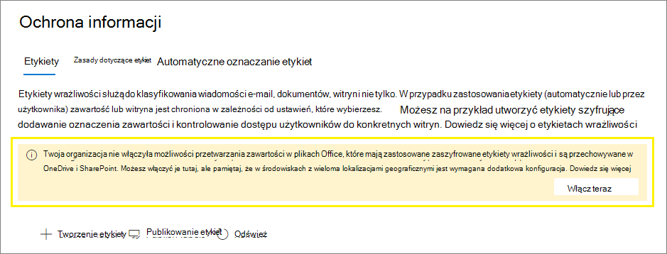

# <a name="enable-sensitivity-labels-for-office-files-in-sharepoint-and-onedrive"></a>Włączanie etykiet wrażliwości dla Office w SharePoint i OneDrive

>*[Microsoft 365 licencjonowania w zakresie zabezpieczeń & zgodności](/office365/servicedescriptions/microsoft-365-service-descriptions/microsoft-365-tenantlevel-services-licensing-guidance/microsoft-365-security-compliance-licensing-guidance).*

Włącz wbudowane etykiety dla obsługiwanych [Office w](sensitivity-labels-office-apps.md#office-file-types-supported) plikach SharePoint i OneDrive, aby użytkownicy Office dla sieci web.[](sensitivity-labels.md) Gdy ta funkcja jest włączona, użytkownicy zobaczą  przycisk Charakter na wstążce, aby zastosować etykiety, i zobaczą nazwę etykiety na pasku stanu.

Włączenie tej funkcji powoduje również SharePoint i OneDrive przetwarzania zawartości Office, które zostały zaszyfrowane przy użyciu etykiety wrażliwości. Etykietę można stosować w aplikacji Office dla sieci web aplikacji Office aplikacjach klasycznych i przekazać lub zapisać w SharePoint i OneDrive. Do czasu włączenia tej funkcji te usługi nie mogą przetwarzać zaszyfrowanych plików, co oznacza, że w przypadku tych plików nie będzie działać współtworzenie, zbierania elektronicznych materiałów dowodowych, ochrona przed utratą danych, wyszukiwanie i inne funkcje współpracy.

Po włączeniu etykiet wrażliwości dla plików Office w programach SharePoint i OneDrive dla nowych i zmienionych plików, które mają etykietę wrażliwości, która stosuje szyfrowanie przy użyciu klucza chmurowego (i nie korzysta z szyfrowania dwukluczowych[:](double-key-encryption.md)

- W przypadku plików programu Word, Excel i PowerPoint możesz SharePoint i OneDrive etykietę, a teraz może przetwarzać zawartość zaszyfrowanego pliku.

- Gdy użytkownicy pobierają te pliki z programu SharePoint lub OneDrive lub do nich dostęp, etykieta wrażliwości i wszelkie ustawienia szyfrowania z etykiety są wymuszane i pozostają z plikiem w miejscu, w którym jest przechowywany. Zadbaj o to, aby wskazówki dla użytkowników dotyczyły tylko etykiet w celu ochrony dokumentów. Aby uzyskać więcej informacji, zobacz [Opcje usługi Zarządzanie prawami do informacji (IRM) i etykiety wrażliwości](sensitivity-labels-office-apps.md#information-rights-management-irm-options-and-sensitivity-labels).

- Gdy użytkownicy przekażą pliki oznaczone etykietą i zaszyfrowane do SharePoint lub OneDrive, muszą mieć co najmniej uprawnienia do wyświetlania tych plików. Mogą one na przykład otwierać pliki na zewnątrz SharePoint. Jeśli użytkownik nie ma odpowiedniego minimalnego użycia, przekazywanie przebiegło pomyślnie, ale usługa nie rozpoznaje etykiety i nie może przetworzyć zawartości pliku.

- Używaj Office dla sieci web (Word, Excel, PowerPoint) do otwierania i edytowania plików Office, które mają etykiety wrażliwości, które stosuje szyfrowanie. Uprawnienia, które zostały przypisane przy użyciu szyfrowania, są wymuszane. W przypadku tych dokumentów [można również](apply-sensitivity-label-automatically.md) używać automatycznego oznaczania etykiet.

- Użytkownicy zewnętrzni mogą uzyskać dostęp do dokumentów oznaczonych szyfrowaniem, korzystając z kont gości. Aby uzyskać więcej informacji, zobacz [Obsługa użytkowników zewnętrznych i zawartości oznaczonej etykietą](sensitivity-labels-office-apps.md#support-for-external-users-and-labeled-content).

- Office 365 zbierania elektronicznych materiałów dowodowych obsługuje wyszukiwanie w pełnym tekście tych plików, a zasady ochrony przed utratą danych (DLP, Data Loss Prevention) obsługują zawartość tych plików.

> [!NOTE]
> Jeśli szyfrowanie zostało zastosowane przy użyciu klucza lokalnego (topologia zarządzania kluczami często jest określana jako "hold your own key" lub HYOK) lub przy użyciu szyfrowania dwucyfrowego [, zachowanie](double-key-encryption.md) usługi przetwarzania zawartości pliku nie zmienia się. Dlatego w przypadku tych plików, współtworzenie, zbierania elektronicznych materiałów dowodowych, ochrony przed utratą danych, wyszukiwania i innych funkcji współpracy nie będzie działać.
>
> Zachowanie SharePoint i OneDrive nie zmienia się również w przypadku istniejących plików w tych lokalizacjach, które są oznaczone przy użyciu szyfrowania przy użyciu jednego klucza opartego na platformie Azure. Aby te pliki skorzystały z nowych możliwości po włączeniu etykiet wrażliwości dla plików Office w programach SharePoint i OneDrive, należy je pobrać i przekazać ponownie lub edytować.

Po włączeniu etykiet wrażliwości dla plików Office w programach SharePoint i OneDrive dostępne są trzy nowe zdarzenia inspekcji w celu monitorowania etykiet wrażliwości[](search-the-audit-log-in-security-and-compliance.md#sensitivity-label-activities), które są stosowane do dokumentów w programach SharePoint i OneDrive:

- **Do pliku zastosowano etykietę wrażliwości**
- **Zmieniono etykietę wrażliwości zastosowaną do pliku**
- **Usunięto etykietę wrażliwości z pliku**

Obejrzyj poniższy klip wideo (bez dźwięku), aby zobaczyć nowe funkcje w działaniu:

> [!VIDEO https://www.microsoft.com/videoplayer/embed//RE4ornZ]

Zawsze możesz wyłączyć etykiety wrażliwości dla Office w SharePoint i [OneDrive (](#how-to-disable-sensitivity-labels-for-sharepoint-and-onedrive-opt-out)zrezygnować) w dowolnym momencie.

Jeśli obecnie chronisz dokumenty w usztywnianiu SharePoint za pomocą usługi Zarządzanie prawami do informacji (IRM, Information Rights Management) usługi SharePoint, sprawdź sekcję SharePoint Zarządzanie prawami do informacji [(IRM)](#sharepoint-information-rights-management-irm-and-sensitivity-labels) i etykietami wrażliwości na tej stronie.

## <a name="requirements"></a>Wymagania

Te nowe funkcje działają tylko z [etykietami wrażliwości](sensitivity-labels.md) . Jeśli obecnie masz etykiety usługi Azure Information Protection, najpierw przemigruj je do etykiet wrażliwości, aby umożliwić włączenie tych funkcji dla nowych przesyłanych plików. Aby uzyskać instrukcje, [zobacz Jak przeprowadzić migrację etykiet usługi Azure Information Protection do ujednoliconych etykiet wrażliwości](/azure/information-protection/configure-policy-migrate-labels).

Użyj aplikacji synchronizacja usługi OneDrive w wersji 19.002.0121.0008 lub nowszej w systemie Windows oraz w wersji 19.002.0107.0008 lub nowszej na komputerze Mac. Obie te wersje zostały wydane 28 stycznia 2019 r. i są obecnie wydane we wszystkich pierścieniach. Aby uzyskać więcej informacji, zobacz informacje [OneDrive o wersji](https://support.office.com/article/845dcf18-f921-435e-bf28-4e24b95e5fc0). Po włączeniu etykiet wrażliwości dla Office w SharePoint i OneDrive, użytkownikom, którzy uruchamiają starszą wersję aplikacji do synchronizacji, zostanie wyświetlony monit o jej zaktualizowanie.

## <a name="limitations"></a>Ograniczenia

- Programy SharePoint i OneDrive nie mogą przetwarzać niektórych plików oznaczonych i zaszyfrowanych z aplikacji klasycznych firmy Office, gdy te pliki zawierają dane dodatku PowerQuery, dane przechowywane przez dodatki niestandardowe lub niestandardowe części XML, takie jak właściwości strony tytułowej, schematy typów zawartości, niestandardowy panel informacji o dokumencie i niestandardowa informacja XSN. To ograniczenie dotyczy również plików, które w momencie [](https://support.microsoft.com/office/enable-and-configure-unique-document-ids-ea7fee86-bd6f-4cc8-9365-8086e794c984) ich przesłania mają dodany identyfikator dokumentu.

    W przypadku tych plików możesz zastosować etykietę bez szyfrowania, aby można je było później otworzyć w aplikacji Office w sieci Web, lub poinstruować użytkowników, aby otworzyli te pliki w aplikacjach klasycznych. Nie ma to wpływu na pliki, które są Office w sieci Web i zaszyfrowane tylko w innych Office w sieci Web.

- SharePoint i OneDrive etykiet wrażliwości nie są automatycznie stosowane do istniejących plików, które zostały już zaszyfrowane przy użyciu etykiet usługi Azure Information Protection. Aby funkcje działały po włączeniu etykiet wrażliwości dla Office w programach SharePoint i OneDrive, wykonaj następujące zadania:

    1. Upewnij się, że etykiety usługi [Azure Information Protection zostały](/azure/information-protection/configure-policy-migrate-labels) zmigrowane do etykiet wrażliwości i [opublikowane](create-sensitivity-labels.md#publish-sensitivity-labels-by-creating-a-label-policy) na Centrum zgodności platformy Microsoft 365.
    2. Pobierz pliki oznaczone etykietą, a następnie przekaż je do ich oryginalnej lokalizacji w SharePoint lub OneDrive.

- SharePoint i OneDrive nie mogą przetwarzać plików zaszyfrowanych, gdy etykieta, która zastosować szyfrowanie, ma dowolną z następujących konfiguracji [szyfrowania](encryption-sensitivity-labels.md#configure-encryption-settings):
  - **Umożliwianie użytkownikom przypisywania uprawnień** po zastosowaniu etykiety i pola wyboru W programach **Word, PowerPoint i Excel** zaznaczono pole wyboru Monituj użytkowników o określenie uprawnień. To ustawienie jest czasami nazywane "uprawnieniami zdefiniowanymi przez użytkownika".
  - **Dla dostępu użytkownika do zawartości wygasa** jest ustawiona wartość inna niż **Nigdy**.
  - **Wybrana jest opcja Szyfrowanie podwójnym** kluczem.

    W przypadku etykiet z dowolną z tych konfiguracji szyfrowania etykiety nie są wyświetlane użytkownikom w Office dla sieci web. Ponadto nowych funkcji nie można używać z dokumentami oznaczonymi etykietami, które już mają te ustawienia szyfrowania. Na przykład te dokumenty nie zostaną zwrócone w wynikach wyszukiwania, nawet jeśli zostaną zaktualizowane.

- W celu wydajności, gdy dokument jest przesyłany lub zapisywany w programie SharePoint, SharePoint etykieta pliku nie stosuje szyfrowania, wyświetlanie nazwy etykiety  w kolumnie Czułość w bibliotece dokumentów może zająć trochę czasu. Czynnik opóźnienia w przypadku użycia skryptów lub automatyzacji zależnych od nazwy etykiety w tej kolumnie.

- Jeśli dokument jest oznaczony etykietą wyewidencjonowaną w programie [SharePoint](https://support.microsoft.com/office/check-out-check-in-or-discard-changes-to-files-in-a-library-7e2c12a9-a874-4393-9511-1378a700f6de), kolumna  Czułość w bibliotece dokumentów nie będzie wyświetlać nazwy etykiety, dopóki dokument nie zostanie zaewidencjonowany, a następnie otwarty w SharePoint.

- Jeśli etykietowany i zaszyfrowany dokument zostanie pobrany z usługi SharePoint lub OneDrive przez aplikację lub usługę korzystającą z nazwy głównej usługi, a następnie przekazany ponownie z etykietą, która stosuje różne ustawienia szyfrowania, przekazywanie nie powiedzie się. Przykładowy scenariusz to program Microsoft Defender for Cloud Apps zmienia etykietę poufności w pliku z  Poufne na Wysoce **poufne** lub z **Poufne** na **Ogólne**.
    
    Przekazywanie nie kończy się niepowodzeniem, jeśli aplikacja lub usługa najpierw uruchamia polecenie cmdlet [Unlock-SPOSensitivityLabeledFile](/powershell/module/sharepoint-online/unlock-sposensitivitylabelencryptedFile), zgodnie z objaśnieniem w sekcji Usuwanie szyfrowania dokumentu z [etykietami.](#remove-encryption-for-a-labeled-document) Przed przekazaniem oryginalny plik zostanie usunięty lub jego nazwa zostanie zmieniona.

- Użytkownicy mogą mieć opóźnienia w możliwości otwierania zaszyfrowanych dokumentów w następującym scenariuszu Zapisywania jako: W przypadku korzystania z klasycznej wersji programu Office użytkownik wybiera pozycję Zapisz jako dla dokumentu z etykietą wrażliwości, która stosuje szyfrowanie. Użytkownik wybiera lokalizację SharePoint lub OneDrive, a następnie od razu próbuje otworzyć ten dokument w Office dla sieci web. Jeśli usługa nadal przetwarza szyfrowanie, użytkownik widzi komunikat, że dokument musi zostać otwarty w aplikacji klasycznej. Jeśli spróbują oni ponownie za kilka minut, dokument zostanie pomyślnie otwarty w Office dla sieci web.

- W przypadku zaszyfrowanych dokumentów drukowanie nie jest obsługiwane w Office dla sieci web.

- W przypadku zaszyfrowanych dokumentów Office dla sieci web kopiowanie do schowka i zrzutów ekranu nie jest blokowane. Aby uzyskać więcej informacji, zobacz [Czy zarządzanie prawami dostępu uniemożliwia przechwytywanie zawartości ekranu?](/azure/information-protection/faqs-rms#can-rights-management-prevent-screen-captures)

- Domyślnie aplikacje Office i aplikacje mobilne nie obsługują współtworowania plików oznaczonych przy użyciu szyfrowania. Te aplikacje nadal będą otwierać pliki oznaczone etykietą i zaszyfrowane w trybie edycji wyłącznej.
    
    > [!NOTE]
    > Współtworowanie jest teraz obsługiwane w Windows i macOS. Aby uzyskać więcej informacji, zobacz [Włączanie współtworowania plików zaszyfrowanych za pomocą etykiet wrażliwości](sensitivity-labels-coauthoring.md).

- Jeśli administrator zmieni ustawienia opublikowanej etykiety, która już została zastosowana do plików pobranych do klienta synchronizacji użytkowników, użytkownicy mogą nie być w stanie zapisać zmian wprowadzonych przez nich w pliku w folderze synchronizacji usługi OneDrive. Ten scenariusz dotyczy plików oznaczonych szyfrowaniem, a także zmiany etykiety z etykiety, która nie zastosuje szyfrowania do etykiety, która zastosuje szyfrowanie. Użytkownicy widzą [czerwone kółko z błędem białej](https://support.office.com/article/what-do-the-onedrive-icons-mean-11143026-8000-44f8-aaa9-67c985aa49b3) ikony krzyżyka i monitują o zapisanie nowych zmian w osobnej kopii. Zamiast tego mogą oni zamknąć i ponownie otworzyć plik lub użyć Office dla sieci web.

- Użytkownicy mogą oszczędzać problemy po pracy w trybie offline lub w trybie uśpienia, gdy zamiast korzystać z usługi Office dla sieci web używają aplikacji klasycznych i mobilnych dla programów Word, Excel i PowerPoint. W przypadku tych użytkowników po wznowieniu sesji aplikacja pakietu Office i próbie zapisania zmian jest wyświetlany komunikat o niepowodzeniu przekazywania z opcją zapisania kopii zamiast oryginalnego pliku.

- Dokumenty, które zostały zaszyfrowane w następujący sposób, nie można otwierać w Office dla sieci web:
  - Szyfrowanie z kluczem lokalnym ("trzymaj własny klucz" lub HYOK)
  - Szyfrowanie zastosowane przy użyciu szyfrowania [dwukrotnie](double-key-encryption.md)
  - Szyfrowanie zastosowane niezależnie od etykiety, na przykład przez bezpośrednie zastosowanie szablonu ochrony zarządzania prawami.

- Etykiety skonfigurowane dla [innych języków](create-sensitivity-labels.md#additional-label-settings-with-security--compliance-center-powershell) nie są obsługiwane i jest wyświetlany tylko oryginalny język.

- Jeśli usuniesz etykietę, która została zastosowana do dokumentu w programie SharePoint lub OneDrive, zamiast usuwać ją z obowiązujących zasad etykiet, pobierane dokumenty nie będą oznaczane ani szyfrowane. Natomiast jeśli dokument z etykietą jest przechowywany poza SharePoint lub OneDrive, dokument pozostanie zaszyfrowany po usunięciu etykiety. Należy zauważyć, że chociaż etykiety mogą być usuwane podczas fazy testowania, bardzo rzadko można usunąć etykietę w środowisku produkcyjnym.

## <a name="how-to-enable-sensitivity-labels-for-sharepoint-and-onedrive-opt-in"></a>Jak włączyć etykiety wrażliwości dla SharePoint i OneDrive (opt-in)

Nowe funkcje można włączyć, korzystając z Centrum zgodności platformy Microsoft 365 lub programu PowerShell. Tak jak w przypadku wszystkich zmian w konfiguracji na poziomie dzierżawy SharePoint i OneDrive, może potrwać około 15 minut, aby zmiana ta obowiązywała.

### <a name="use-the-compliance-center-to-enable-support-for-sensitivity-labels"></a>Korzystanie z Centrum zgodności w celu włączenia obsługi etykiet wrażliwości

Jest to najprostszy sposób włączenia etykiet wrażliwości dla SharePoint i OneDrive, ale musisz zalogować się jako administrator globalny dzierżawy.

1. Zaloguj się do witryny [Centrum zgodności platformy Microsoft 365](https://compliance.microsoft.com/) administratora globalnego i przejdź do **witryny** **SolutionsInformation** >  Protection.

    Jeśli nie widzisz tej opcji od razu, najpierw wybierz pozycję **Pokaż wszystko**.

2. Jeśli zostanie wyświetlony komunikat z informacjami o możliwości przetwarzania zawartości w Office plików online, wybierz **pozycję Włącz teraz**:

    

    Polecenie zostanie uruchamiane natychmiast, a po odświeżeniu strony komunikat lub przycisk nie będą już wyświetlany.

> [!NOTE]
> Jeśli masz Microsoft 365 multi-Geo, musisz użyć programu PowerShell, aby włączyć te funkcje dla wszystkich lokalizacji geograficznych. Aby uzyskać szczegółowe informacje, zobacz następną sekcję.

### <a name="use-powershell-to-enable-support-for-sensitivity-labels"></a>Włączanie obsługi etykiet wrażliwości przy użyciu programu PowerShell

Zamiast korzystać z Centrum zgodności, możesz włączyć obsługę etykiet wrażliwości, używając polecenia cmdlet [Set-SPOTenant](/powershell/module/sharepoint-online/set-spotenant) z programu SharePoint Online PowerShell.

Jeśli masz Microsoft 365 multi-Geo, musisz użyć programu PowerShell, aby włączyć tę obsługę wszystkich lokalizacji geograficznych.

#### <a name="prepare-the-sharepoint-online-management-shell"></a>Przygotowywanie powłoki SharePoint online

Przed uruchomieniem polecenia programu PowerShell umożliwiającego włączanie etykiet wrażliwości dla plików Office w programach SharePoint i OneDrive upewnij się, że jest uruchomiona powłoka zarządzania usługą SharePoint w wersji 16.0.19418.12000 lub nowszej. Jeśli masz już najnowszą wersję, możesz przejść do następnej procedury [w celu uruchomienia](#run-the-powershell-command-to-enable-support-for-sensitivity-labels) polecenia programu PowerShell.

1. Jeśli zainstalowano poprzednią wersję powłoki zarządzania usługi SharePoint Online z galerii programu PowerShell, możesz zaktualizować moduł, uruchamiając następujące polecenie cmdlet.

    ```PowerShell
    Update-Module -Name Microsoft.Online.SharePoint.PowerShell
    ```

2. Ewentualnie, jeśli zainstalowano poprzednią wersję powłoki zarządzania usługi SharePoint Online z Centrum pobierania Microsoft, możesz również przejść do strony Dodawanie lub usuwanie programów i  odinstalowywanie powłoki zarządzania usługi SharePoint Online.

3. W przeglądarce internetowej przejdź do strony Centrum pobierania i [pobierz najnowszą wersję SharePoint powłoki zarządzania online](https://go.microsoft.com/fwlink/p/?LinkId=255251).

4. Wybierz język, a następnie kliknij pozycję **Pobierz**.

5. Wybierz jeden z plików x64 i x86 .msi pliku. Pobierz plik x64, jeśli jest uruchamiana 64-bitowa wersja programu Windows lub plik x86, jeśli jest uruchamiana wersja 32-bitowa. Jeśli nie wiesz, której wersji systemu operacyjnego [Windows system operacyjny?](https://support.microsoft.com/help/13443/windows-which-operating-system)

6. Po pobraniu pliku uruchom go i postępuj zgodnie z instrukcjami Kreatora konfiguracji.

#### <a name="run-the-powershell-command-to-enable-support-for-sensitivity-labels"></a>Uruchamianie polecenia programu PowerShell w celu włączenia obsługi etykiet wrażliwości

Aby włączyć nowe funkcje, użyj polecenia cmdlet [Set-SPOTenant](/powershell/module/sharepoint-online/set-spotenant) z *parametrem EnableAIPIntegration* :

1. Używając konta służbowego z uprawnieniami administratora globalnego lub administratora SharePoint w programie Microsoft 365, połącz się z usługą SharePoint. Aby dowiedzieć się, jak to zrobić, zobacz [Wprowadzenie do SharePoint zarządzania online](/powershell/sharepoint/sharepoint-online/connect-sharepoint-online).

    > [!NOTE]
    > Jeśli masz usługę Microsoft 365 multi-Geo, użyj parametru -Url z usługą [Połączenie-SPOService](/powershell/module/sharepoint-online/connect-sposervice) i określ adres URL witryny centrum administracyjnego usługi SharePoint Online dla jednej z Twoich lokalizacji geograficznych.

2. Uruchom następujące polecenie i naciśnij klawisz **Y** , aby potwierdzić:

    ```PowerShell
    Set-SPOTenant -EnableAIPIntegration $true
    ```
3. W Microsoft 365 dla wielu lokalizacji geograficznych: Powtórz kroki 1 i 2 dla każdej z pozostałych lokalizacji geograficznych.

## <a name="publishing-and-changing-sensitivity-labels"></a>Publikowanie i zmienianie etykiet wrażliwości

W przypadku korzystania z etykiet wrażliwości SharePoint i OneDrive należy pamiętać, że podczas publikowania nowych etykiet wrażliwości lub aktualizowania istniejących etykiet wrażliwości należy zezwolić na czas replikacji. Jest to szczególnie ważne w przypadku nowych etykiet, które stosuje szyfrowanie.

Na przykład: Tworzysz i publikujesz nową etykietę wrażliwości, która stosuje szyfrowanie, i jest ona bardzo szybko wyświetlana w aplikacji klasycznej użytkownika. Użytkownik stosuje tę etykietę do dokumentu, a następnie przekaże ją do SharePoint lub OneDrive. Jeśli replikacja etykiet nie została ukończona dla usługi, nowe funkcje nie zostaną zastosowane do tego dokumentu podczas przekazywania. W wyniku tego dokument nie zostanie zwrócony w wynikach wyszukiwania ani zbierania elektronicznych materiałów dowodowych i nie będzie można go otworzyć w Office dla sieci web.

Następujące zmiany replikują się w ciągu jednej godziny: Nowe i usunięte etykiety wrażliwości oraz ustawienia zasad wrażliwości, które zawierają etykiety w zasadach.

Poniższe zmiany replikują się w ciągu 24 godzin: Zmiany ustawień wrażliwości etykiet dla istniejących etykiet.

Ponieważ opóźnienie replikacji dla nowych etykiet wrażliwości wynosi tylko godzinę, nie można w tym przykładzie uruchomić scenariusza. Jednak w celu zabezpieczenia przed opublikowaniem nowych etykiet zalecamy opublikowanie ich tylko kilku użytkownikom testowym, odczekaj godzinę, a następnie zweryfikuj zachowanie etykiet na SharePoint i OneDrive. W ostatnim kroku udostępnij etykietę większej liczby użytkowników, dodając więcej użytkowników do istniejących zasad etykiet lub dodając etykietę do istniejących zasad etykiet dla standardowych użytkowników. Etykieta jest już synchronizowana z etykietą u użytkowników SharePoint i OneDrive.

## <a name="sharepoint-information-rights-management-irm-and-sensitivity-labels"></a>SharePoint zarządzanie prawami do informacji (IRM) i etykiety wrażliwości

[SharePoint zarządzanie prawami do informacji (IRM, Information Rights Management)](set-up-irm-in-sp-admin-center.md) to starsza technologia do ochrony plików na poziomie list i bibliotek przez stosowanie szyfrowania i ograniczeń podczas pobierania plików. Ta starsza technologia ochrony została zaprojektowana w taki sposób, aby uniemożliwić nieautoryzowanym użytkownikom otwieranie pliku, gdy znajduje się on poza SharePoint.

Dla porównania etykiety wrażliwości poza szyfrowaniem zapewniają ustawienia ochrony oznaczeń wizualnych (nagłówków, stopek i znaków wodnych). Ustawienia szyfrowania obsługują pełny zakres praw użytkowania w [](/azure/information-protection/configure-usage-rights) celu ograniczenia możliwości użytkowników dotyczących zawartości, a te same etykiety wrażliwości są obsługiwane w [wielu scenariuszach](get-started-with-sensitivity-labels.md#common-scenarios-for-sensitivity-labels). Zastosowanie tej samej metody ochrony przy użyciu spójnych ustawień we wszystkich obciążeniach pracą i aplikacjach zapewnia spójną strategię ochrony.

Można jednak używać razem obu rozwiązań ochrony, a zachowanie jest następujące:

- W przypadku przekazania pliku z etykietą wrażliwości, która stosuje szyfrowanie, program SharePoint nie może przetworzyć zawartości tych plików, dlatego współtworzenie, zbierania elektronicznych materiałów dowodowych, zasady DLP i wyszukiwanie nie są obsługiwane w przypadku tych plików.

- Jeśli oznaczysz plik etykietą przy Office dla sieci web, wszelkie ustawienia szyfrowania z etykiety są wymuszane. W przypadku tych plików obsługiwane są współtworzenie, zbierania elektronicznych materiałów dowodowych, zasady DLP i wyszukiwanie.

- W przypadku pobrania pliku z etykietą przy użyciu usługi Office dla sieci web etykieta zostanie zachowana i wszelkie ustawienia szyfrowania z etykiety zostaną wymuszone, a nie ustawienia ograniczeń usługi IRM.

- Jeśli pobierzemy plik Office PDF, który nie jest zaszyfrowany przy użyciu etykiety wrażliwości, zostaną zastosowane ustawienia usługi IRM.

- Jeśli włączono dowolne z dodatkowych ustawień biblioteki usługi IRM, które obejmują uniemożliwianie użytkownikom przekazywania dokumentów, które nie obsługują usługi IRM, te ustawienia są wymuszane.

Dzięki temu zachowaniu możesz mieć pewność, że wszystkie pliki Office i PDF są chronione przed nieautoryzowanym dostępem, jeśli zostaną pobrane, nawet jeśli nie są oznaczone etykietą. Jednak przekazane pliki oznaczone etykietą nie będą korzystać z nowych możliwości.


## <a name="search-for-documents-by-sensitivity-label"></a>Wyszukiwanie dokumentów według etykiety wrażliwości

Użyj właściwości zarządzanej **InformationProtectionLabelId**, aby znaleźć wszystkie dokumenty w SharePoint lub OneDrive, które mają określoną etykietę wrażliwości. Użyj następującej składni: `InformationProtectionLabelId:<GUID>`

Aby na przykład wyszukać wszystkie dokumenty oznaczone jako "Poufne", których identyfikator GUID to "8faca7b8-8d20-48a3-8ea2-0f96310a848e", w polu wyszukiwania wpisz:

```
InformationProtectionLabelId:8faca7b8-8d20-48a3-8ea2-0f96310a848e
```

Wyszukiwanie nie będzie odnaleźć dokumentów oznaczonych etykietą w pliku skompresowanym, na przykład w .zip pliku.

Aby uzyskać identyfikatory GUID etykiet wrażliwości, użyj polecenia cmdlet [Get-Label](/powershell/module/exchange/get-label) :

1. Najpierw połącz [się z programem Office 365 Security & Compliance Center w programie PowerShell](/powershell/exchange/office-365-scc/connect-to-scc-powershell/connect-to-scc-powershell).

    Na przykład w sesji programu PowerShell uruchomionej jako administrator zaloguj się przy użyciu konta administratora globalnego.

2. Następnie uruchom następujące polecenie:

    ```powershell
    Get-Label |ft Name, Guid
    ```

Aby uzyskać więcej informacji na temat używania właściwości zarządzanych, zobacz [Zarządzanie schematem wyszukiwania w programie SharePoint](/sharepoint/manage-search-schema).

## <a name="remove-encryption-for-a-labeled-document"></a>Usuwanie szyfrowania dla dokumentu z etykietą

Rzadko zdarza się, że administrator SharePoint musi usunąć szyfrowanie z dokumentu przechowywanego w SharePoint. Każdy użytkownik, który ma [](/azure/information-protection/configure-usage-rights#usage-rights-and-descriptions) przypisane prawo do korzystania z usługi Zarządzanie prawami dostępu do eksportu lub pełnej kontroli dla tego dokumentu, może usunąć szyfrowanie zastosowane przez usługę Azure Rights Management z usługi Azure Information Protection. Na przykład użytkownicy z jednym z tych praw użytkowania mogą zastąpić etykietę, która stosuje szyfrowanie, etykietą bez szyfrowania. Użytkownik [super może](/azure/information-protection/configure-super-users) również pobrać plik i zapisać kopię lokalną bez szyfrowania.

Ewentualnie administrator globalny lub administrator SharePoint może [](/sharepoint/sharepoint-admin-role) uruchomić polecenie cmdlet [Unlock-SPOSensitivityLabeledFile,](/powershell/module/sharepoint-online/unlock-sposensitivitylabelencryptedFile) co spowoduje usunięcie zarówno etykiety wrażliwości, jak i szyfrowania. To polecenie cmdlet jest uruchamiane nawet wtedy, gdy administrator nie ma uprawnień dostępu do witryny lub pliku albo jeśli usługa Azure Rights Management jest niedostępna.

Przykład:

```powershell
Unlock-SPOSensitivityLabelEncryptedFile -FileUrl "https://contoso.com/sites/Marketing/Shared Documents/Doc1.docx" -JustificationText "Need to decrypt this file"
```

Wymagania:

- SharePoint powłoki zarządzania online w wersji 16.0.20616.12000 lub nowszej.

- Szyfrowanie zostało zastosowane na etykiecie wrażliwości z ustawieniami szyfrowania zdefiniowanymi przez administratora (ustawienia [Przypisz uprawnienia teraz](encryption-sensitivity-labels.md#assign-permissions-now) etykiet). [To polecenie](encryption-sensitivity-labels.md#double-key-encryption) cmdlet nie obsługuje szyfrowania podwójnie klucza.

Tekst justowania zostanie dodany do zdarzenia [](search-the-audit-log-in-security-and-compliance.md#sensitivity-label-activities) inspekcji etykiety Usunięto etykietę wrażliwości z **pliku, a** akcja odszyfrowywania jest również rejestrowana w rejestrowaniu użycia ochrony dla usługi [Azure Information Protection](/azure/information-protection/log-analyze-usage).

## <a name="how-to-disable-sensitivity-labels-for-sharepoint-and-onedrive-opt-out"></a>Jak wyłączyć etykiety wrażliwości dla SharePoint i OneDrive (rezygnacja)

Jeśli wyłączysz te nowe funkcje, pliki przekazane po włączeniu etykiet wrażliwości dla usług SharePoint i OneDrive będą nadal chronione za pomocą etykiet, ponieważ ustawienia etykiet będą nadal wymuszane. Po wyłączeniu tych nowych funkcji etykiet wrażliwości i ich zbierania elektronicznych materiałów dowodowych oraz współtworzeniu nie będzie już działać.

Aby wyłączyć te nowe funkcje, należy użyć programu PowerShell. Za pomocą powłoki zarządzania usługi SharePoint Online i polecenia cmdlet [Set-SPOTenant](/powershell/module/sharepoint-online/set-spotenant) określ ten sam parametr *EnableAIPIntegration*, który został opisany w sekcji Włączanie obsługi etykiet wrażliwości za pomocą programu [PowerShell](#use-powershell-to-enable-support-for-sensitivity-labels). Jednak tym razem ustaw wartość parametru na fałsz i naciśnij **klawisz Y** , aby potwierdzić:

```PowerShell
Set-SPOTenant -EnableAIPIntegration $false
```

Jeśli masz Microsoft 365 dla wielu lokalizacji geograficznych, musisz uruchomić to polecenie dla każdej swojej lokalizacji geograficznej.

## <a name="next-steps"></a>Następne kroki

Po włączeniu etykiet wrażliwości dla Office w programach SharePoint i OneDrive rozważ automatyczne oznaczanie tych plików etykietami przy użyciu zasad automatycznego oznaczania etykiet. Aby uzyskać więcej informacji, zobacz [Automatyczne stosowanie etykiety wrażliwości do zawartości](apply-sensitivity-label-automatically.md).

Chcesz udostępnić oznaczone i zaszyfrowane dokumenty osobom spoza organizacji?  Zobacz [Udostępnianie zaszyfrowanych dokumentów użytkownikom zewnętrznym](sensitivity-labels-office-apps.md#sharing-encrypted-documents-with-external-users).
