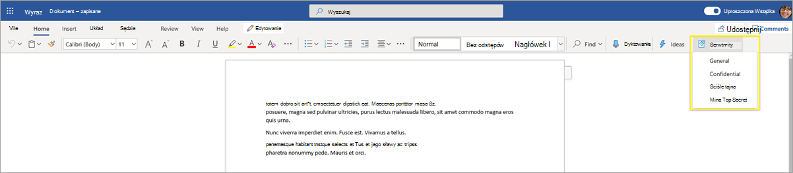
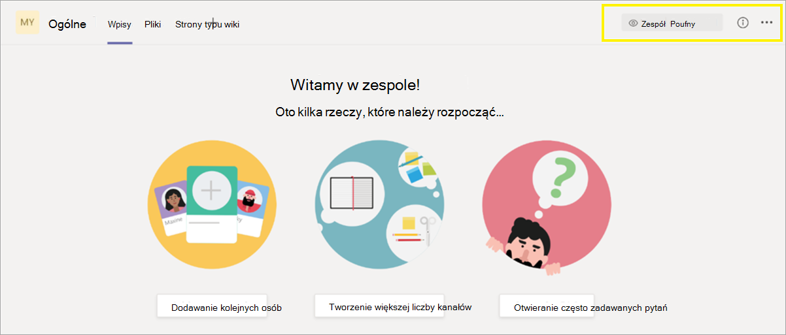
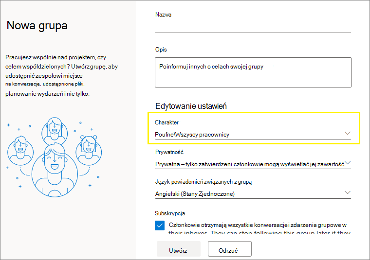
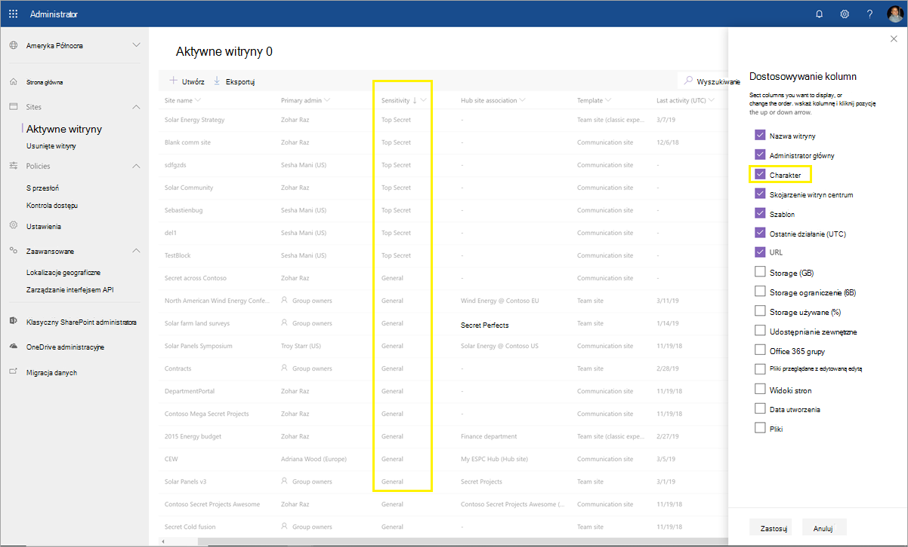

# <a name="use-sensitivity-labels-to-protect-content-in-microsoft-teams-microsoft-365-groups-and-sharepoint-sites"></a>Używanie etykiet wrażliwości w celu ochrony zawartości Microsoft Teams, grup Microsoft 365 i SharePoint internetowych

>*[Microsoft 365 licencjonowania w zakresie zabezpieczeń & zgodności](/office365/servicedescriptions/microsoft-365-service-descriptions/microsoft-365-tenantlevel-services-licensing-guidance/microsoft-365-security-compliance-licensing-guidance).*

Oprócz korzystania z etykiet [](sensitivity-labels.md) wrażliwości w celu klasyfikowania i chroninia dokumentów oraz wiadomości e-mail, można również użyć etykiet wrażliwości w celu ochrony zawartości w następujących kontenerach: witryny sieci Microsoft Teams, grupy programu [Microsoft 365 (dawniej](https://techcommunity.microsoft.com/t5/microsoft-365-blog/office-365-groups-will-become-microsoft-365-groups/ba-p/1303601) grupy Office 365) i witryny SharePoint. Aby chronić i klasyfikację na poziomie kontenera, użyj następujących ustawień etykiet:

- Prywatność (publiczna lub prywatna) witryn zespołów i grup Microsoft 365 zespołów
- Dostęp użytkowników zewnętrznych
- Udostępnianie zewnętrzne z SharePoint witryn
- Dostęp z urządzeń niezamanektowych
- Konteksty uwierzytelniania (w wersji Preview)
- Domyślny link do udostępniania witryny SharePoint sieci Web (konfiguracja programu PowerShell tylko w programie PowerShell)

> [!IMPORTANT]
> Ustawienia dla urządzeń niezawiązywanych i kontekstów uwierzytelniania działają w połączeniu z Azure Active Directory dostępu warunkowego. Tę funkcję zależną należy skonfigurować, jeśli dla tych ustawień ma być dostępna etykieta wrażliwości. Dodatkowe informacje znajdują się w poniższych instrukcjach.

Po zastosowaniu tej etykiety wrażliwości do obsługiwanego kontenera etykieta automatycznie stosuje klasyfikację i skonfigurowane ustawienia ochrony do witryny lub grupy.

Jednak zawartość w tych kontenerach nie dziedziczy etykiet klasyfikacji ani ustawień plików i wiadomości e-mail, takich jak oznaczenia wizualne i szyfrowanie. Aby użytkownicy mogą oznaczać dokumenty w witrynach SharePoint lub witrynach zespołu, upewnij się, że włączono etykiety wrażliwości dla plików Office w witrynach SharePoint i [OneDrive](sensitivity-labels-sharepoint-onedrive-files.md).

> [!NOTE]
> Etykiety wrażliwości kontenerów nie są obsługiwane w Office 365 dostarczania zawartości (CDN, Content Delivery Networks).

## <a name="using-sensitivity-labels-for-microsoft-teams-microsoft-365-groups-and-sharepoint-sites"></a>Używanie etykiet wrażliwości dla Microsoft Teams, Microsoft 365 grup i SharePoint witryn

Przed włączeniem etykiet wrażliwości dla kontenerów i skonfigurowaniem etykiet wrażliwości dla nowych ustawień użytkownicy mogą zobaczyć i zastosować etykiety wrażliwości w swoich aplikacjach. Na przykład w programie Word:



Po włączeniu i skonfigurowaniu etykiet wrażliwości dla kontenerów użytkownicy mogą również widzieć i stosować etykiety wrażliwości do witryn  zespołu firmy Microsoft, grup Microsoft 365 i SharePoint witryn. Na przykład podczas tworzenia nowej witryny zespołu z SharePoint:


> [!NOTE]
> Etykiety wrażliwości kontenerów obsługują [Teams udostępnionych kanałów](/MicrosoftTeams/shared-channels), które są obecnie w wersji zapoznawczej. Jeśli zespół ma jakiekolwiek kanały udostępnione, automatycznie dziedziczy on ustawienia etykiet wrażliwości po swoim zespole nadrzędnym i tej etykiety nie można usunąć ani zamienić na inną etykietę.

## <a name="how-to-enable-sensitivity-labels-for-containers-and-synchronize-labels"></a>Jak włączyć etykiety wrażliwości dla kontenerów i synchronizować etykiety

Jeśli etykiety wrażliwości dla kontenerów nie zostały jeszcze włączone, wykonaj jedną z następujących czynności:

1. Ponieważ ta funkcja korzysta z funkcji usługi Azure AD, postępuj zgodnie z instrukcjami w dokumentacji usługi Azure AD, aby włączyć obsługę etykiet wrażliwości: Przypisz etykiety wrażliwości do grup Microsoft 365 [w Azure Active Directory](/azure/active-directory/users-groups-roles/groups-assign-sensitivity-labels).

2. Teraz musisz zsynchronizować etykiety wrażliwości z usługą Azure AD. Najpierw połącz [się z programem PowerShell & zabezpieczeń i zgodności](/powershell/exchange/office-365-scc/connect-to-scc-powershell/connect-to-scc-powershell).

   Na przykład w sesji programu PowerShell uruchomionej jako administrator zaloguj się przy użyciu konta administratora globalnego.

3. Następnie uruchom następujące polecenie, aby upewnić się, że etykiety wrażliwości mogą być używane Microsoft 365 grupach:

    ```powershell
    Execute-AzureAdLabelSync
    ```

## <a name="how-to-configure-groups-and-site-settings"></a>Jak skonfigurować grupy i ustawienia witryny

Po włączeniu etykiet wrażliwości dla kontenerów zgodnie z opisem w poprzedniej sekcji możesz następnie skonfigurować ustawienia ochrony dla grup i witryn w konfiguracji etykiet wrażliwości. Do czasu, aż etykiety wrażliwości zostaną włączone dla kontenerów, ustawienia będą widoczne, ale nie będzie można ich skonfigurować.

1. Postępuj zgodnie z instrukcjami ogólnymi[, aby](create-sensitivity-labels.md#create-and-configure-sensitivity-labels) utworzyć lub edytować etykietę wrażliwości, i  upewnij się, że dla zakresu etykiety jest wybrane & grupy lub witryny internetowe: 
    
    
    
    Jeśli tylko dla etykiety zostanie wybrany ten zakres, etykieta nie będzie wyświetlana w aplikacjach pakietu Office, które obsługują etykiety wrażliwości i nie można ich stosować do plików i wiadomości e-mail. Taki wyciąg etykiet może być przydatny zarówno dla użytkowników, jak i administratorów, ale może również zwiększać złożoność wdrożenia etykiet.
    
    Na przykład musisz uważnie przejrzeć kolejność etykiet[](sensitivity-labels.md#label-priority-order-matters), ponieważ SharePoint, gdy dokument z etykietą zostanie przekazany do witryny z etykietą. W tym scenariuszu zdarzenie inspekcji i wiadomość e-mail są generowane automatycznie, gdy dokument ma etykietę wrażliwości o wyższym priorytecie niż etykieta witryny. Aby uzyskać więcej informacji, zobacz sekcję [Inspekcja działań etykiet](#auditing-sensitivity-label-activities) wrażliwości na tej stronie. 

2. Następnie na stronie **Definiowanie ustawień ochrony** dla grup i witryn wybierz jedną lub obie z dostępnych opcji:
    
    - **Ustawienia prywatności i dostępu użytkowników zewnętrznych w** **celu skonfigurowania** ustawień dostępu do prywatności i **użytkowników zewnętrznych** . 
    - **Udostępnianie zewnętrzne i ustawienia dostępu** warunkowego w celu  skonfigurowania ustawień Kontroluj udostępnianie zewnętrzne z witryn SharePoint i Użyj dostępu warunkowego usługi **Azure AD** do ochrony SharePoint witryn.

3. Jeśli wybrano **ustawienia prywatności i dostępu użytkowników zewnętrznych**, skonfiguruj teraz następujące ustawienia:
    
    - **Prywatność**: Zachowaj domyślną wartość **Publiczna** , jeśli chcesz, aby każda osoba w organizacji mieć dostęp do witryny zespołu lub grupy, w której jest stosowana ta etykieta.
        
        Wybierz **pozycję Prywatny** , jeśli chcesz ograniczyć dostęp tylko do zatwierdzonych członków w Twojej organizacji.
        
        Wybierz **pozycję** Brak, jeśli chcesz chronić zawartość w kontenerze za pomocą etykiety wrażliwości, ale nadal pozwól użytkownikom samodzielnie konfigurować ustawienia prywatności.
        
        Ustawienia ustawienia Publiczny **lub** **Prywatny** ustaw i zablokuj ustawienie prywatności po zastosowaniu tej etykiety do kontenera. Wybrane ustawienie zastępuje wcześniejsze ustawienie prywatności, które może być skonfigurowane dla zespołu lub grupy, i blokuje wartość prywatności, aby można ją było zmienić tylko przez usunięcie etykiety wrażliwości z kontenera. Po usunięciu etykiety wrażliwości ustawienie prywatności pozostanie na etykiecie i użytkownicy będą mogą je zmienić ponownie.
    
    - **Dostęp użytkowników zewnętrznych**: kontrolowanie, czy właściciel grupy może [dodawać gości do grupy](/office365/admin/create-groups/manage-guest-access-in-groups).

4. Jeśli wybrano **ustawienia Udostępnianie zewnętrzne i Dostęp warunkowy**, teraz skonfiguruj następujące ustawienia:
    
    - **Kontrolowanie udostępniania zewnętrznego** z witryn SharePoint: Wybierz tę opcję, aby wybrać udostępnianie zewnętrzne dla każdej osoby, nowych i istniejących gości, istniejących gości lub tylko osób w organizacji. Aby uzyskać więcej informacji na temat tych konfiguracji i ustawień, zobacz dokumentację SharePoint, Włączanie lub wyłączanie udostępniania zewnętrznego [dla witryny](/sharepoint/change-external-sharing-site).
    
    - **Użyj dostępu warunkowego usługi Azure AD** w celu ochrony SharePoint witryn internetowych: zaznacz tę opcję tylko wtedy, gdy Twoja organizacja skonfigurowała i używa dostępu Azure Active Directory [warunkowego](/azure/active-directory/conditional-access/overview). Następnie wybierz jedno z następujących ustawień:
    
        - **Określanie**, czy użytkownicy mogą uzyskać dostęp do witryn usługi SharePoint z urządzeń nieza zarządzania: Ta opcja korzysta z funkcji SharePoint, która korzysta z dostępu warunkowego usługi Azure AD w celu blokowania lub ograniczania dostępu do zawartości aplikacji SharePoint i OneDrive z urządzeń nieza zarządzania. Aby uzyskać więcej informacji, zobacz Kontrolowanie dostępu z urządzeń [niezamanektowych](/sharepoint/control-access-from-unmanaged-devices) z SharePoint dokumentów. Opcja określająca to ustawienie etykiety jest równoważna uruchamianiu polecenia programu PowerShell dla witryny, jak to opisano w krokach 3–5 z sekcji Blokowanie [](/sharepoint/control-access-from-unmanaged-devices#block-or-limit-access-to-a-specific-sharepoint-site-or-onedrive) lub ograniczanie dostępu do określonej witryny SharePoint lub OneDrive z instrukcji SharePoint.
            
            Aby uzyskać dodatkowe informacje o konfiguracji, zobacz więcej informacji o [zależnościach](#more-information-about-the-dependencies-for-the-unmanaged-devices-option) dla opcji urządzeń nieza zarządzania na końcu tej sekcji.
            
        - **Wybierz istniejący kontekst** uwierzytelniania: Obecnie w wersji Preview ta opcja umożliwia wymuszanie bardziej rygorystycznych warunków dostępu, gdy użytkownicy uzyskają dostęp SharePoint witryn, do których zastosowano tę etykietę. Te warunki są wymuszane po wybraniu istniejącego kontekstu uwierzytelniania, który został utworzony i opublikowany dla wdrożenia dostępu warunkowego organizacji. Jeśli użytkownicy nie spełniają skonfigurowanych warunków lub używają aplikacji, które nie obsługują kontekstów uwierzytelniania, zostanie im odrzucony dostęp.
            
            Aby uzyskać dodatkowe informacje o konfiguracji, zobacz Więcej informacji o [zależnościach dla](#more-information-about-the-dependencies-for-the-authentication-context-option) opcji kontekstowej uwierzytelniania na końcu tej sekcji.
            
            Przykłady konfiguracji etykiet:
            
             - Możesz wybrać kontekst uwierzytelniania skonfigurowany tak, aby wymagać uwierzytelniania [wieloskładnikowego (MFA](/azure/active-directory/conditional-access/untrusted-networks)). Ta etykieta jest następnie stosowana do witryny SharePoint zawierającej elementy poufne. W wyniku tego, gdy użytkownicy z niezaufanej sieci próbują uzyskać dostęp do dokumentu w tej witrynie, zobaczą monit uwierzytelniania wieloskładnikowego, aby uzyskać dostęp do dokumentu.
             
             - Kontekst uwierzytelniania konfiguruje się pod kątem [zasad użytkowania.](/azure/active-directory/conditional-access/terms-of-use). Ta etykieta jest następnie stosowana do witryny SharePoint zawierającej elementy wymagające zaakceptowania warunków użytkowania z przyczyn prawnych lub zgodności. W wyniku tego podczas próby uzyskania dostępu do dokumentu w tej witrynie użytkownicy widzą warunki użytkowania dokumentu, które muszą zaakceptować, aby uzyskać dostęp do oryginalnego dokumentu.

> [!IMPORTANT]
> Tylko te ustawienia witryny i grupy zostaną wprowadzone po zastosowaniu etykiety do zespołu, grupy lub witryny. Jeśli zakres [etykiety](sensitivity-labels.md#label-scopes) obejmuje pliki i wiadomości e-mail, inne ustawienia etykiet, takie jak szyfrowanie i oznaczanie zawartości, nie są stosowane do zawartości w zespole, grupie lub witrynie.

Jeśli Twoja etykieta wrażliwości nie została jeszcze opublikowana, opublikuj ją, [dodając ją do zasad wrażliwości](create-sensitivity-labels.md#publish-sensitivity-labels-by-creating-a-label-policy). Użytkownicy, którym przypisano zasady wrażliwości na etykiety, które zawierają tę etykietę, będą mogli wybrać tę etykietę dla witryn i grup.

##### <a name="more-information-about-the-dependencies-for-the-unmanaged-devices-option"></a>Więcej informacji o zależnościach dla opcji urządzeń niezawiązyanych

Jeśli nie skonfigurujesz zależnych zasad dostępu warunkowego dla programu SharePoint zgodnie z dokumentem Stosowanie ograniczeń wymuszanych przez [aplikację, określenie](/sharepoint/app-enforced-restrictions) tutaj opcji nie będzie mieć wpływu. Ponadto nie będzie ono mieć wpływu, jeśli będzie mniej restrykcyjne niż skonfigurowane ustawienie na poziomie dzierżawy. Jeśli skonfigurowano ustawienie dla urządzeń niezawiązyanych dla całej organizacji, wybierz ustawienie etykiety, które jest takie same lub bardziej restrykcyjne.

Jeśli na przykład w dzierżawie skonfigurowano opcje Zezwalaj na ograniczony dostęp tylko do sieci **Web**, ustawienie etykiet umożliwiające pełny dostęp nie będzie mieć wpływu, ponieważ jest mniej restrykcyjne. W przypadku tego ustawienia na poziomie dzierżawy wybierz ustawienie etykiety, aby zablokować dostęp (bardziej restrykcyjny) lub ustawienie etykiety dla ograniczonego dostępu (takie samo, jak ustawienie dzierżawy).

Ponieważ ustawienia etykiet można SharePoint oddzielnie od konfiguracji etykiet, nie ma sprawdzania konfiguracji etykiet wrażliwości, czy zależności są dostępne. Te zależności można skonfigurować po utworzeniu i opublikowaniu etykiety, a nawet po jej zastosowaniu. Jednak jeśli etykieta została już zastosowana, ustawienie etykiety zostanie zastosowane dopiero po następnym uwierzytelnieniu użytkownika.

##### <a name="more-information-about-the-dependencies-for-the-authentication-context-option"></a>Więcej informacji o zależnościach dla opcji kontekstowej uwierzytelniania

Aby można było wyświetlić je w ramach wybranej listy rozwijanej, należy utworzyć, skonfigurować i opublikować kontekst uwierzytelniania w ramach Azure Active Directory dostępu do warunków. Aby uzyskać więcej informacji i instrukcje, zobacz [sekcję](/azure/active-directory/conditional-access/concept-conditional-access-cloud-apps#configure-authentication-contexts) Konfigurowanie kontekstu uwierzytelniania w dokumentacji dostępu warunkowego usługi Azure AD.

Nie wszystkie aplikacje obsługują konteksty uwierzytelniania. Jeśli użytkownik z nieobsługiwaną aplikacją łączy się z witryną skonfigurowaną na potrzeby kontekstu uwierzytelniania, zobaczy komunikat o odmowie dostępu lub zostanie wyświetlony monit o uwierzytelnienie, ale odrzucone. Aplikacje, które obecnie obsługują konteksty uwierzytelniania:

- Office dla sieci web, która obejmuje Outlook sieci Web

- Microsoft Teams dla systemów Windows i macOS (z wyłączeniem Teams web app)

- Microsoft Planner

- Aplikacje Microsoft 365 dla programu Word, Excel i PowerPoint minimalne wersje:
    - Windows: 2103
    - macOS: 16.45.1202
    - iOS: 2.48.303
    - Android: 16.0.13924.10000

- Aplikacje Microsoft 365 dla Outlook; minimalne wersje:
    - Windows: 2103
    - macOS: 16.45.1202
    - iOS: 4.2109.0
    - Android: 4.2025.1

- synchronizacja usługi OneDrive aplikacja, minimalne wersje:
    - Windows: 21,002
    - macOS: 21.002
    - iOS: Wejdę w systemie 12.30
    - Android: Jeszcze nie obsługiwane

Znane ograniczenia tej wersji Preview:

- W przypadku synchronizacja usługi OneDrive, obsługiwane tylko OneDrive, a nie dla innych witryn.

- Następujące funkcje i aplikacje mogą być niezgodne z kontekstami uwierzytelniania, dlatego zachęcamy do sprawdzenia, czy te funkcje będą nadal działać, gdy użytkownik pomyślnie uzyskuje dostęp do witryny przy użyciu kontekstu uwierzytelniania:
    
    - Przepływy pracy, które Power Apps lub Power Automate
    - Aplikacje innych firm

### <a name="configure-settings-for-the-default-sharing-link-type-for-a-site-by-using-powershell-advanced-settings"></a>Konfigurowanie ustawień domyślnego typu linku udostępniania dla witryny przy użyciu ustawień zaawansowanych programu PowerShell

Oprócz ustawień etykiet dla witryn i grup, które można skonfigurować za pomocą Centrum zgodności, możesz również skonfigurować domyślny typ linku udostępniania dla witryny. Etykiety wrażliwości dla dokumentów można również skonfigurować dla domyślnego typu linku udostępniania. Te ustawienia, które pomagają zapobiec over-sharingowi, są automatycznie wybierane  po wybraniu przez użytkowników przycisku Udostępnij w Office aplikacjach. 

Aby uzyskać więcej informacji oraz instrukcje, zobacz Konfigurowanie domyślnego typu [linku](sensitivity-labels-default-sharing-link.md) udostępniania dla witryn i dokumentów w witrynach i SharePoint i OneDrive.

## <a name="sensitivity-label-management"></a>Zarządzanie etykietami wrażliwości

Poniższe wskazówki możesz stosować podczas tworzenia, modyfikowania i usuwania etykiet wrażliwości skonfigurowanych dla witryn i grup.

### <a name="creating-and-publishing-labels-that-are-configured-for-sites-and-groups"></a>Tworzenie i publikowanie etykiet skonfigurowanych dla witryn i grup

Po utworzeniu i opublikowaniu nowej etykiety wrażliwości jest ona widoczna dla użytkowników w zespołach, grupach i witrynach w ciągu jednej godziny. Jednak po zmodyfikowaniu istniejącej etykiety można zezwolić na nie do 24 godzin. Skorzystaj z następujących wskazówek, aby opublikować etykietę dla użytkowników, gdy etykieta ta jest skonfigurowana dla ustawień witryny i grupy:

1. Po utworzeniu i skonfigurowaniu etykiety wrażliwości dodaj tę etykietę do zasad etykiet, które dotyczą tylko kilku użytkowników testowych.

2. Poczekaj, aż zmiana się zreplikuje:

   - Nowa etykieta: Poczekaj godzinę.
   - Istniejąca etykieta: Odczekaj 24 godziny.

3. Po tym okresie oczekiwania użyj jednego z testowych kont użytkowników, aby utworzyć witrynę zespołu, grupy Microsoft 365 lub witryny sieci SharePoint z etykietą utworzoną w kroku 1.

4. Jeśli podczas tej operacji tworzenia nie występują żadne błędy, wiesz, że można opublikować tę etykietę dla wszystkich użytkowników w dzierżawie.

### <a name="modifying-published-labels-that-are-configured-for-sites-and-groups"></a>Modyfikowanie opublikowanych etykiet skonfigurowanych dla witryn i grup

Najlepszym rozwiązaniem jest, aby nie zmieniać ustawień witryny ani grupy na etykietę wrażliwości, gdy etykieta została zastosowana do zespołów, grup ani witryn. Jeśli tak jest, pamiętaj, aby zaczekać 24 godziny na replikowanie zmian do wszystkich kontenerów, do których zastosowano etykietę.

Ponadto, jeśli wprowadzone zmiany obejmują ustawienie Dostęp **użytkowników** zewnętrznych:

- Nowe ustawienie dotyczy nowych użytkowników, ale nie istniejących. Jeśli na przykład to ustawienie zostało wcześniej wybrane, a w wyniku tego użytkownicy goście uzyskali dostęp do witryny, ci użytkownicy goście nadal mogą uzyskiwać dostęp do witryny po wyczyszczeniu tego ustawienia w konfiguracji etykiet.

- Ustawienia prywatności dla właściwości grupy hiddenMembership i roleEnabled nie są aktualizowane.

### <a name="deleting-published-labels-that-are-configured-for-sites-and-groups"></a>Usuwanie opublikowanych etykiet skonfigurowanych dla witryn i grup

Jeśli usuniesz etykietę wrażliwości, która ma włączone ustawienia witryny i grupy, i tę etykietę uwzględniono w jednej lub kilku zasadach etykiet, ta akcja może spowodować błędy w tworzeniu nowych zespołów, grup i witryn. Aby uniknąć takich sytuacji, używaj następujących wskazówek:

1. Usuń etykietę wrażliwości ze wszystkich zasad etykiet, które zawierają etykietę.

2. Odczekaj godzinę.

3. Po upływie tego okresu oczekiwania spróbuj utworzyć zespół, grupę lub witrynę i upewnij się, że etykieta nie jest już widoczna.

4. Jeśli etykieta wrażliwości nie jest widoczna, możesz ją bezpiecznie usunąć.

## <a name="how-to-apply-sensitivity-labels-to-containers"></a>Jak zastosować etykiety wrażliwości do kontenerów

Teraz możesz zastosować etykiety wrażliwości do następujących kontenerów:

- [Microsoft 365 w usłudze Azure AD](#apply-sensitivity-labels-to-microsoft-365-groups)
- [Microsoft Teams witryny zespołu](#apply-a-sensitivity-label-to-a-new-team)
- [Microsoft 365 grupy w programie Outlook w sieci Web](#apply-a-sensitivity-label-to-a-new-group-in-outlook-on-the-web)
- [SharePoint witryny](#apply-a-sensitivity-label-to-a-new-site)

Jeśli musisz zastosować etykietę wrażliwości do wielu witryn, możesz użyć programu PowerShell[.](#use-powershell-to-apply-a-sensitivity-label-to-multiple-sites)

### <a name="apply-sensitivity-labels-to-microsoft-365-groups"></a>Stosowanie etykiet wrażliwości do Microsoft 365 grup

Teraz możesz zastosować etykiety wrażliwości do grup Microsoft 365 grupy. Wróć do dokumentacji usługi Azure AD, aby uzyskać instrukcje:

- [Przypisywanie etykiety do nowej grupy w portalu Azure Portal](/azure/active-directory/users-groups-roles/groups-assign-sensitivity-labels#assign-a-label-to-a-new-group-in-azure-portal)

- [Przypisywanie etykiety do istniejącej grupy w Portalu Azure](/azure/active-directory/users-groups-roles/groups-assign-sensitivity-labels#assign-a-label-to-an-existing-group-in-azure-portal)

- [Usuń etykietę z istniejącej grupy w Portalu Azure](/azure/active-directory/users-groups-roles/groups-assign-sensitivity-labels#remove-a-label-from-an-existing-group-in-azure-portal).

### <a name="apply-a-sensitivity-label-to-a-new-team"></a>Stosowanie etykiet wrażliwości do nowego zespołu

Użytkownicy mogą wybierać etykiety wrażliwości podczas tworzenia nowych zespołów w Microsoft Teams. Po wybraniu etykiety z listy **rozwijanej** Czułość ustawienie prywatności może zmienić się w celu odzwierciedlenia konfiguracji etykiety. W zależności od ustawienia dostępu użytkowników zewnętrznych wybranego dla tej etykiety użytkownicy mogą, ale nie mogą dodawać do zespołu osób spoza organizacji.

[Dowiedz się więcej o etykietach wrażliwości dla Teams](/microsoftteams/sensitivity-labels)


Po utworzeniu zespołu etykieta wrażliwości jest wyświetlana w prawym górnym rogu wszystkich kanałów.



Usługa automatycznie stosuje tę samą etykietę wrażliwości do grupy Microsoft 365 i połączonej SharePoint zespołu.

### <a name="apply-a-sensitivity-label-to-a-new-group-in-outlook-on-the-web"></a>Stosowanie etykiet wrażliwości do nowej grupy w Outlook w sieci Web

Podczas Outlook w sieci Web grupy możesz wybrać lub zmienić opcję Charakter dla opublikowanych etykiet:



### <a name="apply-a-sensitivity-label-to-a-new-site"></a>Stosowanie etykiet wrażliwości do nowej witryny

Administratorzy i użytkownicy końcowi mogą wybierać etykiety wrażliwości [podczas tworzenia nowoczesnych](/sharepoint/create-site-collection) witryn zespołu i witryn do komunikacji, a także rozwijać **ustawienia zaawansowane**:


W polu listy rozwijanej są wyświetlane nazwy etykiet dla zaznaczenia, a na ikonie Pomocy są wyświetlane wszystkie nazwy etykiet wraz z etykietką narzędzia, co może ułatwić użytkownikom określenie właściwej etykiety do zastosowania.

Gdy etykieta zostanie zastosowana, a użytkownicy będą przeglądać witrynę, zobaczą jej nazwę i zasady. Na przykład ta witryna została oznaczona **jako Poufne,** a ustawienie prywatności jest ustawione jako **Prywatne**:


### <a name="use-powershell-to-apply-a-sensitivity-label-to-multiple-sites"></a>Stosowanie etykiet wrażliwości do wielu witryn przy użyciu programu PowerShell

Możesz użyć polecenia cmdlet [Set-SPOSite](/powershell/module/sharepoint-online/set-sposite) i [Set-SPOTenant](/powershell/module/sharepoint-online/set-spotenant) z parametrem *SensitivityLabel* z bieżącej powłoki zarządzania usługi [SharePoint Online](/powershell/sharepoint/sharepoint-online/connect-sharepoint-online), aby zastosować etykietę wrażliwości do wielu witryn. Witryny mogą być dowolnym SharePoint lub witryną OneDrive witryny.

Upewnij się, że masz wersję 16.0.19418.12000 lub nowszą SharePoint powłoki zarządzania online.

1. Otwórz sesję programu PowerShell z **opcją Uruchom jako administrator** .

2. Jeśli nie znasz identyfikatora GUID etykiety: kliknij Połączenie programu [PowerShell](/powershell/exchange/connect-to-scc-powershell) w centrum zabezpieczeń & zgodności i uzyskaj listę etykiet wrażliwości oraz identyfikatory GUID tych identyfikatorów.

   ```powershell
   Get-Label |ft Name, Guid
   ```

3. Teraz [połącz się SharePoint PowerShell online](/powershell/sharepoint/sharepoint-online/connect-sharepoint-online) i przechowuj identyfikator GUID etykiety jako zmienną. Przykład:

   ```powershell
   $Id = [GUID]("e48058ea-98e8-4940-8db0-ba1310fd955e")
   ```

4. Utwórz nową zmienną identyfikującą wiele witryn, które mają wspólne ciągi identyfikujące w adresie URL. Przykład:

   ```powershell
   $sites = Get-SPOSite -IncludePersonalSite $true -Limit all -Filter "Url -like 'documents"
   ```

5. Uruchom następujące polecenie, aby zastosować etykietę do tych witryn. Na przykładach:

   ```powershell
   $sites | ForEach-Object {Set-SPOTenant $_.url -SensitivityLabel $Id}
   ```

Ta seria poleceń umożliwia oznaczanie wielu witryn w dzierżawie etykietami wrażliwości, dlatego należy użyć polecenia cmdlet programu Set-SPOTenant, Set-SPOSite nie polecenia cmdlet programu Set-SPOSite, które jest do konfigurowania poszczególnych witryn. Użyj jednak polecenia cmdlet Set-SPOSite, gdy chcesz zastosować inną etykietę do konkretnych witryn, powtarzając następujące polecenie dla każdej z tych witryn: `Set-SPOSite -Identity <URL> -SensitivityLabel "<labelguid>"`

## <a name="view-and-manage-sensitivity-labels-in-the-sharepoint-admin-center"></a>Wyświetlanie etykiet wrażliwości i zarządzanie nimi w centrum SharePoint administracyjnego

Aby wyświetlić, posortować i przeszukać zastosowane etykiety wrażliwości, użyj pozycji <a href="https://go.microsoft.com/fwlink/?linkid=2185220" target="_blank">**Aktywne**</a> witryny w nowej SharePoint administracyjnego. Być może trzeba będzie najpierw dodać **kolumnę** Charakter:



Aby uzyskać więcej informacji na temat zarządzania witrynami na stronie Aktywne witryny, w tym sposobu dodawania kolumny, zobacz Zarządzanie witrynami w nowej SharePoint [administracyjnego](/sharepoint/manage-sites-in-new-admin-center).

Możesz również zmienić i zastosować etykietę z tej strony:

1. Wybierz nazwę witryny, aby otworzyć okienko szczegółów.

2. Wybierz **kartę Zasady** , a następnie wybierz **pozycję Edytuj** dla **ustawienia** Charakter.

3. W **okienku Edytuj ustawienie wrażliwości** wybierz etykietę wrażliwości, którą chcesz zastosować do witryny. W przeciwieństwie do aplikacji użytkownika, w których etykiety wrażliwości można przypisać do konkretnych użytkowników, centrum administracyjne wyświetla wszystkie etykiety wrażliwości danej dzierżawy. Po wybraniu etykiety wybierz pozycję **Zapisz**.

## <a name="support-for-sensitivity-labels"></a>Obsługa etykiet wrażliwości

W przypadku korzystania z centrów a administratorów, które obsługują etykiety wrażliwości, z wyjątkiem Azure Active Directory sieci Azure Active Directory, są dla Twojej dzierżawy wszystkie etykiety wrażliwości. Dla porównania aplikacje i usługi użytkownika, które filtrowały etykiety wrażliwości zgodnie z zasadami publikowania, mogą spowodować, że zostanie zobaczenie podzestawu tych etykiet. Ponadto Azure Active Directory również filtruje etykiety zgodnie z zasadami publikowania.

Następujące aplikacje i usługi obsługują etykiety wrażliwości skonfigurowane dla witryn i ustawień grup:

- Centra administracyjne:

  - centrum administracyjne programu SharePoint
  - Teams administracyjne
  - Centrum administracyjne platformy Microsoft 365
  - Centrum zgodności platformy Microsoft 365
  - Azure Active Directory portalu

- Aplikacje i usługi użytkownika:

  - SharePoint
  - Teams
  - Outlook w sieci Web dla systemów Windows, macOS, iOS i Android
  - Formularze
  - Stream
  - Planner 

Następujące aplikacje i usługi obecnie nie obsługują etykiet wrażliwości skonfigurowanych dla witryn i ustawień grupy:

- Centra administracyjne:

  - Exchange administracyjne

- Aplikacje i usługi użytkownika:

  - Dynamics 365
  - Yammer
  - Project
  - Power BI

## <a name="classic-azure-ad-group-classification"></a>Klasyfikacja klasycznej grupy usługi Azure AD

Po włączeniu etykiet wrażliwości dla kontenerów klasyfikacje grup z usługi Azure AD nie są już obsługiwane Microsoft 365 i nie będą wyświetlane w witrynach, które obsługują etykiety wrażliwości. Możesz jednak przekonwertować stare klasyfikacje na etykiety wrażliwości.

Jako przykładu sposobu, w jaki mogła zostać użyta stara klasyfikacja grupy SharePoint, zobacz klasyfikacja [SharePoint "nowoczesnych" witryn](/sharepoint/dev/solution-guidance/modern-experience-site-classification).

Klasyfikacje te skonfigurowano przy użyciu programu PowerShell usługi Azure AD lub biblioteki podstawowej usługi PnP i definiując wartości `ClassificationList` tego ustawienia. Jeśli dzierżawa ma zdefiniowane wartości klasyfikacji, są one wyświetlane po uruchomieniu następującego polecenia z modułu [Programu PowerShell AzureADPreview](https://www.powershellgallery.com/packages/AzureADPreview):

```powershell
($setting["ClassificationList"])
```

Aby przekonwertować stare klasyfikacje na etykiety wrażliwości, wykonaj jedną z następujących czynności:

- Użyj istniejących etykiet: Określ ustawienia etykiet witryn i grup, edytując istniejące etykiety wrażliwości, które zostały już opublikowane.

- Tworzenie nowych etykiet. Określ ustawienia etykiet witryn i grup, tworząc i publikując nowe etykiety wrażliwości o takich samych nazwach jak istniejące klasyfikacje.

Następnie:

1. Użyj programu PowerShell, aby zastosować etykiety wrażliwości do istniejących grup Microsoft 365 i SharePoint przy użyciu mapowania nazw. Instrukcje znajdziesz w następnej sekcji.

2. Usuń stare klasyfikacje z istniejących grup i witryn.

Nie można uniemożliwić użytkownikom tworzenia nowych grup w aplikacjach i usługach, które jeszcze nie obsługują etykiet wrażliwości, ale można uruchomić cykliczny skrypt programu PowerShell, aby poszukać nowych grup utworzonych przez użytkowników z starymi klasyfikacjami i przekonwertować je na etykiety wrażliwości.

Aby ułatwić zarządzanie współistnienie etykiet wrażliwości i klasyfikacji usługi Azure AD dla witryn i grup, zobacz Azure Active Directory [klasyfikacji](migrate-aad-classification-sensitivity-labels.md) i etykiet wrażliwości dla grup Microsoft 365 grupy.

### <a name="use-powershell-to-convert-classifications-for-microsoft-365-groups-to-sensitivity-labels"></a>Konwertowanie klasyfikacji dla grup Microsoft 365 na etykiety wrażliwości za pomocą programu PowerShell

1. Najpierw połącz [się z programem PowerShell & zabezpieczeń i zgodności](/powershell/exchange/office-365-scc/connect-to-scc-powershell/connect-to-scc-powershell).

   Na przykład w sesji programu PowerShell uruchomionej jako administrator zaloguj się przy użyciu konta administratora globalnego:

2. Pobierz listę etykiet wrażliwości i identyfikatory GUID, używając polecenia cmdlet [Get-Label](/powershell/module/exchange/get-label) :

   ```powershell
   Get-Label |ft Name, Guid
   ```

3. Zanotuj identyfikatory GUID, aby uzyskać etykiety wrażliwości, które chcesz zastosować do Microsoft 365 grupy.

4. Teraz [połącz się Exchange Online PowerShell](/powershell/exchange/connect-to-exchange-online-powershell) w osobnym Windows PowerShell okna.

5. Użyj poniższego polecenia jako przykładu, aby uzyskać listę grup, które obecnie mają klasyfikację "Ogólne":

   ```PowerShell
   $Groups= Get-UnifiedGroup | Where {$_.classification -eq "General"}
   ```

6. Dla każdej grupy dodaj nowy identyfikator GUID etykiety wrażliwości. Przykład:

    ```PowerShell
    foreach ($g in $groups)
    {Set-UnifiedGroup -Identity $g.Identity -SensitivityLabelId "457fa763-7c59-461c-b402-ad1ac6b703cc"}
    ```

7. Powtórz kroki 5 i 6 dla pozostałych klasyfikacji grup.

## <a name="auditing-sensitivity-label-activities"></a>Inspekcja działań etykiet wrażliwości

> [!IMPORTANT]
> Jeśli używasz wyciągu etykiet, wybierając zakres witryn Grupy **&** dla etykiet chroniących kontenery: Ze względu na zdarzenie inspekcji niezgodności  wrażliwości wykrytego dokumentu i wiadomość e-mail opisane w tej sekcji rozważ [](sensitivity-labels.md#label-priority-order-matters) kolejność etykiet przed etykietami, które mają zakres plików & wiadomości **e-mail**. 

Jeśli ktoś przekaże dokument do witryny, która jest chroniona za pomocą etykiety wrażliwości, a jej dokument ma [](sensitivity-labels.md#label-priority-order-matters) etykietę wrażliwości o wyższym priorytecie niż etykieta wrażliwości zastosowana do witryny, ta akcja nie zostanie zablokowana. Na przykład etykieta Ogólne zastosowano do witryny  sieci SharePoint, a ktoś przekaże do tej witryny dokument o etykiecie **Poufne**. Ponieważ etykieta wrażliwości o wyższym priorytecie identyfikuje zawartość, która jest bardziej wrażliwa niż zawartość o niższym priorytecie, taka sytuacja może stanowić zagrożenie dla bezpieczeństwa.

Mimo że akcja nie jest blokowana, jest ona podlega inspekcji i domyślnie automatycznie generuje wiadomość e-mail do osoby, która przesłała dokument i administratora witryny. W efekcie zarówno użytkownik, jak i administratorzy mogą zidentyfikować dokumenty, które mają błędnie wyrównany priorytet etykiet, i w razie potrzeby podjąć działania. Na przykład usuń lub przenieś przekazany dokument z witryny.

Nie byłoby to zagrożeniem dla bezpieczeństwa, jeśli dokument ma etykietę wrażliwości o niższym priorytecie niż etykieta wrażliwości zastosowana do witryny. Na przykład dokument o etykiecie **Ogólne** jest przekazywany do witryny o etykiecie **Poufne**. W tym scenariuszu zdarzenie inspekcji i poczta e-mail nie są generowane.

> [!NOTE]
> Podobnie jak w przypadku opcji zasad, która wymaga, aby użytkownicy podali uzasadnienie dla zmiany etykiety na niższą klasyfikację, wszystkie etykiety podrzędne dla tej samej etykiety nadrzędnej są traktowane jako takie same priorytety.

Aby wyszukać w dzienniku inspekcji to zdarzenie, odszukaj w dzienniku inspekcji pole Niezgodność wrażliwości wykrytego **dokumentu w** **kategorii Działania na stronie i** plik.

W automatycznie wygenerowanej wiadomości e-mail  jest wykrywana temat Niezgodna etykieta wrażliwości, a w wiadomości e-mail jest objaśniona niezgodność etykiet z linkiem do przekazanego dokumentu i witryny. Zawiera również link do dokumentacji, który wyjaśnia, jak użytkownicy mogą zmienić etykietę wrażliwości. Tych zautomatyzowanych wiadomości e-mail nie można dostosowywać, ale można zapobiec ich wysłaniu, gdy użyjemy następującego polecenia programu PowerShell z [set-SPOTenant](/powershell/module/sharepoint-online/set-spotenant):

```PowerShell
Set-SPOTenant -BlockSendLabelMismatchEmail $True
```

Gdy ktoś dodaje lub usuwa etykietę wrażliwości w witrynie lub grupie albo z tej grupy, te działania są również analizowane, ale bez automatycznego generowania wiadomości e-mail.

Wszystkie te zdarzenia inspekcji można znaleźć w kategorii [Działania etykiety wrażliwości](search-the-audit-log-in-security-and-compliance.md#sensitivity-label-activities) . Aby uzyskać instrukcje dotyczące przeszukiwania dziennika inspekcji, zobacz Przeszukiwanie dziennika inspekcji [w centrum zabezpieczeń & zgodności](search-the-audit-log-in-security-and-compliance.md).

## <a name="how-to-disable-sensitivity-labels-for-containers"></a>Jak wyłączyć etykiety wrażliwości dla kontenerów

Etykiety wrażliwości dla grup Microsoft Teams, Microsoft 365 i SharePoint można wyłączyć, korzystając z tych samych instrukcji z tematu Włączanie obsługi etykiet wrażliwości w [programie PowerShell](/azure/active-directory/users-groups-roles/groups-assign-sensitivity-labels#enable-sensitivity-label-support-in-powershell). Jednak aby wyłączyć tę funkcję, w kroku 5 określ `$setting["EnableMIPLabels"] = "False"`.

Oprócz niedostępności wszystkich ustawień grup i witryn podczas tworzenia lub edytowania etykiet wrażliwości, ta akcja przywraca właściwości kontenerów na potrzeby ich konfiguracji. Włączenie etykiet wrażliwości dla grup Microsoft Teams, Microsoft 365 i SharePoint przełącza właściwość używaną z klasyfikacji **(** używanej na klasyfikację grupy usługi [Azure AD](#classic-azure-ad-group-classification)) na **Charakter**. Po wyłączeniu etykiet wrażliwości dla kontenerów kontenery ignorują właściwość Sensitivity (Czułość) i użyj ponownie właściwości Classification (Klasyfikacja).

Oznacza to, że żadne ustawienia etykiet z witryn i grup zastosowanych wcześniej do kontenerów nie będą wymuszane i kontenery nie będą już wyświetlać etykiet.

Jeśli do tych kontenerów zastosowano wartości klasyfikacji usługi Azure AD, kontenery ponownie będą używać klasyfikacji. Należy pamiętać, że żadne nowe witryny lub grupy utworzone po włączeniu funkcji nie będą miały etykiety ani klasyfikacji. Teraz możesz zastosować wartości klasyfikacji dla tych kontenerów i wszystkich nowych kontenerów. Aby uzyskać więcej informacji, [SharePoint klasyfikację "nowoczesnych"](/sharepoint/dev/solution-guidance/modern-experience-site-classification) witryn i Tworzenie klasyfikacji dla Office [grup w organizacji](../enterprise/manage-microsoft-365-groups-with-powershell.md).

## <a name="additional-resources"></a>Dodatkowe materiały

Zobacz nagranie seminarium w sieci Web i odpowiedzi na pytania dotyczące korzystania z etykiet wrażliwości Microsoft Teams [sieci Web, grup usługi O365 i SharePoint Online](https://techcommunity.microsoft.com/t5/security-privacy-and-compliance/using-sensitivity-labels-with-microsoft-teams-o365-groups-and/ba-p/1221885#M1380).

To seminarium w sieci Web zostało zarejestrowane, gdy ta funkcja była nadal w wersji zapoznawczej, więc możesz zauważyć pewne rozbieżności w interfejsie użytkownika. Jednak informacje dotyczące tej funkcji są nadal dokładne, a wszelkie nowe funkcje są udokumentowane na tej stronie.

Aby uzyskać więcej informacji o zarządzaniu Teams połączonymi witrynami i witrynami kanałów, zobacz Zarządzanie Teams [połączonymi witrynami i witrynami kanałów](/SharePoint/teams-connected-sites).
