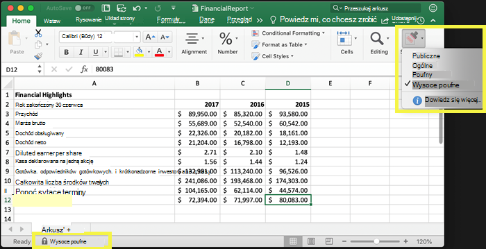
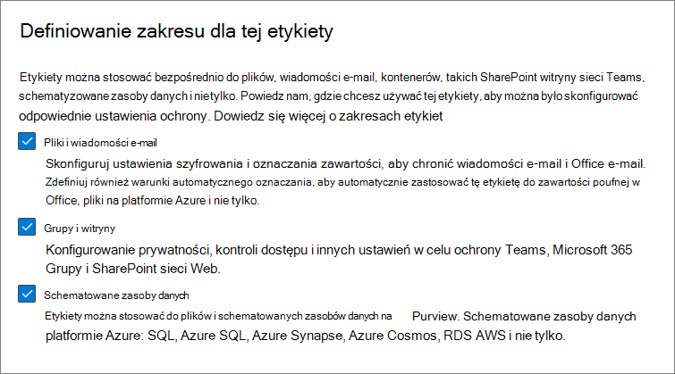
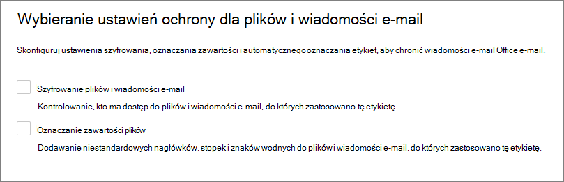
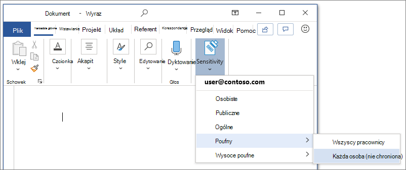
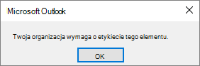
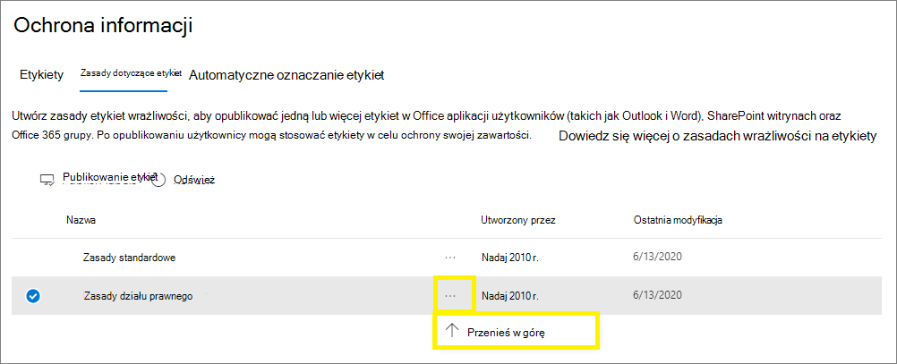

# Dowiedz się więcej o etykietach poufności

>*[Microsoft 365 licencjonowania w zakresie zabezpieczeń & zgodności](/office365/servicedescriptions/microsoft-365-service-descriptions/microsoft-365-tenantlevel-services-licensing-guidance/microsoft-365-security-compliance-licensing-guidance).*

> [!NOTE]
> Jeśli szukasz informacji o etykietach wrażliwości, które są Office, zobacz Stosowanie etykiet wrażliwości do plików i wiadomości e-mail w [Office.](https://support.microsoft.com/topic/apply-sensitivity-labels-to-your-files-and-email-in-office-2f96e7cd-d5a4-403b-8bd7-4cc636bae0f9)
>
> Informacje na tej stronie są dla administratorów systemów informatycznych, którzy mogą tworzyć i konfigurować te etykiety.

Aby wykonać pracę, osoby w Twojej organizacji współpracują z innymi osobami z organizacji i spoza tej organizacji. Oznacza to, że zawartość nie pozostaje już za zaporą — może być przesyłana wszędzie, na różnych urządzeniach, w aplikacjach i usługach. W celu zapewnienia bezpieczeństwa i ochrony w sposób zgodny z zasadami firmy i zgodnością organizacja może się w ten sposób dzieje.

Etykiety wrażliwości Microsoft Information Protection pozwalają klasyfikować i chronić dane organizacji, a jednocześnie zapewnić, że produktywność użytkowników i ich zdolność do współpracy nie są utrudnione.

Przykład przedstawiający dostępne etykiety wrażliwości Excel karcie **Narzędzia główne na** Wstążce. W tym przykładzie zastosowana etykieta jest wyświetlana na pasku stanu:

Aby zastosować etykiety wrażliwości, użytkownicy muszą być zalogowani przy użyciu Microsoft 365 służbowego.

> [!NOTE]
> W przypadku dzierżaw rządowych w Stanów Zjednoczonych etykiety wrażliwości są obsługiwane na wszystkich platformach.
>
> Jeśli korzystasz z klienta i skanera z ujednoliconą etykietą usługi [Azure Information Protection, zobacz Opis usługi Azure Information Protection Premium government service](/enterprise-mobility-security/solutions/ems-aip-premium-govt-service-description).

Etykiet poufności można użyć do:
  
- **Podaj ustawienia ochrony, które obejmują szyfrowanie i oznaczanie zawartości.** Na przykład zastosuj etykietę "Poufne" do dokumentu lub wiadomości e-mail, która szyfruje zawartość i stosuje znak wodny "Poufne". Oznaczenia zawartości zawierają nagłówki i stopki, a także znaki wodne, a szyfrowanie może także ograniczać działania autoryzowane osoby mogące zająć się zawartością.

- **Ochrony zawartości w aplikacjach pakietu Office na różnych platformach i urządzeniach.** Obsługiwane przez programy Word, Excel, PowerPoint i Outlook w Office klasycznych i Office w sieci Web. Obsługiwane na Windows, macOS, iOS i Android.

- **Chroń zawartość w aplikacjach i usługach innych** firm za pomocą programu Microsoft Defender dla aplikacji w chmurze. Za pomocą usługi Defender for Cloud Apps możesz wykrywać, klasyfikować, oznaczać i chronić zawartość w usługach i aplikacjach innych firm, takich jak SalesForce, Box lub DropBox, nawet jeśli inne aplikacje lub usługi nie odczytują ani nie obsługują etykiet wrażliwości.

- **Chroń kontenery**, które Teams, Microsoft 365 grupy i SharePoint witryn. Możesz na przykład ustawić ustawienia prywatności, dostęp użytkowników zewnętrznych i udostępnianie zewnętrzne oraz dostęp z urządzeń niezawiązywanych.

- **Rozszerzanie etykiet wrażliwości do Power BI**: Po włączeniu tej funkcji możesz stosować i wyświetlać etykiety w programie Power BI oraz chronić dane, gdy są zapisywane poza usługą.

- **Rozszerzanie etykiet** wrażliwości na zasoby w usłudze Azure Purview: Po włączeniu tej funkcji, obecnie w wersji zapoznawczej, możesz zastosować etykiety wrażliwości do plików i schematowanych zasobów danych w usłudze Azure Purview. Do schematowanych zasobów danych należą SQL usługi Azure SQL, Azure Synapse, Azure Cosoms i AWS RDS.

- **Rozszerzenia etykiet poufności na aplikacje i usługi innych firm.** Używając zestawu Microsoft Information Protection SDK, aplikacje innych firm mogą odczytywać etykiety wrażliwości i stosować ustawienia ochrony.

- **Klasyfikacji zawartości bez używania jakichkolwiek ustawień ochrony.** Możesz także po prostu przypisać etykietę w wyniku sklasyfikowania zawartości. Pozwala to użytkownikom na wizualne mapowanie klasyfikacji na nazwy etykiet w organizacji i używanie etykiet do generowania raportów użycia i wyświetlanie danych aktywności dotyczących poufnej zawartości. Na podstawie tych informacji zawsze możesz zdecydować się na późniejsze zastosowanie ustawień ochrony.

We wszystkich tych przypadkach etykiety wrażliwości w Microsoft 365 ułatwiają właściwe akcje dotyczące odpowiedniej zawartości. Etykiety wrażliwości pozwala klasyfikować dane w całej organizacji i wymuszać ustawienia ochrony na podstawie tej klasyfikacji.

Aby uzyskać więcej informacji na temat tych i innych scenariuszy obsługiwanych przez etykiety wrażliwości, zobacz Typowe scenariusze [dotyczące etykiet wrażliwości](get-started-with-sensitivity-labels.md#common-scenarios-for-sensitivity-labels). Nowe funkcje są opracowywane przez cały czas, które obsługują etykiety wrażliwości, dlatego warto się także odwołać do Microsoft 365 [przewodniku](https://aka.ms/MIPC/Roadmap).

## Co to jest etykieta wrażliwości

Po przypisaniu etykiety wrażliwości do zawartości jest ona jak sygnatura, która jest stosowana i wygląda tak:

- **Możliwość dostosowania.** Specyficzne dla Twojej organizacji i potrzeb biznesowych możesz tworzyć kategorie dla różnych poziomów poufnej zawartości w organizacji. Na przykład Osobiste, Publiczne, Ogólne, Poufne i Wysoce poufne.

- **Wyczyszczenie tekstu.** Ponieważ etykieta jest przechowywana w wyraźnym tekście w metadanych plików i wiadomości e-mail, aplikacje i usługi innych firm mogą ją odczytywać, a następnie w razie potrzeby stosować własne akcje zabezpieczające.

- **Trwałe.** Ponieważ etykieta jest przechowywana w metadanych plików i wiadomości e-mail, etykieta jest przekierowywana z zawartością, niezależnie od miejsca jej zapisania lub przechowywania. Unikatowa identyfikacja etykiet stanie się podstawą do stosowania i wymuszania skonfigurowanych zasad.

Podczas wyświetlania przez użytkowników etykieta wrażliwości jest wyświetlana jako tag w aplikacjach, z których korzystają, i można ją łatwo zintegrować z istniejącymi przepływami pracy.

Do każdego elementu obsługującego etykiety wrażliwości może być zastosowana pojedyncza etykieta wrażliwości. Do dokumentów i wiadomości e-mail może być zastosowana zarówno etykieta wrażliwości, [jak i](retention.md#retention-labels) etykieta przechowywania.

> [!div class="mx-imgBorder"]
> 

## Jakie etykiety wrażliwości mogą robić

Po zastosowaniu etykiety wrażliwości do wiadomości e-mail lub dokumentu na zawartość są wymuszane wszelkie skonfigurowane ustawienia ochrony dla tej etykiety. Etykietę wrażliwości można skonfigurować tak, aby:

- **Szyfruj** wiadomości e-mail i dokumenty, aby uniemożliwić nieautoryzowanym osobom dostęp do tych danych. Możesz także określić, którzy użytkownicy lub grupy mają uprawnienia do wykonywania akcji i jak długo. Na przykład możesz zezwolić wszystkim użytkownikom w organizacji na modyfikowanie dokumentu, podczas gdy określone grupy w innej organizacji mogą tylko go wyświetlać. Zamiast uprawnień zdefiniowanych przez administratora możesz również zezwolić użytkownikom na przypisywanie uprawnień do zawartości po zastosowaniu etykiety. 
    
    Aby uzyskać więcej **informacji na temat** ustawień szyfrowania podczas tworzenia lub edytowania etykiety wrażliwości, zobacz Ograniczanie dostępu do zawartości przy użyciu szyfrowania [etykiet wrażliwości](encryption-sensitivity-labels.md).

- **Oznacz zawartość podczas** korzystania z aplikacji pakietu Office, dodając znaki wodne, nagłówki lub stopki do wiadomości e-mail lub dokumentów, do których zastosowano etykietę. Znaki wodne można stosować do dokumentów, ale nie do wiadomości e-mail. Przykładowy nagłówek i znak wodny:
    
    
    
    Chcesz sprawdzić, kiedy są stosowane oznaczenia zawartości? Zobacz [Kiedy Office aplikacji stosują oznaczenia i szyfrowanie zawartości](sensitivity-labels-office-apps.md#when-office-apps-apply-content-marking-and-encryption).
    
    Niektóre ( ale nie wszystkie aplikacje ) obsługują oznaczenia dynamiczne przy użyciu zmiennych. Na przykład wstaw nazwę etykiety lub nazwę dokumentu do nagłówka, stopki lub znaku wodnego. Aby uzyskać więcej informacji, zobacz [Oznaczenia dynamiczne ze zmiennymi](sensitivity-labels-office-apps.md#dynamic-markings-with-variables).
    
    Długości ciągów: Znaków wodnych można ograniczyć do 255 znaków. Nagłówki i stopki są ograniczone do 1024 znaków z wyjątkiem Excel. Excel nagłówków i stopek może składać się z 255 znaków, ale ten limit obejmuje znaki, które nie są widoczne, na przykład kody formatowania. Po osiągnięciu tego limitu wpis wpisany ciąg nie będzie wyświetlany w Excel.

- **Chroń zawartość w kontenerach,** takich jak witryny i grupy, gdy włączysz możliwość używania etykiet wrażliwości Microsoft Teams, grup Microsoft 365 i SharePoint [witryn](sensitivity-labels-teams-groups-sites.md).
    
    Nie możesz konfigurować ustawień ochrony dla grup i witryn, dopóki nie włączysz tej funkcji. Ta konfiguracja etykiet nie spowoduje automatycznego oznaczania dokumentów ani wiadomości e-mail, a zamiast tego ustawienia etykiet chronią zawartość, kontrolując dostęp do kontenera, w którym można przechowywać zawartość. Te ustawienia obejmują ustawienia prywatności, dostęp użytkowników zewnętrznych i udostępnianie zewnętrzne oraz dostęp z urządzeń nieza tymi uprawnieniami.

- **Automatycznie zastosuj etykietę do plików i wiadomości e-mail lub poleć etykietę.** Wybierz sposób identyfikowania informacji poufnych, które mają być oznaczone etykietą, a etykieta może zostać zastosowana automatycznie, lub możesz poprosić użytkowników o zastosowanie zalecanej etykiety. Jeśli polecisz etykietę, w monitie zostanie wyświetlony dowolny tekst. Przykład:
    
    
    
    Aby uzyskać więcej informacji na temat ustawień Automatyczne oznaczanie etykiet plików i wiadomości **e-mail** podczas tworzenia lub edytowania etykiety wrażliwości, zobacz Automatyczne stosowanie etykiet wrażliwości do zawartości dla aplikacji pakietu Office oraz Etykiety w usłudze [Azure Purview](/azure/purview/create-sensitivity-label).

### Zakresy etykiet

Podczas tworzenia etykiety wrażliwości jest proszony o skonfigurowanie jej zakresu, który określa dwie rzeczy:
- Ustawienia etykiet, które można skonfigurować dla tej etykiety
- Miejsce, w którym etykieta będzie widoczna dla użytkowników

Ta konfiguracja zakresu pozwala na wyświetlanie etykiet wrażliwości, które są tylko dla dokumentów i wiadomości e-mail, i nie można ich wybrać dla kontenerów. Podobnie są to etykiety wrażliwości, które są tylko dla kontenerów i nie można ich wybrać do dokumentów i wiadomości e-mail. Możesz także wybrać zakres zasobów usługi Azure Purview:

Domyślnie zakres Pliki i **& e-mail** jest zawsze zaznaczony. Pozostałe zakresy są domyślnie wybierane, gdy funkcje są włączone dla dzierżawy:

- **Grupy & witryn**: [Włączanie etykiet wrażliwości dla kontenerów i synchronizowanie etykiet](sensitivity-labels-teams-groups-sites.md#how-to-enable-sensitivity-labels-for-containers-and-synchronize-labels)

- **Schematowane zasoby danych**: [Automatyczne oznaczanie zawartości w usłudze Azure Purview](/azure/purview/create-sensitivity-label)

Jeśli zmienisz ustawienia domyślne tak, aby nie były zaznaczone wszystkie zakresy, zostanie wyświetlony pierwszy strona ustawień konfiguracji dla zakresów, które nie zostały jeszcze wybrane, ale nie możesz konfigurować ustawień. Jeśli na przykład nie wybrano zakresu plików i wiadomości e-mail, nie można wybrać opcji na następnej stronie:

W przypadku tych stron, które są niedostępne, wybierz pozycję **Dalej,** aby kontynuować. Możesz też wybrać **pozycję Wstecz** , aby zmienić zakres etykiety.

### Priorytet etykiety (kwestie dotyczące kolejności)

Po utworzeniu etykiet wrażliwości w centrum administracyjnym są one wyświetlane na liście na karcie Charakter na **stronie Etykiety**. Na tej liście kolejność etykiet jest ważna, ponieważ odzwierciedla ich priorytet. Chcesz, aby najbardziej restrykcyjna etykieta wrażliwości, taka jak Wysoce poufne, pojawiała  się u dołu listy, a najmniej restrykcyjna etykieta wrażliwości, taka jak Publiczna, pojawiała się u **góry**.

Do elementu, takiego jak dokument, wiadomość e-mail lub kontener, możesz zastosować tylko jedną etykietę wrażliwości. Jeśli ustawisz opcję wymagającą od użytkowników podania uzasadnienia zmiany etykiety na niższą klasyfikację, kolejność tej listy będzie określać niższe klasyfikacje. Ta opcja nie dotyczy jednak pod etykiet, które mają priorytet etykiety nadrzędnej.

Kolejność etykiet podrzędnych jest jednak używana w przypadku [automatycznego oznaczania](apply-sensitivity-label-automatically.md) etykiet. Jeśli skonfigurujesz etykiety do automatycznego stosowania lub jako zalecenie, dla więcej niż jednej etykiety może zostać wyświetlonych wiele dopasowań. Aby określić etykietę do zastosowania lub polecenia, zostanie użyta kolejność etykiet: Wybrana jest ostatnia etykieta, a następnie, w razie przypadku, ostatnia etykieta podrzędna.

### Etykiety podrzędne (grupowanie etykiet)

Dzięki etykietom podrzędnym można grupować co najmniej jedną etykietę poniżej etykiety nadrzędnej, którą użytkownik widzi w aplikacji pakietu Office. Na przykład w obszarze Poufne organizacja może używać kilku różnych etykiet dla określonych typów tej klasyfikacji. W tym przykładzie etykieta nadrzędna Poufne to po prostu etykieta tekstowa bez ustawień ochrony, a ponieważ zawiera ona etykiety podrzędne, nie można jej stosować do zawartości. Zamiast tego użytkownicy muszą wybrać pozycję Poufne, aby wyświetlić etykiety podrzędne, a następnie mogą wybrać etykietę podrzędną do zastosowania do zawartości.

Etykiety podrzędne to po prostu sposób prezentowania etykiet użytkownikom w grupach logicznych. Etykiety podrzędne nie dziedziczą żadnych ustawień z etykiety nadrzędnej. Po opublikowaniu etykiety podrzędnej dla użytkownika ten użytkownik może następnie zastosować tę etykietę podrzędną do zawartości, ale nie może zastosować tylko etykiety nadrzędnej.

Nie wybieraj etykiety nadrzędnej jako etykiety domyślnej ani nie konfiguruj etykiety nadrzędnej do automatycznego stosowania (lub zalecanego). Jeśli to zrobisz, etykieta nadrzędna nie zostanie zastosowana do zawartości.

Przykład wyświetlania pod etykiet dla użytkowników:

### Edytowanie lub usuwanie etykiety wrażliwości

Jeśli usuniesz etykietę wrażliwości z centrum administracyjnego, etykieta nie zostanie automatycznie usunięta z zawartości i wszelkie ustawienia ochrony będą nadal wymuszane na zawartości, która miała tę etykietę.

Jeśli edytujesz etykietę wrażliwości, jej wersja, która została zastosowana do zawartości, jest wymuszana na tej zawartości.

## Jakie zasady dotyczące etykiet mogą robić

Po utworzeniu etykiet wrażliwości należy je opublikować, aby udostępnić je osobom i usługom w organizacji. Etykiety wrażliwości można następnie stosować do dokumentów Office e-mail i innych elementów, które obsługują etykiety wrażliwości. 

W przeciwieństwie do etykiet przechowywania, które są publikowane w takich Exchange, etykiety wrażliwości są publikowane dla użytkowników lub grup. Aplikacje obsługujące etykiety wrażliwości mogą następnie wyświetlać je dla tych użytkowników i grup jako etykiety zastosowane lub jako etykiety, które można zastosować.

Konfigurując zasady etykiet, można:

- **Wybierz użytkowników i grupy, dla których będą widzieć etykiety.** Etykiety mogą być publikowane dla dowolnego użytkownika lub grupy zabezpieczeń z obsługą poczty e-mail, grupy dystrybucyjnej Microsoft 365 (która może mieć członkostwo [dynamiczne) w](/azure/active-directory/users-groups-roles/groups-create-rule) usłudze Azure AD.

- **Określ** etykietę domyślną dla nieoznajdowanych dokumentów i wiadomości e-mail, nowych kontenerów (po włączeniu etykiet wrażliwości dla witryn sieci [Microsoft Teams,](sensitivity-labels-teams-groups-sites.md) grup Microsoft 365 i witryn programu SharePoint, a teraz etykietę domyślną dla Power BI [zawartości](/power-bi/admin/service-security-sensitivity-label-default-label-policy). Tę samą etykietę można określić dla wszystkich czterech typów elementów lub dla różnych etykiet. Użytkownicy mogą zmienić domyślną etykietę wrażliwości, aby lepiej dopasować ją do wrażliwości ich zawartości lub kontenera.
    
    > [!NOTE]
    > W wersji Preview Office, które korzystają z wbudowanych etykiet: To ustawienie obsługuje teraz istniejące dokumenty, gdy są one otwierane przez użytkowników, a także nowe dokumenty. Taka zmiana w zachowaniu zapewnia parowanie z ujednoliconym klientem etykiet usługi Azure Information Protection. Aby uzyskać więcej informacji na temat rzutowania na aplikację i wersji minimalnych,  zobacz tabelę możliwości dla programu Word, Excel i PowerPoint.
    
    Rozważ ustawienie podstawowego poziomu ustawień ochrony, które chcesz zastosować do całej zawartości, używając etykiety domyślnej. Jednak bez szkolenia użytkownika i innych kontrolek to ustawienie może również powodować niedokładne oznaczanie etykiet. Zazwyczaj nie warto wybierać etykiety, która stosuje szyfrowanie jako etykietę domyślną do dokumentów. Na przykład wiele organizacji musi wysyłać i udostępniać dokumenty użytkownikom zewnętrznym, którzy mogą nie mieć aplikacji, które obsługują szyfrowanie, lub nie korzystać z konta, które może być autoryzowane. Aby uzyskać więcej informacji na temat tego scenariusza, zobacz [Udostępnianie zaszyfrowanych dokumentów użytkownikom zewnętrznym](sensitivity-labels-office-apps.md#sharing-encrypted-documents-with-external-users).
    
    > [!IMPORTANT]
    > Jeśli masz [etykiety podrzędne](#sublabels-grouping-labels), uważaj, aby nie skonfigurować etykiety nadrzędnej jako etykiety domyślnej.

- **Wymaganie uzasadnienia do zmiany etykiety.** Jeśli użytkownik spróbuje usunąć etykietę lub zamienić ją na etykietę o numerze niższej kolejności, można zażądać, aby to działanie było uzasadnione. Na przykład użytkownik otwiera dokument z etykietą Poufne (numer zamówienia 3) i zastępuje etykietę jedną o nazwie Publiczne (numer zamówienia 1). W Office aplikacji ten monit o uzasadnienie jest wyzwalany raz na sesję aplikacji w przypadku korzystania z wbudowanych etykiet i dla każdego pliku podczas korzystania z ujednoliconego klienta etykiet usługi Azure Information Protection. Administratorzy mogą odczytać uzasadnienie wraz ze zmianą etykiety w [Eksploratorze aktywności](data-classification-activity-explorer.md).

    

- **Wymagaj od użytkowników stosowania etykiet do** dokumentów i wiadomości e-mail, tylko dokumentów, kontenerów i Power BI zawartości. Te opcje, nazywane także etykietami obowiązkowymi, zapewniają stosowanie etykiet, aby użytkownicy mogą zapisywać dokumenty i wysyłać wiadomości e-mail, tworzyć nowe grupy lub witryny oraz gdy używają zawartości bez etykiety do Power BI.
    
    W przypadku dokumentów i wiadomości e-mail etykieta może zostać automatycznie przypisana użytkownikowi ręcznie na skutek skonfigurowania lub domyślnie przypisywana (jest to opisana wcześniej opcja etykiety domyślnej). Przykładowy monit, gdy użytkownik jest wymagany do przypisania etykiety:

    
    
    Aby uzyskać więcej informacji na temat obowiązkowych etykiet dla dokumentów i wiadomości e-mail, zobacz Wymaganie od użytkowników stosowania etykiet [do wiadomości e-mail i dokumentów](sensitivity-labels-office-apps.md#require-users-to-apply-a-label-to-their-email-and-documents).
    
    W przypadku kontenerów etykieta musi być przypisana podczas tworzenia grupy lub witryny.
    
    Aby uzyskać więcej informacji na temat obowiązkowych Power BI etykiet, zobacz Zasady dotyczące etykiet obowiązkowych [dla Power BI](/power-bi/admin/service-security-sensitivity-label-mandatory-label-policy).
    
    Rozważ użycie tej opcji, aby zwiększyć zasięg etykiet. Jednak bez szkolenia użytkownika te ustawienia mogą spowodować niedokładne oznaczanie etykiet. Ponadto, jeśli nie zostanie również ustawiona odpowiednia etykieta domyślna, obowiązkowa etykieta może być frustrująca dla użytkowników za pomocą częstych monitów.

- **Podaj link do pomocy do niestandardowej strony pomocy.** Jeśli użytkownicy nie mają pewności, co oznaczają etykiety wrażliwości lub jak należy ich używać, możesz podać adres URL Dowiedz się więcej wyświetlany u **dołu menu** Etykieta wrażliwości w Office aplikacji:

    

Po utworzeniu zasad etykiet, które przypisują nowe etykiety wrażliwości do użytkowników i grup, użytkownicy zaczną je widzieć w swoich Office aplikacjach. Zezwalaj do 24 godzin na zreplikowanie najnowszych zmian w całej organizacji.

Liczba etykiet wrażliwości, które można tworzyć i publikować, jest bez ograniczeń z jednym wyjątkiem: Jeśli etykieta stosuje szyfrowanie, które określa użytkowników i uprawnienia, ta konfiguracja obsługuje maksymalnie 500 etykiet. Jednak najlepszym rozwiązaniem w celu zmniejszenia obciążenia administratorów i zmniejszenia złożoności użytkowników jest staranie się ograniczyć liczbę etykiet do minimum. Wdrażanie w świecie rzeczywistym okazało się być zauważalnie zmniejszone, gdy użytkownicy mają więcej niż pięć etykiet głównych lub więcej niż pięć etykiet głównych.

### Priorytet zasad etykiet (ważne jest zamówienie)

Etykiety wrażliwości są dostępne dla użytkowników, publikując je w zasadach etykiet wrażliwości wyświetlanych na liście na karcie Zasady  wrażliwości na **stronie Zasady** etykiet. Tak jak etykiety wrażliwości (zobacz Priorytet etykiet (ważne jest zamówienie [)](#label-priority-order-matters)), kolejność zasad wrażliwości jest ważna, ponieważ odzwierciedla ich priorytet. Zasady o najniższym priorytecie są wyświetlane u **góry, a** zasady o najwyższym priorytecie są wyświetlane u **dołu**.

Zasady etykiet składają się z:

- Zestaw etykiet.
- Użytkownicy i grupy, do których zostaną przypisane zasady z etykietami.
- Zakres zasad i ustawień zasad dotyczących tego zakresu (na przykład etykieta domyślna dla plików i wiadomości e-mail).

Możesz dołączyć użytkownika do wielu zasad etykiet, a użytkownik otrzyma wszystkie etykiety wrażliwości i ustawienia z tych zasad. W przypadku konfliktu ustawień z wielu zasad stosowane są ustawienia z zasad o najwyższym priorytecie (najmniejszej pozycji). Innymi słowy, najwyższa wartość jest punktem przesądanych za każdym ustawieniem.

Jeśli nie widzisz zachowania ustawień etykiet lub zasad etykiet, które oczekujesz dla użytkownika lub grupy, sprawdź kolejność zasad wrażliwości. Może być konieczne przeniesienie zasad w dół. Aby zmienić kolejność zasad etykiet, wybierz zasady wrażliwości > wybierz wielokropek po prawej stronie, > Pozycję Przenieś w dół **lub** **Przenieś w górę**.

> [!NOTE]
> Pamiętaj: w przypadku konfliktu ustawień użytkownika, który ma przypisanych wiele zasad, stosowane jest ustawienie z zasad o najwyższym priorytecie (najmniejszej pozycji).

## Etykiety wrażliwości i usługa Azure Information Protection

W przypadku korzystania z etykiet wrażliwości Aplikacje Microsoft 365 na Windows masz do wyboru etykiety wbudowane w aplikacje pakietu Office lub klienta [usługi Azure Information Protection](/azure/information-protection/rms-client/aip-clientv2).

Ponieważ na wbudowanych etykietach nie jest używany dodatek Office, tak jak jest on używany przez klienta usługi Azure Information Protection, ich zaletą jest większa stabilność i większa wydajność. Obsługują one również najnowsze funkcje, takie jak zaawansowane klasyfikatory.

W tych aplikacjach wbudowane etykiety są domyślnie wyłączone po zainstalowaniu klienta usługi Azure Information Protection. Aby zmienić to zachowanie domyślne i użyć wbudowanych etykiet dla aplikacji pakietu Office, zobacz Office klienta etykiet wbudowanych i klienta [usługi Azure Information Protection](sensitivity-labels-office-apps.md#office-built-in-labeling-client-and-the-azure-information-protection-client).

Jeśli klient usługi Azure Information Protection jest zainstalowany, ale wyłączony w Office, otrzymasz korzyści z używania klienta usługi Azure Information Protection z etykietami wrażliwości, aby uzyskać następujące informacje:

- Skaner do odnajdywania poufnych informacji przechowywanych lokalnie, a następnie opcjonalnego oznaczania tej zawartości

- Opcje kliknięcia prawym przyciskiem myszy w Eksploratorze plików na przykład w celu zastosowania etykiet do wszystkich typów plików

- Przeglądarka do wyświetlania zaszyfrowanych plików tekstowych, obrazów lub dokumentów PDF

- Moduł programu PowerShell do odnajdywania poufnych informacji w plikach lokalnych oraz stosowania lub usuwania etykiet i szyfrowania z tych plików.

Jeśli jesteś nowym użytkownikem usługi Azure Information Protection[, zobacz Wybieranie](/azure/information-protection/rms-client/use-client#choose-your-windows-labeling-solution) Windows etykiet w dokumentacji usługi Azure Information Protection.

### Etykiety usługi Azure Information Protection

> [!NOTE]
> Zarządzanie etykietami usługi Azure Information Protection w Portalu Azure zostało wycofane **31 marca 2021 r**. Dowiedz się więcej z oficjalnego [powiadomienia o dezwołacji](https://techcommunity.microsoft.com/t5/azure-information-protection/announcing-timelines-for-sunsetting-label-management-in-the/ba-p/1226179).

Jeśli Twoja dzierżawa nie znajduje się jeszcze na ujednoliconej platformie [etykiet, przed](/azure/information-protection/faqs#how-can-i-determine-if-my-tenant-is-on-the-unified-labeling-platform) użyciem etykiet wrażliwości należy najpierw aktywować ujednolicone etykiety. Aby uzyskać instrukcje, [zobacz Jak przeprowadzić migrację etykiet usługi Azure Information Protection do ujednoliconych etykiet wrażliwości](/azure/information-protection/configure-policy-migrate-labels). 

## Etykiety wrażliwości i zestaw Microsoft Information Protection SDK

Ponieważ etykieta wrażliwości jest przechowywana w metadanych dokumentu, aplikacje i usługi innych firm mogą odczytywać te metadane etykiet i zapisywać je w celu uzupełnienia wdrożenia etykiet. Ponadto deweloperzy oprogramowania mogą używać zestawu [MICROSOFT INFORMATION PROTECTION SDK](/information-protection/develop/overview#microsoft-information-protection-sdk) w celu pełnego obsługi funkcji etykiet i szyfrowania na wielu platformach. Aby dowiedzieć się więcej, zobacz [ogłoszenie o dostępności ogólnej w blogu Community technicznej](https://techcommunity.microsoft.com/t5/Microsoft-Information-Protection/Microsoft-Information-Protection-SDK-Now-Generally-Available/ba-p/263144). 

Możesz również dowiedzieć się więcej o [rozwiązaniach partnerów, które są zintegrowane Microsoft Information Protection](https://techcommunity.microsoft.com/t5/Azure-Information-Protection/Microsoft-Information-Protection-showcases-integrated-partner/ba-p/262657).

## Wskazówki dotyczące wdrażania

Aby uzyskać informacje na temat planowania wdrażania i wskazówki, które zawierają informacje o licencjonowaniu, uprawnienia, strategię wdrażania, listę obsługiwanych scenariuszy i dokumentację dla użytkowników końcowych, zobacz Wprowadzenie [do etykiet wrażliwości](get-started-with-sensitivity-labels.md).

Aby dowiedzieć się, jak używać etykiet poufności w celu zachowania zgodności z przepisami dotyczącymi prywatności danych, zobacz Wdrażanie zasad ochrony informacji dotyczących prywatności w [Microsoft 365 (aka.ms/m365dataprivacy](../solutions/information-protection-deploy.md)).
