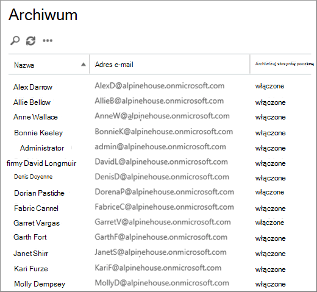

# <a name="customize-an-archive-and-deletion-policy-for-mailboxes-in-your-organization"></a>Dostosowywanie zasad archiwizacji i usuwania dla skrzynek pocztowych w organizacji

Microsoft 365 zgodności mogą utworzyć zasady archiwizacji i usuwania, które automatycznie przesuną elementy do archiwalnej skrzynki pocztowej [](archive-mailboxes.md) użytkownika i automatycznie usuwają elementy ze skrzynki pocztowej.

W tym celu należy utworzyć zasady przechowywania zarządzania rekordami wiadomości (MRM) przypisane do skrzynek pocztowych i przenosić elementy do archiwaowej skrzynki pocztowej użytkownika po określonym czasie, co powoduje również usunięcie elementów ze skrzynki pocztowej po osiągnięciu określonego limitu wieku. 

Rzeczywiste reguły, które określają, które elementy są przenoszone lub usuwane, a kiedy tak się dzieje, są nazywane tagami przechowywania. Tagi przechowywania są połączone z zasadami przechowywania MRM, które z kolei są przypisane do skrzynki pocztowej użytkownika. Tag przechowywania stosuje ustawienia przechowywania do poszczególnych wiadomości i folderów w skrzynce pocztowej użytkownika. Definiuje on, jak długo wiadomość pozostaje w skrzynce pocztowej i jakie działanie jest podejmowane, gdy wiadomość osiągnie określony wiek przechowywania. Gdy wiadomość osiągnie wiek przechowywania, jest przenoszony do archiwaowej skrzynki pocztowej użytkownika lub jest usuwana.
  
W procedurach  opisanej w tym artykule skonfigurujemy zasady archiwizacji i przechowywania dla fikcyjnej organizacji o nazwie Alpine House. Konfigurowanie tych zasad obejmuje następujące zadania:
  
- Włączanie archiwaowej skrzynki pocztowej dla każdego użytkownika w organizacji. Zapewnia to użytkownikom dodatkowe miejsce do magazynowania skrzynki pocztowej i jest wymagane, aby zasady przechowywania umożliwiały przenoszenie elementów do archiwaowej skrzynki pocztowej. Pozwala również użytkownikowi na przechowywanie archiwalnych informacji przez przenoszenie elementów do jego archiwalnej skrzynki pocztowej.

- Tworzenie trzech niestandardowych tagów przechowywania, które są następujące:

  - Automatyczne przeniesienie elementów, które mają 3 lata, do archiwaowej skrzynki pocztowej użytkownika. Przenoszenie elementów do archiwaowej skrzynki pocztowej w celu wolnej przestrzeni w podstawowej skrzynce pocztowej użytkownika.

  - Automatyczne usuwanie elementów, które mają 5 lat, z folderu Elementy usunięte. To również pozwala na wolne miejsce w podstawowej skrzynce pocztowej użytkownika. W razie potrzeby użytkownik będzie mieć możliwość odzyskania tych elementów. Aby uzyskać więcej szczegółowych [informacji, zobacz](#more-information) przypis dolny w sekcji Więcej informacji. 

  - Automatyczne (i trwałe) usuwanie elementów, które mają 7 lat, zarówno z podstawowej, jak i archiwatywnej skrzynki pocztowej. Ze względu na zgodność z przepisami niektóre organizacje muszą przechowywać pocztę e-mail przez określony czas. Po tym okresie czasu organizacja może chcieć trwale usunąć te elementy ze skrzynek pocztowych użytkowników.

- Tworzenie nowych zasad przechowywania i dodawanie do niego nowych niestandardowych tagów przechowywania. Ponadto dodasz także wbudowane tagi przechowywania do nowych zasad przechowywania. Obejmuje to tagi osobiste, które użytkownicy mogą przypisywać do elementów w swoich skrzynkach pocztowych. Dodasz także tag przechowywania, który przenosi elementy z folderu Elementy odzyskiwalne w podstawowej skrzynce pocztowej użytkownika do folderu Elementy odzyskiwalne w jego archiwawnej skrzynce pocztowej. Pozwala to zwiększyć ilość miejsca w folderze Elementy do odzyskania użytkownika, gdy jego skrzynka pocztowa zostanie umieszczona w miejscu.

Możesz wykonać niektóre lub wszystkie kroki opisane w tym artykule, aby skonfigurować zasady archiwizacji i usuwania dla skrzynek pocztowych w Twojej organizacji. Zalecamy przetestowanie tego procesu na kilku skrzynkach pocztowych przed zaimplementowaniem go we wszystkich skrzynkach pocztowych w Twojej organizacji.
  
## <a name="before-you-set-up-an-archive-and-deletion-policy"></a>Przed skonfigurowaniem zasad archiwizacji i usuwania

- Aby wykonać czynności opisane w tym temacie, musisz być administratorem globalnym w organizacji. 

- Po utworzeniu nowego konta użytkownika i przypisaniu użytkownikowi licencji Exchange Online skrzynka pocztowa jest tworzona automatycznie dla tego użytkownika. Po utworzeniu skrzynki pocztowej są do niego automatycznie przypisywane domyślne zasady przechowywania o nazwie Domyślne zasady MRM. W tym artykule utworzysz nowe zasady przechowywania, a następnie przypiszesz je do skrzynek pocztowych użytkowników, zastępując domyślne zasady MRM. Do skrzynki pocztowej mogą być przypisane tylko jedne zasady przechowywania na raz.

- Aby dowiedzieć się więcej o tagach przechowywania i zasadach przechowywania w aplikacji Exchange Online, zobacz Tagi przechowywania [i zasady przechowywania](/exchange/security-and-compliance/messaging-records-management/retention-tags-and-policies).

## <a name="step-1-enable-archive-mailboxes-for-users"></a>Krok 1. Włączanie archiwalnych skrzynek pocztowych dla użytkowników

Pierwszym krokiem jest włączenie archiwaowej skrzynki pocztowej dla każdego użytkownika w organizacji. Archiwalne skrzynki pocztowe użytkowników muszą być włączone, aby tag przechowywania z akcją przechowywania "Przenieś do archiwum" umożliwiał przenoszenie elementu po wygaśnięciu jego wieku przechowywania.
  
> [!NOTE]
> Archiwalne skrzynki pocztowe można włączyć w dowolnym momencie tego procesu, o ile zostały włączone w dowolnym momencie przed jego ukończeniem. Jeśli archiwalne skrzynki pocztowe nie są włączone, nie są podejmowane żadne akcje na żadnym z elementów, do których zostały przypisane zasady archiwizacji lub usuwania.
  
1. Przejdź do <https://compliance.microsoft.com>.

2. Zaloguj się przy użyciu konta administratora globalnego.
    
3. W Centrum zgodności platformy Microsoft 365 kliknij pozycję **Zarządzanie informacjami**, a następnie kliknij **kartę Archiwum**.

    Zostanie wyświetlona lista skrzynek pocztowych w Twojej organizacji oraz informacje o tym, czy odpowiadające im archiwalne skrzynki pocztowe są włączone, czy wyłączone.

4. Zaznacz wszystkie skrzynki pocztowe, klikając pierwszą na liście, a następnie przytrzymując klawisz **Shift** i klikając ostatnią skrzynkę na liście.

    > [!TIP]
    > W tym kroku założono, że nie włączono żadnych archiwalnych skrzynek pocztowych. Jeśli masz jakiekolwiek skrzynki pocztowe z włączonym archiwum, przytrzymaj naciśnięty klawisz **Ctrl** i kliknij każdą skrzynkę pocztową, która ma wyłączoną archiwacyjną skrzynkę pocztową. Możesz także kliknąć nagłówek kolumny Archiwizuj skrzynkę pocztową, aby posortować wiersze w zależności od tego, czy archiwalne skrzynki pocztowe zostały włączone, czy wyłączone, aby ułatwić zaznaczanie skrzynek pocztowych.
  
5. W okienku szczegółów w obszarze **Edycja zbiorcza** kliknij pozycję **Włącz**.

    Zostanie wyświetlone ostrzeżenie z informacją, że elementy starsze niż dwa lata zostaną przeniesione do nowej archiwaowej skrzynki pocztowej. Dzieje się tak, ponieważ wiek przechowywania dla domyślnych zasad przechowywania przypisywanych do nowo utworzonej skrzynki pocztowej użytkownika wynosi 2 lata. Wiek przechowywania dla niestandardowego tagu domyślnych zasad archiwizacji, który można utworzyć w kroku 2, wynosi 3 lata. Oznacza to, że elementy, które mają 3 lata lub więcej, zostaną przeniesione do archiwaowej skrzynki pocztowej.

6. Kliknij **przycisk Tak** , aby zamknąć komunikat ostrzegawczy i rozpocząć proces włączania archiwalnych skrzynek pocztowych dla każdej wybranej skrzynki pocztowej.

7. Po zakończeniu procesu kliknij pozycję **Odśwież.**  , aby zaktualizować listę na **stronie Archiwum** .

    Archiwalne skrzynki pocztowe są włączone dla wszystkich użytkowników w Twojej organizacji.

    

## <a name="step-2-create-new-retention-tags-for-the-archive-and-deletion-policies"></a>Krok 2. Tworzenie nowych tagów przechowywania dla zasad archiwizacji i usuwania

W tym kroku utworzysz trzy niestandardowe tagi przechowywania, które opisano wcześniej.
  
- Alpine House, 3 lata, Przenieś do archiwum (niestandardowe zasady archiwizacji)

- Alpine House, 7 lat, Usuń trwale (niestandardowe zasady usuwania)

- Alpine House, Elementy usunięte, 5 lat, Usuń i zezwal na odzyskiwanie (tag niestandardowy dla folderu Elementy usunięte)

Aby utworzyć nowe tagi przechowywania, użyj centrum administracyjnego usługi Exchange administracyjnego <a href="https://go.microsoft.com/fwlink/p/?linkid=2059104" target="_blank">w</a> Twojej organizacji Exchange Online organizacji. Pamiętaj, aby korzystać z klasycznej wersji programu EAC.
  
1. Przejdź do [https://admin.protection.outlook.com/ecp/](https://admin.protection.outlook.com/ecp/) konta i zaloguj się przy użyciu swoich poświadczeń.
  
2. W SACHE przejdź do tematu **Zarządzanie zgodnością** >  **Tagi ponownego wyeregowania**

    Zostanie wyświetlona lista tagów przechowywania dla Twojej organizacji.

### <a name="create-a-custom-archive-default-policy-tag"></a>Tworzenie niestandardowego tagu domyślnych zasad archiwizacji
  
Najpierw utworzysz niestandardowy tag domyślnych zasad archiwizacji (DPT, Default Policy Tag), który będzie przenosić elementy do archiwaowej skrzynki pocztowej po 3 latach.
  
1. Na stronie **Tagi przechowywania** kliknij pozycję **Nowy tag** Nowy, a następnie wybierz pozycję stosowane automatycznie **do całej skrzynki pocztowej (domyślnie)**.

2. Na stronie **Nowy tag stosowany automatycznie do całej skrzynki pocztowej (domyślnej)** wypełnij następujące pola: 

    
  
   1. **Nazwa** Wpisz nazwę nowego tagu przechowywania. 

   2. **Akcja przechowywania** Wybierz **pozycję Przenieś do archiwum,** aby przenosić elementy do archiwaowej skrzynki pocztowej po wygaśnięciu okresu przechowywania.

   3. **Okres przechowywania** Wybierz **pozycję Gdy element osiągnie następujący wiek (w** dniach), a następnie wprowadź czas trwania okresu przechowywania. W tym scenariuszu elementy będą przenoszone do archiwaowej skrzynki pocztowej po 1095 dniach (3 lata).

   4. **Komentarz** (opcjonalnie) Wpisz komentarz wyjaśniacy przeznaczenie niestandardowego tagu przechowywania.

3. Kliknij **pozycję Zapisz** , aby utworzyć niestandardowy tag tagu czasu archiwizacji.

    Nowy tag zasad archiwizacji zostanie wyświetlony na liście tagów przechowywania.

### <a name="create-a-custom-deletion-default-policy-tag"></a>Tworzenie niestandardowego tagu domyślnych zasad usuwania
  
Następnie utworzysz inny niestandardowy zasad zasad grupy, ale będzie to zasady usuwania, które trwale usuwają elementy po 7 latach.
  
1. Na stronie **Tagi przechowywania** kliknij pozycję **Nowy tag** Nowy, a następnie wybierz pozycję stosowane automatycznie **do całej skrzynki pocztowej (domyślnie)**.

2. Na stronie **Nowy tag stosowany automatycznie do całej skrzynki pocztowej (domyślnej)** wypełnij następujące pola: 

    
  
   1. **Nazwa** Wpisz nazwę nowego tagu przechowywania. 

   2. **Akcja przechowywania** Wybierz **pozycję Usuń trwale,** aby czyścić elementy ze skrzynki pocztowej po wygaśnięciu okresu przechowywania.

   3. **Okres przechowywania** Wybierz **pozycję Gdy element osiągnie następujący wiek (w** dniach), a następnie wprowadź czas trwania okresu przechowywania. W tym scenariuszu elementy będą czyszowane po 2555 dniach (7 lat).

   4. **Komentarz** (opcjonalnie) Wpisz komentarz wyjaśniacy przeznaczenie niestandardowego tagu przechowywania. 

3. Kliknij **przycisk Zapisz** , aby utworzyć niestandardowy kod DPT usuwania. 

    Nowy tag zasad usuwania zostanie wyświetlony na liście tagów przechowywania.

### <a name="create-a-custom-retention-policy-tag-for-the-deleted-items-folder"></a>Tworzenie niestandardowego tagu zasad przechowywania dla folderu Elementy usunięte
  
Ostatni tag przechowywania, który utworzysz, to niestandardowy tag zasad przechowywania (RPT, retention policy tag) dla folderu Elementy usunięte. Ten tag będzie usuwać elementy z folderu Elementy usunięte po 5 latach i będzie zapewniać okres odzyskiwania, w którym użytkownicy mogą odzyskać element za pomocą narzędzia Odzyskiwanie elementów usuniętych.
  
1. Na stronie **Tagi przechowywania** kliknij **ikonę Nowy tag** , a następnie wybierz pozycję **stosowane automatycznie do folderu domyślnego**.

2. Na stronie **Nowy tag stosowany automatycznie do folderu domyślnego** wypełnij następujące pola:

    
  
   1. **Nazwa** Wpisz nazwę nowego tagu przechowywania. 

   2. **Zastosuj ten tag do następującego folderu domyślnego** Z listy rozwijanej wybierz pozycję **Elementy usunięte**.

   3. **Akcja przechowywania** Wybierz **pozycję Usuń** i zezwalaj na odzyskiwanie, aby usuwać elementy po wygaśnięciu okresu przechowywania, ale zezwolić użytkownikom na odzyskanie usuniętego elementu przed upływem okresu przechowywania elementów usuniętych (który domyślnie wynosi 14 dni).

   4. **Okres przechowywania** Wybierz **pozycję Gdy element osiągnie następujący wiek (w** dniach), a następnie wprowadź czas trwania okresu przechowywania. W tym scenariuszu elementy będą usuwane po 1825 dniach (5 lat).

   5. **Komentarz** (opcjonalnie) Wpisz komentarz wyjaśniacy przeznaczenie niestandardowego tagu przechowywania. 

3. Kliknij **przycisk Zapisz** , aby utworzyć niestandardowy kod RPT dla folderu Elementy usunięte.

    Nowy tag zasad przechowywania zostanie wyświetlony na liście tagów przechowywania.

## <a name="step-3-create-a-new-retention-policy"></a>Krok 3. Tworzenie nowych zasad przechowywania

Kolejnym krokiem po utworzeniu niestandardowych tagów przechowywania jest utworzenie nowych zasad przechowywania i dodanie tagów przechowywania. Dodasz trzy niestandardowe tagi przechowywania utworzone w kroku 2 oraz wbudowane tagi, o których wspomniano w pierwszej sekcji. W kroku 4 przypiszesz te nowe zasady przechowywania do skrzynek pocztowych użytkowników.
  
1. W Uścisku wiadomości e-mail przejdź do **tematu Zarządzanie** **zgodnościąOszczędy** >  zasad.

2. Na stronie **Zasady przechowywania** kliknij **ikonę Nowy** .

3. W **polu Nazwa** wpisz nazwę nowych zasad przechowywania. na przykład zasady **archiwizacji i usuwania Alpine House**.

4. W **obszarze Tagi przechowywania** kliknij **ikonę** .

    Zostanie wyświetlona lista tagów przechowywania w Twojej organizacji. Zwróć uwagę, że są wyświetlane tagi niestandardowe utworzone w kroku 2.

5. Dodaj 9 tagów przechowywania, które zostały wyróżnione na poniższym zrzucie ekranu (te tagi opisano szczegółowo w [sekcji Więcej](#more-information) informacji). Aby dodać tag przechowywania, zaznacz go, a następnie kliknij przycisk **Dodaj**.

    
  
    > [!TIP]
    > Możesz zaznaczyć wiele tagów przechowywania, przytrzymując naciśnięty klawisz **Ctrl** i klikając każdy tag. 
  
6. Po dodaniu tagów przechowywania kliknij przycisk **OK**.

7. Na stronie **Nowe zasady przechowywania** kliknij pozycję **Zapisz** , aby utworzyć nowe zasady.

    Nowe zasady przechowywania zostaną wyświetlone na liście. Zaznacz je, aby wyświetlić połączone z nim tagi przechowywania w okienku szczegółów.

    
  
## <a name="step-4-assign-the-new-retention-policy-to-user-mailboxes"></a>Krok 4. Przypisywanie nowych zasad przechowywania do skrzynek pocztowych użytkowników

Po utworzeniu nowej skrzynki pocztowej są do niego domyślnie przypisywane zasady przechowywania o nazwie Domyślne zasady MRM. W tym kroku zastąpisz te zasady przechowywania (ponieważ do skrzynki pocztowej mogą być przypisane tylko jedne zasady przechowywania), przypisując do skrzynek pocztowych użytkowników w organizacji nowe zasady przechowywania utworzone w kroku 3. W tym kroku założono, że nowe zasady zostaną przypisane do wszystkich skrzynek pocztowych w organizacji.
  
1. W Programie EAC przejdź do **pola AdresaciMails** > .

    Zostanie wyświetlona lista wszystkich skrzynek pocztowych użytkowników w organizacji.

2. Zaznacz wszystkie skrzynki pocztowe, klikając pierwszą na liście, a następnie przytrzymując klawisz **Shift** i klikając ostatnią skrzynkę na liście. 

3. W okienku szczegółów po prawej stronie EAC w obszarze Edycja zbiorcza **kliknij pozycję** **Więcej opcji**.

4. W **obszarze Zasady przechowywania** kliknij pozycję **Aktualizuj**.

5. Na stronie **Zasady przechowywania** zbiorczego przypisz z listy  rozwijanej Wybierz zasady przechowywania wybierz zasady przechowywania utworzone w kroku 3. na przykład zasady **archiwizacji i przechowywania Alpine House**.

6. Kliknij **przycisk Zapisz** , aby zapisać przypisanie nowych zasad przechowywania.

7. Aby sprawdzić, czy nowe zasady przechowywania zostały przypisane do skrzynek pocztowych, możesz wykonać następujące czynności:

   1. Wybierz skrzynkę pocztową na **stronie Skrzynki** pocztowe, a następnie kliknij pozycję **Edytuj** .

   2. Na stronie właściwości skrzynki pocztowej wybranego użytkownika kliknij pozycję **Funkcje skrzynki pocztowej**.

   Nazwa nowych zasad przypisanych do skrzynki pocztowej jest wyświetlana na liście rozwijanej Zasady przechowywania.

## <a name="optional-step-5-run-the-managed-folder-assistant-to-apply-the-new-settings"></a>(Opcjonalnie) Krok 5. Uruchamianie asystenta folderów zarządzanych w celu zastosowania nowych ustawień

Po zastosowaniu nowych zasad przechowywania do skrzynek pocztowych w kroku 4 może upłynieć do 7 dni Exchange Online, aż nowe ustawienia przechowywania zostaną zastosowane do skrzynek pocztowych. Wynika to z tego, że proces o nazwie Asystent *folderów zarządzanych przetwarza* skrzynki pocztowe co najmniej raz na 7 dni. Zamiast czekać na uruchomienie asystenta folderów zarządzanych, możesz je wymusić, uruchamiając polecenie cmdlet **Start-ManagedFolderAssistant** w programie Exchange Online PowerShell.

 **Co się dzieje po uruchomieniu asystenta folderów zarządzanych?** Stosuje on ustawienia zasad przechowywania, przeprowadzając inspekcję elementów w skrzynce pocztowej i ustalając, czy podlegają one przechowywania. Następnie oznacza on elementy podlegające przechowywania za pomocą odpowiedniego tagu przechowywania, a następnie podejmuje określoną akcję przechowywania na elementach, które przeszły wiek przechowywania.
  
Oto procedura nawiązywania połączenia z programem Exchange Online PowerShell, a następnie uruchamiania asystenta folderów zarządzanych dla każdej skrzynki pocztowej w organizacji.

1. [Połączenie do Exchange Online PowerShell](/powershell/exchange/connect-to-exchange-online-powershell).
  
2. Uruchom następujące dwa polecenia, aby uruchomić Asystenta folderów zarządzanych dla wszystkich skrzynek pocztowych użytkowników w organizacji.

    ```powershell
    $Mailboxes = Get-Mailbox -ResultSize Unlimited -Filter {RecipientTypeDetails -eq "UserMailbox"}
    ```

    ```powershell
    $Mailboxes.Identity | Start-ManagedFolderAssistant
    ```

To wszystko! Zasady archiwizacji i usuwania dla organizacji Alpine House zostały przez Ciebie ustawione.

> [!NOTE]
> Jak wspomniano wcześniej, asystent folderów zarządzanych przetwarza skrzynki pocztowe co najmniej raz na 7 dni. W ten sposób możliwe, że skrzynka pocztowa może być częściej przetwarzana przez asystenta folderów zarządzanych. Ponadto administratorzy nie mogą przewidywać następnego przetworzenia skrzynki pocztowej przez asystenta folderów zarządzanych, co jest jednym z powodów, dla których warto uruchomić ją ręcznie. Jeśli jednak chcesz tymczasowo uniemożliwić asystentowi folderów zarządzanych stosowanie nowych ustawień przechowywania do skrzynki pocztowej, `Set-Mailbox -ElcProcessingDisabled $true` możesz uruchomić to polecenie, aby tymczasowo wyłączyć asystenta folderów zarządzanych w przetwarzaniu skrzynki pocztowej. Aby ponownie włączyć Asystenta folderów zarządzanych dla skrzynki pocztowej, uruchom to `Set-Mailbox -ElcProcessingDisabled $false` polecenie. Ponadto, jeśli użytkownik skrzynki pocztowej ma wyłączone konto, nie będziemy przetwarzać czynności przenoszenia elementów do archiwizacji dla tej skrzynki pocztowej.
  
## <a name="optional-step-6-make-the-new-retention-policy-the-default-for-your-organization"></a>(Opcjonalnie) Krok 6. Ustawienie nowych zasad przechowywania jako domyślnych dla organizacji

W kroku 4 musisz przypisać nowe zasady przechowywania do istniejących skrzynek pocztowych. Możesz jednak skonfigurować Exchange Online tak, aby nowe zasady przechowywania zostały przypisane do nowych skrzynek pocztowych, które zostaną utworzone w przyszłości. Możesz to zrobić, używając Exchange Online PowerShell w celu zaktualizowania domyślnego planu skrzynki pocztowej Twojej organizacji. Plan *skrzynki pocztowej* to szablon, który automatycznie konfiguruje właściwości nowych skrzynek pocztowych.  W tym kroku opcjonalnym możesz zastąpić bieżące zasady przechowywania przypisane do planu skrzynki pocztowej (domyślnie domyślne zasady MRM) na zasady przechowywania utworzone w kroku 3. Po zaktualizowaniu planu skrzynki pocztowej nowe zasady przechowywania zostaną przypisane do nowych skrzynek pocztowych.

1. [Połączenie do Exchange Online PowerShell](/powershell/exchange/connect-to-exchange-online-powershell).

2. Uruchom następujące polecenie, aby wyświetlić informacje o planach skrzynki pocztowej w organizacji.

    ```powershell
    Get-MailboxPlan | Format-Table DisplayName,RetentionPolicy,IsDefault
    ```

    Zwróć uwagę na plan skrzynki pocztowej ustawiony jako domyślny.

3. Uruchom następujące polecenie, aby przypisać nowe zasady przechowywania utworzone w kroku 3 (na przykład zasady archiwizacji i przechowywania **Alpine House**) do domyślnego planu skrzynki pocztowej. W tym przykładzie przyjęto, że nazwa domyślnego planu skrzynek pocztowych to **ExchangeOnlineEnterprise**.

    ```powershell
    Set-MailboxPlan "ExchangeOnlineEnterprise" -RetentionPolicy "Alpine House Archive and Retention Policy"
    ```

4. Możesz ponownie uruchomić polecenie w kroku 2, aby sprawdzić, czy zasady przechowywania przypisane do domyślnego planu skrzynki pocztowej zostały zmienione.

## <a name="more-information"></a>Więcej informacji

- Jak jest obliczany wiek przechowywania? Wiek przechowywania elementów skrzynki pocztowej jest obliczany na podstawie daty dostarczenia lub daty utworzenia dla elementów, takich jak wersje robocze wiadomości, które nie są wysyłane, ale są tworzone przez użytkownika. Gdy asystent folderów zarządzanych przetwarza elementy w skrzynce pocztowej, oznacza on datę rozpoczęcia i datę wygaśnięcia dla wszystkich elementów, które mają tagi przechowywania z akcją przechowywania Usuń i zezwalaj na odzyskiwanie lub Usuń trwale. Elementy, które mają tag archiwizacji, są oznaczane sygnaturą z datą przeniesienia. 

- W poniższej tabeli przedstawiono więcej informacji na temat poszczególnych tagów przechowywania dodawanych do niestandardowych zasad przechowywania, które zostały utworzone za pomocą procedury opisanej w tym temacie.

    | Tag przechowywania | Co robi ten tag | Wbudowany, czy niestandardowy? | Wpisać |
    |:-----|:-----|:-----|:-----|
    |Alpine House, 3 lata, Przenieś do archiwum  <br/> |Przenosi elementy, które mają 1095 dni (3 lata) do archiwaowej skrzynki pocztowej.  <br/> |Niestandardowe (zobacz [Krok 2. Tworzenie nowych tagów przechowywania dla zasad archiwizacji i usuwania](#step-2-create-new-retention-tags-for-the-archive-and-deletion-policies))  <br/> |Tag zasad domyślnych (archiwum); ten tag jest automatycznie stosowany do całej skrzynki pocztowej.  <br/> |
    |Alpine House, 7 lat, Usuń trwale  <br/> |Trwałe usuwanie elementów w podstawowej skrzynce pocztowej lub archiwatywnej skrzynce pocztowej, gdy mają 7 lat.  <br/> |Niestandardowe (zobacz [Krok 2. Tworzenie nowych tagów przechowywania dla zasad archiwizacji i usuwania](#step-2-create-new-retention-tags-for-the-archive-and-deletion-policies))  <br/> |Tag zasad domyślnych (usuwanie); ten tag jest automatycznie stosowany do całej skrzynki pocztowej.  <br/> |
    |Alpine House, Elementy usunięte, 5 lat, Usuń i zezwal na odzyskiwanie  <br/> |Usuwa elementy, które mają 5 lat, z folderu Elementy usunięte. Użytkownicy mogą odzyskać te elementy w ciągu 14 dni od ich usunięcia.<sup>\*</sup> <br/> |Niestandardowe (zobacz [Krok 2. Tworzenie nowych tagów przechowywania dla zasad archiwizacji i usuwania](#step-2-create-new-retention-tags-for-the-archive-and-deletion-policies))  <br/> |Tag zasad przechowywania (elementy usunięte); ten tag jest automatycznie stosowany do elementów w folderze Elementy usunięte.  <br/> |
    |Elementy odzyskiwalne, 14 dni, Przenieś do archiwum  <br/> |Przenosi elementy, które były w folderze Elementy do odzyskania przez 14 dni, do folderu Elementy do odzyskania w archiwaowej skrzynce pocztowej.  <br/> |Wbudowane  <br/> |Tag zasad przechowywania (elementy odzyskiwalne); ten tag jest automatycznie stosowany do elementów w folderze Elementy do odzyskania.  <br/> |
    |Wiadomości-śmieci  <br/> |Trwałe usuwanie elementów, które były w folderze Wiadomości-śmieci przez 30 dni. Użytkownicy mogą odzyskać te elementy w ciągu 14 dni od ich usunięcia.<sup>\*</sup> <br/> |Wbudowane  <br/> |Tag zasad przechowywania (wiadomości-śmieci); ten tag jest automatycznie stosowany do elementów w folderze Wiadomości-śmieci.  <br/> |
    |1 miesiąc, Usuń  <br/> |Trwałe usuwanie elementów, które mają 30 dni. Użytkownicy mogą odzyskać te elementy w ciągu 14 dni od ich usunięcia.<sup>\*</sup> <br/> |Wbudowane  <br/> |Osobiste; ten tag może być stosowany przez użytkowników.  <br/> |
    |1 rok, Usuń  <br/> |Trwałe usuwanie elementów, które mają 365 dni. Użytkownicy mogą odzyskać te elementy w ciągu 14 dni od ich usunięcia.<sup>\*</sup> <br/> |Wbudowane  <br/> |Osobiste; ten tag może być stosowany przez użytkowników.  <br/> |
    |Nigdy nie usuwaj  <br/> |Ten tag zapobiega usuwaniu elementów przez zasady przechowywania.  <br/> |Wbudowane  <br/> |Osobiste; ten tag może być stosowany przez użytkowników.  <br/> |
    |Osobisty, 1 rok, przenieś do archiwum  <br/> |Przenosi elementy do archiwaowej skrzynki pocztowej po upływie 1 roku.  <br/> |Wbudowane  <br/> |Osobiste; ten tag może być stosowany przez użytkowników.  <br/> |

    > <sup>\*</sup>Użytkownicy mogą używać narzędzia Odzyskiwanie elementów usuniętych w programach Outlook i Outlook w sieci Web (dawniej nazywanych Outlook Web App), aby odzyskać usunięty element w okresie przechowywania elementów usuniętych, który domyślnie wynosi 14 dni w Exchange Online. Administrator może użyć Windows PowerShell, aby maksymalnie zwiększyć okres przechowywania elementów usuniętych do maksymalnie 30 dni. Aby uzyskać więcej informacji, zobacz: Odzyskiwanie elementów usuniętych w programie [Outlook for Windows](https://support.office.com/article/49e81f3c-c8f4-4426-a0b9-c0fd751d48ce) i Zmienianie okresu przechowywania elementów usuniętych dla skrzynki pocztowej w [programie Exchange Online](/exchange/recipients-in-exchange-online/manage-user-mailboxes/change-deleted-item-retention)
  
- Używanie **tagu przechowywania Elementy odzyskiwalne, 14** dni, Przenieś do archiwum pomaga w wolniu miejsca w folderze Elementy do odzyskania w podstawowej skrzynce pocztowej użytkownika. Jest to przydatne, gdy skrzynka pocztowa użytkownika jest umieszczana w miejscu przechowywania, co oznacza, że nic nie jest nigdy trwale usuwane. Bez przenoszenia elementów do archiwaowej skrzynki pocztowej możliwe jest, że zostanie osiągnięty przydział magazynowania dla folderu Elementy odzyskiwalne w podstawowej skrzynce pocztowej. Aby uzyskać więcej informacji na ten temat i dowiedzieć się, jak tego uniknąć, zobacz Zwiększanie przydziału elementów odzyskiwalnych dla skrzynek pocztowych w [hold.](./increase-the-recoverable-quota-for-mailboxes-on-hold.md)
