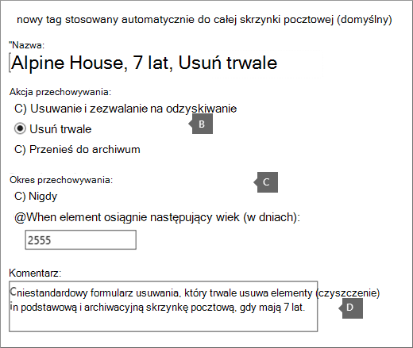

# <a name="customize-an-archive-and-deletion-policy-for-mailboxes-in-your-organization"></a>Dostosowywanie zasad archiwum i usuwania skrzynek pocztowych w organizacji

Administratorzy usługi Microsoft Purview mogą utworzyć zasady archiwizacji i usuwania, które automatycznie przenosi elementy do [skrzynki pocztowej archiwum](archive-mailboxes.md) użytkownika i automatycznie usuwa elementy ze skrzynki pocztowej.

Można to zrobić, tworząc zasady przechowywania zarządzania rekordami obsługi komunikatów (MRM), które następnie są przypisywane do skrzynek pocztowych. Te zasady przenosi elementy do archiwum skrzynki pocztowej użytkownika po określonym czasie, a także usuwa elementy ze skrzynki pocztowej po osiągnięciu określonego limitu wieku.

Rzeczywiste reguły określające, które elementy są przenoszone lub usuwane oraz kiedy to się dzieje, są nazywane tagami przechowywania. Tagi przechowywania są połączone z zasadami przechowywania usługi MRM, które z kolei są przypisywane do skrzynki pocztowej użytkownika. Tag przechowywania stosuje ustawienia przechowywania do poszczególnych wiadomości i folderów w skrzynce pocztowej użytkownika. Określa, jak długo wiadomość pozostaje w skrzynce pocztowej i jaka akcja jest podejmowana, gdy wiadomość osiągnie określony wiek przechowywania. Gdy wiadomość osiągnie swój wiek przechowywania, zostanie przeniesiona do archiwum skrzynki pocztowej użytkownika lub zostanie usunięta.
  
Kroki opisane w tym artykule umożliwiają skonfigurowanie zasad archiwizacji i przechowywania fikcyjnej organizacji o nazwie Alpine House. Konfigurowanie tych zasad obejmuje następujące zadania:
  
- Włącz skrzynkę pocztową archiwum dla każdego użytkownika w organizacji. Ta procedura zapewnia użytkownikom więcej miejsca do magazynowania skrzynek pocztowych i jest wymagana, aby zasady przechowywania mogły automatycznie przenosić elementy do skrzynki pocztowej archiwum. Użytkownik może również ręcznie przenieść elementy do swojej archiwum skrzynki pocztowej na potrzeby magazynu archiwizacji.

- Utwórz trzy niestandardowe tagi przechowywania, aby wykonać następujące akcje:

  - Automatycznie przenieś elementy, które mają 3 lata, do archiwum skrzynki pocztowej użytkownika. Przeniesienie elementów do archiwum skrzynki pocztowej zwalnia miejsce w podstawowej skrzynce pocztowej użytkownika.

  - Automatycznie usuwaj elementy, które mają 5 lat, z folderu Elementy usunięte. Zwalnia to również miejsce w podstawowej skrzynce pocztowej użytkownika. Użytkownicy będą mieli możliwość odzyskania tych elementów w razie potrzeby. Aby uzyskać więcej informacji, zobacz przypis dolny w sekcji [Więcej informacji](#more-information) . 

  - Automatycznie (i trwale) usuwaj elementy, które mają 7 lat, zarówno ze podstawowej, jak i archiwum skrzynki pocztowej. Ze względu na przepisy dotyczące zgodności niektóre organizacje muszą przechowywać pocztę e-mail przez określony czas. Po upływie tego okresu organizacja może chcieć trwale usunąć te elementy ze skrzynek pocztowych użytkowników.

- Utwórz nowe zasady przechowywania i dodaj do niej nowe niestandardowe tagi przechowywania. Ponadto do nowych zasad przechowywania dodasz wbudowane tagi przechowywania. Obejmuje to tagi osobiste, które użytkownicy mogą przypisywać do elementów w swojej skrzynce pocztowej. Dodasz również tag przechowywania, który przenosi elementy z folderu Elementy możliwe do odzyskania w podstawowej skrzynce pocztowej użytkownika do folderu Elementy możliwe do odzyskania w skrzynce pocztowej archiwum. Ta akcja pomaga zwolnić miejsce w folderze elementów możliwych do odzyskania użytkownika, gdy jego skrzynka pocztowa zostanie wstrzymana.

Możesz wykonać niektóre lub wszystkie kroki opisane w tym artykule, aby skonfigurować zasady archiwum i usuwania skrzynek pocztowych we własnej organizacji. Zalecamy przetestowanie tego procesu w kilku skrzynkach pocztowych przed zaimplementowaniem go we wszystkich skrzynkach pocztowych w organizacji.
  
## <a name="before-you-set-up-an-archive-and-deletion-policy"></a>Przed skonfigurowaniem zasad archiwum i usuwania

- Aby wykonać kroki opisane w tym artykule, musisz być administratorem globalnym w organizacji.

- Podczas tworzenia nowego konta użytkownika i przypisywania użytkownikowi licencji Exchange Online automatycznie tworzona jest skrzynka pocztowa dla użytkownika. Po utworzeniu skrzynki pocztowej są automatycznie przypisywane domyślne zasady przechowywania o nazwie Domyślne zasady MRM. W tym artykule utworzysz nowe zasady przechowywania mrm, a następnie przypiszesz je do skrzynek pocztowych użytkowników, zastępując domyślne zasady MRM. Skrzynka pocztowa może mieć przypisaną tylko jedną zasadę przechowywania mrm w dowolnym momencie.

- Aby dowiedzieć się więcej na temat tagów przechowywania i zasad przechowywania mrm w Exchange Online, zobacz [Tagi przechowywania i zasady przechowywania](/exchange/security-and-compliance/messaging-records-management/retention-tags-and-policies).

## <a name="step-1-enable-archive-mailboxes-for-users"></a>Krok 1. Włączanie archiwalnych skrzynek pocztowych dla użytkowników

Pierwszym krokiem jest upewnienie się, że każdy użytkownik w organizacji ma archiwum skrzynki pocztowej. Skrzynka pocztowa archiwum użytkownika musi być włączona, aby tag przechowywania z akcją przechowywania "Przenieś do archiwum" mógł przenieść element po upływie wieku przechowywania.

Aby uzyskać instrukcje dotyczące włączania archiwalnych skrzynek pocztowych, zobacz [Włączanie archiwalnych skrzynek pocztowych w portal zgodności Microsoft Purview](enable-archive-mailboxes.md).
  
> [!NOTE]
> Skrzynki pocztowe archiwum można włączyć w dowolnym momencie w trakcie tego procesu, tak długo, jak długo zostaną włączone w pewnym momencie przed ukończeniem procesu. Jeśli skrzynka pocztowa archiwum nie jest włączona, nie jest podejmowana żadna akcja dotycząca żadnych elementów, do których przypisano archiwum lub zasady usuwania.

## <a name="step-2-create-new-retention-tags-for-the-archive-and-deletion-policies"></a>Krok 2. Tworzenie nowych tagów przechowywania dla zasad archiwum i usuwania

W tym kroku utworzysz trzy niestandardowe tagi przechowywania, które zostały wcześniej opisane.
  
- Alpine House 3 Year Move to Archive (niestandardowe zasady archiwum)

- Alpine House 7 Year Permanently Delete (niestandardowe zasady usuwania)

- Alpine House Deleted Items 5 Years Delete and Allow Recovery (tag niestandardowy folderu Elementy usunięte)

Aby utworzyć nowe tagi przechowywania, użyjesz <a href="https://go.microsoft.com/fwlink/p/?linkid=2059104" target="_blank">centrum administracyjnego programu Exchange (EAC)</a> w organizacji Exchange Online. Pamiętaj, aby użyć klasycznej wersji eac.
  
1. Przejdź do obszaru [https://admin.protection.outlook.com/ecp/](https://admin.protection.outlook.com/ecp/) i zaloguj się przy użyciu poświadczeń.
  
2. W usłudze EAC przejdź do pozycji **Tagi przechowywania** **zarządzania zgodnością** > 

    Zostanie wyświetlona lista tagów przechowywania dla organizacji.

### <a name="create-a-custom-archive-default-policy-tag"></a>Tworzenie niestandardowego domyślnego tagu zasad archiwum
  
Najpierw utworzysz niestandardowy domyślny tag zasad archiwum (DPT), który przeniesie elementy do skrzynki pocztowej archiwum po 3 latach.
  
1. Na stronie **Tagi przechowywania** wybierz pozycję **Nowy tag**, a następnie wybierz pozycję **Zastosowane automatycznie do całej skrzynki pocztowej (wartość domyślna).**

2. Na stronie **Nowy tag zastosowany automatycznie do całej skrzynki pocztowej (domyślnej)** wypełnij następujące pola: 

    
  
   1. **Nazwa** Wpisz nazwę nowego tagu przechowywania. 

   2. **Akcja przechowywania** Wybierz pozycję **Przenieś do archiwum** , aby przenieść elementy do skrzynki pocztowej archiwum po upływie okresu przechowywania.

   3. **Okres przechowywania** Wybierz **pozycję Kiedy element osiągnie następujący wiek (w dniach), a następnie wprowadź** czas trwania okresu przechowywania. W tym scenariuszu elementy zostaną przeniesione do archiwum skrzynki pocztowej po 1095 dniach (3 lata).

   4. **Komentarz** (opcjonalnie) Wpisz komentarz wyjaśniający przeznaczenie niestandardowego tagu przechowywania.

3. Wybierz pozycję **Zapisz** , aby utworzyć niestandardowe archiwum DPT.

    Nowy archiwum DPT jest wyświetlany na liście tagów przechowywania.

### <a name="create-a-custom-deletion-default-policy-tag"></a>Tworzenie domyślnego tagu zasad usuwania niestandardowego
  
Następnie utworzysz kolejny niestandardowy program DPT, ale będzie to zasada usuwania, która trwale usuwa elementy po 7 latach.
  
1. Na stronie **Tagi przechowywania** wybierz pozycję **Nowy tag**, a następnie wybierz pozycję **Zastosowane automatycznie do całej skrzynki pocztowej (wartość domyślna).**

2. Na stronie **Nowy tag zastosowany automatycznie do całej skrzynki pocztowej (domyślnej)** wypełnij następujące pola: 

    
  
   1. **Nazwa** Wpisz nazwę nowego tagu przechowywania. 

   2. **Akcja przechowywania** Wybierz pozycję **Trwale usuń** , aby przeczyścić elementy ze skrzynki pocztowej po upływie okresu przechowywania.

   3. **Okres przechowywania** Wybierz **pozycję Kiedy element osiągnie następujący wiek (w dniach), a następnie wprowadź** czas trwania okresu przechowywania. W tym scenariuszu elementy zostaną przeczyszczane po 2555 dniach (7 latach).

   4. **Komentarz** (opcjonalnie) Wpisz komentarz wyjaśniający przeznaczenie niestandardowego tagu przechowywania. 

3. Wybierz pozycję **Zapisz** , aby utworzyć niestandardowy identyfikator DPT usuwania. 

    Nowy identyfikator DPT usuwania jest wyświetlany na liście tagów przechowywania.

### <a name="create-a-custom-retention-policy-tag-for-the-deleted-items-folder"></a>Tworzenie niestandardowego tagu zasad przechowywania dla folderu Elementy usunięte
  
Ostatni tag przechowywania do utworzenia to niestandardowy tag zasad przechowywania (RPT) dla folderu Elementy usunięte. Ten tag spowoduje usunięcie elementów w folderze Elementy usunięte po 5 latach i zapewni okres odzyskiwania, gdy użytkownicy będą mogli odzyskać element za pomocą narzędzia Odzyskaj usunięte elementy.
  
1. Na stronie **Tagi przechowywania** wybierz pozycję **Nowy tag** , a następnie wybierz pozycję **Zastosowane automatycznie do folderu domyślnego**.

2. Na stronie **Nowy tag zastosowany automatycznie do folderu domyślnego** wypełnij następujące pola:

    
  
   1. **Nazwa** Wpisz nazwę nowego tagu przechowywania. 

   2. **Zastosuj ten tag do następującego folderu domyślnego** Z listy rozwijanej wybierz pozycję **Usunięte elementy**.

   3. **Akcja przechowywania** Wybierz pozycję **Usuń i zezwalaj** usunięciu elementów przez odzyskiwanie po wygaśnięciu okresu przechowywania, ale zezwalaj użytkownikom na odzyskanie usuniętego elementu w okresie przechowywania usuniętego elementu (domyślnie jest to 14 dni).

   4. **Okres przechowywania** Wybierz **pozycję Kiedy element osiągnie następujący wiek (w dniach), a następnie wprowadź** czas trwania okresu przechowywania. W tym scenariuszu elementy zostaną usunięte po 1825 dniach (5 lat).

   5. **Komentarz** (opcjonalnie) Wpisz komentarz wyjaśniający przeznaczenie niestandardowego tagu przechowywania. 

3. Wybierz pozycję **Zapisz** , aby utworzyć niestandardowy RPT dla folderu Elementy usunięte.

    Nowy RPT jest wyświetlany na liście tagów przechowywania.

## <a name="step-3-create-a-new-retention-policy"></a>Krok 3. Tworzenie nowych zasad przechowywania

Po utworzeniu niestandardowych tagów przechowywania następnym krokiem jest utworzenie nowych zasad przechowywania i dodanie tagów przechowywania. Dodasz trzy niestandardowe tagi przechowywania utworzone w kroku 2 oraz wbudowane tagi wymienione w pierwszej sekcji. W kroku 4 przypiszesz te nowe zasady przechowywania do skrzynek pocztowych użytkowników.
  
1. W usłudze EAC przejdź do pozycji **Zasady przechowywania** **zarządzania zgodnością** > .

2. Na stronie **Zasady przechowywania** wybierz pozycję **Nowa** .

3. W polu **Nazwa** wpisz nazwę nowych zasad przechowywania; na przykład **Alpine House Archive and Deletion Policy( Alpine House Archive and Deletion Policy**).

4. W obszarze **Tagi przechowywania** wybierz pozycję **Dodaj** 

    Zostanie wyświetlona lista tagów przechowywania w organizacji. Zwróć uwagę na tagi niestandardowe utworzone w kroku 2.

5. Dodaj 9 tagów przechowywania wyróżnionych na poniższym zrzucie ekranu (te tagi zostały szczegółowo opisane w sekcji [Więcej informacji](#more-information) ). Aby dodać tag przechowywania, wybierz go, a następnie wybierz pozycję **Dodaj**.

    
  
    > [!TIP]
    > Możesz wybrać wiele tagów przechowywania, przytrzymując klawisz **Ctrl** , a następnie klikając każdy tag. 
  
6. Po dodaniu tagów przechowywania wybierz przycisk **OK**.

7. Na stronie **Nowe zasady przechowywania** wybierz pozycję **Zapisz** , aby utworzyć nowe zasady.

    Nowe zasady przechowywania są wyświetlane na liście. Wybierz ją, aby wyświetlić tagi przechowywania połączone z nim w okienku szczegółów.

    
  
## <a name="step-4-assign-the-new-retention-policy-to-user-mailboxes"></a>Krok 4. Przypisywanie nowych zasad przechowywania do skrzynek pocztowych użytkowników

Po utworzeniu nowej skrzynki pocztowej domyślnie są do niej przypisywane zasady przechowywania o nazwie Domyślne zasady MRM. W tym kroku zastąpisz te zasady przechowywania, przypisując nowe zasady przechowywania utworzone w kroku 3 do skrzynek pocztowych użytkowników w organizacji. Wymiana jest wymagana, ponieważ skrzynka pocztowa może mieć przypisane tylko jedną zasadę przechowywania mrm naraz. W tym kroku przyjęto założenie, że nowe zasady zostaną przypisane do wszystkich skrzynek pocztowych w organizacji.
  
1. W usłudze EAC przejdź do **obszaru Skrzynki pocztowe** **adresatów** > .

    Zostanie wyświetlona lista wszystkich skrzynek pocztowych użytkowników w organizacji.

2. Zaznacz wszystkie skrzynki pocztowe, klikając pierwszą z nich na liście, przytrzymując klawisz **Shift** , a następnie klikając ostatnią na liście. 

3. W okienku szczegółów w usłudze EAC w obszarze **Edycja zbiorcza** wybierz pozycję **Więcej opcji**.

4. W obszarze **Zasady przechowywania** wybierz pozycję **Aktualizuj**.

5. Na stronie **Zasad przechowywania przypisywania zbiorczego** na liście rozwijanej **Wybierz zasady przechowywania** wybierz zasady przechowywania utworzone w kroku 3. na przykład **zasady archiwum i przechowywania alpine house**.

6. Wybierz pozycję **Zapisz** , aby zapisać nowe przypisanie zasad przechowywania.

7. Aby sprawdzić, czy nowe zasady przechowywania zostały przypisane do skrzynek pocztowych:

   1. Wybierz skrzynkę pocztową na stronie **Skrzynki pocztowe**, a następnie wybierz pozycję **Edytuj** 

   2. Na stronie właściwości skrzynki pocztowej dla wybranego użytkownika wybierz pozycję **Funkcje skrzynki pocztowej**.

   Nazwa nowych zasad przypisanych do skrzynki pocztowej jest wyświetlana na liście rozwijanej **Zasady przechowywania** .

## <a name="optional-step-5-run-the-managed-folder-assistant-to-apply-the-new-settings"></a>(Opcjonalnie) Krok 5. Uruchamianie asystenta folderów zarządzanych w celu zastosowania nowych ustawień

Po zastosowaniu nowych zasad przechowywania do skrzynek pocztowych w kroku 4 zastosowanie nowych ustawień przechowywania do skrzynek pocztowych może potrwać do 7 dni w Exchange Online. Dzieje się tak, ponieważ proces o nazwie *Asystent folderów zarządzanych* przetwarza skrzynki pocztowe co najmniej raz na 7 dni. Zamiast czekać na uruchomienie Asystenta folderów zarządzanych, możesz wymusić, że tak się stanie, uruchamiając polecenie cmdlet **Start-ManagedFolderAssistant** w programie Exchange Online programu PowerShell.

 **Co się stanie po uruchomieniu Asystenta folderów zarządzanych?** Stosuje ustawienia w zasadach przechowywania, sprawdzając elementy w skrzynce pocztowej i określając, czy podlegają one przechowywaniu. Następnie sygnaturuje elementy podlegające przechowywaniu przy użyciu odpowiedniego tagu przechowywania, a następnie wykonuje określoną akcję przechowywania dla elementów po osiągnięciu wieku przechowywania.
  
Poniżej przedstawiono kroki nawiązywania połączenia z programem Exchange Online programu PowerShell, a następnie uruchamiania asystenta folderów zarządzanych w każdej skrzynce pocztowej w organizacji.

1. [Połącz się z usługą Exchange Online w programie PowerShell](/powershell/exchange/connect-to-exchange-online-powershell).
  
2. Uruchom następujące dwa polecenia, aby uruchomić Asystenta folderów zarządzanych dla wszystkich skrzynek pocztowych użytkowników w organizacji.

    ```powershell
    $Mailboxes = Get-Mailbox -ResultSize Unlimited -Filter {RecipientTypeDetails -eq "UserMailbox"}
    ```

    ```powershell
    $Mailboxes.Identity | Start-ManagedFolderAssistant
    ```

To wszystko! Skonfigurowano zasady archiwum i usuwania dla organizacji Alpine House.

### <a name="more-information-about-the-managed-folder-assistant"></a>Więcej informacji na temat Asystenta folderów zarządzanych

Jak wspomniano wcześniej, Asystent folderów zarządzanych przetwarza skrzynki pocztowe co najmniej raz na 7 dni. W związku z tym możliwe jest, że skrzynka pocztowa może być częściej przetwarzana przez asystenta folderów zarządzanych. Ponadto administratorzy nie mogą przewidzieć, kiedy następnym razem skrzynka pocztowa zostanie przetworzona przez Asystenta folderów zarządzanych, co jest jednym z powodów, dla których warto uruchomić ją ręcznie. 

Jeśli jednak chcesz tymczasowo uniemożliwić asystentowi folderów zarządzanych stosowanie nowych ustawień przechowywania do skrzynki pocztowej, możesz uruchomić `Set-Mailbox -ElcProcessingDisabled $true` polecenie, aby tymczasowo wyłączyć asystenta folderów zarządzanych z przetwarzania skrzynki pocztowej. 

Aby ponownie włączyć asystenta folderów zarządzanych dla skrzynki pocztowej `Set-Mailbox -ElcProcessingDisabled $false` , uruchom polecenie . 

Na koniec, jeśli użytkownik skrzynki pocztowej ma wyłączone konto, elementy nie zostaną przeniesione do archiwum skrzynki pocztowej dla tej skrzynki pocztowej.
  
## <a name="optional-step-6-make-the-new-retention-policy-the-default-for-your-organization"></a>(Opcjonalnie) Krok 6. Ustaw nowe zasady przechowywania jako domyślne dla organizacji

W kroku 4 należy przypisać nowe zasady przechowywania do istniejących skrzynek pocztowych. Można jednak skonfigurować Exchange Online, aby nowe zasady przechowywania były przypisywane do nowych skrzynek pocztowych utworzonych w przyszłości. 

Można to zrobić za pomocą programu Exchange Online Programu PowerShell w celu zaktualizowania domyślnego planu skrzynki pocztowej organizacji. *Plan skrzynki pocztowej* to szablon, który automatycznie konfiguruje właściwości w nowych skrzynkach pocztowych.  W tym opcjonalnym kroku można zastąpić bieżące zasady przechowywania przypisane do planu skrzynki pocztowej (domyślnie domyślne zasady MRM) zasadami przechowywania mrm utworzonymi w kroku 3. Po zaktualizowaniu planu skrzynki pocztowej nowe zasady przechowywania mrm zostaną przypisane do nowych skrzynek pocztowych.

1. [Połącz się z usługą Exchange Online w programie PowerShell](/powershell/exchange/connect-to-exchange-online-powershell).

2. Uruchom następujące polecenie, aby wyświetlić informacje o planach skrzynek pocztowych w organizacji.

    ```powershell
    Get-MailboxPlan | Format-Table DisplayName,RetentionPolicy,IsDefault
    ```
    
    Zanotuj plan skrzynki pocztowej ustawiony jako domyślny.

3. Uruchom następujące polecenie, aby przypisać nowe zasady przechowywania mrm utworzone w kroku 3 (na przykład **Alpine House Archive and Retention Policy**) do domyślnego planu skrzynki pocztowej. W tym przykładzie przyjęto założenie, że nazwa domyślnego planu skrzynki pocztowej to **ExchangeOnlineEnterprise**.
    
    ```powershell
    Set-MailboxPlan "ExchangeOnlineEnterprise" -RetentionPolicy "Alpine House Archive and Retention Policy"
    ```

4. Możesz ponownie uruchomić polecenie w kroku 2, aby sprawdzić, czy zasady przechowywania mrm przypisane do domyślnego planu skrzynki pocztowej zostały zmienione.

## <a name="more-information"></a>Więcej informacji

- Wiek przechowywania elementów skrzynki pocztowej jest obliczany od daty dostarczenia. Lub od daty utworzenia elementów, takich jak robocze komunikaty, które nie są wysyłane, ale są tworzone przez użytkownika. Gdy Asystent folderów zarządzanych przetwarza elementy w skrzynce pocztowej, oznacza datę rozpoczęcia i datę wygaśnięcia dla wszystkich elementów, które mają tagi przechowywania z akcją Usuń i Zezwalaj na odzyskiwanie lub trwałe usuwanie przechowywania. Elementy z tagiem archiwum są opatrzone datą przeniesienia.

- Poniższa tabela zawiera więcej informacji o każdym tagu przechowywania niestandardowych zasad przechowywania MRM w tym artykule.

    | Tag przechowywania | Co robi ten tag | Wbudowane czy niestandardowe? | Wpisać |
    |:-----|:-----|:-----|:-----|
    |Alpine House 3 Rok Przenieś się do Archiwum  <br/> |Przenosi elementy, które mają 1095 dni (3 lata) do skrzynki pocztowej archiwum.  <br/> |Niestandardowe (zobacz [Krok 2. Tworzenie nowych tagów przechowywania dla zasad archiwum i usuwania](#step-2-create-new-retention-tags-for-the-archive-and-deletion-policies))  <br/> |Domyślny tag zasad (archiwum); Ten tag jest automatycznie stosowany do całej skrzynki pocztowej.  <br/> |
    |Alpine House 7 rok trwale usunąć  <br/> |Trwale usuwa elementy w podstawowej skrzynce pocztowej lub skrzynki pocztowej archiwum, gdy mają 7 lat.  <br/> |Niestandardowe (zobacz [Krok 2. Tworzenie nowych tagów przechowywania dla zasad archiwum i usuwania](#step-2-create-new-retention-tags-for-the-archive-and-deletion-policies))  <br/> |Domyślny tag zasad (usunięcie); Ten tag jest automatycznie stosowany do całej skrzynki pocztowej.  <br/> |
    |Alpine House usunięte elementy 5 lat usuń i zezwalaj na odzyskiwanie  <br/> |Usuwa elementy z folderu Elementy usunięte, które mają 5 lat. Użytkownicy mogą odzyskać te elementy przez maksymalnie 14 dni po ich usunięciu.<sup>\*</sup> <br/> |Niestandardowe (zobacz [Krok 2. Tworzenie nowych tagów przechowywania dla zasad archiwum i usuwania](#step-2-create-new-retention-tags-for-the-archive-and-deletion-policies))  <br/> |Tag zasad przechowywania (usunięte elementy); Ten tag jest automatycznie stosowany do elementów w folderze Elementy usunięte.  <br/> |
    |Elementy, które można odzyskać 14 dni, przenieś do archiwum  <br/> |Przenosi elementy znajdujące się w folderze Elementy możliwe do odzyskania przez 14 dni do folderu Elementy możliwe do odzyskania w skrzynce pocztowej archiwum.  <br/> |Wbudowane  <br/> |Tag zasad przechowywania (elementy możliwe do odzyskania); Ten tag jest automatycznie stosowany do elementów w folderze Elementy do odzyskania.  <br/> |
    |Śmieci  <br/> |Trwale usuwa elementy, które były w folderze Wiadomości-śmieci przez 30 dni. Użytkownicy mogą odzyskać te elementy przez maksymalnie 14 dni po ich usunięciu.<sup>\*</sup> <br/> |Wbudowane  <br/> |Tag zasad przechowywania (wiadomości-śmieci); Ten tag jest automatycznie stosowany do elementów w folderze Wiadomości-śmieci.  <br/> |
    |Usuwanie z 1 miesiąca  <br/> |Trwale usuwa elementy, które mają 30 dni. Użytkownicy mogą odzyskać te elementy przez maksymalnie 14 dni po ich usunięciu.<sup>\*</sup> <br/> |Wbudowane  <br/> |Osobiste; Ten tag może być stosowany przez użytkowników.  <br/> |
    |Usuwanie z roku 1  <br/> |Trwale usuwa elementy, które mają 365 dni. Użytkownicy mogą odzyskać te elementy przez maksymalnie 14 dni po ich usunięciu.<sup>\*</sup> <br/> |Wbudowane  <br/> |Osobiste; Ten tag może być stosowany przez użytkowników.  <br/> |
    |Nigdy nie usuwaj  <br/> |Ten tag uniemożliwia usunięcie elementów przez zasady przechowywania.  <br/> |Wbudowane  <br/> |Osobiste; Ten tag może być stosowany przez użytkowników.  <br/> |
    |Osobiste 1 rok przenieść do archiwum  <br/> |Przenosi elementy do skrzynki pocztowej archiwum po 1 roku.  <br/> |Wbudowane  <br/> |Osobiste; Ten tag może być stosowany przez użytkowników.  <br/> |

    > <sup>\*</sup>Użytkownicy mogą użyć narzędzia Odzyskaj usunięte elementy w programie Outlook i Outlook w sieci Web (wcześniej znanego jako Outlook Web App), aby odzyskać usunięty element w okresie przechowywania usuniętego elementu, który domyślnie wynosi 14 dni w Exchange Online. Administrator może użyć Exchange Online programu PowerShell, aby skrócić okres przechowywania usuniętych elementów do maksymalnie 30 dni. Aby uzyskać więcej informacji, zobacz: [Odzyskiwanie usuniętych elementów w programie Outlook dla systemu Windows](https://support.office.com/article/49e81f3c-c8f4-4426-a0b9-c0fd751d48ce) i [Zmiana okresu przechowywania usuniętego elementu dla skrzynki pocztowej w Exchange Online](/exchange/recipients-in-exchange-online/manage-user-mailboxes/change-deleted-item-retention).
  
- Użycie tagu Przechowywanie **elementów możliwych do odzyskania przez 14 dni pomaga zwolnić** miejsce do magazynowania w folderze Elementy możliwe do odzyskania w podstawowej skrzynce pocztowej użytkownika. Jest to przydatne, gdy skrzynka pocztowa użytkownika jest wstrzymana, co oznacza, że nic nie jest trwale usuwane ze skrzynki pocztowej użytkownika. Bez przenoszenia elementów do skrzynki pocztowej archiwum możliwe jest osiągnięcie limitu przydziału magazynu dla folderu Elementy możliwe do odzyskania w podstawowej skrzynce pocztowej. Aby uzyskać więcej informacji na ten temat i jak tego uniknąć, zobacz [Zwiększanie limitu przydziału elementów możliwych do odzyskania dla skrzynek pocztowych zablokowanych](./increase-the-recoverable-quota-for-mailboxes-on-hold.md).
